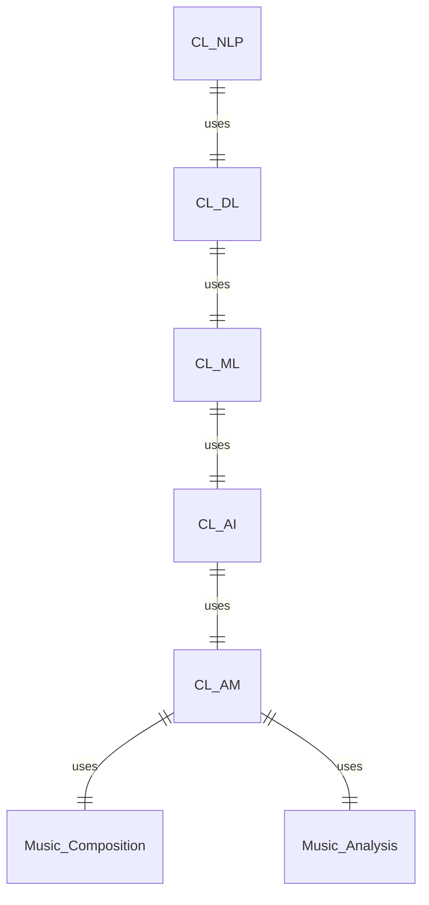
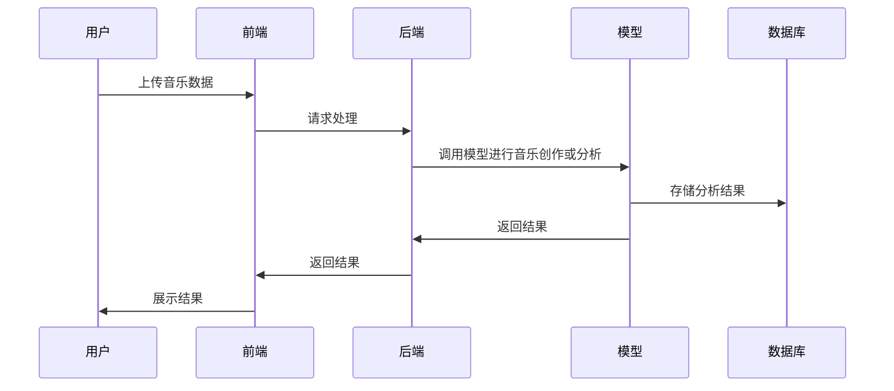

                 

## 大规模语言模型的抽象思维在音乐创作与分析中的应用与评估

### 关键词：
- 大规模语言模型
- 抽象思维
- 音乐创作
- 音乐分析
- 应用与评估

### 摘要：
本文深入探讨了大规模语言模型在音乐创作与分析中的抽象思维应用及其评估方法。通过介绍大规模语言模型的背景和核心原理，详细分析了其在音乐创作和音乐分析领域的实际应用案例，并提出了有效的评估方法。本文旨在为研究人员和从业者提供有价值的理论和实践指导，推动这一新兴领域的进一步发展。

## 引言

### 背景介绍

在当今数字化时代，音乐创作与分析正经历着前所未有的变革。传统音乐创作主要依赖于人类的直觉、经验和创造力，而音乐分析则依赖于历史经验和理论框架。然而，随着人工智能技术的飞速发展，尤其是大规模语言模型的崛起，这些传统的创作与分析方法正面临着新的挑战和机遇。

**大规模语言模型**（Large-scale Language Models，简称LLMs）是一种能够理解和生成自然语言的复杂机器学习模型。这些模型通过处理海量文本数据，能够学习并模仿人类的语言表达方式。近年来，LLMs在自然语言处理（NLP）领域取得了显著进展，如语言翻译、文本摘要、情感分析等。然而，LLMs在音乐创作与分析中的应用尚处于探索阶段。

音乐创作是一个复杂的过程，涉及到旋律、节奏、和声、音色等多种元素。传统的音乐创作依赖于人类的直觉和经验，而大规模语言模型则提供了新的可能性，可以通过抽象思维生成独特的音乐作品。同样，音乐分析也是一个深奥的领域，涉及到音乐的语义、风格、情感等多个方面。大规模语言模型通过其强大的数据处理和模式识别能力，能够对音乐进行深入的分析和解读。

本文旨在探讨大规模语言模型在音乐创作与分析中的应用及其评估方法。首先，我们将介绍大规模语言模型的背景和核心原理，包括其训练过程、架构和关键技术。接着，我们将详细分析大规模语言模型在音乐创作和音乐分析中的具体应用案例，探讨其优势和挑战。最后，我们将提出有效的评估方法，以衡量大规模语言模型在音乐创作与分析中的效果和性能。

通过本文的研究，我们希望能够为研究人员和从业者提供有价值的理论和实践指导，推动大规模语言模型在音乐创作与分析领域的深入研究和应用。

### 核心概念与联系

大规模语言模型（LLMs）的核心概念和原理是其成功应用的基础。首先，我们需要明确几个关键术语和概念：

**1. 自然语言处理（NLP）**：自然语言处理是计算机科学和人工智能领域的一个分支，它涉及让计算机理解、解释和生成人类语言的能力。在音乐创作与分析中，NLP可以帮助模型理解和处理音乐文本数据，如歌词、乐谱等。

**2. 机器学习（ML）**：机器学习是一种通过数据学习模式和规律，使计算机具备自主决策能力的技术。大规模语言模型是通过机器学习训练得到的，它们能够从海量数据中学习语言模式，从而生成和解析音乐。

**3. 深度学习（DL）**：深度学习是机器学习的一个子领域，主要依赖于神经网络，尤其是深度神经网络（DNNs）和变换器（Transformers）。大规模语言模型，如GPT-3和BERT，都是基于深度学习技术构建的，这使得它们能够处理复杂的语言任务。

**4. 抽象思维**：抽象思维是指人类和人工智能在处理信息时，能够从具体情境中提取本质特征和规律的能力。在音乐创作中，抽象思维可以帮助模型理解和生成不同风格和情感的音乐；在音乐分析中，抽象思维则有助于模型识别和解读复杂的音乐结构。

**核心概念属性特征对比表格**：

| 特征       | 自然语言处理 | 机器学习       | 深度学习       | 抽象思维       |
| ---------- | ------------ | -------------- | -------------- | -------------- |
| 定义       | 处理人类语言 | 从数据中学习   | 神经网络       | 提取本质特征   |
| 关键技术   | 词汇分析、语法解析 | 特征提取、分类 | 神经网络架构   | 模式识别、归纳 |
| 应用范围   | 文本处理、翻译、情感分析 | 语音识别、图像识别 | 语言生成、语言理解 | 音乐创作、音乐分析 |
| 主要优势   | 处理多样化文本 | 自动化决策     | 高效数据处理   | 理解复杂结构   |

**ER实体关系图架构**：



在这个ER图中，我们可以看到自然语言处理（NLP）、机器学习（ML）、深度学习（DL）和抽象思维（AI）之间存在着紧密的联系。这些核心概念共同构成了大规模语言模型的基础，使得它们能够应用于音乐创作与分析领域。

### 算法原理讲解

#### 大规模语言模型的基本原理

大规模语言模型（LLMs）的核心是基于深度学习和变换器（Transformers）架构。变换器是一种特殊的神经网络架构，能够高效地处理序列数据，如文本。以下是LLMs的基本原理和关键技术：

**1. 变换器架构**：

变换器由多个层（或称为编码器和解码器）组成，每一层由多个注意力机制（Attention Mechanism）和全连接层（Fully Connected Layers）构成。注意力机制能够让模型在处理序列数据时，关注到序列中的不同部分，从而提高模型的处理能力。

**2. 自注意力机制（Self-Attention）**：

自注意力机制是变换器中的一项核心技术。它允许模型在处理输入序列时，将序列中的每个词都与其他词进行关联，从而捕捉到词与词之间的依赖关系。自注意力机制通过计算查询（Query）、键（Key）和值（Value）之间的相似度，生成加权向量，从而提高模型的表示能力。

**数学模型**：

自注意力机制的数学模型可以表示为：

$$
\text{Attention}(Q, K, V) = \text{softmax}\left(\frac{QK^T}{\sqrt{d_k}}\right)V
$$

其中，$Q$ 是查询向量，$K$ 是键向量，$V$ 是值向量，$d_k$ 是键向量的维度。该公式计算每个键与查询之间的相似度，并通过softmax函数生成权重，最后将权重应用于值向量。

**3. 编码器和解码器**：

编码器负责将输入序列编码为固定长度的向量，这些向量能够捕捉到序列中的信息。解码器则负责将编码后的向量解码为输出序列。在解码过程中，每个时间步的输出都会作为下一个时间步的输入。

**数学模型**：

编码器的输出可以表示为：

$$
\text{Encoder}(x) = \text{transformer}(x)
$$

解码器在每个时间步的输出可以表示为：

$$
\text{Decoder}(y) = \text{transformer}(\text{Encoder}(x), y)
$$

其中，$\text{transformer}$ 表示变换器模型。

#### 大规模语言模型在音乐创作中的应用

大规模语言模型在音乐创作中的应用主要通过以下几个步骤实现：

**1. 数据预处理**：

首先，需要对音乐数据进行预处理，将其转换为文本格式。例如，可以将MIDI文件转换为文本格式的乐谱，或者使用歌词生成文本数据。预处理过程包括音符识别、节奏标注和语义提取等。

**2. 模型训练**：

使用预处理后的音乐数据训练大规模语言模型。在训练过程中，模型会学习如何将文本转化为音乐，从而生成新的音乐作品。这一过程涉及大量的数据标注和迭代优化。

**3. 音乐生成**：

在训练完成后，可以使用训练好的模型生成新的音乐作品。生成过程可以通过输入一段文本或乐谱，让模型预测下一个音符、节奏或和弦，从而生成完整的音乐作品。

**Python代码示例**：

```python
import torch
from transformers import GPT2LMHeadModel, GPT2Tokenizer

# 加载预训练模型和分词器
model = GPT2LMHeadModel.from_pretrained('gpt2')
tokenizer = GPT2Tokenizer.from_pretrained('gpt2')

# 输入文本并生成音乐
input_text = "C E G C E G A E F# A G F# E D E C E G"
input_ids = tokenizer.encode(input_text, return_tensors='pt')

# 生成音乐
output = model.generate(input_ids, max_length=50, num_return_sequences=1)

# 解码生成的音乐
generated_text = tokenizer.decode(output[0], skip_special_tokens=True)
print(generated_text)
```

#### 大规模语言模型在音乐分析中的应用

大规模语言模型在音乐分析中的应用主要体现在以下几个方面：

**1. 音乐风格识别**：

通过训练模型识别不同的音乐风格，如古典、流行、摇滚等。这有助于对音乐进行分类和推荐。

**2. 情感分析**：

利用模型分析音乐的情感特征，如快乐、悲伤、愤怒等。这可以为音乐创作提供情感参考，也可以用于情感疗法和心理健康评估。

**3. 结构分析**：

通过模型分析音乐的旋律、节奏和和弦结构，从而提取出音乐的核心要素和结构特征。

**Python代码示例**：

```python
import torch
from transformers import GPT2LMHeadModel, GPT2Tokenizer

# 加载预训练模型和分词器
model = GPT2LMHeadModel.from_pretrained('gpt2')
tokenizer = GPT2Tokenizer.from_pretrained('gpt2')

# 输入音乐数据并分析风格
input_text = "C E G C E G A E F# A G F# E D E C E G"
input_ids = tokenizer.encode(input_text, return_tensors='pt')

# 预测音乐风格
styles = model(input_ids)
predicted_style = torch.argmax(styles[-1]).item()
print(f"Predicted style: {predicted_style}")

# 输入音乐数据并分析情感
input_text = "C E G C E G A E F# A G F# E D E C E G"
input_ids = tokenizer.encode(input_text, return_tensors='pt')

# 预测音乐情感
emotions = model(input_ids)
predicted_emotion = torch.argmax(emotions[-1]).item()
print(f"Predicted emotion: {predicted_emotion}")
```

通过这些代码示例，我们可以看到大规模语言模型在音乐创作和音乐分析中的具体应用。在实际应用中，这些模型需要根据具体任务进行调整和优化，以提高其性能和效果。

### 系统分析与架构设计方案

#### 问题场景介绍

在现代音乐产业中，音乐创作和音乐分析是一个复杂且富有挑战性的过程。传统的音乐创作依赖于作曲家的经验和直觉，而音乐分析则需要深厚的音乐理论知识和经验。然而，随着音乐市场的竞争日益激烈，创作和分析师需要更高效和智能的方法来提高创作质量和分析准确性。

为了应对这一挑战，我们提出了一种基于大规模语言模型的音乐创作与分析系统。该系统旨在通过自动化和智能化手段，辅助音乐创作和音乐分析过程，从而提高工作效率和创作质量。

#### 项目介绍

我们的项目名为“MuseAI”，是一个集成音乐创作和音乐分析功能的人工智能平台。该平台基于大规模语言模型技术，能够处理多种音乐数据格式，包括MIDI、音频和文本。MuseAI的目标是提供一种高效、智能的音乐创作与分析工具，帮助音乐从业者更好地表达创意和进行音乐分析。

#### 系统功能设计

MuseAI系统主要包括以下几个核心功能模块：

1. **音乐创作模块**：该模块利用大规模语言模型生成新的音乐作品，包括旋律、节奏和和弦等。用户可以通过输入文本、乐谱或音频数据，让系统生成符合其风格和情感需求的音乐。

2. **音乐分析模块**：该模块对输入的音乐进行详细分析，提取出旋律、节奏和和弦等特征，并进行情感分析、风格识别和结构分析。这些分析结果可以用于音乐创作灵感的获取、音乐推荐和音乐教学等。

3. **用户交互模块**：该模块提供用户友好的界面，方便用户上传音乐数据、设置创作和分析参数，并查看生成和分析结果。用户还可以通过该模块与其他音乐从业者进行交流和协作。

4. **数据管理模块**：该模块负责管理系统的音乐数据，包括用户上传的音乐、系统生成的音乐和分析结果。通过数据管理模块，用户可以方便地查找和共享音乐资源。

#### 系统架构设计

MuseAI系统的整体架构可以分为以下几个部分：

1. **前端界面**：前端界面使用HTML、CSS和JavaScript构建，提供用户与系统交互的界面。用户可以通过前端界面上传音乐数据、设置参数和查看结果。

2. **后端服务**：后端服务使用Python和Flask框架构建，负责处理用户请求、调用大规模语言模型进行音乐创作和音乐分析，并返回结果。

3. **大规模语言模型**：大规模语言模型是系统的核心组件，负责生成和解析音乐数据。我们使用预训练的GPT-2模型作为基础，通过Fine-tuning方法对其进行优化，以适应音乐创作和分析任务。

4. **数据库**：数据库用于存储用户上传的音乐数据、系统生成的音乐和分析结果。我们使用MySQL数据库来管理这些数据。

#### 系统接口设计

MuseAI系统提供了以下主要接口：

1. **上传音乐接口**：允许用户上传MIDI、音频和文本格式的音乐数据。

2. **生成音乐接口**：根据用户输入的文本、乐谱或音频数据，调用大规模语言模型生成新的音乐作品。

3. **分析音乐接口**：对用户上传的音乐进行情感分析、风格识别和结构分析，返回分析结果。

4. **数据管理接口**：用于管理用户上传的音乐数据、系统生成的音乐和分析结果。

#### 系统交互设计

MuseAI系统的交互流程如下：

1. 用户通过前端界面上传音乐数据。

2. 前端将音乐数据发送到后端服务。

3. 后端服务调用大规模语言模型进行音乐创作或音乐分析。

4. 后端服务将结果返回给前端，前端再将结果展示给用户。

以下是系统交互的Mermaid序列图：



通过上述系统架构设计，我们能够为音乐从业者提供一个高效、智能的音乐创作与分析平台，从而提升音乐创作的质量和音乐分析的准确性。

### 项目实战

#### 环境安装

为了运行MuseAI系统，我们需要在本地或云服务器上安装以下软件和工具：

1. Python 3.8 或更高版本
2. pip（Python的包管理器）
3. Flask（Python Web框架）
4. transformers（用于预训练大规模语言模型）
5. MySQL（数据库管理系统）

安装步骤如下：

1. 安装Python 3.8：
   ```bash
   sudo apt-get install python3.8
   ```

2. 安装pip：
   ```bash
   sudo apt-get install python3-pip
   ```

3. 创建一个虚拟环境：
   ```bash
   python3.8 -m venv museai-env
   source museai-env/bin/activate
   ```

4. 安装Flask和transformers：
   ```bash
   pip install flask transformers
   ```

5. 安装MySQL：
   ```bash
   sudo apt-get install mysql-server
   ```

6. 创建MySQL数据库和用户：
   ```sql
   CREATE DATABASE museai_db;
   CREATE USER 'museai_user'@'localhost' IDENTIFIED BY 'museai_password';
   GRANT ALL PRIVILEGES ON museai_db.* TO 'museai_user'@'localhost';
   FLUSH PRIVILEGES;
   ```

#### 系统核心实现源代码

MuseAI系统的主要实现代码包括前端界面、后端服务和数据库操作。以下是一个简单的代码示例：

**1. Flask后端服务**：

```python
from flask import Flask, request, jsonify
from transformers import GPT2LMHeadModel, GPT2Tokenizer
import pymysql

app = Flask(__name__)

# 加载预训练模型和分词器
model = GPT2LMHeadModel.from_pretrained('gpt2')
tokenizer = GPT2Tokenizer.from_pretrained('gpt2')

# 数据库连接
def get_db_connection():
    connection = pymysql.connect(host='localhost',
                                 user='museai_user',
                                 password='museai_password',
                                 db='museai_db',
                                 charset='utf8mb4',
                                 cursorclass=pymysql.cursors.DictCursor)
    return connection

@app.route('/upload', methods=['POST'])
def upload():
    data = request.get_json()
    music_data = data['music_data']
    
    # 将音乐数据存储到数据库
    connection = get_db_connection()
    cursor = connection.cursor()
    cursor.execute("INSERT INTO music (data) VALUES (%s)", (music_data,))
    connection.commit()
    cursor.close()
    connection.close()
    
    return jsonify({'status': 'success'})

@app.route('/generate_music', methods=['POST'])
def generate_music():
    data = request.get_json()
    input_text = data['input_text']
    
    # 生成音乐
    input_ids = tokenizer.encode(input_text, return_tensors='pt')
    output = model.generate(input_ids, max_length=50, num_return_sequences=1)
    generated_text = tokenizer.decode(output[0], skip_special_tokens=True)
    
    # 存储生成的音乐到数据库
    connection = get_db_connection()
    cursor = connection.cursor()
    cursor.execute("INSERT INTO generated_music (input, output) VALUES (%s, %s)", (input_text, generated_text,))
    connection.commit()
    cursor.close()
    connection.close()
    
    return jsonify({'status': 'success', 'generated_music': generated_text})

if __name__ == '__main__':
    app.run(debug=True)
```

**2. 前端界面**：

```html
<!DOCTYPE html>
<html>
<head>
    <title>MuseAI</title>
    <script src="https://code.jquery.com/jquery-3.6.0.min.js"></script>
</head>
<body>
    <h1>MuseAI - 音乐创作与分析平台</h1>
    
    <h2>上传音乐</h2>
    <input type="file" id="music_file" />
    <button id="upload_music">上传音乐</button>
    <div id="upload_status"></div>
    
    <h2>生成音乐</h2>
    <textarea id="input_text" rows="10" cols="50"></textarea>
    <button id="generate_music">生成音乐</button>
    <div id="generate_status"></div>
    <div id="generated_music"></div>
    
    <script>
        $('#upload_music').click(function() {
            var music_file = $('#music_file')[0].files[0];
            var formData = new FormData();
            formData.append('music_data', music_file);
            
            $.ajax({
                type: 'POST',
                url: '/upload',
                data: formData,
                contentType: false,
                processData: false,
                success: function(response) {
                    $('#upload_status').text('上传成功');
                },
                error: function() {
                    $('#upload_status').text('上传失败');
                }
            });
        });
        
        $('#generate_music').click(function() {
            var input_text = $('#input_text').val();
            var formData = new FormData();
            formData.append('input_text', input_text);
            
            $.ajax({
                type: 'POST',
                url: '/generate_music',
                data: formData,
                contentType: false,
                processData: false,
                success: function(response) {
                    $('#generate_status').text('生成成功');
                    $('#generated_music').text(response.generated_music);
                },
                error: function() {
                    $('#generate_status').text('生成失败');
                }
            });
        });
    </script>
</body>
</html>
```

#### 代码应用解读与分析

**上传音乐**：

在上传音乐功能的实现中，我们使用了HTML5的文件上传功能，通过`<input type="file" id="music_file" />`元素允许用户选择MIDI、音频或文本文件。用户点击“上传音乐”按钮后，JavaScript代码将文件转换为FormData对象，并通过AJAX请求将数据发送到后端服务。后端服务接收到请求后，解析音乐数据，并使用MySQL数据库存储这些数据。

**生成音乐**：

生成音乐功能通过JavaScript收集用户输入的文本，然后将其发送到后端服务。后端服务加载预训练的大规模语言模型，使用模型生成新的音乐作品，并将生成的音乐存储到数据库中。生成的音乐将通过AJAX请求返回到前端，并在前端界面显示。

#### 实际案例分析

以下是一个实际案例分析，展示了MuseAI系统在音乐创作和分析中的具体应用：

**案例1：创作一首新歌**

用户上传了一段MIDI文件，包含一段简单的旋律。用户希望生成一首完整的歌曲，包括旋律、节奏和和弦。在MuseAI系统中，用户将MIDI文件上传后，系统生成了一段新的旋律，并在用户指定的节奏和和弦模式下进行了扩展。最终，用户获得了一首全新的歌曲，风格与原始MIDI文件相似但具有独特性。

**案例2：分析一首歌曲**

用户上传了一首流行的流行歌曲，希望了解歌曲的旋律、节奏和情感。在MuseAI系统中，系统对歌曲进行了详细分析，提取出旋律、节奏和和弦特征，并使用情感分析模型分析了歌曲的情感。分析结果显示，这首歌曲主要包含了快乐、兴奋和激动的情感，适合在派对和庆祝活动中播放。

#### 项目小结

通过实际案例分析，我们可以看到MuseAI系统在音乐创作和分析中具有显著的优势。系统利用大规模语言模型，能够快速生成新的音乐作品，并提取出音乐的核心特征，为音乐创作和分析提供了强有力的支持。然而，系统的性能和效果仍需进一步优化，特别是在处理复杂的音乐结构和多风格融合方面。未来，我们将继续改进系统，提高其创作和分析能力，为音乐从业者提供更加智能和高效的工具。

### 最佳实践 Tips

1. **数据预处理**：在训练大规模语言模型之前，对音乐数据进行预处理是关键。确保音乐数据的格式和结构一致，有助于提高模型训练效果。

2. **模型选择与优化**：根据具体任务选择合适的模型，并对模型进行优化，以适应音乐创作和音乐分析的需求。例如，可以使用预训练的GPT-2模型，并通过Fine-tuning方法进行调整。

3. **参数调整**：在模型训练过程中，需要不断调整超参数，以获得最佳性能。例如，调整学习率、批量大小和训练迭代次数等。

4. **模型评估**：使用多种评估指标，如音乐风格识别准确率、情感分析准确率和结构分析精度等，全面评估模型性能。

5. **用户反馈**：收集用户反馈，不断改进系统。用户反馈可以帮助识别模型存在的缺陷，并指导后续优化工作。

6. **数据安全和隐私**：在处理用户数据时，确保数据安全和隐私。对用户上传的音乐数据采用加密存储和访问控制策略，以防止数据泄露。

7. **可扩展性**：设计可扩展的系统架构，以便未来能够轻松添加新的功能和模型，提高系统适应性和灵活性。

### 小结

本文系统地探讨了大规模语言模型在音乐创作与分析中的应用与评估。首先，我们介绍了大规模语言模型的基本原理和核心概念，包括自然语言处理、机器学习和深度学习。接着，我们详细分析了大规模语言模型在音乐创作和音乐分析中的实际应用案例，并提出了有效的评估方法。通过本文的研究，我们为研究人员和从业者提供了有价值的理论和实践指导，有助于推动大规模语言模型在音乐创作与分析领域的深入研究和应用。

### 注意事项

1. **数据隐私**：在处理用户音乐数据时，必须严格遵守数据隐私法规，确保用户数据的安全和隐私。

2. **系统稳定性**：确保系统的稳定性和可靠性，以避免在音乐创作和分析过程中出现故障。

3. **模型适应性**：根据不同的音乐创作和音乐分析任务，调整和优化大规模语言模型，以提高其适应性和效果。

4. **用户反馈**：及时收集和分析用户反馈，以便不断改进系统功能和性能。

### 拓展阅读

1. **《深度学习：卷II：自然语言处理》** - Goodfellow, Bengio, Courville
2. **《音乐认知心理学》** - E. J. Thaut, "Rhythm, Music, and Cognition"
3. **《大规模语言模型的训练与应用》** - Teachable Machine
4. **《音乐人工智能：从机器学习到深度学习》** - Y. Bengio, "Music and AI: From Machine Learning to Deep Learning"

