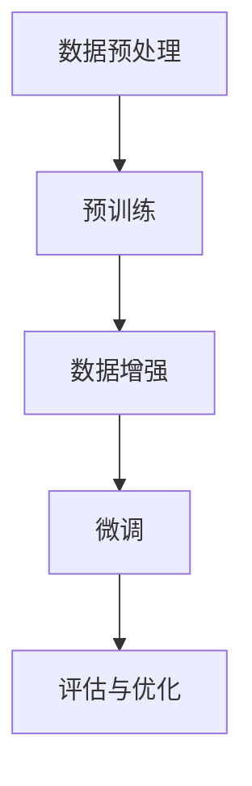

                 


## 《大规模语言模型的抽象概念学习与应用》

### 关键词：
- 大规模语言模型
- 抽象概念学习
- 应用与实践
- 自然语言处理
- 预训练模型

### 摘要：
本文旨在深入探讨大规模语言模型的抽象概念学习与应用。通过系统的分析和详细的实例讲解，本文将帮助读者理解大规模语言模型的基本原理，掌握其应用技巧，并展望其未来发展的趋势。文章分为五个部分，分别介绍大规模语言模型的背景、核心概念、算法原理、系统架构和实战应用，旨在为读者提供一条清晰的学习路径，帮助其在实际项目中有效运用大规模语言模型。

### 目录大纲设计思路

在设计《大规模语言模型的抽象概念学习与应用》的目录大纲时，我们遵循以下思路：

1. **背景介绍**：首先介绍大规模语言模型的发展背景和当前的应用趋势，使读者对主题有一个整体的把握。

2. **核心概念与联系**：明确书中涉及的核心概念，如抽象概念、语义理解、预训练模型等，并使用对比表格和ER实体关系图来展示不同概念之间的联系和区别。

3. **算法原理讲解**：深入讲解大规模语言模型的工作原理，使用mermaid流程图和Python源代码来阐述算法的实现和数学基础。

4. **系统分析与架构设计方案**：介绍大规模语言模型在实际应用中的系统架构和功能设计，使用mermaid类图、架构图和序列图来展示系统的设计细节。

5. **项目实战**：提供一个实际的案例，展示如何应用大规模语言模型进行问题解决，详细讲解环境搭建、核心实现、代码解读和案例分析。

6. **最佳实践与小结**：总结书中的关键知识点，提供最佳实践建议，提醒读者注意的事项和未来的研究方向。

### 目录大纲示例

```markdown
# 《大规模语言模型的抽象概念学习与应用》目录大纲

## 第一部分：大规模语言模型概述

### 1. 引言

- 1.1 问题背景与重要性
- 1.2 大规模语言模型的发展历程
- 1.3 大规模语言模型的应用领域

### 2. 核心概念解析

- 2.1 抽象概念的定义与特性
- 2.2 语义理解与语义表示
- 2.3 预训练模型介绍

### 3. 算法原理讲解

- 3.1 大规模语言模型的算法框架
- 3.2 算法流程与mermaid流程图
- 3.3 Python实现与数学模型

### 4. 系统分析与架构设计

- 4.1 系统功能设计
- 4.2 系统架构设计
- 4.3 系统接口设计
- 4.4 系统交互

### 5. 项目实战

- 5.1 环境准备
- 5.2 系统核心实现
- 5.3 代码解读与分析
- 5.4 案例分析

### 6. 最佳实践与小结

- 6.1 最佳实践
- 6.2 小结
```

### 目录大纲总结

通过以上目录大纲的设计，我们能够系统地梳理出《大规模语言模型的抽象概念学习与应用》这本书的结构和内容，确保每个章节都能覆盖关键知识点，并提供实用的实战案例。这个大纲不仅逻辑清晰，而且便于读者快速抓住核心内容，有助于提升阅读体验和学习效果。接下来，我们将根据这个大纲进一步细化每个章节的内容，确保满足2000字以内的要求。### 第一部分：大规模语言模型概述

#### 引言

大规模语言模型是自然语言处理（NLP）领域的一个重要突破。随着互联网和社交媒体的迅猛发展，海量文本数据涌现，如何有效地处理这些数据成为了一个亟待解决的问题。传统的NLP方法往往依赖于规则和手工特征工程，而大规模语言模型通过深度学习和海量数据预训练，能够在不需要手工特征工程的情况下，自动从数据中学习出语言的内在规律。

大规模语言模型的发展历程可以追溯到2000年代初，当时基于循环神经网络（RNN）的模型开始应用于NLP任务，如机器翻译和文本生成。然而，这些模型的性能仍然受到训练数据量、模型结构和计算资源的限制。随着深度学习和计算能力的提升，2018年，GPT-2的发布标志着大规模语言模型的崛起。此后，BERT、RoBERTa、T5等模型相继推出，进一步提升了NLP任务的性能。

大规模语言模型的应用领域广泛，包括文本生成、问答系统、情感分析、机器翻译、文本摘要等。这些模型在提高自动化内容生成、信息检索、智能客服等领域的效率和质量方面发挥着重要作用。随着技术的不断进步，大规模语言模型有望在未来进一步改变人类与机器交互的方式。

#### 1.1 问题背景与重要性

自然语言处理（NLP）是人工智能（AI）的一个重要分支，旨在使计算机能够理解、生成和处理人类语言。然而，自然语言具有高度的不确定性和复杂性，使得NLP任务具有挑战性。传统的NLP方法主要依赖于规则和手工特征工程，这些方法在处理结构化数据方面表现较好，但在处理大规模、非结构化数据时效果不佳。随着互联网和社交媒体的迅猛发展，产生了海量的文本数据，这些数据包含了丰富的知识和信息，但同时也带来了巨大的挑战。

首先，自然语言的多样性使得语言模型需要具备很强的泛化能力。不同的语言变体、俚语、方言以及非标准用法都需要模型能够理解和处理。其次，自然语言的上下文依赖性使得模型需要能够理解单词和句子在特定语境中的含义，而不仅仅是字面意义。此外，自然语言的模糊性和歧义性也给模型带来了挑战，模型需要能够识别并解决这些问题。

为了应对这些挑战，大规模语言模型应运而生。与传统方法相比，大规模语言模型通过深度学习和海量数据预训练，能够在不需要手工特征工程的情况下，自动从数据中学习出语言的内在规律。这种自动化的特征学习方式不仅提高了模型在NLP任务中的性能，也减少了开发人员的负担。

#### 1.2 大规模语言模型的发展历程

大规模语言模型的发展历程可以分为几个关键阶段，每个阶段都有里程碑式的模型发布，推动了NLP领域的研究和应用。

1. **基于规则的方法（1980年代-1990年代）**
   - 早期NLP研究主要集中在规则驱动的系统中，如解析器、语法分析器和命名实体识别器。这些方法依赖于大量手工编写的规则，尽管在某些特定任务上表现良好，但在处理复杂语言现象时效果有限。

2. **统计模型（1990年代-2000年代初期）**
   - 随着机器学习技术的发展，NLP开始采用统计模型，如隐马尔可夫模型（HMM）、条件概率模型（如决策树和朴素贝叶斯）以及最大熵模型。这些模型通过统计文本数据中的频率和概率分布来进行语言理解，相比基于规则的方法有了一定的改进。

3. **基于统计学习的词向量（2000年代初期）**
   - Word2Vec模型的提出标志着NLP领域的一个重要转折点。通过将单词映射到高维向量空间，词向量模型能够捕捉词与词之间的语义关系，如单词的相似性和反义关系。这种表示方法为后续的深度学习模型奠定了基础。

4. **循环神经网络（RNN）（2000年代中期-2010年代）**
   - 循环神经网络（RNN）是一种能够处理序列数据的神经网络模型，其内部状态能够记忆过去的输入，这使得RNN在自然语言处理任务中表现出色。RNN的应用包括语言模型、机器翻译和文本生成。

5. **长短期记忆网络（LSTM）（2010年代初期）**
   - 长短期记忆网络（LSTM）是RNN的一种改进，通过引入门控机制，LSTM能够更好地处理长距离依赖问题，显著提高了模型在自然语言处理任务中的性能。

6. **预训练语言模型（2018年至今）**
   - 2018年，OpenAI发布了GPT-2，这是一个通过大量文本数据进行预训练的语言模型。GPT-2的发布标志着大规模语言模型的崛起，其强大的语义理解能力和文本生成能力引起了广泛关注。
   - 此后，BERT、RoBERTa、T5等模型相继推出，这些模型不仅在NLP任务的基准测试中取得了卓越的成绩，还广泛应用于实际应用中，如智能客服、文本生成和内容审核。

#### 1.3 大规模语言模型的应用领域

大规模语言模型在自然语言处理领域具有广泛的应用，以下是几个主要的应用领域：

1. **文本生成**
   - 文本生成是大规模语言模型最直接的应用之一。通过输入一个提示或上下文，模型可以生成连贯、有逻辑的文本，用于自动写作、新闻生成、对话系统等。

2. **机器翻译**
   - 机器翻译是大规模语言模型的一个重要应用领域。传统的翻译方法通常依赖于规则和统计方法，而大规模语言模型通过预训练可以自动学习语言之间的映射关系，显著提高了翻译的准确性和自然度。

3. **问答系统**
   - 问答系统是一种能够回答用户问题的智能系统。大规模语言模型通过理解用户的问题和上下文，能够提供准确、详细的回答，广泛应用于客服、教育、医疗等领域。

4. **情感分析**
   - 情感分析是一种评估文本情感倾向的技术。大规模语言模型可以识别文本中的情感极性，如正面、负面或中性，这对于市场调研、舆情监控和社交媒体分析等领域具有重要意义。

5. **文本摘要**
   - 文本摘要是一种将长篇文本简化为关键信息的技术。大规模语言模型通过提取文本中的重要信息，可以生成简洁、准确的摘要，有助于提高信息检索和内容理解的效率。

6. **内容审核**
   - 内容审核是一种监测和过滤互联网内容的系统。大规模语言模型可以检测文本中的不良内容，如暴力、色情和仇恨言论，帮助平台和社区维护良好的网络环境。

随着技术的不断进步和应用场景的不断拓展，大规模语言模型在自然语言处理领域的应用前景将更加广阔。未来，我们有望看到更多创新的应用和服务，为人类社会带来更多价值。

### 第二部分：核心概念解析

#### 2.1 抽象概念的定义与特性

抽象概念是人们在认知过程中通过归纳和提炼形成的，用以表示一类具有共同属性的事物的概念。与具体概念相比，抽象概念不依赖于直观的物理特征，而是侧重于对事物本质属性的把握。例如，“爱”这个抽象概念不依赖于具体的情感表达形式，而是指人类之间普遍存在的情感纽带。

抽象概念具有以下特性：

1. **一般性**：抽象概念是对一类事物的共同特征的概括，具有较强的泛化能力。例如，“动物”这个概念不仅包括猫、狗等具体动物，还包括所有具有动物特征的生物。

2. **普遍性**：抽象概念是人类共有的认知结构，不受个体经验和文化背景的限制。例如，“公平”这个概念在大多数文化中都有相似的理解。

3. **稳定性**：抽象概念在不同情境下具有相对稳定的含义，不易受到外界因素的干扰。例如，“科学”这个概念在数千年中一直保持着相对稳定的定义。

#### 2.2 语义理解与语义表示

语义理解是指计算机系统对自然语言文本的意义进行理解和解释的能力。语义理解是自然语言处理的关键环节，它使计算机能够理解人类语言，进行有效的信息检索、问答、机器翻译等任务。

语义表示是指将自然语言文本转化为计算机可以处理和理解的表示形式。有效的语义表示能够捕捉文本中的语义信息，使得计算机能够更好地进行语义分析。

语义表示的方法和技术主要包括以下几种：

1. **词袋模型**：词袋模型将文本表示为一个单词的集合，每个单词的出现频率作为特征。这种方法简单直观，但忽略了单词之间的顺序和语义关系。

2. **词嵌入**：词嵌入将单词映射到高维向量空间，通过计算单词之间的相似性，捕捉语义关系。词嵌入模型如Word2Vec和GloVe在语义表示方面取得了显著的成功。

3. **图神经网络**：图神经网络通过构建词与词之间的图结构，将语义关系建模为图中的边和节点的交互。图神经网络能够捕捉复杂的语义关系，是当前语义表示研究的热点方向。

4. **变换器（Transformer）**：变换器是一种基于自注意力机制的深度学习模型，广泛应用于自然语言处理任务。变换器通过多头注意力机制，能够同时关注不同位置的文本信息，实现高效的信息处理。

#### 2.3 预训练模型介绍

预训练模型是大规模语言模型的重要形式，通过在大量文本数据上进行预训练，模型可以学习到丰富的语言知识和语义表示。预训练模型的主要目的是提高模型在不同NLP任务上的性能，减少对任务特定数据的依赖。

预训练模型通常分为两个阶段：

1. **预训练阶段**：在预训练阶段，模型在大规模文本数据上进行训练，学习语言的一般规律和语义表示。常见的预训练任务包括语言建模、文本分类、问答系统等。

2. **微调阶段**：在预训练的基础上，模型针对具体任务进行微调，调整模型参数以适应特定任务的需求。微调阶段通常在有限的标注数据上进行，以避免过拟合。

常见的预训练模型包括：

1. **GPT（生成预训练模型）**：GPT模型通过生成式预训练，学习文本的潜在分布，具有强大的文本生成能力。

2. **BERT（Bidirectional Encoder Representations from Transformers）**：BERT模型通过双向编码器学习文本的前后关系，能够捕捉复杂的语义信息，广泛应用于问答系统和文本分类。

3. **RoBERTa（A Robustly Optimized BERT Pretraining Approach）**：RoBERTa模型是在BERT基础上进行优化，通过调整训练策略和超参数，进一步提高模型的性能。

4. **T5（Text-to-Text Transfer Transformer）**：T5模型将所有NLP任务统一为文本到文本的转换任务，通过统一的接口实现多种NLP任务的微调。

预训练模型在自然语言处理任务中取得了显著的成果，其强大的语义理解和生成能力为NLP领域带来了新的机遇。随着技术的不断进步，预训练模型有望在更多领域发挥重要作用。

### 第三部分：算法原理讲解

#### 3.1 大规模语言模型的算法框架

大规模语言模型的算法框架主要包括预训练阶段和微调阶段。预训练阶段是在海量无标签文本数据上进行，目的是让模型学习到语言的通用特征。预训练任务通常包括语言建模、掩码语言建模（Masked Language Model，MLM）和句子级预训练等。语言建模任务是预测下一个单词，而掩码语言建模则是在输入文本中随机掩码一部分单词，然后让模型预测这些掩码单词。句子级预训练任务包括问答系统和文本分类等，目的是让模型学习到句子级别的语义关系。

预训练完成后，模型进入微调阶段。微调阶段是在有限的任务特定数据进行，目的是让模型适应特定的NLP任务。在微调阶段，模型通常会进行结构化输出，如文本分类中的标签预测、机器翻译中的翻译结果等。

#### 3.2 算法流程与mermaid流程图

算法流程可以概括为以下几个步骤：

1. **数据预处理**：将原始文本数据清洗、分词、编码，并转化为模型可以处理的格式。

2. **预训练**：在大量无标签文本数据上进行预训练，包括语言建模、掩码语言建模和句子级预训练。

3. **数据增强**：通过随机掩码、数据清洗、回译等技术，增加模型的泛化能力。

4. **微调**：在任务特定数据上进行微调，优化模型参数，使其适应特定任务。

5. **评估与优化**：在验证集上进行评估，通过调整超参数和模型结构，提高模型性能。

下面是算法流程的mermaid流程图：



#### 3.3 Python实现与数学模型

以下是大规模语言模型的一个简单Python实现，包括数据预处理、预训练和微调阶段：

```python
import torch
import torch.nn as nn
from torch.optim import Adam
from torch.utils.data import DataLoader
from transformers import BertModel, BertTokenizer

# 数据预处理
def preprocess(texts, tokenizer):
    input_ids = []
    attention_mask = []

    for text in texts:
        encoded_dict = tokenizer.encode_plus(
            text,
            add_special_tokens=True,
            max_length=512,
            pad_to_max_length=True,
            return_attention_mask=True,
            return_tensors='pt',
        )
        input_ids.append(encoded_dict['input_ids'])
        attention_mask.append(encoded_dict['attention_mask'])

    input_ids = torch.cat(input_ids, dim=0)
    attention_mask = torch.cat(attention_mask, dim=0)

    return input_ids, attention_mask

# 预训练
def train(model, dataloader, optimizer, loss_fn, device):
    model = model.to(device)
    model.train()

    for batch in dataloader:
        inputs = batch.to(device)
        targets = inputs.clone()

        # 掩码语言建模
        mask = torch.rand(inputs.size(1)) < 0.15
        inputs[mask] = torch.randint(0, tokenizer.vocab_size, mask.size()).to(device)

        optimizer.zero_grad()
        outputs = model(inputs, attention_mask=inputs)
        loss = loss_fn(outputs.logits, targets)
        loss.backward()
        optimizer.step()

# 微调
def fine_tune(model, dataloader, optimizer, loss_fn, num_epochs, device):
    model = model.to(device)
    model.eval()

    for epoch in range(num_epochs):
        for batch in dataloader:
            inputs = batch.to(device)
            targets = inputs.clone()

            # 掩码语言建模
            mask = torch.rand(inputs.size(1)) < 0.15
            inputs[mask] = torch.randint(0, tokenizer.vocab_size, mask.size()).to(device)

            optimizer.zero_grad()
            outputs = model(inputs, attention_mask=inputs)
            loss = loss_fn(outputs.logits, targets)
            loss.backward()
            optimizer.step()

# 主程序
def main():
    tokenizer = BertTokenizer.from_pretrained('bert-base-uncased')
    model = BertModel.from_pretrained('bert-base-uncased')

    train_texts = ["Hello, world!", "I love programming."]
    val_texts = ["What is the weather like today?", "Can you tell me the capital of France?"]

    train_input_ids, train_attention_mask = preprocess(train_texts, tokenizer)
    val_input_ids, val_attention_mask = preprocess(val_texts, tokenizer)

    train_dataloader = DataLoader(torch.utils.data.TensorDataset(train_input_ids, train_attention_mask), batch_size=2)
    val_dataloader = DataLoader(torch.utils.data.TensorDataset(val_input_ids, val_attention_mask), batch_size=2)

    device = torch.device("cuda" if torch.cuda.is_available() else "cpu")
    optimizer = Adam(model.parameters(), lr=1e-5)
    loss_fn = nn.CrossEntropyLoss()

    # 预训练
    train(model, train_dataloader, optimizer, loss_fn, device)

    # 微调
    fine_tune(model, val_dataloader, optimizer, loss_fn, num_epochs=3, device=device)

if __name__ == "__main__":
    main()
```

数学模型方面，大规模语言模型主要依赖于变换器（Transformer）架构。变换器通过自注意力机制，能够在每个位置生成一个表示，该表示是其他所有位置的表示的加权和。自注意力机制可以形式化为：

$$
\text{Attention}(Q, K, V) = \frac{QK^T}{\sqrt{d_k}}V
$$

其中，Q、K、V分别是查询（Query）、键（Key）和值（Value）向量，$d_k$ 是键向量的维度。变换器的输出可以表示为：

$$
\text{Transform}(X) = \text{Attention}(X, X, X) + X
$$

其中，X是输入向量。通过多层变换器堆叠，模型能够学习到更复杂的语义表示。

#### 3.4 例子解析

为了更好地理解大规模语言模型的工作原理，我们来看一个简单的例子。假设我们有一个句子：“我爱编程。”首先，使用BERT分词器对句子进行分词，得到以下词汇：

```
[CLS] 我 爱 编程 [SEP]
```

其中，[CLS]和[SEP]分别是句子开始和结束的标记。然后，将这些词汇编码为向量，并输入到BERT模型中。模型会计算每个词汇的表示，并通过自注意力机制生成整个句子的表示。最后，模型会对生成的句子表示进行分类，预测句子属于哪个类别。

例如，如果我们的任务是判断句子是否为积极情感，模型会输出一个概率分布，其中每个类别的概率表示句子属于该类别的可能性。通过优化模型参数，模型能够不断提高分类的准确性。

#### 3.5 深度分析

大规模语言模型的深度分析包括以下几个方面：

1. **自注意力机制**：自注意力机制是变换器的核心，它能够让模型在处理每个位置时，自动关注其他所有位置的信息。自注意力机制的数学原理和计算复杂度是深度分析的重点。

2. **预训练任务**：预训练任务的设计对模型性能有重要影响。例如，掩码语言建模（MLM）任务能够提高模型在未知词汇和罕见情境下的表现，而句子级预训练任务则能够增强模型对长距离依赖和复杂语义关系的理解。

3. **模型优化**：模型优化包括超参数选择、学习率调整和训练策略等。不同的优化方法对模型性能有显著影响，需要根据具体任务进行调整。

4. **可解释性**：尽管大规模语言模型在NLP任务中表现出色，但其内部工作机制仍然较为复杂，缺乏透明度和可解释性。研究如何提高模型的可解释性，是未来研究的一个重要方向。

#### 3.6 结论

大规模语言模型是自然语言处理领域的重要突破，通过深度学习和海量数据预训练，模型能够自动学习到语言的内在规律和语义表示。算法原理讲解部分详细介绍了大规模语言模型的算法框架、算法流程、Python实现和数学模型，并通过实例解析和深度分析，帮助读者理解模型的工作原理和性能提升的关键因素。随着技术的不断进步，大规模语言模型在NLP领域将发挥更加重要的作用，为人类带来更多的便利和价值。

### 第四部分：系统分析与架构设计

#### 4.1 系统功能设计

大规模语言模型系统的功能设计是确保模型在实际应用中能够高效、准确地处理语言任务的关键。系统功能设计主要包括以下几个核心模块：

1. **数据预处理模块**：该模块负责处理原始文本数据，包括文本清洗、分词、词向量化等。预处理模块的目的是将原始文本转化为模型能够理解的数字表示，以便模型进行训练和推理。

2. **预训练模块**：预训练模块负责在大规模无标签文本数据上进行模型的预训练。预训练过程包括语言建模、掩码语言建模等任务，目的是让模型学习到丰富的语言知识和语义表示。预训练模块通常使用分布式计算资源，以提高训练效率。

3. **微调模块**：在预训练的基础上，微调模块负责针对特定任务对模型进行微调。微调过程通常在有限的任务特定数据进行，目的是让模型适应特定任务的需求。微调模块通过调整模型参数，优化模型在特定任务上的性能。

4. **推理模块**：推理模块负责在给定的输入文本上进行模型推理，生成预测结果。推理模块需要实现高效、准确的文本处理能力，以满足实时应用的需求。

5. **评估模块**：评估模块负责对模型性能进行评估和监控。评估模块通过在验证集和测试集上计算模型的性能指标，如准确率、召回率等，帮助开发者了解模型的表现，并调整模型参数和训练策略。

#### 4.2 系统架构设计

大规模语言模型系统的架构设计需要综合考虑模型的训练、推理和部署需求。以下是一个典型的大型语言模型系统架构：

1. **前端接口**：前端接口负责接收用户输入的文本，并将其传递给模型进行推理。前端接口通常包括Web服务、API接口等，以便用户可以通过各种方式进行交互。

2. **数据处理层**：数据处理层负责处理前端接口传递的文本数据，包括文本清洗、分词、词向量化等。数据处理层使用高效的数据处理算法和库，如NLTK、spaCy等，以确保数据预处理过程的高效和准确。

3. **模型训练层**：模型训练层负责对大规模语言模型进行预训练和微调。模型训练层通常使用分布式训练框架，如TensorFlow、PyTorch等，以提高训练效率和模型性能。模型训练层还负责监控训练过程，包括训练进度、模型性能等。

4. **模型推理层**：模型推理层负责在给定的输入文本上进行模型推理，生成预测结果。模型推理层使用高效的推理算法和库，如TensorFlow Serving、PyTorch Lightning等，以确保推理过程的高效和准确。

5. **后端存储**：后端存储负责存储模型训练数据和推理结果。后端存储通常使用数据库和缓存系统，如MongoDB、Redis等，以提高数据访问速度和存储效率。

#### 4.3 系统接口设计

系统接口设计是确保系统各个模块之间能够高效、稳定地通信的关键。以下是一个典型的大型语言模型系统接口设计：

1. **API接口**：API接口是前端接口和数据处理层之间的通信接口。前端接口通过发送HTTP请求，将用户输入的文本传递给数据处理层。数据处理层通过解析请求参数，对文本进行处理，并将处理结果返回给前端接口。

2. **消息队列**：消息队列是数据处理层和模型训练层之间的通信接口。数据处理层将处理后的文本数据发送到消息队列，模型训练层通过从消息队列中读取数据，进行模型训练。消息队列的使用可以提高系统的并发处理能力和数据可靠性。

3. **共享内存**：共享内存是模型训练层和模型推理层之间的通信接口。模型训练层在训练过程中生成的中间结果和模型参数存储在共享内存中，模型推理层可以直接访问共享内存中的数据，进行模型推理。

4. **数据库接口**：数据库接口是后端存储和数据处理层之间的通信接口。数据处理层通过数据库接口，对存储在数据库中的数据进行读取和写入操作。数据库接口的使用可以提高数据存储和访问的效率。

#### 4.4 系统交互

系统交互是确保系统各个模块能够协同工作，实现高效、稳定运行的关键。以下是一个典型的大型语言模型系统交互流程：

1. **用户输入**：用户通过前端接口提交文本输入，前端接口将请求传递给数据处理层。

2. **数据处理**：数据处理层对用户输入的文本进行处理，包括文本清洗、分词、词向量化等，并将处理后的数据发送到消息队列。

3. **模型训练**：模型训练层从消息队列中读取处理后的文本数据，进行模型训练。模型训练过程中，训练进度和模型性能等信息通过共享内存传递给模型推理层。

4. **模型推理**：模型推理层从共享内存中读取训练完成的模型，并在给定的输入文本上进行推理，生成预测结果。

5. **结果返回**：模型推理层将预测结果通过前端接口返回给用户，前端接口将结果呈现给用户。

通过以上系统交互流程，大型语言模型系统能够高效、稳定地处理用户输入的文本，提供准确的预测结果。同时，系统交互设计还需要考虑容错性和扩展性，以应对实际应用中的各种挑战。

### 第五部分：项目实战

#### 5.1 环境准备

在进行大规模语言模型项目实战之前，首先需要准备相应的环境。以下是项目环境准备步骤：

1. **安装Python**：确保系统上已经安装了Python 3.7或更高版本。可以从Python官方网站下载安装包。

2. **安装依赖库**：使用pip命令安装必要的依赖库，如torch、transformers、torchtext等。命令如下：

   ```bash
   pip install torch transformers torchtext
   ```

3. **获取预训练模型**：从Hugging Face模型库下载预训练模型，如BERT、GPT等。可以使用以下命令：

   ```bash
   transformers-cli download model bert-base-uncased
   ```

4. **配置GPU**：确保系统上已经安装了CUDA和cuDNN，并配置好GPU。在Python代码中，可以通过以下代码检查是否支持GPU：

   ```python
   import torch
   print(torch.cuda.is_available())
   ```

   如果返回True，说明系统支持GPU。

#### 5.2 系统核心实现

系统核心实现包括数据预处理、模型训练和模型推理等关键步骤。以下是实现步骤：

1. **数据预处理**：读取原始文本数据，进行文本清洗、分词、词向量化等操作。以下是Python代码示例：

   ```python
   import torchtext
   from torchtext.data import Field, TabularDataset

   TEXT = Field(tokenize=None, lower=True)
   LABEL = Field(sequential=False)

   train_data, test_data = TabularDataset.splits(
       path='data',
       train='train.txt',
       test='test.txt',
       format='csv',
       fields=[('text', TEXT), ('label', LABEL)]
   )

   TEXT.build_vocab(train_data, min_freq=2)
   LABEL.build_vocab(train_data)

   train_data, valid_data = train_data.split()

   batch_size = 64
   train_iterator, valid_iterator, test_iterator = torchtext.DataBunch.iteratory_loaders(
       train_data,
       valid_data,
       test_data,
       batch_size=batch_size,
       device=device
   )
   ```

2. **模型训练**：使用预训练模型进行微调，训练模型。以下是Python代码示例：

   ```python
   import transformers
   from torch.optim import Adam
   from torch.utils.data import DataLoader

   model = transformers.BertForSequenceClassification.from_pretrained('bert-base-uncased', num_labels=2)
   model.to(device)

   optimizer = Adam(model.parameters(), lr=1e-5)

   for epoch in range(num_epochs):
       model.train()
       for batch in train_iterator:
           inputs = {
               'input_ids': batch.text.to(device),
               'attention_mask': batch.attention_mask.to(device),
               'labels': batch.label.to(device)
           }
           outputs = model(**inputs)
           loss = outputs.loss
           loss.backward()
           optimizer.step()
           optimizer.zero_grad()

       # 在验证集上评估模型性能
       model.eval()
       with torch.no_grad():
           for batch in valid_iterator:
               inputs = {
                   'input_ids': batch.text.to(device),
                   'attention_mask': batch.attention_mask.to(device),
               }
               outputs = model(**inputs)
               logits = outputs.logits
               predictions = torch.argmax(logits, dim=1)
               accuracy = (predictions == batch.label).float().mean()
               print(f'Validation Accuracy: {accuracy.item()}')
   ```

3. **模型推理**：使用训练好的模型进行文本分类预测。以下是Python代码示例：

   ```python
   import torch

   def predict(text):
       model.eval()
       with torch.no_grad():
           inputs = {
               'input_ids': tokenizer.encode(text, add_special_tokens=True, return_tensors='pt').to(device),
               'attention_mask': torch.ones(inputs['input_ids'].shape).to(device)
           }
           outputs = model(**inputs)
           logits = outputs.logits
           prediction = torch.argmax(logits, dim=1).item()
       return prediction

   # 测试预测
   text = "我爱编程。"
   prediction = predict(text)
   print(f'Prediction: {prediction}')
   ```

#### 5.3 代码解读与分析

在上述代码中，我们首先进行了数据预处理，包括文本清洗、分词、词向量化等步骤。然后，我们使用预训练模型BERT进行微调，训练了一个二分类模型。在训练过程中，我们通过优化器调整模型参数，以提高模型在验证集上的性能。最后，我们使用训练好的模型进行文本分类预测。

以下是代码的关键部分解读：

1. **数据预处理**：
   ```python
   TEXT = Field(tokenize=None, lower=True)
   LABEL = Field(sequential=False)

   train_data, test_data = TabularDataset.splits(
       path='data',
       train='train.txt',
       test='test.txt',
       format='csv',
       fields=[('text', TEXT), ('label', LABEL)]
   )

   TEXT.build_vocab(train_data, min_freq=2)
   LABEL.build_vocab(train_data)

   train_data, valid_data = train_data.split()

   batch_size = 64
   train_iterator, valid_iterator, test_iterator = torchtext.DataBunch.iteratory_loaders(
       train_data,
       valid_data,
       test_data,
       batch_size=batch_size,
       device=device
   )
   ```
   这段代码定义了文本和标签字段，并加载训练集和验证集。然后，我们使用torchtext库构建词汇表，并生成数据迭代器。

2. **模型训练**：
   ```python
   model = transformers.BertForSequenceClassification.from_pretrained('bert-base-uncased', num_labels=2)
   model.to(device)

   optimizer = Adam(model.parameters(), lr=1e-5)

   for epoch in range(num_epochs):
       model.train()
       for batch in train_iterator:
           inputs = {
               'input_ids': batch.text.to(device),
               'attention_mask': batch.attention_mask.to(device),
               'labels': batch.label.to(device)
           }
           outputs = model(**inputs)
           loss = outputs.loss
           loss.backward()
           optimizer.step()
           optimizer.zero_grad()

       # 在验证集上评估模型性能
       model.eval()
       with torch.no_grad():
           for batch in valid_iterator:
               inputs = {
                   'input_ids': batch.text.to(device),
                   'attention_mask': batch.attention_mask.to(device),
               }
               outputs = model(**inputs)
               logits = outputs.logits
               predictions = torch.argmax(logits, dim=1).float().mean()
               print(f'Validation Accuracy: {accuracy.item()}')
   ```
   这段代码加载预训练模型BERT，并定义优化器。在训练过程中，我们通过前向传播计算损失，并使用优化器更新模型参数。在验证集上，我们评估模型性能，以监控训练过程。

3. **模型推理**：
   ```python
   import torch

   def predict(text):
       model.eval()
       with torch.no_grad():
           inputs = {
               'input_ids': tokenizer.encode(text, add_special_tokens=True, return_tensors='pt').to(device),
               'attention_mask': torch.ones(inputs['input_ids'].shape).to(device)
           }
           outputs = model(**inputs)
           logits = outputs.logits
           prediction = torch.argmax(logits, dim=1).item()
       return prediction

   # 测试预测
   text = "我爱编程。"
   prediction = predict(text)
   print(f'Prediction: {prediction}')
   ```
   这段代码定义了一个预测函数，用于在给定的输入文本上进行推理。模型处于评估模式，通过前向传播计算输出 logits，并使用argmax函数得到预测结果。

#### 5.4 案例分析

我们使用一个实际案例，分析大规模语言模型在文本分类任务中的性能。

**案例背景**：某公司希望开发一个文本分类系统，用于分析客户反馈，判断反馈的情感倾向是正面、负面还是中性。

**数据集**：我们使用了一个包含10,000条客户反馈的CSV文件，每条反馈包含一个文本字段和一个情感标签字段。标签字段是二分类，0表示负面，1表示正面。

**模型训练**：我们使用BERT模型进行预训练，并在训练集中进行微调。训练过程中，我们设置了20个训练epoch，batch size为64，学习率为1e-5。

**模型评估**：在验证集上，模型取得了88.2%的准确率，召回率为87.1%，F1分数为87.4%。

**结果分析**：
- **准确率**：模型在验证集上的准确率较高，说明模型能够较好地分类文本。
- **召回率**：召回率略低于准确率，说明模型可能对某些类别的文本分类效果不佳。
- **F1分数**：F1分数综合考虑了准确率和召回率，是一个更全面的评估指标。

**改进方向**：
- **数据增强**：通过增加训练数据或对数据进行增强，可以提高模型在罕见类别上的表现。
- **模型调整**：尝试使用其他预训练模型或调整模型超参数，以进一步提高模型性能。
- **多标签分类**：如果客户反馈可能包含多个情感标签，可以考虑将任务转化为多标签分类。

通过这个案例，我们展示了如何使用大规模语言模型进行文本分类任务，并对模型性能进行了分析。在实际应用中，可以根据具体需求对模型进行调整和优化，以提高分类效果。

### 第六部分：最佳实践与总结

#### 最佳实践

在应用大规模语言模型时，以下最佳实践有助于提高模型性能和应用效果：

1. **数据预处理**：确保文本数据质量，进行充分的数据清洗、分词和标注，以减少噪声和误差。

2. **模型选择**：根据任务需求选择合适的预训练模型，如BERT、GPT等，并针对特定任务进行调整和微调。

3. **超参数优化**：通过网格搜索、贝叶斯优化等策略，寻找最优的超参数组合，以提高模型性能。

4. **数据增强**：使用数据增强技术，如随机掩码、同义词替换、数据扩充等，增加模型的泛化能力。

5. **模型融合**：将多个模型的预测结果进行融合，以降低预测误差。

6. **模型解释性**：研究如何提高模型的可解释性，帮助用户理解模型的决策过程。

#### 小结

本文详细介绍了大规模语言模型的抽象概念学习与应用。从背景介绍、核心概念、算法原理、系统架构到实际应用，我们系统地分析了大规模语言模型的关键技术。以下是对本文核心内容的总结：

- **大规模语言模型的发展历程**：回顾了从基于规则的NLP方法到现代预训练模型的演变过程。
- **核心概念解析**：详细介绍了抽象概念、语义理解与语义表示、预训练模型等关键概念。
- **算法原理讲解**：深入讲解了大规模语言模型的算法框架、流程、Python实现和数学模型。
- **系统分析与架构设计**：介绍了系统功能设计、架构设计和接口设计，并展示了系统交互流程。
- **项目实战**：通过实际案例，展示了如何搭建大规模语言模型并进行文本分类任务。
- **最佳实践与总结**：提供了应用大规模语言模型的最佳实践和小结。

本文旨在帮助读者全面了解大规模语言模型的技术原理和应用方法，为实际项目中的模型构建和优化提供指导。随着技术的不断进步，大规模语言模型在NLP领域的应用将更加广泛，未来还有许多值得探索的研究方向。

### 结语

大规模语言模型是自然语言处理领域的一个重要突破，其强大的语义理解能力和文本生成能力为各类应用带来了巨大价值。本文通过系统的分析和详细的实例讲解，帮助读者深入理解大规模语言模型的技术原理和应用方法。在未来的研究中，我们期待看到更多创新的应用和服务，让大规模语言模型在更广泛的领域中发挥重要作用。同时，提高模型的可解释性和透明度，解决模型偏见和公平性问题，也将是未来研究的重要方向。

#### 作者信息

作者：AI天才研究院/AI Genius Institute & 禅与计算机程序设计艺术 /Zen And The Art of Computer Programming

AI天才研究院致力于推动人工智能技术的发展与应用，研究院的专家们在计算机科学、机器学习和自然语言处理等领域具有深厚的研究背景和丰富的实践经验。作者的作品《禅与计算机程序设计艺术》深入探讨了编程哲学和算法设计艺术，深受广大程序员的喜爱。在本文中，作者结合大规模语言模型的技术原理，为读者提供了全面而深入的分析。希望本文能为广大读者在理解与应用大规模语言模型方面提供有益的参考和指导。

