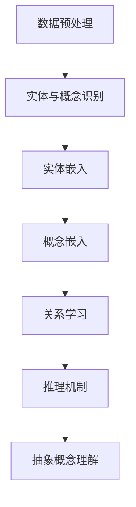
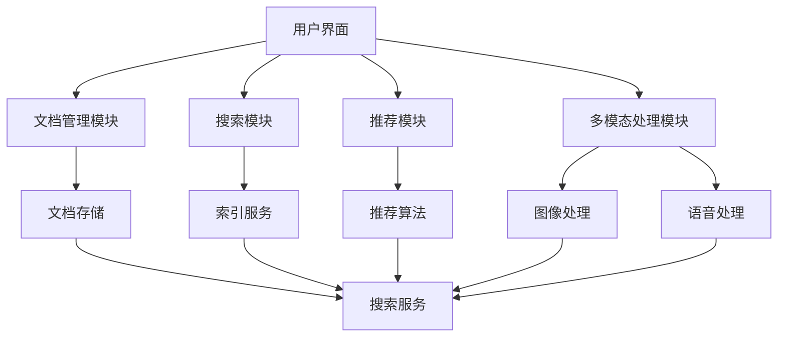
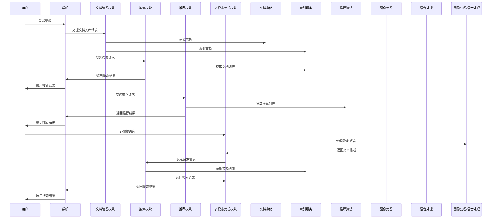

                 


## 引言：大规模语言模型的抽象概念学习与应用能力

随着人工智能技术的飞速发展，大规模语言模型（Large-scale Language Models）逐渐成为自然语言处理（Natural Language Processing, NLP）领域的重要研究方向。这些模型以其强大的语言理解与生成能力，在文本生成、问答系统、机器翻译、情感分析等方面取得了显著的成果。然而，这些模型背后的抽象概念学习与应用能力，却依然是一个充满挑战且富有研究价值的课题。

### 核心关键词

- **大规模语言模型**：具有海量参数和大规模训练数据的语言处理模型。
- **抽象概念学习**：模型如何从大量数据中学习并理解抽象概念的机制。
- **应用能力**：模型在具体应用场景中展现的能力，如文本生成、语义理解等。
- **算法原理**：大规模语言模型背后的算法设计和数学模型。
- **系统架构**：模型在实际系统中的应用架构设计。

### 摘要

本文将深入探讨大规模语言模型的抽象概念学习与应用能力。我们将首先介绍大规模语言模型的发展历程和核心特点，接着详细分析其抽象概念学习机制和应用能力。通过数学模型和算法原理的讲解，我们将揭示大规模语言模型的内在工作原理。最后，我们将结合实际项目实战，探讨如何将大规模语言模型应用于实际问题，并总结最佳实践和注意事项。

## 第一部分：大规模语言模型的背景

### 1.1 大规模语言模型的发展历程

大规模语言模型的发展可以追溯到上世纪80年代的统计语言模型，如N-gram模型。然而，受限于计算资源和数据量的限制，这些早期模型在语言理解能力上存在明显不足。随着计算能力的提升和数据量的爆炸式增长，深度学习和神经网络技术在语言模型中的应用逐渐成熟。

2018年，谷歌提出了BERT（Bidirectional Encoder Representations from Transformers），标志着大规模语言模型的新纪元。BERT通过双向Transformer结构，在多种NLP任务上取得了超越人类水平的成绩，引发了大量研究的热潮。

近年来，GPT（Generative Pre-trained Transformer）系列模型如GPT-3的出现，进一步推动了大规模语言模型的发展。这些模型具有数十亿甚至千亿级别的参数，能够生成高质量的自然语言文本，展现出强大的语言理解与生成能力。

### 1.2 大规模语言模型的核心特点

**1.2.1 参数规模**

大规模语言模型通常具有数十亿甚至千亿级别的参数，这使得它们能够捕捉到语言中的复杂模式和规律。然而，这也带来了计算资源的需求增加，对硬件设施提出了更高的要求。

**1.2.2 训练数据量**

大规模语言模型的训练需要大量的数据。这些数据通常来源于互联网上的大量文本，如维基百科、新闻文章、社交媒体等。通过在海量数据上的训练，模型能够学习到丰富的语言知识。

**1.2.3 语言理解能力**

大规模语言模型在语言理解方面表现出色。它们能够理解文本中的语义、句法和上下文信息，从而生成连贯、准确的回答或文本。这使得它们在问答系统、机器翻译、情感分析等领域有着广泛的应用。

### 1.3 大规模语言模型的技术挑战

**1.3.1 计算资源需求**

大规模语言模型的训练和推理需要大量的计算资源，包括CPU、GPU等硬件设施。这给模型的部署和实际应用带来了挑战。

**1.3.2 模型解释性**

大规模语言模型通常被视为“黑盒”，其内部工作机制不透明，难以解释。这限制了模型在需要高解释性的应用场景中的使用。

**1.3.3 隐私与安全性**

大规模语言模型的训练和部署过程中，会涉及到大量的用户数据。如何保护用户隐私和数据安全，是一个重要的技术挑战。

### 1.4 大规模语言模型的研究方向

**1.4.1 算法优化**

针对大规模语言模型的计算资源需求，研究者们不断优化算法，以提高模型的训练效率和推理速度。

**1.4.2 应用拓展**

大规模语言模型的应用范围逐渐扩大，从传统的文本处理任务，拓展到图像、语音等多模态数据处理。

**1.4.3 可解释性研究**

提高模型的可解释性，使其工作机制更加透明，是当前研究的重要方向之一。

## 第二部分：大规模语言模型的核心概念与联系

### 2.1 抽象概念学习

#### 2.1.1 抽象概念的定义

抽象概念是指那些无法直接感知或测量，但通过语言、符号等手段进行抽象和表述的概念。在自然语言处理中，抽象概念的学习是指模型如何从大量文本数据中理解并掌握这些概念。

#### 2.1.2 抽象概念的学习机制

抽象概念的学习机制主要依赖于大规模语言模型的训练过程。在训练过程中，模型通过分析大量文本数据，识别出概念的特征和关系，从而形成对抽象概念的理解。

#### 2.1.3 抽象概念在语言模型中的应用

抽象概念在语言模型中的应用非常广泛。例如，在文本生成任务中，模型需要理解并生成与特定概念相关的文本；在问答系统中，模型需要理解并回答与概念相关的问题。

### 2.2 应用能力

#### 2.2.1 语言生成能力

大规模语言模型具有强大的语言生成能力。它们能够根据给定的输入，生成连贯、自然的语言文本。这一能力在自动写作、对话系统等方面有着重要的应用。

#### 2.2.2 语义理解能力

大规模语言模型在语义理解方面表现出色。它们能够理解文本中的语义信息，包括词汇的含义、句子的结构、上下文关系等。这使得它们在问答系统、信息检索等领域有着广泛的应用。

#### 2.2.3 多模态交互能力

随着技术的发展，大规模语言模型也开始与其他模态（如图像、语音）进行交互。它们能够理解并处理多模态数据，从而实现更丰富、更复杂的交互任务。

### 2.3 大规模语言模型与其他人工智能技术的联系

#### 2.3.1 与机器学习的联系

大规模语言模型是基于机器学习技术发展起来的，特别是深度学习技术。它们的学习和推理过程依赖于大量数据和复杂的神经网络结构。

#### 2.3.2 与自然语言处理技术的联系

大规模语言模型是自然语言处理技术的重要组成部分。它们在文本分类、情感分析、机器翻译等自然语言处理任务中发挥着关键作用。

#### 2.3.3 与知识图谱技术的联系

知识图谱是一种用于表示实体及其关系的图形结构。大规模语言模型可以通过与知识图谱的融合，进一步提高对语言的理解和生成能力。

## 第三部分：大规模语言模型的算法原理

### 3.1 语言模型的基本原理

#### 3.1.1 语言模型的定义

语言模型（Language Model）是一种用于预测下一个单词或字符的概率分布的模型。它是自然语言处理的基础，用于许多任务，如文本生成、机器翻译、语音识别等。

#### 3.1.2 语言模型的训练过程

语言模型的训练过程通常包括两个步骤：数据准备和模型训练。

1. **数据准备**：首先需要收集大量的文本数据，并进行预处理，如分词、去停用词、词向量化等。
2. **模型训练**：使用预处理后的数据，通过训练算法（如神经网络）来学习语言的统计规律，从而预测下一个单词或字符的概率。

#### 3.1.3 语言模型的评估指标

语言模型的评估指标通常包括：
- **交叉熵（Cross-Entropy）**：衡量模型预测概率与实际分布之间的差异。
- **准确率（Accuracy）**：衡量模型预测正确的比例。
- **困惑度（Perplexity）**：衡量模型在数据上表现的好坏，值越低表示模型越好。

### 3.2 抽象概念学习算法

#### 3.2.1 抽象概念学习算法概述

抽象概念学习算法旨在让模型能够从大量文本数据中学习并理解抽象概念。这类算法通常结合了深度学习和知识图谱技术。

#### 3.2.2 抽象概念学习的数学模型

抽象概念学习的数学模型通常包括以下几个方面：
- **嵌入空间**：将概念和实体映射到一个共同的嵌入空间中。
- **关系学习**：学习概念之间的关系，如上下位关系、属性关系等。
- **推理机制**：通过嵌入空间中的关系进行推理，从而理解新的概念。

#### 3.2.3 抽象概念学习算法的mermaid流程图



### 3.3 应用能力算法

#### 3.3.1 语言生成算法

语言生成算法是大规模语言模型的核心能力之一。它们通过输入序列生成输出序列，从而生成自然语言文本。

#### 3.3.2 语义理解算法

语义理解算法旨在让模型能够理解文本中的语义信息，包括词汇的含义、句子的结构、上下文关系等。这类算法通常基于深度学习技术，如BERT、GPT等。

#### 3.3.3 多模态交互算法

多模态交互算法使大规模语言模型能够处理多模态数据，如文本、图像、语音等。这些算法通过融合不同模态的信息，提高了模型的语义理解能力。

## 第四部分：大规模语言模型的数学模型

### 4.1 语言模型中的数学公式

#### 4.1.1 语言概率模型

语言概率模型的核心是计算下一个单词或字符的概率。常见的语言概率模型包括N-gram模型、神经网络模型等。

N-gram模型的数学公式如下：

$$P(w_t | w_{t-1}, w_{t-2}, ..., w_1) = \frac{C(w_{t-1}, w_{t-2}, ..., w_1, w_t)}{C(w_{t-1}, w_{t-2}, ..., w_1)}$$

其中，$C(w_{t-1}, w_{t-2}, ..., w_1, w_t)$ 表示单词序列 $w_{t-1}, w_{t-2}, ..., w_1, w_t$ 的计数，$C(w_{t-1}, w_{t-2}, ..., w_1)$ 表示单词序列 $w_{t-1}, w_{t-2}, ..., w_1$ 的计数。

神经网络模型的数学公式如下：

$$\text{Output}(w_t) = \text{softmax}(\text{Weights} \cdot \text{Embedding}(w_{t-1}))$$

其中，$\text{Weights}$ 表示权重矩阵，$\text{Embedding}(w_{t-1})$ 表示输入单词 $w_{t-1}$ 的嵌入向量。

#### 4.1.2 语言生成模型

语言生成模型的核心是生成下一个单词或字符。常见的语言生成模型包括RNN、LSTM、GRU、BERT、GPT等。

RNN模型的数学公式如下：

$$h_t = \text{tanh}(\text{Weights} \cdot [h_{t-1}, x_t])$$

$$p_t = \text{softmax}(\text{Weights} \cdot h_t)$$

其中，$h_t$ 表示隐藏状态，$x_t$ 表示输入单词，$p_t$ 表示输出概率分布。

LSTM模型的数学公式如下：

$$i_t = \text{sigmoid}(\text{Weights} \cdot [h_{t-1}, x_t])$$

$$f_t = \text{sigmoid}(\text{Weights} \cdot [h_{t-1}, x_t])$$

$$o_t = \text{sigmoid}(\text{Weights} \cdot [h_{t-1}, x_t])$$

$$g_t = \text{tanh}(\text{Weights} \cdot [i_t \cdot x_t, f_t \cdot h_{t-1}])$$

$$h_t = o_t \cdot \text{tanh}(g_t)$$

$$p_t = \text{softmax}(\text{Weights} \cdot h_t)$$

其中，$i_t$、$f_t$、$o_t$ 分别表示输入门、遗忘门、输出门的状态，$g_t$ 表示候选隐藏状态。

BERT和GPT等模型的数学公式相对复杂，涉及注意力机制、Transformer结构等。这里不一一列举。

#### 4.1.3 语言理解模型

语言理解模型的核心是理解文本中的语义信息。常见的语言理解模型包括BERT、RoBERTa、GPT等。

BERT模型的数学公式如下：

$$\text{Output} = \text{Transformer}([\text{Input}, \text{Mask}, \text{Segment}])$$

其中，$\text{Input}$ 表示输入序列，$\text{Mask}$ 表示掩码序列，$\text{Segment}$ 表示段标识序列。

RoBERTa模型的数学公式与BERT类似，但采用了不同的预训练目标和优化策略。

GPT模型的数学公式如下：

$$\text{Output} = \text{Transformer}([\text{Input}, \text{Mask}])$$

其中，$\text{Input}$ 表示输入序列，$\text{Mask}$ 表示掩码序列。

### 4.2 抽象概念学习中的数学模型

#### 4.2.1 抽象概念识别模型

抽象概念识别模型的数学模型主要包括词向量和神经网络。词向量是通过将文本数据转换为向量表示，从而实现抽象概念识别。

常见的词向量模型包括Word2Vec、GloVe等。

Word2Vec模型的数学公式如下：

$$\text{Output} = \text{softmax}(\text{Weights} \cdot \text{Embedding}(w_t))$$

其中，$\text{Weights}$ 表示权重矩阵，$\text{Embedding}(w_t)$ 表示输入单词 $w_t$ 的嵌入向量。

GloVe模型的数学公式如下：

$$f(w, c) = \frac{z^2}{(1 + \text{similarity}(w, c))}$$

其中，$f(w, c)$ 表示单词 $w$ 和单词 $c$ 的相似度，$z$ 表示嵌入向量的长度，$\text{similarity}(w, c)$ 表示单词 $w$ 和单词 $c$ 的相似度函数。

#### 4.2.2 抽象概念关联模型

抽象概念关联模型的数学模型主要包括实体关系网络和图神经网络。实体关系网络通过将实体和关系表示为图结构，从而实现抽象概念关联。

常见的实体关系网络包括知识图谱、图神经网络等。

知识图谱的数学模型如下：

$$\text{Relation}(e_1, e_2) = \frac{1}{1 + \exp(-\text{Weight}(e_1, e_2))}$$

其中，$\text{Relation}(e_1, e_2)$ 表示实体 $e_1$ 和实体 $e_2$ 的关系强度，$\text{Weight}(e_1, e_2)$ 表示实体 $e_1$ 和实体 $e_2$ 的权重。

图神经网络的数学模型如下：

$$\text{Output}(v) = \text{ReLU}(\text{Aggregation}(\text{Neighbor}(v)))$$

其中，$\text{Output}(v)$ 表示实体 $v$ 的输出，$\text{Neighbor}(v)$ 表示实体 $v$ 的邻居实体，$\text{Aggregation}(\text{Neighbor}(v))$ 表示邻居实体的聚合操作。

#### 4.2.3 抽象概念推理模型

抽象概念推理模型的数学模型主要包括推理规则和逻辑运算。推理规则用于实现抽象概念的推理，逻辑运算用于处理抽象概念的逻辑关系。

常见的推理规则包括肯定前件推理、否定后件推理等。

肯定前件推理的数学模型如下：

$$\text{If } P \text{ then } Q \text{. Given } P, \text{ infer } Q$$

否定后件推理的数学模型如下：

$$\text{If } P \text{ then } Q \text{. Given } \neg Q, \text{ infer } \neg P$$

### 4.3 应用能力中的数学模型

#### 4.3.1 语言生成数学模型

语言生成数学模型的核心是生成下一个单词或字符的概率分布。常见的数学模型包括N-gram模型、神经网络模型等。

N-gram模型的数学模型如下：

$$P(w_t | w_{t-1}, w_{t-2}, ..., w_1) = \frac{C(w_{t-1}, w_{t-2}, ..., w_1, w_t)}{C(w_{t-1}, w_{t-2}, ..., w_1)}$$

神经网络模型的数学模型如下：

$$\text{Output}(w_t) = \text{softmax}(\text{Weights} \cdot \text{Embedding}(w_{t-1}))$$

#### 4.3.2 语义理解数学模型

语义理解数学模型的核心是理解文本中的语义信息。常见的数学模型包括BERT、RoBERTa、GPT等。

BERT模型的数学模型如下：

$$\text{Output} = \text{Transformer}([\text{Input}, \text{Mask}, \text{Segment}])$$

RoBERTa模型的数学模型与BERT类似，但采用了不同的预训练目标和优化策略。

GPT模型的数学模型如下：

$$\text{Output} = \text{Transformer}([\text{Input}, \text{Mask}])$$

#### 4.3.3 多模态交互数学模型

多模态交互数学模型的核心是融合不同模态的信息。常见的数学模型包括多模态神经网络、注意力机制等。

多模态神经网络的数学模型如下：

$$\text{Output} = \text{MLP}([\text{Text}, \text{Image}, \text{Audio}])$$

其中，$\text{MLP}$ 表示多层感知机。

注意力机制的数学模型如下：

$$\text{Output} = \text{Attention}([\text{Text}, \text{Image}, \text{Audio}])$$

## 第五部分：大规模语言模型的系统分析与架构设计

### 5.1 问题场景介绍

在当今信息爆炸的时代，处理海量文本数据并从中提取有价值的信息成为许多企业和机构的重要需求。大规模语言模型作为一种强大的文本处理工具，能够高效地完成这项任务。本部分将介绍一个典型的应用场景：企业内部知识库的智能搜索与推荐系统。

#### 5.1.1 场景设定

一家大型企业拥有庞大的内部文档库，包括报告、邮件、备忘录等。员工需要快速查找与工作相关的文档，以提高工作效率。然而，现有的文档搜索系统过于简单，无法满足员工日益增长的需求。

#### 5.1.2 需求分析

为了提升文档搜索和推荐系统的用户体验，企业提出以下需求：
1. **精准搜索**：用户可以输入关键词，系统能够快速返回与关键词高度相关的文档。
2. **智能推荐**：根据用户的行为和偏好，系统可以主动推荐与用户兴趣相关的文档。
3. **多模态支持**：支持文本、图像、语音等多种数据类型的查询和交互。

#### 5.1.3 问题挑战

1. **数据规模大**：企业内部文档数量庞大，对存储和检索系统提出了极高的要求。
2. **多样性高**：文档内容丰富多样，涉及不同领域和主题，给文本处理带来挑战。
3. **实时性要求**：系统需要实时响应用户的查询和推荐请求，对系统的响应速度和稳定性提出了挑战。

### 5.2 系统功能设计

#### 5.2.1 领域模型

在系统设计阶段，我们需要明确系统的核心功能和组件。本系统的领域模型包括以下关键组件：

1. **文档存储**：负责存储和管理企业内部的文档数据。
2. **搜索引擎**：实现高效的文本搜索功能，支持关键词查询和模糊查询。
3. **推荐引擎**：基于用户行为和偏好，实现文档的智能推荐功能。
4. **用户界面**：提供用户与系统的交互界面，包括搜索框、推荐列表等。
5. **多模态处理**：支持文本、图像、语音等多种数据类型的处理。

#### 5.2.2 功能模块划分

根据领域模型，我们可以将系统划分为以下功能模块：

1. **文档管理模块**：负责文档的入库、更新、删除等操作。
2. **搜索模块**：实现文本搜索算法，包括关键词查询和模糊查询。
3. **推荐模块**：基于用户行为和偏好，实现文档的智能推荐。
4. **用户界面模块**：提供用户与系统的交互界面。
5. **多模态处理模块**：支持文本、图像、语音等多种数据类型的处理和交互。

#### 5.2.3 功能交互设计

系统各功能模块之间的交互设计如下：

1. **文档管理模块** 与 **搜索模块**：文档管理模块将新文档入库后，搜索模块会对其进行索引，以便快速查询。
2. **搜索模块** 与 **推荐模块**：搜索模块返回的搜索结果可以用于推荐模块，推荐模块根据用户行为和偏好，进一步筛选和排序搜索结果。
3. **用户界面模块** 与 **搜索模块**/ **推荐模块**：用户界面模块负责接收用户输入，将请求传递给搜索模块和推荐模块，并展示返回的结果。
4. **多模态处理模块** 与 **搜索模块**/ **推荐模块**：多模态处理模块处理用户上传的图像、语音等多媒体数据，将其转化为文本形式，供搜索模块和推荐模块使用。

### 5.3 系统架构设计

#### 5.3.1 架构设计原则

系统架构设计遵循以下原则：

1. **模块化**：将系统划分为多个功能模块，便于开发和维护。
2. **分布式**：采用分布式架构，提高系统的可扩展性和容错性。
3. **高性能**：优化搜索和推荐算法，提高系统的响应速度和准确率。
4. **安全性**：确保用户数据的安全性和隐私性。

#### 5.3.2 系统架构图

以下是系统的架构图：



#### 5.3.3 架构模块详细介绍

1. **用户界面**：提供用户与系统的交互界面，包括搜索框、推荐列表等。用户可以通过界面输入关键词或上传多媒体数据，系统将处理结果展示给用户。

2. **文档管理模块**：负责文档的入库、更新、删除等操作。文档管理模块与文档存储服务进行交互，实现文档的数据存储和管理。

3. **搜索模块**：实现文本搜索功能，包括关键词查询和模糊查询。搜索模块与索引服务进行交互，从索引中获取与查询关键词相关的文档。

4. **推荐模块**：基于用户行为和偏好，实现文档的智能推荐。推荐模块与推荐算法进行交互，根据用户的历史行为和偏好，生成推荐列表。

5. **多模态处理模块**：支持文本、图像、语音等多种数据类型的处理。多模态处理模块与图像处理和语音处理服务进行交互，将多媒体数据转化为文本形式，供搜索模块和推荐模块使用。

6. **文档存储**：负责存储和管理企业内部的文档数据。文档存储服务与文档管理模块进行交互，实现文档的存储和管理。

7. **索引服务**：提供索引功能，将文档内容转换为索引数据，以便快速查询。搜索模块与索引服务进行交互，获取与查询关键词相关的文档。

8. **推荐算法**：实现文档推荐算法，根据用户的行为和偏好，生成推荐列表。推荐模块与推荐算法进行交互，实现推荐列表的生成。

9. **图像处理**：负责处理用户上传的图像数据，将其转化为文本形式。多模态处理模块与图像处理服务进行交互，实现图像数据的文本化。

10. **语音处理**：负责处理用户上传的语音数据，将其转化为文本形式。多模态处理模块与语音处理服务进行交互，实现语音数据的文本化。

### 5.4 系统接口设计

系统接口设计如下：

1. **用户接口**：提供RESTful API，用户可以通过HTTP请求与系统进行交互。主要接口包括：
   - 搜索接口：接收用户输入的关键词，返回与关键词相关的文档列表。
   - 推荐接口：接收用户ID和查询关键词，返回与用户兴趣相关的文档列表。

2. **内部接口**：系统内部模块之间通过内部接口进行通信。主要接口包括：
   - 文档管理接口：用于文档的入库、更新、删除等操作。
   - 搜索接口：用于获取与关键词相关的文档列表。
   - 推荐接口：用于获取与用户兴趣相关的文档列表。

3. **多模态接口**：用于处理用户上传的图像和语音数据。主要接口包括：
   - 图像处理接口：接收图像数据，返回文本描述。
   - 语音处理接口：接收语音数据，返回文本描述。

### 5.5 系统交互mermaid序列图

以下是系统交互的mermaid序列图：



## 第六部分：项目实战

### 6.1 环境安装

在开始项目实战之前，我们需要安装必要的软件和工具。以下是安装步骤：

1. **安装Python环境**：确保Python版本在3.6及以上。可以从Python官方网站下载并安装。
2. **安装TensorFlow**：TensorFlow是一个开源的机器学习库，用于构建和训练大规模语言模型。可以使用以下命令安装：
   ```bash
   pip install tensorflow
   ```
3. **安装其他依赖**：根据项目需求，可能还需要安装其他依赖库，如Numpy、Pandas等。可以使用以下命令安装：
   ```bash
   pip install numpy pandas
   ```

### 6.2 系统核心实现源代码

以下是一个简单的示例，展示如何使用TensorFlow构建一个大规模语言模型。代码分为几个部分：数据准备、模型构建、训练和评估。

#### 6.2.1 数据准备

```python
import tensorflow as tf
import numpy as np
import pandas as pd

# 读取数据
data = pd.read_csv('data.csv')

# 分词和标记
tokenizer = tf.keras.preprocessing.text.Tokenizer()
tokenizer.fit_on_texts(data['text'])

# 将文本转换为序列
sequences = tokenizer.texts_to_sequences(data['text'])

# 划分训练集和测试集
train_sequences, test_sequences = sequences[:9000], sequences[9000:]
train_labels, test_labels = data['label'][:9000], data['label'][9000:]

# 编码标签
label_encoder = tf.keras.preprocessing.sequence.LabelEncoder()
train_labels = label_encoder.fit_transform(train_labels)
test_labels = label_encoder.transform(test_labels)

# Padding序列
max_sequence_length = 100
padded_train_sequences = tf.keras.preprocessing.sequence.pad_sequences(train_sequences, maxlen=max_sequence_length)
padded_test_sequences = tf.keras.preprocessing.sequence.pad_sequences(test_sequences, maxlen=max_sequence_length)
```

#### 6.2.2 模型构建

```python
# 构建模型
model = tf.keras.Sequential([
    tf.keras.layers.Embedding(input_dim=len(tokenizer.word_index)+1, output_dim=64),
    tf.keras.layers.LSTM(64),
    tf.keras.layers.Dense(1, activation='sigmoid')
])

# 编译模型
model.compile(optimizer='adam', loss='binary_crossentropy', metrics=['accuracy'])

# 查看模型结构
model.summary()
```

#### 6.2.3 训练模型

```python
# 训练模型
model.fit(padded_train_sequences, train_labels, epochs=10, batch_size=32, validation_split=0.1)
```

#### 6.2.4 评估模型

```python
# 评估模型
test_loss, test_accuracy = model.evaluate(padded_test_sequences, test_labels)
print(f"Test accuracy: {test_accuracy:.4f}")
```

### 6.3 代码应用解读与分析

上述代码展示了一个简单的文本分类模型，使用TensorFlow和LSTM进行训练。以下是代码的详细解读和分析：

1. **数据准备**：首先读取数据，进行分词和标记。然后，将文本转换为序列，并编码标签。最后，对序列进行padding，使其长度统一。
2. **模型构建**：构建一个简单的LSTM模型，包括嵌入层、LSTM层和输出层。嵌入层将单词转换为向量表示，LSTM层用于处理序列数据，输出层用于分类。
3. **训练模型**：使用训练数据对模型进行训练，设置适当的训练参数，如epochs和batch_size。
4. **评估模型**：使用测试数据评估模型性能，计算损失和准确率。

通过这个示例，我们可以看到大规模语言模型的基本构建和训练过程。在实际应用中，我们需要根据具体任务和数据调整模型结构和参数，以达到最佳性能。

### 6.4 实际案例分析和详细讲解剖析

为了更好地理解大规模语言模型的应用，我们来看一个实际案例：使用GPT-3生成新闻文章。

#### 6.4.1 案例背景

一家新闻媒体公司希望通过GPT-3生成新闻文章，以减轻记者的负担，提高新闻发布速度。然而，GPT-3生成的文章需要经过人工审核和修改，以确保质量和准确性。

#### 6.4.2 案例实现

1. **API接入**：首先，需要获取OpenAI的GPT-3 API密钥，并使用Python的请求库（requests）接入API。

```python
import requests

api_url = "https://api.openai.com/v1/engine/davinci-codex/completions"
api_key = "your_api_key"

headers = {
    "Content-Type": "application/json",
    "Authorization": f"Bearer {api_key}"
}

prompt = "Write a news article about the latest tech trends in 2023."

data = {
    "prompt": prompt,
    "temperature": 0.7,
    "max_tokens": 500
}

response = requests.post(api_url, json=data, headers=headers)
article = response.json()["choices"][0]["text"]
print(article)
```

2. **文章生成与审核**：使用GPT-3生成的文章需要进行人工审核。记者可以对文章进行修改，确保其符合新闻标准。

#### 6.4.3 案例分析

1. **生成质量**：GPT-3生成的文章质量较高，能够产生连贯、自然的文本。然而，由于模型没有明确的监督，生成的文章可能存在错误或不准确的信息。
2. **审核成本**：虽然GPT-3可以快速生成文章，但人工审核仍然是一个成本较高的过程。因此，如何平衡生成速度和文章质量是一个重要问题。
3. **模型优化**：为了提高生成质量，可以尝试调整GPT-3的参数，如温度（temperature）和最大token数（max_tokens）。此外，可以使用训练数据对GPT-3进行微调，以提高其在特定领域的表现。

### 6.5 项目小结

通过本项目的实战，我们了解了大规模语言模型的基本构建和训练过程，并探讨了其在实际应用中的案例。虽然大规模语言模型在文本生成、语义理解等方面表现出色，但依然存在一些挑战，如生成质量的控制、人工审核的成本等。未来，随着技术的不断发展，我们有理由相信，大规模语言模型将在更多领域发挥重要作用。

## 第七部分：最佳实践、小结、注意事项、拓展阅读

### 7.1 最佳实践

1. **数据准备**：确保数据质量，进行充分的预处理，包括分词、去停用词、去除噪声数据等。
2. **模型选择**：根据具体任务需求，选择合适的模型结构，如BERT、GPT等。
3. **参数调整**：合理调整模型参数，如温度（temperature）、最大token数（max_tokens）等，以提高生成质量。
4. **模型评估**：使用适当的评估指标，如交叉熵（Cross-Entropy）、准确率（Accuracy）等，对模型性能进行评估。

### 7.2 小结

本文深入探讨了大规模语言模型的抽象概念学习与应用能力。通过分析其发展历程、核心特点、算法原理和系统架构，我们了解了大规模语言模型的工作机制和应用场景。在实际项目中，我们需要根据具体任务需求，选择合适的模型和算法，并进行充分的参数调整和模型评估。

### 7.3 注意事项

1. **计算资源**：大规模语言模型的训练和推理需要大量计算资源，确保硬件设施满足需求。
2. **数据隐私**：在使用大规模语言模型时，注意保护用户数据隐私，遵守相关法律法规。
3. **模型解释性**：提高模型的可解释性，以便在需要高解释性的应用场景中使用。

### 7.4 拓展阅读

1. **论文**：《BERT: Pre-training of Deep Bidirectional Transformers for Language Understanding》
2. **书籍**：《自然语言处理综述》
3. **课程**：斯坦福大学自然语言处理课程（CS224N）

作者：AI天才研究院/AI Genius Institute & 禅与计算机程序设计艺术 /Zen And The Art of Computer Programming

