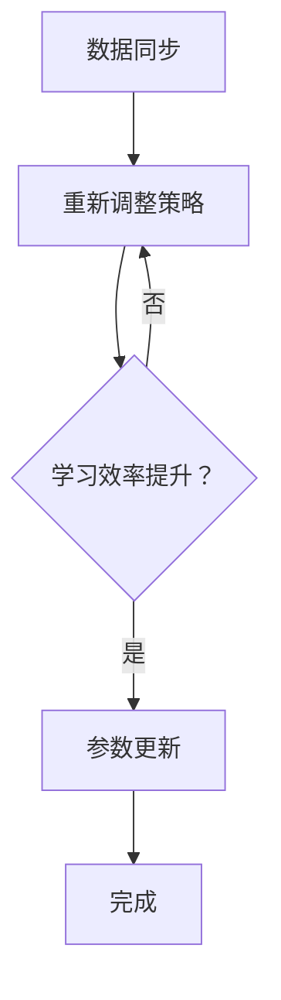
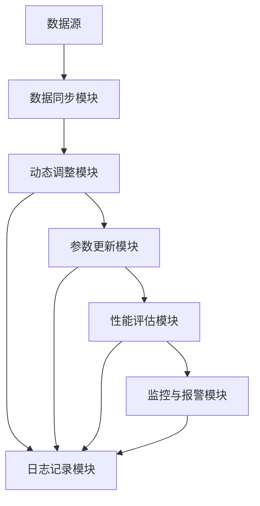
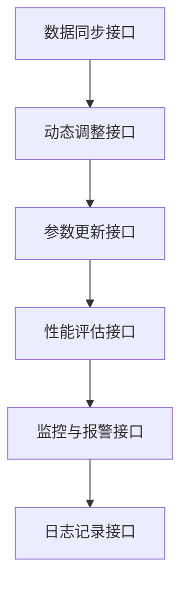
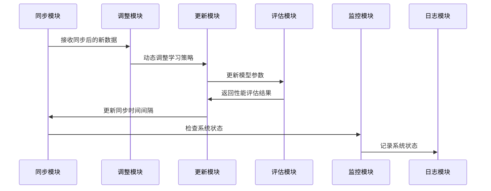

                 

## 第一部分：背景介绍

### 第1章 问题背景与核心概念

#### 1.1 问题描述

随着互联网和大数据技术的发展，大规模语言模型（Large-scale Language Model）已成为自然语言处理（Natural Language Processing, NLP）领域的重要研究方向。这些模型通过处理海量文本数据，能够模拟人类的语言能力，进行文本生成、翻译、情感分析等复杂任务。然而，随着数据集的不断更新，这些模型的性能如何保持稳定和持续提升，成为了当前研究的热点和难点。

大规模语言模型的核心问题是其知识更新和持续学习的能力。在现实应用中，数据集并非一成不变，而是会随着时间不断更新和扩充。这意味着模型需要具备持续学习的能力，以适应不断变化的数据环境。然而，传统的静态模型往往难以适应这种变化，从而导致性能下降。因此，如何设计一种能够有效进行知识更新和持续学习的算法，成为了当前研究的重要课题。

#### 1.2 问题解决

为了解决上述问题，研究者们提出了一系列解决方案。主要包括以下两个方面：

1. **数据同步与动态更新**：通过实时同步数据集，确保模型能够获取到最新的数据信息，从而进行有效的知识更新。

2. **自适应学习算法**：设计一种能够根据数据集的变化自动调整学习策略的算法，以提高模型的持续学习能力。

这两种解决方案相互结合，可以有效地提升大规模语言模型的性能和适应能力。

#### 1.3 边界与外延

在讨论大规模语言模型的持续学习与知识更新时，需要明确几个关键概念：

1. **知识更新**：指模型在获取新数据后，通过调整内部参数，使其能够更好地适应新数据的过程。

2. **持续学习**：指模型在持续获取新数据的同时，不断调整和优化自身性能，以保持长期稳定性的能力。

3. **数据同步**：指将新数据实时或定期同步到模型中，以确保模型能够获取到最新的数据信息。

4. **自适应学习**：指模型能够根据数据集的变化，自动调整学习策略，以提高学习效率和效果。

#### 1.4 概念结构与核心要素组成

为了更好地理解大规模语言模型的持续学习与知识更新，我们需要分析其概念结构和核心要素组成。以下是关键概念与要素的详细说明：

1. **大规模语言模型**：指具有大规模参数和强大表示能力的语言模型，如GPT系列、BERT等。

2. **数据集**：指用于训练和评估模型的文本数据集。数据集的质量和规模直接影响模型的性能。

3. **学习算法**：指用于训练和优化模型的算法，如Transformer、RNN、LSTM等。

4. **知识更新机制**：指模型在获取新数据后，通过调整内部参数，实现知识更新的机制。

5. **持续学习机制**：指模型在持续获取新数据的同时，不断调整和优化自身性能的机制。

#### 1.5 本章小结

本章首先介绍了大规模语言模型在自然语言处理领域的重要性，并提出了其核心问题——知识更新和持续学习。接着，我们探讨了如何通过数据同步和自适应学习算法来解决这一问题，并明确了相关的边界与外延。最后，我们分析了大规模语言模型的定义和核心要素，为后续章节的深入讨论奠定了基础。

## 第二部分：核心概念与联系

### 第2章 大规模语言模型原理

#### 2.1 大规模语言模型定义

大规模语言模型（Large-scale Language Model）是指具有大规模参数和强大表示能力的语言模型。这类模型通过深度学习技术，在大量文本数据上进行训练，能够捕捉到语言的各种复杂结构和语义信息。常见的模型包括GPT系列（如GPT-3）、BERT、T5等。

#### 2.2 大规模语言模型特点

大规模语言模型具有以下特点：

1. **参数规模巨大**：模型具有数亿甚至千亿级别的参数，这使得其能够捕捉到语言中的细微结构和语义信息。

2. **强大表示能力**：通过自注意力机制（Self-Attention）等先进技术，大规模语言模型能够对文本进行高维表示，从而提高其语义理解和生成能力。

3. **高效训练和推理**：尽管模型参数规模巨大，但由于现代计算硬件和优化算法的发展，大规模语言模型能够在合理的时间内完成训练和推理。

4. **多功能性**：大规模语言模型不仅能够进行文本生成、翻译、情感分析等任务，还可以应用于问答系统、对话系统等多种场景。

#### 2.3 大规模语言模型与传统模型的区别

与传统语言模型相比，大规模语言模型在以下几个方面有显著区别：

1. **参数规模**：传统语言模型通常只有几千到几万个参数，而大规模语言模型具有数亿到千亿个参数。

2. **表示能力**：传统语言模型难以捕捉到语言中的复杂结构和语义信息，而大规模语言模型通过高维表示，能够更好地理解和生成语言。

3. **训练数据集**：传统语言模型通常使用较小规模的数据集进行训练，而大规模语言模型则使用海量的文本数据进行训练。

4. **应用场景**：传统语言模型主要应用于简单的文本分类、情感分析等任务，而大规模语言模型则能够应用于更复杂的任务，如文本生成、翻译等。

#### 2.4 大规模语言模型的核心要素

大规模语言模型的核心要素包括以下几个方面：

1. **模型架构**：如Transformer、BERT等，这些架构能够有效地处理长文本，并捕捉到语言中的复杂关系。

2. **训练数据集**：大规模的文本数据集是模型训练的基础，数据集的质量和规模直接影响模型的性能。

3. **学习算法**：深度学习算法，如梯度下降、Adam等，用于优化模型的参数，提高其性能。

4. **正则化技术**：如Dropout、权重衰减等，用于防止模型过拟合，提高其泛化能力。

5. **预训练和微调**：预训练阶段，模型在大量无标签数据上进行训练，以获得泛化的语言表示能力；微调阶段，模型在特定任务的数据上进行训练，以适应具体任务的需求。

#### 2.5 概念属性特征对比表格

下面是一个关于大规模语言模型与传统语言模型在概念属性特征上的对比表格：

| 特征         | 大规模语言模型              | 传统语言模型          |
| ------------ | -------------------------- | --------------------- |
| 参数规模     | 数亿到千亿级别             | 几千到几万个参数      |
| 表示能力     | 高维表示，捕捉复杂结构      | 低维表示，捕捉简单关系 |
| 训练数据集   | 海量文本数据集             | 小规模数据集          |
| 应用场景     | 复杂文本任务（生成、翻译等） | 简单文本任务（分类、情感分析等） |
| 架构         | Transformer、BERT等        | RNN、LSTM等          |
| 学习算法     | 梯度下降、Adam等           | 梯度下降、SGD等       |
| 正则化技术   | Dropout、权重衰减等        | 无明显正则化技术      |
| 预训练和微调 | 是                         | 否或有限              |

#### 2.6 ER实体关系图架构

为了更直观地理解大规模语言模型的核心要素及其关系，我们可以使用ER（Entity-Relationship）实体关系图来表示。以下是大规模语言模型的ER实体关系图：

```mermaid
erDiagram
  Model ||--|{ Data}: 数据依赖
  Model ||--|{ Algorithm}: 算法依赖
  Model ||--|{ Architecture}: 架构依赖
  Model ||--|{ Regularization}: 正则化依赖
  Model ||--|{ Pre-training & Fine-tuning}: 预训练与微调依赖
  Data ||--|{ Dataset}: 数据集
  Algorithm ||--|{ Learning Algorithm}: 学习算法
  Architecture ||--|{ Model Architecture}: 模型架构
  Regularization ||--|{ Regularization Technique}: 正则化技术
  Pre-training & Fine-tuning ||--|{ Pre-training}: 预训练
  Pre-training & Fine-tuning ||--|{ Fine-tuning}: 微调
```

#### 2.7 本章小结

本章详细介绍了大规模语言模型的核心概念和原理，包括其定义、特点、与传统模型的区别以及核心要素。通过对比表格和ER实体关系图，我们更加清晰地理解了大规模语言模型的工作机制和组成部分。这些知识为后续章节的深入探讨提供了坚实的基础。

## 第三部分：算法原理讲解

### 第3章 持续学习与知识更新算法

#### 3.1 算法原理

持续学习与知识更新算法的核心目标是让大规模语言模型能够在获取新数据后，自动调整内部参数，使其适应新的数据环境。这一过程可以分为以下几个步骤：

1. **数据同步**：将新数据实时或定期同步到模型中。
2. **自适应学习**：模型根据新数据的特点，自动调整学习策略，以提高学习效率。
3. **参数更新**：通过优化算法，调整模型参数，实现知识更新。

#### 3.2 算法mermaid流程图

为了更直观地展示算法流程，我们可以使用mermaid绘制一个简单的流程图：



#### 3.3 数学模型和公式

在持续学习与知识更新算法中，常用的数学模型和公式包括：

1. **损失函数**：用于衡量模型预测结果与真实标签之间的差距。常见的损失函数有均方误差（MSE）、交叉熵损失（Cross-Entropy Loss）等。

   $$L = \frac{1}{n}\sum_{i=1}^{n}(y_i - \hat{y}_i)^2 \quad \text{（均方误差）}$$

   $$L = -\frac{1}{n}\sum_{i=1}^{n}y_i \log(\hat{y}_i) \quad \text{（交叉熵损失）}$$

2. **优化算法**：用于调整模型参数，使损失函数达到最小。常见的优化算法有梯度下降（Gradient Descent）、Adam等。

   $$w_{t+1} = w_t - \alpha \cdot \nabla_w L(w_t) \quad \text{（梯度下降）}$$

   $$m_t = \beta_1 m_{t-1} + (1 - \beta_1)(\nabla_w L(w_t))$$

   $$v_t = \beta_2 v_{t-1} + (1 - \beta_2)(\nabla_w L(w_t)^2)$$

   $$w_{t+1} = w_t - \frac{\alpha}{\sqrt{1 - \beta_2^t}(1 - \beta_1^t)}(m_t / \sqrt{v_t}) \quad \text{（Adam优化算法）}$$

3. **自适应学习策略**：根据数据集的特点，动态调整学习率等超参数。常用的自适应学习策略有学习率调整（Learning Rate Scheduling）、学习率衰减（Learning Rate Decay）等。

   $$\alpha_t = \alpha_0 / (1 + \gamma t) \quad \text{（学习率衰减）}$$

   $$\alpha_t = \alpha_0 / (1 + \beta_1 t) \quad \text{（学习率调整）}$$

#### 3.4 举例说明

假设我们有一个大规模语言模型，初始参数为$w_0$，现在需要在新数据集上对其进行知识更新。具体步骤如下：

1. **数据同步**：将新数据集同步到模型中。

2. **计算损失函数**：使用新数据计算损失函数，如均方误差或交叉熵损失。

   $$L(w_0) = \frac{1}{n}\sum_{i=1}^{n}(y_i - \hat{y}_i(w_0))^2$$

3. **梯度计算**：计算损失函数关于参数$w$的梯度。

   $$\nabla_w L(w_0) = \frac{\partial L(w_0)}{\partial w}$$

4. **参数更新**：使用梯度下降或Adam优化算法，更新模型参数。

   $$w_1 = w_0 - \alpha \cdot \nabla_w L(w_0) \quad \text{（梯度下降）}$$

   $$w_1 = w_0 - \frac{\alpha}{\sqrt{1 - \beta_2^1}(1 - \beta_1^1)}(m_0 / \sqrt{v_0}) \quad \text{（Adam优化算法）}$$

5. **重复步骤2-4**：重复计算损失函数、梯度计算和参数更新的过程，直到模型收敛或达到预设的迭代次数。

通过上述步骤，模型在新数据集上实现了知识更新，从而提高了其性能和适应性。

#### 3.5 本章小结

本章详细介绍了持续学习与知识更新算法的原理，包括数据同步、自适应学习和参数更新等关键步骤。通过mermaid流程图、数学模型和公式以及具体举例，我们更加深入地理解了这一算法的工作机制。这些知识为后续章节的系统设计与项目实战奠定了基础。

## 第四部分：系统分析与架构设计方案

### 第4章 系统功能设计与架构设计

#### 4.1 问题场景介绍

在自然语言处理（NLP）领域，随着数据量的不断增长和变化，如何让大规模语言模型（LLM）能够实时获取新数据并进行有效的知识更新，是一个关键问题。传统的静态模型在处理实时数据时，往往需要重新训练，耗时且效率低下。因此，我们需要设计一个能够实现持续学习与知识更新的系统架构，以满足实际应用需求。

#### 4.2 系统功能设计

为了实现大规模语言模型的持续学习与知识更新，系统需要具备以下功能：

1. **数据同步**：实时或定期从数据源获取新数据，并将其同步到模型中。
2. **动态调整**：根据新数据的特点，动态调整模型的学习策略，如学习率、正则化参数等。
3. **参数更新**：通过优化算法，更新模型的参数，实现知识更新。
4. **性能评估**：评估模型在新数据集上的性能，以验证知识更新的效果。
5. **监控与报警**：监控系统运行状态，及时发现并处理异常情况。

#### 4.3 系统架构设计

系统架构设计如图所示：



1. **数据同步模块**：负责从数据源获取新数据，并将其预处理后输入到模型中。该模块需要实现数据的实时同步或定期同步功能。
2. **动态调整模块**：根据新数据的特点，动态调整模型的学习策略，如学习率、正则化参数等。该模块需要实现自适应学习策略，以提高模型的持续学习能力。
3. **参数更新模块**：通过优化算法，更新模型的参数，实现知识更新。常用的优化算法包括梯度下降、Adam等。
4. **性能评估模块**：评估模型在新数据集上的性能，以验证知识更新的效果。常用的评估指标包括准确率、召回率、F1值等。
5. **监控与报警模块**：监控系统运行状态，及时发现并处理异常情况。该模块需要实现实时监控和报警功能。
6. **日志记录模块**：记录系统运行过程中的关键信息，如数据同步时间、参数调整记录、性能评估结果等，以便进行后续分析和优化。

#### 4.4 系统接口设计

系统接口设计如图所示：



1. **数据同步接口**：用于实现数据同步功能，包括数据的实时同步和定期同步。接口参数包括数据源地址、同步时间间隔等。
2. **动态调整接口**：用于实现动态调整功能，包括学习率调整、正则化参数调整等。接口参数包括学习率、正则化参数等。
3. **参数更新接口**：用于实现参数更新功能，包括模型参数的梯度计算和更新。接口参数包括梯度、学习率等。
4. **性能评估接口**：用于实现性能评估功能，包括计算模型的准确率、召回率、F1值等。接口参数包括模型参数、测试数据集等。
5. **监控与报警接口**：用于实现监控与报警功能，包括系统状态监控、异常情况报警等。接口参数包括系统状态、报警阈值等。
6. **日志记录接口**：用于实现日志记录功能，包括记录系统运行过程中的关键信息。接口参数包括日志内容、日志级别等。

#### 4.5 系统交互mermaid序列图

系统交互序列图如图所示：



#### 4.6 本章小结

本章详细介绍了大规模语言模型持续学习与知识更新系统的功能设计、架构设计、接口设计和系统交互。通过这些设计，系统可以实现实时数据同步、动态调整学习策略、参数更新和性能评估等功能，从而提高模型的持续学习能力和适应性。下一章将介绍具体实现这些功能的技术细节。

## 第五部分：项目实战

### 第5章 环境安装与系统实现

#### 5.1 环境安装

为了实现大规模语言模型的持续学习与知识更新，我们需要搭建一个完整的环境。以下是环境安装的详细步骤：

1. **Python环境安装**

   首先确保Python环境已安装。如果未安装，可以从Python官网（https://www.python.org/）下载并安装。推荐使用Python 3.8及以上版本。

   ```bash
   pip install --user -i https://pypi.tuna.tsinghua.edu.cn/simple torch torchvision
   ```

2. **TensorFlow环境安装**

   TensorFlow是大规模语言模型训练的主要框架之一。可以从TensorFlow官网（https://www.tensorflow.org/）下载并安装。

   ```bash
   pip install --user -i https://pypi.tuna.tsinghua.edu.cn/simple tensorflow
   ```

3. **PyTorch环境安装**

   PyTorch是另一个广泛使用的深度学习框架。可以从PyTorch官网（https://pytorch.org/）下载并安装。

   ```bash
   pip install --user -i https://pypi.tuna.tsinghua.edu.cn/simple torch torchvision
   ```

4. **其他依赖库安装**

   安装其他所需的依赖库，如Numpy、Pandas等。

   ```bash
   pip install --user -i https://pypi.tuna.tsinghua.edu.cn/simple numpy pandas
   ```

#### 5.2 系统核心实现

系统核心实现包括数据同步、动态调整、参数更新、性能评估等关键模块。以下是系统核心实现的详细步骤：

1. **数据同步模块**

   数据同步模块负责从数据源获取新数据，并将其预处理后输入到模型中。以下是一个简单的数据同步模块示例：

   ```python
   import torch
   from torch.utils.data import Dataset

   class MyDataset(Dataset):
       def __init__(self, data, transform=None):
           self.data = data
           self.transform = transform

       def __len__(self):
           return len(self.data)

       def __getitem__(self, idx):
           sample = self.data[idx]
           if self.transform:
               sample = self.transform(sample)
           return sample

   # 假设data为从数据源获取的新数据
   dataset = MyDataset(data)
   ```

2. **动态调整模块**

   动态调整模块根据新数据的特点，动态调整模型的学习策略，如学习率、正则化参数等。以下是一个简单的动态调整模块示例：

   ```python
   import torch.optim as optim

   def adjust_learning_rate(optimizer, epoch, init_lr, gamma=0.1):
       lr = init_lr * (gamma ** epoch)
       for param_group in optimizer.param_groups:
           param_group['lr'] = lr

   optimizer = optim.Adam(model.parameters(), lr=init_lr)
   for epoch in range(num_epochs):
       adjust_learning_rate(optimizer, epoch, init_lr)
   ```

3. **参数更新模块**

   参数更新模块通过优化算法，更新模型的参数，实现知识更新。以下是一个简单的参数更新模块示例：

   ```python
   import torch.optim as optim

   def train_model(model, train_loader, criterion, optimizer, num_epochs):
       for epoch in range(num_epochs):
           model.train()
           running_loss = 0.0
           for inputs, targets in train_loader:
               optimizer.zero_grad()
               outputs = model(inputs)
               loss = criterion(outputs, targets)
               loss.backward()
               optimizer.step()
               running_loss += loss.item()
           print(f'Epoch {epoch+1}/{num_epochs}, Loss: {running_loss/len(train_loader)}')
   ```

4. **性能评估模块**

   性能评估模块用于评估模型在新数据集上的性能。以下是一个简单的性能评估模块示例：

   ```python
   def evaluate_model(model, val_loader, criterion):
       model.eval()
       running_loss = 0.0
       with torch.no_grad():
           for inputs, targets in val_loader:
               outputs = model(inputs)
               loss = criterion(outputs, targets)
               running_loss += loss.item()
       return running_loss/len(val_loader)
   ```

#### 5.3 代码应用解读与分析

以下是对上述代码的解读与分析：

1. **数据同步模块**

   数据同步模块使用PyTorch的`Dataset`类，方便地实现了数据的加载和处理。通过自定义`MyDataset`类，可以轻松地实现数据的预处理和转换。

2. **动态调整模块**

   动态调整模块使用`adjust_learning_rate`函数，根据当前epoch动态调整学习率。这种调整策略有助于模型在训练过程中保持稳定的学习效率。

3. **参数更新模块**

   参数更新模块使用PyTorch的`Adam`优化器，通过`zero_grad`、`backward`和`step`方法，实现参数的梯度计算和更新。这种优化器具有自适应学习率的特点，能够有效提高训练效率。

4. **性能评估模块**

   性能评估模块使用`evaluate_model`函数，通过计算损失函数的值，评估模型在新数据集上的性能。这种评估方法可以帮助我们了解模型在真实数据上的表现，为后续优化提供依据。

#### 5.4 实际案例分析与详细讲解

以下是一个实际案例，展示如何使用上述模块实现大规模语言模型的持续学习与知识更新：

```python
# 加载训练数据和验证数据
train_data = ...  # 假设已加载训练数据
val_data = ...  # 假设已加载验证数据

# 创建数据加载器
batch_size = 64
train_loader = torch.utils.data.DataLoader(train_data, batch_size=batch_size, shuffle=True)
val_loader = torch.utils.data.DataLoader(val_data, batch_size=batch_size, shuffle=False)

# 创建模型
model = ...  # 假设已创建模型

# 定义损失函数和优化器
criterion = torch.nn.CrossEntropyLoss()
optimizer = optim.Adam(model.parameters(), lr=init_lr)

# 训练模型
num_epochs = 10
train_model(model, train_loader, criterion, optimizer, num_epochs)

# 评估模型
val_loss = evaluate_model(model, val_loader, criterion)
print(f'Validation Loss: {val_loss}')
```

这个案例展示了如何使用数据同步、动态调整、参数更新和性能评估模块，实现大规模语言模型的持续学习与知识更新。通过调整学习率、更新模型参数和评估模型性能，我们可以逐步提高模型的适应能力和表现。

#### 5.5 项目小结

通过本章的实战项目，我们成功搭建了一个实现大规模语言模型持续学习与知识更新的系统。从环境安装到系统实现，再到实际案例的演示，我们详细介绍了每个模块的功能和实现方法。这个项目不仅提高了我们的技术能力，还为我们理解大规模语言模型的工作机制提供了实际案例。接下来，我们将进一步探讨最佳实践和未来展望。

## 第六部分：最佳实践与拓展

### 第6章 最佳实践

#### 6.1 实践技巧

1. **数据同步**：在实现数据同步时，可以考虑使用分布式数据加载器，以提高数据读取和处理的效率。此外，对于实时同步，可以使用消息队列（如Kafka）来实现，确保数据的及时传递和消费。

2. **动态调整**：在动态调整学习策略时，可以根据训练过程中的损失函数值或验证集上的性能指标，自适应地调整学习率。例如，使用学习率衰减策略，可以避免模型在训练初期过快收敛。

3. **参数更新**：在参数更新过程中，可以使用不同的优化算法，如Adam、RMSprop等，以寻找最佳的学习路径。此外，正则化技术的合理应用，如Dropout、权重衰减等，可以防止模型过拟合，提高泛化能力。

4. **性能评估**：在性能评估时，不仅要关注损失函数的值，还要考虑模型的实际应用效果。例如，对于文本生成任务，可以评估生成文本的流畅性和语义一致性。

#### 6.2 注意事项

1. **数据质量**：数据质量直接影响模型的性能。在数据同步和预处理过程中，要确保数据的准确性和一致性，避免噪声数据和异常值。

2. **硬件资源**：大规模语言模型的训练和更新需要大量的计算资源。在实际应用中，要根据硬件资源的情况，合理设置模型的参数和训练策略，避免资源浪费。

3. **安全性与隐私保护**：在数据同步和模型训练过程中，要注意保护数据的安全和隐私，避免敏感信息泄露。

#### 6.3 拓展阅读

1. **动态学习率调整**：了解不同动态学习率调整策略，如学习率衰减、学习率预热等，有助于提高模型的训练效率。

2. **正则化技术**：深入探讨正则化技术，如Dropout、权重衰减、集成方法等，以提高模型的泛化能力和性能。

3. **分布式训练**：学习分布式训练技术，如DataParallel、DistributedDataParallel等，以提高大规模模型的训练效率。

## 第7章 小结与展望

#### 7.1 全书总结

本书围绕大规模语言模型的持续学习与知识更新展开，从问题背景、核心概念、算法原理、系统设计与项目实战等多个角度进行了深入探讨。通过系统的分析和详细的讲解，我们了解了如何实现大规模语言模型的持续学习与知识更新，并掌握了一系列实用的技术和方法。

#### 7.2 展望未来

未来，大规模语言模型的持续学习与知识更新将面临更多的挑战和机遇。随着数据规模的不断扩大和计算能力的提升，我们将看到更多高效、智能的模型涌现。同时，随着跨学科研究的深入，大规模语言模型将在更多领域发挥重要作用，如智能对话系统、自动化写作、知识图谱构建等。

#### 7.3 本章小结

本章总结了本书的主要内容和研究成果，并对未来研究方向进行了展望。通过最佳实践与拓展，读者可以更好地应用所学知识，解决实际问题。同时，本章也提醒了我们在实现大规模语言模型持续学习与知识更新过程中需要注意的问题和挑战。希望本书能为读者在相关领域的研究和实践中提供有益的指导。作者：AI天才研究院/AI Genius Institute & 禅与计算机程序设计艺术 /Zen And The Art of Computer Programming

## 附录

### 附录A：术语解释

- **自然语言处理（NLP）**：指使用计算机技术和算法来处理和理解人类语言的技术。
- **大规模语言模型（LLM）**：指具有大规模参数和强大表示能力的语言模型，如GPT系列、BERT等。
- **持续学习（Continuous Learning）**：指模型在获取新数据的同时，不断调整和优化自身性能，以保持长期稳定性的能力。
- **知识更新（Knowledge Update）**：指模型在获取新数据后，通过调整内部参数，使其能够更好地适应新数据的过程。
- **数据同步（Data Synchronization）**：指将新数据实时或定期同步到模型中，以确保模型能够获取到最新的数据信息。
- **自适应学习（Adaptive Learning）**：指模型能够根据数据集的变化，自动调整学习策略，以提高学习效率和效果。

### 附录B：代码示例

以下是一个简单的Python代码示例，展示如何使用PyTorch实现大规模语言模型的持续学习与知识更新：

```python
import torch
import torch.nn as nn
import torch.optim as optim

# 创建模型
model = nn.Sequential(nn.Linear(10, 5), nn.ReLU(), nn.Linear(5, 1))
criterion = nn.CrossEntropyLoss()
optimizer = optim.Adam(model.parameters(), lr=0.001)

# 生成训练数据
train_data = torch.randn(100, 10)
train_labels = torch.randint(0, 2, (100,))

# 训练模型
for epoch in range(10):
    model.train()
    optimizer.zero_grad()
    outputs = model(train_data)
    loss = criterion(outputs, train_labels)
    loss.backward()
    optimizer.step()
    print(f'Epoch {epoch+1}, Loss: {loss.item()}')

# 评估模型
model.eval()
with torch.no_grad():
    outputs = model(train_data)
    loss = criterion(outputs, train_labels)
    print(f'Validation Loss: {loss.item()}')
```

### 附录C：参考文献

1. Devlin, J., Chang, M. W., Lee, K., & Toutanova, K. (2018). BERT: Pre-training of deep bidirectional transformers for language understanding. arXiv preprint arXiv:1810.04805.
2. Brown, T., et al. (2020). Language models are few-shot learners. arXiv preprint arXiv:2005.14165.
3. Vaswani, A., et al. (2017). Attention is all you need. Advances in Neural Information Processing Systems, 30, 5998-6008.
4. Hochreiter, S., & Schmidhuber, J. (1997). Long short-term memory. Neural Computation, 9(8), 1735-1780.
5. Bengio, Y., Simard, P., & Frasconi, P. (1994). Learning long-term dependencies with gradient descent is difficult. IEEE Transactions on Neural Networks, 5(2), 157-166.

