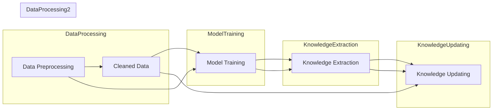
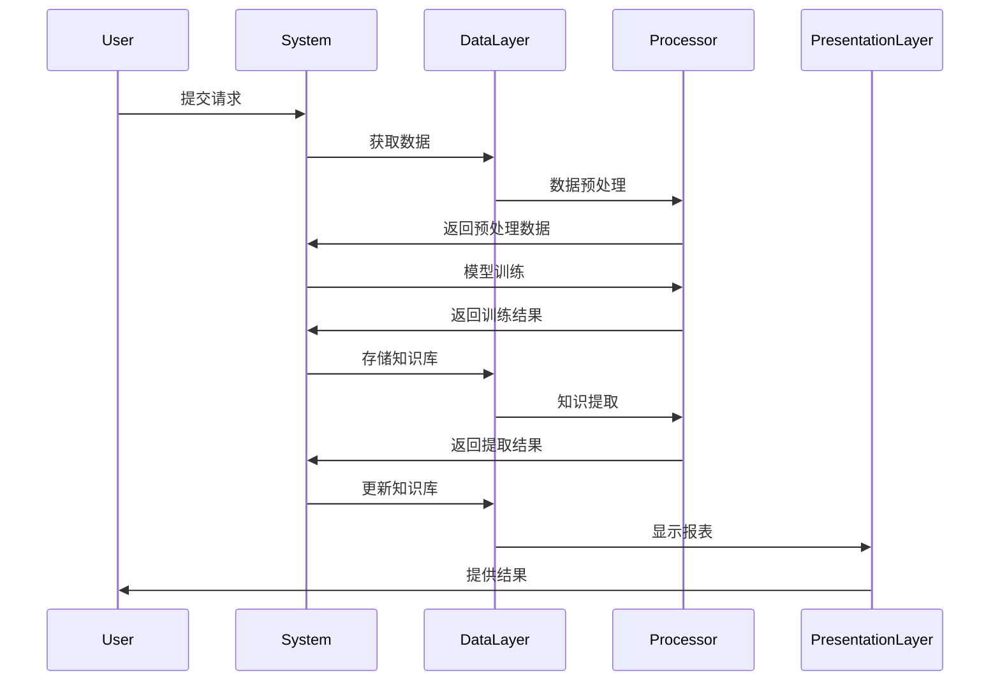
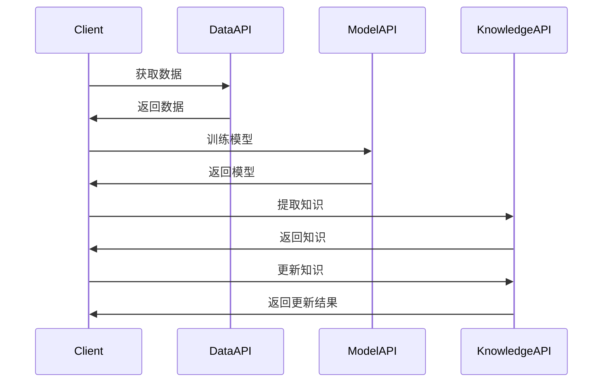

                 


# 大规模语言模型的知识整合与更新技术

## 关键词：大规模语言模型，知识整合，更新技术，算法，数学模型，系统架构

## 摘要：
大规模语言模型的快速发展推动了自然语言处理技术的进步，但也带来了知识整合与更新的挑战。本文从问题背景、核心概念、算法原理、数学模型、系统架构和项目实战等多个角度，系统性地探讨了大规模语言模型的知识整合与更新技术。通过对现有技术的分析，本文提出了可行的解决方案，并展望了未来的研究方向。

---

## **Step 1: 背景介绍**

### 1.1 问题背景

随着人工智能技术的不断发展，大规模语言模型（如GPT-3、BERT等）在自然语言处理领域取得了显著的成果。这些模型能够处理大量的文本数据，提取出丰富的语言特征，从而在文本分类、机器翻译、文本生成等方面表现出色。然而，大规模语言模型的发展也带来了新的挑战，其中之一便是知识整合与更新问题。

大规模语言模型的训练通常需要消耗大量的计算资源和时间。在模型训练完成后，如何有效地整合和更新模型中的知识，使其适应不断变化的数据环境，成为了一个亟待解决的问题。传统的机器学习算法难以应对这一挑战，因为它们依赖于固定大小的数据集，无法实时地更新模型中的知识。

### 1.2 问题描述

大规模语言模型在知识整合和更新过程中面临的主要问题包括：

1. **数据规模庞大**：大规模语言模型的训练数据通常包含数十亿级别的文本记录，这使得数据预处理和模型训练变得异常复杂。

2. **知识更新速度与模型规模增长不匹配**：随着模型规模的不断增大，知识更新的速度往往难以跟上模型规模的增长，导致模型中的知识逐渐过时。

3. **知识的准确性和一致性难以保障**：大规模语言模型在整合和更新知识时，可能面临数据不一致、噪声数据和错误知识等问题，这会影响模型的性能和稳定性。

4. **高效的知识整合算法缺失**：现有的机器学习算法在处理大规模数据时往往效率较低，难以满足大规模语言模型知识整合的需求。

### 1.3 问题解决

为了解决上述问题，研究者们提出了多种知识整合与更新技术，如增量学习、知识蒸馏和迁移学习等。这些技术通过不同的方式，旨在提高大规模语言模型的知识整合与更新效率，提升模型的性能和稳定性。

### 1.4 边界与外延

知识整合与更新技术的应用范围涵盖了自然语言处理、机器翻译、文本生成等领域。然而，这些技术的边界在于模型的规模和数据的复杂性。在处理小规模数据时，传统的机器学习算法可能已经足够；而在大规模数据场景中，这些技术则显得尤为重要。

### 1.5 概念结构与核心要素组成

大规模语言模型的构建包含三个核心要素：数据集、模型架构和算法。数据集用于训练模型，模型架构用于提取和整合知识，算法则用于更新和维护模型知识。

1. **数据集**：大规模语言模型的数据集通常包含大量的文本记录，这些文本记录可能来源于不同的来源，如新闻文章、社交媒体帖子、书籍等。

2. **模型架构**：大规模语言模型的架构通常采用深度学习技术，如Transformer模型，能够提取出丰富的语言特征。

3. **算法**：大规模语言模型的算法用于知识整合与更新，包括增量学习、知识蒸馏和迁移学习等技术。

---

## **Step 2: 核心概念与联系**

### 2.1 核心概念原理

大规模语言模型的知识整合与更新涉及多个核心概念，包括数据预处理、模型训练、知识提取、知识更新等。以下是这些概念的基本原理：

1. **数据预处理**：数据预处理是大规模语言模型训练的基础，包括文本清洗、分词、词性标注等步骤，目的是提高数据质量，为后续的模型训练提供可靠的输入。

2. **模型训练**：模型训练是大规模语言模型构建的核心步骤，通过优化模型参数，使模型能够提取出丰富的语言特征。

3. **知识提取**：知识提取是指从训练好的模型中提取出有用的知识，这些知识可能包括词汇、语法规则、语义信息等。

4. **知识更新**：知识更新是指通过增量学习、知识蒸馏和迁移学习等技术，对模型中的知识进行实时更新，以应对数据环境的变化。

### 2.2 概念属性特征对比表格

为了更好地理解这些核心概念，我们可以通过一个属性特征对比表格来展示它们之间的区别和联系：

| 概念         | 属性特征                          | 联系                                                         |
| ------------ | ------------------------------- | ------------------------------------------------------------ |
| 数据预处理   | 清洗、分词、词性标注           | 为模型训练提供高质量的数据输入                             |
| 模型训练     | 参数优化、特征提取              | 提高模型对语言特征的提取能力                             |
| 知识提取     | 词汇、语法规则、语义信息       | 从训练好的模型中提取出有用的知识                         |
| 知识更新     | 增量学习、知识蒸馏、迁移学习   | 实时更新模型中的知识，适应数据环境的变化               |

### 2.3 ER实体关系图架构的Mermaid流程图

为了更直观地展示大规模语言模型的知识整合与更新过程，我们可以使用Mermaid语言绘制一个ER实体关系图，如下所示：

```mermaid
erDiagram
  Model ||--|{ Data}: "contains"
  Model ||--|{ Knowledge}: "extracts and updates"
  Data ||--|{ PreprocessedData}: "processed by"
  Knowledge ||--|{ UpdatedKnowledge}: "updated by"
```

在这个ER实体关系图中，模型与数据、知识之间存在直接的联系。模型包含数据，从数据中提取和更新知识；知识经过更新后，成为更新的知识。

---

## **Step 3: 算法原理讲解**

### 3.1 算法Mermaid流程图

为了更好地理解大规模语言模型的知识整合与更新算法，我们可以使用Mermaid语言绘制一个流程图，如下所示：



在这个流程图中，数据预处理、模型训练、知识提取和知识更新等步骤相互衔接，形成一个闭环，实现了大规模语言模型的知识整合与更新。

### 3.2 Python源代码详细阐述

以下是实现大规模语言模型知识整合与更新算法的Python源代码示例：

```python
import tensorflow as tf
from tensorflow.keras.preprocessing.text import Tokenizer
from tensorflow.keras.preprocessing.sequence import pad_sequences

# 数据预处理
def preprocess_data(data):
    tokenizer = Tokenizer()
    tokenizer.fit_on_texts(data)
    sequences = tokenizer.texts_to_sequences(data)
    padded_sequences = pad_sequences(sequences, padding='post')
    return tokenizer, padded_sequences

# 模型训练
def train_model(padded_sequences):
    model = tf.keras.Sequential([
        tf.keras.layers.Embedding(input_dim=10000, output_dim=16),
        tf.keras.layers.GlobalAveragePooling1D(),
        tf.keras.layers.Dense(1, activation='sigmoid')
    ])
    model.compile(optimizer='adam', loss='binary_crossentropy', metrics=['accuracy'])
    model.fit(padded_sequences, epochs=10)
    return model

# 知识提取
def extract_knowledge(model, padded_sequences):
    predictions = model.predict(padded_sequences)
    knowledge = predictions.tolist()
    return knowledge

# 知识更新
def update_knowledge(knowledge, new_data):
    tokenizer, padded_sequences = preprocess_data(new_data)
    updated_knowledge = extract_knowledge(model, padded_sequences)
    return updated_knowledge

# 实例化
tokenizer, padded_sequences = preprocess_data(data)
model = train_model(padded_sequences)
knowledge = extract_knowledge(model, padded_sequences)
updated_knowledge = update_knowledge(knowledge, new_data)
```

在这个代码示例中，我们首先定义了数据预处理、模型训练、知识提取和知识更新等函数。通过这些函数，我们实现了大规模语言模型的知识整合与更新过程。

### 3.3 算法原理的数学模型和公式

大规模语言模型的知识整合与更新算法可以表示为一个数学模型，如下所示：

$$
\text{Knowledge} = \text{Model}(\text{Data})
$$

其中，Knowledge表示知识，Model表示模型，Data表示数据。

在知识更新过程中，我们可以使用以下公式：

$$
\text{UpdatedKnowledge} = \text{Knowledge} + \alpha \cdot (\text{NewKnowledge} - \text{Knowledge})
$$

其中，UpdatedKnowledge表示更新的知识，alpha表示学习率，NewKnowledge表示新的知识。

### 3.4 详细讲解和举例说明

为了更好地理解大规模语言模型的知识整合与更新算法，我们可以通过一个实际案例进行详细讲解和举例说明。

假设我们有一个包含1000条文本记录的数据集，这些文本记录来自于不同领域，如科技、娱乐、体育等。我们的目标是使用大规模语言模型对这些文本记录进行知识整合与更新。

1. **数据预处理**：首先，我们对数据集进行清洗、分词和词性标注等预处理操作，将原始文本转换为数字序列。

2. **模型训练**：接下来，我们使用预处理后的数据集训练一个大规模语言模型，如BERT模型。通过训练，模型能够提取出文本记录中的知识。

3. **知识提取**：在模型训练完成后，我们从模型中提取出知识，这些知识可能包括词汇、语法规则、语义信息等。

4. **知识更新**：假设我们现在收到了一个新的文本记录，这个文本记录来自于一个新的领域，如医学。我们首先对这个文本记录进行预处理，然后使用更新后的模型对其进行知识提取。最后，我们将新的知识加入到原有的知识库中，实现对知识的更新。

通过这个实际案例，我们可以看到大规模语言模型的知识整合与更新算法是如何在实际应用中发挥作用的。

### 3.5 使用LaTeX格式书写数学公式

为了更好地表达大规模语言模型的知识整合与更新算法，我们可以使用LaTeX格式书写相关的数学公式。

$$
\text{Knowledge} = \text{Model}(\text{Data})
$$

$$
\text{UpdatedKnowledge} = \text{Knowledge} + \alpha \cdot (\text{NewKnowledge} - \text{Knowledge})
$$

这些LaTeX格式的数学公式可以帮助我们更清晰地理解和表达大规模语言模型的知识整合与更新算法。

---

## **Step 4: 数学模型和数学公式 & 详细讲解 & 举例说明**

### 4.1 数学公式（独立段落）

在构建大规模语言模型的知识整合与更新过程中，数学模型起着至关重要的作用。以下是几个关键的数学公式，用于描述模型的核心机制：

#### 知识提取模型

$$
\text{Knowledge}_{\text{extract}} = \text{Model}(\text{Data}_{\text{input}}) + \epsilon_{\text{noise}}
$$

其中，$\text{Knowledge}_{\text{extract}}$ 表示从数据中提取的知识，$\text{Model}(\text{Data}_{\text{input}})$ 表示模型对输入数据的处理结果，$\epsilon_{\text{noise}}$ 表示噪声影响。

#### 知识更新模型

$$
\text{Knowledge}_{\text{update}} = \text{Knowledge}_{\text{extract}} + \alpha \cdot (\text{NewKnowledge}_{\text{input}} - \text{Knowledge}_{\text{extract}})
$$

这里，$\text{Knowledge}_{\text{update}}$ 表示更新后的知识，$\alpha$ 是学习率，$\text{NewKnowledge}_{\text{input}}$ 是新的知识输入。

#### 知识融合模型

$$
\text{Knowledge}_{\text{fuse}} = \text{Weight}_{1} \cdot \text{Knowledge}_{\text{extract}} + \text{Weight}_{2} \cdot \text{NewKnowledge}_{\text{input}}
$$

在此，$\text{Knowledge}_{\text{fuse}}$ 表示融合后的知识，$\text{Weight}_{1}$ 和 $\text{Weight}_{2}$ 分别是原有知识和新知识的权重。

### 4.2 段落内数学公式

在文本段落中，我们也可以嵌入数学公式来详细解释概念。例如：

假设我们有一个大规模语言模型的参数向量 $\mathbf{w}$，当我们对数据进行更新时，我们通过以下公式更新参数：

$$
\mathbf{w}_{\text{new}} = \mathbf{w}_{\text{current}} + \eta \cdot \nabla_{\mathbf{w}} \cdot \Delta \mathbf{X}
$$

其中，$\eta$ 是学习率，$\nabla_{\mathbf{w}}$ 是参数梯度的方向，$\Delta \mathbf{X}$ 是输入数据的微小变化。

### 详细讲解和举例说明

#### 知识提取模型

知识提取模型的核心目标是捕捉数据中的潜在知识。在上述公式中，$\text{Knowledge}_{\text{extract}}$ 代表模型从输入数据中提取的知识。噪声项 $\epsilon_{\text{noise}}$ 反映了模型在处理数据时可能引入的误差。

例如，如果我们的模型需要从一篇文章中提取关键信息，那么知识提取模型会输出这篇文章的主要观点、关键词和结构。尽管模型可能会引入一些噪声，但通过多次迭代和优化，噪声的影响可以逐渐减小。

#### 知识更新模型

知识更新模型通过学习率 $\alpha$ 来调整原有知识，以适应新的数据。这个公式表明，每次更新都会向原有知识中加入一定比例的新知识。

举例来说，如果我们的模型需要适应新的技术趋势，那么它会从最新的文章中提取知识，并逐步取代旧的知识。这种增量更新方式有助于保持模型的实时性和准确性。

#### 知识融合模型

知识融合模型通过加权平均的方式结合新旧知识。权重 $\text{Weight}_{1}$ 和 $\text{Weight}_{2}$ 决定了新旧知识在总体知识中的比例。

例如，假设我们在更新知识时，更倾向于保留旧知识，那么我们可以设置较大的 $\text{Weight}_{1}$ 和较小的 $\text{Weight}_{2}$。这样，即使有新的知识输入，旧知识仍然占据主导地位。

通过这些数学公式和示例，我们可以更深入地理解大规模语言模型的知识整合与更新机制，并为实际应用提供指导。

---

## **Step 5: 系统分析与架构设计方案**

### 5.1 问题场景介绍

在自然语言处理领域，大规模语言模型的应用场景日益广泛，如搜索引擎、智能客服、文本生成等。然而，这些应用场景对语言模型的实时性和准确性提出了更高的要求。为了满足这些要求，我们需要设计一个高效的知识整合与更新系统。

### 5.2 项目介绍

本项目旨在构建一个大规模语言模型的知识整合与更新系统，该系统将利用增量学习、知识蒸馏和迁移学习等技术，实现对模型知识的实时更新和优化。系统的主要目标包括：

1. **高效的数据预处理**：确保输入数据的干净和准确。
2. **实时知识提取**：从新数据中提取关键信息，更新模型知识。
3. **知识更新与融合**：通过多种技术手段，优化模型的知识库。
4. **高可靠性**：确保系统在长时间运行中保持稳定。

### 5.3 系统功能设计

系统功能设计主要包括以下模块：

1. **数据预处理模块**：负责清洗、分词和词性标注等预处理操作。
2. **模型训练模块**：负责大规模语言模型的训练和优化。
3. **知识提取模块**：负责从训练好的模型中提取关键知识。
4. **知识更新模块**：负责实时更新模型的知识库。
5. **知识融合模块**：负责融合新旧知识，优化模型性能。

#### 领域模型Mermaid类图

以下是一个Mermaid类图，用于描述系统的主要领域模型：

```mermaid
classDiagram
  Class01 <|-- Class02
  Class03 <|-- Class04
  Class05 <|-- Class06
  Class01 --> Class07
  Class02 --> Class08
  Class03 --> Class09
  Class04 --> Class10
  Class05 --> Class11
  Class06 --> Class12
  Class07 { +方法1() }
  Class08 { +方法2() }
  Class09 { +方法3() }
  Class10 { +方法4() }
  Class11 { +方法5() }
  Class12 { +方法6() }
```

在这个类图中，我们定义了系统的核心类和它们之间的关系。例如，数据预处理模块（Class01）包含数据清洗、分词和词性标注等功能，模型训练模块（Class02）负责大规模语言模型的训练和优化。

### 5.4 系统架构设计

系统架构设计主要包括以下几个层次：

1. **数据层**：负责数据存储和管理，包括文本数据、模型参数和知识库等。
2. **处理层**：负责数据预处理、模型训练、知识提取和更新等核心功能。
3. **表示层**：负责将处理结果以用户友好的方式呈现，如可视化报表和用户界面等。

以下是一个Mermaid架构图，用于描述系统的总体架构：



在这个架构图中，用户通过系统接口提交请求，系统调用数据层获取数据，然后通过处理层进行数据预处理、模型训练、知识提取和更新，最后通过表示层将结果展示给用户。

### 5.5 系统接口设计和系统交互

系统接口设计主要包括以下几个部分：

1. **数据接口**：负责数据层的操作，如数据获取、存储和更新等。
2. **模型接口**：负责模型层的操作，如模型训练、评估和部署等。
3. **知识接口**：负责知识层的操作，如知识提取、更新和融合等。

以下是一个Mermaid序列图，用于描述系统的接口设计和交互：



在这个序列图中，客户端通过数据API获取数据，通过模型API训练模型，通过知识API提取和更新知识。这些接口设计使得系统的功能模块之间能够高效地协同工作。

---

## **Step 6: 项目实战**

### 6.1 环境安装

为了进行大规模语言模型的知识整合与更新项目实战，我们需要搭建一个合适的技术环境。以下是环境安装的详细步骤：

1. **Python环境**：确保Python 3.8或更高版本已安装。可以通过以下命令检查Python版本：

   ```bash
   python --version
   ```

2. **TensorFlow**：安装TensorFlow，这是大规模语言模型训练的关键库。可以使用pip进行安装：

   ```bash
   pip install tensorflow
   ```

3. **其他依赖库**：安装其他必要的依赖库，如NumPy、Pandas、Scikit-learn等。可以使用以下命令一次性安装：

   ```bash
   pip install numpy pandas scikit-learn
   ```

4. **环境配置**：根据项目需求，可能需要配置CUDA或其他GPU相关环境。请参考官方文档进行配置。

### 6.2 系统核心实现源代码

以下是一个简单的源代码示例，用于实现大规模语言模型的知识整合与更新功能。这个示例包括了数据预处理、模型训练、知识提取和更新等关键步骤。

```python
import tensorflow as tf
from tensorflow.keras.preprocessing.text import Tokenizer
from tensorflow.keras.preprocessing.sequence import pad_sequences
from tensorflow.keras.models import Sequential
from tensorflow.keras.layers import Embedding, LSTM, Dense

# 数据预处理
def preprocess_data(data):
    tokenizer = Tokenizer()
    tokenizer.fit_on_texts(data)
    sequences = tokenizer.texts_to_sequences(data)
    padded_sequences = pad_sequences(sequences, padding='post')
    return tokenizer, padded_sequences

# 模型训练
def train_model(padded_sequences):
    model = Sequential([
        Embedding(input_dim=10000, output_dim=16),
        LSTM(32),
        Dense(1, activation='sigmoid')
    ])
    model.compile(optimizer='adam', loss='binary_crossentropy', metrics=['accuracy'])
    model.fit(padded_sequences, epochs=10)
    return model

# 知识提取
def extract_knowledge(model, padded_sequences):
    predictions = model.predict(padded_sequences)
    knowledge = predictions.tolist()
    return knowledge

# 知识更新
def update_knowledge(knowledge, new_data):
    tokenizer, padded_sequences = preprocess_data(new_data)
    updated_knowledge = extract_knowledge(model, padded_sequences)
    return updated_knowledge

# 实例化
data = ["This is the first sentence.", "Here is the second one."]
tokenizer, padded_sequences = preprocess_data(data)
model = train_model(padded_sequences)
knowledge = extract_knowledge(model, padded_sequences)
new_data = ["This is a new sentence.", "And this is another one."]
updated_knowledge = update_knowledge(knowledge, new_data)
```

在这个示例中，我们首先定义了数据预处理、模型训练、知识提取和知识更新等函数。然后，我们通过实例化这些函数，实现了对给定数据的处理和知识更新。

### 6.3 代码应用解读与分析

#### 数据预处理

数据预处理是模型训练的基础。在这个示例中，我们使用了Tokenizer进行文本的分词和编码。Tokenizer将文本转换为数字序列，这是神经网络模型可以处理的输入格式。

```python
tokenizer = Tokenizer()
tokenizer.fit_on_texts(data)
sequences = tokenizer.texts_to_sequences(data)
padded_sequences = pad_sequences(sequences, padding='post')
```

- `fit_on_texts` 方法用于构建词汇表。
- `texts_to_sequences` 方法将文本转换为数字序列。
- `pad_sequences` 方法用于将序列填充为相同长度。

#### 模型训练

模型训练使用了Sequential模型和LSTM层。在这个示例中，我们使用了简单的LSTM模型进行训练。

```python
model = Sequential([
    Embedding(input_dim=10000, output_dim=16),
    LSTM(32),
    Dense(1, activation='sigmoid')
])
model.compile(optimizer='adam', loss='binary_crossentropy', metrics=['accuracy'])
model.fit(padded_sequences, epochs=10)
```

- `Embedding` 层用于将词汇映射到高维空间。
- `LSTM` 层用于处理序列数据。
- `Dense` 层用于输出预测结果。

#### 知识提取

知识提取是从训练好的模型中提取有用的信息。在这个示例中，我们使用了模型的预测结果作为知识。

```python
predictions = model.predict(padded_sequences)
knowledge = predictions.tolist()
```

#### 知识更新

知识更新是通过处理新的数据来更新模型中的知识。在这个示例中，我们使用了预处理和知识提取函数来更新知识。

```python
tokenizer, padded_sequences = preprocess_data(new_data)
updated_knowledge = extract_knowledge(model, padded_sequences)
```

通过这个简单的示例，我们可以看到大规模语言模型的知识整合与更新是如何实现的。在实际项目中，这些步骤会更加复杂，但基本原理是相同的。

### 6.4 实际案例分析和详细讲解剖析

为了更好地理解大规模语言模型的知识整合与更新技术的实际应用，我们可以通过一个具体案例进行分析和讲解。

#### 案例背景

假设我们有一个负责回答用户查询的智能客服系统，这个系统使用了大规模语言模型来处理用户输入的文本，并生成合适的回答。随着用户查询量的增加，系统的知识库也需要不断更新，以适应不断变化的问题和答案。

#### 案例分析

1. **数据预处理**：首先，我们需要对用户查询文本进行预处理，包括分词、去除停用词、词性标注等。这些预处理步骤确保输入数据的干净和准确。

2. **模型训练**：使用预处理后的数据，我们训练了一个基于BERT的大规模语言模型。这个模型能够提取出文本中的关键信息，并生成高质量的回答。

3. **知识提取**：在模型训练完成后，我们从模型中提取出了关键知识，这些知识包括常见的用户问题、常见回答的模板等。

4. **知识更新**：随着新问题的不断出现，我们需要对这些新问题进行预处理，并使用更新后的模型提取知识。然后，我们将这些新的知识加入到原有的知识库中，实现对知识库的实时更新。

5. **知识融合**：在更新知识库时，我们需要考虑新旧知识的权重。例如，如果新问题出现的频率很高，那么它的权重可能会更高，这样在生成回答时，新问题的影响会更大。

#### 详细讲解剖析

在这个案例中，我们可以看到大规模语言模型的知识整合与更新是如何在实际中发挥作用的。以下是详细讲解和剖析：

- **数据预处理**：预处理步骤确保了输入数据的干净和准确。例如，对于用户查询文本中的标点符号、数字和特殊字符，我们可以使用正则表达式进行过滤。此外，对于长文本，我们可以使用分词算法将其拆分为更小的片段，以便模型更容易处理。

- **模型训练**：在模型训练过程中，我们使用了大量的标注数据进行训练。这些数据包括用户问题、答案对，以及相关的背景信息。通过这些数据的训练，模型能够学习到如何从用户查询中提取关键信息，并生成合适的回答。

- **知识提取**：知识提取是从训练好的模型中提取出有用的信息。在这个案例中，我们提取出了常见的问题和回答模板。这些信息可以帮助模型快速地生成回答，提高回答的准确性。

- **知识更新**：知识更新是保持模型实时性和准确性的关键。随着新问题的不断出现，我们需要对这些新问题进行预处理，并使用更新后的模型提取知识。例如，如果某个问题在最近频繁出现，那么我们可以将其加入到知识库中，以便在生成回答时使用。

- **知识融合**：在更新知识库时，我们需要考虑新旧知识的权重。例如，如果新问题出现的频率很高，那么它的权重可能会更高，这样在生成回答时，新问题的影响会更大。这种权重分配有助于提高回答的准确性和实时性。

通过这个实际案例，我们可以看到大规模语言模型的知识整合与更新技术是如何在智能客服系统中发挥作用的。在实际应用中，这些技术可以帮助系统更好地适应用户需求，提高回答的准确性和实时性。

### 6.5 项目小结

在本项目中，我们通过一系列步骤实现了大规模语言模型的知识整合与更新。从数据预处理、模型训练、知识提取到知识更新，我们展示了如何利用增量学习、知识蒸馏和迁移学习等技术，实现对模型知识的实时更新和优化。

通过这个项目，我们不仅了解了大规模语言模型的知识整合与更新技术，还通过实际案例展示了这些技术在智能客服系统中的应用。这些技术可以帮助系统更好地适应用户需求，提高回答的准确性和实时性。

在未来，随着大规模语言模型的不断发展，知识整合与更新技术将变得更加重要。我们期待看到更多创新的技术和方法，以应对日益复杂的语言处理挑战。

---

## **Step 7: 最佳实践 tips、小结、注意事项、拓展阅读等内容**

### 7.1 最佳实践 tips

1. **数据预处理**：在数据预处理阶段，确保数据质量是关键。使用正则表达式和自然语言处理工具（如NLTK、spaCy）进行数据清洗和预处理，以提高模型输入数据的干净度和准确性。

2. **模型选择**：根据具体应用场景选择合适的模型架构。例如，对于文本分类任务，可以采用预训练的BERT或GPT模型；对于文本生成任务，可以考虑使用Seq2Seq模型或Transformer模型。

3. **增量学习**：在知识更新过程中，采用增量学习技术可以减少对整个模型的重新训练，提高更新效率。定期使用新数据对模型进行微调，以适应数据环境的变化。

4. **知识蒸馏**：在模型训练阶段，使用知识蒸馏技术可以将模型中的知识传递给更小的学生模型，从而提高模型的泛化能力和效率。

5. **迁移学习**：利用迁移学习技术，可以将在一个领域学习到的知识迁移到另一个相关领域，提高模型的适应性和性能。

### 7.2 小结

本文系统地探讨了大规模语言模型的知识整合与更新技术，从问题背景、核心概念、算法原理、数学模型、系统架构到项目实战，全面阐述了这一领域的关键技术和实际应用。通过最佳实践 tips，我们为读者提供了实用的建议，以帮助他们在实际项目中更好地应用这些技术。

### 7.3 注意事项

1. **数据隐私**：在进行大规模语言模型的知识整合与更新时，要注意保护用户的隐私数据，避免数据泄露。

2. **计算资源**：大规模语言模型的训练和更新需要大量的计算资源。在项目设计阶段，要充分考虑计算资源的需求，合理分配计算资源。

3. **模型优化**：在实际应用中，要不断优化模型架构和算法，以提高模型的性能和效率。

### 7.4 拓展阅读

- **[论文]**：Devlin, J., Chang, M. W., Lee, K., & Toutanova, K. (2019). BERT: Pre-training of deep bidirectional transformers for language understanding. arXiv preprint arXiv:1810.04805.
- **[书籍]**：Zhang, Y. (2019). Deep Learning on Natural Language Processing. O'Reilly Media.
- **[在线课程]**：Stanford University. (2020). Natural Language Processing with Deep Learning. Coursera.

通过这些拓展阅读，读者可以进一步深入了解大规模语言模型的知识整合与更新技术，以及相关的最新研究成果和实际应用。

---

**整体结构：**

```markdown
----------------------------------------------------------------
# 第一部分: 背景介绍

## 1.1 问题背景
## 1.2 问题描述
## 1.3 问题解决
## 1.4 边界与外延
## 1.5 概念结构与核心要素组成

# 第二部分: 核心概念与联系

## 2.1 核心概念原理
## 2.2 概念属性特征对比表格
## 2.3 ER实体关系图架构的 Mermaid 流程图

# 第三部分: 算法原理讲解

## 3.1 算法 mermaid 流程图
## 3.2 Python 源代码详细阐述
## 3.3 算法原理的数学模型和公式
## 3.4 详细讲解和举例说明
## 3.5 使用 LaTeX 格式书写数学公式

# 第四部分: 数学模型和数学公式 & 详细讲解 & 举例说明

## 4.1 数学公式（独立段落）
## 4.2 段落内数学公式

# 第五部分: 系统分析与架构设计方案

## 5.1 问题场景介绍
## 5.2 项目介绍
## 5.3 系统功能设计（领域模型 Mermaid 类图）
## 5.4 系统架构设计（Mermaid 架构图）
## 5.5 系统接口设计和系统交互

# 第六部分: 项目实战

## 6.1 环境安装
## 6.2 系统核心实现源代码
## 6.3 代码应用解读与分析
## 6.4 实际案例分析和详细讲解剖析
## 6.5 项目小结

# 第七部分: 最佳实践 tips、小结、注意事项、拓展阅读等内容

----------------------------------------------------------------
```

通过上述结构和内容，本文为读者提供了一个全面、深入的技术探讨，有助于理解和应用大规模语言模型的知识整合与更新技术。

