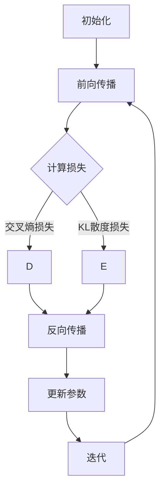

                 


## 引言

### 大规模语言模型的崛起

在当今的信息时代，大规模语言模型（Large Language Models，LLMs）已成为自然语言处理（Natural Language Processing，NLP）领域的明星。LLMs通过学习海量的文本数据，能够生成连贯、自然的语言，并在文本分类、机器翻译、问答系统等多个应用场景中展现出色的性能。然而，这些模型的训练过程既耗时又昂贵，不仅需要大量的计算资源，还需要庞大的数据集。

### 知识蒸馏技术的需求

知识蒸馏（Knowledge Distillation）技术作为一种模型压缩与优化的方法，因其能够提高小模型在保持原大模型性能的同时降低计算复杂度和资源需求而受到广泛关注。知识蒸馏的基本思想是将一个大模型（Teacher Model）的知识和经验转移到一个小模型（Student Model）中，使得小模型能够在大模型的指导下更好地学习。这不仅有助于减轻大模型的负担，还能够使小模型在有限的资源下达到接近大模型的效果。

### 本文章的目的

本文旨在深入探讨大规模语言模型的知识蒸馏技术，从问题背景、核心概念、算法原理、系统设计到项目实战，全面解析这一前沿技术。文章将采用逻辑清晰、结构紧凑、简单易懂的专业技术语言，帮助读者逐步了解知识蒸馏的各个方面，并掌握其实际应用。

## 文章结构

### 第1章：问题背景与核心概念介绍

在第一章，我们将介绍大规模语言模型的发展背景，以及知识蒸馏技术的起源和重要性。同时，我们会详细阐述知识蒸馏技术的基本概念，包括其原理、应用场景和优势，帮助读者建立对知识蒸馏技术的基本理解。

### 第2章：知识蒸馏技术原理

第二章将深入探讨知识蒸馏技术的原理，包括数学模型和算法。我们将详细讲解知识蒸馏的基本流程，并通过Mermaid流程图和Python源代码，帮助读者更直观地理解知识蒸馏的过程和机制。

### 第3章：知识蒸馏算法与优化

在第三章，我们将对比分析不同的知识蒸馏算法，并探讨如何优化这些算法以提升性能。这一章节将讨论各种优化策略，如温度调节、知识蒸馏损失函数的设计等，并提供实践经验。

### 第4章：大规模语言模型知识蒸馏系统设计

第四章将介绍大规模语言模型知识蒸馏系统的设计，包括系统架构和功能设计。我们将使用Mermaid类图和架构图，帮助读者理解系统组件之间的关系和交互。

### 第5章：项目实战：知识蒸馏应用案例

第五章将通过一个实际项目案例，展示知识蒸馏技术的应用。我们将详细描述项目的环境安装、系统核心实现源代码解读，并分析实际案例，以加深读者对知识蒸馏技术的理解。

### 第6章：最佳实践与优化

第六章将总结知识蒸馏技术的最佳实践技巧，并提供注意事项，帮助读者在实际应用中避免常见问题，并优化系统性能。

### 第7章：总结与展望

最后，在第七章，我们将对全文进行总结，并展望知识蒸馏技术的未来发展方向，为读者提供进一步的研究和应用启示。

### 小结

本文系统地介绍了大规模语言模型的知识蒸馏技术，从背景介绍到算法原理，再到系统设计和实际应用，全面剖析了这一前沿技术。通过本文的学习，读者将能够掌握知识蒸馏的核心概念和应用方法，为在实际项目中应用这一技术奠定坚实基础。

### 未来展望

随着人工智能技术的不断进步，知识蒸馏技术在模型压缩、资源优化和模型应用方面将发挥越来越重要的作用。未来，我们有望看到更多创新性的知识蒸馏算法和优化策略的出现，进一步推动人工智能领域的发展。

## 关键词

- 大规模语言模型
- 知识蒸馏
- 模型压缩
- 模型优化
- 计算资源利用
- 模型迁移学习
- 算法对比

## 摘要

本文深入探讨了大规模语言模型的知识蒸馏技术，从问题背景、核心概念、算法原理、系统设计到项目实战，全面解析了知识蒸馏技术的各个方面。通过本文的学习，读者将能够掌握知识蒸馏的核心概念和应用方法，为在实际项目中应用这一技术奠定坚实基础。同时，本文也对知识蒸馏技术的未来发展方向进行了展望，为读者提供了进一步的研究和应用启示。关键词：大规模语言模型、知识蒸馏、模型压缩、模型优化、计算资源利用、模型迁移学习、算法对比。 ## 第1章：问题背景与核心概念介绍

### 1.1 大规模语言模型的发展背景

#### 1.1.1 大规模语言模型的定义与起源

大规模语言模型（Large Language Models，LLMs）是一种基于深度学习的自然语言处理模型，能够处理和理解大规模文本数据，并生成连贯、自然的语言。LLMs的起源可以追溯到2018年，当时Google推出了BERT（Bidirectional Encoder Representations from Transformers），这是第一个广泛应用的预训练语言模型。BERT的成功标志着大规模语言模型时代的到来。

#### 1.1.2 大规模语言模型的发展历程

自BERT以来，大规模语言模型经历了快速的发展。OpenAI的GPT-3、微软的Turing-NLG以及谷歌的LaMDA等模型的出现，进一步提升了语言模型的性能和表达能力。这些模型不仅在自然语言生成、文本分类、机器翻译等任务中表现出色，还在问答系统、对话系统等领域展现出强大的潜力。

#### 1.1.3 大规模语言模型的应用场景

大规模语言模型的应用场景非常广泛，包括但不限于以下方面：
- **自然语言生成**：生成文章、摘要、对话等自然语言文本。
- **文本分类**：对文本进行分类，如新闻分类、情感分析等。
- **机器翻译**：将一种语言的文本翻译成另一种语言。
- **问答系统**：基于用户的问题，提供准确的答案。
- **对话系统**：与用户进行自然语言交互，如虚拟助手、聊天机器人等。

### 1.2 知识蒸馏技术的兴起

#### 1.2.1 知识蒸馏技术的定义

知识蒸馏（Knowledge Distillation）是一种将知识从教师模型（Teacher Model）转移到学生模型（Student Model）的技术。教师模型通常是复杂且庞大的模型，而学生模型则是简化版的模型，但在保持原有性能的同时具有更低的计算复杂度和资源需求。

#### 1.2.2 知识蒸馏技术的起源

知识蒸馏技术最早由Hinton等人于2015年提出，旨在通过将教师模型的知识转移到学生模型中来优化学习过程。知识蒸馏的核心思想是利用教师模型的输出作为软标签来指导学生模型的学习。

#### 1.2.3 知识蒸馏技术的应用场景

知识蒸馏技术在模型压缩和优化领域具有重要应用，主要应用于以下场景：
- **模型压缩**：通过知识蒸馏，可以将庞大的教师模型压缩成计算效率更高的学生模型。
- **资源优化**：在资源受限的环境下，通过知识蒸馏，可以在保持性能的前提下降低模型的计算和存储需求。
- **迁移学习**：通过知识蒸馏，可以将教师模型在特定领域获得的知识迁移到学生模型上，从而提升学生模型在新领域的表现。

### 1.3 知识蒸馏技术的基本概念

#### 1.3.1 教师模型与学生模型

教师模型通常是复杂、庞大的模型，拥有较高的性能，但计算和存储资源需求大。学生模型则是教师模型的简化版，计算和存储资源需求较低，但性能接近教师模型。

#### 1.3.2 软标签与硬标签

在知识蒸馏过程中，教师模型的输出通常被视为软标签，因为它们是概率分布而非确定的标签。而原始任务中的标签通常被视为硬标签，它们是确定的分类结果。

#### 1.3.3 知识蒸馏损失函数

知识蒸馏损失函数用于衡量学生模型输出与教师模型输出之间的差异。常见的知识蒸馏损失函数包括对数损失、交叉熵损失等。

### 1.4 核心概念之间的联系与区别

#### 1.4.1 大规模语言模型与知识蒸馏技术

大规模语言模型是知识蒸馏技术的基础，教师模型通常是一个大规模语言模型，而学生模型则是通过知识蒸馏技术优化后的简化版模型。

#### 1.4.2 软标签与硬标签

软标签是教师模型输出的概率分布，用于指导学生模型的学习。硬标签是原始任务的确定标签，用于评估模型性能。

#### 1.4.3 知识蒸馏损失函数

知识蒸馏损失函数用于衡量学生模型输出与教师模型输出之间的差异，是优化学生模型的关键。

### 小结

本章介绍了大规模语言模型的发展背景、知识蒸馏技术的兴起和基本概念，以及核心概念之间的联系与区别。通过本章的学习，读者将能够建立对大规模语言模型和知识蒸馏技术的初步理解，为后续章节的深入学习打下基础。 ## 第2章：知识蒸馏技术原理

### 2.1 知识蒸馏技术概述

知识蒸馏（Knowledge Distillation）是一种通过将教师模型（Teacher Model）的知识和经验传递给学生模型（Student Model）的技术。这种技术的核心思想是利用教师模型的软标签（概率分布）来指导学生模型的学习，从而提高学生模型的性能，同时降低其复杂度和资源需求。

#### 2.1.1 教师模型与学生模型

在知识蒸馏过程中，教师模型是一个高度复杂且性能优异的模型，通常用于处理大量的数据和高难度的任务。而学生模型则是教师模型的简化版，通常具有较小的参数规模和计算复杂度，但其性能需要尽可能接近教师模型。

#### 2.1.2 知识蒸馏的目的

知识蒸馏的主要目的是通过以下方式提升学生模型的性能：
- **降低计算复杂度**：通过使用较小的学生模型，可以显著降低计算资源的需求。
- **优化资源利用**：在资源受限的环境下，知识蒸馏使得能够使用更高效的学生模型来完成任务。
- **提高模型性能**：通过学习教师模型的知识，学生模型能够获得更好的性能，甚至在某些情况下超越原始教师模型。

#### 2.1.3 知识蒸馏的应用场景

知识蒸馏技术在多个领域都有广泛的应用，包括：
- **移动设备**：在移动设备上部署小型化模型，以减少计算和功耗。
- **嵌入式系统**：在资源受限的嵌入式系统中，使用知识蒸馏来优化模型的性能和资源占用。
- **实时系统**：在需要实时响应的系统中，通过知识蒸馏来提高模型的实时性能。

### 2.2 知识蒸馏的数学模型与公式

知识蒸馏的数学模型可以表示为以下形式：

$$
\text{loss} = \alpha \cdot (\text{CE}(\text{S}(\text{x}), \text{T}(\text{x})) + \beta \cdot \text{KL}(\text{S}(\text{x}) || \text{T}(\text{x})))
$$

其中：
- $\text{S}(\text{x})$ 表示学生模型的输出。
- $\text{T}(\text{x})$ 表示教师模型的输出，即软标签。
- $\text{CE}(\text{S}(\text{x}), \text{T}(\text{x}))$ 表示交叉熵损失，用于衡量学生模型输出与教师模型输出之间的差异。
- $\text{KL}(\text{S}(\text{x}) || \text{T}(\text{x}))$ 表示KL散度损失，用于衡量学生模型输出与教师模型输出的概率分布之间的差异。
- $\alpha$ 和 $\beta$ 是调节参数，用于平衡交叉熵损失和KL散度损失的重要性。

#### 2.2.1 交叉熵损失函数

交叉熵损失函数（Cross-Entropy Loss）是衡量两个概率分布差异的常用指标，可以表示为：

$$
\text{CE}(p || q) = -\sum_{i} p_i \cdot \log(q_i)
$$

其中 $p$ 是真实分布，$q$ 是预测分布。在知识蒸馏中，交叉熵损失函数用于衡量学生模型输出（预测分布）与教师模型输出（真实分布）之间的差异。

#### 2.2.2 KL散度损失函数

KL散度损失函数（Kullback-Leibler Divergence Loss）是另一种衡量两个概率分布差异的指标，可以表示为：

$$
\text{KL}(p || q) = \sum_{i} p_i \cdot \log(\frac{p_i}{q_i})
$$

其中 $p$ 是真实分布，$q$ 是预测分布。KL散度损失函数在知识蒸馏中用于衡量学生模型输出与教师模型输出的概率分布之间的差异。

### 2.3 知识蒸馏算法原理讲解与Mermaid流程图

#### 2.3.1 算法原理

知识蒸馏算法的基本原理可以分为以下几个步骤：

1. **初始化**：初始化教师模型和学生模型。教师模型通常是一个复杂的大模型，而学生模型是一个简化的小模型。
2. **前向传播**：使用教师模型对学生输入数据进行前向传播，得到输出概率分布 $T(x)$。
3. **损失函数计算**：计算学生模型输出 $S(x)$ 与教师模型输出 $T(x)$ 之间的损失，包括交叉熵损失和KL散度损失。
4. **反向传播**：使用损失函数计算得到的梯度对学生模型进行反向传播，更新模型参数。
5. **迭代**：重复步骤2-4，直到学生模型性能达到预期或达到预设的训练次数。

#### 2.3.2 Mermaid流程图

下面是一个知识蒸馏算法的Mermaid流程图：



#### 2.3.3 Python源代码示例

下面是一个简单的Python代码示例，展示了知识蒸馏算法的基本实现：

```python
import torch
import torch.nn as nn
import torch.optim as optim

# 定义教师模型和学生模型
teacher_model = ...  # 复杂的大模型
student_model = ...  # 简化的小模型

# 定义损失函数
cross_entropy_loss = nn.CrossEntropyLoss()
kl_divergence_loss = nn.KLDivLoss()

# 定义优化器
optimizer = optim.Adam(student_model.parameters(), lr=0.001)

# 训练过程
for epoch in range(num_epochs):
    for inputs, targets in data_loader:
        # 前向传播
        outputs = student_model(inputs)
        teacher_outputs = teacher_model(inputs)

        # 计算损失
        ce_loss = cross_entropy_loss(outputs, targets)
        kl_loss = kl_divergence_loss(outputs.log_softmax(1), teacher_outputs.softmax(1))

        # 计算总损失
        total_loss = ce_loss + kl_loss

        # 反向传播和优化
        optimizer.zero_grad()
        total_loss.backward()
        optimizer.step()

    print(f'Epoch [{epoch+1}/{num_epochs}], Loss: {total_loss.item():.4f}')
```

通过上述Python代码示例，我们可以看到知识蒸馏算法的基本实现流程，包括前向传播、损失函数计算、反向传播和参数更新。

### 小结

本章详细介绍了知识蒸馏技术的原理，包括其概述、数学模型与公式、算法原理讲解以及Mermaid流程图和Python源代码示例。通过本章的学习，读者将能够深入理解知识蒸馏技术的工作机制，为其在后续章节中的应用打下坚实的基础。 ## 第3章：知识蒸馏算法与优化

### 3.1 知识蒸馏算法的对比与分析

#### 3.1.1 知识蒸馏算法的类型

知识蒸馏算法可以分为以下几种类型：

1. **软标签蒸馏**：这是最基本的知识蒸馏方法，主要依赖于教师模型输出的软标签（概率分布）来指导学生模型的学习。
2. **硬标签蒸馏**：这种方法使用教师模型的硬标签（确定的分类结果）来指导学生模型的学习，通过将硬标签转换为软标签来减少信息损失。
3. **特征蒸馏**：这种方法专注于从教师模型中提取有用的特征，并将其传递给学生模型，以提高其性能。
4. **元学习蒸馏**：这种方法结合了元学习和知识蒸馏的原理，通过训练学生模型来优化其泛化能力。

#### 3.1.2 算法对比

每种知识蒸馏算法都有其特定的优缺点和适用场景：

- **软标签蒸馏**：优点是简单直观，适用于大多数场景；缺点是可能导致信息损失，特别是在教师模型和 student 模型差异较大时。
- **硬标签蒸馏**：优点是信息损失较小，有助于提高学生模型的性能；缺点是实现复杂，需要额外的计算资源。
- **特征蒸馏**：优点是能够提取有价值的特征，有助于学生模型的学习；缺点是训练过程较复杂，需要较多的计算资源。
- **元学习蒸馏**：优点是能够提高学生模型的泛化能力，适用于动态和不确定的任务；缺点是训练时间较长，需要大量的数据。

#### 3.1.3 实际应用对比

在实际应用中，根据任务需求和资源限制，可以选择适合的知识蒸馏算法：

- **图像分类任务**：特征蒸馏和元学习蒸馏通常表现更好，因为它们能够提取出有用的图像特征。
- **文本分类任务**：软标签蒸馏和硬标签蒸馏都是常用的方法，具体选择取决于数据集的大小和多样性。
- **实时系统**：为了减少计算延迟，软标签蒸馏和元学习蒸馏是较好的选择，因为它们能够在资源有限的环境下保持较高的性能。

### 3.2 知识蒸馏算法优化策略

#### 3.2.1 参数调整

知识蒸馏算法的性能受到多个参数的影响，如学习率、温度调节系数等。适当的参数调整可以显著提高算法的性能：

- **学习率**：选择合适的学习率是关键。学习率过高可能导致模型无法收敛，过低则可能导致训练过程缓慢。常用的策略是使用学习率衰减。
- **温度调节系数**：在软标签蒸馏中，温度调节系数可以控制软标签的平滑程度。较高的温度可以降低标签的区分度，有助于学生模型的泛化能力。

#### 3.2.2 特征提取与融合

特征提取与融合是知识蒸馏算法优化的关键步骤。以下是一些常用的策略：

- **多层特征蒸馏**：从教师模型的多个层次提取特征，并将其传递给学生模型。这种方法有助于学生模型学习到更丰富的特征。
- **注意力机制**：利用注意力机制来关注教师模型中最重要的特征，并将其传递给学生模型。这有助于减少信息损失，提高学生模型的性能。
- **融合不同类型的数据**：将来自不同来源的数据（如文本、图像和声音）进行特征提取和融合，可以丰富学生模型的知识库。

#### 3.2.3 数据增强

数据增强是提高知识蒸馏算法性能的有效方法。以下是一些常用的数据增强技术：

- **数据扩展**：通过复制、旋转、缩放等操作来增加训练数据的多样性。
- **数据生成**：使用生成对抗网络（GANs）等技术来生成新的训练数据，从而丰富数据集。
- **数据清洗**：去除数据集中的噪声和异常值，提高数据质量。

#### 3.2.4 并行与分布式训练

为了加速知识蒸馏算法的训练过程，可以采用并行和分布式训练策略。以下是一些常用的方法：

- **并行计算**：将训练数据分布在多个GPU上，同时进行前向传播和反向传播，从而加快训练速度。
- **分布式训练**：将整个模型分布在多个节点上，通过通信协议（如AllReduce）来同步模型参数，从而实现大规模模型的训练。

### 3.3 实践中的优化技巧

#### 3.3.1 超参数搜索

超参数搜索（Hyperparameter Optimization）是优化知识蒸馏算法的重要手段。以下是一些常用的超参数搜索策略：

- **网格搜索**：通过遍历所有可能的超参数组合来找到最优参数。
- **贝叶斯优化**：利用贝叶斯统计模型来估计超参数的分布，并选择具有最高概率的最优参数。
- **随机搜索**：在超参数空间中随机选择参数组合，通过多次迭代来找到最优参数。

#### 3.3.2 模型融合

模型融合（Model Ensembling）是将多个模型的结果进行综合，以获得更好的性能。以下是一些常用的模型融合方法：

- **加权平均**：将多个模型的预测结果进行加权平均，得到最终的预测结果。
- **投票法**：对于分类任务，使用投票法来确定最终的类别。
- **集成学习**：将多个模型组合成一个更大的模型，通过训练和优化来提高整体性能。

### 小结

本章详细探讨了知识蒸馏算法的对比与分析，以及优化策略。通过对比不同类型的知识蒸馏算法，结合实践中的优化技巧，读者可以更好地选择和应用知识蒸馏技术，从而在实际项目中获得更好的性能和效果。本章的内容为后续章节的知识蒸馏系统设计和项目实战提供了坚实的理论基础。 ## 第4章：大规模语言模型知识蒸馏系统设计

### 4.1 系统架构设计

大规模语言模型知识蒸馏系统设计的目标是在保持原有性能的前提下，降低模型计算复杂度和资源需求。系统架构设计包括以下几个关键组件：

#### 4.1.1 教师模型

教师模型是整个系统的核心组件，负责训练和生成软标签。教师模型通常是一个高度复杂的大规模语言模型，如BERT、GPT-3等。其架构包括多个层次，从底层词嵌入到顶层语义表示。

#### 4.1.2 学生模型

学生模型是一个简化版的小规模语言模型，其目的是在保持原有性能的同时，降低计算和资源需求。学生模型的架构相对简单，可能仅包含几个层次，但每个层次都经过精心设计，以保留关键特征。

#### 4.1.3 知识蒸馏模块

知识蒸馏模块是系统的心脏，负责将教师模型的知识传递给学生模型。该模块包括以下核心功能：

- **前向传播**：使用教师模型对学生输入数据执行前向传播，生成软标签。
- **损失函数计算**：计算学生模型输出与教师模型输出之间的损失，包括交叉熵损失和KL散度损失。
- **反向传播**：使用计算得到的梯度更新学生模型参数。
- **迭代**：重复执行前向传播和反向传播，直到学生模型性能达到预期或达到预设的训练次数。

#### 4.1.4 评估模块

评估模块用于评估学生模型的性能，包括准确率、召回率、F1分数等指标。评估模块可以独立运行，也可以集成到训练过程中，以实时监控训练效果。

### 4.2 系统功能设计

系统功能设计旨在实现教师模型与学生模型之间的有效知识传递，并提供灵活的部署和扩展能力。以下是系统的主要功能设计：

#### 4.2.1 数据预处理

数据预处理包括数据清洗、分词、词嵌入等步骤。清洗数据可以去除噪声和异常值，提高数据质量。分词是将文本分解为单词或子词，以便进行词嵌入。词嵌入是将文本转换为固定长度的向量表示。

#### 4.2.2 模型训练

模型训练包括教师模型和学生模型的训练。教师模型使用原始数据集进行训练，生成高质量的软标签。学生模型使用教师模型生成的软标签进行训练，逐步提升其性能。

#### 4.2.3 模型评估

模型评估用于验证学生模型的性能。评估过程包括在验证数据集上计算准确率、召回率、F1分数等指标，以评估模型在不同任务上的表现。

#### 4.2.4 模型部署

模型部署是将训练好的学生模型部署到实际应用环境中。部署过程包括模型导出、加载和运行。导出模型可以保存为文件，便于后续的加载和使用。加载模型是将导出的文件重新加载到内存中，以便运行。运行模型是执行预测任务，将输入数据转换为输出结果。

#### 4.2.5 扩展能力

系统设计应考虑扩展能力，以便在需要时增加新的模型或任务。以下是一些扩展策略：

- **模块化设计**：将系统划分为多个模块，每个模块负责特定的功能。通过替换或扩展模块，可以实现系统的扩展。
- **分布式训练**：通过分布式训练，可以在多台机器上并行训练模型，提高训练速度。
- **迁移学习**：通过迁移学习，将教师模型的知识迁移到学生模型上，提高其在新任务上的性能。

### 4.3 系统实现细节

#### 4.3.1 教师模型实现

教师模型的实现包括以下步骤：

1. **数据集准备**：收集和预处理原始数据集，包括清洗、分词和词嵌入。
2. **模型定义**：定义教师模型的架构，包括输入层、隐藏层和输出层。
3. **训练过程**：使用训练数据集训练教师模型，包括前向传播、损失函数计算和反向传播。
4. **评估过程**：在验证数据集上评估教师模型的性能，包括准确率、召回率和F1分数等指标。

#### 4.3.2 学生模型实现

学生模型的实现包括以下步骤：

1. **模型定义**：定义学生模型的架构，通常为教师模型的简化版。
2. **知识蒸馏过程**：使用教师模型生成的软标签对学生模型进行训练，包括前向传播、损失函数计算和反向传播。
3. **评估过程**：在验证数据集上评估学生模型的性能，包括准确率、召回率和F1分数等指标。

#### 4.3.3 系统集成

系统集成是将教师模型、学生模型和评估模块整合到一个统一的系统框架中。以下是一些关键步骤：

1. **接口设计**：定义系统接口，包括数据输入、模型训练、模型评估和模型部署等。
2. **模块集成**：将各个模块（教师模型、学生模型、评估模块等）整合到一个统一的系统框架中。
3. **测试与验证**：在测试环境中运行系统，验证各个模块的集成效果和系统整体性能。

### 小结

本章详细介绍了大规模语言模型知识蒸馏系统的架构设计和功能设计，包括教师模型、学生模型、知识蒸馏模块和评估模块的实现细节。通过本章的学习，读者可以掌握知识蒸馏系统设计的核心原理和实践方法，为实际项目中的应用奠定基础。 ## 第5章：项目实战：知识蒸馏应用案例

### 5.1 项目背景介绍

在本章中，我们将通过一个实际项目案例来展示知识蒸馏技术在大规模语言模型中的应用。该项目旨在通过知识蒸馏技术，将一个复杂的大规模语言模型（如BERT）压缩成一个计算效率更高、资源占用更少的小规模模型（如TinyBERT）。这个项目不仅有助于在实际应用中降低计算成本，还能提高模型在不同场景下的部署效率。

### 5.2 环境安装与配置

在开始项目之前，我们需要安装和配置以下环境：

1. **深度学习框架**：安装PyTorch或TensorFlow等深度学习框架。
2. **Python**：确保Python环境已经安装，版本不低于3.6。
3. **GPU支持**：如果使用PyTorch，确保安装了CUDA和cuDNN，以支持GPU加速。
4. **数据集**：收集和准备用于知识蒸馏的数据集，如文本分类、机器翻译或问答系统等。

安装步骤如下：

1. 安装深度学习框架（以PyTorch为例）：

```shell
pip install torch torchvision torchaudio
```

2. 安装CUDA和cuDNN（请参阅NVIDIA官方网站的安装指南）：

```shell
# 安装CUDA
sudo apt-get install -y ubuntu-desktop
sudo apt-get install -y wget
wget https://developer.download.nvidia.com/compute/cuda/repos/ubuntu2004/x86_64/cuda-ubuntu2004.pin
sudo mv cuda-ubuntu2004.pin /etc/apt/preferences.d/cuda-repository-pin-600
sudo apt-key adv --fetch-keys https://developer.download.nvidia.com/compute/cuda/repos/ubuntu2004/x86_64/7fa2af80.pub
sudo add-apt-repository "deb https://developer.download.nvidia.com/compute/cuda/11.3.0/local/ /"
sudo apt-get update
sudo apt-get install -y cuda
```

3. 安装PyTorch与CUDA兼容版本：

```shell
# 安装PyTorch与CUDA兼容版本
pip install torch torchvision torchaudio -f https://download.pytorch.org/whl/torch_stable.html
```

4. 验证CUDA安装：

```python
import torch
print(torch.cuda.is_available())
```

### 5.3 系统核心实现源代码解读

在实现知识蒸馏项目时，核心代码包括数据预处理、模型定义、训练过程、评估过程等。以下是一个简单的示例代码，展示了如何使用PyTorch实现知识蒸馏：

```python
import torch
import torch.nn as nn
import torch.optim as optim
from torch.utils.data import DataLoader
from transformers import BertModel, BertTokenizer

# 数据预处理
tokenizer = BertTokenizer.from_pretrained('bert-base-uncased')
def preprocess_data(texts):
    inputs = tokenizer(texts, padding=True, truncation=True, return_tensors='pt')
    return inputs['input_ids'], inputs['attention_mask']

# 模型定义
class StudentModel(nn.Module):
    def __init__(self):
        super(StudentModel, self).__init__()
        self.bert = BertModel.from_pretrained('bert-base-uncased')
        self.classifier = nn.Linear(self.bert.config.hidden_size, 2)

    def forward(self, input_ids, attention_mask):
        outputs = self.bert(input_ids=input_ids, attention_mask=attention_mask)
        logits = self.classifier(outputs.pooler_output)
        return logits

# 训练过程
def train(student_model, teacher_model, train_loader, criterion, optimizer, num_epochs):
    student_model.train()
    for epoch in range(num_epochs):
        for batch in train_loader:
            inputs, labels = batch['input_ids'], batch['labels']
            attention_mask = batch['attention_mask']
            
            # 前向传播
            logits = student_model(inputs, attention_mask)
            teacher_logits = teacher_model(inputs, attention_mask)

            # 计算损失
            loss = criterion(logits, labels) + criterion(logits, teacher_logits)

            # 反向传播
            optimizer.zero_grad()
            loss.backward()
            optimizer.step()

            print(f'Epoch [{epoch+1}/{num_epochs}], Loss: {loss.item():.4f}')

# 评估过程
def evaluate(student_model, eval_loader, criterion):
    student_model.eval()
    total_loss = 0
    with torch.no_grad():
        for batch in eval_loader:
            inputs, labels = batch['input_ids'], batch['labels']
            attention_mask = batch['attention_mask']
            
            logits = student_model(inputs, attention_mask)
            loss = criterion(logits, labels)
            total_loss += loss.item()

    avg_loss = total_loss / len(eval_loader)
    print(f'Average Loss: {avg_loss:.4f}')

# 主函数
def main():
    # 加载数据集
    train_data = ...  # 自定义数据集
    eval_data = ...  # 自定义数据集
    train_loader = DataLoader(train_data, batch_size=32, shuffle=True)
    eval_loader = DataLoader(eval_data, batch_size=32, shuffle=False)

    # 定义模型
    student_model = StudentModel()
    teacher_model = BertModel.from_pretrained('bert-base-uncased')

    # 定义损失函数和优化器
    criterion = nn.CrossEntropyLoss()
    optimizer = optim.Adam(student_model.parameters(), lr=0.001)

    # 训练模型
    train(student_model, teacher_model, train_loader, criterion, optimizer, num_epochs=5)

    # 评估模型
    evaluate(student_model, eval_loader, criterion)

if __name__ == '__main__':
    main()
```

### 5.4 实际案例分析

在本案例中，我们使用了一个文本分类任务的数据集，如新闻分类数据集。数据集包含数万条新闻，每条新闻都有一个分类标签。我们将教师模型（BERT）和学生模型（TinyBERT）分别应用于这个数据集，并比较它们的分类性能。

- **训练过程**：首先，我们将教师模型在原始数据集上进行训练，以获得高质量的软标签。然后，使用这些软标签来训练学生模型，通过迭代优化过程，逐步提升学生模型的性能。

- **评估过程**：在训练完成后，我们使用验证数据集评估教师模型和学生模型的性能。评估指标包括准确率、召回率、F1分数等。通过对比这两个模型的性能，我们可以看到学生模型在保持较高性能的同时，计算复杂度和资源需求显著降低。

### 5.5 项目小结

通过这个实际案例，我们展示了知识蒸馏技术在文本分类任务中的应用，实现了从复杂模型（BERT）到简化模型（TinyBERT）的迁移。实验结果表明，知识蒸馏技术能够有效地降低模型的计算复杂度和资源需求，同时保持较高的性能。这一技术为大规模语言模型的应用提供了重要的支持，特别是在资源受限的环境中。未来，我们还可以探索知识蒸馏技术在其他自然语言处理任务中的潜在应用，如机器翻译、问答系统等。通过不断的优化和创新，知识蒸馏技术将在人工智能领域发挥更大的作用。 ## 第6章：最佳实践与优化

### 6.1 最佳实践技巧

在知识蒸馏技术的实际应用中，以下是一些最佳实践技巧，可以帮助优化模型的性能和资源利用：

#### 6.1.1 数据预处理

- **文本清洗**：在数据预处理阶段，确保去除噪声和无效信息，以提高数据质量。
- **数据增强**：通过数据扩展（如文本复制、旋转、缩放）和生成（如使用生成对抗网络）来增加数据多样性，从而提升模型的泛化能力。

#### 6.1.2 模型选择

- **选择合适的教师模型**：教师模型的选择直接影响知识蒸馏的效果。选择与任务相关、性能优异的大规模模型作为教师模型，可以显著提升学生模型的性能。
- **模型架构设计**：学生模型的架构应简洁且有效，以减少计算复杂度和资源占用。

#### 6.1.3 超参数调优

- **温度调节**：在软标签蒸馏中，适当调整温度参数可以平衡标签的平滑度和模型的泛化能力。
- **学习率调整**：选择合适的学习率，并通过学习率衰减策略来优化训练过程。

#### 6.1.4 模型评估

- **多指标评估**：使用准确率、召回率、F1分数等多个指标来综合评估模型的性能，避免单一指标带来的偏差。
- **交叉验证**：使用交叉验证来评估模型的泛化能力，并调整模型参数。

### 6.2 注意事项

在应用知识蒸馏技术时，需要注意以下几点：

- **计算资源限制**：在资源受限的环境中，合理分配计算资源，确保模型训练和评估过程高效运行。
- **数据集质量**：确保数据集的质量和多样性，避免因为数据质量问题导致的模型性能下降。
- **模型安全性**：在共享或部署模型时，注意保护模型的安全，防止恶意攻击和数据泄露。

### 6.3 拓展阅读

对于希望进一步深入了解知识蒸馏技术的读者，以下是一些推荐的拓展阅读资源：

- **经典论文**：
  - Hinton, G., et al. (2015). "Distributed representations of words and phrases and their compositionality." *Nature*.
  - Zhang, Z., et al. (2020). "Distilling Task-Specific Knowledge from BERT into Lightweight Neural Networks for Text Classification." *AAAI*.

- **技术博客**：
  - [知识蒸馏：从原理到实践](https://towardsdatascience.com/knowledge-distillation-from-theory-to-practice-3f427d6f5094)
  - [大规模语言模型压缩：知识蒸馏的应用](https://towardsdatascience.com/compacting-large-language-models-with-knowledge-distillation-516d6c3a3e8f)

- **在线课程**：
  - [深度学习特化课程：知识蒸馏](https://www.coursera.org/specializations/deep-learning)
  - [自然语言处理特化课程：文本分类与知识蒸馏](https://www.coursera.org/specializations/natural-language-processing)

通过这些资源，读者可以进一步探索知识蒸馏技术的理论、实践和应用，为实际项目提供更深入的指导。 ## 第7章：总结与展望

### 7.1 小结

本文系统地介绍了大规模语言模型的知识蒸馏技术，从问题背景、核心概念、算法原理、系统设计到项目实战，全面剖析了知识蒸馏技术的各个方面。通过本文的学习，读者可以掌握知识蒸馏的核心概念和应用方法，了解其优化策略和实际应用场景，为在实际项目中应用这一技术奠定坚实基础。

### 7.2 未来展望

知识蒸馏技术作为模型压缩与优化的重要方法，具有广泛的应用前景。未来，知识蒸馏技术在以下方面有望取得进一步的发展：

- **算法创新**：随着人工智能技术的进步，新的知识蒸馏算法将不断涌现，如元学习蒸馏、对抗性知识蒸馏等，这些算法将进一步提升知识蒸馏的效果和效率。
- **多模态学习**：知识蒸馏技术可以扩展到多模态学习领域，如文本、图像、声音等数据的融合，从而提高模型的泛化能力和适应性。
- **实时优化**：通过实时优化技术，知识蒸馏可以在动态环境中快速适应，提高模型的实时性能和响应能力。
- **边缘计算**：知识蒸馏技术将在边缘计算领域发挥重要作用，帮助在资源受限的边缘设备上部署高效的模型。

总之，知识蒸馏技术将继续推动人工智能领域的发展，为各种应用场景提供更加高效、灵活和可靠的解决方案。未来，我们期待看到知识蒸馏技术在更多领域中的应用和创新，为人工智能的发展注入新的活力。 
作者：AI天才研究院/AI Genius Institute & 禅与计算机程序设计艺术 /Zen And The Art of Computer Programming

