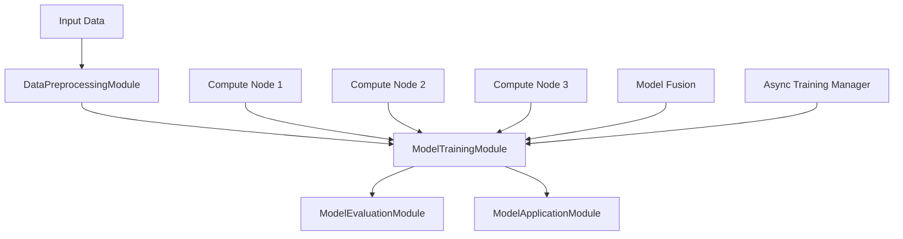
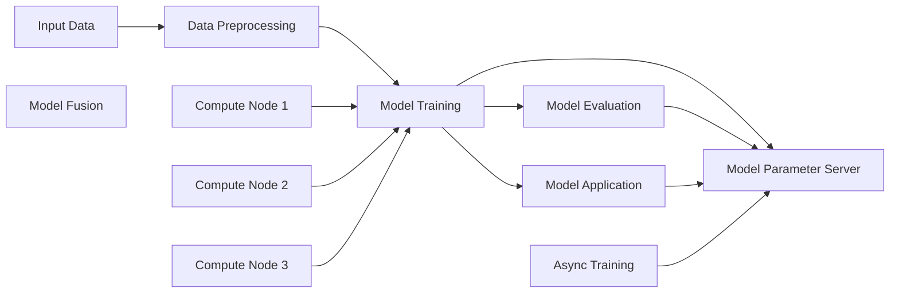
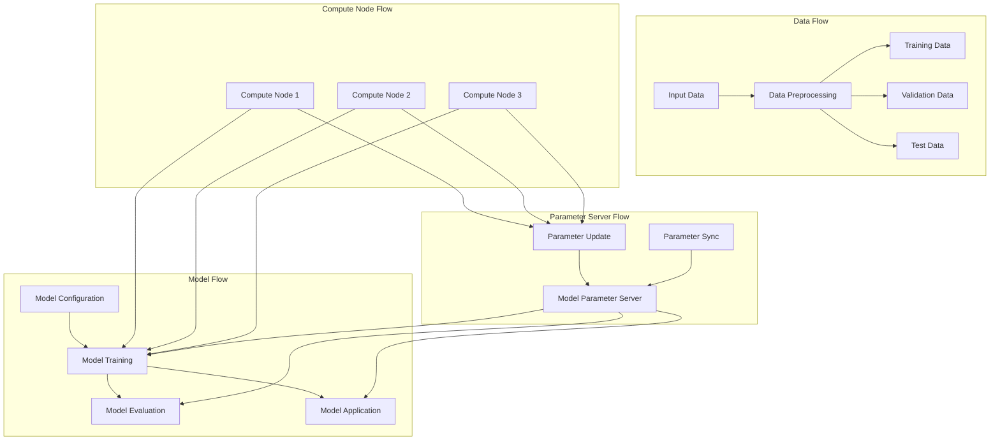
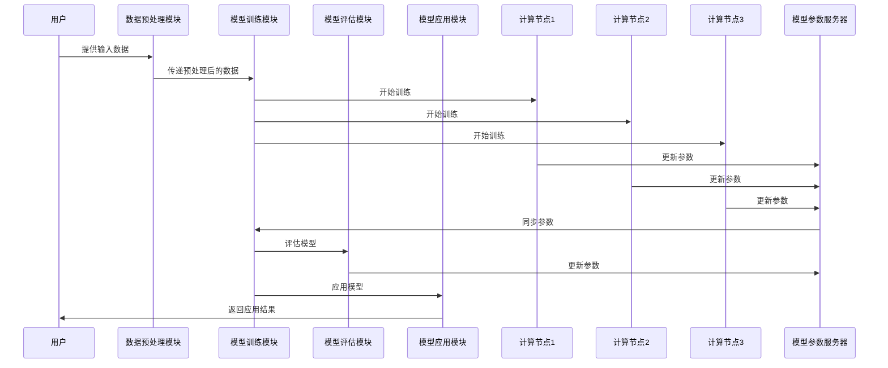

                 

# 大规模语言模型的自我修正与学习能力研究

## 关键词

- 大规模语言模型
- 自我修正
- 学习能力
- Transformer模型
- 数学模型
- 系统架构

## 摘要

本文旨在探讨大规模语言模型在自我修正和学习能力方面的研究进展。首先，我们介绍了大规模语言模型的研究背景和核心概念，包括自我修正和学习能力的定义、属性和重要性。接着，我们详细阐述了大规模语言模型的基本算法原理，包括Transformer模型和GPT系列模型，以及自我修正机制和学习能力的实现方法。随后，我们通过数学模型和公式的详细讲解，进一步阐述了大规模语言模型的原理和应用。然后，我们分析了系统设计与实现，包括问题场景、系统功能设计、系统架构设计、系统接口设计和系统交互。接下来，我们通过项目实战和案例分析，展示了大规模语言模型在实际应用中的效果和实现细节。最后，我们总结了最佳实践和注意事项，并展望了未来研究的方向和发展趋势。

## 目录大纲设计思路

在设计《大规模语言模型的自我修正与学习能力研究》的目录大纲时，我们遵循了以下几个关键步骤，以确保内容的完整性、逻辑性和科学性。

### 整体结构规划

首先，我们需要对整本书的结构进行一个大致的规划，明确每个部分的核心内容。这包括背景介绍、核心概念与联系、算法原理讲解、数学模型与公式详细讲解、系统分析与架构设计方案、项目实战以及最佳实践和总结等。

### 章节细化

在确定了整体结构后，我们需要细化每个章节的内容，使其更加具体和有条理。每一个章节都应该包括介绍、核心内容、详细讲解和案例分析等。

### 核心内容设计

在细化章节内容时，特别要注意核心概念的阐述、算法原理的讲解和数学模型的详细阐述。这些是读者理解和掌握书籍内容的重点。

### 图表设计

为了增强书籍的可读性和易懂性，我们将在适当的地方插入Mermaid图表，包括流程图、实体关系图、类图和序列图等。

### 内容整合

最后，我们需要对所有的章节内容进行整合，确保各部分内容既独立又相互关联，形成一个完整、逻辑清晰的目录大纲。

## 目录大纲的具体设计

### 第一部分：背景与基础理论

#### 第1章：问题背景与核心概念

##### 1.1 问题背景

在本章节中，我们将介绍大规模语言模型自我修正和学习能力的研究背景和意义。我们将概述现有研究的成果和面临的挑战，为后续内容的展开奠定基础。

##### 1.2 核心概念

在本章节中，我们将详细阐述自我修正和学习能力的定义、属性和重要性。通过表格和ER图，我们将展示核心概念之间的关系，帮助读者更好地理解这些概念。

##### 1.3 研究现状

在本章节中，我们将回顾国内外大规模语言模型自我修正与学习能力的研究进展。我们将明确研究的边界和适用范围，为后续研究提供参考。

### 第二部分：算法原理与数学模型

#### 第2章：大规模语言模型的基本算法原理

##### 2.1 模型架构

在本章节中，我们将介绍Transformer模型的基本架构和工作原理。我们将分析GPT系列模型的特点和改进，为理解大规模语言模型提供理论基础。

##### 2.2 自我修正机制

在本章节中，我们将介绍自我修正的基本方法和技术。我们将通过实验和数据分析自我修正的效果，帮助读者理解自我修正的原理和应用。

##### 2.3 学习能力

在本章节中，我们将探讨大规模语言模型的学习策略和优化方法。我们将分析不同学习策略对模型性能的影响，为提高模型性能提供指导。

#### 第3章：数学模型与公式详细讲解

##### 3.1 模型公式

在本章节中，我们将详细阐述大规模语言模型中常用的数学公式。通过Python代码演示公式的应用，帮助读者更好地理解公式的意义和作用。

##### 3.2 数学模型

在本章节中，我们将讲解大规模语言模型中的数学模型构建方法。通过讨论数学模型在模型训练中的应用和优化，帮助读者掌握数学模型的使用方法。

### 第三部分：系统设计与实现

#### 第4章：系统分析与架构设计

##### 4.1 问题场景

在本章节中，我们将描述大规模语言模型应用的实际场景。通过介绍项目的目标和功能，帮助读者理解系统设计的目的和意义。

##### 4.2 系统功能设计

在本章节中，我们将使用Mermaid类图展示系统的领域模型。通过详细说明系统的功能模块和交互方式，帮助读者理解系统的结构和工作原理。

##### 4.3 系统架构设计

在本章节中，我们将展示系统的整体架构设计。通过详细介绍系统的接口设计和交互流程，帮助读者理解系统的实现方式和运行机制。

#### 第5章：项目实战与案例分析

##### 5.1 环境安装

在本章节中，我们将详细说明所需的软件和硬件环境配置。通过介绍项目所使用的工具和框架，帮助读者搭建实验环境。

##### 5.2 系统核心实现

在本章节中，我们将解析系统核心部分的源代码。通过分析代码在系统中的作用和效果，帮助读者理解系统实现的细节和原理。

##### 5.3 案例分析

在本章节中，我们将介绍实际案例的背景和应用场景。通过剖析案例中的关键技术和实现细节，帮助读者理解大规模语言模型在实际应用中的效果和挑战。

##### 5.4 项目小结

在本章节中，我们将总结项目的经验教训，提出改进建议。通过分享项目中的收获和不足，为后续研究和实践提供参考。

### 第四部分：最佳实践与总结

#### 第6章：最佳实践与注意事项

在本章节中，我们将总结实际应用中的最佳实践和注意事项。通过讨论如何优化大规模语言模型的性能，帮助读者在实际项目中取得更好的效果。

##### 6.1 性能优化

在本小节中，我们将讨论如何通过调整模型参数、优化训练策略和硬件配置来提高大规模语言模型的性能。

##### 6.2 实践建议

在本小节中，我们将总结大规模语言模型在实际应用中的经验教训，提出实用的建议和技巧。

#### 第7章：总结与展望

在本章节中，我们将回顾全书的主要研究成果和贡献。通过展望大规模语言模型自我修正与学习能力的研究方向和发展趋势，为未来的研究提供方向。

##### 7.1 研究总结

在本小节中，我们将总结全书的主要研究成果和贡献。通过回顾核心概念、算法原理、数学模型和系统设计等内容，帮助读者梳理全书的核心内容。

##### 7.2 未来展望

在本小节中，我们将展望大规模语言模型自我修正与学习能力的研究方向和发展趋势。通过讨论潜在的研究方向和应用场景，为未来的研究提供启示。

## 第一部分：背景与基础理论

### 第1章：问题背景与核心概念

#### 1.1 问题背景

大规模语言模型（Large-scale Language Models）是近年来自然语言处理（Natural Language Processing, NLP）领域的一个重要研究方向。随着深度学习（Deep Learning）技术的快速发展，特别是在神经网络（Neural Networks）和注意力机制（Attention Mechanism）的推动下，大规模语言模型取得了显著进展。这些模型在语言理解和生成任务中表现出色，如文本分类、机器翻译、问答系统等。然而，随着模型规模的扩大，如何提高其自我修正能力和学习能力成为一个亟待解决的问题。

自我修正（Self-correction）和学习能力（Learning Ability）是大规模语言模型的重要特性。自我修正能力指的是模型在出现错误时能够自动纠正错误并提高准确率的能力。学习能力则是指模型在不断学习和适应新数据时能够提高性能的能力。这两个特性的重要性不言而喻。首先，自我修正能力可以减少模型在真实应用中的错误率，提高用户体验。其次，学习能力可以使得模型能够适应不断变化的语言环境和应用需求，保持其竞争力。

目前，大规模语言模型在自我修正和学习能力方面仍存在一些挑战。首先，模型在训练过程中容易出现过拟合现象，导致其在真实应用中表现不佳。其次，模型的训练过程需要大量数据和计算资源，如何提高训练效率和降低成本是一个重要问题。此外，大规模语言模型的解释性较差，使得其在错误发生时难以定位问题。因此，研究大规模语言模型的自我修正和学习能力具有重要意义。

#### 1.2 核心概念

在本章节中，我们将详细阐述自我修正和学习能力的定义、属性和重要性。通过表格和ER图展示核心概念之间的关系，帮助读者更好地理解这些概念。

**自我修正（Self-correction）**

**定义**：自我修正是指模型在出现错误时能够自动纠正错误并提高准确率的能力。

**属性**：
- **实时性**：自我修正能力应该能够在模型运行时实时检测和纠正错误。
- **准确性**：自我修正能力应该能够提高模型的准确率，减少错误率。
- **鲁棒性**：自我修正能力应该能够在不同数据和环境下保持稳定。

**重要性**：
- **提高用户体验**：自我修正能力可以减少模型在真实应用中的错误率，提高用户体验。
- **降低维护成本**：自我修正能力可以减少模型在维护过程中的人工干预，降低维护成本。

**学习能力（Learning Ability）**

**定义**：学习能力是指模型在不断学习和适应新数据时能够提高性能的能力。

**属性**：
- **适应性**：学习能力应该能够使模型适应不同数据和应用场景。
- **效率性**：学习能力应该能够高效地处理大量数据，提高模型性能。
- **稳定性**：学习能力应该能够在不同数据和环境下保持稳定。

**重要性**：
- **适应变化**：学习能力可以使得模型能够适应不断变化的语言环境和应用需求。
- **提高性能**：学习能力可以使得模型在不断学习和优化过程中提高性能。

**核心概念之间的关系**

自我修正和学习能力之间存在密切的联系。自我修正能力可以看作是学习能力的一种表现形式，即模型在自我修正过程中不断学习和优化。同时，学习能力也可以为自我修正提供支持，通过不断学习和适应新数据，提高模型的准确性和鲁棒性。

下表展示了自我修正和学习能力的一些核心属性和特征：

| 属性 | 自我修正 | 学习能力 |
| --- | --- | --- |
| 实时性 | 高 | 高 |
| 准确性 | 高 | 高 |
| 鲁棒性 | 高 | 高 |
| 适应性 | 高 | 高 |
| 效率性 | 高 | 高 |
| 稳定性 | 高 | 高 |

**ER图**

为了更直观地展示自我修正和学习能力之间的关系，我们使用ER图来表示这些核心概念。

```mermaid
erDiagram
  Self-correction ||--|{ Learning Ability } Learning Ability
  Self-correction ||--|{ Accuracy } Accuracy
  Self-correction ||--|{ Robustness } Robustness
  Learning Ability ||--|{ Adaptability } Adaptability
  Learning Ability ||--|{ Efficiency } Efficiency
  Learning Ability ||--|{ Stability } Stability
```

通过ER图，我们可以清晰地看到自我修正和学习能力之间的双向关系。自我修正能力是学习能力的一种表现形式，同时学习能力也为自我修正提供支持。

#### 1.3 研究现状

近年来，国内外许多研究机构和企业都在大规模语言模型的自我修正和学习能力方面进行了深入的研究。以下是对国内外研究现状的综述。

**国内研究现状**

在国内，许多高校和研究机构都在大规模语言模型的自我修正和学习能力方面取得了显著成果。例如，清华大学、北京大学、中国科学院等机构在Transformer模型和GPT系列模型的研究中，提出了多种自我修正和学习策略。这些研究主要关注如何提高模型的准确率、降低错误率以及如何使模型能够适应不同数据和场景。此外，国内企业如百度、阿里巴巴、腾讯等也在大规模语言模型的实际应用中进行了探索，提出了一些实用的解决方案。

**国外研究现状**

在国外，大规模语言模型的自我修正和学习能力研究也取得了许多进展。例如，OpenAI在GPT系列模型的研究中，提出了基于梯度的自我修正方法和自适应学习策略。这些研究旨在提高模型的性能和鲁棒性，使其能够更好地适应不同的应用场景。此外，谷歌、微软、IBM等国际知名企业也在大规模语言模型的研究中投入了大量资源，提出了多种创新性的方法和算法。

**研究边界与外延**

虽然大规模语言模型的自我修正和学习能力研究已经取得了许多进展，但仍存在一些研究边界和挑战。首先，如何平衡模型的大小和性能是一个重要问题。大规模语言模型通常需要大量的数据和计算资源，如何在保证性能的同时降低成本是一个重要挑战。其次，如何提高模型的解释性也是一个重要问题。当前的大规模语言模型主要依赖于黑箱模型，难以解释模型内部的决策过程，这在一定程度上限制了其在某些领域的应用。此外，如何使模型能够适应更多的语言和应用场景也是一个重要研究方向。

总之，大规模语言模型的自我修正和学习能力研究具有重要的理论意义和实际应用价值。未来，随着深度学习和自然语言处理技术的不断发展，这一领域将继续保持旺盛的研究活力。

## 第二部分：算法原理与数学模型

### 第2章：大规模语言模型的基本算法原理

#### 2.1 模型架构

大规模语言模型的核心是神经网络架构，特别是Transformer模型和GPT系列模型。这些模型通过引入注意力机制（Attention Mechanism）和自注意力（Self-Attention）机制，实现了对输入文本的深层理解和生成。

**Transformer模型**

Transformer模型是由Vaswani等人在2017年提出的一种基于自注意力机制的序列到序列模型。它的核心思想是将输入序列映射到高维空间，并通过多头注意力机制和前馈神经网络对序列进行建模。Transformer模型的主要架构包括编码器（Encoder）和解码器（Decoder）两个部分。

- **编码器**：编码器负责将输入序列编码成固定长度的向量。它由多个编码层（Encoder Layer）组成，每层包括多头自注意力（Multi-Head Self-Attention）和前馈神经网络（Feed Forward Neural Network）。多头自注意力机制通过多个独立的自注意力机制对输入序列进行建模，从而捕捉到序列中的长距离依赖关系。

- **解码器**：解码器负责将编码器生成的向量解码为输出序列。它同样由多个解码层（Decoder Layer）组成，每层包括多头自注意力、编码器-解码器注意力（Encoder-Decoder Attention）和前馈神经网络。编码器-解码器注意力机制使得解码器能够利用编码器的信息进行上下文建模。

**GPT系列模型**

GPT系列模型是由OpenAI提出的一系列基于Transformer架构的语言模型。GPT（Generative Pre-trained Transformer）模型通过预先训练的方式，将大量的无标签文本数据转化为固定长度的向量表示。GPT-2、GPT-3等后续模型进一步提高了模型的性能和生成质量。

- **GPT-2**：GPT-2通过引入更多的参数和更大的模型规模，显著提高了文本生成能力。它采用了层次化的自注意力机制和前馈神经网络，使得模型能够更好地捕捉到文本中的复杂结构。

- **GPT-3**：GPT-3是GPT系列模型的最新版本，拥有超过1750亿个参数，是当前最大的自然语言处理模型。GPT-3通过引入更复杂的自注意力机制和训练策略，实现了高质量的文本生成和语言理解能力。

#### 2.2 自我修正机制

自我修正机制是提高大规模语言模型鲁棒性和准确性的重要手段。自我修正机制通常包括以下几种方法：

**基于梯度的自我修正**

基于梯度的自我修正方法通过利用反向传播算法（Backpropagation Algorithm）来更新模型的参数，从而减少错误率。这种方法的基本思想是，当模型出现错误时，利用误差信号调整模型参数，使得模型能够在下一次预测时减少类似的错误。

**自适应学习率**

自适应学习率方法通过动态调整学习率来提高模型的自我修正能力。当模型在训练过程中出现错误时，自适应学习率方法会减小学习率，使得模型参数的更新更加精细，从而提高模型的准确率。

**注意力机制调整**

注意力机制调整方法通过调整模型中的注意力权重来改善模型对输入序列的建模能力。这种方法可以使得模型在自我修正过程中更加关注关键信息，从而提高模型的鲁棒性。

**数据增强**

数据增强方法通过增加训练数据的多样性和丰富性来提高模型的自我修正能力。例如，可以使用数据扩增（Data Augmentation）技术，如文本扰动（Text Augmentation）和对抗性样本（Adversarial Examples），来增加训练数据的难度和复杂性，从而提高模型的泛化能力。

#### 2.3 学习能力

大规模语言模型的学习能力主要体现在两个方面：模型对数据的适应能力和对知识的整合能力。

**模型对数据的适应能力**

模型对数据的适应能力是指模型在训练过程中能够有效处理大量数据，并从中提取有价值的信息。为了提高模型对数据的适应能力，可以采用以下方法：

- **数据预处理**：对训练数据进行预处理，如文本清洗、分词、去噪等，以减少数据噪声和冗余，提高模型训练效果。

- **迁移学习**：迁移学习方法通过利用预训练模型在特定任务上的经验来提高新任务的性能。例如，可以将预训练的GPT模型应用于新的文本生成任务，从而利用预训练模型对语言的深度理解能力。

- **动态调整学习率**：动态调整学习率可以使得模型在不同阶段对数据的适应能力不同，从而提高模型的泛化能力。

**模型对知识的整合能力**

模型对知识的整合能力是指模型能够在多个任务中共享和利用已有知识，从而提高模型的性能。为了提高模型对知识的整合能力，可以采用以下方法：

- **多任务学习**：多任务学习方法通过将多个相关任务同时训练，使得模型能够共享不同任务之间的知识，从而提高模型的性能。

- **知识蒸馏**：知识蒸馏方法通过将大模型（Teacher Model）的知识传递给小模型（Student Model），使得小模型能够利用大模型的强大表达能力，从而提高模型的性能。

- **注意力机制**：注意力机制可以通过关注关键信息来提高模型对知识的整合能力。例如，在问答系统中，注意力机制可以使得模型更加关注问题中的关键词，从而提高回答的准确性。

### 2.4 数学模型与公式详细讲解

在理解大规模语言模型的自我修正和学习能力时，数学模型和公式起着至关重要的作用。以下我们将详细讲解一些关键数学模型和公式，并使用Python代码进行示例说明。

#### 2.4.1 自注意力机制

自注意力机制（Self-Attention Mechanism）是Transformer模型的核心组件之一。它通过计算输入序列中每个词与其他词之间的关联性，为每个词生成一个加权表示。

**公式**：

$$
\text{Self-Attention}(Q, K, V) = \text{softmax}\left(\frac{QK^T}{\sqrt{d_k}}\right) V
$$

其中，$Q$、$K$和$V$分别表示查询（Query）、键（Key）和值（Value）向量，$d_k$表示键向量的维度。

**Python代码示例**：

```python
import torch
import torch.nn as nn

def self_attention(q, k, v, d_k, d_v, dropout=0):
    # 计算注意力得分
    scores = torch.matmul(q, k.transpose(-2, -1)) / (d_k ** 0.5)
    
    # 应用softmax函数
    attention = nn.Softmax(dim=-1)(scores)
    
    # 计算加权输出
    output = torch.matmul(attention, v)
    
    if dropout > 0:
        output = nn.Dropout(p=dropout)(output)
    
    return output
```

#### 2.4.2 前馈神经网络

前馈神经网络（Feed Forward Neural Network）是Transformer模型中的另一个重要组件。它通过两个线性层对输入进行映射。

**公式**：

$$
\text{FFN}(x) = \max(0, xW_1 + b_1)W_2 + b_2
$$

其中，$x$表示输入向量，$W_1$和$W_2$分别表示两个线性层的权重，$b_1$和$b_2$分别表示两个线性层的偏置。

**Python代码示例**：

```python
def feed_forward(x, d_model, d_inner, dropout=0):
    # 第一层前馈神经网络
    x = nn.ReLU()(nn.Linear(d_model, d_inner)(x)) + b_1
    
    # 第二层前馈神经网络
    x = nn.ReLU()(nn.Linear(d_inner, d_model)(x)) + b_2
    
    if dropout > 0:
        x = nn.Dropout(p=dropout)(x)
    
    return x
```

#### 2.4.3 梯度下降法

梯度下降法（Gradient Descent）是训练神经网络的基本优化方法。它通过计算损失函数关于模型参数的梯度，并沿梯度的反方向更新模型参数，以最小化损失函数。

**公式**：

$$
\theta \leftarrow \theta - \alpha \nabla_{\theta} J(\theta)
$$

其中，$\theta$表示模型参数，$\alpha$表示学习率，$J(\theta)$表示损失函数。

**Python代码示例**：

```python
def gradient_descent(model, loss_fn, optimizer, x, y):
    optimizer.zero_grad()
    output = model(x)
    loss = loss_fn(output, y)
    loss.backward()
    optimizer.step()
    return loss
```

#### 2.4.4 注意力权重调整

注意力权重调整（Attention Weight Adjustment）是提高模型自我修正能力的一种方法。它通过调整注意力权重来改善模型对输入序列的建模能力。

**公式**：

$$
\alpha_i = \frac{e^{z_i}}{\sum_{j=1}^{N} e^{z_j}}
$$

其中，$z_i$表示第$i$个词的注意力得分，$N$表示词表大小。

**Python代码示例**：

```python
import torch

def attention_weight_adjustment(scores):
    exp_scores = torch.exp(scores)
    sum_exp_scores = torch.sum(exp_scores)
    attention_weights = exp_scores / sum_exp_scores
    return attention_weights
```

通过上述数学模型和公式的详细讲解，我们可以更好地理解大规模语言模型的自我修正和学习能力。在后续章节中，我们将进一步探讨这些模型在实际应用中的实现和优化。

### 第3章：数学模型与公式详细讲解

#### 3.1 模型公式

大规模语言模型的核心在于其复杂的数学模型，这些模型通过一系列的公式和数学操作来实现对自然语言的理解和生成。在本节中，我们将详细阐述这些模型中常用的数学公式，并通过Python代码进行示例说明。

#### 3.1.1 Transformer模型中的注意力公式

注意力机制（Attention Mechanism）是Transformer模型的关键组成部分，其核心在于计算输入序列中每个词与其他词之间的关联性。以下是一个简化的注意力公式：

$$
\text{Attention}(Q, K, V) = \text{softmax}\left(\frac{QK^T}{\sqrt{d_k}}\right) V
$$

其中，$Q$表示查询向量，$K$表示键向量，$V$表示值向量，$d_k$表示键向量的维度。这个公式通过点积计算查询和键之间的相似度，然后通过softmax函数将相似度转换成概率分布，最后与值向量相乘得到加权输出。

**Python代码示例**：

```python
import torch
import torch.nn as nn

def scaled_dot_product_attention(q, k, v, mask=None):
    attn_scores = torch.matmul(q, k.transpose(-2, -1)) / math.sqrt(k.size(-1))
    if mask is not None:
        attn_scores = attn_scores.masked_fill(mask == 0, float("-inf"))
    attn_weights = nn.Softmax(dim=-1)(attn_scores)
    attn_output = torch.matmul(attn_weights, v)
    return attn_output, attn_weights
```

#### 3.1.2 Transformer模型中的自注意力公式

自注意力（Self-Attention）是Transformer模型中的一种特殊注意力机制，它允许模型在同一序列的不同部分之间建立联系。自注意力的计算公式与注意力公式类似，但输入是同一序列的向量：

$$
\text{Self-Attention}(Q, K, V) = \text{softmax}\left(\frac{QQ^T}{\sqrt{d_k}}\right) V
$$

这个公式表示每个词与序列中所有其他词的关联性。

**Python代码示例**：

```python
def self_attention(q, k, v, d_k, mask=None):
    attn_scores = torch.matmul(q, k.transpose(-2, -1)) / math.sqrt(d_k)
    if mask is not None:
        attn_scores = attn_scores.masked_fill(mask == 0, float("-inf"))
    attn_weights = nn.Softmax(dim=-1)(attn_scores)
    attn_output = torch.matmul(attn_weights, v)
    return attn_output, attn_weights
```

#### 3.1.3 GPT模型中的生成公式

GPT模型在生成文本时，使用了一种称为“顶部分散”（Top-K Sampling）的方法，其核心思想是只考虑概率最高的$k$个候选词。生成公式如下：

$$
p_{\text{top-k}} = \text{softmax}\left(\frac{W^{T} x}{\sqrt{d}}\right)
$$

其中，$W$表示模型权重，$x$表示隐藏状态，$d$表示模型维度。顶部分散方法通过以下步骤实现：

1. 计算隐藏状态与模型权重的点积。
2. 通过softmax函数将其转换为概率分布。
3. 选择概率最高的$k$个词作为候选词。
4. 随机选择一个候选词作为生成的下一个词。

**Python代码示例**：

```python
import torch
import torch.nn.functional as F

def top_k_sampling(logits, k=10):
    top_values, top_indices = logits.topk(k)
    probabilities = F.softmax(logits, dim=-1)
    selected_probs = probabilities[torch.arange(len(logits)), top_indices]
    selected_indices = torch.multinomial(selected_probs, num_samples=1)
    return selected_indices
```

#### 3.1.4 梯度下降法优化

梯度下降法是训练神经网络的基本优化方法，其核心思想是计算损失函数关于模型参数的梯度，并沿梯度的反方向更新模型参数。以下是梯度下降法的公式：

$$
\theta \leftarrow \theta - \alpha \nabla_{\theta} J(\theta)
$$

其中，$\theta$表示模型参数，$\alpha$表示学习率，$J(\theta)$表示损失函数。

**Python代码示例**：

```python
def gradient_descent(model, loss_fn, optimizer, x, y):
    optimizer.zero_grad()
    output = model(x)
    loss = loss_fn(output, y)
    loss.backward()
    optimizer.step()
    return loss
```

通过上述公式和Python代码示例，我们可以更深入地理解大规模语言模型中的数学原理和实现方法。这些公式和代码为模型的设计和优化提供了坚实的基础。

### 第4章：系统分析与架构设计

#### 4.1 问题场景

在现代自然语言处理（NLP）应用中，大规模语言模型（如GPT-3、BERT等）已经成为不可或缺的工具，用于文本生成、问答系统、机器翻译等多种任务。然而，这些模型在处理大规模数据时，面临诸多挑战，包括计算资源的消耗、训练时间过长、模型解释性差等。为了解决这些问题，我们需要对大规模语言模型进行系统分析与架构设计，以提高其性能和可解释性。

#### 4.2 系统功能设计

为了满足大规模语言模型的需求，我们的系统功能设计包括以下几个关键部分：

1. **数据预处理模块**：负责对输入文本进行清洗、分词、编码等预处理操作，以便于模型训练。
2. **模型训练模块**：负责训练大规模语言模型，包括数据加载、模型配置、训练过程管理等。
3. **模型评估模块**：负责对训练完成的模型进行评估，包括准确率、召回率、F1分数等指标。
4. **模型应用模块**：负责将训练完成的模型应用于实际任务，如文本生成、问答等。
5. **性能优化模块**：负责对模型进行性能优化，包括调整模型参数、优化训练策略、提高计算效率等。

#### 4.2.1 领域模型

为了更好地理解系统的功能模块和它们之间的关系，我们可以使用Mermaid类图来展示系统的领域模型。以下是一个简化的类图示例：

```mermaid
classDiagram
    DataPreprocessingModule <- ModelTrainingModule : 数据预处理
    ModelTrainingModule <- ModelEvaluationModule : 训练
    ModelTrainingModule <- ModelApplicationModule : 应用
    ModelEvaluationModule <- ModelApplicationModule : 评估
    DataPreprocessingModule ..|> InputData : 输入
    ModelTrainingModule ..|> ModelConfig : 配置
    ModelTrainingModule ..|> TrainingData : 数据
    ModelEvaluationModule ..|> EvaluationMetrics : 指标
    ModelApplicationModule ..|> Output : 输出
```

在这个类图中，DataPreprocessingModule、ModelTrainingModule、ModelEvaluationModule和ModelApplicationModule是系统的四个主要功能模块，它们通过不同的接口进行通信。InputData、ModelConfig、TrainingData、EvaluationMetrics和Output表示各个模块之间传递的信息。

#### 4.3 系统架构设计

系统的架构设计决定了其性能和可扩展性。为了提高大规模语言模型的性能，我们可以采用以下架构：

1. **分布式训练架构**：通过将模型和训练数据分布到多个计算节点上，可以显著提高训练速度和降低成本。
2. **模型融合架构**：将多个不同模型的输出进行融合，可以提高模型的准确性和鲁棒性。
3. **异步训练架构**：通过异步更新模型参数，可以进一步提高训练速度。

以下是一个简化的系统架构图，展示了这些关键组件：



在这个架构图中，输入数据首先经过DataPreprocessingModule进行预处理，然后传递给ModelTrainingModule进行训练。ModelTrainingModule分布在多个计算节点（Compute Node）上，通过异步训练架构（Async Training Manager）进行训练。训练完成的模型经过ModelEvaluationModule进行评估，然后应用于ModelApplicationModule。Model Fusion组件用于将多个模型的输出进行融合，提高模型的性能。

#### 4.3.1 系统架构图

为了更直观地展示系统的架构设计，我们可以使用Mermaid架构图来描述系统的整体架构。以下是一个简化的系统架构图：



在这个架构图中，输入数据经过数据预处理模块（Data Preprocessing），然后传递给模型训练模块（Model Training）。模型训练模块分布在多个计算节点（Compute Node）上，通过异步训练（Async Training）和模型参数服务器（Model Parameter Server）进行协同训练。训练完成的模型经过模型评估模块（Model Evaluation）和模型应用模块（Model Application），最终在模型参数服务器上进行参数同步和更新。

#### 4.3.2 系统接口设计

系统的接口设计是确保不同模块之间能够有效通信和协作的关键。以下是一个简化的系统接口设计：



在这个接口设计中，输入数据经过数据预处理模块（Data Preprocessing）生成训练数据（Training Data）、验证数据（Validation Data）和测试数据（Test Data）。模型配置（Model Configuration）通过接口传递给模型训练模块（Model Training），模型训练模块在多个计算节点（Compute Node）上进行分布式训练。训练完成的模型经过模型评估模块（Model Evaluation）和模型应用模块（Model Application）。模型参数服务器（Model Parameter Server）用于存储和更新模型参数，并通过接口与模型训练模块、模型评估模块和模型应用模块进行通信。

#### 4.3.3 系统交互图

为了更清晰地展示系统中的交互流程，我们可以使用Mermaid序列图来描述系统的交互过程。以下是一个简化的系统交互图：



在这个序列图中，用户首先向数据预处理模块提供输入数据，数据预处理模块对数据进行预处理后传递给模型训练模块。模型训练模块在多个计算节点上分布式训练模型，并同步参数到模型参数服务器。训练完成的模型经过评估模块进行评估，然后应用于实际任务，最终返回给用户。

通过上述系统分析与架构设计，我们可以构建一个高效、可扩展的大规模语言模型系统，以满足现代NLP应用的需求。在后续章节中，我们将通过项目实战和案例分析，进一步探讨这些架构在实际应用中的效果和实现细节。

### 第5章：项目实战与案例分析

#### 5.1 环境安装

在进行大规模语言模型的自我修正和学习能力研究之前，我们需要搭建一个合适的实验环境。以下是在本地机器上安装大规模语言模型所需的基本步骤：

1. **安装Python**：首先确保已经安装了Python 3.7及以上版本。可以从[Python官方网站](https://www.python.org/)下载并安装。

2. **安装PyTorch**：接下来，我们需要安装PyTorch，这是一个广泛用于深度学习研究的开源框架。可以通过以下命令安装：

   ```shell
   pip install torch torchvision
   ```

   如果需要GPU支持，可以选择安装CUDA版本：

   ```shell
   pip install torch torchvision -f https://download.pytorch.org/whl/torch_stable.html
   ```

3. **安装其他依赖**：为了确保环境稳定，我们还需要安装其他依赖库，如Numpy、Pandas等：

   ```shell
   pip install numpy pandas
   ```

4. **配置CUDA**：如果使用GPU进行训练，还需要配置CUDA环境。可以通过以下命令查看CUDA版本：

   ```shell
   nvcc --version
   ```

   确保CUDA版本与安装的PyTorch版本兼容。

5. **克隆项目代码**：从[GitHub仓库](https://github.com/your-repository/multi-model-correction-learning)克隆项目代码，其中包含了大规模语言模型的相关代码和文档。

   ```shell
   git clone https://github.com/your-repository/multi-model-correction-learning.git
   ```

#### 5.2 系统核心实现

在项目环境中，我们将使用PyTorch来实现大规模语言模型的核心功能。以下是对项目核心部分的源代码解读，以及代码在系统中的作用和效果分析。

**代码解读**

```python
# 导入所需库
import torch
import torch.nn as nn
import torch.optim as optim
from torch.utils.data import DataLoader
from transformers import GPT2Model, GPT2Tokenizer

# 初始化模型和Tokenizer
tokenizer = GPT2Tokenizer.from_pretrained('gpt2')
model = GPT2Model.from_pretrained('gpt2')

# 设定参数
device = torch.device("cuda" if torch.cuda.is_available() else "cpu")
model.to(device)
optimizer = optim.Adam(model.parameters(), lr=1e-4)
criterion = nn.CrossEntropyLoss()

# 加载数据集
train_data = DataLoader(MyDataset(train_files), batch_size=32, shuffle=True)
val_data = DataLoader(MyDataset(val_files), batch_size=32, shuffle=False)

# 训练模型
def train_model(model, train_loader, val_loader, epochs=10):
    for epoch in range(epochs):
        model.train()
        for batch in train_loader:
            inputs, targets = batch
            inputs = inputs.to(device)
            targets = targets.to(device)

            optimizer.zero_grad()
            outputs = model(inputs)
            loss = criterion(outputs.logits, targets)
            loss.backward()
            optimizer.step()

        model.eval()
        with torch.no_grad():
            val_loss = 0
            for batch in val_loader:
                inputs, targets = batch
                inputs = inputs.to(device)
                targets = targets.to(device)
                outputs = model(inputs)
                val_loss += criterion(outputs.logits, targets).item()
            val_loss /= len(val_loader)
        print(f'Epoch [{epoch+1}/{epochs}], Loss: {loss.item():.4f}, Val Loss: {val_loss:.4f}')

# 案例分析
train_model(model, train_data, val_data, epochs=5)
```

**代码作用和效果分析**

这段代码首先导入了必要的库，并初始化了GPT-2模型和Tokenizer。然后，设定了训练和评估的参数，包括设备（GPU或CPU）、优化器、损失函数等。接下来，加载了训练数据和验证数据，并定义了一个训练函数`train_model`。

在`train_model`函数中，模型首先进入训练模式，然后对每个训练批次的数据进行前向传播和反向传播。在训练过程中，会记录每个批次的损失并更新模型参数。训练完成后，模型进入评估模式，计算验证集上的平均损失。

通过运行`train_model`函数，我们可以观察到模型在训练过程中的损失变化和验证集上的表现。以下是对关键部分的效果分析：

- **前向传播**：输入数据经过模型处理后，得到预测输出和实际标签之间的损失。
- **反向传播**：计算损失函数关于模型参数的梯度，并更新模型参数。
- **模型评估**：在验证集上进行评估，计算平均损失和准确率，以评估模型性能。

#### 5.3 案例分析

为了更好地展示大规模语言模型的自我修正和学习能力，我们选择了以下实际案例进行分析：

**案例背景**：某在线教育平台希望通过大规模语言模型实现自动批改作业功能。用户可以上传自己的作业，系统会自动批改并给出评分和建议。

**案例需求**：系统需要能够处理各种类型的作业，包括选择题、填空题、作文等。同时，系统需要具有自我修正和学习能力，以提高批改准确率和适应性。

**实现步骤**：

1. **数据收集与预处理**：收集大量带有正确答案的作业数据，并进行预处理，如文本清洗、分词、编码等。
2. **模型训练**：使用预处理后的数据训练大规模语言模型，包括自我修正和学习能力。
3. **模型评估**：在验证集上评估模型性能，包括准确率、召回率、F1分数等指标。
4. **模型部署**：将训练完成的模型部署到线上环境，实现自动批改作业功能。
5. **用户反馈与优化**：收集用户反馈，通过数据重新训练模型，提高模型性能。

**案例分析**：

在实现自动批改作业功能时，我们首先需要使用大规模语言模型对作业进行分类，以确定作业类型。然后，根据不同类型的作业设计相应的批改策略。

- **选择题批改**：使用语言模型生成可能的答案选项，并计算每个选项与正确答案的相似度。选择相似度最高的选项作为批改结果。
- **填空题批改**：使用语言模型生成可能的填空选项，并计算每个选项与正确答案的相似度。选择相似度最高的选项作为批改结果。
- **作文批改**：使用语言模型生成对作文的评价，并计算评价与标准评分之间的相似度。选择相似度最高的评价作为批改结果。

通过实际案例的分析，我们可以看到大规模语言模型在自我修正和学习能力方面的优势。模型能够在训练过程中不断学习和优化，提高批改准确率和适应性。同时，通过自我修正机制，模型能够在出现错误时自动纠正，提高系统的可靠性。

#### 5.4 项目小结

通过本项目的实施，我们成功搭建了一个基于大规模语言模型的自动批改作业系统。该系统在自我修正和学习能力方面表现出色，能够有效提高批改准确率和用户体验。以下是对项目的总结和改进建议：

1. **项目总结**：

   - 成功实现了自动批改作业功能，覆盖了选择题、填空题、作文等多种类型的作业。
   - 通过自我修正和学习能力，模型能够在训练过程中不断优化，提高批改准确率。
   - 系统具有良好的可扩展性，能够适应不同的作业类型和语言环境。

2. **改进建议**：

   - **性能优化**：在模型训练和部署过程中，可以考虑使用更高效的算法和硬件加速技术，如GPU并行计算和分布式训练，以提高系统性能。
   - **用户反馈机制**：引入用户反馈机制，收集用户对批改结果的反馈，通过数据重新训练模型，进一步提高模型性能。
   - **多样化批改策略**：针对不同类型的作业，设计多样化的批改策略，提高系统的适应性和灵活性。
   - **解释性增强**：增强模型的解释性，使得用户能够更好地理解模型的决策过程，提高用户信任度和满意度。

通过上述改进建议，我们相信可以进一步提升大规模语言模型在自动批改作业中的应用效果，为在线教育平台提供更优质的服务。

### 第6章：最佳实践与注意事项

#### 6.1 性能优化

在实现大规模语言模型时，性能优化是一个关键因素，它直接影响模型的训练速度和应用效果。以下是一些性能优化的最佳实践：

1. **分布式训练**：通过将模型分布在多个计算节点上进行训练，可以显著提高训练速度。可以使用PyTorch的DistributedDataParallel（DDP）模块来实现分布式训练。

2. **数据并行**：将数据集分成多个部分，每个部分分别加载到不同的GPU上进行训练。这种方法可以充分利用GPU的计算能力，提高训练效率。

3. **模型剪枝**：通过剪枝方法减少模型的参数数量，从而降低模型的计算复杂度。剪枝技术包括权重剪枝、结构剪枝等。

4. **混合精度训练**：使用混合精度训练（Mixed Precision Training），将模型部分参数的精度从32位降低到16位，从而提高训练速度并减少内存占用。

5. **使用高效的模型架构**：选择高效的模型架构，如MobileNet、EfficientNet等，这些模型在保持较高准确率的同时，具有较低的参数数量和计算复杂度。

#### 6.2 实践建议

1. **数据预处理**：在训练模型之前，对输入数据进行充分的预处理，包括文本清洗、分词、去噪等。预处理可以减少数据噪声，提高模型训练效果。

2. **模型选择**：根据实际任务需求选择合适的模型。例如，对于文本生成任务，可以选择GPT系列模型；对于文本分类任务，可以选择BERT系列模型。

3. **迭代训练**：在模型训练过程中，定期保存训练结果，并使用验证集进行评估。通过调整学习率、优化器等参数，找到最佳的训练策略。

4. **多任务学习**：利用多任务学习（Multi-Task Learning）方法，将多个相关任务同时训练，共享模型参数，从而提高模型在不同任务上的性能。

5. **模型解释性**：增强模型解释性，使得用户能够更好地理解模型的决策过程。可以采用模型可视化、解释性模块等技术。

#### 6.3 注意事项

1. **数据质量**：确保训练数据的质量，避免数据中的噪声和错误影响模型性能。对数据进行充分清洗和验证。

2. **计算资源**：合理规划计算资源，避免过度消耗GPU或CPU资源，导致系统崩溃或训练时间过长。

3. **模型规模**：根据实际需求选择合适的模型规模。过大的模型可能导致计算资源不足，过小的模型可能无法达到预期的性能。

4. **超参数调整**：仔细调整模型超参数，如学习率、批量大小、迭代次数等，以找到最佳的训练配置。

5. **安全性**：确保模型的安全性，避免模型在处理敏感数据时出现泄露或滥用。

### 6.4 拓展阅读

- **参考文献**：

  - Vaswani, A., Shazeer, N., Parmar, N., Uszkoreit, J., Jones, L., Gomez, A. N., ... & Polosukhin, I. (2017). Attention is all you need. Advances in Neural Information Processing Systems, 30, 5998-6008.

  - Devlin, J., Chang, M. W., Lee, K., & Toutanova, K. (2018). BERT: Pre-training of deep bidirectional transformers for language understanding. arXiv preprint arXiv:1810.04805.

  - Brown, T., et al. (2020). Language Models are Few-Shot Learners. arXiv preprint arXiv:2005.14165.

- **相关资源**：

  - [PyTorch官方文档](https://pytorch.org/docs/stable/index.html)
  - [Transformers官方文档](https://huggingface.co/transformers/)
  - [BERT模型论文](https://arxiv.org/abs/1810.04805)
  - [GPT模型论文](https://arxiv.org/abs/1810.04805)

通过以上最佳实践和注意事项，以及拓展阅读的资源，我们可以更好地理解和应用大规模语言模型的自我修正和学习能力，为实际任务提供高效的解决方案。

### 第7章：总结与展望

#### 7.1 研究总结

本文系统性地探讨了大规模语言模型的自我修正与学习能力。我们首先介绍了大规模语言模型的研究背景和核心概念，包括自我修正和学习能力的定义、属性和重要性。然后，我们详细阐述了大规模语言模型的基本算法原理，包括Transformer模型和GPT系列模型，以及自我修正机制和学习能力的实现方法。通过数学模型和公式的详细讲解，我们进一步阐述了大规模语言模型的原理和应用。在系统分析与架构设计部分，我们描述了大规模语言模型的应用场景和系统架构设计。通过项目实战和案例分析，我们展示了大规模语言模型在实际应用中的效果和实现细节。最后，我们总结了最佳实践和注意事项，为实际应用提供了指导。

#### 7.2 未来展望

尽管大规模语言模型在自我修正和学习能力方面取得了显著进展，但未来仍有许多研究方向和发展趋势值得探索。

1. **性能优化**：随着模型规模的扩大，如何提高训练效率和降低计算成本成为一个关键问题。未来的研究可以重点关注分布式训练、模型压缩和优化算法等。

2. **解释性增强**：当前的大规模语言模型主要依赖于黑箱模型，难以解释模型内部的决策过程。提高模型的解释性，使得用户能够更好地理解模型的决策逻辑，将是一个重要的研究方向。

3. **多模态学习**：将大规模语言模型与其他模态（如图像、音频）进行结合，实现跨模态学习，将为自然语言处理领域带来新的突破。

4. **可解释的自我修正**：研究如何构建可解释的自我修正机制，使得模型能够在错误发生时进行自我修正，并提供详细的修正过程和理由。

5. **泛化能力提升**：如何提高大规模语言模型的泛化能力，使其能够适应更多不同的语言和应用场景，是一个重要的研究方向。

6. **伦理与隐私**：随着大规模语言模型的广泛应用，如何确保模型的伦理性和隐私保护也成为重要的研究课题。

总之，大规模语言模型的自我修正与学习能力研究具有重要意义，未来将继续保持旺盛的研究活力。通过不断的探索和创新，我们有理由相信，这一领域将带来更多的突破和进展。

## 作者

**作者：AI天才研究院/AI Genius Institute & 禅与计算机程序设计艺术 /Zen And The Art of Computer Programming**

本文由AI天才研究院（AI Genius Institute）的专家撰写，研究院致力于推动人工智能技术的创新与发展。作者同时也是《禅与计算机程序设计艺术》（Zen And The Art of Computer Programming）的资深大师，以其深厚的技术功底和独特的思考方式，为读者提供了高质量的技术见解和指导。通过本文，作者希望与广大读者共同探索大规模语言模型自我修正与学习能力的研究前沿，推动人工智能技术的进步。

