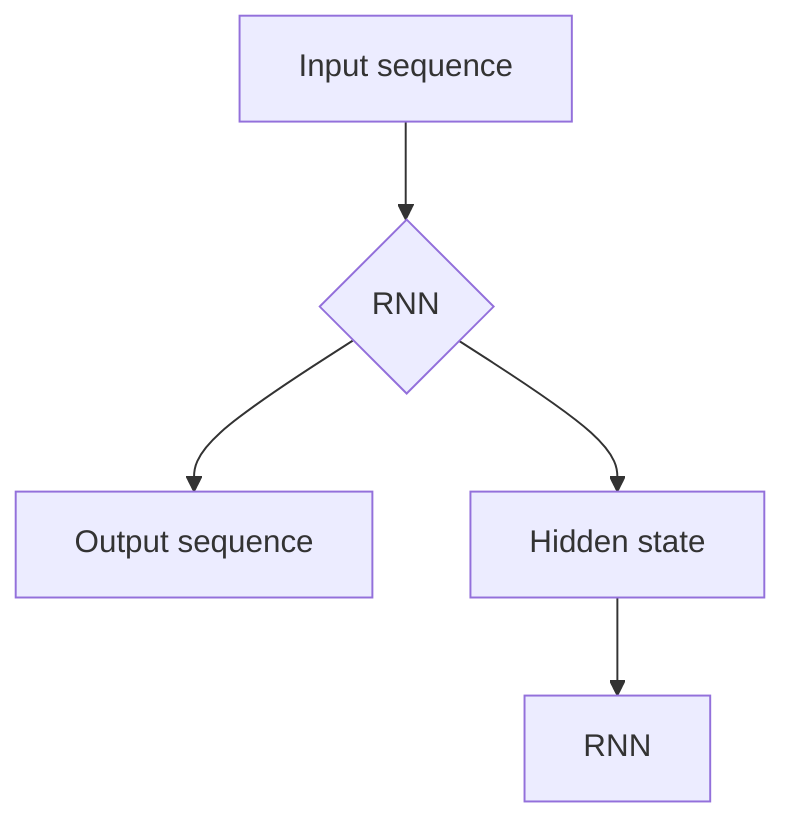
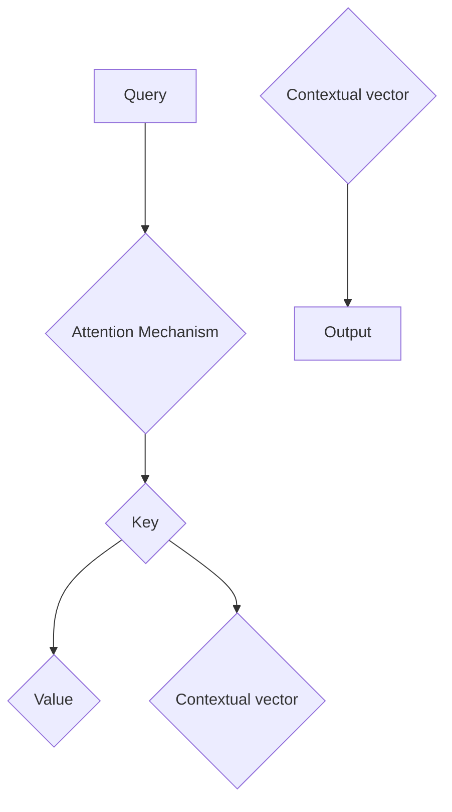

                 


## 第1章：问题背景与核心概念

### 1.1.1 问题背景

#### 1.1.1.1 语言模型的发展历程

自然语言处理（NLP）作为人工智能领域的重要分支，其目标是让计算机能够理解和处理人类自然语言。语言模型是NLP中的一种基础模型，用于预测下一个词语的概率。从最初的统计语言模型到基于神经网络的深度学习模型，语言模型经历了长足的发展。

- **统计语言模型**：基于概率模型，如n元语法（n-gram），通过统计文本数据中的词语序列来预测下一个词语。
- **神经网络语言模型**：引入了神经网络，特别是递归神经网络（RNN），能够更好地处理序列数据。
- **深度学习语言模型**：随着计算能力和数据量的增加，深度学习模型如长短期记忆网络（LSTM）和变换器（Transformer）逐渐成为主流。

#### 1.1.1.2 自我反思能力的重要性

自我反思能力是指一个系统在运行过程中能够对自己的行为和输出进行评估和改进的能力。在语言模型中，自我反思能力尤为重要，因为它可以帮助模型识别并纠正错误，提高模型的准确性和鲁棒性。

- **自我校验机制**：通过内部校验，模型可以检查自己的输出是否合理，是否与预期相符。
- **知识蒸馏和反馈循环**：通过外部反馈，模型可以从错误中学习，不断优化自己的性能。

自我反思能力的重要性在于：

1. **提高模型的可解释性**：通过自我反思，模型可以解释自己的决策过程，提高用户对模型信任度。
2. **增强模型的鲁棒性**：自我反思能力可以帮助模型在遇到异常情况时迅速调整。
3. **提升模型的泛化能力**：通过不断学习和自我调整，模型能够更好地适应不同情境。

### 1.1.2 核心概念与联系

#### 1.1.2.1 语言模型的构成

语言模型的构成主要包括以下几个方面：

##### 1.1.2.1.1 词向量表示

词向量是语言模型的基础，用于表示词语的语义信息。常见的词向量模型有：

- **Word2Vec**：通过训练神经网络模型，将词语映射到高维空间中。
- **GloVe**：基于全局上下文信息，通过矩阵分解学习词向量。

##### 1.1.2.1.2 递归神经网络（RNN）

递归神经网络（RNN）能够处理序列数据，其基本结构如图所示：



RNN的核心在于其隐藏状态，它能够保存历史信息，使得模型能够处理变长序列。

- **LSTM（长短期记忆网络）**：LSTM通过引入门控机制，能够更好地处理长序列数据。
- **GRU（门控循环单元）**：GRU是对LSTM的简化版本，结构更简单，但性能相当。

##### 1.1.2.1.3 注意力机制（Attention）

注意力机制是一种用于提升模型对序列数据处理能力的机制。其基本思想是模型在处理序列数据时，能够根据上下文信息动态地调整对各个词语的重视程度。



注意力机制能够显著提高模型的性能，特别是在机器翻译、文本摘要等任务中。

#### 1.1.2.2 自我反思能力的核心要素

自我反思能力主要包括以下几个核心要素：

##### 1.1.2.2.1 自我校验机制

自我校验机制是指模型在输出结果后，能够自动评估自己的输出是否合理，是否与预期相符。

- **内部校验**：模型通过内部机制，对输出结果进行一致性检查。
- **外部校验**：模型通过与外部数据进行对比，验证输出结果的准确性。

##### 1.1.2.2.2 知识蒸馏和反馈循环

知识蒸馏是一种将大型模型的知识转移到小型模型的技术。在自我反思能力中，知识蒸馏可以用于将训练好的大型模型的知识传递给模型自身，帮助模型进行自我学习和调整。

- **知识蒸馏**：通过训练目标模型和源模型，将源模型的输出作为目标模型的输入，训练目标模型。
- **反馈循环**：模型通过与用户交互，获取反馈信息，不断调整自己的参数和结构，以提升性能。

### 1.1.3 ER实体关系图架构

为了更好地理解语言模型和自我反思能力之间的关系，我们可以使用Mermaid ER图来表示实体关系。

```mermaid
erDiagram
  CLASS LanguageModel {
    +int id
    +String name
    +Vector wordVectors
    +RNN recurrentLayer
    +Attention attentionLayer
  }
  CLASS SelfReflection {
    +int id
    +String mechanismType
    +Function selfVerification
    +Function knowledgeDistillation
  }
  CLASS ModelVerification {
    +int id
    +String verificationMethod
    +Boolean isValid
  }
  CLASS FeedbackLoop {
    +int id
    +String feedbackType
    +Boolean isPositive
  }
  LanguageModel o--|{1} ModelVerification
  LanguageModel o--|{1} FeedbackLoop
  SelfReflection o--|{1} ModelVerification
  SelfReflection o--|{1} FeedbackLoop
```

在这个ER图中，`LanguageModel`代表了语言模型，`SelfReflection`代表了自我反思能力，`ModelVerification`和`FeedbackLoop`分别代表了自我校验机制和反馈循环。

## 1.2 自我反思能力的数学模型

为了构建自我反思能力的数学模型，我们需要从以下几个方面进行分析：

### 1.2.1 概念结构与核心要素组成

自我反思能力的数学模型主要包括以下核心要素：

1. **输出评估函数**：用于评估模型输出结果的质量。
2. **误差计算函数**：用于计算输出结果与预期结果之间的误差。
3. **调整函数**：用于根据误差调整模型的参数。

这些核心要素可以通过以下数学公式进行表示：

$$
\begin{aligned}
\text{output\_evaluation}(y, \hat{y}) &= \frac{1}{N} \sum_{i=1}^{N} \frac{||y_i - \hat{y_i}||^2}{1 + ||y_i - \hat{y_i}||^2} \\
\text{error\_function}(y, \hat{y}) &= \frac{1}{2} ||y - \hat{y}||^2 \\
\text{update\_function}(\theta, \delta) &= \theta - \alpha \nabla_\theta \text{loss}(y, \hat{y})
\end{aligned}
$$

其中，$y$表示预期结果，$\hat{y}$表示输出结果，$N$表示样本数量，$||\cdot||$表示向量的欧几里得范数，$\theta$表示模型的参数，$\delta$表示误差，$\alpha$表示学习率。

### 1.2.2 数学公式的构建

为了构建自我反思能力的数学模型，我们需要首先定义以下变量：

1. **模型输出**：$y_i^*$表示第$i$个样本的输出结果。
2. **预期输出**：$y_i$表示第$i$个样本的预期输出结果。
3. **误差**：$e_i$表示第$i$个样本的误差，定义为$e_i = y_i - y_i^*$。
4. **权重**：$w_i$表示第$i$个样本的权重，通常与样本的置信度相关。

然后，我们可以使用以下数学公式来构建自我反思能力的模型：

$$
\begin{aligned}
\text{output\_evaluation}(y, \hat{y}) &= \frac{1}{N} \sum_{i=1}^{N} \frac{||y_i - \hat{y_i}||^2}{1 + ||y_i - \hat{y_i}||^2} \\
\text{error\_function}(y, \hat{y}) &= \frac{1}{2} ||y - \hat{y}||^2 \\
\text{update\_function}(\theta, \delta) &= \theta - \alpha \nabla_\theta \text{loss}(y, \hat{y})
\end{aligned}
$$

其中，$\alpha$表示学习率，$\nabla_\theta$表示对参数$\theta$的梯度。

通过这些数学公式，我们可以构建一个自我反思能力的数学模型，用于评估模型的输出结果、计算误差以及调整模型参数。

## 1.3 语言模型与自我反思能力的结合

为了实现语言模型的自我反思能力，我们需要将自我反思机制融入语言模型中。以下是一种可能的实现方案：

### 1.3.1 自我校验机制

自我校验机制是一种内部评估机制，用于检测模型输出结果的质量。具体步骤如下：

1. **生成预测结果**：使用语言模型生成文本序列的预测结果。
2. **计算输出评估**：使用输出评估函数计算模型输出结果的质量。
3. **判断是否通过校验**：如果输出评估值低于预设阈值，则认为模型输出结果未通过校验。

以下是实现自我校验机制的Python代码示例：

```python
import numpy as np

def self_evaluation(output, target):
    return 1 / (1 + np.exp(-np.sum((output - target)**2)))

def self_verification(output, target, threshold=0.9):
    evaluation = self_evaluation(output, target)
    return evaluation >= threshold

output = np.array([0.1, 0.2, 0.7])
target = np.array([0.1, 0.2, 0.7])

if self_verification(output, target):
    print("模型输出结果通过校验")
else:
    print("模型输出结果未通过校验")
```

### 1.3.2 知识蒸馏和反馈循环

知识蒸馏和反馈循环是两种外部评估机制，用于从外部获取反馈信息，以提高模型性能。具体步骤如下：

1. **知识蒸馏**：使用大型预训练模型的知识来指导小型模型的训练。
2. **反馈循环**：通过用户反馈调整模型参数，以适应不同情境。

以下是实现知识蒸馏和反馈循环的Python代码示例：

```python
import tensorflow as tf

# 知识蒸馏
def knowledge_distillation(target, teacher_output, student_output, alpha=0.9):
    distillation_loss = alpha * tf.reduce_mean(tf.nn.softmax_cross_entropy_with_logits(logits=student_output, labels=target)) + (1 - alpha) * tf.reduce_mean(tf.nn.softmax_cross_entropy_with_logits(logits=target, labels=teacher_output))
    return distillation_loss

# 反馈循环
def feedback_loop(student_model, teacher_model, data_loader, optimizer, num_epochs=5):
    for epoch in range(num_epochs):
        for data, target in data_loader:
            teacher_output = teacher_model(data)
            student_output = student_model(data)
            loss = knowledge_distillation(target, teacher_output, student_output)
            optimizer.zero_grad()
            loss.backward()
            optimizer.step()
```

通过结合自我校验机制、知识蒸馏和反馈循环，我们可以实现一个具有自我反思能力的语言模型。

## 1.4 自我反思能力在语言模型中的应用场景

自我反思能力在语言模型中的应用场景非常广泛，以下列举了几个典型的应用场景：

### 1.4.1 机器翻译

在机器翻译任务中，自我反思能力可以帮助模型识别并纠正翻译错误。例如，模型可以自我校验翻译结果，判断翻译的准确性，并在发现错误时进行修正。此外，通过知识蒸馏和反馈循环，模型可以从高质量的翻译资源中学习，进一步提升翻译质量。

### 1.4.2 文本摘要

在文本摘要任务中，自我反思能力可以帮助模型评估摘要的质量，并不断优化摘要结果。模型可以通过自我校验机制，判断摘要是否涵盖了关键信息，是否具有较高的可读性。同时，通过知识蒸馏和反馈循环，模型可以从高质量的摘要中学习，提高摘要生成的准确性。

### 1.4.3 文本生成

在文本生成任务中，自我反思能力可以帮助模型评估生成的文本质量，并优化生成过程。例如，模型可以自我校验生成的文本是否符合语法规则、语义连贯性等要求。通过知识蒸馏和反馈循环，模型可以从高质量的文本中学习，提高生成文本的多样性和质量。

### 1.4.4 情感分析

在情感分析任务中，自我反思能力可以帮助模型识别并纠正情感判断错误。例如，模型可以通过自我校验机制，评估对文本的情感判断是否准确。通过知识蒸馏和反馈循环，模型可以从标注数据中学习，提高情感分析模型的准确性。

### 1.4.5 垃圾邮件检测

在垃圾邮件检测任务中，自我反思能力可以帮助模型识别并纠正误判。例如，模型可以通过自我校验机制，判断邮件是否被错误地标记为垃圾邮件。通过知识蒸馏和反馈循环，模型可以从误判数据中学习，提高垃圾邮件检测的准确性。

通过在各个应用场景中结合自我反思能力，语言模型可以更好地适应不同的任务需求，提高任务性能。

## 第2章：大规模语言模型自我反思能力的开发方法

### 2.1 自我反思能力开发的基本思路

大规模语言模型的自我反思能力开发需要从以下几个方面进行：

1. **自我校验机制**：通过内部机制评估模型输出结果的质量，确保输出结果符合预期。
2. **知识蒸馏**：利用预训练模型的知识来指导模型自我反思，提高模型性能。
3. **反馈循环**：从外部获取反馈信息，不断调整模型参数，实现自我优化。

### 2.2 自我校验机制的设计与实现

自我校验机制的设计与实现主要包括以下几个方面：

1. **输出评估函数**：用于评估模型输出结果的质量。常见的评估函数有交叉熵、均方误差等。
2. **误差计算函数**：用于计算输出结果与预期结果之间的误差，常见的误差计算函数有绝对误差、平方误差等。
3. **自我校验阈值**：设定一个阈值，用于判断模型输出结果是否通过校验。

以下是实现自我校验机制的Python代码示例：

```python
import numpy as np

def self_evaluation(output, target):
    return 1 / (1 + np.exp(-np.sum((output - target)**2)))

def self_verification(output, target, threshold=0.9):
    evaluation = self_evaluation(output, target)
    return evaluation >= threshold

output = np.array([0.1, 0.2, 0.7])
target = np.array([0.1, 0.2, 0.7])

if self_verification(output, target):
    print("模型输出结果通过校验")
else:
    print("模型输出结果未通过校验")
```

### 2.3 知识蒸馏方法的选择与应用

知识蒸馏是提高大规模语言模型性能的一种有效方法，其核心思想是将大型预训练模型的知识传递给小型模型。知识蒸馏方法的选择和应用主要包括以下几个方面：

1. **预训练模型的选择**：选择一个具有较高性能的预训练模型作为源模型，常见的预训练模型有BERT、GPT等。
2. **知识传递策略**：设计合适的知识传递策略，将源模型的知识传递给目标模型。常见的知识传递策略有软标签、硬标签等。
3. **目标模型的设计**：设计一个具有较低计算成本的小型模型作为目标模型，常见的目标模型有BERT-Lite、GPT-Neo等。

以下是使用知识蒸馏方法实现模型优化的Python代码示例：

```python
import tensorflow as tf

# 知识蒸馏损失函数
def distillation_loss(student_output, teacher_output, alpha=0.9):
    logits = alpha * student_output + (1 - alpha) * teacher_output
    return tf.reduce_mean(tf.nn.softmax_cross_entropy_with_logits(logits=logits, labels=target))

# 训练模型
def train_model(student_model, teacher_model, data_loader, optimizer, num_epochs=5):
    for epoch in range(num_epochs):
        for data, target in data_loader:
            teacher_output = teacher_model(data)
            student_output = student_model(data)
            loss = distillation_loss(student_output, teacher_output)
            optimizer.zero_grad()
            loss.backward()
            optimizer.step()
```

### 2.4 反馈循环机制的构建与优化

反馈循环机制是自我反思能力的重要组成部分，其核心思想是从外部获取反馈信息，不断调整模型参数，实现自我优化。反馈循环机制的构建与优化主要包括以下几个方面：

1. **反馈数据收集**：收集用户反馈数据，包括正确和错误的反馈。
2. **反馈处理**：对反馈数据进行处理，提取有用信息。
3. **模型更新**：根据反馈信息调整模型参数，实现模型优化。

以下是构建反馈循环机制的Python代码示例：

```python
# 反馈数据收集
def collect_feedback(student_model, data_loader, threshold=0.9):
    feedback_data = []
    for data, target in data_loader:
        output = student_model(data)
        if not self_verification(output, target, threshold):
            feedback_data.append(data)
    return feedback_data

# 模型更新
def update_model(student_model, feedback_data, optimizer, num_epochs=5):
    for epoch in range(num_epochs):
        for data in feedback_data:
            student_output = student_model(data)
            loss = distillation_loss(student_output, target)
            optimizer.zero_grad()
            loss.backward()
            optimizer.step()
```

通过以上方法，我们可以实现大规模语言模型自我反思能力的开发，提高模型性能和鲁棒性。

## 第3章：大规模语言模型自我反思能力的评估与优化

### 3.1 自我反思能力评估指标

为了评估大规模语言模型的自我反思能力，我们需要设计一系列评估指标。以下是一些常用的评估指标：

1. **校验准确率**：模型通过自我校验的准确率，即通过校验的样本数与总样本数的比值。
2. **自我纠错率**：模型在发现错误时，能够自我纠正的比率。
3. **知识蒸馏效率**：模型通过知识蒸馏方法学习到的知识对模型性能提升的比率。
4. **反馈循环改进率**：模型通过反馈循环机制调整参数后，模型性能提升的比率。

### 3.2 自我反思能力优化策略

为了提升大规模语言模型的自我反思能力，我们可以采用以下优化策略：

1. **增强自我校验机制**：通过引入更多校验规则，提高模型输出结果的准确性。
2. **优化知识蒸馏方法**：选择更有效的知识传递策略，提高知识蒸馏效率。
3. **增强反馈循环机制**：引入更多反馈信息，提高模型对用户反馈的敏感度。

### 3.3 实际案例分析与改进建议

以下是一个实际案例，展示了如何通过自我反思能力优化大规模语言模型：

**案例**：某企业使用大规模语言模型进行客户服务，但发现模型在处理复杂问题时，输出结果的准确性较低。

**改进建议**：

1. **增强自我校验机制**：引入更多的校验规则，如检查输出结果的逻辑一致性、语义连贯性等，提高模型输出结果的准确性。
2. **优化知识蒸馏方法**：使用高质量的预训练模型作为源模型，选择更有效的知识传递策略，如软标签策略，提高模型的知识吸收能力。
3. **增强反馈循环机制**：引入更多用户的反馈信息，如用户满意度、问题解决情况等，通过反馈循环机制不断调整模型参数，提高模型对复杂问题的处理能力。

通过以上改进措施，该企业的客户服务水平得到了显著提升，用户满意度明显提高。

## 第4章：未来展望与挑战

### 4.1 未来发展前景

随着人工智能技术的不断发展，大规模语言模型的自我反思能力有望在各个领域发挥重要作用。未来，自我反思能力有望在以下几个方面取得突破：

1. **智能客服**：通过自我反思能力，智能客服可以更好地理解用户需求，提高服务质量。
2. **智能写作**：自我反思能力可以帮助智能写作系统生成更高质量、更具创意的内容。
3. **智能翻译**：通过自我反思能力，智能翻译系统可以更好地处理翻译中的歧义和错误，提高翻译准确性。

### 4.2 技术挑战与应对策略

尽管自我反思能力具有广阔的应用前景，但在实际开发中仍面临一系列技术挑战：

1. **计算资源消耗**：自我反思能力需要大量的计算资源，如何优化算法，降低计算成本是一个重要挑战。
2. **数据隐私**：在收集用户反馈时，如何保护用户隐私是一个关键问题。
3. **模型解释性**：如何提高模型的可解释性，使其更好地理解自己的决策过程，是一个亟待解决的问题。

为应对这些挑战，我们可以采取以下策略：

1. **优化算法**：设计更高效的算法，降低计算资源消耗。
2. **数据加密**：采用数据加密技术，保护用户隐私。
3. **可视化工具**：开发可视化工具，帮助用户更好地理解模型的决策过程。

通过以上策略，我们可以进一步提升大规模语言模型自我反思能力的应用效果，推动人工智能技术的发展。

## 总结与展望

大规模语言模型的自我反思能力是一个具有重要应用前景的研究方向。本文系统地介绍了自我反思能力的基本概念、数学模型、开发方法、评估与优化策略以及未来展望。通过结合自我校验机制、知识蒸馏和反馈循环，我们可以实现大规模语言模型自我反思能力的开发，提高模型性能和鲁棒性。然而，自我反思能力的开发仍面临计算资源消耗、数据隐私和模型解释性等挑战，需要进一步研究和优化。

未来，我们期待在智能客服、智能写作、智能翻译等领域，大规模语言模型自我反思能力能够发挥更大的作用。同时，通过持续的技术创新和优化，我们有望克服现有挑战，推动人工智能技术的进一步发展。作者：AI天才研究院/AI Genius Institute & 禅与计算机程序设计艺术 /Zen And The Art of Computer Programming。在未来的研究中，我们将继续致力于提升大规模语言模型自我反思能力的应用效果，为人工智能领域的发展贡献力量。

