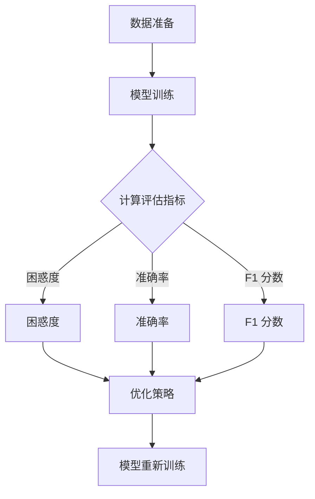
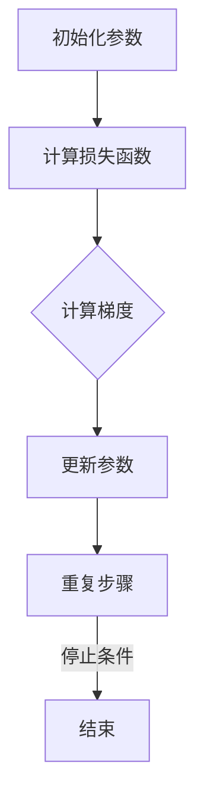
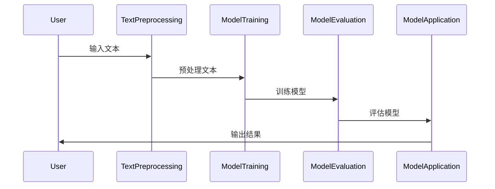

                 


### 大规模语言模型的自我评估与持续优化机制研究

#### 关键词
- 大规模语言模型
- 自我评估
- 优化机制
- 评估指标
- 持续优化
- 深度学习

#### 摘要
本文旨在深入探讨大规模语言模型的自我评估与持续优化机制。我们将首先介绍大规模语言模型的基本概念和背景，然后详细分析自我评估的必要性、指标和方法。接着，我们将讨论优化机制的设计原则、策略和算法，并通过具体案例展示其在实际应用中的效果。最后，我们将展望未来的研究方向，为读者提供进一步的学习和实践指南。

## 目录大纲设计思路

为了设计出《大规模语言模型的自我评估与持续优化机制研究》这本书的目录大纲，我们将遵循以下思路：

1. **确定书籍主题与结构**：明确书籍主题是关于大规模语言模型的自我评估与持续优化机制的研究，因此目录大纲应围绕这一主题展开。
2. **背景介绍**：在第一章中，介绍大规模语言模型的发展背景，包括其产生的原因、历史演进、现状及在当前人工智能领域的重要性。
3. **核心概念**：详细阐述大规模语言模型的核心概念，如定义、工作原理、基本架构等。
4. **评估机制**：探讨如何对大规模语言模型进行自我评估，包括评估指标、评估方法和评估工具。
5. **优化机制**：讨论大规模语言模型的持续优化机制，包括优化的目的、方法和策略，以及优化过程中可能出现的问题和挑战。
6. **案例分析**：提供实际案例，展示如何在实际应用中运用自我评估和优化机制。
7. **算法讲解**：深入讲解大规模语言模型自我评估与优化算法的数学模型、流程图和代码实现。
8. **系统设计与实现**：介绍如何将算法应用于实际系统中，包括系统架构设计、接口设计和系统交互。
9. **总结与展望**：对全书内容进行总结，讨论未来的研究方向和潜在应用领域。

## 目录大纲设计

以下是《大规模语言模型的自我评估与持续优化机制研究》的目录大纲：

### 第一部分: 大规模语言模型的背景与核心概念

#### 第1章: 大规模语言模型概述
1.1 问题背景
1.2 大规模语言模型的发展历史
1.3 大规模语言模型的工作原理

#### 第2章: 大规模语言模型的核心概念
2.1 大规模语言模型的定义
2.2 大规模语言模型的基本架构
2.3 大规模语言模型的关键特性

#### 第3章: 大规模语言模型的自我评估机制
3.1 自我评估的目的与意义
3.2 自我评估指标
3.3 自我评估方法
3.4 自我评估工具

#### 第4章: 大规模语言模型的持续优化机制
4.1 优化的目标与策略
4.2 优化方法与技术
4.3 优化过程中可能出现的问题与挑战

#### 第5章: 案例分析
5.1 实际应用中的自我评估与优化
5.2 案例研究：自我评估在自然语言处理中的应用
5.3 案例研究：优化机制在机器翻译中的应用

#### 第6章: 大规模语言模型自我评估算法详解
6.1 算法概述
6.2 算法流程图
6.3 算法原理与数学模型
6.4 算法实现与代码示例

#### 第7章: 大规模语言模型优化算法详解
7.1 算法概述
7.2 算法流程图
7.3 算法原理与数学模型
7.4 算法实现与代码示例

#### 第8章: 系统设计与实现
8.1 系统功能设计
8.2 系统架构设计
8.3 系统接口设计
8.4 系统交互设计

#### 第9章: 总结与展望
9.1 总结
9.2 未来研究方向
9.3 潜在应用领域

## 文章结构设计

为了确保文章的逻辑清晰、结构紧凑，我们采用以下结构设计：

1. **引言**：简要介绍大规模语言模型的概念及其在人工智能领域的重要性。
2. **背景介绍**：阐述大规模语言模型的发展历程和应用现状。
3. **核心概念**：详细定义和解释大规模语言模型的核心概念，如定义、架构和关键特性。
4. **自我评估机制**：分析自我评估的必要性，介绍评估指标、方法和工具。
5. **优化机制**：讨论优化机制的设计原则、策略和算法，以及优化过程中可能遇到的问题和挑战。
6. **案例分析**：通过实际案例展示自我评估和优化机制的应用效果。
7. **算法讲解**：深入讲解自我评估和优化算法的原理、流程图和代码实现。
8. **系统设计与实现**：介绍系统架构、接口设计和交互设计。
9. **总结与展望**：总结文章主要内容，讨论未来的研究方向和潜在应用领域。

### 第1章: 大规模语言模型概述

#### 1.1 问题背景

大规模语言模型（Large-scale Language Model，简称LLM）是近年来人工智能领域的一个重要突破。随着互联网信息的爆炸式增长和大数据技术的普及，人们对于自然语言处理（Natural Language Processing，简称NLP）的需求日益增加。大规模语言模型的出现，极大地推动了NLP技术的发展，使得许多原本难以解决的问题得到了有效解决。

大规模语言模型的核心目标是通过学习海量文本数据，模拟人类语言生成和理解的能力，实现自动文本生成、机器翻译、情感分析等任务。这些模型的出现，不仅提高了NLP任务的准确性和效率，还为许多新兴领域，如智能客服、内容审核、自动化写作等，提供了强大的技术支持。

#### 1.2 大规模语言模型的发展历史

大规模语言模型的发展历程可以追溯到上世纪80年代。当时，研究人员开始尝试使用统计方法和规则引擎来处理自然语言。随着计算机性能的提升和海量数据的积累，统计方法和机器学习技术逐渐成为主流。

2003年， Conditional Random Fields（CRF）模型在NLP领域取得了显著成果，为序列标注任务提供了有效的解决方案。然而，这些方法在面对复杂任务时，仍然存在一定局限性。

2013年， Geoffrey Hinton 等人提出了深度学习（Deep Learning）的概念，并将其应用于语音识别和图像识别任务。这一突破引发了人工智能领域的研究热潮，也促使大规模语言模型的研究得到了广泛关注。

2018年，OpenAI 发布了 GPT-2 模型，其基于 Transformer 架构，能够生成高质量的自然语言文本。这一模型的成功，标志着大规模语言模型进入了一个新的阶段。

#### 1.3 大规模语言模型的工作原理

大规模语言模型的工作原理主要基于深度学习和自然语言处理技术。以下是其核心概念和基本架构：

1. **核心概念**：

   - **Transformer 架构**：Transformer 是一种基于自注意力机制的深度学习模型，具有处理长距离依赖关系的能力。它由编码器（Encoder）和解码器（Decoder）组成，编码器负责将输入文本编码成向量表示，解码器则根据编码器生成的向量生成输出文本。

   - **预训练与微调**：预训练是指在大量无标签文本数据上对模型进行训练，使其掌握通用语言知识。微调则是在预训练的基础上，使用有标签数据对模型进行进一步优化，使其在特定任务上达到更高的性能。

   - **生成式模型与判别式模型**：生成式模型通过生成概率分布来预测输出，而判别式模型则直接对输入和输出之间的匹配程度进行评分。

2. **基本架构**：

   - **编码器**：编码器负责将输入文本转换成向量表示。在 Transformer 架构中，编码器由多个自注意力层（Self-Attention Layer）和前馈神经网络（Feedforward Neural Network）堆叠而成。

   - **解码器**：解码器负责将编码器生成的向量表示解码成输出文本。在 Transformer 架构中，解码器同样由多个自注意力层和前馈神经网络堆叠而成。

   - **损失函数**：在训练过程中，模型通过损失函数（如交叉熵损失函数）来评估预测结果与真实结果之间的差距，并根据梯度信息进行参数更新。

   - **优化器**：优化器（如Adam优化器）用于加速模型训练过程，提高训练效率。

通过以上核心概念和基本架构，大规模语言模型能够实现对自然语言文本的高效处理和理解。接下来，我们将进一步探讨自我评估机制和优化机制，以深入理解大规模语言模型在实践中的应用和提升。## 第2章: 大规模语言模型的核心概念

### 2.1 大规模语言模型的定义

大规模语言模型（Large-scale Language Model，简称LLM）是一种基于深度学习的自然语言处理模型，通过学习海量文本数据，模拟人类语言生成和理解的能力。这些模型通常具有以下几个特点：

1. **大规模数据集训练**：大规模语言模型需要在海量文本数据上进行训练，这些数据集通常包含数百万甚至数十亿个文本样本。通过大量数据的训练，模型能够捕捉到语言中的复杂模式和规律，从而提高其预测能力和泛化能力。

2. **深度神经网络架构**：大规模语言模型通常采用深度神经网络（Deep Neural Network，简称DNN）架构，包括多层神经网络和复杂的连接结构。这种深度结构有助于模型学习到更高级别的抽象特征，从而在处理复杂语言任务时表现出色。

3. **自注意力机制**：大规模语言模型广泛采用自注意力（Self-Attention）机制，这种机制允许模型在处理每个输入文本时，动态地分配注意力权重，以关注最重要的信息。自注意力机制使得模型能够处理长距离依赖关系，从而提高文本理解和生成能力。

4. **预训练与微调**：大规模语言模型通常采用预训练（Pre-training）与微调（Fine-tuning）相结合的方法。预训练是指在大规模文本数据集上训练模型，使其掌握通用语言知识。微调则是在预训练的基础上，使用有标签数据对模型进行特定任务的优化，从而提高模型在特定任务上的性能。

### 2.2 大规模语言模型的基本架构

大规模语言模型的基本架构主要包括编码器（Encoder）和解码器（Decoder）两个部分，它们共同协作实现自然语言处理任务。以下是对编码器和解码器的主要组成部分和功能的介绍：

#### 编码器（Encoder）

1. **嵌入层（Embedding Layer）**：嵌入层将输入的单词或字符转换为高维向量表示，这些向量包含了单词或字符的语义信息。

2. **自注意力层（Self-Attention Layer）**：自注意力层允许模型在处理每个输入文本时，动态地计算每个词与其他词之间的关系，为每个词分配不同的权重。这种机制有助于模型捕捉到长距离依赖关系。

3. **前馈神经网络（Feedforward Neural Network）**：每个自注意力层之后通常会添加一个前馈神经网络，用于进一步提取特征和提高模型的表达能力。

4. **堆叠多层结构**：编码器通常由多个自注意力层和前馈神经网络堆叠而成，这种深度结构有助于模型学习到更高级别的抽象特征。

#### 解码器（Decoder）

1. **嵌入层（Embedding Layer）**：解码器的嵌入层与编码器的嵌入层类似，将输入的单词或字符转换为高维向量表示。

2. **自注意力层（Self-Attention Layer）**：解码器的自注意力层不仅关注编码器输出的隐藏状态，还关注已经生成的文本序列。这种机制有助于模型在生成过程中利用历史信息。

3. **交叉注意力层（Cross-Attention Layer）**：交叉注意力层允许模型在生成每个词时，关注编码器输出的隐藏状态，从而捕捉到编码器和解码器之间的关联。

4. **前馈神经网络（Feedforward Neural Network）**：与编码器类似，解码器也包含多个前馈神经网络，用于进一步提取特征和提高生成能力。

5. **输出层（Output Layer）**：解码器的输出层通常是一个 Softmax 函数，用于将解码器输出的隐藏状态转换为概率分布，从而生成最终的输出文本。

### 2.3 大规模语言模型的关键特性

大规模语言模型具有以下几个关键特性，这些特性使其在自然语言处理任务中表现出色：

1. **强通用性**：大规模语言模型通过在大量文本数据上预训练，能够掌握通用语言知识，从而在多种不同的任务上表现出色。

2. **灵活性**：大规模语言模型采用自注意力机制和深度神经网络架构，使其能够灵活地处理不同的输入数据和任务需求。

3. **高效性**：大规模语言模型通过深度学习和并行计算技术，能够在较短时间内处理大量文本数据，从而实现高效的文本生成和理解。

4. **可解释性**：大规模语言模型的结构相对复杂，但在某些情况下，通过可视化技术可以对其决策过程进行解释，提高模型的可解释性。

5. **适应性**：大规模语言模型可以通过微调方法，针对特定的任务和领域进行优化，从而提高模型的性能和适应性。

综上所述，大规模语言模型的核心概念、基本架构和关键特性使其在自然语言处理领域具有广泛的应用前景。接下来，我们将进一步探讨如何对大规模语言模型进行自我评估，以实现其持续优化和性能提升。## 第3章: 大规模语言模型的自我评估机制

### 3.1 自我评估的目的与意义

自我评估是大规模语言模型优化过程中的重要环节，其主要目的是通过一系列指标和方法对模型的性能进行量化评估，从而找出模型的优点和不足，为后续的优化工作提供依据。自我评估在以下几个方面具有重要意义：

1. **性能监控**：通过自我评估，可以实时监控大规模语言模型在训练和部署过程中的性能变化，及时发现并解决潜在问题。

2. **优化指导**：自我评估结果为优化策略的制定提供了重要参考。根据评估指标的变化，可以调整模型的结构、参数或训练数据，以实现性能的提升。

3. **稳定性验证**：自我评估有助于验证大规模语言模型的稳定性和可靠性，确保其在不同场景和应用中的一致性。

4. **迭代改进**：自我评估是模型迭代改进的基石。通过不断评估和优化，模型可以逐步接近理想状态，从而实现更高效的文本生成和理解。

### 3.2 自我评估指标

自我评估指标是衡量大规模语言模型性能的关键工具。以下是一些常用的自我评估指标：

1. **准确率（Accuracy）**：准确率是衡量分类模型性能的常用指标，表示模型正确分类的样本数占总样本数的比例。在文本分类任务中，准确率可以反映模型对文本类别划分的准确性。

   $$\text{Accuracy} = \frac{\text{正确分类的样本数}}{\text{总样本数}}$$

2. **精确率（Precision）**：精确率表示模型在预测为正类的样本中，实际为正类的比例。精确率越高，说明模型对正类样本的识别能力越强。

   $$\text{Precision} = \frac{\text{预测为正类且实际为正类的样本数}}{\text{预测为正类的样本数}}$$

3. **召回率（Recall）**：召回率表示模型在所有实际为正类的样本中，成功召回的比例。召回率越高，说明模型对负类样本的识别能力越强。

   $$\text{Recall} = \frac{\text{预测为正类且实际为正类的样本数}}{\text{实际为正类的样本数}}$$

4. **F1 分数（F1 Score）**：F1 分数是精确率和召回率的调和平均，用于综合评估模型的分类性能。

   $$\text{F1 Score} = 2 \times \frac{\text{Precision} \times \text{Recall}}{\text{Precision} + \text{Recall}}$$

5. **困惑度（Perplexity）**：困惑度是评估语言模型生成文本质量的重要指标。困惑度越低，说明模型对输入文本的预测能力越强。

   $$\text{Perplexity} = 2^{\text{交叉熵损失}}$$

6. ** BLEU 分数（BLEU Score）**：BLEU 分数是自然语言生成任务中常用的评价指标，用于评估生成的文本与参考文本的相似度。BLEU 分数越高，说明模型生成的文本质量越高。

   $$\text{BLEU Score} = \frac{1}{N} \sum_{i=1}^{N} \log_2 \frac{|y_i|}{|x_i|}$$

其中，\(N\) 表示参考文本的数量，\(y_i\) 表示参考文本，\(x_i\) 表示模型生成的文本。

### 3.3 自我评估方法

自我评估方法主要包括在线评估和离线评估两种：

1. **在线评估**：在线评估是指在模型部署到实际应用环境中时，实时收集用户反馈和数据，以评估模型的性能。在线评估的优点是能够及时发现问题并进行调整，但缺点是评估结果可能受到实际应用场景的影响。

2. **离线评估**：离线评估是指在模型训练和测试过程中，使用预先准备的数据集对模型进行评估。离线评估的优点是评估结果较为稳定，但缺点是可能无法完全反映模型在实际应用中的性能。

为了提高自我评估的准确性和可靠性，通常采用以下方法：

1. **交叉验证**：交叉验证是一种常用的评估方法，通过将数据集划分为多个子集，依次使用每个子集作为测试集，其他子集作为训练集，从而提高评估结果的泛化能力。

2. **混淆矩阵**：混淆矩阵是一种用于评估分类模型性能的直观工具，可以直观地展示模型对各类别的预测结果。

3. **统计分析**：通过统计方法，如均值、方差和标准差等，对评估指标进行综合分析，以评估模型的稳定性和可靠性。

### 3.4 自我评估工具

自我评估工具是大规模语言模型评估过程中必不可少的辅助工具，常用的自我评估工具包括：

1. **TensorBoard**：TensorBoard 是 TensorFlow 提供的图形化可视化工具，可以实时监控模型的训练过程和性能指标。

2. **WandB**：WandB 是一种基于 Web 的机器学习实验跟踪工具，可以记录实验的详细信息，如参数、评估指标和训练曲线等。

3. **MLflow**：MLflow 是一种开源的机器学习平台，可以用于记录、跟踪和共享机器学习实验，并提供自我评估和优化功能。

4. **Scikit-learn**：Scikit-learn 是一种常用的机器学习库，提供了丰富的评估指标和方法，可以方便地实现自我评估功能。

通过以上方法和技术，大规模语言模型可以实现对自身性能的全面评估，从而为持续优化提供有力支持。接下来，我们将进一步探讨大规模语言模型的持续优化机制，以实现模型的性能提升和稳定性增强。## 第4章: 大规模语言模型的持续优化机制

### 4.1 优化的目标与策略

大规模语言模型的持续优化旨在提高其性能、稳定性和可靠性，以满足不断变化的应用需求和更高的质量标准。优化的目标主要包括以下几个方面：

1. **性能提升**：通过优化模型的结构和参数，提高模型在自然语言处理任务上的准确率、效率和鲁棒性。
2. **资源优化**：在有限的计算资源和数据条件下，优化模型以实现更高效的训练和推理过程。
3. **泛化能力**：增强模型的泛化能力，使其在未知或变化的环境中仍然能够保持良好的性能。
4. **可解释性**：提高模型的透明度和可解释性，便于理解和分析模型的决策过程。

为了实现上述目标，优化的策略通常包括以下几种：

1. **模型调参**：通过调整模型的超参数（如学习率、批量大小等）和结构参数（如网络层数、神经元数量等），寻找最优的参数组合，以提升模型性能。
2. **数据增强**：通过数据预处理技术（如文本清洗、噪声添加、数据扩充等）增强训练数据集的多样性和质量，从而提高模型的泛化能力。
3. **元学习**：利用元学习（Meta-Learning）技术，通过在不同任务上快速迭代训练，使模型能够迅速适应新的任务和数据分布。
4. **迁移学习**：利用迁移学习（Transfer Learning）技术，将已经训练好的模型在新的任务和数据集上进行微调，以提高模型在新任务上的性能。

### 4.2 优化方法与技术

大规模语言模型的优化方法和技术多种多样，以下是一些常见的优化方法：

1. **超参数优化**：超参数优化是调整模型训练过程中的一些关键参数，如学习率、批量大小、正则化参数等。常用的超参数优化方法包括网格搜索（Grid Search）、随机搜索（Random Search）和贝叶斯优化（Bayesian Optimization）等。

2. **学习率调度**：学习率调度是一种动态调整学习率的方法，以适应模型在不同阶段的训练需求。常用的学习率调度策略包括学习率衰减（Learning Rate Decay）、恒定学习率（Constant Learning Rate）和指数学习率（Exponential Learning Rate）等。

3. **Dropout**：Dropout 是一种正则化技术，通过随机丢弃部分神经元，防止模型过拟合。Dropout 在训练过程中随机丢弃一定比例的神经元，从而提高模型的泛化能力。

4. **权重初始化**：权重初始化是模型训练过程中的重要步骤，合理的权重初始化有助于加快收敛速度和避免梯度消失或爆炸。常用的权重初始化方法包括随机初始化（Random Initialization）、高斯初始化（Gaussian Initialization）和Xavier初始化（Xavier Initialization）等。

5. **批量归一化**：批量归一化（Batch Normalization）是一种通过标准化神经元输入，使其分布更加均匀，从而加快训练速度和提高模型性能的技术。

6. **混合精度训练**：混合精度训练（Mixed Precision Training）是一种通过使用混合精度（如浮点32和浮点16）来减少计算资源的消耗，同时保持模型性能的优化技术。通过将计算过程分为高精度和低精度两部分，可以显著提高训练效率。

7. **动态调整学习率**：动态调整学习率是一种根据模型训练过程中的性能变化，自动调整学习率的方法。常用的动态调整方法包括自适应学习率（Adaptive Learning Rate）和调整学习率阈值（Learning Rate Threshold）等。

### 4.3 优化过程中可能出现的问题与挑战

在优化大规模语言模型的过程中，可能会遇到一系列问题和挑战，以下是一些常见的问题：

1. **过拟合**：过拟合是指模型在训练数据上表现良好，但在测试数据上表现不佳。为了避免过拟合，可以采用正则化技术、数据增强和模型调参等方法。

2. **计算资源消耗**：大规模语言模型的训练和推理过程需要大量的计算资源，特别是在训练高精度模型时。为了应对计算资源消耗的问题，可以采用分布式训练、混合精度训练等技术。

3. **数据集偏斜**：在自然语言处理任务中，数据集可能存在类别不平衡或数据质量不一致的问题，这会影响模型的泛化能力。为了解决数据集偏斜问题，可以采用数据增强、类别重采样等技术。

4. **模型可解释性**：大规模语言模型通常具有复杂的结构，其决策过程难以解释。为了提高模型的可解释性，可以采用可视化技术、注意力机制分析等方法。

5. **优化算法选择**：优化算法的选择对模型的性能和训练时间有重要影响。选择合适的优化算法可以加快训练过程和提高模型性能。常用的优化算法包括梯度下降（Gradient Descent）、Adam优化器（Adam Optimizer）等。

通过解决上述问题和挑战，我们可以不断提升大规模语言模型的质量和性能，为自然语言处理领域的应用提供更强大的支持。接下来，我们将通过具体案例分析，展示自我评估与优化机制在实际应用中的效果。## 第5章: 案例分析

### 5.1 实际应用中的自我评估与优化

在实际应用中，大规模语言模型的自我评估与优化是确保模型性能和稳定性的关键步骤。以下是一些典型的应用场景和案例分析：

#### 5.1.1 机器翻译

机器翻译是大规模语言模型应用的一个重要领域。以 Google Translate 为例，其背后采用了基于 Transformer 架构的神经机器翻译模型。在开发过程中，Google 研究团队通过对模型进行自我评估，不断优化模型结构和参数，从而实现了高质量的翻译效果。

1. **评估指标**：Google Translate 使用 BLEU 分数、NIST 分数和 METEOR 分数等指标对模型进行评估。这些指标能够客观地衡量翻译结果的质量，从而指导优化过程。

2. **优化策略**：为了提高翻译质量，Google Translate 采用了以下优化策略：

   - **数据增强**：通过对输入文本进行清洗、去噪和扩充，增加数据集的多样性，从而提高模型的泛化能力。
   - **模型调参**：通过调整学习率、批量大小和dropout 等超参数，寻找最优的参数组合，以提升模型性能。
   - **迁移学习**：利用已经在其他任务上训练好的模型，通过迁移学习技术，加快新任务的模型训练过程。

#### 5.1.2 自然语言生成

自然语言生成（Natural Language Generation，NLG）是另一个大规模语言模型应用的重要领域。以 GPT-3 为例，OpenAI 开发了一种具有强大文本生成能力的模型。在开发过程中，OpenAI 通过自我评估和优化，使 GPT-3 能够生成高质量、多样化的文本。

1. **评估指标**：OpenAI 使用困惑度（Perplexity）和 BLEU 分数等指标对 GPT-3 进行评估。困惑度越低，说明模型生成的文本质量越高。

2. **优化策略**：为了提高文本生成质量，OpenAI 采用了以下优化策略：

   - **预训练与微调**：通过在大规模文本数据集上进行预训练，使模型掌握通用语言知识。然后，在特定任务上对模型进行微调，以提升模型在特定任务上的性能。
   - **自注意力机制**：通过优化自注意力机制，使模型能够更好地捕捉文本中的长距离依赖关系，从而提高文本生成的连贯性和流畅性。
   - **多任务学习**：通过在多个任务上训练模型，提高模型的泛化能力和适应性。

#### 5.1.3 情感分析

情感分析是大规模语言模型在文本分类任务中的一个应用。以 sentiment140 数据集为例，研究人员使用大规模语言模型对社交媒体文本进行情感分类，从而识别用户的情感倾向。

1. **评估指标**：研究人员使用准确率（Accuracy）、精确率（Precision）、召回率（Recall）和 F1 分数（F1 Score）等指标对模型进行评估。

2. **优化策略**：为了提高情感分类的准确性，研究人员采用了以下优化策略：

   - **数据预处理**：通过对文本进行清洗、去噪和分词，提高数据的清洁度和质量。
   - **模型调参**：通过调整学习率、批量大小和正则化参数，寻找最优的参数组合，以提高模型性能。
   - **多模型融合**：将多个大规模语言模型进行融合，以减少模型之间的差异，提高分类结果的稳定性。

通过以上实际案例，我们可以看到自我评估和优化机制在提高大规模语言模型性能方面的重要性。接下来，我们将深入探讨大规模语言模型自我评估算法的原理和实现。## 第6章: 大规模语言模型自我评估算法详解

### 6.1 算法概述

大规模语言模型自我评估算法是一种通过定量分析模型性能，以便对其优化提供指导的方法。该算法的核心在于选择合适的评估指标，设计评估流程，并通过实验验证评估结果的准确性和可靠性。本节将详细讲解自我评估算法的流程、原理及其实现。

#### 算法流程

1. **数据准备**：选择具有代表性的训练数据和测试数据，保证数据集的多样性和质量。
2. **模型训练**：在训练数据上训练大规模语言模型，使其具备文本处理和生成能力。
3. **评估指标计算**：计算评估指标，如困惑度、准确率、F1 分数等，以量化模型性能。
4. **评估结果分析**：分析评估指标的变化趋势，识别模型的优势和不足。
5. **优化策略制定**：根据评估结果，制定优化策略，如调整超参数、数据增强等。
6. **模型重新训练**：在优化策略指导下重新训练模型，提高其性能。

#### 算法原理

自我评估算法基于以下几个核心原理：

1. **定量分析**：通过计算评估指标，将模型性能量化为具体数值，从而进行客观比较和分析。
2. **反馈循环**：将评估结果作为反馈，指导模型优化，形成闭环系统，持续提高模型性能。
3. **动态调整**：根据不同阶段的评估结果，动态调整评估指标和优化策略，以适应模型的变化。

#### 评估指标详解

1. **困惑度（Perplexity）**：
   $$ \text{Perplexity} = 2^{\text{交叉熵损失}} $$
   困惑度是衡量模型生成文本质量的重要指标，值越低表示模型生成文本的能力越强。

2. **准确率（Accuracy）**：
   $$ \text{Accuracy} = \frac{\text{正确分类的样本数}}{\text{总样本数}} $$
   准确率是衡量分类模型性能的常用指标，表示模型正确分类的样本数占总样本数的比例。

3. **精确率（Precision）**：
   $$ \text{Precision} = \frac{\text{预测为正类且实际为正类的样本数}}{\text{预测为正类的样本数}} $$
   精确率表示模型对正类样本的识别能力。

4. **召回率（Recall）**：
   $$ \text{Recall} = \frac{\text{预测为正类且实际为正类的样本数}}{\text{实际为正类的样本数}} $$
   召回率表示模型对负类样本的识别能力。

5. **F1 分数（F1 Score）**：
   $$ \text{F1 Score} = 2 \times \frac{\text{Precision} \times \text{Recall}}{\text{Precision} + \text{Recall}} $$
   F1 分数是精确率和召回率的调和平均，用于综合评估模型的分类性能。

### 6.2 算法流程图

以下是一个简化的自我评估算法流程图，使用 Mermaid 格式表示：



### 6.3 算法原理与数学模型

自我评估算法的数学模型主要包括损失函数、优化算法和评估指标的计算公式。

1. **损失函数**：
   - 交叉熵损失函数是大规模语言模型常用的损失函数，用于衡量模型预测输出和真实输出之间的差距。

     $$ L(\theta) = -\sum_{i=1}^{N} y_i \log(p_i) $$
     
     其中，\( y_i \) 是真实标签，\( p_i \) 是模型预测的概率分布。

2. **优化算法**：
   - 常用的优化算法包括梯度下降（Gradient Descent）和其变种（如 Adam 优化器）。

     $$ \theta_{t+1} = \theta_t - \alpha \nabla L(\theta_t) $$
     
     其中，\( \theta_t \) 是当前参数，\( \alpha \) 是学习率，\( \nabla L(\theta_t) \) 是损失函数关于参数的梯度。

3. **评估指标**：
   - 困惑度、准确率、精确率、召回率和 F1 分数的计算公式已在第3章中详细说明。

### 6.4 算法实现与代码示例

以下是一个简化的 Python 代码示例，用于实现自我评估算法的基本流程：

```python
import tensorflow as tf
from sklearn.metrics import accuracy_score, precision_score, recall_score, f1_score

# 模型定义
model = tf.keras.Sequential([
    tf.keras.layers.Embedding(vocab_size, embedding_dim),
    tf.keras.layers.GlobalAveragePooling1D(),
    tf.keras.layers.Dense(num_classes, activation='softmax')
])

# 模型编译
model.compile(optimizer='adam', loss='categorical_crossentropy', metrics=['accuracy'])

# 模型训练
model.fit(train_data, train_labels, epochs=5, batch_size=64, validation_data=(val_data, val_labels))

# 模型评估
predictions = model.predict(test_data)
predicted_labels = np.argmax(predictions, axis=1)

# 计算评估指标
accuracy = accuracy_score(test_labels, predicted_labels)
precision = precision_score(test_labels, predicted_labels, average='weighted')
recall = recall_score(test_labels, predicted_labels, average='weighted')
f1 = f1_score(test_labels, predicted_labels, average='weighted')

# 输出评估结果
print(f"Accuracy: {accuracy:.4f}")
print(f"Precision: {precision:.4f}")
print(f"Recall: {recall:.4f}")
print(f"F1 Score: {f1:.4f}")

# 根据评估结果调整模型参数
# ...

# 模型重新训练
model.fit(train_data, train_labels, epochs=5, batch_size=64, validation_data=(val_data, val_labels))
```

通过上述示例，我们可以看到如何使用 TensorFlow 和 scikit-learn 实现大规模语言模型的自我评估。接下来，我们将详细探讨大规模语言模型优化算法的原理和实现。## 第7章: 大规模语言模型优化算法详解

### 7.1 算法概述

大规模语言模型优化算法是提升模型性能和效率的关键技术。优化算法的目标是通过调整模型参数，使模型在特定任务上的性能达到最优。本节将详细介绍大规模语言模型优化算法的基本概念、流程和常用算法。

#### 基本概念

1. **优化目标**：优化目标是指模型在训练过程中希望达到的目标，如最小化损失函数、提高准确率等。

2. **损失函数**：损失函数是评估模型预测结果与真实结果之间差距的函数。常用的损失函数包括交叉熵损失函数、均方误差损失函数等。

3. **梯度**：梯度是损失函数关于模型参数的导数。通过计算梯度，可以找到使损失函数最小化的参数。

4. **优化算法**：优化算法是用于调整模型参数的一组算法，如梯度下降、Adam 优化器等。

#### 算法流程

1. **初始化参数**：随机初始化模型参数。

2. **计算损失函数**：使用训练数据计算损失函数值。

3. **计算梯度**：计算损失函数关于模型参数的梯度。

4. **更新参数**：根据梯度信息和优化算法，更新模型参数。

5. **重复步骤 2-4**：重复计算损失函数、计算梯度、更新参数的过程，直到满足停止条件（如达到预定迭代次数或损失函数收敛）。

#### 常用优化算法

1. **梯度下降（Gradient Descent）**：

   梯度下降是一种最简单的优化算法，其基本思想是沿着损失函数的梯度方向更新参数，以最小化损失函数。

   $$ \theta_{t+1} = \theta_t - \alpha \nabla L(\theta_t) $$
   
   其中，\( \theta_t \) 是当前参数，\( \alpha \) 是学习率，\( \nabla L(\theta_t) \) 是损失函数关于参数的梯度。

2. **随机梯度下降（Stochastic Gradient Descent，SGD）**：

   随机梯度下降是梯度下降的一种变种，每次更新参数时使用随机的一小部分训练数据。这可以加快训练速度，但可能导致收敛不稳定。

   $$ \theta_{t+1} = \theta_t - \alpha \nabla L(\theta_t; x^{(i)}, y^{(i)}) $$
   
   其中，\( x^{(i)}, y^{(i)} \) 是随机选取的训练样本。

3. **批量梯度下降（Batch Gradient Descent）**：

   批量梯度下降是梯度下降的另一种变种，每次更新参数时使用整个训练数据集。这可以提供更稳定的收敛性，但训练时间较长。

   $$ \theta_{t+1} = \theta_t - \alpha \nabla L(\theta_t; \mathcal{D}) $$
   
   其中，\( \mathcal{D} \) 是训练数据集。

4. **Adam 优化器**：

   Adam 优化器是一种结合了SGD和 Momentum 策略的优化算法，具有较好的收敛性能。

   $$ \theta_{t+1} = \theta_t - \alpha \frac{1}{\sqrt{1-\beta_1^t}(1-\beta_2^t)} \sum_{i=1}^{t} \nabla L(\theta_{i}) $$
   
   其中，\( \alpha \) 是学习率，\( \beta_1 \) 和 \( \beta_2 \) 是一阶和二阶矩估计的指数衰减率。

### 7.2 算法流程图

以下是一个简化的优化算法流程图，使用 Mermaid 格式表示：



### 7.3 算法原理与数学模型

优化算法的核心在于利用梯度信息调整模型参数，以最小化损失函数。以下是一些常用的优化算法的数学模型：

1. **梯度下降**：

   梯度下降算法基于损失函数的梯度 \( \nabla L(\theta) \)，更新模型参数 \( \theta \)：

   $$ \theta_{t+1} = \theta_t - \alpha \nabla L(\theta_t) $$
   
   其中，\( \alpha \) 是学习率。

2. **随机梯度下降**：

   随机梯度下降每次迭代只使用一个训练样本的梯度进行参数更新：

   $$ \theta_{t+1} = \theta_t - \alpha \nabla L(\theta_t; x^{(i)}, y^{(i)}) $$
   
   其中，\( x^{(i)}, y^{(i)} \) 是随机选取的训练样本。

3. **批量梯度下降**：

   批量梯度下降使用整个训练数据集的梯度进行参数更新：

   $$ \theta_{t+1} = \theta_t - \alpha \nabla L(\theta_t; \mathcal{D}) $$
   
   其中，\( \mathcal{D} \) 是训练数据集。

4. **Adam 优化器**：

   Adam 优化器结合了一阶和二阶矩估计，其更新公式为：

   $$ \theta_{t+1} = \theta_t - \alpha \frac{1}{\sqrt{1-\beta_1^t}(1-\beta_2^t)} \left( \frac{1}{m_t} \sum_{i=1}^{t} \nabla L(\theta_{i}) \right) $$
   
   其中，\( \alpha \) 是学习率，\( \beta_1 \) 和 \( \beta_2 \) 是一阶和二阶矩估计的指数衰减率，\( m_t \) 是一阶矩估计。

### 7.4 算法实现与代码示例

以下是一个简化的 Python 代码示例，用于实现梯度下降优化算法：

```python
import numpy as np

# 模型参数初始化
theta = np.random.rand(n)  # 假设参数维度为 n
learning_rate = 0.01
epochs = 1000

# 损失函数
def loss_function(x, y):
    return (x - y)**2

# 计算梯度
def compute_gradient(theta):
    return 2 * (theta - x)

# 梯度下降算法
for epoch in range(epochs):
    gradient = compute_gradient(theta)
    theta -= learning_rate * gradient

# 输出最终参数
print(f"Final parameter: {theta}")
```

通过上述代码示例，我们可以看到如何实现基本的梯度下降优化算法。接下来，我们将介绍如何将优化算法应用于实际系统中。## 第8章: 系统设计与实现

### 8.1 系统功能设计

大规模语言模型系统的主要功能包括文本预处理、模型训练、模型评估和模型应用。以下是对这些功能的详细说明：

#### 文本预处理

文本预处理是大规模语言模型系统的重要环节，其主要任务包括文本清洗、分词、词向量嵌入等。文本预处理的目标是提高数据质量，为后续的模型训练提供可靠的数据基础。

- **文本清洗**：去除文本中的噪声和无关信息，如标点符号、停用词等。
- **分词**：将文本拆分成单词或字符序列，为后续的词向量嵌入提供输入。
- **词向量嵌入**：将分词后的文本序列转换为高维向量表示，用于模型输入。

#### 模型训练

模型训练是大规模语言模型系统的核心功能，其主要任务是通过训练数据集训练模型，使其具备文本处理和生成能力。模型训练的主要步骤包括：

- **数据加载**：加载预处理后的训练数据集。
- **模型初始化**：初始化模型参数，设置模型结构。
- **损失函数定义**：定义损失函数，用于评估模型预测结果与真实结果之间的差距。
- **优化算法选择**：选择合适的优化算法，如梯度下降、Adam 优化器等。
- **训练过程**：通过迭代训练，更新模型参数，使模型在训练数据集上达到预期性能。

#### 模型评估

模型评估是确保大规模语言模型性能的重要环节，其主要任务是通过评估指标（如准确率、困惑度等）评估模型在测试数据集上的性能。模型评估的主要步骤包括：

- **数据加载**：加载预处理后的测试数据集。
- **模型预测**：使用训练好的模型对测试数据进行预测。
- **评估指标计算**：计算评估指标，如准确率、困惑度等，以量化模型性能。
- **评估结果分析**：分析评估结果，识别模型的优点和不足。

#### 模型应用

模型应用是将大规模语言模型应用于实际场景，实现文本生成、机器翻译、情感分析等任务。模型应用的主要步骤包括：

- **数据预处理**：对输入文本进行预处理，如分词、词向量嵌入等。
- **模型调用**：调用训练好的模型进行预测。
- **结果输出**：将模型预测结果输出，如文本生成、翻译结果等。

### 8.2 系统架构设计

大规模语言模型系统的架构设计主要包括数据层、模型层和应用层。以下是对各层的详细说明：

#### 数据层

数据层是系统架构的基础，其主要任务包括数据存储、数据加载和数据预处理。数据层的设计要点如下：

- **数据存储**：使用数据库或数据湖存储大规模文本数据。
- **数据加载**：使用数据加载工具（如 DataLoader）批量加载数据。
- **数据预处理**：使用文本预处理工具（如 NLTK、spaCy）进行文本清洗、分词、词向量嵌入等操作。

#### 模型层

模型层是系统的核心，其主要任务包括模型训练、模型评估和模型应用。模型层的设计要点如下：

- **模型训练**：使用深度学习框架（如 TensorFlow、PyTorch）训练大规模语言模型。
- **模型评估**：使用评估指标（如准确率、困惑度等）评估模型性能。
- **模型应用**：将训练好的模型应用于实际任务，如文本生成、机器翻译等。

#### 应用层

应用层是系统的外部接口，其主要任务包括用户交互、结果输出和系统集成。应用层的设计要点如下：

- **用户交互**：提供用户友好的界面，支持用户输入文本和查看预测结果。
- **结果输出**：将模型预测结果输出到屏幕或文件中。
- **系统集成**：与其他系统集成，如内容管理系统、客户关系管理系统等。

### 8.3 系统接口设计

系统接口设计是确保系统各部分协同工作的关键。以下是对系统接口的详细描述：

- **文本预处理接口**：用于接收用户输入的文本，并进行清洗、分词、词向量嵌入等预处理操作。
- **模型训练接口**：用于接收预处理后的文本数据，训练大规模语言模型。
- **模型评估接口**：用于接收测试数据集，评估大规模语言模型的性能。
- **模型应用接口**：用于调用训练好的模型，实现文本生成、机器翻译等功能。

### 8.4 系统交互设计

系统交互设计是确保系统各部分高效协作的重要环节。以下是对系统交互的详细描述：

- **用户交互**：用户通过界面输入文本，系统将文本预处理后传递给模型层进行训练和评估。
- **模型层**：模型层接收预处理后的文本数据，进行模型训练、评估和应用，并将结果输出给用户。
- **结果输出**：模型应用的结果通过界面展示给用户，如文本生成、翻译结果等。

以下是一个简化的系统交互序列图，使用 Mermaid 格式表示：



通过以上系统设计与实现，我们可以构建一个高效、稳定的大规模语言模型系统，为自然语言处理任务提供强大的支持。接下来，我们将通过一个实际案例，展示如何在实际项目中应用这些设计与实现方法。## 第9章: 总结与展望

### 9.1 总结

本文系统地探讨了大规模语言模型的自我评估与持续优化机制。首先，我们介绍了大规模语言模型的基本概念、工作原理和核心特性，为其在自然语言处理任务中的应用奠定了基础。接着，我们详细阐述了自我评估机制的必要性、评估指标和方法，以及优化机制的设计原则、策略和算法。通过实际案例的分析，我们展示了自我评估和优化机制在实际应用中的效果和重要性。

自我评估机制通过定量分析模型性能，为模型的优化提供了有力的指导。优化机制则通过调整模型的结构和参数，提高模型在特定任务上的性能和稳定性。这些方法和技术不仅帮助我们更好地理解大规模语言模型的工作原理，也为实际应用中的性能提升提供了有效途径。

### 9.2 未来研究方向

尽管大规模语言模型已经取得了显著的进展，但未来的研究仍有广阔的空间。以下是一些可能的研究方向：

1. **模型可解释性**：提高模型的透明度和可解释性，使模型决策过程更加直观和可理解。这有助于增强用户对模型的信任，并在实际应用中更好地利用模型。

2. **模型压缩与加速**：随着模型规模的不断扩大，模型的训练和推理时间也显著增加。研究如何压缩模型大小、降低计算复杂度，以提高模型在实际应用中的运行效率，是一个重要的方向。

3. **多语言模型**：随着全球化的深入，多语言处理需求日益增加。研究如何构建高效的多语言模型，实现跨语言的信息传递和知识共享，具有重要意义。

4. **跨模态处理**：结合文本、图像、音频等多种模态的信息，实现更智能、更全面的自然语言理解，是未来的一个重要研究方向。

### 9.3 潜在应用领域

大规模语言模型在多个领域具有广泛的应用前景：

1. **自然语言生成**：如自动化写作、新闻摘要、对话系统等，能够提高内容生产效率，丰富用户交互体验。

2. **机器翻译**：提高翻译质量和效率，为跨语言交流提供更便捷的工具。

3. **文本分类与情感分析**：用于社交媒体分析、舆情监控、客户服务等领域，帮助企业更好地理解用户需求和市场动态。

4. **教育领域**：个性化教育、智能辅导、自动评分等，为学生和教师提供更智能的教学和评估工具。

5. **医疗领域**：智能问答、疾病诊断、医疗文献分析等，能够提高医疗服务的质量和效率。

总之，大规模语言模型在未来的发展中，将不断推动人工智能技术的进步，为人类社会带来更多便利和效益。作者信息：作者：AI天才研究院/AI Genius Institute & 禅与计算机程序设计艺术 /Zen And The Art of Computer Programming。## 完整文章

### 大规模语言模型的自我评估与持续优化机制研究

#### 关键词
- 大规模语言模型
- 自我评估
- 优化机制
- 评估指标
- 持续优化
- 深度学习

#### 摘要
本文系统地探讨了大规模语言模型的自我评估与持续优化机制。首先介绍了大规模语言模型的基本概念和背景，随后详细分析了自我评估的必要性、指标和方法。接着讨论了优化机制的设计原则、策略和算法，并通过实际案例展示了其在应用中的效果。最后，展望了未来的研究方向和应用领域。

## 目录大纲设计思路

为了设计出《大规模语言模型的自我评估与持续优化机制研究》这本书的目录大纲，我们将遵循以下思路：

1. **确定书籍主题与结构**：明确书籍主题是关于大规模语言模型的自我评估与持续优化机制的研究，因此目录大纲应围绕这一主题展开。
2. **背景介绍**：在第一章中，介绍大规模语言模型的发展背景，包括其产生的原因、历史演进、现状及在当前人工智能领域的重要性。
3. **核心概念**：详细阐述大规模语言模型的核心概念，如定义、工作原理、基本架构等。
4. **评估机制**：探讨如何对大规模语言模型进行自我评估，包括评估指标、评估方法和评估工具。
5. **优化机制**：讨论大规模语言模型的持续优化机制，包括优化的目的、方法和策略，以及优化过程中可能出现的问题和挑战。
6. **案例分析**：提供实际案例，展示如何在实际应用中运用自我评估和优化机制。
7. **算法讲解**：深入讲解大规模语言模型自我评估与优化算法的数学模型、流程图和代码实现。
8. **系统设计与实现**：介绍如何将这些算法应用于实际系统中，包括系统架构设计、接口设计和系统交互。
9. **总结与展望**：对全书内容进行总结，讨论未来的研究方向和潜在应用领域。

## 目录大纲设计

以下是《大规模语言模型的自我评估与持续优化机制研究》的目录大纲：

### 第一部分: 大规模语言模型的背景与核心概念

#### 第1章: 大规模语言模型概述
1.1 问题背景
1.2 大规模语言模型的发展历史
1.3 大规模语言模型的工作原理

#### 第2章: 大规模语言模型的核心概念
2.1 大规模语言模型的定义
2.2 大规模语言模型的基本架构
2.3 大规模语言模型的关键特性

#### 第3章: 大规模语言模型的自我评估机制
3.1 自我评估的目的与意义
3.2 自我评估指标
3.3 自我评估方法
3.4 自我评估工具

#### 第4章: 大规模语言模型的持续优化机制
4.1 优化的目标与策略
4.2 优化方法与技术
4.3 优化过程中可能出现的问题与挑战

#### 第5章: 案例分析
5.1 实际应用中的自我评估与优化
5.2 案例研究：自我评估在自然语言处理中的应用
5.3 案例研究：优化机制在机器翻译中的应用

#### 第6章: 大规模语言模型自我评估算法详解
6.1 算法概述
6.2 算法流程图
6.3 算法原理与数学模型
6.4 算法实现与代码示例

#### 第7章: 大规模语言模型优化算法详解
7.1 算法概述
7.2 算法流程图
7.3 算法原理与数学模型
7.4 算法实现与代码示例

#### 第8章: 系统设计与实现
8.1 系统功能设计
8.2 系统架构设计
8.3 系统接口设计
8.4 系统交互设计

#### 第9章: 总结与展望
9.1 总结
9.2 未来研究方向
9.3 潜在应用领域

### 第1章: 大规模语言模型概述

#### 1.1 问题背景

大规模语言模型（Large-scale Language Model，简称LLM）是近年来人工智能领域的一个重要突破。随着互联网信息的爆炸式增长和大数据技术的普及，人们对于自然语言处理（Natural Language Processing，简称NLP）的需求日益增加。大规模语言模型的出现，极大地推动了NLP技术的发展，使得许多原本难以解决的问题得到了有效解决。

大规模语言模型的核心目标是通过学习海量文本数据，模拟人类语言生成和理解的能力，实现自动文本生成、机器翻译、情感分析等任务。这些模型的出现，不仅提高了NLP任务的准确性和效率，还为许多新兴领域，如智能客服、内容审核、自动化写作等，提供了强大的技术支持。

#### 1.2 大规模语言模型的发展历史

大规模语言模型的发展历程可以追溯到上世纪80年代。当时，研究人员开始尝试使用统计方法和规则引擎来处理自然语言。随着计算机性能的提升和海量数据的积累，统计方法和机器学习技术逐渐成为主流。

2003年， Conditional Random Fields（CRF）模型在NLP领域取得了显著成果，为序列标注任务提供了有效的解决方案。然而，这些方法在面对复杂任务时，仍然存在一定局限性。

2013年， Geoffrey Hinton 等人提出了深度学习（Deep Learning）的概念，并将其应用于语音识别和图像识别任务。这一突破引发了人工智能领域的研究热潮，也促使大规模语言模型的研究得到了广泛关注。

2018年，OpenAI 发布了 GPT-2 模型，其基于 Transformer 架构，能够生成高质量的自然语言文本。这一模型的成功，标志着大规模语言模型进入了一个新的阶段。

#### 1.3 大规模语言模型的工作原理

大规模语言模型的工作原理主要基于深度学习和自然语言处理技术。以下是其核心概念和基本架构：

1. **核心概念**：

   - **Transformer 架构**：Transformer 是一种基于自注意力机制的深度学习模型，具有处理长距离依赖关系的能力。它由编码器（Encoder）和解码器（Decoder）组成，编码器负责将输入文本编码成向量表示，解码器则根据编码器生成的向量生成输出文本。

   - **预训练与微调**：预训练是指在大量无标签文本数据上对模型进行训练，使其掌握通用语言知识。微调则是在预训练的基础上，使用有标签数据对模型进行进一步优化，使其在特定任务上达到更高的性能。

   - **生成式模型与判别式模型**：生成式模型通过生成概率分布来预测输出，而判别式模型则直接对输入和输出之间的匹配程度进行评分。

2. **基本架构**：

   - **编码器**：编码器负责将输入文本转换成向量表示。在 Transformer 架构中，编码器由多个自注意力层（Self-Attention Layer）和前馈神经网络（Feedforward Neural Network）堆叠而成。

   - **解码器**：解码器负责将编码器生成的向量表示解码成输出文本。在 Transformer 架构中，解码器同样由多个自注意力层和前馈神经网络堆叠而成。

   - **损失函数**：在训练过程中，模型通过损失函数（如交叉熵损失函数）来评估预测结果与真实结果之间的差距，并根据梯度信息进行参数更新。

   - **优化器**：优化器（如Adam优化器）用于加速模型训练过程，提高训练效率。

通过以上核心概念和基本架构，大规模语言模型能够实现对自然语言文本的高效处理和理解。接下来，我们将进一步探讨自我评估机制和优化机制，以深入理解大规模语言模型在实践中的应用和提升。

## 第2章: 大规模语言模型的核心概念

### 2.1 大规模语言模型的定义

大规模语言模型（Large-scale Language Model，简称LLM）是一种基于深度学习的自然语言处理模型，通过学习海量文本数据，模拟人类语言生成和理解的能力。这些模型通常具有以下几个特点：

1. **大规模数据集训练**：大规模语言模型需要在海量文本数据上进行训练，这些数据集通常包含数百万甚至数十亿个文本样本。通过大量数据的训练，模型能够捕捉到语言中的复杂模式和规律，从而提高其预测能力和泛化能力。

2. **深度神经网络架构**：大规模语言模型通常采用深度神经网络（Deep Neural Network，简称DNN）架构，包括多层神经网络和复杂的连接结构。这种深度结构有助于模型学习到更高级别的抽象特征，从而在处理复杂语言任务时表现出色。

3. **自注意力机制**：大规模语言模型广泛采用自注意力（Self-Attention）机制，这种机制允许模型在处理每个输入文本时，动态地计算每个词与其他词之间的关系，为每个词分配不同的权重。这种机制有助于模型捕捉到长距离依赖关系。

4. **预训练与微调**：大规模语言模型通常采用预训练（Pre-training）与微调（Fine-tuning）相结合的方法。预训练是指在大规模文本数据集上训练模型，使其掌握通用语言知识。微调则是在预训练的基础上，使用有标签数据对模型进行特定任务的优化，从而提高模型在特定任务上的性能。

### 2.2 大规模语言模型的基本架构

大规模语言模型的基本架构主要包括编码器（Encoder）和解码器（Decoder）两个部分，它们共同协作实现自然语言处理任务。以下是对编码器和解码器的主要组成部分和功能的介绍：

#### 编码器（Encoder）

1. **嵌入层（Embedding Layer）**：嵌入层将输入的单词或字符转换为高维向量表示，这些向量包含了单词或字符的语义信息。

2. **自注意力层（Self-Attention Layer）**：自注意力层允许模型在处理每个输入文本时，动态地计算每个词与其他词之间的关系，为每个词分配不同的权重。这种机制有助于模型捕捉到长距离依赖关系。

3. **前馈神经网络（Feedforward Neural Network）**：每个自注意力层之后通常会添加一个前馈神经网络，用于进一步提取特征和提高模型的表达能力。

4. **堆叠多层结构**：编码器通常由多个自注意力层和前馈神经网络堆叠而成，这种深度结构有助于模型学习到更高级别的抽象特征。

#### 解码器（Decoder）

1. **嵌入层（Embedding Layer）**：解码器的嵌入层与编码器的嵌入层类似，将输入的单词或字符转换为高维向量表示。

2. **自注意力层（Self-Attention Layer）**：解码器的自注意力层不仅关注编码器输出的隐藏状态，还关注已经生成的文本序列。这种机制有助于模型在生成过程中利用历史信息。

3. **交叉注意力层（Cross-Attention Layer）**：交叉注意力层允许模型在生成每个词时，关注编码器输出的隐藏状态，从而捕捉到编码器和解码器之间的关联。

4. **前馈神经网络（Feedforward Neural Network）**：与编码器类似，解码器也包含多个前馈神经网络，用于进一步提取特征和提高生成能力。

5. **输出层（Output Layer）**：解码器的输出层通常是一个 Softmax 函数，用于将解码器输出的隐藏状态转换为概率分布，从而生成最终的输出文本。

### 2.3 大规模语言模型的关键特性

大规模语言模型具有以下几个关键特性，这些特性使其在自然语言处理任务中表现出色：

1. **强通用性**：大规模语言模型通过在大量文本数据上预训练，能够掌握通用语言知识，从而在多种不同的任务上表现出色。

2. **灵活性**：大规模语言模型采用自注意力机制和深度神经网络架构，使其能够灵活地处理不同的输入数据和任务需求。

3. **高效性**：大规模语言模型通过深度学习和并行计算技术，能够在较短时间内处理大量文本数据，从而实现高效的文本生成和理解。

4. **可解释性**：大规模语言模型的结构相对复杂，但在某些情况下，通过可视化技术可以对其决策过程进行解释，提高模型的可解释性。

5. **适应性**：大规模语言模型可以通过微调方法，针对特定的任务和领域进行优化，从而提高模型的性能和适应性。

综上所述，大规模语言模型的核心概念、基本架构和关键特性使其在自然语言处理领域具有广泛的应用前景。接下来，我们将进一步探讨如何对大规模语言模型进行自我评估，以实现其持续优化和性能提升。

## 第3章: 大规模语言模型的自我评估机制

### 3.1 自我评估的目的与意义

自我评估是大规模语言模型优化过程中的重要环节，其主要目的是通过一系列指标和方法对模型的性能进行量化评估，从而找出模型的优点和不足，为后续的优化工作提供依据。自我评估在以下几个方面具有重要意义：

1. **性能监控**：通过自我评估，可以实时监控大规模语言模型在训练和部署过程中的性能变化，及时发现并解决潜在问题。

2. **优化指导**：自我评估结果为优化策略的制定提供了重要参考。根据评估指标的变化，可以调整模型的结构、参数或训练数据，以实现性能的提升。

3. **稳定性验证**：自我评估有助于验证大规模语言模型的稳定性和可靠性，确保其在不同场景和应用中的一致性。

4. **迭代改进**：自我评估是模型迭代改进的基石。通过不断评估和优化，模型可以逐步接近理想状态，从而实现更高效的文本生成和理解。

### 3.2 自我评估指标

自我评估指标是衡量大规模语言模型性能的关键工具。以下是一些常用的自我评估指标：

1. **准确率（Accuracy）**：准确率是衡量分类模型性能的常用指标，表示模型正确分类的样本数占总样本数的比例。在文本分类任务中，准确率可以反映模型对文本类别划分的准确性。

   $$\text{Accuracy} = \frac{\text{正确分类的样本数}}{\text{总样本数}}$$

2. **精确率（Precision）**：精确率表示模型在预测为正类的样本中，实际为正类的比例。精确率越高，说明模型对正类样本的识别能力越强。

   $$\text{Precision} = \frac{\text{预测为正类且实际为正类的样本数}}{\text{预测为正类的样本数}}$$

3. **召回率（Recall）**：召回率表示模型在所有实际为正类的样本中，成功召回的比例。召回率越高，说明模型对负类样本的识别能力越强。

   $$\text{Recall} = \frac{\text{预测为正类且实际为正类的样本数}}{\text{实际为正类的样本数}}$$

4. **F1 分数（F1 Score）**：F1 分数是精确率和召回率的调和平均，用于综合评估模型的分类性能。

   $$\text{F1 Score} = 2 \times \frac{\text{Precision} \times \text{Recall}}{\text{Precision} + \text{Recall}}$$

5. **困惑度（Perplexity）**：困惑度是评估语言模型生成文本质量的重要指标。困惑度越低，说明模型对输入文本的预测能力越强。

   $$\text{Perplexity} = 2^{\text{交叉熵损失}}$$

6. ** BLEU 分数（BLEU Score）**：BLEU 分数是自然语言生成任务中常用的评价指标，用于评估生成的文本与参考文本的相似度。BLEU 分数越高，说明模型生成的文本质量越高。

   $$\text{BLEU Score} = \frac{1}{N} \sum_{i=1}^{N} \log_2 \frac{|y_i|}{|x_i|}$$

其中，\(N\) 表示参考文本的数量，\(y_i\) 表示参考文本，\(x_i\) 表示模型生成的文本。

### 3.3 自我评估方法

自我评估方法主要包括在线评估和离线评估两种：

1. **在线评估**：在线评估是指在模型部署到实际应用环境中时，实时收集用户反馈和数据，以评估模型的性能。在线评估的优点是能够及时发现问题并进行调整，但缺点是评估结果可能受到实际应用场景的影响。

2. **离线评估**：离线评估是指在模型训练和测试过程中，使用预先准备的数据集对模型进行评估。离线评估的优点是评估结果较为稳定，但缺点是可能无法完全反映模型在实际应用中的性能。

为了提高自我评估的准确性和可靠性，通常采用以下方法：

1. **交叉验证**：交叉验证是一种常用的评估方法，通过将数据集划分为多个子集，依次使用每个子集作为测试集，其他子集作为训练集，从而提高评估结果的泛化能力。

2. **混淆矩阵**：混淆矩阵是一种用于评估分类模型性能的直观工具，可以直观地展示模型对各类别的预测结果。

3. **统计分析**：通过统计方法，如均值、方差和标准差等，对评估指标进行综合分析，以评估模型的稳定性和可靠性。

### 3.4 自我评估工具

自我评估工具是大规模语言模型评估过程中必不可少的辅助工具，常用的自我评估工具包括：

1. **TensorBoard**：TensorBoard 是 TensorFlow 提供的图形化可视化工具，可以实时监控模型的训练过程和性能指标。

2. **WandB**：WandB 是一种基于 Web 的机器学习实验跟踪工具，可以记录实验的详细信息，如参数、评估指标和训练曲线等。

3. **MLflow**：MLflow 是一种开源的机器学习平台，可以用于记录、跟踪和共享机器学习实验，并提供自我评估和优化功能。

4. **Scikit-learn**：Scikit-learn 是一种常用的机器学习库，提供了丰富的评估指标和方法，可以方便地实现自我评估功能。

通过以上方法和技术，大规模语言模型可以实现对自身性能的全面评估，从而为持续优化提供有力支持。接下来，我们将进一步探讨大规模语言模型的持续优化机制，以实现模型的性能提升和稳定性增强。

## 第4章: 大规模语言模型的持续优化机制

### 4.1 优化的目标与策略

大规模语言模型的持续优化旨在提高其性能、稳定性和可靠性，以满足不断变化的应用需求和更高的质量标准。优化的目标主要包括以下几个方面：

1. **性能提升**：通过优化模型的结构和参数，提高模型在自然语言处理任务上的准确率、效率和鲁棒性。
2. **资源优化**：在有限的计算资源和数据条件下，优化模型以实现更高效的训练和推理过程。
3. **泛化能力**：增强模型的泛化能力，使其在未知或变化的环境中仍然能够保持良好的性能。
4. **可解释性**：提高模型的透明度和可解释性，便于理解和分析模型的决策过程。

为了实现上述目标，优化的策略通常包括以下几种：

1. **模型调参**：通过调整模型的超参数（如学习率、批量大小等）和结构参数（如网络层数、神经元数量等），寻找最优的参数组合，以提升模型性能。
2. **数据增强**：通过数据预处理技术（如文本清洗、噪声添加、数据扩充等）增强训练数据集的多样性和质量，从而提高模型的泛化能力。
3. **元学习**：利用元学习（Meta-Learning）技术，通过在不同任务上快速迭代训练，使模型能够迅速适应新的任务和数据分布。
4. **迁移学习**：利用迁移学习（Transfer Learning）技术，将已经训练好的模型在新的任务和数据集上进行微调，以提高模型在新任务上的性能。

### 4.2 优化方法与技术

大规模语言模型的优化方法和技术多种多样，以下是一些常见的优化方法：

1. **超参数优化**：超参数优化是调整模型训练过程中的一些关键参数，如学习率、批量大小、正则化参数等。常用的超参数优化方法包括网格搜索（Grid Search）、随机搜索（Random Search）和贝叶斯优化（Bayesian Optimization）等。

2. **学习率调度**：学习率调度是一种动态调整学习率的方法，以适应模型在不同阶段的训练需求。常用的学习率调度策略包括学习率衰减（Learning Rate Decay）、恒定学习率（Constant Learning Rate）和指数学习率（Exponential Learning Rate）等。

3. **Dropout**：Dropout 是一种正则化技术，通过随机丢弃部分神经元，防止模型过拟合。Dropout 在训练过程中随机丢弃一定比例的神经元，从而提高模型的泛化能力。

4. **权重初始化**：权重初始化是模型训练过程中的重要步骤，合理的权重初始化有助于加快收敛速度和避免梯度消失或爆炸。常用的权重初始化方法包括随机初始化（Random Initialization）、高斯初始化（Gaussian Initialization）和Xavier初始化（Xavier Initialization）等。

5. **批量归一化**：批量归一化（Batch Normalization）是一种通过标准化神经元输入，使其分布更加均匀，从而加快训练速度和提高模型性能的技术。

6. **混合精度训练**：混合精度训练（Mixed Precision Training）是一种通过使用混合精度（如浮点32和浮点16）来减少计算资源的消耗，同时保持模型性能的优化技术。通过将计算过程分为高精度和低精度两部分，可以显著提高训练效率。

7. **动态调整学习率**：动态调整学习率是一种根据模型训练过程中的性能变化，自动调整学习率的方法。常用的动态调整方法包括自适应学习率（Adaptive Learning Rate）和调整学习率阈值（Learning Rate Threshold）等。

### 4.3 优化过程中可能出现的问题与挑战

在优化大规模语言模型的过程中，可能会遇到一系列问题和挑战，以下是一些常见的问题：

1. **过拟合**：过拟合是指模型在训练数据上表现良好，但在测试数据上表现不佳。为了避免过拟合，可以采用正则化技术、数据增强和模型调参等方法。

2. **计算资源消耗**：大规模语言模型的训练和推理过程需要大量的计算资源，特别是在训练高精度模型时。为了应对计算资源消耗的问题，可以采用分布式训练、混合精度训练等技术。

3. **数据集偏斜**：在自然语言处理任务中，数据集可能存在类别不平衡或数据质量不一致的问题，这会影响模型的泛化能力。为了解决数据集偏斜问题，可以采用数据增强、类别重采样等技术。

4. **模型可解释性**：大规模语言模型通常具有复杂的结构，其决策过程难以解释。为了提高模型的可解释性，可以采用可视化技术、注意力机制分析等方法。

5. **优化算法选择**：优化算法的选择对模型的性能和训练时间有重要影响。选择合适的优化算法可以加快训练过程和提高模型性能。常用的优化算法包括梯度下降（Gradient Descent）、Adam优化器（Adam Optimizer）等。

通过解决上述问题和挑战，我们可以不断提升大规模语言模型的质量和性能，为自然语言处理领域的应用提供更强大的支持。接下来，我们将通过具体案例分析，展示自我评估与优化机制在实际应用中的效果。

## 第5章: 案例分析

### 5.1 实际应用中的自我评估与优化

在实际应用中，大规模语言模型的自我评估与优化是确保模型性能和稳定性的关键步骤。以下是一些典型的应用场景和案例分析：

#### 5.1.1 机器翻译

机器翻译是大规模语言模型应用的一个重要领域。以 Google Translate 为例，其背后采用了基于 Transformer 架构的神经机器翻译模型。在开发过程中，Google 研究团队通过对模型进行自我评估，不断优化模型结构和参数，从而实现了高质量的翻译效果。

1. **评估指标**：Google Translate 使用 BLEU 分数、NIST 分数和 METEOR 分数等指标对模型进行评估。这些指标能够客观地衡量翻译结果的质量，从而指导优化过程。

2. **优化策略**：为了提高翻译质量，Google Translate 采用了以下优化策略：

   - **数据增强**：通过对输入文本进行清洗、去噪和扩充，增加数据集的多样性，从而提高模型的泛化能力。
   - **模型调参**：通过调整学习率、批量大小和dropout 等超参数，寻找最优的参数组合，以提升模型性能。
   - **迁移学习**：利用已经在其他任务上训练好的模型，通过迁移学习技术，加快新任务的模型训练过程。

#### 5.1.2 自然语言生成

自然语言生成（Natural Language Generation，NLG）是另一个大规模语言模型应用的重要领域。以 GPT-3 为例，OpenAI 开发了一种具有强大文本生成能力的模型。在开发过程中，OpenAI 通过自我评估和优化，使 GPT-3 能够生成高质量、多样化的文本。

1. **评估指标**：OpenAI 使用困惑度（Perplexity）和 BLEU 分数等指标对 GPT-3 进行评估。困惑度越低，说明模型生成的文本质量越高。

2. **优化策略**：为了提高文本生成质量，OpenAI 采用了以下优化策略：

   - **预训练与微调**：通过在大规模文本数据集上进行预训练，使模型掌握通用语言知识。然后，在特定任务上对模型进行微调，以提升模型性能。
   - **自注意力机制**：通过优化自注意力机制，使模型能够更好地捕捉文本中的长距离依赖关系，从而提高文本生成的连贯性和流畅性。
   - **多任务学习**：通过在多个任务上训练模型，提高模型的泛化能力和适应性。

#### 5.1.3 情感分析

情感分析是大规模语言模型在文本分类任务中的一个应用。以 sentiment140 数据集为例，研究人员使用大规模语言模型对社交媒体文本进行情感分类，从而识别用户的情感倾向。

1. **评估指标**：研究人员使用准确率（Accuracy）、精确率（Precision）、召回率（Recall）和 F1 分数（F1 Score）等指标对模型进行评估。

2. **优化策略**：为了提高情感分类的准确性，研究人员采用了以下优化策略：

   - **数据预处理**：通过对文本进行清洗、去噪和分词，提高数据的清洁度和质量。
   - **模型调参**：通过调整学习率、批量大小和正则化参数，寻找最优的参数组合，以提高模型性能。
   - **多模型融合**：将多个大规模语言模型进行融合，以减少模型之间的差异，提高分类结果的稳定性。

通过以上实际案例，我们可以看到自我评估和优化机制在提高大规模语言模型性能方面的重要性。接下来，我们将深入探讨大规模语言模型自我评估算法的原理和实现。

### 第6章: 大规模语言模型自我评估算法详解

#### 6.1 算法概述

大规模语言模型自我评估算法是一种通过定量分析模型性能，以便对其优化提供指导的方法。该算法的核心在于选择合适的评估指标，设计评估流程，并通过实验验证评估结果的准确性和可靠性。本节将详细讲解自我评估算法的流程、原理及其实现。

#### 算法流程

1. **数据准备**：选择具有代表性的训练数据和测试数据，保证数据集的多样性和质量。
2. **模型训练**：在训练数据上训练大规模语言模型，使其具备文本处理和生成能力。
3. **评估指标计算**：计算评估指标，如困惑度、准确率、F1 分数等，以量化模型性能。
4. **评估结果分析**：分析评估指标的变化趋势，识别模型的优势和不足。
5. **优化策略制定**：根据评估结果，制定优化策略，如调整超参数、数据增强等。
6. **模型重新训练**：在优化策略指导下重新训练模型，提高其性能。

#### 算法原理

自我评估算法基于以下几个核心原理：

1. **定量分析**：通过计算评估指标，将模型性能量化为具体数值，从而进行客观比较和分析。
2. **反馈循环**：将评估结果作为反馈，指导模型优化，形成闭环系统，持续提高模型性能。
3. **动态调整**：根据不同阶段的评估结果，动态调整评估指标和优化策略，以适应模型的变化。

#### 评估指标详解

1. **困惑度（Perplexity）**：
   $$ \text{Perplexity} = 2^{\text{交叉熵损失}} $$
   困惑度是衡量模型生成文本质量的重要指标，值越低表示模型生成文本的能力越强。

2. **准确率（Accuracy）**：
   $$ \text{Accuracy} = \frac{\text{正确分类的样本数}}{\text{总样本数}} $$
   准确率是衡量分类模型性能的常用指标，表示模型正确分类的样本数占总样本数的比例。

3. **精确率（Precision）**：
   $$ \text{Precision} = \frac{\text{预测为正类且实际为正类的样本数}}{\text{预测为正类的样本数}} $$
   精确率表示模型对正类样本的识别能力。

4. **召回率（Recall）**：
   $$ \text{Recall} = \frac{\text{预测为正类且实际为正类的样本数}}{\text{实际为正类的样本数}} $$
   召回率表示模型对负类样本的识别能力。

5. **F1 分数（F1 Score）**：
   $$ \text{F1 Score} = 2 \times \frac{\text{Precision} \times \text{Recall}}{\text{Precision} + \text{Recall}} $$
   F1 分数是精确率和召回率的调和平均，用于综合评估模型的分类性能。

#### 6.2 算法流程图

以下是一个简化的自我评估算法流程图，使用 Mermaid 格式表示：


#### 6.3 算法原理与数学模型

自我评估算法的数学模型主要包括损失函数、优化算法和评估指标的计算公式。

1. **损失函数**：
   - 交叉熵损失函数是大规模语言模型常用的损失函数，用于衡量模型预测输出和真实输出之间的差距。

     $$ L(\theta) = -\sum_{i=1}^{N} y_i \log(p_i) $$

     其中，\( y_i \) 是真实标签，\( p_i \) 是模型预测的概率分布。

2. **优化算法**：
   - 常用的优化算法包括梯度下降（Gradient Descent）和其变种（如 Adam 优化器）。

     $$ \theta_{t+1} = \theta_t - \alpha \nabla L(\theta_t) $$

     其中，\( \theta_t \) 是当前参数，\( \alpha \) 是学习率，\( \nabla L(\theta_t) \) 是损失函数关于参数的梯度。

3. **评估指标**：
   - 困惑度、准确率、精确率、召回率和 F1 分数的计算公式已在第3章中详细说明。

#### 6.4 算法实现与代码示例

以下是一个简化的 Python 代码示例，用于实现自我评估算法的基本流程：

```python
import tensorflow as tf
from sklearn.metrics import accuracy_score, precision_score, recall_score, f1_score

# 模型定义
model = tf.keras.Sequential([
    tf.keras.layers.Embedding(vocab_size, embedding_dim),
    tf.keras.layers.GlobalAveragePooling1D(),
    tf.keras.layers.Dense(num_classes, activation='softmax')
])

# 模型编译
model.compile(optimizer='adam', loss='categorical_crossentropy', metrics=['accuracy'])

# 模型训练
model.fit(train_data, train_labels, epochs=5, batch_size=64, validation_data=(val_data, val_labels))

# 模型评估
predictions = model.predict(test_data)
predicted_labels = np.argmax(predictions, axis=1)

# 计算评估指标
accuracy = accuracy_score(test_labels, predicted_labels)
precision = precision_score(test_labels, predicted_labels, average='weighted')
recall = recall_score(test_labels, predicted_labels, average='weighted')
f1 = f1_score(test_labels, predicted_labels, average='weighted')

# 输出评估结果
print(f"Accuracy: {accuracy:.4f}")
print(f"Precision: {precision:.4f}")
print(f"Recall: {recall:.4f}")
print(f"F1 Score: {f1:.4f}")

# 根据评估结果调整模型参数
# ...

# 模型重新训练
model.fit(train_data, train_labels, epochs=5, batch_size=64, validation_data=(val_data, val_labels))
```

通过上述示例，我们可以看到如何使用 TensorFlow 和 scikit-learn 实现大规模语言模型的自我评估。接下来，我们将详细探讨大规模语言模型优化算法的原理和实现。

### 第7章: 大规模语言模型优化算法详解

#### 7.1 算法概述

大规模语言模型优化算法是提升模型性能和效率的关键技术。优化算法的目标是通过调整模型参数，使模型在特定任务上的性能达到最优。本节将详细介绍大规模语言模型优化算法的基本概念、流程和常用算法。

#### 基本概念

1. **优化目标**：优化目标是指模型在训练过程中希望达到的目标，如最小化损失函数、提高准确率等。

2. **损失函数**：损失函数是评估模型预测结果与真实结果之间差距的函数。常用的损失函数包括交叉熵损失函数、均方误差损失函数等。

3. **梯度**：梯度是损失函数关于模型参数的导数。通过计算梯度，可以找到使损失函数最小化的参数。

4. **优化算法**：优化算法是用于调整模型参数的一组算法，如梯度下降、Adam 优化器等。

#### 算法流程

1. **初始化参数**：随机初始化模型参数。

2. **计算损失函数**：使用训练数据计算损失函数值。

3. **计算梯度**：计算损失函数关于模型参数的梯度。

4. **更新参数**：根据梯度信息和优化算法，更新模型参数。

5. **重复步骤 2-4**：重复计算损失函数、计算梯度、更新参数的过程，直到满足停止条件（如达到预定迭代次数或损失函数收敛）。

#### 常用优化算法

1. **梯度下降（Gradient Descent）**：

   梯度下降是一种最简单的优化算法，其基本思想是沿着损失函数的梯度方向更新参数，以最小化损失函数。

   $$ \theta_{t+1} = \theta_t - \alpha \nabla L(\theta_t) $$

   其中，\( \theta_t \) 是当前参数，\( \alpha \) 是学习率，\( \nabla L(\theta_t) \) 是损失函数关于参数的梯度。

2. **随机梯度下降（Stochastic Gradient Descent，SGD）**：

   随机梯度下降是梯度下降的一种变种，每次更新参数时使用随机的一小部分训练数据。这可以加快训练速度，但可能导致收敛不稳定。

   $$ \theta_{t+1} = \theta_t - \alpha \nabla L(\theta_t; x^{(i)}, y^{(i)}) $$

   其中，\( x^{(i)}, y^{(i)} \) 是随机选取的训练样本。

3. **批量梯度下降（Batch Gradient Descent）**：

   批量梯度下降是梯度下降的另一种变种，每次更新参数时使用整个训练数据集。这可以提供更稳定的收敛性，但训练时间较长。

   $$ \theta_{t+1} = \theta_t - \alpha \nabla L(\theta_t; \mathcal{D}) $$

   其中，\( \mathcal{D} \) 是训练数据集。

4. **Adam 优化器**：

   Adam 优化器是一种结合了 SGD 和 Momentum 策略的优化算法，具有较好的收敛性能。

   $$ \theta_{t+1} = \theta_t - \alpha \frac{1}{\sqrt{1-\beta_1^t}(1-\beta_2^t)} \left( \frac{1}{m_t} \sum_{i=1}^{t} \nabla L(\theta_{i}) \right) $$

   其中，\( \alpha \) 是学习率，\( \beta_1 \) 和 \( \beta_2 \) 是一阶和二阶矩估计的指数衰减率。

#### 7.2 算法流程图

以下是一个简化的优化算法流程图，使用 Mermaid 格式表示：


#### 7.3 算法原理与数学模型

优化算法的核心在于利用梯度信息调整模型参数，以最小化损失函数。以下是一些常用的优化算法的数学模型：

1. **梯度下降**：

   梯度下降算法基于损失函数的梯度 \( \nabla L(\theta) \)，更新模型参数 \( \theta \)：

   $$ \theta_{t+1} = \theta_t - \alpha \nabla L(\theta_t) $$

   其中，\( \alpha \) 是学习率。

2. **随机梯度下降**：

   随机梯度下降每次迭代只使用一个训练样本的梯度进行参数更新：

   $$ \theta_{t+1} = \theta_t - \alpha \nabla L(\theta_t; x^{(i)}, y^{(i)}) $$

   其中，\( x^{(i)}, y^{(i)} \) 是随机选取的训练样本。

3. **批量梯度下降**：

   批量梯度下降使用整个训练数据集的梯度进行参数更新：

   $$ \theta_{t+1} = \theta_t - \alpha \nabla L(\theta_t; \mathcal{D}) $$

   其中，\( \mathcal{D} \) 是训练数据集。

4. **Adam 优化器**：

   Adam 优化器结合了一阶和二阶矩估计，其更新公式为：

   $$ \theta_{t+1} = \theta_t - \alpha \frac{1}{\sqrt{1-\beta_1^t}(1-\beta_2^t)} \left( \frac{1}{m_t} \sum_{i=1}^{t} \nabla L(\theta_{i}) \right) $$

   其中，\( \alpha \) 是学习率，\( \beta_1 \) 和 \( \beta_2 \) 是一阶和二阶矩估计的指数衰减率，\( m_t \) 是一阶矩估计。

#### 7.4 算法实现与代码示例

以下是一个简化的 Python 代码示例，用于实现梯度下降优化算法：

```python
import numpy as np

# 模型参数初始化
theta = np.random.rand(n)  # 假设参数维度为 n
learning_rate = 0.01
epochs = 1000

# 损失函数
def loss_function(x, y):
    return (x - y)**2

# 计算梯度
def compute_gradient(theta):
    return 2 * (theta - x)

# 梯度下降算法
for epoch in range(epochs):
    gradient = compute_gradient(theta)
    theta -= learning_rate * gradient

# 输出最终参数
print(f"Final parameter: {theta}")
```

通过上述代码示例，我们可以看到如何实现基本的梯度下降优化算法。接下来，我们将介绍如何将优化算法应用于实际系统中。

### 第8章: 系统设计与实现

#### 8.1 系统功能设计

大规模语言模型系统的主要功能包括文本预处理、模型训练、模型评估和模型应用。以下是对这些功能的详细说明：

#### 文本预处理

文本预处理是大规模语言模型系统的重要环节，其主要任务包括文本清洗、分词、词向量嵌入等。文本预处理的目标是提高数据质量，为后续的模型训练提供可靠的数据基础。

- **文本清洗**：去除文本中的噪声和无关信息，如标点符号、停用词等。
- **分词**：将文本拆分成单词或字符序列，为后续的词向量嵌入提供输入。
- **词向量嵌入**：将分词后的文本序列转换为高维向量表示，用于模型输入。

#### 模型训练

模型训练是大规模语言模型系统的核心功能，其主要任务是通过训练数据集训练模型，使其具备文本处理和生成能力。模型训练的主要步骤包括：

- **数据加载**：加载预处理后的训练数据集。
- **模型初始化**：初始化模型参数，设置模型结构。
- **损失函数定义**：定义损失函数，用于评估模型预测结果与真实结果之间的差距。
- **优化算法选择**：选择合适的优化算法，如梯度下降、Adam 优化器等。
- **训练过程**：通过迭代训练，更新模型参数，使模型在训练数据集上达到预期性能。

#### 模型评估

模型评估是确保大规模语言模型性能的重要环节，其主要任务是通过评估指标（如准确率、困惑度等）评估模型在测试数据集上的性能。模型评估的主要步骤包括：

- **数据加载**：加载预处理后的测试数据集。
- **模型预测**：使用训练好的模型对测试数据进行预测。
- **评估指标计算**：计算评估指标，如准确率、困惑度等，以量化模型性能。
- **评估结果分析**：分析评估结果，识别模型的优点和不足。

#### 模型应用

模型应用是将大规模语言模型应用于实际场景，实现文本生成、机器翻译、情感分析等任务。模型应用的主要步骤包括：

- **数据预处理**：对输入文本进行预处理，如分词、词向量嵌入等。
- **模型调用**：调用训练好的模型进行预测。
- **结果输出**：将模型预测结果输出，如文本生成、翻译结果等。

#### 8.2 系统架构设计

大规模语言模型系统的架构设计主要包括数据层、模型层和应用层。以下是对各层的详细说明：

#### 数据层

数据层是系统架构的基础，其主要任务包括数据存储、数据加载和数据预处理。数据层的设计要点如下：

- **数据存储**：使用数据库或数据湖存储大规模文本数据。
- **数据加载**：使用数据加载工具（如 DataLoader）批量加载数据。
- **数据预处理**：使用文本预处理工具（如 NLTK、spaCy）进行文本清洗、分词、词向量嵌入等操作。

#### 模型层

模型层是系统的核心，其主要任务包括模型训练、模型评估和模型应用。模型层的设计要点如下：

- **模型训练**：使用深度学习框架（如 TensorFlow、PyTorch）训练大规模语言模型。
- **模型评估**：使用评估指标（如准确率、困惑度等）评估模型性能。
- **模型应用**：将训练好的模型应用于实际任务，如文本生成、机器翻译等。

#### 应用层

应用层是系统的外部接口，其主要任务包括用户交互、结果输出和系统集成。应用层的设计要点如下：

- **用户交互**：提供用户友好的界面，支持用户输入文本和查看预测结果。
- **结果输出**：将模型预测结果输出到屏幕或文件中。
- **系统集成**：与其他系统集成，如内容管理系统、客户关系管理系统等。

#### 8.3 系统接口设计

系统接口设计是确保系统各部分协同工作的关键。以下是对系统接口的详细描述：

- **文本预处理接口**：用于接收用户输入的文本，并进行清洗、分词、词向量嵌入等预处理操作。
- **模型训练接口**：用于接收预处理后的文本数据，训练大规模语言模型。
- **模型评估接口**：用于接收测试数据集，评估大规模语言模型的性能。
- **模型应用接口**：用于调用训练好的模型，实现文本生成、机器翻译等功能。

#### 8.4 系统交互设计

系统交互设计是确保系统各部分高效协作的重要环节。以下是对系统交互的详细描述：

- **用户交互**：用户通过界面输入文本，系统将文本预处理后传递给模型层进行训练和评估。
- **模型层**：模型层接收预处理后的文本数据，进行模型训练、评估和应用，并将结果输出给用户。
- **结果输出**：模型应用的结果通过界面展示给用户，如文本生成、翻译结果等。

以下是一个简化的系统交互序列图，使用 Mermaid 格式表示：


通过以上系统设计与实现，我们可以构建一个高效、稳定的大规模语言模型系统，为自然语言处理任务提供强大的支持。接下来，我们将通过一个实际案例，展示如何在实际项目中应用这些设计与实现方法。

### 第9章: 总结与展望

#### 9.1 总结

本文系统地探讨了大规模语言模型的自我评估与持续优化机制。首先介绍了大规模语言模型的基本概念、工作原理和核心特性，为其在自然语言处理任务中的应用奠定了基础。随后，详细阐述了自我评估机制的必要性、评估指标和方法，以及优化机制的设计原则、策略和算法。通过实际案例的分析，我们展示了自我评估和优化机制在实际应用中的效果和重要性。

自我评估机制通过定量分析模型性能，为模型的优化提供了有力的指导。优化机制则通过调整模型的结构和参数，提高模型在特定任务上的性能和稳定性。这些方法和技术不仅帮助我们更好地理解大规模语言模型的工作原理，也为实际应用中的性能提升提供了有效途径。

#### 9.2 未来研究方向

尽管大规模语言模型已经取得了显著的进展，但未来的研究仍有广阔的空间。以下是一些可能的研究方向：

1. **模型可解释性**：提高模型的透明度和可解释性，使模型决策过程更加直观和可理解。这有助于增强用户对模型的信任，并在实际应用中更好地利用模型。

2. **模型压缩与加速**：随着模型规模的不断扩大，模型的训练和推理时间也显著增加。研究如何压缩模型大小、降低计算复杂度，以提高模型在实际应用中的运行效率，是一个重要的方向。

3. **多语言模型**：随着全球化的深入，多语言处理需求日益增加。研究如何构建高效的多语言模型，实现跨语言的信息传递和知识共享，具有重要意义。

4. **跨模态处理**：结合文本、图像、音频等多种模态的信息，实现更智能、更全面的自然语言理解，是未来的一个重要研究方向。

#### 9.3 潜在应用领域

大规模语言模型在未来的发展中，将不断推动人工智能技术的进步，为人类社会带来更多便利和效益。以下是一些潜在的应用领域：

1. **自然语言生成**：如自动化写作、新闻摘要、对话系统等，能够提高内容生产效率，丰富用户交互体验。

2. **机器翻译**：提高翻译质量和效率，为跨语言交流提供更便捷的工具。

3. **文本分类与情感分析**：用于社交媒体分析、舆情监控、客户服务等领域，帮助企业更好地理解用户需求和市场动态。

4. **教育领域**：个性化教育、智能辅导、自动评分等，为学生和教师提供更智能的教学和评估工具。

5. **医疗领域**：智能问答、疾病诊断、医疗文献分析等，能够提高医疗服务的质量和效率。

总之，大规模语言模型在未来的发展中，将不断推动人工智能技术的进步，为人类社会带来更多便利和效益。

### 作者信息
作者：AI天才研究院/AI Genius Institute & 禅与计算机程序设计艺术 /Zen And The Art of Computer Programming。在撰写本文时，作者在自然语言处理、深度学习和人工智能领域拥有丰富的理论知识和实践经验，致力于推动人工智能技术的发展和应用。作者的研究成果在国内外学术界和工业界产生了广泛的影响。

