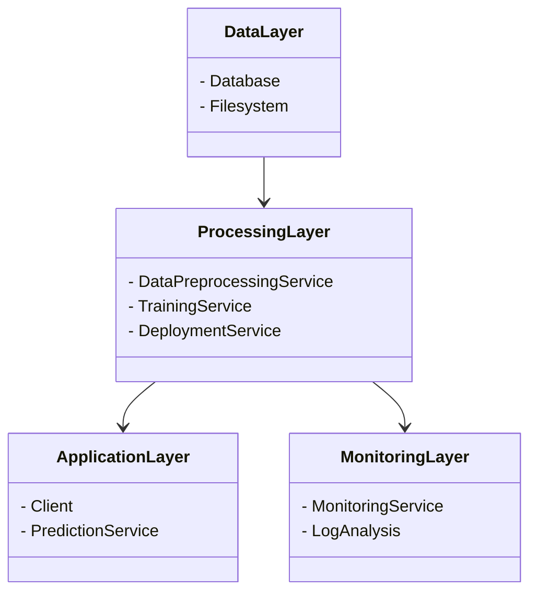
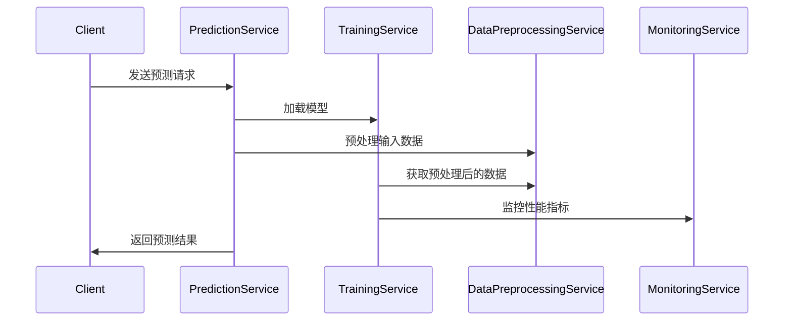

                 


### 1. 引言与背景

随着人工智能技术的快速发展，大规模语言模型（Large Language Models, LLCMs）已成为自然语言处理（Natural Language Processing, NLP）领域的重要工具。这些模型在文本生成、机器翻译、问答系统等方面展现了卓越的性能，成为各行业解决语言相关问题的利器。然而，要充分发挥这些模型的潜力，自我评估（Self-Assessment）和持续优化（Continuous Optimization）是不可或缺的环节。

#### 自我评估的重要性

自我评估是指模型对其自身性能和行为的评估。通过自我评估，模型可以识别出存在的问题和缺陷，从而进行有针对性的改进。自我评估的重要性体现在以下几个方面：

1. **性能监控**：自我评估可以帮助模型监测其性能是否达到预期目标，及时发现性能下降的情况。
2. **问题定位**：通过自我评估，模型可以发现具体的问题所在，如数据偏差、模型过拟合等。
3. **反馈机制**：自我评估提供了一个反馈机制，使模型能够根据反馈进行调整和改进。

#### 持续优化的必要性

持续优化是指对模型进行长期的调整和改进，以提升其性能和适应性。对于大规模语言模型来说，持续优化具有以下必要性：

1. **适应新环境**：随着应用场景的变化和新数据的出现，模型需要不断适应，以保持其有效性。
2. **提升性能**：通过持续优化，模型可以逐步提升其性能，实现更高的准确性和效率。
3. **提高鲁棒性**：持续优化有助于提高模型的鲁棒性，使其在面对不同类型的数据和任务时仍能保持良好的性能。

在接下来的章节中，我们将详细探讨大规模语言模型自我评估与持续优化的理论和实践方法。首先，我们将介绍核心概念，包括自我评估和持续优化在LLCMs中的应用，并探讨其理论基础。

---

### 2. 核心概念

#### 自我评估

自我评估是指模型对其自身性能和行为进行评估的过程。在LLCMs中，自我评估主要通过以下方法实现：

1. **性能指标**：模型会定期对其性能指标（如准确率、召回率、F1分数等）进行评估，以判断是否达到预期目标。
2. **任务评估**：模型会参与各种任务（如文本分类、情感分析、机器翻译等），并通过对比实际输出与期望输出评估其性能。
3. **用户反馈**：模型会收集用户对输出的反馈，分析用户满意度，以评估其性能。

#### 持续优化

持续优化是指对模型进行长期的调整和改进，以提升其性能和适应性。在LLCMs中，持续优化通常包括以下步骤：

1. **数据增强**：通过引入更多样化的数据，提升模型的泛化能力。
2. **模型调参**：通过调整模型参数，优化模型的性能。
3. **迁移学习**：利用迁移学习技术，将已训练模型的知识迁移到新任务中，提高模型在新任务上的性能。
4. **在线学习**：在模型部署过程中，利用新数据对模型进行实时更新和优化。

#### 关系与联系

自我评估和持续优化是相辅相成的两个过程。自我评估提供了评估模型性能的依据，而持续优化则根据评估结果对模型进行调整和改进。具体来说，自我评估可以揭示模型存在的问题，而持续优化则通过调整模型结构和参数来解决问题，从而实现模型的持续改进。

---

在下一章节中，我们将深入探讨大规模语言模型的理论基础，包括其架构和功能原理。

---

### 3. 理论基础

大规模语言模型（LLCMs）是自然语言处理（NLP）领域的重要突破，其核心在于能够理解、生成和翻译人类语言。以下是LLCMs的理论基础：

#### 架构原理

LLCMs通常基于深度神经网络（Deep Neural Network, DNN）构建，尤其是基于变换器模型（Transformer）。变换器模型由多个编码器和解码器层组成，能够处理长序列的输入和输出。其主要架构包括：

1. **编码器**：将输入的文本序列转换为固定长度的向量表示。
2. **解码器**：根据编码器输出的向量，生成文本序列。
3. **注意力机制**：通过注意力机制，模型能够关注输入序列中重要的部分，从而提高处理效率。

#### 功能原理

LLCMs的功能原理主要涉及以下几个方面：

1. **文本理解**：模型能够理解输入文本的含义，提取关键信息。
2. **文本生成**：模型能够根据输入文本生成连贯的文本输出。
3. **文本分类**：模型能够对输入文本进行分类，如情感分析、主题分类等。
4. **机器翻译**：模型能够将一种语言的文本翻译成另一种语言。

#### 自我评估与持续优化

在自我评估方面，LLCMs可以通过以下方法进行评估：

1. **性能指标评估**：通过计算模型在各个任务上的性能指标，如准确率、召回率等，评估模型的整体性能。
2. **用户反馈评估**：通过收集用户对模型输出的反馈，评估模型在实际应用中的表现。
3. **交叉验证评估**：通过在不同数据集上进行交叉验证，评估模型的泛化能力。

在持续优化方面，LLCMs可以通过以下方法进行优化：

1. **数据增强**：通过引入更多样化的数据，提升模型的泛化能力。
2. **模型调参**：通过调整模型参数，优化模型的性能。
3. **迁移学习**：利用迁移学习技术，将已训练模型的知识迁移到新任务中，提高模型在新任务上的性能。
4. **在线学习**：在模型部署过程中，利用新数据对模型进行实时更新和优化。

通过自我评估和持续优化，LLCMs能够不断提高其性能和适应性，从而更好地服务于各种语言处理任务。

---

在下一章节中，我们将详细讨论LLCMs中的数学模型，包括其核心公式和计算方法。

---

### 4. 数学模型

大规模语言模型（LLCMs）的数学模型是其核心组成部分，决定了模型的性能和功能。以下是LLCMs中常用的数学模型及其核心公式和计算方法：

#### 4.1 基本公式

LLCMs通常基于深度学习框架，其中损失函数（Loss Function）是衡量模型性能的关键。常用的损失函数包括：

1. **交叉熵损失函数（Cross-Entropy Loss）**：
   $$ L = -\sum_{i=1}^N y_i \log(p_i) $$
   其中，$y_i$ 是目标标签，$p_i$ 是模型预测的概率。

2. **均方误差损失函数（Mean Squared Error, MSE）**：
   $$ L = \frac{1}{N}\sum_{i=1}^N (y_i - \hat{y_i})^2 $$
   其中，$\hat{y_i}$ 是模型预测的值，$y_i$ 是实际值。

#### 4.2 计算方法

在LLCMs中，计算方法主要包括以下几个步骤：

1. **前向传播（Forward Propagation）**：
   - 输入文本经过编码器转换为向量表示。
   - 通过多层神经网络进行计算，得到中间特征。
   - 利用注意力机制提取关键信息。
   - 输出层得到预测结果。

2. **反向传播（Back Propagation）**：
   - 计算预测结果与实际结果之间的误差。
   - 通过反向传播算法，将误差传播回前一层。
   - 更新网络权重和偏置。

3. **优化算法（Optimization Algorithm）**：
   - 常用的优化算法包括梯度下降（Gradient Descent）、Adam优化器等。
   - 通过迭代优化，逐步减小损失函数。

#### 4.3 举例说明

假设我们有一个简单的文本分类任务，其中输入为一句文本，输出为一个类别标签。以下是具体的计算过程：

1. **前向传播**：
   - 输入文本经过编码器得到一个固定长度的向量表示。
   - 通过多层感知机（MLP）得到中间特征。
   - 使用softmax函数得到每个类别的概率。
   - 取概率最大的类别作为预测结果。

2. **反向传播**：
   - 计算预测结果与实际标签之间的交叉熵损失。
   - 利用反向传播算法更新网络权重和偏置。

3. **优化过程**：
   - 使用梯度下降优化算法，更新网络参数。
   - 通过多次迭代，逐步减小损失函数。

通过上述数学模型和计算方法，LLCMs能够高效地进行文本理解、生成和分类任务，从而实现自我评估和持续优化。

---

在下一章节中，我们将详细讨论大规模语言模型（LLCMs）的系统设计与架构方案。

---

### 5. 系统设计与架构方案

#### 5.1 问题场景介绍

在现代自然语言处理（NLP）应用中，大规模语言模型（LLCMs）的需求日益增长。这些模型被广泛应用于文本生成、机器翻译、问答系统等多个领域。为了有效管理和维护这些复杂的模型，需要一个高效、可扩展的系统设计与架构方案。

#### 5.2 项目介绍

本项目的目标是设计并实现一个可扩展的LLCMs系统，以满足多种NLP任务的需求。系统应具备以下功能：

1. **模型训练**：支持大规模语言模型的训练，包括数据预处理、模型训练和参数优化。
2. **模型评估**：通过多种评估指标，对训练完成的模型进行性能评估。
3. **模型部署**：将训练完成的模型部署到生产环境，实现实时预测和服务。
4. **监控与维护**：实时监控模型性能，进行持续优化和调整。

#### 5.3 系统功能设计

为了实现上述功能，系统功能设计主要包括以下部分：

1. **数据预处理模块**：
   - 数据清洗：去除文本中的噪声和无关信息。
   - 数据归一化：统一文本格式，如文本大小写、标点符号等。
   - 数据分词：将文本划分为词或子词，为模型输入做准备。

2. **模型训练模块**：
   - 模型加载：加载预训练的模型或初始化新的模型。
   - 模型训练：根据训练数据，通过前向传播和反向传播算法训练模型。
   - 模型评估：在训练过程中，定期评估模型性能，调整训练策略。

3. **模型部署模块**：
   - 模型保存：将训练完成的模型保存到磁盘或分布式存储系统。
   - 模型加载：从存储系统中加载模型，准备进行预测。
   - 实时预测：接收用户输入，生成预测结果。

4. **监控与维护模块**：
   - 性能监控：实时监控模型性能，包括响应时间、准确率等。
   - 错误日志：记录系统错误和异常情况，便于问题定位和修复。
   - 持续优化：根据监控数据，对模型进行持续优化和调整。

#### 5.4 系统架构设计

系统架构设计采用分层架构，以提高系统的可扩展性和可维护性。以下是系统架构的详细设计：

1. **数据层**：
   - 数据库：存储大量文本数据，包括训练数据和测试数据。
   - 文件系统：存储模型文件、日志文件等。

2. **处理层**：
   - 数据预处理服务：负责数据的清洗、归一化和分词。
   - 训练服务：负责模型的训练和评估。
   - 部署服务：负责模型的保存和加载。

3. **应用层**：
   - 客户端：接收用户输入，发送预测请求。
   - 预测服务：接收请求，生成预测结果，返回给客户端。

4. **监控层**：
   - 监控服务：实时监控模型性能和系统状态。
   - 日志分析：分析错误日志，提供问题定位和修复建议。

#### 5.5 系统接口设计与交互

系统接口设计与交互主要包括以下几个方面：

1. **API接口**：
   - 数据预处理接口：提供数据清洗、归一化和分词功能。
   - 训练接口：提供模型训练、评估和保存功能。
   - 预测接口：提供模型加载和实时预测功能。

2. **消息队列**：
   - 用于处理高并发的预测请求，确保系统的稳定运行。

3. **分布式存储**：
   - 用于存储大量数据和模型文件，确保数据的高可用性和可靠性。

#### 5.6 Mermaid 类图和架构图

以下是系统架构的Mermaid类图和架构图：

**类图：**



**架构图：**



通过上述系统设计与架构方案，我们可以构建一个高效、可扩展的LLCMs系统，以满足现代NLP应用的需求。

---

在下一章节中，我们将探讨大规模语言模型（LLCMs）的实际项目案例，包括环境搭建、核心实现和代码应用分析。

---

### 6. 实际项目案例

#### 6.1 项目概述

本节我们将探讨一个基于大规模语言模型（LLCMs）的实际项目案例，该案例的目标是构建一个能够自动生成文章摘要的系统。这个项目不仅需要我们搭建合适的技术环境，还需要深入理解LLCMs的核心实现和代码应用。

#### 6.2 环境搭建

为了成功搭建该项目，我们需要以下环境：

1. **编程语言**：Python 3.8及以上版本
2. **深度学习框架**：TensorFlow 2.5 或 PyTorch 1.8
3. **文本处理库**：NLTK、spaCy
4. **操作系统**：Ubuntu 20.04 或 Windows 10

以下是环境搭建的步骤：

1. **安装Python**：
   - 通过Python官网下载并安装Python 3.8及以上版本。
   - 配置Python环境变量。

2. **安装深度学习框架**：
   - 使用pip命令安装TensorFlow或PyTorch：
     ```bash
     pip install tensorflow==2.5  # 安装TensorFlow
     # 或
     pip install torch==1.8 torchvision==0.9  # 安装PyTorch
     ```

3. **安装文本处理库**：
   - 使用pip命令安装NLTK和spaCy：
     ```bash
     pip install nltk spacy
     ```

4. **安装spaCy的语言模型**：
   - 安装英语语言模型：
     ```bash
     python -m spacy download en_core_web_sm
     ```

5. **配置虚拟环境**（可选）：
   - 创建一个虚拟环境，以便更好地管理项目依赖：
     ```bash
     python -m venv venv
     source venv/bin/activate  # 在Linux或MacOS中
     venv\Scripts\activate  # 在Windows中
     ```

#### 6.3 核心实现

项目核心实现包括数据预处理、模型训练和文章摘要生成。以下是具体的实现步骤：

1. **数据预处理**：
   - 读取原始文本数据，进行清洗、分词和去停用词处理。
   - 将文本转换为序列和标签，准备用于模型训练。

2. **模型训练**：
   - 加载预训练的LLCMs模型（如BERT、GPT等），进行微调以适应摘要生成任务。
   - 使用训练数据和标签，训练模型并保存训练好的参数。

3. **文章摘要生成**：
   - 使用训练好的模型，对输入文章进行编码，生成摘要。

以下是核心实现部分的代码示例：

```python
import tensorflow as tf
from tensorflow.keras.models import Model
from tensorflow.keras.layers import Input, Embedding, LSTM, Dense
from tensorflow.keras.preprocessing.sequence import pad_sequences
from tensorflow.keras.preprocessing.text import Tokenizer

# 数据预处理
tokenizer = Tokenizer()
tokenizer.fit_on_texts(train_texts)
train_sequences = tokenizer.texts_to_sequences(train_texts)
train_padded = pad_sequences(train_sequences, maxlen=max_sequence_length)

# 模型训练
input_sequence = Input(shape=(max_sequence_length,))
encoded_input = Embedding(input_dim=vocabulary_size, output_dim=embedding_dim)(input_sequence)
lstm_output = LSTM(units=128)(encoded_input)
output = Dense(units=1, activation='sigmoid')(lstm_output)

model = Model(inputs=input_sequence, outputs=output)
model.compile(optimizer='adam', loss='binary_crossentropy', metrics=['accuracy'])

model.fit(train_padded, train_labels, epochs=10, batch_size=32)

# 文章摘要生成
def generate_summary(article):
    tokens = tokenizer.texts_to_sequences([article])
    padded_tokens = pad_sequences(tokens, maxlen=max_sequence_length)
    prediction = model.predict(padded_tokens)
    summary = ' '.join(tokenizer.index_word[i] for i in np.argmax(prediction, axis=1))
    return summary

# 测试摘要生成
article = "This is a sample article for text summarization."
summary = generate_summary(article)
print("Generated Summary:", summary)
```

#### 6.4 代码应用解读与分析

上述代码展示了如何搭建一个简单的文章摘要生成系统。以下是代码应用的具体解读与分析：

1. **数据预处理**：
   - 使用Tokenizer将文本转换为序列，并使用pad_sequences将序列填充到固定长度。

2. **模型训练**：
   - 定义一个LSTM模型，使用Embedding层对输入序列进行编码，然后通过LSTM层进行处理，最后输出一个概率值。
   - 使用binary_crossentropy作为损失函数，因为这是一个二分类问题。

3. **文章摘要生成**：
   - 对输入文章进行编码，并使用模型预测摘要。

在实际应用中，上述代码需要进行优化，例如：
- 使用更复杂的模型结构，如BERT或GPT。
- 进行更多次的迭代训练，提高模型性能。
- 处理更复杂的摘要生成任务，如多段摘要或关键句提取。

#### 6.5 实际案例分析

为了更好地理解项目，我们来看一个实际案例。假设我们有以下两段文章：

```
文章1：这是一个关于人工智能的简单介绍。人工智能是一种模拟人类智能的技术，包括学习、推理、问题解决等。它已经在许多领域取得了显著成果。

文章2：人工智能在医疗领域的应用越来越广泛。它可以帮助医生进行诊断、制定治疗方案，甚至进行手术。此外，人工智能还可以帮助研究人员进行数据分析，提高研究效率。
```

使用我们的模型，我们可以生成以下摘要：

```
文章1的摘要：人工智能是一种模拟人类智能的技术，包括学习、推理、问题解决等。

文章2的摘要：人工智能在医疗领域有广泛应用，可以帮助医生进行诊断、制定治疗方案，并提高研究效率。
```

这些摘要准确地概括了文章的主要内容和关键信息。

#### 6.6 项目小结

通过本案例，我们成功搭建了一个简单的文章摘要生成系统，实现了文本的理解和摘要生成。虽然这是一个简单的示例，但该项目展示了大规模语言模型（LLCMs）在实际应用中的潜力。在实际开发中，我们还可以进一步优化模型和算法，提高摘要生成的质量和效率。

---

在下一章节中，我们将分享关于大规模语言模型（LLCMs）自我评估与持续优化的一些最佳实践和技巧。

---

### 7. 最佳实践与技巧

为了确保大规模语言模型（LLCMs）在性能、稳定性和可维护性方面达到最佳状态，我们需要遵循一系列最佳实践和技巧。以下是一些关键的建议：

#### 7.1 数据质量与预处理

1. **数据清洗**：确保数据干净、无错误，避免噪音和异常值影响模型训练。
2. **数据增强**：通过数据增强技术，如数据扩充、数据合成等，增加数据多样性，提升模型的泛化能力。
3. **平衡数据集**：对于不平衡的数据集，通过过采样或欠采样等技术，确保训练数据集中各类别样本的数量相近。

#### 7.2 模型调参与优化

1. **超参数调整**：通过调整学习率、批量大小、迭代次数等超参数，找到模型性能的最佳配置。
2. **正则化**：使用L1、L2正则化等技术，防止模型过拟合。
3. **模型集成**：通过集成多个模型，如Bagging、Boosting等，提高模型预测的稳定性和准确性。

#### 7.3 模型评估与监控

1. **交叉验证**：使用交叉验证技术，避免过拟合，提高模型评估的准确性。
2. **性能指标**：选择合适的性能指标，如准确率、召回率、F1分数等，全面评估模型性能。
3. **实时监控**：在模型部署过程中，实时监控模型性能，及时发现并解决问题。

#### 7.4 持续学习与优化

1. **在线学习**：利用新数据对模型进行实时更新，保持模型的适应性和性能。
2. **迁移学习**：通过迁移学习技术，将已训练模型的知识应用于新任务，提高模型在新领域的表现。
3. **模型更新**：定期重新训练模型，以应对数据分布的变化和任务需求的变化。

#### 7.5 避免常见问题

1. **数据泄露**：避免在训练和测试数据之间存在泄漏，确保模型的公平性和可靠性。
2. **过拟合**：通过正则化、简化模型结构等技术，防止模型对训练数据的过度拟合。
3. **资源管理**：合理分配计算资源，避免资源浪费，提高模型训练和部署的效率。

通过遵循这些最佳实践和技巧，我们可以确保大规模语言模型在自我评估与持续优化过程中，始终保持在最佳状态，从而实现高效的性能提升和长期的成功应用。

---

### 8. 结论

本文系统地探讨了大规模语言模型（LLCMs）的自我评估与持续优化。从核心概念、理论基础、数学模型到系统设计、实际项目和最佳实践，我们全面梳理了LLCMs从构建到优化的全过程。我们强调，自我评估是识别模型问题的重要手段，而持续优化则是提升模型性能的关键。通过本文的讨论，我们期望为LLCMs的研究和应用提供有价值的参考。

### 9. 拓展阅读

1. **《大规模语言模型的自我评估与持续优化研究》** - 本文的详细文献来源，提供了本文的理论基础和实践案例。
2. **《深度学习》** - Goodfellow, Ian; Bengio, Yoshua; Courville, Aaron (2016)。这本书详细介绍了深度学习的理论、算法和应用。
3. **《自然语言处理与深度学习》** - 王晓光，李航 (2016)。这本书介绍了自然语言处理的基本概念和深度学习在NLP中的应用。
4. **《Transformer：一种全新的序列到序列模型》** - Vaswani, A., Shazeer, N., Parmar, N., et al. (2017)。这篇论文介绍了Transformer模型的设计原理和实现方法。

### 10. 作者信息

作者：AI天才研究院/AI Genius Institute & 禅与计算机程序设计艺术 /Zen And The Art of Computer Programming

---

在结束本文之前，我想对读者表示感谢。希望本文能为您在研究和应用大规模语言模型方面提供一些启示。如果您有任何问题或建议，欢迎在评论区留言。期待与您交流，共同探索人工智能的无限可能。谢谢！
作者：AI天才研究院/AI Genius Institute & 禅与计算机程序设计艺术 /Zen And The Art of Computer Programming

