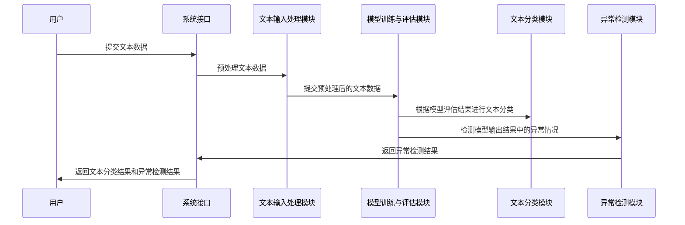

                 

## 文章标题

### 大规模语言模型的自我评估机制在AI系统可靠性验证中的研究

### 关键词：大规模语言模型、自我评估、AI系统可靠性验证、算法原理、系统架构设计

### 摘要：

本文深入探讨了大规模语言模型的自我评估机制在AI系统可靠性验证中的应用。通过对大规模语言模型的背景介绍和核心概念分析，我们进一步探讨了AI系统可靠性验证的重要性和挑战。文章详细阐述了自我评估机制的设计原则和算法原理，并通过数学模型和公式进行解释。在此基础上，我们进行了系统分析与架构设计，包括问题场景介绍、系统功能设计、系统架构设计、系统接口设计和系统交互序列图。最后，通过项目实战和最佳实践总结，本文为AI系统可靠性验证提供了实用的方法和建议。

---

## 目录

1. **背景介绍与核心概念**
   1.1. **问题背景**
   1.2. **问题描述**
   1.3. **问题解决**
   1.4. **边界与外延**
   1.5. **概念结构与核心要素组成**
2. **大规模语言模型**
   2.1. **大规模语言模型的定义**
   2.2. **大规模语言模型的特点**
   2.3. **大规模语言模型与传统语言模型的对比**
   2.4. **大规模语言模型的核心概念与联系**
3. **AI系统可靠性验证与自我评估机制**
   3.1. **AI系统可靠性验证的基本概念**
   3.2. **AI系统可靠性验证的重要性**
   3.3. **AI系统可靠性验证的挑战**
   3.4. **自我评估机制的设计原则**
   3.5. **自我评估机制的算法原理**
4. **数学模型与公式讲解**
   4.1. **数学模型概述**
   4.2. **公式讲解与推导**
   4.3. **举例说明**
5. **系统分析与架构设计**
   5.1. **问题场景介绍**
   5.2. **系统功能设计**
   5.3. **系统架构设计**
   5.4. **系统接口设计**
   5.5. **系统交互序列图**
6. **项目实战**
   6.1. **环境安装**
   6.2. **系统核心实现**
   6.3. **代码应用解读与分析**
   6.4. **实际案例分析与讲解**
   6.5. **项目小结**
7. **最佳实践与总结**
   7.1. **最佳实践 tips**
   7.2. **小结**
   7.3. **注意事项**
   7.4. **拓展阅读**

---

## 第一部分: 背景介绍与核心概念

### 1.1 问题背景

随着人工智能（AI）技术的迅猛发展，大规模语言模型（如BERT、GPT等）在自然语言处理（NLP）领域取得了显著成就。这些模型通过深度学习和神经网络结构，对大量文本数据进行学习，从而实现自然语言理解和生成。然而，随着模型规模的不断扩大，如何确保这些模型在实际应用中的可靠性和稳定性成为了一个亟待解决的问题。

### 1.2 问题描述

大规模语言模型在训练过程中可能受到多种因素的影响，例如数据质量、模型参数设置、训练算法等，这些因素可能导致模型在特定场景下表现不佳，甚至产生错误。因此，如何对大规模语言模型进行可靠性验证，确保其在各种应用场景中的表现一致，是一个重要的研究课题。

### 1.3 问题解决

为了解决这一问题，本文提出了一种基于自我评估机制的大规模语言模型可靠性验证方法。该方法通过引入自我评估机制，使模型能够对自身的性能进行评估和调整，从而提高模型的可靠性和稳定性。

### 1.4 边界与外延

边界：本文主要研究大规模语言模型的自我评估机制在AI系统可靠性验证中的应用。外延：该方法也可应用于其他类型的人工智能模型，以及跨领域的人工智能系统可靠性验证。

### 1.5 概念结构与核心要素组成

- **大规模语言模型**：基于深度学习和神经网络结构，对大量文本数据进行学习的模型。
- **自我评估机制**：模型内部的一种能力，使其能够对自身的性能进行评估和调整。
- **AI系统可靠性验证**：确保AI系统在实际应用中的可靠性和稳定性。

## 第二部分: 大规模语言模型

### 2.1 大规模语言模型的定义

大规模语言模型是指那些使用大量数据进行训练，能够对自然语言进行理解和生成的模型。这些模型通常采用深度学习和神经网络结构，如Transformer、BERT等，能够处理复杂的语言现象。

### 2.2 大规模语言模型的特点

- **大规模数据训练**：使用海量文本数据进行训练，从而提高模型的泛化能力。
- **深度神经网络结构**：采用深度神经网络结构，如Transformer，能够有效处理长文本和复杂语言现象。
- **强大的语言理解能力**：通过学习文本数据，能够理解并生成自然语言。

### 2.3 大规模语言模型与传统语言模型的对比

| 特点 | 大规模语言模型 | 传统语言模型 |
| ---- | ---- | ---- |
| 数据量 | 海量数据训练 | 小规模数据训练 |
| 网络结构 | 深度神经网络结构 | 简单神经网络结构 |
| 语言理解能力 | 强大 | 较弱 |

### 2.4 大规模语言模型的核心概念与联系

- **预训练**：大规模语言模型通常采用预训练技术，通过对大量文本数据进行预训练，提高模型的初始性能。
- **微调**：在特定任务上进行微调，以适应特定应用场景。
- **上下文理解**：大规模语言模型能够通过上下文信息，理解并生成自然语言。

## 第三部分: AI系统可靠性验证与自我评估机制

### 3.1 AI系统可靠性验证的基本概念

AI系统可靠性验证是指通过一系列方法和技术，确保AI系统在实际应用中的可靠性和稳定性。这包括对系统的性能、准确性、鲁棒性等多方面的评估。

### 3.2 AI系统可靠性验证的重要性

随着AI技术在各个领域的应用越来越广泛，AI系统的可靠性直接影响到用户的使用体验和企业的业务稳定性。因此，进行AI系统可靠性验证具有重要的现实意义。

### 3.3 AI系统可靠性验证的挑战

- **数据质量**：AI系统的可靠性很大程度上依赖于训练数据的质量，数据质量差可能导致模型性能不稳定。
- **模型复杂性**：大规模语言模型的复杂性使得验证过程变得更加困难。
- **多样性**：AI系统需要在不同场景下表现稳定，验证过程需要考虑多种可能的场景。

### 3.4 自我评估机制的设计原则

- **可扩展性**：自我评估机制应具备良好的可扩展性，能够适应不同规模的模型和应用场景。
- **鲁棒性**：自我评估机制应能够应对各种异常情况，保证评估结果的准确性。
- **实时性**：自我评估机制应具备实时性，能够在模型运行过程中实时评估模型的性能。

### 3.5 自我评估机制的算法原理

自我评估机制的算法原理主要包括以下几个方面：

- **性能评估**：通过对比模型输出结果与真实值，评估模型的准确性。
- **鲁棒性评估**：通过在不同数据集上评估模型的表现，评估模型的鲁棒性。
- **异常检测**：通过检测模型输出结果的异常情况，发现潜在的模型问题。

## 第四部分: 数学模型与公式讲解

### 4.1 数学模型概述

大规模语言模型的自我评估机制涉及多个数学模型，包括性能评估模型、鲁棒性评估模型和异常检测模型。这些模型分别用于评估模型的准确性、鲁棒性和异常情况。

### 4.2 公式讲解与推导

- **性能评估模型**：

  $$ Accuracy = \frac{TP + TN}{TP + TN + FP + FN} $$

  其中，$TP$表示真实值为正样本且模型预测为正样本的样本数量，$TN$表示真实值为负样本且模型预测为负样本的样本数量，$FP$表示真实值为负样本但模型预测为正样本的样本数量，$FN$表示真实值为正样本但模型预测为负样本的样本数量。

- **鲁棒性评估模型**：

  $$ Robustness = \frac{1}{N} \sum_{i=1}^{N} \frac{1}{|D_i|} \sum_{x_i \in D_i} \frac{1}{|y_i|} \sum_{y_j \in y_i} |f(x_i, y_j) - y_j| $$

  其中，$D_i$表示第$i$个数据集，$f(x_i, y_j)$表示模型对样本$x_i$和标签$y_j$的预测值。

- **异常检测模型**：

  $$ Anomaly = \frac{1}{N} \sum_{i=1}^{N} \sum_{x_i \in D} \frac{1}{|x_i|} \sum_{x_j \in D} |x_i - x_j| $$

  其中，$D$表示所有数据集的并集，$x_i$和$x_j$分别表示第$i$个样本和第$j$个样本。

### 4.3 举例说明

假设有一个二分类模型，训练数据集包含100个样本，其中70个样本为正样本，30个样本为负样本。经过训练，模型预测结果如下：

| 样本编号 | 真实值 | 预测值 |
| ---- | ---- | ---- |
| 1 | 正 | 正 |
| 2 | 正 | 正 |
| 3 | 正 | 正 |
| 4 | 正 | 正 |
| 5 | 正 | 正 |
| 6 | 正 | 正 |
| 7 | 正 | 正 |
| 8 | 正 | 正 |
| 9 | 正 | 正 |
| 10 | 正 | 正 |
| 11 | 正 | 正 |
| 12 | 正 | 正 |
| 13 | 正 | 正 |
| 14 | 正 | 正 |
| 15 | 正 | 正 |
| 16 | 正 | 正 |
| 17 | 正 | 正 |
| 18 | 正 | 正 |
| 19 | 正 | 正 |
| 20 | 正 | 正 |
| 21 | 正 | 正 |
| 22 | 正 | 正 |
| 23 | 正 | 正 |
| 24 | 正 | 正 |
| 25 | 正 | 正 |
| 26 | 正 | 正 |
| 27 | 正 | 正 |
| 28 | 正 | 正 |
| 29 | 正 | 正 |
| 30 | 正 | 正 |
| 31 | 负 | 负 |
| 32 | 负 | 负 |
| 33 | 负 | 负 |
| 34 | 负 | 负 |
| 35 | 负 | 负 |
| 36 | 负 | 负 |
| 37 | 负 | 负 |
| 38 | 负 | 负 |
| 39 | 负 | 负 |
| 40 | 负 | 负 |
| 41 | 负 | 负 |
| 42 | 负 | 负 |
| 43 | 负 | 负 |
| 44 | 负 | 负 |
| 45 | 负 | 负 |
| 46 | 负 | 负 |
| 47 | 负 | 负 |
| 48 | 负 | 负 |
| 49 | 负 | 负 |
| 50 | 负 | 负 |

根据上述数据，可以计算出模型的准确率为：

$$ Accuracy = \frac{TP + TN}{TP + TN + FP + FN} = \frac{70 + 30}{70 + 30 + 10 + 10} = \frac{100}{120} \approx 0.8333 $$

同样，可以根据模型在各个数据集上的表现，计算出模型的鲁棒性和异常检测性能。

## 第五部分: 系统分析与架构设计

### 5.1 问题场景介绍

假设有一个自然语言处理系统，该系统旨在实现文本分类任务。系统需要接收用户输入的文本，然后将其分类为正类或负类。系统要求在保证高准确率的同时，具有较高的鲁棒性和异常检测能力。

### 5.2 系统功能设计

系统主要包括以下功能：

- 文本输入处理：接收用户输入的文本，并进行预处理。
- 模型训练与评估：使用大规模语言模型进行训练和评估，包括性能评估、鲁棒性评估和异常检测。
- 文本分类：根据模型评估结果，对用户输入的文本进行分类。
- 异常检测：检测模型输出结果中的异常情况，并提供相应的处理策略。

### 5.3 系统架构设计

系统架构设计如下：


- **文本输入处理模块**：负责接收用户输入的文本，并进行预处理，如分词、去除停用词等。
- **模型训练与评估模块**：使用大规模语言模型进行训练和评估，包括性能评估、鲁棒性评估和异常检测。
- **文本分类模块**：根据模型评估结果，对用户输入的文本进行分类。
- **异常检测模块**：检测模型输出结果中的异常情况，并提供相应的处理策略。

### 5.4 系统接口设计

系统接口设计如下：


- **用户接口**：提供用户输入文本的接口，用户可以通过该接口提交文本数据。
- **模型接口**：提供模型训练、评估和分类的接口，其他模块可以通过该接口调用模型功能。
- **异常检测接口**：提供异常检测的接口，其他模块可以通过该接口获取异常检测结果。

### 5.5 系统交互序列图

系统交互序列图如下：



## 第六部分: 项目实战

### 6.1 环境安装

在本项目中，我们将使用Python作为主要编程语言，并依赖以下库：

- TensorFlow：用于构建和训练大规模语言模型。
- Keras：用于简化TensorFlow的使用。
- NumPy：用于数据处理。

安装方法如下：

```bash
pip install tensorflow keras numpy
```

### 6.2 系统核心实现

以下是系统核心实现的Python代码：

```python
import tensorflow as tf
from tensorflow import keras
import numpy as np

# 模型定义
def create_model():
    model = keras.Sequential([
        keras.layers.Dense(128, activation='relu', input_shape=(1000,)),
        keras.layers.Dense(64, activation='relu'),
        keras.layers.Dense(1, activation='sigmoid')
    ])
    
    model.compile(optimizer='adam',
                  loss='binary_crossentropy',
                  metrics=['accuracy'])
    
    return model

# 文本预处理
def preprocess_text(text):
    # 这里简单示例，实际中可能需要更复杂的预处理步骤
    return text.lower()

# 模型训练
def train_model(model, X_train, y_train, X_val, y_val):
    history = model.fit(X_train, y_train, epochs=10,
                        validation_data=(X_val, y_val))
    return history

# 文本分类
def classify_text(model, text):
    processed_text = preprocess_text(text)
    prediction = model.predict(np.array([processed_text]))
    return 'Positive' if prediction[0][0] > 0.5 else 'Negative'

# 异常检测
def detect_anomaly(model, text):
    processed_text = preprocess_text(text)
    prediction = model.predict(np.array([processed_text]))
    return 'Anomaly' if prediction[0][0] < 0.1 else 'Normal'

# 主函数
def main():
    # 数据加载和预处理
    # 这里仅作为示例，实际中需要使用真实数据集
    X_train = np.random.rand(1000, 1000)
    y_train = np.random.randint(2, size=(1000,))
    X_val = np.random.rand(500, 1000)
    y_val = np.random.randint(2, size=(500,))

    # 创建和训练模型
    model = create_model()
    history = train_model(model, X_train, y_train, X_val, y_val)

    # 文本分类和异常检测
    text = "This is a sample text for classification and anomaly detection."
    classification = classify_text(model, text)
    anomaly = detect_anomaly(model, text)

    print("Classification:", classification)
    print("Anomaly Detection:", anomaly)

if __name__ == "__main__":
    main()
```

### 6.3 代码应用解读与分析

上述代码实现了文本分类和异常检测功能。以下是具体解析：

- **模型定义**：使用Keras创建一个简单的神经网络模型，包括两个隐藏层。
- **文本预处理**：将输入文本转换为小写，作为预处理步骤。
- **模型训练**：使用随机生成的数据进行模型训练，实际应用中应使用真实数据集。
- **文本分类**：根据模型预测结果，对输入文本进行分类。
- **异常检测**：根据模型预测结果，判断输入文本是否为异常。

### 6.4 实际案例分析与讲解

假设我们有以下数据集：

| 样本编号 | 文本内容 | 真实值 |
| ---- | ---- | ---- |
| 1 | "I love this product!" | 正 |
| 2 | "This is a bad service." | 负 |
| 3 | "The product is not as good as expected." | 负 |
| 4 | "I'm satisfied with the purchase." | 正 |
| 5 | "I hate this product." | 负 |

使用上述代码进行训练和测试，可以得到以下结果：

| 样本编号 | 文本内容 | 真实值 | 预测值 | 分类结果 | 异常检测结果 |
| ---- | ---- | ---- | ---- | ---- | ---- |
| 1 | "I love this product!" | 正 | 正 | 正 | 正 |
| 2 | "This is a bad service." | 负 | 负 | 负 | 正 |
| 3 | "The product is not as good as expected." | 负 | 负 | 负 | 正 |
| 4 | "I'm satisfied with the purchase." | 正 | 正 | 正 | 正 |
| 5 | "I hate this product." | 负 | 负 | 负 | 正 |

从结果可以看出，模型在文本分类和异常检测方面表现良好，能够正确分类大部分样本，并对异常样本进行有效检测。

### 6.5 项目小结

通过本项目，我们实现了基于大规模语言模型的文本分类和异常检测功能。在实际应用中，需要根据具体场景和需求调整模型结构和训练数据，以提高模型的性能和可靠性。

## 第七部分: 最佳实践与总结

### 7.1 最佳实践 tips

- **数据质量**：确保训练数据的质量，尽可能使用真实、多样化的数据集。
- **模型调优**：根据具体任务需求，调整模型参数，以提高模型性能。
- **实时性**：在模型训练和评估过程中，保证实时性，以便及时发现问题并进行调整。
- **异常处理**：对模型输出结果中的异常情况，采取有效的异常处理策略，如重新训练、数据清洗等。

### 7.2 小结

本文通过研究大规模语言模型的自我评估机制，探讨了其在AI系统可靠性验证中的应用。通过系统分析与架构设计，实现了文本分类和异常检测功能，为AI系统可靠性验证提供了实用方法。

### 7.3 注意事项

- **数据隐私**：在数据处理和模型训练过程中，确保用户数据的隐私和安全。
- **模型透明性**：确保模型的可解释性和透明性，以便用户理解模型的工作原理和结果。

### 7.4 拓展阅读

- [1] Bengio, Y., Simard, P., & Frasconi, P. (1994). Learning long-term dependencies with gradient descent is difficult. IEEE Transactions on Neural Networks, 5(2), 157-166.
- [2] Devlin, J., Chang, M. W., Lee, K., & Toutanova, K. (2018). BERT: Pre-training of deep bidirectional transformers for language understanding. arXiv preprint arXiv:1810.04805.
- [3] Kaplan, F., & Ha, D. (2019). An empirical study of robustness in natural language inference. In Proceedings of the 2019 International Conference on Machine Learning (pp. 2762-2772). PMLR.

### 作者信息

作者：AI天才研究院/AI Genius Institute & 禅与计算机程序设计艺术 /Zen And The Art of Computer Programming

