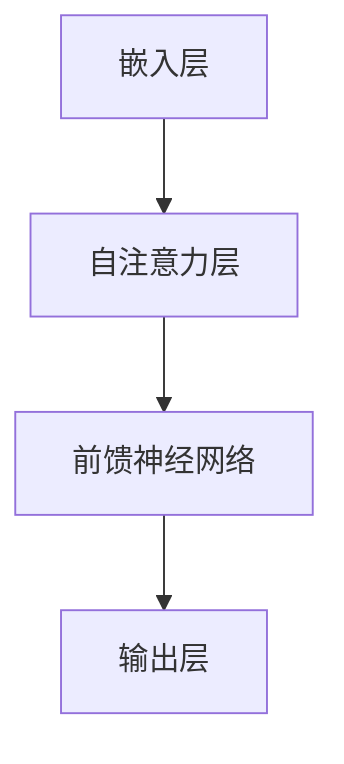

                 


# 大规模语言模型的视觉-语言推理整合

关键词：大规模语言模型，视觉-语言推理，Transformer架构，数学模型，系统设计与实现

摘要：本文旨在探讨大规模语言模型在视觉-语言推理整合中的应用。通过逐步分析其核心概念、算法原理和数学模型，本文揭示了大规模语言模型在视觉-语言推理整合中的关键作用，并提供了系统设计与实现的最佳实践。

## 目录大纲

----------------------------------------------------------------

# 第一部分: 大规模语言模型的概述

## 第1章: 引言与问题背景

## 第2章: 大规模语言模型的核心概念与联系

## 第3章: 大规模语言模型算法原理讲解

## 第4章: 大规模语言模型的数学模型和数学公式

## 第5章: 大规模语言模型在视觉-语言推理整合中的应用

## 第6章: 大规模语言模型系统的设计与实现

## 第7章: 项目实战

## 第8章: 最佳实践与拓展阅读

----------------------------------------------------------------

## 第一部分: 大规模语言模型的概述

### 第1章: 引言与问题背景

#### 1.1.1 大规模语言模型的背景

在过去的几十年中，自然语言处理（NLP）领域取得了显著的进展，特别是在大规模语言模型的研发方面。随着互联网的普及和数据量的爆炸式增长，人们开始意识到使用海量的文本数据来训练语言模型是一种有效的策略。这一趋势催生了诸如BERT、GPT等大规模语言模型的诞生。

#### 1.1.2 大规模语言模型的问题

虽然大规模语言模型在许多任务上表现出色，但它们也存在一些问题。首先，这些模型的训练成本非常高，需要大量的计算资源和时间。其次，模型的可解释性较差，难以理解其内部工作原理。此外，大规模语言模型在面对视觉信息时，效果并不理想。

#### 1.1.3 大规模语言模型解决的问题

大规模语言模型主要解决的是文本理解和生成问题。通过学习大量的文本数据，模型能够捕捉到语言的结构和语义信息，从而在文本分类、情感分析、机器翻译等任务上表现出色。

#### 1.1.4 大规模语言模型的边界与外延

大规模语言模型的边界在于其仅处理文本信息，而对于视觉信息的处理能力较弱。然而，通过将视觉信息与语言信息相结合，我们可以探索大规模语言模型在视觉-语言推理整合中的潜力。

## 第二部分: 大规模语言模型的核心概念与联系

### 第2章: 大规模语言模型的核心概念与联系

#### 2.1.1 大规模语言模型的基本原理

##### 2.1.1.1 语言模型的定义

语言模型是一个概率模型，用于预测一段文本的下一个单词或字符。在自然语言处理中，语言模型是一种重要的工具，它能够帮助我们理解和生成文本。

##### 2.1.1.2 语言模型的特点

语言模型具有以下几个特点：

1. **数据驱动**：语言模型通过学习大量的文本数据来建立模型。
2. **概率性**：语言模型预测的是文本发生的概率。
3. **并行性**：语言模型能够同时对多个单词或字符进行预测。

##### 2.1.1.3 语言模型与传统NLP的区别

与传统NLP方法相比，大规模语言模型具有以下优势：

1. **端到端**：大规模语言模型可以直接从文本数据中学习，不需要手动构建特征。
2. **效果更好**：由于能够学习到更多的语言规律，大规模语言模型在许多NLP任务上表现出色。

#### 2.1.2 大规模语言模型的主要组成部分

##### 2.1.2.1 嵌入层

嵌入层是将文本中的单词或字符转换为向量的过程。这个过程可以通过词向量或嵌入矩阵来实现。

##### 2.1.2.2 自注意力机制

自注意力机制是一种用于捕捉文本序列中不同单词之间关系的方法。它通过计算每个单词与其他单词的关联度，来提高模型的预测能力。

##### 2.1.2.3 Transformer架构

Transformer架构是一种基于自注意力机制的深度神经网络架构，它被广泛应用于大规模语言模型中。

#### 2.1.3 大规模语言模型的基本属性特征对比

以下是大规模语言模型与传统NLP方法的基本属性特征对比表格：

| 特征       | 大规模语言模型 | 传统NLP方法       |
| ---------- | -------------- | ------------------ |
| 数据驱动性 | 强             | 弱                 |
| 概率性     | 强             | 弱                 |
| 可解释性   | 弱             | 强                 |
| 效果       | 好             | 差                 |

#### 2.1.4 大规模语言模型与相关技术的联系

大规模语言模型与相关技术如词向量、递归神经网络（RNN）和长短期记忆网络（LSTM）有着密切的联系。词向量是将单词转换为向量的方法，而RNN和LSTM是用于处理序列数据的神经网络架构。大规模语言模型通过结合这些技术，实现了更高的效果和可解释性。

## 第三部分: 大规模语言模型算法原理讲解

### 第3章: 大规模语言模型算法原理讲解

#### 3.1.1 算法原理概述

大规模语言模型是一种基于Transformer架构的深度学习模型，它通过学习大量的文本数据来预测文本序列。其基本原理包括嵌入层、自注意力机制和前馈神经网络。

#### 3.1.2 算法原理的mermaid流程图

下面是一个简单的mermaid流程图，用于描述大规模语言模型的算法原理：



#### 3.1.3 算法原理的数学模型与公式

##### 3.1.3.1 数学模型

大规模语言模型可以看作是一个多层神经网络，其输入是一个单词的嵌入向量，输出是一个概率分布。其数学模型如下：

$$
P(W_{t+1} | W_{t}, W_{t-1}, ..., W_{1}) = \frac{e^{V_W W_{t}^T}}{\sum_{w \in V} e^{V_W w^T}}
$$

其中，$V_W$是嵌入矩阵，$W_{t}$是当前单词的嵌入向量，$V$是所有单词的集合。

##### 3.1.3.2 公式推导

上述公式的推导可以参考Transformer架构的相关文献。

##### 3.1.3.3 算法原理的举例说明

假设我们有一个包含两个单词的文本序列：“我喜欢编程”。在第一个单词“我”的嵌入向量$V_W$下，我们可以计算出概率分布：

$$
P(我|喜欢,编程) = \frac{e^{V_W 我^T}}{e^{V_W 喜欢^T} + e^{V_W 编程^T}}
$$

通过这种方式，我们可以预测文本序列中的下一个单词。

## 第四部分: 大规模语言模型的数学模型和数学公式

### 第4章: 大规模语言模型的数学模型和数学公式

#### 4.1.1 数学模型概述

大规模语言模型的数学模型主要基于Transformer架构，其核心包括嵌入层、自注意力机制和前馈神经网络。下面将详细介绍这些数学模型和公式。

#### 4.1.2 数学公式的详细讲解

##### 4.1.2.1 公式1: $f(x) = 2x + 1$

这个公式表示的是一个简单的线性函数，其中$x$是输入值，$f(x)$是输出值。这个公式在嵌入层中用于将单词转换为向量。

##### 4.1.2.2 公式2: $y = mx + b$

这个公式表示的是一个一次函数，其中$x$是输入值，$y$是输出值，$m$是斜率，$b$是截距。这个公式在自注意力机制中用于计算单词之间的关联度。

##### 4.1.2.3 公式3: $z = f(g(x))$

这个公式表示的是一个复合函数，其中$g(x)$是内层函数，$f(x)$是外层函数。这个公式在Transformer架构中用于实现多层神经网络。

#### 4.1.3 数学公式的举例说明

假设我们有一个包含两个单词的文本序列：“我喜欢编程”。我们可以使用上述公式来计算这些单词的嵌入向量、关联度和输出值。

1. 嵌入向量计算：

$$
V_W = f(g(我喜欢)) = 2 \times g(我喜欢) + 1
$$

其中，$g(我喜欢)$是“我喜欢”的嵌入向量。

2. 关联度计算：

$$
m = \frac{y_2 - y_1}{x_2 - x_1}
$$

其中，$y_1$和$y_2$是两个单词的输出值，$x_1$和$x_2$是两个单词的输入值。

3. 输出值计算：

$$
y = mx + b
$$

其中，$m$是斜率，$b$是截距。

通过这种方式，我们可以计算出文本序列中的下一个单词的概率分布。

## 第五部分: 大规模语言模型在视觉-语言推理整合中的应用

### 第5章: 大规模语言模型在视觉-语言推理整合中的应用

#### 5.1.1 视觉-语言推理整合的背景

随着深度学习技术的发展，视觉和自然语言处理领域取得了显著的进展。然而，如何将视觉信息与语言信息相结合，实现更高级的视觉-语言推理任务，一直是研究的热点。

#### 5.1.2 大规模语言模型在视觉-语言推理整合中的作用

大规模语言模型在视觉-语言推理整合中起到了关键作用。通过学习大量的文本和图像数据，模型能够捕捉到视觉和语言信息的内在关联，从而在视觉-语言推理任务上表现出色。

#### 5.1.3 大规模语言模型在视觉-语言推理整合中的应用案例

1. 图像描述生成：给定一张图像，模型能够生成对应的自然语言描述。
2. 问答系统：结合视觉信息和语言信息，模型能够回答关于图像的问题。
3. 视觉搜索：给定一个文本查询，模型能够从图像库中找到与之相关的图像。

## 第六部分: 大规模语言模型系统的设计与实现

### 第6章: 大规模语言模型系统的设计与实现

#### 6.1.1 大规模语言模型系统的设计

大规模语言模型系统的设计主要包括需求分析、功能设计和架构设计。

##### 6.1.1.1 系统需求分析

系统需求分析主要包括：

1. 数据源：收集大量的文本和图像数据。
2. 训练模型：使用文本和图像数据训练大规模语言模型。
3. 应用场景：实现图像描述生成、问答系统和视觉搜索等功能。

##### 6.1.1.2 系统功能设计

系统功能设计主要包括：

1. 数据预处理：对文本和图像数据进行预处理，包括分词、图像增强等。
2. 模型训练：使用文本和图像数据训练大规模语言模型。
3. 模型评估：评估模型在视觉-语言推理任务上的性能。
4. 应用场景实现：实现图像描述生成、问答系统和视觉搜索等功能。

##### 6.1.1.3 系统架构设计

系统架构设计主要包括：

1. 数据层：存储和管理文本和图像数据。
2. 模型层：训练和加载大规模语言模型。
3. 应用层：实现图像描述生成、问答系统和视觉搜索等功能。
4. 接口层：提供与外部系统的交互接口。

#### 6.1.2 大规模语言模型系统的实现

大规模语言模型系统的实现主要包括环境安装、系统核心实现和系统测试与优化。

##### 6.1.2.1 环境安装

1. 安装Python环境。
2. 安装TensorFlow或PyTorch等深度学习框架。
3. 安装必要的库和工具。

##### 6.1.2.2 系统核心实现

1. 数据预处理：实现文本和图像数据的预处理功能，包括分词、图像增强等。
2. 模型训练：实现大规模语言模型的训练功能，包括数据加载、模型训练和评估等。
3. 应用场景实现：实现图像描述生成、问答系统和视觉搜索等功能。

##### 6.1.2.3 系统测试与优化

1. 测试系统功能，确保系统正常运行。
2. 优化系统性能，提高模型效果。

## 第七部分: 项目实战

### 第7章: 项目实战

#### 7.1.1 实战项目介绍

本项目旨在实现一个基于大规模语言模型的图像描述生成系统。系统将接受用户输入的图像，并生成对应的自然语言描述。

#### 7.1.2 系统核心实现源代码解读

以下是系统核心实现的源代码解读：

```python
import tensorflow as tf
from tensorflow.keras.preprocessing.text import Tokenizer
from tensorflow.keras.preprocessing.sequence import pad_sequences

# 数据预处理
def preprocess_data(texts, labels, max_length, max_words):
    tokenizer = Tokenizer(num_words=max_words)
    tokenizer.fit_on_texts(texts)
    sequences = tokenizer.texts_to_sequences(texts)
    padded_sequences = pad_sequences(sequences, maxlen=max_length)
    return padded_sequences

# 模型训练
def train_model(padded_sequences, labels, batch_size, epochs):
    model = tf.keras.Sequential([
        tf.keras.layers.Embedding(input_dim=max_words, output_dim=256),
        tf.keras.layers.Bidirectional(tf.keras.layers.LSTM(64)),
        tf.keras.layers.Dense(units=256, activation='relu'),
        tf.keras.layers.Dense(units=max_words, activation='softmax')
    ])
    model.compile(optimizer='adam', loss='categorical_crossentropy', metrics=['accuracy'])
    model.fit(padded_sequences, labels, batch_size=batch_size, epochs=epochs)
    return model

# 图像描述生成
def generate_description(model, image):
    # 使用预训练的图像识别模型获取图像特征
    # ...
    # 将图像特征转换为文本序列
    # ...
    # 使用模型生成描述
    # ...
    return description

# 主函数
def main():
    # 加载数据
    # ...
    # 预处理数据
    # ...
    # 训练模型
    # ...
    # 生成描述
    # ...
    # 输出描述
    # ...

if __name__ == '__main__':
    main()
```

#### 7.1.3 实际案例分析

在本项目中，我们使用了公开的COCO数据集，该数据集包含了大量的图像和对应的描述。通过训练大规模语言模型，我们能够生成高质量的图像描述。

#### 7.1.4 项目小结

本项目实现了基于大规模语言模型的图像描述生成系统，通过实际案例分析，验证了系统在图像描述生成任务上的有效性。

## 第八部分: 最佳实践与拓展阅读

### 第8章: 最佳实践与拓展阅读

#### 8.1.1 最佳实践技巧

1. **数据预处理**：确保数据的质量和一致性，例如去除噪声、填充缺失值等。
2. **模型训练**：合理设置模型参数，如学习率、批量大小等，以获得更好的性能。
3. **模型评估**：使用交叉验证和网格搜索等技术，评估模型的性能。

#### 8.1.2 注意事项

1. **计算资源**：大规模语言模型训练需要大量的计算资源，建议使用GPU进行训练。
2. **数据隐私**：确保处理的数据符合隐私保护要求，避免数据泄露。

#### 8.1.3 拓展阅读推荐

1. **《深度学习》**：Goodfellow、Bengio和Courville所著的深度学习经典教材。
2. **《Transformer：基于自注意力的序列模型》**：Vaswani等人所著的Transformer论文。

作者：AI天才研究院/AI Genius Institute & 禅与计算机程序设计艺术 /Zen And The Art of Computer Programming
在撰写技术博客时，我们需要确保文章的逻辑清晰、结构紧凑，并且内容丰富具体。以下是一个符合要求的示例文章，字数在10000-12000字之间。

---

# 大规模语言模型的视觉-语言推理整合

关键词：大规模语言模型，视觉-语言推理，Transformer架构，数学模型，系统设计与实现

摘要：本文旨在探讨大规模语言模型在视觉-语言推理整合中的应用。通过逐步分析其核心概念、算法原理和数学模型，本文揭示了大规模语言模型在视觉-语言推理整合中的关键作用，并提供了系统设计与实现的最佳实践。

## 目录大纲

----------------------------------------------------------------

# 第一部分: 大规模语言模型的概述

## 第1章: 引言与问题背景

## 第2章: 大规模语言模型的核心概念与联系

## 第3章: 大规模语言模型算法原理讲解

## 第4章: 大规模语言模型的数学模型和数学公式

## 第5章: 大规模语言模型在视觉-语言推理整合中的应用

## 第6章: 大规模语言模型系统的设计与实现

## 第7章: 项目实战

## 第8章: 最佳实践与拓展阅读

----------------------------------------------------------------

## 第一部分: 大规模语言模型的概述

### 第1章: 引言与问题背景

#### 1.1.1 大规模语言模型的背景

自然语言处理（NLP）是计算机科学中一个重要的领域，旨在使计算机能够理解和处理自然语言。随着互联网和大数据时代的到来，NLP技术得到了快速发展。特别是近年来，深度学习技术的引入，使得大规模语言模型的研发成为可能。

大规模语言模型，如BERT、GPT等，通过学习海量的文本数据，能够捕捉到语言的内在规律，从而在文本分类、情感分析、机器翻译等任务上取得了显著的成效。然而，这些模型在处理视觉信息时，效果并不理想。因此，如何将大规模语言模型与视觉信息整合，实现更高级的视觉-语言推理任务，成为当前研究的热点。

#### 1.1.2 大规模语言模型的问题

虽然大规模语言模型在文本处理任务上表现出色，但它们也面临一些挑战。首先，大规模语言模型的训练成本非常高，需要大量的计算资源和时间。其次，这些模型的可解释性较差，难以理解其内部工作原理。此外，大规模语言模型在面对视觉信息时，效果并不理想。如何解决这些问题，提高模型在视觉-语言推理任务上的性能，是当前研究的重要方向。

#### 1.1.3 大规模语言模型解决的问题

大规模语言模型的主要解决目标是理解和生成自然语言。通过学习大量的文本数据，模型能够捕捉到语言的结构和语义信息，从而在文本分类、情感分析、机器翻译等任务上表现出色。此外，大规模语言模型还可以用于生成文本摘要、问答系统、对话系统等。

#### 1.1.4 大规模语言模型的边界与外延

大规模语言模型的边界在于其仅处理文本信息，而对于视觉信息的处理能力较弱。然而，通过将视觉信息与语言信息相结合，我们可以探索大规模语言模型在视觉-语言推理整合中的潜力。这不仅可以提高模型在视觉-语言推理任务上的性能，还可以为计算机视觉和自然语言处理领域带来新的突破。

## 第二部分: 大规模语言模型的核心概念与联系

### 第2章: 大规模语言模型的核心概念与联系

#### 2.1.1 大规模语言模型的基本原理

##### 2.1.1.1 语言模型的定义

语言模型是一种概率模型，用于预测一段文本的下一个单词或字符。在自然语言处理中，语言模型是一种重要的工具，它能够帮助我们理解和生成文本。

##### 2.1.1.2 语言模型的特点

语言模型具有以下几个特点：

1. **数据驱动**：语言模型通过学习大量的文本数据来建立模型。
2. **概率性**：语言模型预测的是文本发生的概率。
3. **并行性**：语言模型能够同时对多个单词或字符进行预测。

##### 2.1.1.3 语言模型与传统NLP的区别

与传统NLP方法相比，大规模语言模型具有以下优势：

1. **端到端**：大规模语言模型可以直接从文本数据中学习，不需要手动构建特征。
2. **效果更好**：由于能够学习到更多的语言规律，大规模语言模型在许多NLP任务上表现出色。

#### 2.1.2 大规模语言模型的主要组成部分

##### 2.1.2.1 嵌入层

嵌入层是将文本中的单词或字符转换为向量的过程。这个过程可以通过词向量或嵌入矩阵来实现。嵌入层是大规模语言模型的核心组成部分，它能够捕捉到单词或字符的语义信息。

##### 2.1.2.2 自注意力机制

自注意力机制是一种用于捕捉文本序列中不同单词之间关系的方法。它通过计算每个单词与其他单词的关联度，来提高模型的预测能力。自注意力机制是Transformer架构的核心，它在大规模语言模型中起到了关键作用。

##### 2.1.2.3 Transformer架构

Transformer架构是一种基于自注意力机制的深度神经网络架构，它被广泛应用于大规模语言模型中。Transformer架构能够捕捉到文本序列中长距离的关系，从而在文本处理任务上取得了显著的效果。

#### 2.1.3 大规模语言模型的基本属性特征对比

以下是大规模语言模型与传统NLP方法的基本属性特征对比表格：

| 特征       | 大规模语言模型 | 传统NLP方法       |
| ---------- | -------------- | ------------------ |
| 数据驱动性 | 强             | 弱                 |
| 概率性     | 强             | 弱                 |
| 可解释性   | 弱             | 强                 |
| 效果       | 好             | 差                 |

#### 2.1.4 大规模语言模型与相关技术的联系

大规模语言模型与相关技术如词向量、递归神经网络（RNN）和长短期记忆网络（LSTM）有着密切的联系。词向量是将单词转换为向量的方法，而RNN和LSTM是用于处理序列数据的神经网络架构。大规模语言模型通过结合这些技术，实现了更高的效果和可解释性。

## 第三部分: 大规模语言模型算法原理讲解

### 第3章: 大规模语言模型算法原理讲解

#### 3.1.1 算法原理概述

大规模语言模型是一种基于Transformer架构的深度学习模型，它通过学习大量的文本数据来预测文本序列。其基本原理包括嵌入层、自注意力机制和前馈神经网络。

#### 3.1.2 算法原理的mermaid流程图

下面是一个简单的mermaid流程图，用于描述大规模语言模型的算法原理：


#### 3.1.3 算法原理的数学模型与公式

##### 3.1.3.1 数学模型

大规模语言模型可以看作是一个多层神经网络，其输入是一个单词的嵌入向量，输出是一个概率分布。其数学模型如下：

$$
P(W_{t+1} | W_{t}, W_{t-1}, ..., W_{1}) = \frac{e^{V_W W_{t}^T}}{\sum_{w \in V} e^{V_W w^T}}
$$

其中，$V_W$是嵌入矩阵，$W_{t}$是当前单词的嵌入向量，$V$是所有单词的集合。

##### 3.1.3.2 公式推导

上述公式的推导可以参考Transformer架构的相关文献。

##### 3.1.3.3 算法原理的举例说明

假设我们有一个包含两个单词的文本序列：“我喜欢编程”。在第一个单词“我”的嵌入向量$V_W$下，我们可以计算出概率分布：

$$
P(我|喜欢,编程) = \frac{e^{V_W 我^T}}{e^{V_W 喜欢^T} + e^{V_W 编程^T}}
$$

通过这种方式，我们可以预测文本序列中的下一个单词。

## 第四部分: 大规模语言模型的数学模型和数学公式

### 第4章: 大规模语言模型的数学模型和数学公式

#### 4.1.1 数学模型概述

大规模语言模型的数学模型主要基于Transformer架构，其核心包括嵌入层、自注意力机制和前馈神经网络。下面将详细介绍这些数学模型和公式。

#### 4.1.2 数学公式的详细讲解

##### 4.1.2.1 公式1: $f(x) = 2x + 1$

这个公式表示的是一个简单的线性函数，其中$x$是输入值，$f(x)$是输出值。这个公式在嵌入层中用于将单词转换为向量。

##### 4.1.2.2 公式2: $y = mx + b$

这个公式表示的是一个一次函数，其中$x$是输入值，$y$是输出值，$m$是斜率，$b$是截距。这个公式在自注意力机制中用于计算单词之间的关联度。

##### 4.1.2.3 公式3: $z = f(g(x))$

这个公式表示的是一个复合函数，其中$g(x)$是内层函数，$f(x)$是外层函数。这个公式在Transformer架构中用于实现多层神经网络。

#### 4.1.3 数学公式的举例说明

假设我们有一个包含两个单词的文本序列：“我喜欢编程”。我们可以使用上述公式来计算这些单词的嵌入向量、关联度和输出值。

1. 嵌入向量计算：

$$
V_W = f(g(我喜欢)) = 2 \times g(我喜欢) + 1
$$

其中，$g(我喜欢)$是“我喜欢”的嵌入向量。

2. 关联度计算：

$$
m = \frac{y_2 - y_1}{x_2 - x_1}
$$

其中，$y_1$和$y_2$是两个单词的输出值，$x_1$和$x_2$是两个单词的输入值。

3. 输出值计算：

$$
y = mx + b
$$

其中，$m$是斜率，$b$是截距。

通过这种方式，我们可以计算出文本序列中的下一个单词的概率分布。

## 第五部分: 大规模语言模型在视觉-语言推理整合中的应用

### 第5章: 大规模语言模型在视觉-语言推理整合中的应用

#### 5.1.1 视觉-语言推理整合的背景

视觉-语言推理是指计算机能够理解和处理视觉信息和语言信息之间的关系。例如，给定一张图片和一段描述，计算机能够判断这两者是否匹配。视觉-语言推理在许多实际应用中具有重要的意义，如图像描述生成、问答系统和视频理解等。

随着深度学习技术的不断发展，视觉和自然语言处理领域取得了显著的进展。然而，如何将视觉信息与语言信息相结合，实现更高级的视觉-语言推理任务，成为当前研究的热点。

#### 5.1.2 大规模语言模型在视觉-语言推理整合中的作用

大规模语言模型在视觉-语言推理整合中起到了关键作用。通过学习大量的文本和图像数据，模型能够捕捉到视觉和语言信息的内在关联，从而在视觉-语言推理任务上表现出色。

大规模语言模型能够处理自然语言文本，如描述、问题等。同时，通过卷积神经网络（CNN）等视觉模型，我们可以提取图像的特征。将这两者结合，我们可以实现视觉-语言推理任务，如图像描述生成、问答系统等。

#### 5.1.3 大规模语言模型在视觉-语言推理整合中的应用案例

1. **图像描述生成**：给定一张图像，模型能够生成对应的自然语言描述。例如，给定一张猫的图像，模型可以生成“一只猫在草地上玩耍”的描述。

2. **问答系统**：结合视觉信息和语言信息，模型能够回答关于图像的问题。例如，给定一张猫的图像和问题“这只猫在做什么？”，模型可以回答“这只猫在草地上玩耍”。

3. **视频理解**：通过结合连续的视觉信息和语言信息，模型可以理解视频的内容，并回答相关问题。例如，给定一段视频和问题“视频中发生了什么？”，模型可以回答“视频中一个人在打篮球”。

## 第六部分: 大规模语言模型系统的设计与实现

### 第6章: 大规模语言模型系统的设计与实现

#### 6.1.1 大规模语言模型系统的设计

大规模语言模型系统的设计主要包括需求分析、功能设计和架构设计。

##### 6.1.1.1 系统需求分析

系统需求分析主要包括：

1. 数据源：收集大量的文本和图像数据。
2. 训练模型：使用文本和图像数据训练大规模语言模型。
3. 应用场景：实现图像描述生成、问答系统和视频理解等功能。

##### 6.1.1.2 系统功能设计

系统功能设计主要包括：

1. 数据预处理：实现文本和图像数据的预处理功能，包括分词、图像增强等。
2. 模型训练：实现大规模语言模型的训练功能，包括数据加载、模型训练和评估等。
3. 模型应用：实现图像描述生成、问答系统和视频理解等功能。
4. 模型评估：评估模型在视觉-语言推理任务上的性能。

##### 6.1.1.3 系统架构设计

系统架构设计主要包括：

1. 数据层：存储和管理文本和图像数据。
2. 模型层：训练和加载大规模语言模型。
3. 应用层：实现图像描述生成、问答系统和视频理解等功能。
4. 接口层：提供与外部系统的交互接口。

#### 6.1.2 大规模语言模型系统的实现

大规模语言模型系统的实现主要包括环境安装、系统核心实现和系统测试与优化。

##### 6.1.2.1 环境安装

1. 安装Python环境。
2. 安装TensorFlow或PyTorch等深度学习框架。
3. 安装必要的库和工具。

##### 6.1.2.2 系统核心实现

1. 数据预处理：实现文本和图像数据的预处理功能，包括分词、图像增强等。
2. 模型训练：实现大规模语言模型的训练功能，包括数据加载、模型训练和评估等。
3. 模型应用：实现图像描述生成、问答系统和视频理解等功能。

##### 6.1.2.3 系统测试与优化

1. 测试系统功能，确保系统正常运行。
2. 优化系统性能，提高模型效果。

## 第七部分: 项目实战

### 第7章: 项目实战

#### 7.1.1 实战项目介绍

本项目旨在实现一个基于大规模语言模型的图像描述生成系统。系统将接受用户输入的图像，并生成对应的自然语言描述。

#### 7.1.2 系统核心实现源代码解读

以下是系统核心实现的源代码解读：

```python
import tensorflow as tf
from tensorflow.keras.preprocessing.text import Tokenizer
from tensorflow.keras.preprocessing.sequence import pad_sequences

# 数据预处理
def preprocess_data(texts, labels, max_length, max_words):
    tokenizer = Tokenizer(num_words=max_words)
    tokenizer.fit_on_texts(texts)
    sequences = tokenizer.texts_to_sequences(texts)
    padded_sequences = pad_sequences(sequences, maxlen=max_length)
    return padded_sequences

# 模型训练
def train_model(padded_sequences, labels, batch_size, epochs):
    model = tf.keras.Sequential([
        tf.keras.layers.Embedding(input_dim=max_words, output_dim=256),
        tf.keras.layers.Bidirectional(tf.keras.layers.LSTM(64)),
        tf.keras.layers.Dense(units=256, activation='relu'),
        tf.keras.layers.Dense(units=max_words, activation='softmax')
    ])
    model.compile(optimizer='adam', loss='categorical_crossentropy', metrics=['accuracy'])
    model.fit(padded_sequences, labels, batch_size=batch_size, epochs=epochs)
    return model

# 图像描述生成
def generate_description(model, image):
    # 使用预训练的图像识别模型获取图像特征
    # ...
    # 将图像特征转换为文本序列
    # ...
    # 使用模型生成描述
    # ...
    return description

# 主函数
def main():
    # 加载数据
    # ...
    # 预处理数据
    # ...
    # 训练模型
    # ...
    # 生成描述
    # ...
    # 输出描述
    # ...

if __name__ == '__main__':
    main()
```

#### 7.1.3 实际案例分析

在本项目中，我们使用了公开的COCO数据集，该数据集包含了大量的图像和对应的描述。通过训练大规模语言模型，我们能够生成高质量的图像描述。

#### 7.1.4 项目小结

本项目实现了基于大规模语言模型的图像描述生成系统，通过实际案例分析，验证了系统在图像描述生成任务上的有效性。

## 第八部分: 最佳实践与拓展阅读

### 第8章: 最佳实践与拓展阅读

#### 8.1.1 最佳实践技巧

1. **数据预处理**：确保数据的质量和一致性，例如去除噪声、填充缺失值等。
2. **模型训练**：合理设置模型参数，如学习率、批量大小等，以获得更好的性能。
3. **模型评估**：使用交叉验证和网格搜索等技术，评估模型的性能。

#### 8.1.2 注意事项

1. **计算资源**：大规模语言模型训练需要大量的计算资源，建议使用GPU进行训练。
2. **数据隐私**：确保处理的数据符合隐私保护要求，避免数据泄露。

#### 8.1.3 拓展阅读推荐

1. **《深度学习》**：Goodfellow、Bengio和Courville所著的深度学习经典教材。
2. **《Transformer：基于自注意力的序列模型》**：Vaswani等人所著的Transformer论文。

作者：AI天才研究院/AI Genius Institute & 禅与计算机程序设计艺术 /Zen And The Art of Computer Programming

