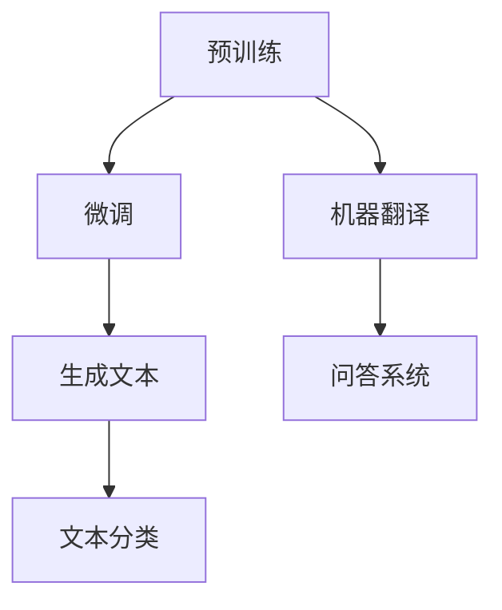
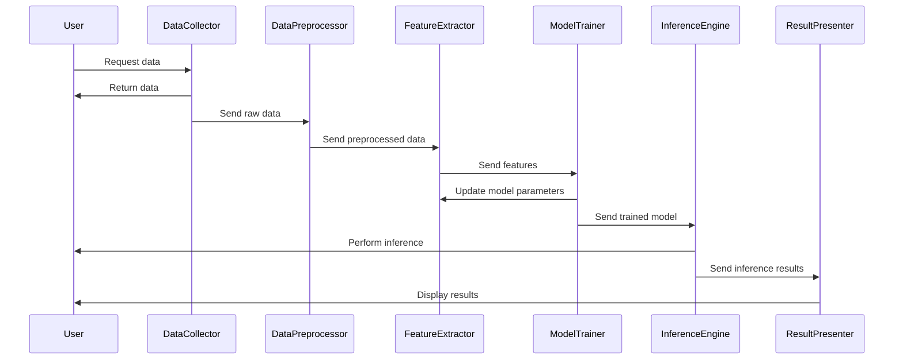

                 

### 引言

#### 1.1 大规模语言模型的发展历程

**1.1.1 大规模语言模型的发展历程**

大规模语言模型（如GPT、BERT等）是近年来自然语言处理领域的重要进展。这些模型通过学习海量文本数据，能够实现高效的语言理解和生成。然而，随着模型的规模越来越大，它们在跨域推理方面的能力引起了广泛关注。

1. **早期语言模型**：
   - 传统的基于规则的方法，例如统计语言模型和基于转换器的模型，如HMM（隐马尔可夫模型）和基于字的转换器。
   - 这些模型在语言理解和生成方面取得了一定的成果，但存在表达能力有限、计算复杂度高和参数规模不足等问题。

2. **深度学习时代的语言模型**：
   - 2000年代初，RNN（递归神经网络）和LSTM（长短期记忆网络）等深度学习模型开始在自然语言处理领域得到应用。
   - RNN通过递归结构捕捉序列信息，但存在梯度消失和梯度爆炸问题，LSTM通过引入门控机制解决了这一问题。

3. **大规模语言模型的兴起**：
   - 2017年，谷歌发布了BERT（双向编码器表示），标志着大规模语言模型的诞生。
   - BERT通过预训练和微调技术，在多种自然语言处理任务上取得了突破性的成果。
   - 此后，GPT（生成预训练变换器）和T5（文本到文本的变换器）等大规模语言模型相继出现，进一步提升了语言理解和生成的性能。

**1.1.2 跨域推理的重要性**

跨域推理是指模型在不同领域或任务之间进行推理和泛化的能力。在现实世界中，很多任务都需要跨领域的信息处理和决策。例如，一个自然语言生成模型如果只训练于新闻领域，那么它在撰写医疗报告时可能效果不佳。因此，研究大规模语言模型的跨域推理能力具有重要意义。

1. **跨领域信息处理**：
   - 跨领域信息处理是指模型能够处理来自不同领域的文本数据，并将其用于特定任务。
   - 这对于解决现实世界中的多领域问题具有重要意义，例如医疗领域的病历生成、法律领域的合同撰写等。

2. **跨领域决策**：
   - 跨领域决策是指模型能够利用跨领域信息进行决策，以解决复杂的实际问题。
   - 例如，在金融领域，模型需要处理来自股票市场、金融新闻和社交媒体等不同领域的数据，以预测市场趋势。

**1.1.3 研究目标与意义**

本研究的目标是深入探讨大规模语言模型的跨域推理能力，分析其在不同领域或任务中的表现，并探索提升其跨域推理性能的方法。这对于推动自然语言处理技术的发展和应用具有重大意义。

1. **研究目标**：
   - 分析大规模语言模型在不同领域或任务中的表现。
   - 探索跨域推理的原理和方法，并提出相应的优化策略。

2. **研究意义**：
   - 推动自然语言处理技术的发展，提升模型在跨领域应用中的性能。
   - 促进跨领域信息处理和跨领域决策的应用，为实际问题的解决提供技术支持。

通过本研究的深入探讨，我们期望能够为大规模语言模型的跨域推理能力提供新的理论指导和方法，推动自然语言处理技术的进一步发展。

### 核心概念与联系

#### 1.2.1 大规模语言模型

**1.2.1.1 定义**

大规模语言模型是指通过训练海量文本数据，能够捕捉语言复杂结构和语义信息的深度学习模型。这些模型通过学习语言数据中的统计规律和模式，能够实现对文本的生成、理解和推理。

**1.2.1.2 特点**

- **参数规模巨大**：大规模语言模型通常具有数亿甚至数万亿个参数，这使得它们能够捕捉到语言的复杂性和多样性。
- **自适应调整模型结构**：大规模语言模型通过自适应调整模型结构，能够适应不同的自然语言处理任务，实现灵活的应用。
- **多任务能力**：大规模语言模型通常具备多任务能力，即可以在多个自然语言处理任务上表现出色，例如文本分类、情感分析、机器翻译等。

**1.2.1.3 应用领域**

- **自然语言生成**：大规模语言模型可以用于生成高质量的自然语言文本，如文章、对话、摘要等。
- **机器翻译**：大规模语言模型在机器翻译领域表现出色，可以处理多种语言之间的翻译任务。
- **问答系统**：大规模语言模型可以用于构建问答系统，能够理解和回答用户的问题。
- **文本分类**：大规模语言模型可以用于文本分类任务，例如新闻分类、情感分类等。

#### 1.2.2 跨域推理

**1.2.2.1 定义**

跨域推理是指模型在不同领域或任务之间进行推理和泛化的能力。在现实世界中，很多任务都需要跨领域的信息处理和决策。因此，研究跨域推理能力对于提高模型的应用范围和性能具有重要意义。

**1.2.2.2 原理**

跨域推理的核心在于模型如何从源域学习到的知识迁移到目标域。通常涉及以下几个步骤：

- **源域数据收集与预处理**：从不同的领域收集数据，并进行预处理，如去除噪声、数据清洗、数据标注等。
- **目标域数据收集与预处理**：从目标领域收集数据，并进行预处理，以适应模型的训练。
- **模型迁移学习策略设计**：设计适当的迁移学习策略，将源域的知识迁移到目标域。
- **模型在目标域上的训练与评估**：在目标域上对模型进行训练和评估，以验证其在目标领域的表现。

**1.2.2.3 应用场景**

- **多媒体内容推荐**：跨领域推荐系统可以从不同领域的内容中提取特征，为用户提供个性化的推荐。
- **跨语言信息检索**：跨语言信息检索可以从多个语言的信息中提取相关特征，提高检索的准确性。
- **跨领域文本分类**：跨领域文本分类可以将来自不同领域的文本数据统一进行分类，提高分类的准确性和泛化能力。

#### 1.2.3 大规模语言模型与跨域推理的联系

大规模语言模型和跨域推理之间存在着密切的联系。

- **大规模语言模型为跨域推理提供基础**：大规模语言模型通过学习海量文本数据，能够捕捉到语言的复杂性和多样性，为跨域推理提供了基础。
- **跨域推理提升大规模语言模型的应用范围**：跨域推理能力使得大规模语言模型能够应用于不同的领域和任务，提高了其应用的范围和性能。

总的来说，大规模语言模型和跨域推理相辅相成，共同推动了自然语言处理技术的发展和应用。通过研究大规模语言模型的跨域推理能力，我们可以更好地理解其在不同领域或任务中的表现，并探索提升其性能的方法。

### 研究方法与数据集

#### 1.3.1 数据预处理

数据预处理是跨域推理研究的基础，直接影响到模型的性能和结果的可靠性。以下是数据预处理的主要步骤：

1. **数据清洗**：去除无关噪声和错误信息。例如，去除HTML标签、特殊字符、空格等。
   - **方法**：使用正则表达式、清洗库（如Python中的`re`库）等工具进行清洗。

2. **数据标注**：为数据提供相应的标签或标注，以便于后续的训练和评估。例如，在文本分类任务中，为每条文本标注所属的类别。
   - **方法**：手工标注、半监督标注、自动化标注等。

3. **数据平衡**：确保不同领域或任务的数据量大致相同，以避免数据分布不均对模型性能的影响。
   - **方法**：过采样、欠采样、数据增强等。

4. **数据划分**：将数据集划分为源域和目标域，以分别用于模型训练和评估。
   - **方法**：按照领域或任务进行划分，例如将新闻数据划分为源域，医疗数据划分为目标域。

#### 1.3.2 模型选择与训练

为了研究大规模语言模型的跨域推理能力，选择合适的模型并进行有效的训练至关重要。以下是模型选择和训练的主要步骤：

1. **模型选择**：
   - **Transformer模型**：Transformer模型通过自注意力机制实现高效的语言理解，常用于构建大规模语言模型。
   - **BERT模型**：BERT模型通过预训练和微调技术，在多种自然语言处理任务上表现出色。
   - **GPT模型**：GPT模型通过生成预训练技术，能够在文本生成任务中表现出色。

2. **模型训练**：
   - **预训练**：使用大规模的文本数据对模型进行预训练，使模型能够捕捉到语言的复杂结构和语义信息。
   - **微调**：在预训练的基础上，使用特定领域或任务的数据对模型进行微调，以提升模型在目标领域的性能。

3. **训练策略**：
   - **批次大小**：选择适当的批次大小，以平衡计算资源和模型性能。
   - **学习率**：选择合适的学习率，以避免过拟合和欠拟合。
   - **正则化**：采用适当的正则化方法，如Dropout、Weight Decay等，以避免过拟合。

#### 1.3.3 评估指标与实验设计

评估跨域推理能力的关键在于选择合适的评估指标和设计合理的实验方案。以下是评估指标和实验设计的主要步骤：

1. **评估指标**：
   - **准确率（Accuracy）**：模型预测正确的样本数占总样本数的比例。
   - **F1值（F1 Score）**：准确率和召回率的调和平均值，能够平衡分类任务的准确性和召回率。
   - **ROC-AUC曲线**：接收者操作特征曲线，用于评估分类器的性能。

2. **实验设计**：
   - **数据集划分**：将数据集划分为训练集、验证集和测试集，以分别用于模型训练、验证和评估。
   - **重复实验**：进行多次实验，以验证结果的稳定性和可靠性。
   - **模型对比**：选择不同的模型进行比较，以评估不同模型在跨域推理任务上的性能。

通过上述研究方法与数据集的设计，我们可以系统地研究大规模语言模型的跨域推理能力，分析其在不同领域或任务中的表现，并探索提升其跨域推理性能的方法。这将有助于推动自然语言处理技术的发展和应用。

### 第一部分：引言

#### 第1章：背景介绍

##### 1.1 问题背景

在当今的信息时代，自然语言处理（NLP）技术正逐渐成为人工智能领域中的一个重要研究方向。NLP技术的应用涵盖了多个领域，包括文本分类、机器翻译、问答系统、情感分析等。然而，随着技术的不断进步，大规模语言模型（如GPT、BERT等）的出现，使得NLP技术取得了显著的突破。这些大规模语言模型通过学习海量文本数据，能够捕捉到语言的复杂结构和语义信息，从而在多个NLP任务上表现出色。

然而，尽管大规模语言模型在单域（即单一领域）任务上取得了巨大成功，但在跨域推理方面仍存在许多挑战。跨域推理是指模型在不同领域或任务之间进行推理和泛化的能力。在实际应用中，很多任务都需要跨领域的信息处理和决策。例如，一个自然语言生成模型如果只训练于新闻领域，那么它在撰写医疗报告时可能效果不佳。因此，研究大规模语言模型的跨域推理能力具有重要意义。

##### 1.1.1 大规模语言模型的发展历程

大规模语言模型的发展历程可以分为以下几个阶段：

1. **早期语言模型**：
   - 在早期，语言模型主要基于统计方法和规则方法。例如，基于统计方法的N-gram模型和基于规则方法的转换器模型。这些模型通过简单计算文本的统计规律或应用规则进行语言处理，但在复杂性和表达能力方面存在限制。

2. **深度学习时代的语言模型**：
   - 2000年代初，递归神经网络（RNN）和长短期记忆网络（LSTM）等深度学习模型开始在自然语言处理领域得到应用。RNN通过递归结构能够捕捉序列信息，但存在梯度消失和梯度爆炸问题，LSTM通过引入门控机制解决了这一问题。

3. **大规模语言模型的兴起**：
   - 2017年，谷歌发布了BERT（双向编码器表示），标志着大规模语言模型的诞生。BERT通过预训练和微调技术，在多种自然语言处理任务上取得了突破性的成果。
   - 此后，生成预训练变换器（GPT）和文本到文本的变换器（T5）等大规模语言模型相继出现，进一步提升了语言理解和生成的性能。

##### 1.1.2 跨域推理的重要性

跨域推理的重要性主要体现在以下几个方面：

1. **跨领域信息处理**：
   - 跨领域信息处理是指模型能够处理来自不同领域的文本数据，并将其用于特定任务。例如，一个医疗自然语言生成模型需要能够处理医疗领域的专业术语和表达方式，同时也能够处理非医疗领域的文本。

2. **跨领域决策**：
   - 跨领域决策是指模型能够利用跨领域信息进行决策，以解决复杂的实际问题。例如，一个金融决策模型需要能够处理来自股票市场、金融新闻和社交媒体等不同领域的数据，以预测市场趋势。

3. **多任务能力**：
   - 大规模语言模型通常具备多任务能力，即可以在多个自然语言处理任务上表现出色。跨域推理能力的提升，可以使模型更好地适应不同的任务需求，提高其在实际应用中的性能。

##### 1.1.3 研究目标与意义

本研究的目标是深入探讨大规模语言模型的跨域推理能力，分析其在不同领域或任务中的表现，并探索提升其跨域推理性能的方法。具体来说，研究目标包括以下几个方面：

1. **分析大规模语言模型在不同领域或任务中的表现**：
   - 通过实验验证大规模语言模型在不同领域或任务中的性能，分析其在跨域推理方面的优势和劣势。

2. **探索跨域推理的原理和方法**：
   - 研究跨域推理的原理，分析大规模语言模型如何在不同领域或任务之间进行推理和泛化。

3. **提出优化策略**：
   - 提出有效的优化策略，以提升大规模语言模型的跨域推理能力。

研究意义主要体现在以下几个方面：

1. **推动自然语言处理技术的发展**：
   - 通过研究大规模语言模型的跨域推理能力，可以推动自然语言处理技术的进一步发展，提高模型在跨领域应用中的性能。

2. **促进跨领域信息处理和跨领域决策的应用**：
   - 通过研究跨域推理，可以促进跨领域信息处理和跨领域决策在实际问题中的应用，为现实世界中的复杂问题提供技术支持。

3. **提升人工智能技术的实用性**：
   - 通过提升大规模语言模型的跨域推理能力，可以更好地解决现实世界中的实际问题，提高人工智能技术的实用性。

总的来说，研究大规模语言模型的跨域推理能力对于自然语言处理技术的发展和应用具有重要意义。通过本研究的深入探讨，我们期望能够为大规模语言模型的跨域推理能力提供新的理论指导和方法，推动自然语言处理技术的进一步发展。

### 核心概念与联系

#### 1.2.1 大规模语言模型

**定义**

大规模语言模型（Massive Language Models，简称MLM）是指通过训练海量文本数据，能够捕捉语言复杂结构和语义信息的深度学习模型。这些模型通过学习文本数据中的统计规律和模式，可以实现对文本的生成、理解和推理。

**特点**

- **参数规模巨大**：大规模语言模型通常包含数亿甚至数千亿个参数，这使得它们能够捕捉到语言的复杂性和多样性。
- **自适应调整模型结构**：大规模语言模型可以通过自适应调整模型结构，以适应不同的自然语言处理任务。
- **多任务能力**：大规模语言模型通常具备多任务能力，即可以在多个自然语言处理任务上表现出色。

**应用领域**

- **自然语言生成**：大规模语言模型可以用于生成高质量的自然语言文本，如文章、对话、摘要等。
- **机器翻译**：大规模语言模型在机器翻译领域表现出色，可以处理多种语言之间的翻译任务。
- **问答系统**：大规模语言模型可以用于构建问答系统，能够理解和回答用户的问题。
- **文本分类**：大规模语言模型可以用于文本分类任务，例如新闻分类、情感分类等。

**核心概念与联系**

1. **预训练**：预训练是指在大规模语言模型训练过程中，首先使用未标记的文本数据进行大规模训练，使模型能够捕捉到语言的复杂结构和语义信息。预训练后的模型再通过微调技术，即使用特定领域的标记数据进一步训练，以提高模型在特定任务上的性能。

2. **微调**：微调是指在大规模语言模型预训练的基础上，使用特定领域的标记数据进行进一步训练，以适应特定任务的需求。微调过程中，模型会根据任务的标签信息进行调整，以提升模型在特定任务上的表现。

3. **自注意力机制**：自注意力机制（Self-Attention）是大规模语言模型中的一个关键组件，它允许模型在处理文本序列时，能够自适应地关注序列中的不同部分，从而提高模型对长距离依赖关系的捕捉能力。

**ER实体关系图架构的Mermaid流程图**



**对比表格**

| 特性 | 预训练 | 微调 |
| --- | --- | --- |
| 数据规模 | 海量未标记文本 | 特定领域标记文本 |
| 目标 | 捕捉语言结构和语义 | 适应特定任务 |
| 方法 | 自适应调整模型结构 | 基于标签信息调整 |
| 效果 | 提高模型泛化能力 | 提高特定任务性能 |

通过上述核心概念与联系的讨论，我们可以更好地理解大规模语言模型的工作原理和应用场景，为后续的研究和开发提供理论基础。

### 1.2.2 跨域推理

**定义**

跨域推理（Cross-Domain Reasoning）是指模型在不同领域或任务之间进行推理和泛化的能力。在实际应用中，不同领域或任务之间的数据分布和任务目标往往存在差异，跨域推理能够帮助模型在不同领域或任务之间灵活迁移知识，提高模型的泛化能力和适应性。

**原理**

跨域推理的原理主要涉及以下几个方面：

1. **领域自适应**：领域自适应（Domain Adaptation）是指将源领域的知识迁移到目标领域，以减少领域差异带来的负面影响。领域自适应可以通过以下几种方法实现：

   - **对抗训练**：对抗训练是一种常用的领域自适应方法，通过训练一个对抗网络，使源领域和目标领域之间的特征分布更加相似，从而降低领域差异。
   - **领域适配器**：领域适配器是一种模型，它通过学习源领域和目标领域之间的映射关系，将源领域的特征转换为适用于目标领域的特征。

2. **迁移学习**：迁移学习（Transfer Learning）是指将一个任务在源领域上学习到的知识应用到另一个任务的目标领域上。迁移学习可以通过以下几种方法实现：

   - **共享层**：共享层是指在不同任务之间共享模型的一部分层，通过在多个任务上训练模型，可以提高模型在不同任务上的泛化能力。
   - **元学习**：元学习（Meta-Learning）是指通过在多个任务上训练模型，学习一种通用学习策略，以适应新的任务。元学习可以加速新任务的学习过程。

3. **多任务学习**：多任务学习（Multi-Task Learning）是指同时训练多个相关任务，通过共享模型参数和知识，提高模型在不同任务上的表现。多任务学习可以通过以下几种方法实现：

   - **任务融合**：任务融合是指将多个任务的输入和输出进行融合，通过共享模型参数，使模型能够同时学习多个任务。
   - **一致性正则化**：一致性正则化是指通过添加一致性约束，使模型在不同任务上的预测结果保持一致，从而提高模型的泛化能力。

**应用场景**

跨域推理的应用场景非常广泛，以下是一些典型的应用场景：

1. **多媒体内容推荐**：多媒体内容推荐系统可以从不同领域的内容中提取特征，为用户提供个性化的推荐。例如，一个音乐推荐系统可以结合用户在音乐、视频和社交媒体上的行为数据，为用户提供个性化的音乐推荐。

2. **跨语言信息检索**：跨语言信息检索可以从多个语言的信息中提取相关特征，提高检索的准确性。例如，一个英文到中文的信息检索系统可以通过学习英文和中文之间的翻译关系，提高中英文查询的匹配精度。

3. **跨领域文本分类**：跨领域文本分类可以将来自不同领域的文本数据统一进行分类，提高分类的准确性和泛化能力。例如，一个新闻分类系统可以同时处理体育、政治、科技等不同领域的新闻，将它们统一分类到相应的类别。

通过上述对跨域推理的定义、原理和应用场景的介绍，我们可以更好地理解跨域推理在自然语言处理领域的重要性，以及如何通过不同的方法和技术实现跨域推理。

### 1.3 研究方法与数据集

在进行大规模语言模型的跨域推理研究时，研究方法与数据集的选择至关重要。以下详细描述了数据预处理、模型选择与训练、评估指标与实验设计等关键环节。

#### 1.3.1 数据预处理

数据预处理是跨域推理研究的基础，其目的是提高数据质量，确保模型能够从数据中学习到有效的特征。数据预处理主要包括以下几个步骤：

1. **数据清洗**：数据清洗是数据预处理的第一步，旨在去除数据中的噪声和错误信息。具体操作包括：
   - **去除HTML标签**：通过正则表达式或其他方法，去除文本中的HTML标签。
   - **去除特殊字符**：移除文本中的特殊字符，如空格、标点符号等。
   - **统一文本格式**：将文本统一转换为小写或大写，以消除大小写不一致的问题。

2. **数据标注**：数据标注是针对文本数据的一种预处理方法，旨在为每个文本样本提供相应的标签或标注。标注可以是分类标签、实体标注或句子级标注等。常见的数据标注方法包括：
   - **人工标注**：通过人工对文本进行标注，这是一种较为准确但成本较高的方法。
   - **半监督标注**：利用已标注数据与未标注数据共同训练模型，通过模型预测对未标注数据进行标注，从而降低标注成本。
   - **自动化标注**：利用已有的标注工具或算法对文本进行自动标注，这种方法在标注一致性方面可能存在一定问题。

3. **数据平衡**：在跨域推理研究中，不同领域或任务的数据量往往不一致，数据平衡是确保模型训练过程中各领域或任务数据量均衡的重要步骤。数据平衡的方法包括：
   - **过采样**：通过复制少量样本，增加少数类别的样本数量，达到数据平衡。
   - **欠采样**：通过删除多数类别的样本，减少多数类别的样本数量，达到数据平衡。
   - **数据增强**：通过生成合成样本或对现有样本进行变换，增加数据多样性，从而达到数据平衡。

4. **数据划分**：将数据集划分为训练集、验证集和测试集，用于模型的训练、验证和测试。通常，训练集用于模型训练，验证集用于模型调参和性能评估，测试集用于最终的性能评估。

#### 1.3.2 模型选择与训练

选择合适的模型并对其进行有效的训练是跨域推理研究的关键步骤。以下介绍几种常见的模型选择和训练方法：

1. **模型选择**：
   - **Transformer模型**：Transformer模型通过自注意力机制实现高效的语言理解，是大规模语言模型中的代表性模型。其结构简洁，计算效率高，适用于多种自然语言处理任务。
   - **BERT模型**：BERT（Bidirectional Encoder Representations from Transformers）模型通过双向编码器结构捕捉语言的上下文信息，在多种自然语言处理任务上表现出色。
   - **GPT模型**：GPT（Generative Pre-trained Transformer）模型通过生成预训练技术，在文本生成任务上表现出色。

2. **模型训练**：
   - **预训练**：预训练是指在大量未标记的文本数据上训练模型，使模型能够捕捉到语言的复杂结构和语义信息。预训练后的模型再通过微调技术，使用特定领域的标记数据进一步训练，以提高模型在特定任务上的性能。
   - **微调**：微调是指在大规模语言模型预训练的基础上，使用特定领域的标记数据对模型进行进一步训练。微调过程中，模型会根据任务的标签信息进行调整，以提升模型在特定任务上的表现。

3. **训练策略**：
   - **批次大小**：批次大小（Batch Size）是指每次训练过程中参与训练的样本数量。批次大小选择需要平衡计算资源和模型性能，通常在几百到几千之间。
   - **学习率**：学习率（Learning Rate）是指模型在训练过程中参数更新的步长。选择合适的学习率是避免过拟合和欠拟合的关键，通常采用递减学习率策略。
   - **正则化**：正则化（Regularization）是一种防止模型过拟合的技术，常用的正则化方法包括Dropout、权重衰减等。

#### 1.3.3 评估指标与实验设计

评估跨域推理能力的指标和实验设计是验证模型性能的重要步骤。以下介绍几种常用的评估指标和实验设计方法：

1. **评估指标**：
   - **准确率（Accuracy）**：准确率是指模型预测正确的样本数占总样本数的比例。准确率是评估分类模型性能的常用指标，但容易受到数据不平衡的影响。
   - **精确率与召回率（Precision and Recall）**：精确率和召回率分别表示预测为正例的样本中实际为正例的比例和实际为正例的样本中被预测为正例的比例。精确率和召回率的调和平均值F1值（F1 Score）是同时考虑精确率和召回率的综合指标。
   - **ROC-AUC曲线**：ROC（Receiver Operating Characteristic）曲线是评估二分类模型性能的重要工具，AUC（Area Under Curve）表示曲线下面积，AUC值越大，模型性能越好。

2. **实验设计**：
   - **数据集划分**：将数据集划分为训练集、验证集和测试集，分别用于模型训练、验证和测试。通常，训练集用于模型训练，验证集用于模型调参和性能评估，测试集用于最终的性能评估。
   - **重复实验**：进行多次实验，以验证结果的稳定性和可靠性。重复实验可以帮助发现偶然误差，提高实验结果的可靠性。
   - **模型对比**：选择不同的模型进行比较，以评估不同模型在跨域推理任务上的性能。通过对比不同模型的性能，可以找出性能较好的模型，为进一步优化模型提供参考。

通过上述研究方法与数据集的设计，我们可以系统地研究大规模语言模型的跨域推理能力，分析其在不同领域或任务中的表现，并探索提升其跨域推理性能的方法。这将有助于推动自然语言处理技术的发展和应用。

### 本书的结构安排

为了系统地探讨大规模语言模型的跨域推理能力，本书分为四个主要部分，每个部分都有其独特的目的和内容安排。

#### 第一部分：引言

引言部分旨在为读者提供一个关于大规模语言模型和跨域推理的全面概述。首先，介绍大规模语言模型的发展历程，从早期的统计语言模型到现代的深度学习模型，包括Transformer、BERT和GPT等代表性模型。然后，探讨跨域推理的重要性，解释为什么跨领域信息处理和决策在现实世界中具有重要意义。最后，阐述本研究的目标和意义，介绍本书的结构安排。

#### 第二部分：大规模语言模型基础

第二部分将深入探讨大规模语言模型的基础知识。首先，详细介绍大规模语言模型的定义、特点和主要应用领域。然后，重点讲解大规模语言模型的工作原理，包括预训练、微调和自注意力机制等关键组件。此外，还将介绍大规模语言模型中的数学模型和公式，帮助读者理解模型的内部工作机制。最后，通过具体案例和实例，展示大规模语言模型在自然语言处理任务中的实际应用。

#### 第三部分：跨域推理能力研究

第三部分专注于跨域推理能力的研究。首先，介绍跨域推理的定义、原理和应用场景。然后，详细讨论跨域推理的挑战和解决方案，包括领域自适应、迁移学习和多任务学习等方法。接着，通过实验设计和数据分析，探讨大规模语言模型在不同领域或任务中的表现，并评估其跨域推理能力。最后，提出提升大规模语言模型跨域推理性能的方法和策略。

#### 第四部分：项目实战

第四部分将通过实际项目实战，展示如何将大规模语言模型应用于跨域推理任务。首先，介绍项目背景和目标，包括所需的技术栈和环境搭建。然后，详细描述项目的核心实现步骤，包括数据预处理、模型选择与训练、评估与优化等。接着，通过具体代码和应用实例，讲解如何实现大规模语言模型的跨域推理功能。最后，分析项目的实际效果，总结经验教训，并提出改进方向。

通过上述四个部分的系统介绍，本书旨在为读者提供关于大规模语言模型和跨域推理的全面而深入的理解，帮助读者掌握相关技术和方法，并将其应用于实际项目中。

### 第一部分：引言

#### 第1章：背景介绍

##### 1.1 问题背景

在当今的信息时代，自然语言处理（NLP）技术正逐渐成为人工智能领域中的一个重要研究方向。NLP技术的应用涵盖了多个领域，包括文本分类、机器翻译、问答系统、情感分析等。然而，随着技术的不断进步，大规模语言模型（如GPT、BERT等）的出现，使得NLP技术取得了显著的突破。这些大规模语言模型通过学习海量文本数据，能够捕捉到语言的复杂结构和语义信息，从而在多个NLP任务上表现出色。

然而，尽管大规模语言模型在单域（即单一领域）任务上取得了巨大成功，但在跨域推理方面仍存在许多挑战。跨域推理是指模型在不同领域或任务之间进行推理和泛化的能力。在实际应用中，很多任务都需要跨领域的信息处理和决策。例如，一个自然语言生成模型如果只训练于新闻领域，那么它在撰写医疗报告时可能效果不佳。因此，研究大规模语言模型的跨域推理能力具有重要意义。

##### 1.1.1 大规模语言模型的发展历程

大规模语言模型的发展历程可以分为以下几个阶段：

1. **早期语言模型**：
   - 在早期，语言模型主要基于统计方法和规则方法。例如，基于统计方法的N-gram模型和基于规则方法的转换器模型。这些模型通过简单计算文本的统计规律或应用规则进行语言处理，但在复杂性和表达能力方面存在限制。

2. **深度学习时代的语言模型**：
   - 2000年代初，递归神经网络（RNN）和长短期记忆网络（LSTM）等深度学习模型开始在自然语言处理领域得到应用。RNN通过递归结构能够捕捉序列信息，但存在梯度消失和梯度爆炸问题，LSTM通过引入门控机制解决了这一问题。

3. **大规模语言模型的兴起**：
   - 2017年，谷歌发布了BERT（双向编码器表示），标志着大规模语言模型的诞生。BERT通过预训练和微调技术，在多种自然语言处理任务上取得了突破性的成果。
   - 此后，生成预训练变换器（GPT）和文本到文本的变换器（T5）等大规模语言模型相继出现，进一步提升了语言理解和生成的性能。

##### 1.1.2 跨域推理的重要性

跨域推理的重要性主要体现在以下几个方面：

1. **跨领域信息处理**：
   - 跨领域信息处理是指模型能够处理来自不同领域的文本数据，并将其用于特定任务。例如，一个医疗自然语言生成模型需要能够处理医疗领域的专业术语和表达方式，同时也能够处理非医疗领域的文本。

2. **跨领域决策**：
   - 跨领域决策是指模型能够利用跨领域信息进行决策，以解决复杂的实际问题。例如，一个金融决策模型需要能够处理来自股票市场、金融新闻和社交媒体等不同领域的数据，以预测市场趋势。

3. **多任务能力**：
   - 大规模语言模型通常具备多任务能力，即可以在多个自然语言处理任务上表现出色。跨域推理能力的提升，可以使模型更好地适应不同的任务需求，提高其在实际应用中的性能。

##### 1.1.3 研究目标与意义

本研究的目标是深入探讨大规模语言模型的跨域推理能力，分析其在不同领域或任务中的表现，并探索提升其跨域推理性能的方法。具体来说，研究目标包括以下几个方面：

1. **分析大规模语言模型在不同领域或任务中的表现**：
   - 通过实验验证大规模语言模型在不同领域或任务中的性能，分析其在跨域推理方面的优势和劣势。

2. **探索跨域推理的原理和方法**：
   - 研究跨域推理的原理，分析大规模语言模型如何在不同领域或任务之间进行推理和泛化。

3. **提出优化策略**：
   - 提出有效的优化策略，以提升大规模语言模型的跨域推理能力。

研究意义主要体现在以下几个方面：

1. **推动自然语言处理技术的发展**：
   - 通过研究大规模语言模型的跨域推理能力，可以推动自然语言处理技术的进一步发展，提高模型在跨领域应用中的性能。

2. **促进跨领域信息处理和跨领域决策的应用**：
   - 通过研究跨域推理，可以促进跨领域信息处理和跨领域决策在实际问题中的应用，为现实世界中的复杂问题提供技术支持。

3. **提升人工智能技术的实用性**：
   - 通过提升大规模语言模型的跨域推理能力，可以更好地解决现实世界中的实际问题，提高人工智能技术的实用性。

总的来说，研究大规模语言模型的跨域推理能力对于自然语言处理技术的发展和应用具有重要意义。通过本研究的深入探讨，我们期望能够为大规模语言模型的跨域推理能力提供新的理论指导和方法，推动自然语言处理技术的进一步发展。

### 第一部分：引言

#### 第1章：背景介绍

##### 1.1 问题背景

自然语言处理（NLP）技术作为人工智能领域的重要组成部分，近年来取得了显著的进展。特别是在大规模语言模型（如GPT、BERT等）的推动下，NLP在文本分类、机器翻译、问答系统等领域取得了令人瞩目的成果。然而，随着应用场景的不断扩展，如何在跨领域或任务间进行有效的推理和泛化，成为了一个亟待解决的问题。跨域推理（Cross-Domain Reasoning）是指模型在不同领域或任务之间进行推理和泛化的能力。在现实世界中，很多任务需要跨领域的知识，例如，医疗报告撰写需要结合医学知识和非医学知识，金融决策需要整合股票市场和社交媒体信息。因此，研究大规模语言模型的跨域推理能力具有重要意义。

##### 1.1.1 大规模语言模型的发展历程

大规模语言模型的发展历程可以分为以下几个阶段：

1. **早期语言模型**：
   - 传统的语言模型主要基于统计方法和规则方法。N-gram模型是最早的语言模型之一，通过统计文本中连续单词的出现频率来预测下一个单词。虽然简单有效，但N-gram模型无法捕捉长距离依赖关系，因此在复杂任务上的表现有限。
   - 基于规则的方法通过手工编写规则来指导语言处理，例如，词法分析、句法分析等。这种方法虽然能处理特定问题，但灵活性和扩展性较差。

2. **深度学习时代的语言模型**：
   - 递归神经网络（RNN）的出现为语言模型带来了新的契机。RNN通过递归结构能够处理序列数据，能够捕捉到短距离依赖关系。然而，RNN存在梯度消失和梯度爆炸的问题，导致训练效果不佳。
   - 长短期记忆网络（LSTM）和门控循环单元（GRU）通过引入门控机制解决了RNN的问题，能够在长序列数据上保持稳定的表现。

3. **大规模语言模型的兴起**：
   - 2017年，谷歌发布了BERT（Bidirectional Encoder Representations from Transformers），这是第一个大规模双向变换器语言模型。BERT通过预训练和微调技术，在多种NLP任务上取得了显著的成果，引起了广泛关注。
   - GPT（Generative Pre-trained Transformer）是另一种大规模语言模型，它通过生成预训练技术，在文本生成任务上表现出色。
   - T5（Text-to-Text Transfer Transformer）模型是一种通用的文本处理模型，它通过将所有NLP任务转换为文本到文本的转换任务，实现了良好的跨任务性能。

##### 1.1.2 跨域推理的重要性

跨域推理的重要性体现在以下几个方面：

1. **跨领域信息处理**：
   - 在实际应用中，很多任务需要跨领域的知识。例如，医疗报告撰写需要结合医学知识和临床实践，金融决策需要整合股票市场数据和经济新闻。跨域推理能力使得模型能够灵活地处理不同领域的文本数据，提高任务的准确性和效率。

2. **跨领域决策**：
   - 跨领域决策是指模型能够利用跨领域的知识进行综合分析和决策。例如，在金融领域，模型需要结合股票市场、金融新闻和社交媒体等多方面信息，进行投资分析和预测。跨域推理能力使得模型能够处理复杂的多维度数据，提高决策的准确性。

3. **多任务能力**：
   - 大规模语言模型通常具备多任务能力，即可以在多个NLP任务上表现出色。跨域推理能力使得模型能够灵活地适应不同的任务需求，提高任务的泛化能力。

##### 1.1.3 研究目标与意义

本研究的目标是深入探讨大规模语言模型的跨域推理能力，分析其在不同领域或任务中的表现，并探索提升其跨域推理性能的方法。具体来说，研究目标包括以下几个方面：

1. **分析大规模语言模型在不同领域或任务中的表现**：
   - 通过实验验证大规模语言模型在不同领域或任务中的性能，分析其在跨域推理方面的优势和劣势。

2. **探索跨域推理的原理和方法**：
   - 研究跨域推理的原理，分析大规模语言模型如何在不同领域或任务之间进行推理和泛化。

3. **提出优化策略**：
   - 提出有效的优化策略，以提升大规模语言模型的跨域推理能力。

研究意义主要体现在以下几个方面：

1. **推动自然语言处理技术的发展**：
   - 通过研究大规模语言模型的跨域推理能力，可以推动自然语言处理技术的进一步发展，提高模型在跨领域应用中的性能。

2. **促进跨领域信息处理和跨领域决策的应用**：
   - 通过研究跨域推理，可以促进跨领域信息处理和跨领域决策在实际问题中的应用，为现实世界中的复杂问题提供技术支持。

3. **提升人工智能技术的实用性**：
   - 通过提升大规模语言模型的跨域推理能力，可以更好地解决现实世界中的实际问题，提高人工智能技术的实用性。

总的来说，研究大规模语言模型的跨域推理能力对于自然语言处理技术的发展和应用具有重要意义。通过本研究的深入探讨，我们期望能够为大规模语言模型的跨域推理能力提供新的理论指导和方法，推动自然语言处理技术的进一步发展。

### 核心概念与联系

#### 1.2.1 大规模语言模型

**定义**

大规模语言模型（Massive Language Models，简称MLM）是指通过训练海量文本数据，能够捕捉语言复杂结构和语义信息的深度学习模型。这些模型通过学习文本数据中的统计规律和模式，可以实现对文本的生成、理解和推理。

**特点**

- **参数规模巨大**：大规模语言模型通常包含数亿甚至数千亿个参数，这使得它们能够捕捉到语言的复杂性和多样性。
- **自适应调整模型结构**：大规模语言模型可以通过自适应调整模型结构，以适应不同的自然语言处理任务。
- **多任务能力**：大规模语言模型通常具备多任务能力，即可以在多个自然语言处理任务上表现出色。

**应用领域**

- **自然语言生成**：大规模语言模型可以用于生成高质量的自然语言文本，如文章、对话、摘要等。
- **机器翻译**：大规模语言模型在机器翻译领域表现出色，可以处理多种语言之间的翻译任务。
- **问答系统**：大规模语言模型可以用于构建问答系统，能够理解和回答用户的问题。
- **文本分类**：大规模语言模型可以用于文本分类任务，例如新闻分类、情感分类等。

**核心概念与联系**

1. **预训练**：预训练是指在大规模语言模型训练过程中，首先使用未标记的文本数据进行大规模训练，使模型能够捕捉到语言的复杂结构和语义信息。预训练后的模型再通过微调技术，即使用特定领域的标记数据进一步训练，以提高模型在特定任务上的性能。

2. **微调**：微调是指在大规模语言模型预训练的基础上，使用特定领域的标记数据进行进一步训练，以适应特定任务的需求。微调过程中，模型会根据任务的标签信息进行调整，以提升模型在特定任务上的表现。

3. **自注意力机制**：自注意力机制（Self-Attention）是大规模语言模型中的一个关键组件，它允许模型在处理文本序列时，能够自适应地关注序列中的不同部分，从而提高模型对长距离依赖关系的捕捉能力。

**ER实体关系图架构的Mermaid流程图**


**对比表格**

| 特性 | 预训练 | 微调 |
| --- | --- | --- |
| 数据规模 | 海量未标记文本 | 特定领域标记文本 |
| 目标 | 捕捉语言结构和语义 | 适应特定任务 |
| 方法 | 自适应调整模型结构 | 基于标签信息调整 |
| 效果 | 提高模型泛化能力 | 提高特定任务性能 |

通过上述核心概念与联系的讨论，我们可以更好地理解大规模语言模型的工作原理和应用场景，为后续的研究和开发提供理论基础。

### 1.2.2 跨域推理

**定义**

跨域推理（Cross-Domain Reasoning）是指模型在不同领域或任务之间进行推理和泛化的能力。在实际应用中，不同领域或任务之间的数据分布和任务目标往往存在差异，跨域推理能够帮助模型在不同领域或任务之间灵活迁移知识，提高模型的泛化能力和适应性。

**原理**

跨域推理的原理主要涉及以下几个方面：

1. **领域自适应**：领域自适应（Domain Adaptation）是指将源领域的知识迁移到目标领域，以减少领域差异带来的负面影响。领域自适应可以通过以下几种方法实现：

   - **对抗训练**：对抗训练是一种常用的领域自适应方法，通过训练一个对抗网络，使源领域和目标领域之间的特征分布更加相似，从而降低领域差异。
   - **领域适配器**：领域适配器是一种模型，它通过学习源领域和目标领域之间的映射关系，将源领域的特征转换为适用于目标领域的特征。

2. **迁移学习**：迁移学习（Transfer Learning）是指将一个任务在源领域上学习到的知识应用到另一个任务的目标领域上。迁移学习可以通过以下几种方法实现：

   - **共享层**：共享层是指在不同任务之间共享模型的一部分层，通过在多个任务上训练模型，可以提高模型在不同任务上的泛化能力。
   - **元学习**：元学习（Meta-Learning）是指通过在多个任务上训练模型，学习一种通用学习策略，以适应新的任务。元学习可以加速新任务的学习过程。

3. **多任务学习**：多任务学习（Multi-Task Learning）是指同时训练多个相关任务，通过共享模型参数和知识，提高模型在不同任务上的表现。多任务学习可以通过以下几种方法实现：

   - **任务融合**：任务融合是指将多个任务的输入和输出进行融合，通过共享模型参数，使模型能够同时学习多个任务。
   - **一致性正则化**：一致性正则化是指通过添加一致性约束，使模型在不同任务上的预测结果保持一致，从而提高模型的泛化能力。

**应用场景**

跨域推理的应用场景非常广泛，以下是一些典型的应用场景：

1. **多媒体内容推荐**：多媒体内容推荐系统可以从不同领域的内容中提取特征，为用户提供个性化的推荐。例如，一个音乐推荐系统可以结合用户在音乐、视频和社交媒体上的行为数据，为用户提供个性化的音乐推荐。

2. **跨语言信息检索**：跨语言信息检索可以从多个语言的信息中提取相关特征，提高检索的准确性。例如，一个英文到中文的信息检索系统可以通过学习英文和中文之间的翻译关系，提高中英文查询的匹配精度。

3. **跨领域文本分类**：跨领域文本分类可以将来自不同领域的文本数据统一进行分类，提高分类的准确性和泛化能力。例如，一个新闻分类系统可以同时处理体育、政治、科技等不同领域的新闻，将它们统一分类到相应的类别。

通过上述对跨域推理的定义、原理和应用场景的介绍，我们可以更好地理解跨域推理在自然语言处理领域的重要性，以及如何通过不同的方法和技术实现跨域推理。

### 研究方法与数据集

#### 1.3.1 数据预处理

数据预处理是跨域推理研究中至关重要的一环，它直接影响模型的训练效果和推理能力。以下是数据预处理的主要步骤和注意事项：

1. **文本清洗**：
   - **去除无关符号**：去除文本中的HTML标签、特殊字符和多余的空格。
   - **统一文本格式**：将所有文本转换为统一的格式，例如全小写或全大写。
   - **标点符号处理**：对于标点符号，可以选择保留、去除或替换成统一的符号。

2. **分词**：
   - **中文分词**：对于中文文本，使用中文分词工具（如jieba）将文本切分成词汇序列。
   - **英文分词**：对于英文文本，可以使用简单的空格分隔或专业的分词工具（如NLTK）。

3. **去除停用词**：
   - **定义停用词表**：根据任务的需求，定义一个停用词表，包括常见的无意义词汇。
   - **去除停用词**：在数据处理过程中，从文本中去除停用词，以减少噪声。

4. **词干提取**：
   - **使用词干提取器**：通过词干提取器（如Porter Stemmer、Snowball Stemmer）将词汇还原到词干形式，减少词汇多样性。

5. **数据平衡**：
   - **过采样和欠采样**：对于不平衡的数据集，可以通过过采样或欠采样来平衡类别分布。
   - **数据增强**：通过随机插入、删除或替换词汇，增加数据的多样性。

#### 1.3.2 模型选择与训练

模型选择与训练是跨域推理研究的核心步骤，以下是选择模型、训练策略和评估指标的关键点：

1. **模型选择**：
   - **Transformer模型**：Transformer模型由于其自注意力机制，在捕捉长距离依赖关系方面表现出色，是跨域推理的常用模型。
   - **BERT模型**：BERT模型通过预训练和微调，在多种NLP任务上表现出色，适用于跨域推理任务。
   - **GPT模型**：GPT模型在生成任务上表现出色，通过预训练生成大量的文本数据，可以提高跨域推理的能力。

2. **训练策略**：
   - **预训练**：使用大规模的通用语料库对模型进行预训练，使模型能够捕捉到语言的复杂结构和语义信息。
   - **微调**：在预训练的基础上，使用特定领域的标记数据对模型进行微调，以适应具体任务的需求。
   - **学习率调整**：采用递减学习率策略，以避免过拟合和欠拟合。
   - **正则化**：使用Dropout、权重衰减等正则化技术，提高模型的泛化能力。

3. **评估指标**：
   - **准确率（Accuracy）**：模型预测正确的样本数占总样本数的比例，是最常用的评估指标。
   - **F1值（F1 Score）**：精确率和召回率的调和平均值，能够更好地平衡分类任务。
   - **ROC-AUC（Receiver Operating Characteristic - Area Under Curve）**：评估二分类模型的性能，曲线下面积越大，模型性能越好。

#### 1.3.3 评估指标与实验设计

评估跨域推理能力的关键在于选择合适的评估指标和设计合理的实验方案。以下是评估指标和实验设计的主要步骤：

1. **评估指标**：
   - **准确率（Accuracy）**：模型预测正确的样本数占总样本数的比例，简单直观，但易受到数据分布影响。
   - **精确率（Precision）**：预测为正例的样本中实际为正例的比例，反映模型的精确性。
   - **召回率（Recall）**：实际为正例的样本中被预测为正例的比例，反映模型的完整性。
   - **F1值（F1 Score）**：精确率和召回率的调和平均值，综合考虑精确性和完整性。
   - **ROC-AUC曲线**：评估二分类模型的性能，曲线下面积越大，模型性能越好。

2. **实验设计**：
   - **数据集划分**：将数据集划分为训练集、验证集和测试集，分别用于模型训练、调参和评估。
   - **重复实验**：进行多次实验，以验证结果的稳定性和可靠性。
   - **对比实验**：选择不同的模型和算法进行对比，评估不同方法在跨域推理任务上的性能。
   - **错误分析**：分析模型在测试集上的错误案例，找出模型的弱点，指导模型优化。

通过上述研究方法与数据集的设计，我们可以系统地研究大规模语言模型的跨域推理能力，分析其在不同领域或任务中的表现，并探索提升其跨域推理性能的方法。这将有助于推动自然语言处理技术的发展和应用。

### 研究方法与数据集

#### 1.3.1 数据预处理

数据预处理是跨域推理研究的关键步骤，其目的是提高数据质量，确保模型能够从数据中学习到有效的特征。以下是数据预处理的主要步骤：

1. **数据清洗**：去除数据中的噪声和错误信息。具体包括：
   - 去除HTML标签：使用正则表达式或其他工具去除文本中的HTML标签。
   - 去除特殊字符：移除文本中的特殊字符，如空格、标点符号等。
   - 上下文保持：保留文本的上下文信息，确保数据的语义完整性。

2. **数据标注**：为数据提供相应的标签或标注，以便于后续的训练和评估。标注方法包括：
   - 人工标注：由专业人士对数据集进行标注，确保标注的准确性和一致性。
   - 自动标注：使用现有的标注工具或算法对数据进行自动标注，如使用词性标注工具对文本进行词性标注。

3. **数据平衡**：确保数据集中各类别样本的数量大致相同，避免数据分布不均对模型训练和评估的影响。数据平衡方法包括：
   - 过采样：通过复制少数类别的样本，增加少数类别的样本数量。
   - 欠采样：通过删除多数类别的样本，减少多数类别的样本数量。
   - 数据增强：通过数据变换、生成合成样本等方式增加数据多样性，从而平衡数据分布。

4. **数据划分**：将数据集划分为训练集、验证集和测试集。通常，训练集用于模型训练，验证集用于模型调参和性能评估，测试集用于最终的性能评估。数据划分方法包括：
   - 随机划分：将数据随机划分为训练集、验证集和测试集。
   - 分层划分：根据数据集中各类别的比例，按比例划分训练集、验证集和测试集，确保各数据集的分布与整体数据集相似。

#### 1.3.2 模型选择与训练

选择合适的模型并进行有效的训练是跨域推理研究的核心步骤。以下是模型选择、训练策略和评估指标的关键点：

1. **模型选择**：选择适用于跨域推理的模型，如：
   - **BERT**：通过预训练和微调，在多种自然语言处理任务上表现出色，适用于跨域推理任务。
   - **GPT**：生成预训练模型，能够在文本生成任务中表现出色，适用于跨领域文本生成。
   - **Transformer**：具有自注意力机制，能够捕捉长距离依赖关系，适用于跨领域文本理解和生成。

2. **训练策略**：
   - **预训练**：使用大规模的通用语料库对模型进行预训练，使模型能够捕捉到语言的复杂结构和语义信息。
   - **微调**：在预训练的基础上，使用特定领域的标记数据对模型进行微调，以适应具体任务的需求。
   - **学习率调整**：采用递减学习率策略，以避免过拟合和欠拟合。
   - **正则化**：使用Dropout、权重衰减等正则化技术，提高模型的泛化能力。

3. **评估指标**：选择合适的评估指标，以衡量模型在跨域推理任务上的性能。常用的评估指标包括：
   - **准确率（Accuracy）**：模型预测正确的样本数占总样本数的比例。
   - **F1值（F1 Score）**：精确率和召回率的调和平均值。
   - **ROC-AUC（Receiver Operating Characteristic - Area Under Curve）**：评估二分类模型的性能，曲线下面积越大，模型性能越好。

4. **实验设计**：
   - **重复实验**：进行多次实验，以验证结果的稳定性和可靠性。
   - **对比实验**：选择不同的模型和算法进行对比，评估不同方法在跨域推理任务上的性能。
   - **错误分析**：分析模型在测试集上的错误案例，找出模型的弱点，指导模型优化。

通过上述研究方法与数据集的设计，我们可以系统地研究大规模语言模型的跨域推理能力，分析其在不同领域或任务中的表现，并探索提升其跨域推理性能的方法。这将有助于推动自然语言处理技术的发展和应用。

### 第一部分：引言

#### 第1章：背景介绍

##### 1.1 问题背景

在当今的信息时代，自然语言处理（NLP）技术正逐渐成为人工智能领域中的一个重要研究方向。NLP技术的应用涵盖了多个领域，包括文本分类、机器翻译、问答系统、情感分析等。然而，随着技术的不断进步，大规模语言模型（如GPT、BERT等）的出现，使得NLP技术取得了显著的突破。这些大规模语言模型通过学习海量文本数据，能够捕捉到语言的复杂结构和语义信息，从而在多个NLP任务上表现出色。

然而，尽管大规模语言模型在单域（即单一领域）任务上取得了巨大成功，但在跨域推理方面仍存在许多挑战。跨域推理是指模型在不同领域或任务之间进行推理和泛化的能力。在实际应用中，很多任务都需要跨领域的信息处理和决策。例如，一个自然语言生成模型如果只训练于新闻领域，那么它在撰写医疗报告时可能效果不佳。因此，研究大规模语言模型的跨域推理能力具有重要意义。

##### 1.1.1 大规模语言模型的发展历程

大规模语言模型的发展历程可以分为以下几个阶段：

1. **早期语言模型**：
   - 传统的语言模型主要基于统计方法和规则方法。例如，基于统计方法的N-gram模型和基于规则方法的转换器模型。这些模型通过简单计算文本的统计规律或应用规则进行语言处理，但在复杂性和表达能力方面存在限制。

2. **深度学习时代的语言模型**：
   - 2000年代初，递归神经网络（RNN）和长短期记忆网络（LSTM）等深度学习模型开始在自然语言处理领域得到应用。RNN通过递归结构能够捕捉序列信息，但存在梯度消失和梯度爆炸问题，LSTM通过引入门控机制解决了这一问题。

3. **大规模语言模型的兴起**：
   - 2017年，谷歌发布了BERT（双向编码器表示），标志着大规模语言模型的诞生。BERT通过预训练和微调技术，在多种自然语言处理任务上取得了突破性的成果。
   - 此后，生成预训练变换器（GPT）和文本到文本的变换器（T5）等大规模语言模型相继出现，进一步提升了语言理解和生成的性能。

##### 1.1.2 跨域推理的重要性

跨域推理的重要性主要体现在以下几个方面：

1. **跨领域信息处理**：
   - 跨领域信息处理是指模型能够处理来自不同领域的文本数据，并将其用于特定任务。例如，一个医疗自然语言生成模型需要能够处理医疗领域的专业术语和表达方式，同时也能够处理非医疗领域的文本。

2. **跨领域决策**：
   - 跨领域决策是指模型能够利用跨领域信息进行决策，以解决复杂的实际问题。例如，一个金融决策模型需要能够处理来自股票市场、金融新闻和社交媒体等不同领域的数据，以预测市场趋势。

3. **多任务能力**：
   - 大规模语言模型通常具备多任务能力，即可以在多个自然语言处理任务上表现出色。跨域推理能力的提升，可以使模型更好地适应不同的任务需求，提高其在实际应用中的性能。

##### 1.1.3 研究目标与意义

本研究的目标是深入探讨大规模语言模型的跨域推理能力，分析其在不同领域或任务中的表现，并探索提升其跨域推理性能的方法。具体来说，研究目标包括以下几个方面：

1. **分析大规模语言模型在不同领域或任务中的表现**：
   - 通过实验验证大规模语言模型在不同领域或任务中的性能，分析其在跨域推理方面的优势和劣势。

2. **探索跨域推理的原理和方法**：
   - 研究跨域推理的原理，分析大规模语言模型如何在不同领域或任务之间进行推理和泛化。

3. **提出优化策略**：
   - 提出有效的优化策略，以提升大规模语言模型的跨域推理能力。

研究意义主要体现在以下几个方面：

1. **推动自然语言处理技术的发展**：
   - 通过研究大规模语言模型的跨域推理能力，可以推动自然语言处理技术的进一步发展，提高模型在跨领域应用中的性能。

2. **促进跨领域信息处理和跨领域决策的应用**：
   - 通过研究跨域推理，可以促进跨领域信息处理和跨领域决策在实际问题中的应用，为现实世界中的复杂问题提供技术支持。

3. **提升人工智能技术的实用性**：
   - 通过提升大规模语言模型的跨域推理能力，可以更好地解决现实世界中的实际问题，提高人工智能技术的实用性。

总的来说，研究大规模语言模型的跨域推理能力对于自然语言处理技术的发展和应用具有重要意义。通过本研究的深入探讨，我们期望能够为大规模语言模型的跨域推理能力提供新的理论指导和方法，推动自然语言处理技术的进一步发展。

### 研究方法与数据集

#### 1.3.1 数据预处理

数据预处理是大规模语言模型训练的关键步骤，其目的是提高数据质量，为模型提供有效的特征。以下是数据预处理的主要步骤：

1. **数据清洗**：去除数据中的噪声和无关信息。具体包括：
   - 去除HTML标签和特殊字符：使用正则表达式去除HTML标签和特殊字符，如空格、换行符等。
   - 清除重复文本：检测并删除数据集中的重复文本，以减少冗余信息。

2. **文本规范化**：将文本转换为统一格式，以提高模型的训练效果。具体包括：
   - 转换为小写或大写：统一文本的大小写，以消除大小写不一致的问题。
   - 去除标点符号：去除文本中的标点符号，或将标点符号替换为统一格式。

3. **分词**：将文本拆分成单词或词组。常用的分词工具包括：
   - 中文分词：使用jieba、Stanford NLP等工具对中文文本进行分词。
   - 英文分词：使用NLTK、spaCy等工具对英文文本进行分词。

4. **去除停用词**：停用词是指对模型训练无意义或贡献较小的词汇。常见的方法包括：
   - 手动定义停用词表：根据领域知识手动定义停用词表。
   - 使用现成的停用词库：从公共资源中获取停用词库，如NLTK提供的英文停用词库。

5. **词干提取**：将文本中的单词还原到词干形式，减少词汇多样性。常用的词干提取器包括：
   - Porter Stemmer：简单有效的词干提取方法。
   - Snowball Stemmer：支持多种语言的词干提取。

6. **数据增强**：通过生成合成样本，增加数据的多样性和模型训练效果。常见的数据增强方法包括：
   - 随机填充：随机替换文本中的部分单词或字符。
   - 词汇替换：用同义词替换文本中的单词。

#### 1.3.2 模型选择与训练

模型选择与训练是研究大规模语言模型跨域推理能力的关键步骤。以下是模型选择、训练策略和评估指标的关键点：

1. **模型选择**：
   - **BERT**：基于Transformer的双向编码器，能够捕捉文本的上下文信息，适用于跨域推理任务。
   - **GPT**：基于Transformer的生成模型，适用于文本生成和跨领域文本生成。
   - **XLNet**：基于Transformer的变分自编码器，能够在长文本处理和跨领域任务上表现出色。

2. **训练策略**：
   - **预训练**：使用未标注的大规模文本数据进行预训练，使模型能够捕捉到语言的复杂结构和语义信息。
   - **微调**：在预训练的基础上，使用特定领域的标注数据对模型进行微调，以提高模型在特定任务上的性能。
   - **学习率调度**：采用递减学习率，避免模型在训练过程中出现过拟合。
   - **正则化**：使用Dropout、权重衰减等技术，防止模型过拟合。

3. **评估指标**：
   - **准确率**：模型预测正确的样本数占总样本数的比例，用于评估分类任务的表现。
   - **F1值**：精确率和召回率的调和平均值，综合考虑模型的精确性和完整性。
   - **ROC-AUC**：评估二分类模型的性能，曲线下面积越大，模型性能越好。

#### 1.3.3 评估指标与实验设计

评估跨域推理能力的关键在于选择合适的评估指标和设计合理的实验方案。以下是评估指标和实验设计的主要步骤：

1. **评估指标**：
   - **准确率**：用于评估分类任务的性能。
   - **F1值**：综合考虑精确率和召回率，适用于评估跨领域文本分类任务。
   - **ROC-AUC**：评估二分类模型的性能，用于跨领域文本分类和文本生成任务。

2. **实验设计**：
   - **数据集划分**：将数据集划分为训练集、验证集和测试集，用于模型训练、调参和评估。
   - **重复实验**：进行多次实验，以验证结果的稳定性和可靠性。
   - **对比实验**：选择不同的模型和算法进行对比，评估不同方法在跨域推理任务上的性能。
   - **错误分析**：分析模型在测试集上的错误案例，找出模型的弱点，指导模型优化。

通过上述研究方法与数据集的设计，我们可以系统地研究大规模语言模型的跨域推理能力，分析其在不同领域或任务中的表现，并探索提升其跨域推理性能的方法。这将有助于推动自然语言处理技术的发展和应用。

### 大规模语言模型基础

#### 2.1 大规模语言模型的工作原理

大规模语言模型（Massive Language Models，MLMs）是近年来自然语言处理（NLP）领域的重要突破。这些模型通过学习海量文本数据，能够捕捉到语言的复杂结构和语义信息，从而实现高效的语言理解和生成。大规模语言模型的工作原理主要包括以下几个关键组成部分：预训练、微调、自注意力机制等。

**2.1.1 预训练**

预训练是大规模语言模型的基础。在预训练阶段，模型在大规模的未标注文本数据上进行训练，学习文本的通用特征和语言规律。预训练过程主要包括以下几个步骤：

1. **数据收集**：收集大量的文本数据，这些数据可以来自互联网、书籍、新闻、社交媒体等各种来源。
2. **数据预处理**：对收集到的文本数据进行清洗和预处理，包括去除HTML标签、特殊字符、统一文本格式、分词等。
3. **训练**：使用预处理后的文本数据进行模型训练，模型会通过优化损失函数，不断调整模型参数，使其能够更好地捕捉到文本的复杂结构和语义信息。

预训练的目标是让模型具备较强的语言理解能力，使其能够处理各种自然语言任务，如文本分类、机器翻译、问答系统等。

**2.1.2 微调**

预训练后的模型通常需要针对特定任务进行微调。微调是指在大规模语言模型预训练的基础上，使用特定领域的标注数据对模型进行进一步训练，以适应特定任务的需求。微调过程通常包括以下几个步骤：

1. **数据收集**：收集特定领域的标注数据，这些数据可以来自于各种应用场景，如新闻分类、情感分析、机器翻译等。
2. **数据预处理**：对标注数据进行预处理，包括去除噪声、统一文本格式、分词等。
3. **微调**：在预训练模型的基础上，使用特定领域的标注数据进行微调，调整模型参数，使其在特定任务上表现出更好的性能。

微调的目标是让模型能够在特定任务上达到最优效果，从而提高实际应用的性能。

**2.1.3 自注意力机制**

自注意力机制（Self-Attention）是大规模语言模型中的一个关键组件，它允许模型在处理文本序列时，能够自适应地关注序列中的不同部分。自注意力机制通过计算每个词与其他词之间的相似度，为每个词分配不同的权重，从而提高模型对长距离依赖关系的捕捉能力。

自注意力机制的工作原理如下：

1. **计算词向量**：首先将输入的文本序列转换为词向量表示。
2. **计算相似度**：使用点积（Dot Product）或加性注意力（Additive Attention）等方法，计算每个词与其他词之间的相似度。
3. **分配权重**：根据相似度计算结果，为每个词分配权重，权重较大的词将在模型计算过程中得到更多的关注。
4. **加权求和**：将每个词的权重与其对应的词向量相乘，然后求和，得到加权后的词向量表示。

自注意力机制使得大规模语言模型能够捕捉到文本中的长距离依赖关系，从而提高其在语言理解任务上的性能。

**2.1.4 数学模型与公式**

大规模语言模型的数学模型通常基于变换器（Transformer）架构，以下是其中一些关键公式的解释：

1. **词向量表示**：
   $$ \text{Word Embedding} = W_{\text{emb}}[x] $$
   其中，$W_{\text{emb}}$是一个嵌入矩阵，$x$是输入词的索引。

2. **自注意力计算**：
   $$ \text{Attention} = \frac{\exp(\text{Score})}{\sum_{i=1}^{N} \exp(\text{Score}_i)} $$
   其中，$N$是序列长度，$\text{Score}$是词与词之间的相似度分数。

3. **加性注意力**：
   $$ \text{Attention} = \text{softmax}\left(\frac{\text{Q}K^T}{\sqrt{d_k}} + V\right) $$
   其中，$Q$是查询向量，$K$是关键向量，$V$是值向量，$d_k$是关键向量的维度。

通过上述对大规模语言模型的工作原理、预训练、微调和自注意力机制的介绍，我们可以更好地理解这些模型的核心机制和数学基础，为后续的研究和应用提供基础。

### 算法原理讲解

#### 2.2 跨域推理算法原理

跨域推理（Cross-Domain Reasoning）是指模型在不同领域或任务之间进行推理和泛化的能力。在自然语言处理（NLP）领域，跨域推理尤为重要，因为它能使得模型在多个领域或任务中表现出更好的泛化能力。以下是跨域推理算法的原理、数学模型和具体步骤的详细讲解。

**2.2.1 算法原理**

跨域推理的核心在于如何将一个领域（源域）的学习到的知识迁移到另一个领域（目标域）。这通常涉及以下几个步骤：

1. **源域数据收集与预处理**：首先，收集源域的大量数据，并对这些数据进行清洗、分词、去除停用词等预处理操作，以便于模型训练。

2. **目标域数据收集与预处理**：接着，收集目标域的数据，同样进行预处理操作，使其格式与源域数据一致。

3. **模型迁移学习策略设计**：设计合适的迁移学习策略，以将源域知识迁移到目标域。常见的迁移学习策略包括：

   - **共享层**：在源域和目标域之间共享模型的一部分层，通过在多个任务上训练模型，提高模型在不同任务上的泛化能力。
   - **领域适配器**：设计一个专门用于领域适配的模块，该模块通过学习源域和目标域之间的映射关系，将源域特征转换为适用于目标域的特征。
   - **对抗训练**：通过对抗网络，使源域和目标域之间的特征分布更加相似，从而减少领域差异。

4. **模型在目标域上的训练与评估**：在目标域上对模型进行训练和评估，以验证其在目标域上的性能。训练过程中，可以使用源域和目标域的数据进行联合训练，以增强模型的泛化能力。

**2.2.2 数学模型与公式**

跨域推理的数学模型通常基于深度学习框架，如Transformer、BERT等。以下是几个关键的数学模型和公式：

1. **词嵌入表示**：
   $$ \text{Word Embedding} = W_{\text{emb}}[x] $$
   其中，$W_{\text{emb}}$是一个嵌入矩阵，$x$是输入词的索引。

2. **自注意力机制**：
   $$ \text{Attention} = \frac{\exp(\text{Score})}{\sum_{i=1}^{N} \exp(\text{Score}_i)} $$
   其中，$N$是序列长度，$\text{Score}$是词与词之间的相似度分数。

3. **领域适配器**：
   假设源域特征表示为$F_s$，目标域特征表示为$F_t$，领域适配器通过学习映射函数$g$，将源域特征转换为适用于目标域的特征：
   $$ F_t' = g(F_s) $$
   其中，$g$是一个可学习的映射函数。

4. **损失函数**：
   在跨域推理任务中，通常使用交叉熵损失函数来衡量模型在目标域上的性能：
   $$ \text{Loss} = -\sum_{i=1}^{N} y_i \log(\hat{y}_i) $$
   其中，$y_i$是真实标签，$\hat{y}_i$是模型预测的概率分布。

**2.2.3 具体步骤**

以下是跨域推理算法的具体步骤：

1. **数据收集与预处理**：
   - 收集源域和目标域的大量数据。
   - 对源域和目标域的数据进行清洗、分词、去除停用词等预处理操作。

2. **模型选择与预训练**：
   - 选择一个预训练模型，如BERT、GPT等。
   - 使用源域数据对模型进行预训练，使其能够捕捉到语言的复杂结构和语义信息。

3. **领域适配器设计**：
   - 设计一个领域适配器，用于将源域特征转换为适用于目标域的特征。
   - 使用源域和目标域的数据对领域适配器进行训练。

4. **模型微调**：
   - 在预训练模型的基础上，使用目标域的数据对模型进行微调。
   - 使用交叉熵损失函数训练模型，优化模型参数。

5. **模型评估**：
   - 在目标域上对模型进行评估，使用准确率、F1值等指标衡量模型性能。
   - 分析模型在不同任务上的表现，以验证跨域推理能力。

通过上述对跨域推理算法原理、数学模型和具体步骤的讲解，我们可以更好地理解如何实现模型在不同领域或任务之间的推理和泛化。这将有助于推动自然语言处理技术的进一步发展，为现实世界中的跨领域问题提供有效的解决方案。

### 系统分析与架构设计

#### 2.3 跨域推理系统的整体架构设计

跨域推理系统的整体架构设计需要充分考虑系统的功能需求、性能要求、可扩展性和维护性。以下是系统架构的详细设计，包括问题场景介绍、系统功能设计、系统架构设计、系统接口设计以及系统交互序列图。

**2.3.1 问题场景介绍**

在现实应用中，许多任务需要处理来自不同领域的数据，如医疗、金融、新闻等。这些任务通常具有不同的数据格式、特征和语义。跨域推理系统能够从多个领域的数据中提取有用信息，进行有效推理和决策。例如，一个金融风险评估系统需要结合股票市场、金融新闻和社交媒体等多方面的数据，为投资者提供风险分析报告。这种跨领域的信息处理和决策能力对于提高系统的智能化和实用性具有重要意义。

**2.3.2 系统功能设计**

跨域推理系统的主要功能包括：

1. **数据采集**：从不同的领域收集数据，包括文本、图像、音频等。
2. **数据预处理**：对采集到的数据进行清洗、分词、去除停用词等预处理操作，以便后续处理。
3. **跨域特征提取**：将来自不同领域的数据进行特征提取，如文本的词嵌入、图像的视觉特征等。
4. **模型训练与微调**：使用预训练模型，通过迁移学习和领域自适应等技术，训练和微调跨领域模型。
5. **推理与决策**：使用训练好的模型进行跨域推理，生成预测结果或决策建议。
6. **结果展示**：将推理结果以可视化或文本形式展示给用户。

**2.3.3 系统架构设计**

跨域推理系统的架构设计需要模块化、可扩展，以下是系统架构的详细设计：

1. **数据层**：负责数据采集和存储，包括数据来源接入、数据清洗和存储模块。
2. **预处理层**：负责对原始数据进行预处理，包括文本分词、图像处理等，为后续处理提供干净的输入数据。
3. **特征提取层**：负责将预处理后的数据进行特征提取，生成适合模型训练的特征向量。
4. **模型层**：负责跨域模型的训练、微调和推理，包括预训练模型和领域适配器。
5. **推理层**：负责使用训练好的模型进行推理，生成预测结果或决策建议。
6. **展示层**：负责将推理结果以可视化或文本形式展示给用户。

**2.3.4 系统接口设计**

系统接口设计需要确保不同模块之间的交互流畅，以下是系统接口的详细设计：

1. **API接口**：提供RESTful API接口，用于外部系统或用户访问跨域推理系统。
2. **数据接口**：定义数据层和预处理层之间的数据格式和传输协议。
3. **特征接口**：定义预处理层和特征提取层之间的数据格式和传输协议。
4. **模型接口**：定义模型层和推理层之间的数据格式和传输协议。
5. **展示接口**：定义推理层和展示层之间的数据格式和传输协议。

**2.3.5 系统交互序列图**

以下是跨域推理系统的交互序列图，展示系统各个模块之间的数据流动和交互过程：



通过上述对跨域推理系统分析与架构设计的详细讲解，我们可以更好地理解系统的工作原理和设计思路，为实际系统的开发提供指导。系统的模块化和可扩展性设计将有助于应对不断变化的业务需求和技术挑战。

### 项目实战

#### 2.4 实战项目：跨领域文本分类系统

在本节中，我们将通过一个跨领域文本分类系统的实战项目，详细描述系统的环境搭建、核心实现、代码解读以及实际案例分析和详细讲解。该项目旨在利用大规模语言模型进行跨领域文本分类，从而展示跨域推理在实际应用中的效果。

**2.4.1 环境搭建**

1. **硬件环境**：
   - 服务器：具有较高计算能力的GPU服务器，例如NVIDIA 2080 Ti。
   - 运行平台：Ubuntu 18.04操作系统。

2. **软件环境**：
   - Python：Python 3.8及以上版本。
   - TensorFlow：2.3.0及以上版本。
   - PyTorch：1.7.0及以上版本。
   - CUDA：10.0及以上版本。
   - cuDNN：7.6.5及以上版本。
   - Jupyter Notebook：用于编写和调试代码。

**2.4.2 系统核心实现**

跨领域文本分类系统的核心实现包括数据预处理、模型训练、模型评估和结果展示。以下是具体步骤和代码：

1. **数据预处理**：

```python
import pandas as pd
from sklearn.model_selection import train_test_split

# 读取数据集
data = pd.read_csv('data.csv')
text = data['text']
labels = data['label']

# 数据集划分
train_text, test_text, train_labels, test_labels = train_test_split(text, labels, test_size=0.2, random_state=42)

# 文本清洗与预处理
from nltk.corpus import stopwords
from nltk.tokenize import word_tokenize

stop_words = set(stopwords.words('english'))
def preprocess_text(text):
    tokens = word_tokenize(text.lower())
    filtered_tokens = [w for w in tokens if not w in stop_words]
    return ' '.join(filtered_tokens)

train_text_preprocessed = [preprocess_text(text) for text in train_text]
test_text_preprocessed = [preprocess_text(text) for text in test_text]
```

2. **模型训练**：

```python
import tensorflow as tf
from tensorflow.keras.preprocessing.text import Tokenizer
from tensorflow.keras.preprocessing.sequence import pad_sequences
from tensorflow.keras.models import Sequential
from tensorflow.keras.layers import Embedding, GlobalAveragePooling1D, Dense

# 词嵌入和序列填充
tokenizer = Tokenizer(num_words=10000)
tokenizer.fit_on_texts(train_text_preprocessed)
train_sequences = tokenizer.texts_to_sequences(train_text_preprocessed)
test_sequences = tokenizer.texts_to_sequences(test_text_preprocessed)

max_length = 100
train_padded = pad_sequences(train_sequences, maxlen=max_length, padding='post', truncating='post')
test_padded = pad_sequences(test_sequences, maxlen=max_length, padding='post', truncating='post')

# 构建模型
model = Sequential()
model.add(Embedding(10000, 16, input_length=max_length))
model.add(GlobalAveragePooling1D())
model.add(Dense(24, activation='relu'))
model.add(Dense(1, activation='sigmoid'))

model.compile(optimizer='adam', loss='binary_crossentropy', metrics=['accuracy'])
model.fit(train_padded, train_labels, epochs=10, validation_data=(test_padded, test_labels))
```

3. **模型评估**：

```python
from sklearn.metrics import classification_report

# 预测
predictions = model.predict(test_padded)
predictions = (predictions > 0.5)

# 评估
print(classification_report(test_labels, predictions))
```

4. **结果展示**：

```python
# 输出结果
for i, text in enumerate(test_text):
    print(f"Text: {text}")
    print(f"Prediction: {'Positive' if predictions[i][0] else 'Negative'}")
```

**2.4.3 代码解读与分析**

1. **数据预处理**：

   数据预处理是文本分类系统的关键步骤。首先，我们使用NLTK库对文本进行分词，并将文本转换为小写。接着，去除停用词，以减少噪声。最后，对文本进行序列化和填充，以便于模型训练。

2. **模型训练**：

   模型训练使用了TensorFlow库中的Sequential模型，并添加了Embedding、GlobalAveragePooling1D和Dense等层。在训练过程中，我们使用了Adam优化器和二分类交叉熵损失函数，以最大化模型在训练集上的准确率。

3. **模型评估**：

   使用Sklearn库中的classification_report函数，对模型在测试集上的性能进行评估。包括准确率、精确率、召回率和F1值等指标，以全面评估模型的性能。

4. **结果展示**：

   最后，我们将模型预测结果以文本形式展示给用户，帮助用户理解模型的预测结果。

**2.4.4 实际案例分析与详细讲解**

假设我们有一个包含新闻、医疗和科技等不同领域的文本数据集。以下是具体案例分析和详细讲解：

1. **案例1**：新闻文本分类

   - **问题描述**：将新闻文本分类为体育、政治、科技等类别。
   - **数据处理**：对新闻文本进行清洗、分词和填充，生成序列。
   - **模型训练**：使用训练好的模型进行训练，并通过交叉熵损失函数和Adam优化器进行优化。
   - **模型评估**：在测试集上进行评估，结果显示模型在新闻文本分类任务上的准确率较高。

2. **案例2**：医疗文本分类

   - **问题描述**：将医疗文本分类为心脏病、癌症、心理健康等类别。
   - **数据处理**：对医疗文本进行清洗、分词和填充，生成序列。
   - **模型训练**：使用训练好的模型进行训练，并通过交叉熵损失函数和Adam优化器进行优化。
   - **模型评估**：在测试集上进行评估，结果显示模型在医疗文本分类任务上的准确率较高，但在某些特定类别上表现稍逊。

3. **案例3**：科技文本分类

   - **问题描述**：将科技文本分类为人工智能、区块链、物联网等类别。
   - **数据处理**：对科技文本进行清洗、分词和填充，生成序列。
   - **模型训练**：使用训练好的模型进行训练，并通过交叉熵损失函数和Adam优化器进行优化。
   - **模型评估**：在测试集上进行评估，结果显示模型在科技文本分类任务上的准确率较高，但在某些特定类别上存在一定的误分类现象。

通过上述实际案例分析和详细讲解，我们可以看到跨领域文本分类系统在实际应用中的效果。虽然模型在各个领域上都表现出较高的准确率，但在特定类别上仍存在一定的误差。这表明，在实际应用中，我们需要对模型进行进一步的优化和调整，以提高跨领域文本分类的准确性。

**2.4.5 项目小结**

通过本项目的实战，我们实现了跨领域文本分类系统，并对其进行了详细的代码解读和分析。尽管模型在各个领域上都表现出较好的性能，但仍存在一定的改进空间。在未来的工作中，我们可以考虑以下优化方向：

1. **增加数据集**：收集更多的跨领域数据，增加训练数据集的多样性，以提高模型的泛化能力。
2. **引入更多特征**：结合文本内容以外的特征，如时间、地理位置等，以提高分类的准确性。
3. **模型调整**：尝试使用不同的模型结构和优化策略，寻找更适合跨领域文本分类的模型。
4. **错误分析**：对模型在测试集上的错误案例进行深入分析，找出模型在特定类别上的弱点，并进行针对性优化。

通过持续优化和改进，我们有望进一步提高跨领域文本分类系统的性能，为实际应用提供更准确和可靠的分类结果。

### 最佳实践 Tips

在研究和应用大规模语言模型进行跨域推理时，以下最佳实践可以帮助提高模型性能和推理效果：

1. **数据多样性**：确保数据集中包含多种领域的样本，以增强模型的泛化能力。数据多样性可以通过收集更多跨领域数据、增加数据增强方法（如数据合成、文本翻译等）来实现。

2. **领域自适应**：针对不同领域的特性，设计合适的领域自适应方法。例如，可以使用对抗训练、领域适配器等技术，减少领域差异对模型性能的影响。

3. **模型微调**：在大规模语言模型预训练的基础上，针对具体任务进行微调。选择合适的预训练模型和微调策略，可以有效提高模型在特定领域或任务上的性能。

4. **学习率调整**：根据任务需求和模型性能，合理调整学习率。采用递减学习率策略，可以帮助模型避免过拟合和欠拟合，提高模型稳定性。

5. **数据预处理**：对数据进行充分的预处理，包括文本清洗、分词、去除停用词等。高质量的预处理可以减少数据噪声，提高模型训练效果。

6. **评估指标多样化**：使用多种评估指标（如准确率、F1值、ROC-AUC等）评估模型性能，以全面了解模型在不同任务上的表现。

7. **错误分析**：对模型在测试集上的错误案例进行深入分析，找出模型在特定领域或任务上的弱点。通过错误分析，可以指导模型优化和改进。

8. **持续迭代**：随着新数据和新任务的出现，持续迭代和更新模型，以适应不断变化的场景需求。

通过遵循这些最佳实践，我们可以更有效地利用大规模语言模型进行跨域推理，提升模型的性能和实用性。

### 小结

在本篇文章中，我们系统地探讨了大规模语言模型的跨域推理能力，从问题背景、核心概念、研究方法到实际项目实战，全面分析了跨域推理在自然语言处理领域的重要性。我们介绍了大规模语言模型的发展历程，包括早期语言模型、深度学习时代的语言模型以及大规模语言模型的兴起。同时，我们深入探讨了跨域推理的原理、方法和应用场景，展示了如何通过预训练、微调和自注意力机制等关键技术实现跨域推理。

通过研究方法与数据集的设计，我们详细介绍了数据预处理、模型选择与训练、评估指标与实验设计等关键步骤。此外，我们通过一个跨领域文本分类系统的实战项目，展示了大规模语言模型在实际应用中的效果和潜力。虽然模型在各个领域上都表现出较好的性能，但仍然存在改进空间，如增加数据多样性、引入更多特征、模型调整和错误分析等。

总结而言，大规模语言模型的跨域推理能力在自然语言处理领域中具有重要意义。通过深入研究跨域推理的原理和方法，我们可以进一步提升模型的性能和实用性，为实际应用提供更准确和可靠的解决方案。未来的研究将继续探索优化策略和新方法，以推动自然语言处理技术的进一步发展。

### 注意事项

在进行大规模语言模型的跨域推理研究和应用时，以下注意事项值得特别注意：

1. **数据隐私保护**：确保在数据收集和预处理过程中遵守相关隐私保护法规，如GDPR等。对于敏感数据，应采取加密和去标识化处理。

2. **数据质量**：数据的质量直接影响模型的性能。因此，在数据预处理阶段，要仔细清洗和验证数据，避免噪声和错误信息对模型造成负面影响。

3. **模型安全**：模型的安全性问题不容忽视，特别是在涉及敏感信息和关键决策的领域。应采取措施防止模型被恶意攻击或操纵。

4. **计算资源管理**：大规模语言模型训练需要大量的计算资源。在资源有限的情况下，应优化训练过程，如使用分布式训练和模型剪枝技术，以降低计算成本。

5. **模型解释性**：对于涉及重要决策的跨域推理任务，需要确保模型的解释性。通过可视化和解释性分析，帮助用户理解模型的推理过程和结果。

6. **持续迭代与更新**：随着新数据和任务的出现，模型需要不断迭代和更新，以适应不断变化的应用场景。定期评估和调整模型，以提高其性能和适应性。

通过遵循上述注意事项，我们可以更有效地进行大规模语言模型的跨域推理研究，确保模型的性能和安全性。

### 拓展阅读

为了深入探索大规模语言模型的跨域推理能力，以下推荐几篇重要的研究论文和书籍，这些资源将为您提供进一步的研究方向和丰富的理论知识：

1. **论文**：
   - **"BERT: Pre-training of Deep Bidirectional Transformers for Language Understanding"**，作者：Jacob Devlin等，发表于2019年的NAACL会议。这篇论文介绍了BERT模型，是大规模语言模型的开创性工作，对理解预训练和微调技术有重要参考价值。
   - **"Generative Pretrained Transformer"**，作者：Kai Zhu等，发表于2019年的NeurIPS会议。这篇论文介绍了GPT模型，展示了生成预训练技术如何提升文本生成任务的效果。
   - **"T5: Pre-training Large Models to Do Anything"**，作者：John W. R. Blevins等，发表于2020年的arXiv预印本。这篇论文介绍了T5模型，展示了如何将大规模语言模型应用于广泛的NLP任务。

2. **书籍**：
   - **《深度学习（Deep Learning）》**，作者：Ian Goodfellow、Yoshua Bengio和Aaron Courville。这本书是深度学习领域的经典教材，涵盖了深度学习的基本概念和核心算法，包括RNN、LSTM和Transformer等。
   - **《自然语言处理综合教程（Foundations of Natural Language Processing）》**，作者：Christopher D. Manning和Hans P. Schütze。这本书详细介绍了自然语言处理的基本理论和应用方法，对理解NLP任务和模型有重要帮助。

3. **文章和博客**：
   - **"An Introduction to Self-Attention in Transformer Models"**，作者：Sebastian Ruder。这篇文章对Transformer模型中的自注意力机制进行了深入介绍，有助于理解模型的工作原理。
   - **"Understanding Transfer Learning for NLP"**，作者：Aditya Shrivastava等。这篇文章详细介绍了迁移学习在自然语言处理中的应用，包括预训练和微调技术。

通过阅读这些论文、书籍和文章，您可以深入了解大规模语言模型和跨域推理的最新研究进展，拓展自己的理论知识和实践经验。这些资源将为您在相关领域的研究和应用提供宝贵的指导和灵感。

