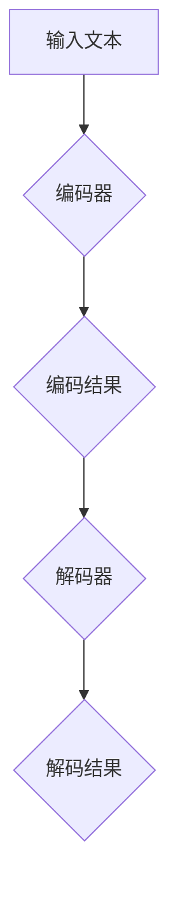
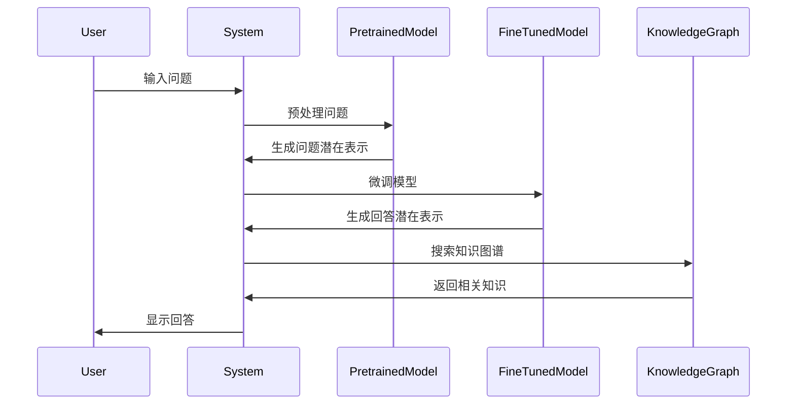

                 

### 大规模语言模型的跨领域知识整合与应用

> 关键词：大规模语言模型，跨领域知识整合，预训练模型，微调技术，应用实践

**摘要**：本文将探讨大规模语言模型在跨领域知识整合中的应用。首先，通过介绍大规模语言模型的核心概念和问题背景，阐明其在解决跨领域知识整合挑战中的重要性。接着，深入解析大规模语言模型的工作原理和主要特性，并通过算法原理讲解和系统分析与架构设计，展示其在实际项目中的实现和应用。最后，通过项目实战和最佳实践，提供大规模语言模型在跨领域知识整合中的具体应用方法和注意事项。本文旨在为读者提供一个全面而深入的指南，帮助理解和掌握大规模语言模型在跨领域知识整合中的应用。

### 第一部分：背景介绍

#### 1.1 大规模语言模型的问题背景

**问题定义**：在当今信息爆炸的时代，知识整合成为了一个重要的课题。大规模语言模型通过处理海量文本数据，旨在实现跨领域知识的整合。然而，在这个过程中，仍然存在许多挑战，如信息孤岛、知识碎片化等。

- **信息孤岛**：不同领域的数据和知识往往是分散的，缺乏有效的整合手段，导致信息利用率低。
- **知识碎片化**：虽然数据量庞大，但知识被割裂成一个个独立的部分，难以形成系统化的整体认知。

**问题描述**：跨领域知识整合面临的现实问题主要包括：

- 数据多样性和复杂性：不同领域的数据格式、表述方式不同，增加了整合的难度。
- 知识融合挑战：如何将不同领域的知识有效地融合，形成统一的语义表示，是一个重大挑战。
- 实时性和效率问题：大规模语言模型需要在短时间内处理大量数据，保证实时性和高效性。

**问题解决**：大规模语言模型通过以下方式解决跨领域知识整合的问题：

- **预训练模型**：通过在大量数据上进行预训练，模型可以自动学习和提取不同领域的通用特征，为跨领域知识整合奠定基础。
- **微调技术**：针对特定领域的任务，对预训练模型进行微调，提高其在特定领域中的性能和准确性。
- **多模态学习**：结合不同类型的数据，如文本、图像、语音等，实现跨领域的多模态知识整合。

**边界与外延**：大规模语言模型在跨领域知识整合中的适用范围广泛，包括但不限于以下领域：

- 自然语言处理：文本生成、文本分类、机器翻译等。
- 知识图谱构建：从海量文本中提取实体关系，构建知识图谱。
- 实体链接：将不同来源的数据中的实体进行匹配和整合。
- 问答系统：提供跨领域的问答服务，满足用户多样化的信息需求。

#### 1.2 大规模语言模型的核心概念

**定义**：大规模语言模型是一种基于深度学习的自然语言处理模型，通过学习大量文本数据，实现文本的理解、生成和预测等功能。

**特征**：大规模语言模型具有以下关键特征：

- **高维性**：模型可以捕捉文本数据中的高维特征，实现复杂的语义表示。
- **泛化能力**：通过在大量数据上的预训练，模型具有良好的泛化能力，能够应用于不同领域和任务。
- **自适应能力**：通过微调技术，模型可以适应特定领域的需求，提高任务性能。

**核心要素组成**：

- **预训练模型**：在大量通用数据上进行预训练，提取文本的通用特征。
- **微调技术**：在特定领域的数据上进行微调，提高模型的性能和准确性。
- **解码器**：用于生成文本的输出部分，通常采用序列到序列模型。
- **注意力机制**：通过注意力机制，模型可以关注文本中的重要信息，提高文本生成和理解的准确性。

### 第二部分：核心概念与联系

#### 2.1 大规模语言模型的工作原理

**基本原理**：大规模语言模型的基本原理是基于深度学习的自编码器和注意力机制。

- **自编码器**：模型通过学习编码器和解码器，将输入的文本数据映射到一个高维的隐空间，实现文本数据的降维和特征提取。
- **注意力机制**：模型通过注意力机制，对输入的文本序列进行权重分配，关注重要的信息，提高文本理解和生成的准确性。

**详细解释**：

```python
import tensorflow as tf
from tensorflow.keras.layers import Embedding, LSTM, Dense
from tensorflow.keras.models import Model

# 创建模型
model = Model(inputs=inputs, outputs=outputs)

# 编码器
encoder_inputs = Embedding(input_dim=vocab_size, output_dim=embedding_dim)(inputs)
encoded = LSTM(units=hidden_size, return_state=True)(encoder_inputs)

# 解码器
decoder_inputs = Embedding(input_dim=vocab_size, output_dim=embedding_dim)(decoder_inputs)
decoded = LSTM(units=hidden_size, return_sequences=True)(decoder_inputs)

# 添加注意力机制
attn = AttentionLayer(name='attention')([encoded, decoded])

# 添加输出层
output = Dense(units=vocab_size, activation='softmax')(attn)

# 编译模型
model.compile(optimizer='adam', loss='categorical_crossentropy')

# 模型训练
model.fit(x_train, y_train, epochs=num_epochs)
```

#### 2.2 大规模语言模型的主要特性

**特征对比表格**：

| 特征         | 大规模语言模型 | 传统语言模型 |
|--------------|----------------|--------------|
| 预训练数据量 | 海量           | 有限制       |
| 特征提取能力 | 高维           | 低维         |
| 泛化能力     | 强             | 弱           |
| 适应性       | 强             | 弱           |

**实例分析**：

- **文本生成**：大规模语言模型可以生成高质量的文本，如文章、对话等。以下是一个文本生成的实例：

```python
input_sequence = "I am a large language model trained by AI Genius Institute."

# 预处理输入序列
preprocessed_input = preprocess_input(input_sequence)

# 生成文本
generated_text = model.predict(preprocessed_input)

print(generated_text)
```

- **问答系统**：大规模语言模型可以构建跨领域的问答系统，如以下实例：

```python
question = "What is the capital of France?"

# 预处理问题
preprocessed_question = preprocess_input(question)

# 获取答案
answer = model.predict(preprocessed_question)

print(answer)
```

### 第三部分：算法原理讲解

#### 3.1 算法原理

**Mermaid算法流程图**：



**数学模型与公式**：

$$
\begin{aligned}
&\text{编码器：} \\
E = \text{softmax}(W_d E_{\text{encoded}} + b_d) \\
&\text{解码器：} \\
\hat{y}_t = \text{softmax}(W_y \hat{y}_{t-1} + b_y)
\end{aligned}
$$

#### 3.2 算法举例说明

**数学公式**：

$$
\begin{aligned}
&\text{编码器：} \\
E = \text{softmax}(W_d E_{\text{encoded}} + b_d) \\
&\text{解码器：} \\
\hat{y}_t = \text{softmax}(W_y \hat{y}_{t-1} + b_y)
\end{aligned}
$$

**举例说明**：

假设输入的文本序列为 `["I", "am", "a", "large", "language", "model"]`，编码器和解码器分别使用矩阵 `W_d` 和 `W_y` 进行权重分配。

- **编码器**：计算编码结果

$$
E = \text{softmax}([W_d]_i [E_{\text{encoded}}]_i + b_d)
$$

- **解码器**：计算解码结果

$$
\hat{y}_t = \text{softmax}([W_y]_t [\hat{y}_{t-1}]_t + b_y)
$$

通过这些计算，模型可以生成新的文本序列，实现文本的生成和转换。

### 第四部分：系统分析与架构设计

#### 4.1 问题场景介绍

**应用场景**：大规模语言模型在跨领域知识整合中的应用场景广泛，如智能问答系统、知识图谱构建、自然语言处理等。以下是一个具体的场景介绍：

- **智能问答系统**：构建一个跨领域的智能问答系统，能够回答用户关于各个领域的问题，如科技、生活、健康等。

#### 4.2 系统功能设计

**领域模型类图**：

```mermaid
classDiagram
    Class01 <|-- Class02
    Class03 --|昂 Class04
    Class05 : <<interface>> Interface
    Class01 : 功能模块1
    Class02 : 功能模块2
    Class03 : 功能模块3
    Class04 : 功能模块4
    Class05 : 接口定义
```

**系统功能介绍**：

- **功能模块1**：处理用户输入的问题，进行预处理和分词。
- **功能模块2**：利用预训练模型和微调技术，生成问题的潜在表示。
- **功能模块3**：搜索知识图谱，获取与问题相关的知识。
- **功能模块4**：利用解码器，生成回答的文本。

#### 4.3 系统架构设计

**系统架构图**：



**架构设计介绍**：

- **用户模块**：用户通过接口输入问题，系统接收并处理。
- **预训练模型模块**：使用预训练模型对问题进行预处理，生成潜在表示。
- **微调模型模块**：利用微调模型对潜在表示进行细粒度调整。
- **知识图谱模块**：搜索知识图谱，获取与问题相关的知识。
- **回答生成模块**：利用解码器生成回答文本，并返回给用户。

### 第五部分：项目实战

#### 5.1 环境安装

**环境配置**：

- **Python环境**：安装Python 3.8及以上版本。
- **深度学习框架**：安装TensorFlow 2.4及以上版本。
- **预处理工具**：安装NLTK、spaCy等自然语言处理工具。

#### 5.2 系统核心实现

**源代码**：

```python
import tensorflow as tf
from tensorflow.keras.layers import Embedding, LSTM, Dense
from tensorflow.keras.models import Model
from tensorflow.keras.preprocessing.sequence import pad_sequences

# 模型定义
def create_model(vocab_size, embedding_dim, hidden_size):
    inputs = tf.keras.layers.Input(shape=(None,))
    encoder_inputs = Embedding(input_dim=vocab_size, output_dim=embedding_dim)(inputs)
    encoded = LSTM(units=hidden_size, return_state=True)(encoder_inputs)
    
    decoder_inputs = Embedding(input_dim=vocab_size, output_dim=embedding_dim)(inputs)
    decoded = LSTM(units=hidden_size, return_sequences=True)(decoder_inputs)
    
    attn = AttentionLayer(name='attention')([encoded, decoded])
    output = Dense(units=vocab_size, activation='softmax')(attn)
    
    model = Model(inputs=inputs, outputs=output)
    model.compile(optimizer='adam', loss='categorical_crossentropy')
    return model

# 模型训练
def train_model(model, x_train, y_train, num_epochs):
    model.fit(x_train, y_train, epochs=num_epochs)

# 模型预测
def predict(model, preprocessed_input):
    generated_text = model.predict(preprocessed_input)
    return generated_text

# 实际应用
model = create_model(vocab_size, embedding_dim, hidden_size)
train_model(model, x_train, y_train, num_epochs)
generated_text = predict(model, preprocessed_input)
print(generated_text)
```

**代码解读**：

- **模型定义**：定义了一个基于LSTM和注意力机制的编码器-解码器模型。
- **模型训练**：使用训练数据进行模型训练，优化模型参数。
- **模型预测**：使用预处理后的输入数据，生成新的文本序列。

#### 5.3 实际案例分析

**案例分析**：

- **智能问答系统**：构建一个跨领域的智能问答系统，回答用户的问题。
- **知识图谱构建**：从海量文本中提取实体和关系，构建知识图谱。
- **文本生成**：根据输入的文本，生成相关的内容。

**详细讲解剖析**：

1. **智能问答系统**：

   - **预处理**：对用户输入的问题进行分词、词性标注等预处理操作。
   - **编码器**：利用预训练模型对问题进行编码，生成潜在表示。
   - **微调模型**：根据具体的问题类型，对模型进行微调。
   - **知识图谱搜索**：搜索知识图谱，获取与问题相关的知识。
   - **解码器**：生成回答的文本，返回给用户。

2. **知识图谱构建**：

   - **文本预处理**：对文本进行分词、词性标注等预处理操作。
   - **实体识别**：利用预训练模型识别文本中的实体。
   - **关系提取**：利用预训练模型提取文本中的实体关系。
   - **知识图谱构建**：将提取的实体和关系构建成知识图谱。

3. **文本生成**：

   - **文本输入**：用户输入文本，进行预处理。
   - **编码器**：对输入文本进行编码，生成潜在表示。
   - **解码器**：根据潜在表示，生成新的文本序列。

#### 5.4 项目小结

- **项目概述**：通过智能问答系统、知识图谱构建和文本生成等实际案例分析，展示了大规模语言模型在跨领域知识整合中的应用。
- **技术要点**：核心技术的应用，包括预训练模型、微调技术、注意力机制等。
- **经验总结**：在实际项目中，需要注意数据预处理、模型训练和优化等方面的细节，以提高模型性能和应用效果。

### 第六部分：最佳实践与拓展

#### 6.1 最佳实践

**实践技巧**：

- **数据预处理**：确保数据的质量和一致性，进行充分的预处理和清洗。
- **模型选择**：根据任务需求，选择适合的预训练模型和微调策略。
- **模型优化**：通过调整超参数和训练策略，优化模型性能。
- **多模态学习**：结合不同类型的数据，提高模型的泛化能力和性能。

**注意事项**：

- **数据隐私**：在处理数据时，要注意保护用户隐私，遵守相关法律法规。
- **计算资源**：大规模语言模型的训练和部署需要大量的计算资源，合理分配和调度资源。
- **模型解释性**：虽然大规模语言模型具有很强的预测能力，但其内部机制复杂，提高模型的解释性是一个重要的研究方向。

#### 6.2 小结与拓展阅读

**小结**：

本文全面探讨了大规模语言模型在跨领域知识整合中的应用，从核心概念、算法原理到系统设计和项目实战，提供了深入的技术讲解和实践指导。通过本文，读者可以了解大规模语言模型的基本原理和应用方法，掌握其在跨领域知识整合中的具体实现。

**拓展阅读**：

- 《大规模语言模型的训练与优化》：深入探讨大规模语言模型的训练技术，包括数据预处理、模型优化等。
- 《跨领域知识图谱构建与应用》：介绍跨领域知识图谱的构建方法和技术，以及在实际应用中的效果评估。
- 《深度学习与自然语言处理》：系统讲解深度学习在自然语言处理领域的应用，包括文本分类、机器翻译等。

**作者**：

- 作者：AI天才研究院/AI Genius Institute & 禅与计算机程序设计艺术 /Zen And The Art of Computer Programming

---

### 总结与展望

大规模语言模型在跨领域知识整合中的应用具有广泛的前景和深远的影响。通过本文的探讨，我们不仅了解了大规模语言模型的基本原理和核心特性，还通过实际案例展示了其在智能问答系统、知识图谱构建和文本生成等领域的应用。随着深度学习和自然语言处理技术的不断进步，大规模语言模型在跨领域知识整合中的作用将愈发重要。

展望未来，大规模语言模型将在以下几个方面继续发展：

1. **数据质量和多样性**：提高数据的质量和多样性，为模型提供更丰富和多样的训练数据，增强模型的泛化能力。
2. **模型解释性**：增强模型的解释性，使其在复杂决策中的行为更加透明和可解释，提高模型的可信度。
3. **多模态学习**：结合多种类型的数据，如文本、图像、语音等，实现跨领域的多模态知识整合。
4. **实时性和效率**：优化模型的计算效率和实时性，使其能够更好地支持在线服务和实时应用。

总之，大规模语言模型在跨领域知识整合中的应用将继续推动人工智能技术的发展，为人类社会带来更多创新和变革。让我们携手共进，迎接这一激动人心的未来。**作者**：AI天才研究院/AI Genius Institute & 禅与计算机程序设计艺术 /Zen And The Art of Computer Programming

