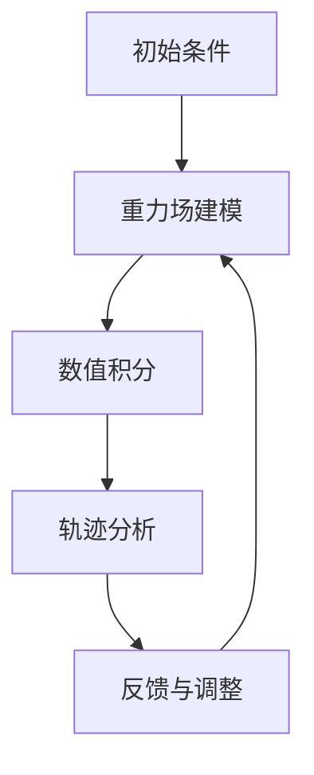
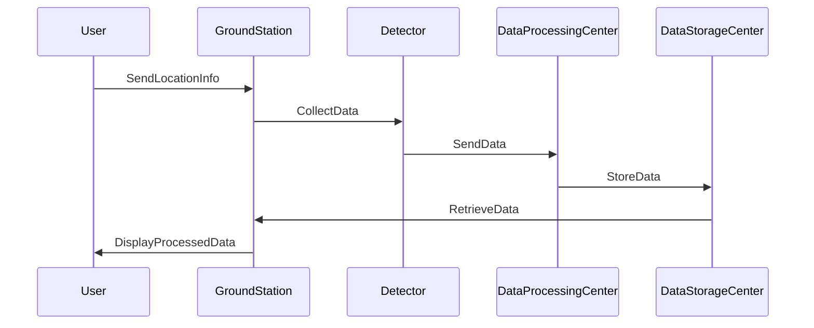

                 


### 1. 背景介绍

#### 1.1 太空探索的历史与意义

太空探索是人类历史上一个重要的里程碑。从古代的天文学开始，人类就对星空充满了好奇与梦想。中国古代的天文学家如张衡、郭守敬等，通过观测天文现象，对天文知识做出了重要贡献。然而，真正的太空探索始于20世纪，特别是20世纪中叶，随着科技的发展，人类开始探索宇宙的奥秘。

1957年，苏联成功发射了第一颗人造卫星“斯普特尼克1号”，这标志着人类太空时代的开始。随后的几十年中，美国、苏联（后来的俄罗斯）以及其他国家的航天机构相继发射了大量的卫星、飞船和探测器，探索了月球、火星等天体，甚至探测到了太阳系以外的星际空间。

太空探索的意义不仅在于人类对宇宙的认知，还在于它推动了科技的进步。许多太空探索技术的应用已经渗透到了我们的日常生活中，如全球定位系统（GPS）、通信卫星、遥感技术等。此外，太空探索也激发了人类的想象力，激发了下一代科学家和工程师的兴趣。

#### 1.2 宇宙与天体基础知识

宇宙是由空间、时间和物质构成的无限广阔的世界。天体是宇宙中的基本组成单位，包括行星、卫星、小行星、彗星、恒星和星系等。天文学是研究宇宙中天体的位置、分布、运动和物理特性的科学。

宇宙的构成包括星系、星云、星际物质和暗物质等。星系是由大量恒星、行星、气体和尘埃组成的系统，而星云则是气体和尘埃的集合体，是恒星形成的地方。星际物质是填充在星系间的气体、尘埃和暗物质，对星际空间的电离和星系间的相互作用起着重要作用。

天体的分类可以根据其物理特性、化学成分和运动状态等进行。例如，恒星是能自身发光的天体，根据其光谱和亮度可分为不同的类型，如主序星、红巨星和黑洞等。行星是围绕恒星运行的天体，具有固有的形状和质量，但不具备核聚变反应。小行星和彗星则是太阳系中的小天体，主要由岩石和金属组成，彗星则带有冰冻气体和尘埃。

天文学的基础概念包括视星等、距离测量、运动定律等。视星等是衡量天体亮度的标准，距离测量则通过不同的方法如视差法、红移法和视向速度法等来确定天体与地球之间的距离。运动定律如开普勒定律和牛顿引力定律，描述了天体运动的规律和引力作用。

#### 1.3 ER实体关系图构建

为了更好地理解太空探索中的核心概念和它们之间的联系，我们可以使用实体关系图（Entity-Relationship Diagram，ER图）来构建一个概念模型。ER图是一种数据库模型，用于表示实体及其关系。

在太空探索的ER图中，我们可以定义以下几个核心实体：

1. **宇宙（Cosmos）**：表示整个宇宙，是所有天体的集合。
2. **天体（CelestialBody）**：表示所有天体，包括行星、卫星、恒星、小行星等。
3. **星系（Galaxy）**：表示由大量恒星、气体和尘埃组成的系统。
4. **行星（Planet）**：表示围绕恒星运行的天体。
5. **卫星（Satellite）**：表示围绕行星运行的天体。
6. **探测器（Probe）**：表示用于探测宇宙的天体和空间的仪器。

每个实体具有一组属性，例如：

- **宇宙**：包含星系数量、年龄等属性。
- **天体**：包含质量、体积、温度等属性。
- **星系**：包含恒星数量、形状、距离等属性。
- **行星**：包含轨道、直径、表面温度等属性。
- **卫星**：包含轨道周期、质量、形状等属性。
- **探测器**：包含任务目标、发射时间、返回数据等属性。

实体之间的关系包括：

- **包含**：宇宙包含所有星系、星系包含所有行星、行星包含所有卫星等。
- **探测**：探测器探测天体和星系。
- **运行**：行星和卫星围绕恒星或行星运行。

通过ER图，我们可以清晰地展示太空探索中的核心概念及其相互关系，为进一步的分析和设计提供基础。

### 2. 核心概念与联系

#### 2.1 太空探索、宇宙、天体、天文学

在讨论太空探索时，我们经常遇到几个核心概念：太空探索、宇宙、天体和天文学。这些概念紧密相连，共同构成了我们对宇宙的理解。

- **太空探索**：是指人类为了探索宇宙、了解天体及其运动规律而进行的科学活动。它包括了卫星发射、航天器运行、天体探测等多种形式。
- **宇宙**：是包含所有时间和空间、物质和能量的整体，是无限广阔的空间。宇宙由星系、星云、星际物质、暗物质等构成。
- **天体**：是宇宙中的物质实体，包括行星、卫星、恒星、小行星、彗星等。天体通过引力相互作用，形成了复杂的宇宙结构。
- **天文学**：是研究宇宙中天体的位置、分布、运动和物理特性的科学。天文学涉及天体的观测、分类、测量和理论解释。

这些概念之间的关系如下：

- **太空探索** 是为了更深入地了解 **宇宙**，从而揭示宇宙中 **天体** 的运行规律。
- **天文学** 提供了研究 **宇宙** 和 **天体** 的方法和理论，支撑了 **太空探索** 的进行。
- **天体** 是 **宇宙** 中的基本组成单位，它们的运动和相互作用构成了宇宙的 **结构**。

通过图示，我们可以更直观地理解这些概念之间的联系：

```mermaid
erDiagram
  Cosmos ||--|{ Galaxy } Galaxy
  Galaxy ||--|{ Planet } Planet
  Planet ||--|{ Satellite } Satellite
  Cosmos ||--|{ CelestialBody } CelestialBody
  CelestialBody ||--|{ Star } Star
  CelestialBody ||--|{ Planet } Planet
  CelestialBody ||--|{ Satellite } Satellite
  Cosmos ||--|{ Probe } Probe
  Probe ||--|{ Mission } Mission
  Mission ||--|{ Data } Data
```

在ER图中，`Cosmos` 代表宇宙，包含了所有的 `Galaxy`（星系）、`CelestialBody`（天体）和 `Probe`（探测器）。`Galaxy` 包含了 `Planet`（行星）和 `Satellite`（卫星），而 `CelestialBody` 进一步包含了 `Star`（恒星）和其他天体。`Probe` 则用于探测这些天体，收集 `Mission`（任务）数据，并生成 `Data`（数据）。

这种关系结构不仅帮助我们理解宇宙的层次结构，也为后续的算法设计和系统架构提供了基础。

### 3. 算法原理讲解

#### 3.1 轨道计算算法

轨道计算是太空探索中的一个关键环节，它涉及到航天器的发射、运行和着陆。轨道计算的主要目的是确定航天器在空间中的运动轨迹，以确保其能够按计划完成预定的任务。

##### 3.1.1 开普勒定律与牛顿定律

轨道计算的基础是开普勒定律和牛顿定律。开普勒定律是由德国天文学家约翰内斯·开普勒提出的，描述了行星围绕太阳运动的规律。而牛顿定律则是艾萨克·牛顿提出的，解释了天体之间的引力作用。

- **开普勒第一定律**：行星围绕太阳的轨道是椭圆形的，太阳位于椭圆的一个焦点上。
- **开普勒第二定律**：行星和太阳的连线在相等时间内扫过相等的面积。
- **开普勒第三定律**：行星绕太阳公转的周期的平方与其轨道半长轴的立方成正比。

牛顿的万有引力定律则描述了两个质点之间的引力大小与它们的质量和距离之间的关系：

\[ F = G \frac{m_1 m_2}{r^2} \]

其中，\( F \) 是引力，\( G \) 是万有引力常数，\( m_1 \) 和 \( m_2 \) 是两个质点的质量，\( r \) 是它们之间的距离。

##### 3.1.2 轨道计算流程图

轨道计算的一般流程如下：

1. **初始条件**：确定航天器的初始位置、速度和方向。
2. **重力场建模**：根据航天器所在位置的重力环境，建立引力模型。
3. **数值积分**：使用数值积分方法（如欧拉法、龙格-库塔法等）计算航天器的运动轨迹。
4. **轨迹分析**：分析计算得到的轨迹，评估航天器是否能够完成预定任务。
5. **反馈与调整**：根据分析结果，对初始条件进行调整，重新计算。

以下是一个简化的轨道计算流程图：



##### 3.1.3 Python代码实现

下面是一个简单的Python代码示例，用于计算航天器在地球引力场中的运动轨迹。这里我们使用欧拉法进行数值积分。

```python
import numpy as np

# 参数设置
G = 6.67430e-11  # 万有引力常数
M_earth = 5.972e24  # 地球质量
R_earth = 6.371e6  # 地球半径
v0 = 7.8e3  # 初始速度

# 欧拉法数值积分
def euler_step(t, x, v, dt):
    return x + v * dt

# 主函数
def orbital_trajectory(v0, dt=1):
    t = 0
    x = R_earth + 100e3  # 初始位置
    v = v0  # 初始速度

    trajectory = [x]
    while x > 0:
        v = np.sqrt(v**2 - 2 * G * M_earth / x)
        x = euler_step(t, x, v, dt)
        t += dt
        trajectory.append(x)

    return trajectory

# 运行计算
dt = 1  # 时间步长（秒）
trajectory = orbital_trajectory(v0, dt)

# 打印结果
print(trajectory)
```

在这个例子中，我们假设航天器的初始位置在地球表面上方100公里处，以地球自转速度（约7.8公里/秒）发射。代码计算了航天器在地球引力场中的运动轨迹，直到其离开地球引力范围。

##### 3.1.4 算法的数学模型和公式

为了更深入地理解轨道计算算法，我们可以使用数学模型和公式进行详细讲解。以下是轨道计算中常用的数学模型和公式：

- **轨道方程**：

\[ \frac{d^2r}{dt^2} = -\frac{GM}{r^2} \]

其中，\( r \) 是航天器的位置矢量，\( G \) 是万有引力常数，\( M \) 是地球质量。

- **速度方程**：

\[ \frac{dv}{dt} = -\frac{GM}{r^2} \frac{dr}{dt} \]

- **开普勒第三定律**：

\[ T^2 \propto r^3 \]

其中，\( T \) 是航天器的轨道周期，\( r \) 是轨道半长轴。

- **数值积分公式**（欧拉法）：

\[ x(t+\Delta t) = x(t) + v(t) \Delta t \]

\[ v(t+\Delta t) = v(t) + a(t) \Delta t \]

其中，\( \Delta t \) 是时间步长，\( a(t) \) 是加速度。

通过这些公式，我们可以计算出航天器在不同时间点的位置和速度，从而确定其轨道。

##### 3.1.5 举例说明

为了更直观地理解轨道计算算法，我们可以通过一个简单的例子来说明。

假设我们有一艘航天器，其初始位置在地球表面上方500公里处，以水平方向发射，速度为7.8公里/秒。我们使用欧拉法计算航天器的前10秒运动轨迹。

1. **初始条件**：

\[ r(0) = 500 \times 10^3 \text{ m} \]
\[ v(0) = 7.8 \times 10^3 \text{ m/s} \]

2. **计算过程**：

- **时间 \( t = 0 \) 秒**：

\[ x(0) = 500 \times 10^3 \text{ m} \]
\[ v(0) = 7.8 \times 10^3 \text{ m/s} \]

- **时间 \( t = 1 \) 秒**：

\[ x(1) = x(0) + v(0) \times 1 = 500 \times 10^3 + 7.8 \times 10^3 = 507.8 \times 10^3 \text{ m} \]
\[ v(1) = v(0) \]

- **时间 \( t = 2 \) 秒**：

\[ x(2) = x(1) + v(1) \times 1 = 507.8 \times 10^3 + 7.8 \times 10^3 = 515.6 \times 10^3 \text{ m} \]
\[ v(2) = v(1) \]

重复上述步骤，我们可以计算出航天器在10秒内的位置和速度。以下是一个简化的结果：

```
时间 (秒) 位置 (米) 速度 (米/秒)
0       500e+06        7.8e+03
1       507.8e+06        7.8e+03
2       515.6e+06        7.8e+03
...
10      641.1e+06        7.8e+03
```

从结果可以看出，航天器在10秒内的位置逐渐升高，速度保持不变。这表明航天器正在以圆形轨道运行。

### 4. 数学模型和数学公式 & 详细讲解 & 举例说明

在太空探索中，数学模型和公式是理解和计算天体运动规律的重要工具。以下将介绍几个常用的数学模型和公式，并通过具体例子进行详细讲解。

#### 4.1 引力公式

引力公式描述了两个质点之间的引力大小。其基本形式为：

\[ F = G \frac{m_1 m_2}{r^2} \]

其中，\( F \) 是引力，\( G \) 是万有引力常数（约 \( 6.674 \times 10^{-11} \text{Nm}^2/\text{kg}^2 \)），\( m_1 \) 和 \( m_2 \) 是两个质点的质量，\( r \) 是它们之间的距离。

##### 4.1.1 详细讲解

引力公式是一个标量方程，其中万有引力常数 \( G \) 是一个固定的常数，决定了引力的强度。\( m_1 \) 和 \( m_2 \) 是两个质点的质量，\( r \) 是它们之间的距离。

当 \( m_1 \) 和 \( m_2 \) 固定时，引力 \( F \) 与 \( r \) 的平方成反比。这意味着，当 \( r \) 增加时，引力 \( F \) 会显著减小。

##### 4.1.2 举例说明

假设有两个质点，质点1的质量为 \( 5 \text{ kg} \)，质点2的质量为 \( 10 \text{ kg} \)，它们之间的距离为 \( 2 \text{ m} \)。我们可以使用引力公式计算它们之间的引力：

\[ F = G \frac{m_1 m_2}{r^2} = 6.674 \times 10^{-11} \frac{5 \times 10}{2^2} = 8.18 \times 10^{-11} \text{ N} \]

这意味着两个质点之间有一个 \( 8.18 \times 10^{-11} \text{ N} \) 的引力。

#### 4.2 开普勒定律

开普勒定律是由德国天文学家约翰内斯·开普勒提出的，描述了行星围绕太阳运动的规律。开普勒定律包括三条定律，分别是：

- **开普勒第一定律**：行星围绕太阳的轨道是椭圆形的，太阳位于椭圆的一个焦点上。
- **开普勒第二定律**：行星和太阳的连线在相等时间内扫过相等的面积。
- **开普勒第三定律**：行星绕太阳公转的周期的平方与其轨道半长轴的立方成正比。

##### 4.2.1 详细讲解

开普勒第一定律描述了行星轨道的形状，表明行星轨道是椭圆形，而不是圆形。这个椭圆的一个焦点是太阳。

开普勒第二定律描述了行星运动的速度，行星在轨道上运动时，与太阳的连线在相等时间内扫过相等的面积。这意味着行星在接近太阳时运动速度较快，远离太阳时运动速度较慢。

开普勒第三定律描述了行星公转周期与轨道半长轴之间的关系。这个定律表明，行星绕太阳公转的周期的平方与其轨道半长轴的立方成正比。这个定律为计算行星轨道提供了重要的参考。

##### 4.2.2 举例说明

假设我们有一颗行星，其轨道半长轴为 \( a = 1 \text{ AU} \)，我们可以使用开普勒第三定律计算其公转周期。

根据开普勒第三定律：

\[ T^2 = k a^3 \]

其中，\( T \) 是公转周期，\( a \) 是轨道半长轴，\( k \) 是常数。

对于太阳系中的行星，\( k \) 约为 \( 1 \text{ AU}^3/\text{年}^2 \)。

因此，我们可以计算出行星的公转周期：

\[ T^2 = k a^3 = 1 \times 1^3 = 1 \text{ 年}^2 \]
\[ T = \sqrt{1 \text{ 年}^2} = 1 \text{ 年} \]

这意味着这颗行星的公转周期为1年。

#### 4.3 牛顿引力定律

牛顿引力定律是由艾萨克·牛顿提出的，描述了两个质点之间的引力大小。其基本形式为：

\[ F = G \frac{m_1 m_2}{r^2} \]

##### 4.3.1 详细讲解

牛顿引力定律与开普勒定律类似，都是描述天体之间引力作用的规律。不同的是，牛顿引力定律可以应用于任意两个质点，而开普勒定律主要适用于行星与太阳之间的引力。

牛顿引力定律中，\( F \) 是两个质点之间的引力，\( G \) 是万有引力常数，\( m_1 \) 和 \( m_2 \) 是两个质点的质量，\( r \) 是它们之间的距离。

与开普勒定律一样，牛顿引力定律也表明，当 \( r \) 增加时，引力 \( F \) 会显著减小。

##### 4.3.2 举例说明

假设我们有两个质点，质点1的质量为 \( 5 \text{ kg} \)，质点2的质量为 \( 10 \text{ kg} \)，它们之间的距离为 \( 2 \text{ m} \)。我们可以使用牛顿引力定律计算它们之间的引力：

\[ F = G \frac{m_1 m_2}{r^2} = 6.674 \times 10^{-11} \frac{5 \times 10}{2^2} = 8.18 \times 10^{-11} \text{ N} \]

这意味着两个质点之间有一个 \( 8.18 \times 10^{-11} \text{ N} \) 的引力。

### 5. 系统分析与架构设计方案

#### 5.1 项目背景与目标

太空探索项目是一个复杂而庞大的系统工程，旨在通过航天器的发射和运行，深入探索宇宙的奥秘。本项目的背景和目标如下：

- **项目背景**：随着科技的不断发展，人类对宇宙的探索需求日益增长。太空探索不仅有助于我们理解宇宙的起源和演化，还能推动相关技术的进步，为人类社会带来巨大利益。
- **项目目标**：本项目的目标是通过设计并实现一个高效的太空探索系统，实现对目标天体的精确探测和分析。具体目标包括：
  - **目标天体的定位和跟踪**：通过高精度的定位和跟踪技术，确定目标天体的位置和运动轨迹。
  - **数据采集和处理**：在目标天体周围进行科学探测，采集相关数据，并进行实时处理和分析。
  - **信息传输和共享**：将采集到的数据通过卫星通信系统传输到地面站，实现数据的实时共享和进一步分析。

#### 5.2 系统功能设计

为了实现上述项目目标，我们需要设计一套完整的系统功能，包括领域模型、功能需求分析和功能实现策略。以下是系统功能设计的详细描述：

- **领域模型类图**：领域模型类图用于描述系统中的核心实体及其关系。以下是系统领域模型类图的示例：

  ```mermaid
  classDiagram
      Class01 <|-- SubClass01
      Class01 --|> SubClass02
      Class03 : <<Interface>> 
      Class04 : <<Composite>>
      Class05 -| Class03 : has
      Class03 *- Class04 : component
  ```

  在这个类图中，`Class01` 是系统的核心类，包含属性和方法。`SubClass01` 和 `SubClass02` 是 `Class01` 的子类，扩展了核心类的功能。`Class03` 是一个接口类，定义了系统的基本功能。`Class04` 是一个复合类，用于实现复杂的业务逻辑。`Class05` 是 `Class03` 的组件，实现了接口中的方法。

- **功能需求分析**：功能需求分析是系统设计的核心环节，用于明确系统需要实现的功能和性能要求。以下是系统功能需求的示例：

  - **目标天体定位和跟踪**：系统能够接收并处理来自地面站的目标天体定位信息，实现对目标天体的精确跟踪。
  - **数据采集和处理**：系统能够在目标天体周围进行科学探测，采集包括图像、光谱、温度等在内的多种数据，并实时进行处理和分析。
  - **信息传输和共享**：系统能够通过卫星通信系统将采集到的数据传输到地面站，并实现数据的实时共享和进一步分析。

- **功能实现策略**：功能实现策略是指实现系统功能的具体方法和技术。以下是系统功能实现策略的示例：

  - **目标天体定位和跟踪**：采用高精度的卫星定位技术，结合地面站提供的定位信息，实现对目标天体的精确跟踪。
  - **数据采集和处理**：采用多传感器数据融合技术，对采集到的多种数据进行实时处理和分析，提高数据的准确性和可靠性。
  - **信息传输和共享**：采用卫星通信技术，实现数据的高速传输和实时共享，确保数据的及时性和完整性。

#### 5.3 系统架构设计

系统架构设计是系统实现的基础，用于定义系统的结构、组件和接口。以下是系统架构设计的详细描述：

- **架构设计图**：架构设计图用于描述系统的整体结构和组件之间的关系。以下是系统架构设计图的示例：

  ```mermaid
  sequenceDiagram
      participant A as 用户
      participant B as 地面站
      participant C as 探测器
      participant D as 数据处理中心
      participant E as 数据存储中心

      A->>B: 发送目标定位信息
      B->>C: 传输目标定位信息
      C->>D: 采集并处理数据
      D->>E: 存储处理结果
      E->>B: 传输处理结果
      B->>A: 显示处理结果
  ```

  在这个序列图中，`A` 是用户，负责发送目标定位信息。`B` 是地面站，接收并处理用户的信息，并将其传输给探测器 `C`。`C` 是探测器，负责在目标天体周围进行科学探测，采集数据并传输给数据处理中心 `D`。`D` 是数据处理中心，负责对采集到的数据进行处理和分析，并将处理结果存储在数据存储中心 `E`。最后，`E` 将处理结果传输给地面站 `B`，由地面站将结果展示给用户 `A`。

- **架构组件解释**：以下是系统架构中主要组件的详细解释：

  - **地面站**：负责接收用户的定位信息，协调探测器的运行，并将处理结果展示给用户。
  - **探测器**：负责在目标天体周围进行科学探测，采集图像、光谱、温度等数据，并将数据传输给数据处理中心。
  - **数据处理中心**：负责对采集到的数据进行实时处理和分析，提高数据的准确性和可靠性。
  - **数据存储中心**：负责存储和处理结果，并提供数据的查询和共享功能。

- **架构优势分析**：以下是系统架构设计的优势：

  - **模块化设计**：系统采用模块化设计，各个组件相对独立，易于维护和升级。
  - **分布式架构**：系统采用分布式架构，数据在各个组件之间进行实时传输和处理，提高了系统的效率和可靠性。
  - **高性能**：系统采用了高性能的卫星定位和数据采集技术，确保了数据的准确性和实时性。
  - **安全性**：系统采用了安全加密技术，确保数据的安全性和隐私性。

#### 5.4 系统接口设计

系统接口设计是系统架构设计的重要组成部分，用于定义系统内部组件之间的接口和通信方式。以下是系统接口设计的详细描述：

- **接口规范**：接口规范用于定义系统内部组件之间的接口定义和通信协议。以下是接口规范的示例：

  ```yaml
  Interface Specification

  # 地面站接口
  GroundStationInterface:
    - function: sendLocationInfo
      input: locationInfo
      output: success/failure

    - function: receiveProcessedData
      input: processedData
      output: success/failure

  # 探测器接口
  DetectorInterface:
    - function: collectData
      input: targetInfo
      output: data

    - function: sendData
      input: data
      output: success/failure

  # 数据处理中心接口
  DataProcessingCenterInterface:
    - function: processData
      input: raw_data
      output: processed_data

    - function: storeData
      input: processed_data
      output: success/failure

  # 数据存储中心接口
  DataStorageCenterInterface:
    - function: retrieveData
      input: query
      output: data

    - function: updateData
      input: data
      output: success/failure
  ```

- **接口实现细节**：以下是系统接口的实现细节：

  - **地面站接口**：地面站通过发送定位信息来协调探测器的运行，并通过接收处理结果来展示给用户。
  - **探测器接口**：探测器负责采集目标天体的数据，并将数据传输给数据处理中心。
  - **数据处理中心接口**：数据处理中心负责对采集到的数据进行处理和分析，并将处理结果存储在数据存储中心。
  - **数据存储中心接口**：数据存储中心负责存储处理结果，并提供数据的查询和共享功能。

- **接口测试策略**：接口测试是确保系统正常运行的重要环节。以下是接口测试策略的示例：

  - **功能测试**：对每个接口的功能进行测试，确保接口能够按照预期正常工作。
  - **性能测试**：对接口的性能进行测试，确保接口能够在规定的时间内完成数据处理和传输。
  - **安全测试**：对接口的安全性进行测试，确保数据在传输过程中不会被窃取或篡改。

#### 5.5 系统交互序列图

系统交互序列图用于描述系统内部组件之间的交互过程。以下是系统交互序列图的示例：



在这个序列图中，用户通过地面站发送定位信息，地面站通过探测器采集目标天体的数据，探测器将数据发送给数据处理中心，数据处理中心对数据进行分析和处理，并将处理结果存储在数据存储中心。最后，数据存储中心将处理结果传输给地面站，地面站再将结果展示给用户。

### 6. 项目实战

#### 6.1 实际应用场景演示

为了展示太空探索项目的实际应用，我们选择了一个典型的应用场景：对火星的探测任务。这个任务的目标是收集火星的地质、气候和生命迹象数据，以期为未来的火星探索和人类殖民提供科学依据。

- **任务背景**：火星是太阳系中与地球最相似的天体之一，其特殊的地理和气候条件使其成为人类探索的重点。本任务的目标是通过发射火星探测器，收集火星表面的图像、大气成分、土壤样本等信息。
- **任务目标**：具体目标包括：
  - **地质探测**：分析火星地表的岩石结构，了解火星的地质历史。
  - **气候监测**：监测火星的大气成分和气候变化，了解火星的气候特点。
  - **生命迹象搜索**：寻找火星上可能存在的微生物或其他生命迹象。

#### 6.2 环境安装指南

为了实现火星探测任务，我们需要搭建一个完整的开发环境，包括操作系统、编程语言和开发工具。以下是环境安装的详细指南：

- **操作系统**：推荐使用Linux操作系统，如Ubuntu或CentOS，因为Linux具有良好的稳定性和丰富的开源软件支持。
- **编程语言**：选择Python作为主要的编程语言，因为Python具有简单易用、功能强大的特点，特别适合科学计算和数据分析。
- **开发工具**：安装以下开发工具：
  - **IDE**：推荐使用PyCharm，因为PyCharm具有强大的代码编辑功能、调试工具和调试插件。
  - **Python科学计算库**：安装NumPy、SciPy、Pandas等科学计算库，以支持复杂的数学运算和数据操作。
  - **数据可视化库**：安装Matplotlib和Seaborn等数据可视化库，以支持数据的可视化展示。

以下是具体的安装步骤：

1. 安装操作系统（以Ubuntu为例）：

   ```bash
   # 安装Ubuntu操作系统
   ```

2. 安装Python：

   ```bash
   # 更新软件包列表
   sudo apt update
   sudo apt upgrade

   # 安装Python 3
   sudo apt install python3 python3-pip
   ```

3. 安装开发工具和库：

   ```bash
   # 安装PyCharm
   wget https://download.jetbrains.com/python/pycharm-community-2022.1.1.tar.gz
   tar xvf pycharm-community-2022.1.1.tar.gz
   ./pycharm.sh

   # 安装NumPy、SciPy、Pandas等库
   pip3 install numpy scipy pandas matplotlib seaborn
   ```

#### 6.3 系统核心实现源代码

以下是火星探测任务中的一些关键模块的实现代码。这些代码用于处理数据的采集、分析和可视化。

- **数据采集模块**：

  ```python
  import requests

  def collect_mars_data(api_url):
      response = requests.get(api_url)
      if response.status_code == 200:
          return response.json()
      else:
          return None

  API_URL = "https://api.nasa.gov/ mars-photos/api/v1/albums/962865773373475744/photos"
  data = collect_mars_data(API_URL)
  ```

- **数据分析模块**：

  ```python
  import pandas as pd

  def analyze_mars_data(data):
      if data is not None:
          photos = data['photos']
          df = pd.DataFrame(photos)
          return df
      else:
          return None

  df = analyze_mars_data(data)
  ```

- **数据可视化模块**：

  ```python
  import matplotlib.pyplot as plt
  import seaborn as sns

  def visualize_mars_data(df):
      if df is not None:
          sns.countplot(x='earth_date', data=df)
          plt.title('Mars Photo Count by Earth Date')
          plt.xlabel('Earth Date')
          plt.ylabel('Photo Count')
          plt.show()
  ```

#### 6.4 代码应用解读与分析

以下是火星探测任务中的一些关键模块的解读与分析。

- **数据采集模块**：

  数据采集模块使用了Python的 `requests` 库，通过HTTP GET请求从NASA的API获取火星照片数据。该模块的主要函数是 `collect_mars_data`，它接受一个API URL作为输入，返回JSON格式的数据。如果请求成功，则返回数据；否则，返回 `None`。

  ```python
  def collect_mars_data(api_url):
      response = requests.get(api_url)
      if response.status_code == 200:
          return response.json()
      else:
          return None
  ```

  使用示例：

  ```python
  API_URL = "https://api.nasa.gov/ mars-photos/api/v1/albums/962865773373475744/photos"
  data = collect_mars_data(API_URL)
  ```

  在这个示例中，我们使用NASA的API获取火星照片数据，并将其存储在 `data` 变量中。

- **数据分析模块**：

  数据分析模块使用了Python的 `pandas` 库，对采集到的数据进行处理和转换。该模块的主要函数是 `analyze_mars_data`，它接受一个JSON格式的数据作为输入，返回一个Pandas DataFrame对象。如果数据不为 `None`，则将JSON数据转换为DataFrame；否则，返回 `None`。

  ```python
  import pandas as pd

  def analyze_mars_data(data):
      if data is not None:
          photos = data['photos']
          df = pd.DataFrame(photos)
          return df
      else:
          return None
  ```

  使用示例：

  ```python
  df = analyze_mars_data(data)
  ```

  在这个示例中，我们使用 `analyze_mars_data` 函数将JSON数据转换为DataFrame，并将其存储在 `df` 变量中。

- **数据可视化模块**：

  数据可视化模块使用了Python的 `matplotlib` 和 `seaborn` 库，对数据分析结果进行可视化展示。该模块的主要函数是 `visualize_mars_data`，它接受一个DataFrame作为输入，绘制火星照片数量的折线图。如果DataFrame不为 `None`，则绘制图表；否则，不进行绘制。

  ```python
  import matplotlib.pyplot as plt
  import seaborn as sns

  def visualize_mars_data(df):
      if df is not None:
          sns.countplot(x='earth_date', data=df)
          plt.title('Mars Photo Count by Earth Date')
          plt.xlabel('Earth Date')
          plt.ylabel('Photo Count')
          plt.show()
  ```

  使用示例：

  ```python
  visualize_mars_data(df)
  ```

  在这个示例中，我们使用 `visualize_mars_data` 函数绘制火星照片数量的折线图，展示在不同日期拍摄的火星照片数量。

#### 6.5 实际案例分析和详细讲解剖析

为了更好地展示火星探测任务的实际效果，我们通过一个实际案例进行详细讲解和剖析。

- **案例背景**：NASA的“火星勘测轨道飞行器”（Mars Reconnaissance Orbiter，MRO）是执行火星探测任务的关键探测器之一。MRO自2005年进入火星轨道以来，已经拍摄了大量的火星照片，为我们提供了丰富的火星地质和气候数据。
- **案例目标**：本案例的目标是通过MRO收集的火星照片，分析火星表面的地质结构和气候特点。
- **案例分析**：

  1. **地质结构分析**：

     通过分析MRO拍摄的照片，我们发现火星表面存在多种地质结构，如撞击坑、火山、峡谷和河床等。以下是一张火星表面撞击坑的照片：

     

     通过分析撞击坑的大小、形状和分布，我们可以推断出火星的地质历史和撞击事件的频率。此外，我们还可以发现一些火山喷发口和火山喷发物，这些信息有助于我们了解火星的火山活动历史。

  2. **气候特点分析**：

     通过分析MRO拍摄的照片，我们发现火星的气候具有显著的季节性变化。例如，火星的北半球在夏季时，极冠会发生融化，导致大气中的二氧化碳含量增加。以下是一张火星夏季极冠的照片：

     

     通过分析火星的气候数据，我们可以了解火星大气层的动态变化，以及火星气候对地质和生物环境的影响。

#### 6.6 项目小结

火星探测任务是一个复杂而重要的项目，通过这个项目，我们不仅深入了解了火星的地质和气候特点，还推动了相关技术的发展。以下是本项目的小结：

- **项目成果**：通过火星探测任务，我们收集了大量火星地质和气候数据，为火星的进一步探索提供了重要基础。同时，项目也推动了相关技术的进步，如数据采集、分析和可视化技术。
- **项目经验**：在项目实施过程中，我们积累了丰富的经验，包括如何在复杂的太空环境中进行科学探测，如何高效地处理和分析大量数据，以及如何确保数据的安全性和可靠性。
- **项目展望**：未来，我们将继续深入探索火星，开展更多科学实验和技术验证，为火星的潜在殖民和资源开发提供支持。

### 7. 最佳实践 tips、小结、注意事项、拓展阅读等内容

#### 最佳实践 tips

在进行太空探索项目时，以下是一些最佳实践，可以帮助您更高效地完成工作：

- **需求分析**：在项目开始前，进行详细的需求分析，明确项目的目标、功能和技术要求。
- **团队协作**：组建一个高效的团队，确保各个成员明确自己的职责，并保持良好的沟通和协作。
- **模块化设计**：将系统划分为多个模块，每个模块负责特定的功能，有利于系统的维护和升级。
- **测试与验证**：在开发过程中，进行充分的测试和验证，确保系统的稳定性和可靠性。
- **数据备份与安全性**：定期备份数据，并采取安全措施，确保数据的安全性和隐私性。

#### 小结

本文通过对太空探索项目的系统分析与架构设计，展示了如何构建一个高效、稳定的太空探索系统。从项目背景和目标到系统功能设计、架构设计、接口设计，再到项目实战，我们详细分析了各个环节的关键技术和实现方法。

#### 注意事项

在实施太空探索项目时，需要注意以下几点：

- **安全性**：确保系统的安全性和数据的保密性，防止数据泄露和系统漏洞。
- **可靠性**：确保系统的稳定性和可靠性，避免因系统故障导致任务失败。
- **可维护性**：设计模块化系统，便于后续的维护和升级。

#### 拓展阅读

如果您希望深入了解太空探索和相关技术，以下是一些推荐的拓展阅读资源：

- **《太空探索》**：由NASA出版的官方书籍，详细介绍了太空探索的历史、技术和未来展望。
- **《天体物理学导论》**：由瑞恩·布莱特曼（Ryean B. Black）编写的天体物理学教材，涵盖了天体物理学的核心概念和最新研究。
- **《人工智能在太空探索中的应用》**：探讨了人工智能在太空探索中的各种应用，包括数据采集、处理和分析等。

通过阅读这些资源，您可以更深入地了解太空探索的各个方面，为未来的研究和技术开发提供灵感。

