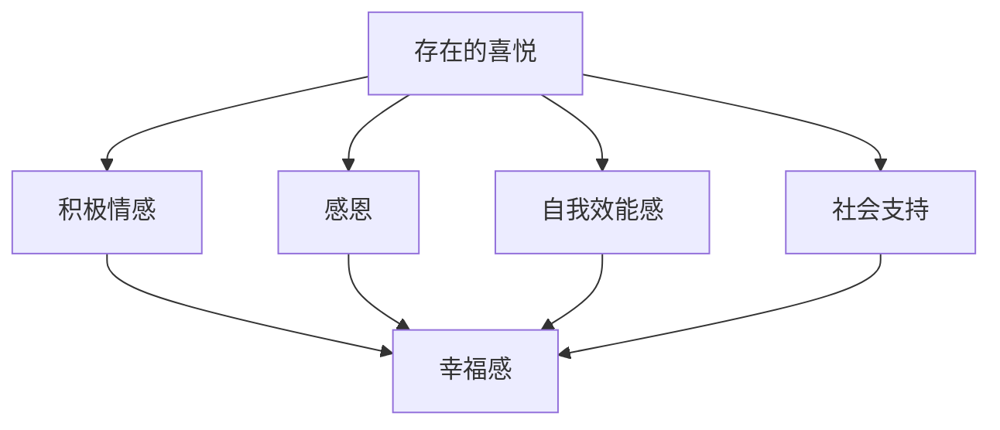

                 

# 《存在的喜悦：重新发现生活中的美好》

## 关键词

- 幸福感
- 生活质量
- 心理学
- 社交互动
- 健康生活方式

## 摘要

在忙碌的生活节奏中，我们往往忽略了生活中的小确幸。本书旨在引导读者重新发现并体验存在的喜悦，通过探讨幸福感的来源和积极的生活方式，帮助读者提升生活质量，找到内心的宁静与满足。通过一步步的逻辑分析和实例讲解，本书旨在成为读者重新审视生活的指南。

## 引言

在现代社会中，人们的生活节奏日益加快，工作压力和生活压力也随之增加。这种快节奏的生活方式使得很多人感到疲惫和焦虑，幸福感逐渐减弱。因此，重新发现生活中的美好变得尤为重要。这本书将带领读者一步步探索存在的喜悦，重新审视生活中的小确幸，并培养积极的生活态度。

### 第一部分：存在的意义与幸福

## 1.1 什么是存在的喜悦？

### 背景介绍

存在的喜悦，是一个关于生活意义和幸福感的哲学问题。它不仅仅关乎个人的情感体验，还涉及到社会、文化和心理等多个层面。

#### 问题背景

在现代社会，人们对于幸福的追求往往受到物质条件和社会地位的驱使，而忽略了内心的真实感受。这种追求往往导致焦虑和不满，使得人们难以真正体验到存在的喜悦。

#### 问题描述

存在的喜悦是一个抽象的概念，如何准确描述和感知它成为了研究者的难题。不同的人对幸福有不同的理解和追求，因此，对存在的喜悦的描述也因人而异。

#### 问题解决

心理学家通过研究和实验，试图揭示幸福感的来源和机制。例如，积极心理学提出，幸福感与个人的情感状态、社交关系和健康生活方式密切相关。

#### 边界与外延

存在的喜悦不仅仅是个体的情感体验，还涉及到与他人的互动和整个社会环境。它是一个多维度的概念，既包括个人的内在感受，也包括外在的社会关系。

#### 概念结构与核心要素组成

存在的喜悦可以分解为以下几个核心要素：

1. **情感体验**：快乐、满足、平静等积极情感。
2. **心理状态**：乐观、自信、自我实现等心理状态。
3. **社会关系**：与他人的良好互动和社交支持。
4. **生活方式**：健康、积极、有意义的生活方式。

### 核心概念与联系

为了更好地理解存在的喜悦，我们可以将其与以下几个概念进行对比分析：

| 概念          | 定义                                                         | 联系                         |
| ------------- | ------------------------------------------------------------ | ---------------------------- |
| 幸福感        | 个体在心理上感受到的愉快、满足感                             | 与存在的喜悦密切相关，是其中的一部分 |
| 生活质量      | 生活的物质条件、社会关系、精神状态等多个方面的综合评价       | 决定存在的喜悦的深度和广度       |
| 心理健康      | 心理功能的正常和健康，包括情感、认知和行为等方面             | 对存在的喜悦有重要影响           |
| 社交互动      | 与他人的交流和互动，包括情感支持、信息交换等                 | 是存在的喜悦的重要组成部分       |

### 算法原理讲解

为了更好地理解存在的喜悦，我们可以借助心理学中的积极心理学理论。积极心理学通过一系列研究和实验，揭示了幸福感与以下几个因素的关系：

1. **积极情感**：积极情感包括快乐、满足、兴奋等，与存在的喜悦密切相关。研究表明，积极情感有助于提高个体的幸福感和生活满意度。
2. **感恩**：感恩是一种积极情感，通过感恩，个体能够更好地认识到生活中的美好，从而提高幸福感。
3. **自我效能感**：自我效能感是指个体对自己能够成功完成任务的信心。自我效能感越高，个体越容易体验到存在的喜悦。
4. **社会支持**：社会支持是存在的喜悦的重要来源。与家人、朋友和社区建立良好的关系，能够提高个体的幸福感和生活质量。

### 数学模型和公式

为了量化存在的喜悦，我们可以使用以下数学模型：

\[ \text{存在的喜悦} = f(\text{积极情感}, \text{感恩}, \text{自我效能感}, \text{社会支持}) \]

其中，\( f \) 表示存在的喜悦的函数，依赖于上述四个因素。

### 核心概念原理与Mermaid流程图



### Python代码示例

```python
def happiness_factor(positivity, gratitude, self_efficacy, social_support):
    happiness = (positivity + gratitude + self_efficacy + social_support) / 4
    return happiness

# 示例
happiness = happiness_factor(0.8, 0.7, 0.9, 0.6)
print(f"存在的喜悦指数: {happiness}")
```

### 1.2 幸福感的来源与探索

#### 感性认识

幸福感是人们对于生活的整体评价，它不仅仅关乎物质的满足，更涉及到心理和精神层面的感受。感性认识告诉我们，幸福感的来源多种多样，包括但不限于以下几个方面：

1. **物质条件**：稳定的工作、舒适的住房、良好的医疗保健等。
2. **社交关系**：与家人、朋友和同事的互动，以及社区的支持。
3. **个人成就**：在工作和生活中取得的成就和进步。
4. **身心健康**：良好的身体和心理状态。

#### 科学研究

心理学研究表明，幸福感与以下几个因素密切相关：

1. **积极情感**：积极情感，如快乐、满足和感激，是幸福感的重要来源。
2. **消极情感的管理**：消极情感，如焦虑、沮丧和恐惧，如果得不到有效管理，会降低幸福感。
3. **社会支持**：来自家人、朋友和社会的支持，能够显著提高幸福感。
4. **个人价值观和目标**：个人的价值观和目标与幸福感密切相关。当个人的价值观和目标与生活实际相符时，幸福感更高。

#### 实例分析

例如，一项关于幸福感的纵向研究表明，那些在日常生活中积极表达感激的人，其幸福感显著高于不表达感激的人。另一项研究指出，那些拥有良好社交关系的人，其生活满意度更高，幸福感更强。

### 1.3 探索存在的意义

#### 存在的意义

存在的意义是一个哲学问题，涉及到人类存在的目的和价值。在现代社会，许多人感到迷茫和无力，因为他们没有明确的生存目标。探索存在的意义，可以帮助我们找到生活的方向和动力。

#### 个人与社会的意义

1. **个人层面**：存在的意义可以帮助我们理解自己，找到自我实现的道路。例如，有些人认为，通过追求知识和创造价值，可以找到存在的意义。
2. **社会层面**：存在的意义不仅仅关乎个人，还涉及到对社会和他人的贡献。通过参与社会活动、帮助他人，我们可以感受到自己的价值。

#### 哲学探讨

哲学家们从不同角度探讨了存在的意义。例如，存在主义认为，存在的意义是由个人自主选择的，每个人都有责任为自己寻找意义。而儒家哲学强调，通过履行社会责任和家庭责任，可以找到存在的意义。

### 第二部分：生活中的小确幸

## 2.1 小确幸的力量

#### 定义与例子

小确幸是指那些微不足道但却能够带来幸福感的小事。例如，早晨醒来时听到鸟儿的叫声，与朋友分享一杯咖啡，或者在工作间隙享受一段轻松的音乐。这些小事虽然看似微不足道，但却能够显著提升幸福感。

#### 心理学解释

心理学研究表明，小确幸能够通过以下几个方面提升幸福感：

1. **积极情感**：小确幸能够引发积极情感，如快乐、满足和平静，从而提高幸福感。
2. **感激**：小确幸让我们更容易感受到生活中的美好，从而培养感激之情。
3. **自我效能感**：通过经历小确幸，我们能够更好地认识到自己的能力和价值，从而提高自我效能感。

#### 生活影响

小确幸对生活的影响是多方面的：

1. **心理层面**：提高幸福感，减少焦虑和抑郁。
2. **行为层面**：激励我们更好地面对挑战，提高生活质量。
3. **社会层面**：增强与他人的互动和社交支持，提高社会关系质量。

### 2.2 如何在日常中发现小确幸

#### 观察与体验

要发现小确幸，我们需要学会观察和体验生活。以下是一些建议：

1. **留心细节**：在日常生活中，注意身边的小事，例如阳光透过树叶的影子，花朵的香气等。
2. **积极心态**：保持积极的心态，对生活中的小事情持开放和感激的态度。
3. **记录美好**：通过日记或社交媒体记录生活中的小确幸，这有助于我们更加关注和珍惜它们。

#### 情绪管理

情绪管理是发现小确幸的关键。以下是一些建议：

1. **放松技巧**：学习放松技巧，如深呼吸、冥想等，帮助缓解压力和焦虑。
2. **积极思维**：培养积极的思维方式，通过积极的自我对话和认知重构，改变负面情绪。
3. **感恩练习**：定期进行感恩练习，思考并记录生活中的小确幸，这有助于提升幸福感。

#### 社交互动

社交互动是提升幸福感的重要因素。以下是一些建议：

1. **与朋友相聚**：与朋友分享快乐和烦恼，增强社交支持。
2. **参与社区活动**：参与社区活动，与邻居和社区成员建立联系，增强归属感。
3. **志愿服务**：通过志愿服务，帮助他人，提升自己的幸福感。

### 2.3 小确幸的积累与幸福感

#### 累积效应

小确幸的累积效应是指，通过持续地体验和发现小确幸，幸福感会逐渐增强。这种累积效应可以通过以下几个方面实现：

1. **习惯养成**：将发现小确幸变成日常习惯，通过重复和强化，使其成为生活的一部分。
2. **感恩日记**：通过记录感恩日记，反思和总结生活中的小确幸，增强对美好生活的认知。
3. **积极心态**：保持积极的心态，对生活中的小事情持开放和感激的态度。

#### 幸福感提升

通过积累小确幸，我们可以显著提升幸福感。以下是一些具体的提升方法：

1. **日常感恩**：在日常生活中，时刻保持感恩的心态，对遇到的好人好事表示感激。
2. **积极互动**：与他人积极互动，分享快乐和烦恼，增强社交支持。
3. **身心健康**：保持良好的身体和心理状态，通过运动、健康饮食和心理健康维护，提升幸福感。

### 第三部分：积极的生活方式

## 3.1 健康的生活习惯

#### 健康的生活习惯

健康的生活习惯是提升生活质量的重要因素。以下是一些健康的生活习惯：

1. **规律作息**：保持规律的作息时间，确保充足的睡眠。
2. **健康饮食**：均衡饮食，多吃蔬菜、水果和全谷物，少吃高热量、高脂肪和高糖食品。
3. **定期锻炼**：每周进行至少150分钟的中等强度运动，如快走、跑步、游泳等。
4. **心理健康**：通过冥想、放松技巧和心理咨询服务，维护心理健康。

#### 健康习惯的养成

要养成健康的生活习惯，可以采取以下方法：

1. **设定目标**：设定明确、具体的健康目标，如减肥5公斤、每周运动3次等。
2. **逐步实现**：将目标分解为小步骤，逐步实现，避免一次性设定过于困难的目标。
3. **持续监督**：通过记录和监督，跟踪自己的健康进展，及时调整计划。

### 3.2 心理健康的维护

#### 心理健康的维护

心理健康是幸福感的重要基础。以下是一些维护心理健康的建议：

1. **积极心态**：保持积极的心态，面对挑战和困难时，保持乐观和自信。
2. **情绪管理**：学会管理情绪，避免情绪过度波动，通过深呼吸、冥想等方法缓解压力。
3. **社会支持**：与他人建立良好的社交关系，获得情感支持和帮助。

#### 心理健康与幸福感

心理健康与幸福感密切相关。以下是一些具体的联系：

1. **积极情感**：心理健康有助于产生积极情感，提高幸福感。
2. **自我效能感**：心理健康增强个体的自我效能感，使其更有信心面对生活中的挑战。
3. **生活满意度**：心理健康提升个体的生活满意度，使其更加享受生活。

### 3.3 社交与人际关系

#### 社交的重要性

社交是人际关系的重要组成部分，对个体的心理健康和幸福感有着重要影响。以下是一些社交的重要性：

1. **情感支持**：社交提供情感支持，帮助个体缓解压力和焦虑。
2. **社会归属感**：社交使个体感到自己是社会的一员，增强归属感。
3. **心理成长**：社交促进个体的心理成长，帮助其更好地认识自己和他人。

#### 建立健康的人际关系

要建立健康的人际关系，可以采取以下方法：

1. **真诚交往**：以真诚和友善的态度与他人交往，建立信任和尊重。
2. **积极倾听**：倾听他人的需求和想法，给予关心和支持。
3. **有效沟通**：通过有效沟通，解决冲突和误解，维护良好的人际关系。

### 第四部分：实践与反思

## 4.1 实践存在的喜悦

#### 实践案例

以下是一些实践存在的喜悦的案例：

1. **记录感恩日记**：每天记录三件感恩的事情，提升对生活的感激之情。
2. **参与志愿服务**：参与社区志愿服务，帮助他人，提升自己的幸福感。
3. **学习新技能**：学习一门新技能，如烹饪、绘画等，体验自我成长的喜悦。

#### 实践方法

要实践存在的喜悦，可以采取以下方法：

1. **设定目标**：设定具体、可行的目标，如每天阅读30分钟、每周锻炼三次等。
2. **持之以恒**：坚持实践，逐步养成习惯，使其成为生活的一部分。
3. **反思与调整**：定期反思实践效果，根据实际情况进行调整。

#### 实践心得

通过实践存在的喜悦，我们可以获得以下心得：

1. **幸福感提升**：通过实践小确幸和积极的生活方式，幸福感显著提升。
2. **生活满意度提高**：更加享受生活，对生活中的小事情感到满足。
3. **心理成长**：通过实践，更好地认识自己和他人，促进心理成长。

### 4.2 重新发现生活中的美好

#### 实践活动

以下是一些重新发现生活中的美好的实践活动：

1. **户外探险**：参加户外活动，如徒步、登山等，感受大自然的美好。
2. **艺术体验**：参观美术馆、音乐会等，欣赏艺术作品，提升审美能力。
3. **文化交流**：参与文化交流活动，了解不同文化的魅力。

#### 生活变化

通过重新发现生活中的美好，我们可以体验到以下生活变化：

1. **情绪稳定**：对生活中的小事情感到满足和快乐，情绪更加稳定。
2. **人际关系改善**：与他人关系更加和谐，沟通和理解能力提升。
3. **生活质量提升**：更加关注生活中的美好，生活质量显著提升。

### 4.3 反思与持续进步

#### 反思的重要性

反思是持续进步的重要一环。以下是一些反思的重要性：

1. **认识自我**：通过反思，更好地了解自己的优点和不足，明确自我认知。
2. **改进方法**：通过反思，发现实践中的问题，寻找改进的方法。
3. **持续成长**：反思促使我们不断进步，实现自我成长。

#### 反思方法

以下是一些反思方法：

1. **自我对话**：定期进行自我对话，思考自己的行为和想法。
2. **日记记录**：通过写日记，记录自己的反思和感悟。
3. **请教他人**：向家人、朋友或专业人士请教，获取他们的反馈和建议。

#### 持续进步

要实现持续进步，可以采取以下方法：

1. **设定目标**：设定长期和短期的目标，持续推动自己前进。
2. **学习和成长**：不断学习新知识和技能，提升自己的能力。
3. **保持耐心**：进步是一个持续的过程，保持耐心和毅力。

### 结语

## 5.1 总结与展望

通过本书的探讨，我们认识到存在的喜悦源自于生活中的小确幸和积极的生活方式。幸福感不仅仅是物质满足，更是心理和精神层面的体验。我们鼓励读者在日常生活中实践小确幸，培养健康的生活习惯，重新发现生活中的美好。

## 5.2 鼓励与实践

让我们行动起来，从今天开始，关注生活中的小事情，感恩身边的每一个人和每一件事。通过持续实践，我们将发现生活的美好，体验到存在的喜悦。

## 5.3 拓展阅读

以下是一些拓展阅读的建议：

1. **《积极心理学》**：马丁·塞利格曼（Martin Seligman）著，详细介绍了积极心理学的理论和实践方法。
2. **《幸福的方法》**：达赖喇嘛（Dalai Lama）与霍华德·卡特勒（Howard C. Cutler）合著，探讨幸福的本质和实现方法。
3. **《人类简史》**：尤瓦尔·赫拉利（Yuval Noah Harari）著，从历史角度探讨人类的存在和意义。

### 作者

作者：AI天才研究院/AI Genius Institute & 禅与计算机程序设计艺术 /Zen And The Art of Computer Programming

---

# 《存在的喜悦：重新发现生活中的美好》

## 关键词

- 幸福感
- 生活质量
- 心理学
- 社交互动
- 健康生活方式

## 摘要

在忙碌的生活节奏中，我们往往忽略了生活中的小确幸。本书旨在引导读者重新发现并体验存在的喜悦，通过探讨幸福感的来源和积极的生活方式，帮助读者提升生活质量，找到内心的宁静与满足。通过一步步的逻辑分析和实例讲解，本书旨在成为读者重新审视生活的指南。

## 引言

在现代社会中，人们的生活节奏日益加快，工作压力和生活压力也随之增加。这种快节奏的生活方式使得很多人感到疲惫和焦虑，幸福感逐渐减弱。因此，重新发现生活中的美好变得尤为重要。这本书将带领读者一步步探索存在的喜悦，重新审视生活中的小确幸，并培养积极的生活态度。

### 第一部分：存在的意义与幸福

## 1.1 什么是存在的喜悦？

存在的喜悦，是一个关于生活意义和幸福感的哲学问题。它不仅仅关乎个人的情感体验，还涉及到社会、文化和心理等多个层面。

#### 背景介绍

存在的喜悦，是一个抽象的概念，如何准确描述和感知它成为了研究者的难题。不同的人对幸福有不同的理解和追求，因此，对存在的喜悦的描述也因人而异。

#### 问题描述

存在的喜悦是一个抽象的概念，如何准确描述和感知它成为了研究者的难题。不同的人对幸福有不同的理解和追求，因此，对存在的喜悦的描述也因人而异。

#### 问题解决

心理学家通过研究和实验，试图揭示幸福感的来源和机制。例如，积极心理学提出，幸福感与个人的情感状态、社交关系和健康生活方式密切相关。

#### 边界与外延

存在的喜悦不仅仅是个体的情感体验，还涉及到与他人的互动和整个社会环境。它是一个多维度的概念，既包括个人的内在感受，也包括外在的社会关系。

#### 概念结构与核心要素组成

存在的喜悦可以分解为以下几个核心要素：

1. **情感体验**：快乐、满足、平静等积极情感。
2. **心理状态**：乐观、自信、自我实现等心理状态。
3. **社会关系**：与他人的良好互动和社交支持。
4. **生活方式**：健康、积极、有意义的生活方式。

### 核心概念与联系

为了更好地理解存在的喜悦，我们可以将其与以下几个概念进行对比分析：

| 概念          | 定义                                                         | 联系                         |
| ------------- | ------------------------------------------------------------ | ---------------------------- |
| 幸福感        | 个体在心理上感受到的愉快、满足感                             | 与存在的喜悦密切相关，是其中的一部分 |
| 生活质量      | 生活的物质条件、社会关系、精神状态等多个方面的综合评价       | 决定存在的喜悦的深度和广度       |
| 心理健康      | 心理功能的正常和健康，包括情感、认知和行为等方面             | 对存在的喜悦有重要影响           |
| 社交互动      | 与他人的交流和互动，包括情感支持、信息交换等                 | 是存在的喜悦的重要组成部分       |

### 算法原理讲解

为了更好地理解存在的喜悦，我们可以借助心理学中的积极心理学理论。积极心理学通过一系列研究和实验，揭示了幸福感与以下几个因素的关系：

1. **积极情感**：积极情感包括快乐、满足和感激，与存在的喜悦密切相关。研究表明，积极情感有助于提高个体的幸福感和生活满意度。
2. **感恩**：感恩是一种积极情感，通过感恩，个体能够更好地认识到生活中的美好，从而提高幸福感。
3. **自我效能感**：自我效能感是指个体对自己能够成功完成任务的信心。自我效能感越高，个体越容易体验到存在的喜悦。
4. **社会支持**：社会支持是存在的喜悦的重要来源。与家人、朋友和社区建立良好的关系，能够提高个体的幸福感和生活质量。

### 数学模型和公式

为了量化存在的喜悦，我们可以使用以下数学模型：

\[ \text{存在的喜悦} = f(\text{积极情感}, \text{感恩}, \text{自我效能感}, \text{社会支持}) \]

其中，\( f \) 表示存在的喜悦的函数，依赖于上述四个因素。

### 核心概念原理与Mermaid流程图


### Python代码示例

```python
def happiness_factor(positivity, gratitude, self_efficacy, social_support):
    happiness = (positivity + gratitude + self_efficacy + social_support) / 4
    return happiness

# 示例
happiness = happiness_factor(0.8, 0.7, 0.9, 0.6)
print(f"存在的喜悦指数: {happiness}")
```

### 1.2 幸福感的来源与探索

#### 感性认识

幸福感是人们对于生活的整体评价，它不仅仅关乎物质的满足，更涉及到心理和精神层面的感受。感性认识告诉我们，幸福感的来源多种多样，包括但不限于以下几个方面：

1. **物质条件**：稳定的工作、舒适的住房、良好的医疗保健等。
2. **社交关系**：与家人、朋友和同事的互动，以及社区的支持。
3. **个人成就**：在工作和生活中取得的成就和进步。
4. **身心健康**：良好的身体和心理状态。

#### 科学研究

心理学研究表明，幸福感与以下几个因素密切相关：

1. **积极情感**：积极情感，如快乐、满足和感激，是幸福感的重要来源。
2. **消极情感的管理**：消极情感，如焦虑、沮丧和恐惧，如果得不到有效管理，会降低幸福感。
3. **社会支持**：来自家人、朋友和社会的支持，能够显著提高幸福感。
4. **个人价值观和目标**：个人的价值观和目标与幸福感密切相关。当个人的价值观和目标与生活实际相符时，幸福感更高。

#### 实例分析

例如，一项关于幸福感的纵向研究表明，那些在日常生活中积极表达感激的人，其幸福感显著高于不表达感激的人。另一项研究指出，那些拥有良好社交关系的人，其生活满意度更高，幸福感更强。

### 1.3 探索存在的意义

#### 存在的意义

存在的意义是一个哲学问题，涉及到人类存在的目的和价值。在现代社会，许多人感到迷茫和无力，因为他们没有明确的生存目标。探索存在的意义，可以帮助我们找到生活的方向和动力。

#### 个人与社会的意义

1. **个人层面**：存在的意义可以帮助我们理解自己，找到自我实现的道路。例如，有些人认为，通过追求知识和创造价值，可以找到存在的意义。
2. **社会层面**：存在的意义不仅仅关乎个人，还涉及到对社会和他人的贡献。通过参与社会活动、帮助他人，我们可以感受到自己的价值。

#### 哲学探讨

哲学家们从不同角度探讨了存在的意义。例如，存在主义认为，存在的意义是由个人自主选择的，每个人都有责任为自己寻找意义。而儒家哲学强调，通过履行社会责任和家庭责任，可以找到存在的意义。

### 第二部分：生活中的小确幸

## 2.1 小确幸的力量

#### 定义与例子

小确幸是指那些微不足道但却能够带来幸福感的小事。例如，早晨醒来时听到鸟儿的叫声，与朋友分享一杯咖啡，或者在工作间隙享受一段轻松的音乐。这些小事虽然看似微不足道，但却能够显著提升幸福感。

#### 心理学解释

心理学研究表明，小确幸能够通过以下几个方面提升幸福感：

1. **积极情感**：小确幸能够引发积极情感，如快乐、满足和平静，从而提高幸福感。
2. **感激**：小确幸让我们更容易感受到生活中的美好，从而培养感激之情。
3. **自我效能感**：通过经历小确幸，我们能够更好地认识到自己的能力和价值，从而提高自我效能感。

#### 生活影响

小确幸对生活的影响是多方面的：

1. **心理层面**：提高幸福感，减少焦虑和抑郁。
2. **行为层面**：激励我们更好地面对挑战，提高生活质量。
3. **社会层面**：增强与他人的互动和社交支持，提高社会关系质量。

### 2.2 如何在日常中发现小确幸

#### 观察与体验

要发现小确幸，我们需要学会观察和体验生活。以下是一些建议：

1. **留心细节**：在日常生活中，注意身边的小事，例如阳光透过树叶的影子，花朵的香气等。
2. **积极心态**：保持积极的心态，对生活中的小事情持开放和感激的态度。
3. **记录美好**：通过日记或社交媒体记录生活中的小确幸，这有助于我们更加关注和珍惜它们。

#### 情绪管理

情绪管理是发现小确幸的关键。以下是一些建议：

1. **放松技巧**：学习放松技巧，如深呼吸、冥想等，帮助缓解压力和焦虑。
2. **积极思维**：培养积极的思维方式，通过积极的自我对话和认知重构，改变负面情绪。
3. **感恩练习**：定期进行感恩练习，思考并记录生活中的小确幸，这有助于提升幸福感。

#### 社交互动

社交互动是提升幸福感的重要因素。以下是一些建议：

1. **与朋友相聚**：与朋友分享快乐和烦恼，增强社交支持。
2. **参与社区活动**：参与社区活动，与邻居和社区成员建立联系，增强归属感。
3. **志愿服务**：通过志愿服务，帮助他人，提升自己的幸福感。

### 2.3 小确幸的积累与幸福感

#### 累积效应

小确幸的累积效应是指，通过持续地体验和发现小确幸，幸福感会逐渐增强。这种累积效应可以通过以下几个方面实现：

1. **习惯养成**：将发现小确幸变成日常习惯，通过重复和强化，使其成为生活的一部分。
2. **感恩日记**：通过记录感恩日记，反思和总结生活中的小确幸，增强对美好生活的认知。
3. **积极心态**：保持积极的心态，对生活中的小事情持开放和感激的态度。

#### 幸福感提升

通过积累小确幸，我们可以显著提升幸福感。以下是一些具体的提升方法：

1. **日常感恩**：在日常生活中，时刻保持感恩的心态，对遇到的好人好事表示感激。
2. **积极互动**：与他人积极互动，分享快乐和烦恼，增强社交支持。
3. **身心健康**：保持良好的身体和心理状态，通过运动、健康饮食和心理健康维护，提升幸福感。

### 第三部分：积极的生活方式

## 3.1 健康的生活习惯

#### 健康的生活习惯

健康的生活习惯是提升生活质量的重要因素。以下是一些健康的生活习惯：

1. **规律作息**：保持规律的作息时间，确保充足的睡眠。
2. **健康饮食**：均衡饮食，多吃蔬菜、水果和全谷物，少吃高热量、高脂肪和高糖食品。
3. **定期锻炼**：每周进行至少150分钟的中等强度运动，如快走、跑步、游泳等。
4. **心理健康**：通过冥想、放松技巧和心理咨询服务，维护心理健康。

#### 健康习惯的养成

要养成健康的生活习惯，可以采取以下方法：

1. **设定目标**：设定明确、具体的健康目标，如减肥5公斤、每周运动3次等。
2. **逐步实现**：将目标分解为小步骤，逐步实现，避免一次性设定过于困难的目标。
3. **持续监督**：通过记录和监督，跟踪自己的健康进展，及时调整计划。

### 3.2 心理健康的维护

#### 心理健康的维护

心理健康是幸福感的重要基础。以下是一些维护心理健康的建议：

1. **积极心态**：保持积极的心态，面对挑战和困难时，保持乐观和自信。
2. **情绪管理**：学会管理情绪，避免情绪过度波动，通过深呼吸、冥想等方法缓解压力。
3. **社会支持**：与他人建立良好的社交关系，获得情感支持和帮助。

#### 心理健康与幸福感

心理健康与幸福感密切相关。以下是一些具体的联系：

1. **积极情感**：心理健康有助于产生积极情感，提高幸福感。
2. **自我效能感**：心理健康增强个体的自我效能感，使其更有信心面对生活中的挑战。
3. **生活满意度**：心理健康提升个体的生活满意度，使其更加享受生活。

### 3.3 社交与人际关系

#### 社交的重要性

社交是人际关系的重要组成部分，对个体的心理健康和幸福感有着重要影响。以下是一些社交的重要性：

1. **情感支持**：社交提供情感支持，帮助个体缓解压力和焦虑。
2. **社会归属感**：社交使个体感到自己是社会的一员，增强归属感。
3. **心理成长**：社交促进个体的心理成长，帮助其更好地认识自己和他人。

#### 建立健康的人际关系

要建立健康的人际关系，可以采取以下方法：

1. **真诚交往**：以真诚和友善的态度与他人交往，建立信任和尊重。
2. **积极倾听**：倾听他人的需求和想法，给予关心和支持。
3. **有效沟通**：通过有效沟通，解决冲突和误解，维护良好的人际关系。

### 第四部分：实践与反思

## 4.1 实践存在的喜悦

#### 实践案例

以下是一些实践存在的喜悦的案例：

1. **记录感恩日记**：每天记录三件感恩的事情，提升对生活的感激之情。
2. **参与志愿服务**：参与社区志愿服务，帮助他人，提升自己的幸福感。
3. **学习新技能**：学习一门新技能，如烹饪、绘画等，体验自我成长的喜悦。

#### 实践方法

要实践存在的喜悦，可以采取以下方法：

1. **设定目标**：设定具体、可行的目标，如每天阅读30分钟、每周锻炼三次等。
2. **持之以恒**：坚持实践，逐步养成习惯，使其成为生活的一部分。
3. **反思与调整**：定期反思实践效果，根据实际情况进行调整。

#### 实践心得

通过实践存在的喜悦，我们可以获得以下心得：

1. **幸福感提升**：通过实践小确幸和积极的生活方式，幸福感显著提升。
2. **生活满意度提高**：更加享受生活，对生活中的小事情感到满足。
3. **心理成长**：通过实践，更好地认识自己和他人，促进心理成长。

### 4.2 重新发现生活中的美好

#### 实践活动

以下是一些重新发现生活中的美好的实践活动：

1. **户外探险**：参加户外活动，如徒步、登山等，感受大自然的美好。
2. **艺术体验**：参观美术馆、音乐会等，欣赏艺术作品，提升审美能力。
3. **文化交流**：参与文化交流活动，了解不同文化的魅力。

#### 生活变化

通过重新发现生活中的美好，我们可以体验到以下生活变化：

1. **情绪稳定**：对生活中的小事情感到满足和快乐，情绪更加稳定。
2. **人际关系改善**：与他人关系更加和谐，沟通和理解能力提升。
3. **生活质量提升**：更加关注生活中的美好，生活质量显著提升。

### 4.3 反思与持续进步

#### 反思的重要性

反思是持续进步的重要一环。以下是一些反思的重要性：

1. **认识自我**：通过反思，更好地了解自己的优点和不足，明确自我认知。
2. **改进方法**：通过反思，发现实践中的问题，寻找改进的方法。
3. **持续成长**：反思促使我们不断进步，实现自我成长。

#### 反思方法

以下是一些反思方法：

1. **自我对话**：定期进行自我对话，思考自己的行为和想法。
2. **日记记录**：通过写日记，记录自己的反思和感悟。
3. **请教他人**：向家人、朋友或专业人士请教，获取他们的反馈和建议。

#### 持续进步

要实现持续进步，可以采取以下方法：

1. **设定目标**：设定长期和短期的目标，持续推动自己前进。
2. **学习和成长**：不断学习新知识和技能，提升自己的能力。
3. **保持耐心**：进步是一个持续的过程，保持耐心和毅力。

### 结语

## 5.1 总结与展望

通过本书的探讨，我们认识到存在的喜悦源自于生活中的小确幸和积极的生活方式。幸福感不仅仅是物质满足，更是心理和精神层面的体验。我们鼓励读者在日常生活中实践小确幸，培养健康的生活习惯，重新发现生活中的美好。

## 5.2 鼓励与实践

让我们行动起来，从今天开始，关注生活中的小事情，感恩身边的每一个人和每一件事。通过持续实践，我们将发现生活的美好，体验到存在的喜悦。

## 5.3 拓展阅读

以下是一些拓展阅读的建议：

1. **《积极心理学》**：马丁·塞利格曼（Martin Seligman）著，详细介绍了积极心理学的理论和实践方法。
2. **《幸福的方法》**：达赖喇嘛（Dalai Lama）与霍华德·卡特勒（Howard C. Cutler）合著，探讨幸福的本质和实现方法。
3. **《人类简史》**：尤瓦尔·赫拉利（Yuval Noah Harari）著，从历史角度探讨人类的存在和意义。

### 作者

作者：AI天才研究院/AI Genius Institute & 禅与计算机程序设计艺术 /Zen And The Art of Computer Programming

