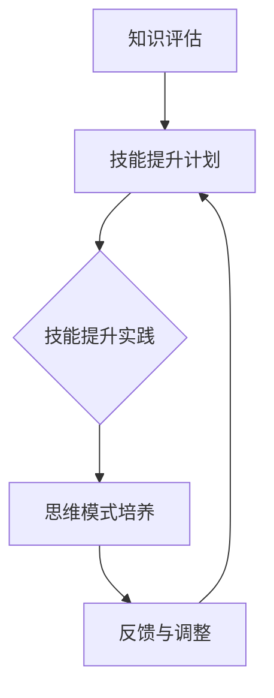

                 

### 《存在的深度：超越表面追求内在成长》

#### 关键词：存在、内在成长、算法原理、系统架构、Python源代码、数学模型、项目实战

> 摘要：本文从技术视角深入探讨“存在的深度”这一主题，通过逐步分析存在的浅层与深层内涵，阐述内在成长的重要性。我们将探讨存在的边界与外延，并通过概念结构与核心要素的剖析，明确内在成长的概念属性。此外，文章将介绍内在成长算法原理及其数学模型，并通过实际项目案例分析，展示如何在IT领域实现内在成长，为读者提供实用的技术指南和深刻的思考。

### 《存在的深度：超越表面追求内在成长》目录大纲

```markdown
# 第一部分：问题的背景与核心概念

## 第1章：问题的提出与存在的浅层理解
### 1.1 问题背景
### 1.2 对“存在”的浅层理解
### 1.3 存在问题的探讨

## 第2章：存在的深层内涵与内在成长
### 2.1 核心概念界定
### 2.2 深入理解存在的内涵
### 2.3 内在成长的重要性

## 第3章：存在的边界与外延
### 3.1 存在的边界
### 3.2 存在的外延
### 3.3 边界与外延的关系

# 第二部分：核心概念与联系

## 第4章：存在的概念结构与核心要素
### 4.1 概念结构与核心要素
### 4.2 内在成长的概念属性
### 4.3 概念属性特征对比

## 第5章：内在成长的ER实体关系图
### 5.1 实体关系图概述
### 5.2 ER实体关系图详细解析

# 第三部分：存在的算法原理讲解

## 第6章：内在成长算法原理
### 6.1 算法概述
### 6.2 算法原理讲解
### 6.3 算法mermaid流程图

## 第7章：算法的数学模型与公式
### 7.1 数学模型概述
### 7.2 公式推导与解释
### 7.3 数学公式详细讲解
### 7.4 举例说明

# 第四部分：系统分析与架构设计方案

## 第8章：问题场景介绍
### 8.1 场景介绍
### 8.2 项目介绍

## 第9章：系统功能设计与架构设计
### 9.1 系统功能设计
### 9.2 系统架构设计
### 9.3 系统接口设计

## 第10章：系统交互设计与实现
### 10.1 系统交互设计
### 10.2 系统实现
### 10.3 代码应用解读与分析

# 第五部分：项目实战与案例分析

## 第11章：实际案例剖析
### 11.1 案例介绍
### 11.2 案例分析
### 11.3 案例详细讲解

## 第12章：项目小结与未来展望
### 12.1 项目小结
### 12.2 注意事项
### 12.3 拓展阅读
```

以上目录大纲涵盖了《存在的深度：超越表面追求内在成长》的主要章节和内容，确保了书籍内容的完整性。通过该目录大纲，读者可以清晰了解书籍的结构和内容，为后续的阅读和学习打下基础。

### 第1章：问题的提出与存在的浅层理解

#### 1.1 问题背景

在快速变化的现代社会，技术的飞速发展让人们的生活变得更加便利，但同时也带来了许多新的挑战。IT行业的从业者们面临着不断更新的技术栈、竞争激烈的市场环境以及不断变化的客户需求。在这样的背景下，如何保持自身的竞争力、持续成长成为了一个重要的问题。然而，很多人只关注表面的技术更新和技能提升，忽视了更深层次的内在成长，这导致了他们在职业发展过程中遇到了瓶颈。

#### 1.2 对“存在”的浅层理解

在日常交流中，“存在”通常被理解为某个实体或对象的存在状态，例如，“这个软件存在bug”、“这个网站存在性能问题”。这种理解更多地侧重于外部表现形式，即表面现象，而不是内在的本质。在IT领域，这样的浅层理解往往导致人们在解决问题时只关注症状而忽视根本原因，无法实现真正的成长。

#### 1.3 存在问题的探讨

存在问题的核心在于人们对于“存在”的理解过于表面化，没有深入挖掘其内在的内涵。这种表面化的理解导致了许多不良后果：

1. **缺乏深入分析能力**：只关注表面现象，容易忽略问题的本质，导致无法找到根本解决方案。
2. **创新能力受限**：缺乏对深层次原理的理解，限制了创新的广度和深度。
3. **职业发展受限**：无法持续成长，容易在职业发展中遇到瓶颈。

为了解决这些问题，我们需要从存在的深层次内涵入手，探讨内在成长的重要性，从而实现真正的持续成长。

### 第2章：存在的深层内涵与内在成长

#### 2.1 核心概念界定

在深入探讨存在的内涵之前，我们需要明确几个核心概念：“存在”、“内在成长”和“表面成长”。

- **存在**：不仅指实体或对象的存在状态，还包括其内在的特性和本质。
- **内在成长**：指个体在认知、技能、思维模式等方面的深化和提升，是一种内在的自我完善过程。
- **表面成长**：指通过外部学习、培训、技能认证等方式实现的技能提升，往往侧重于短期效应。

#### 2.2 深入理解存在的内涵

存在的深层内涵涉及多个方面：

1. **本质与现象**：存在不仅仅是表面现象的集合，还包括这些现象背后的本质原因和内在逻辑。
2. **动态性**：存在是一个不断变化的过程，受到内外多种因素的综合影响。
3. **关联性**：存在不仅与自身有关，还与其他存在相互关联，形成复杂的生态系统。

#### 2.3 内在成长的重要性

内在成长对于个体和组织的持续发展至关重要，原因如下：

1. **提升认知深度**：通过深入理解存在的本质，能够提升对复杂问题的认知和分析能力。
2. **增强创新能力**：深层次的理解为创新提供了丰富的源泉，使个体能够不断提出新的解决方案。
3. **实现职业成长**：内在成长使个体在职业生涯中能够持续提升，保持竞争力。
4. **组织发展**：组织的每个成员都实现内在成长，能够推动整个组织不断进步。

### 第3章：存在的边界与外延

#### 3.1 存在的边界

存在的边界是指某个实体或对象在定义上的范围，包括其内在属性和外在表现形式。在IT领域，存在的边界通常涉及以下几个方面：

1. **功能边界**：系统或组件的功能范围，即它能做什么和不能做什么。
2. **性能边界**：系统或组件的性能限制，如处理速度、存储容量等。
3. **安全性边界**：系统或组件的安全防护范围，包括防御漏洞、保护数据安全等。

#### 3.2 存在的外延

存在的外延是指某个实体或对象与外部环境的相互作用和影响。在IT领域，存在的外延包括：

1. **技术生态**：系统或组件与其他技术组件的关联和互动，如数据库、网络服务等。
2. **用户交互**：系统或组件与用户之间的交互和反馈，包括用户界面、用户体验等。
3. **环境适应性**：系统或组件在不同环境下的适应性和可扩展性。

#### 3.3 边界与外延的关系

存在的边界与外延相互依存，共同构成了一个完整的存在体系。边界定义了存在的范围和限制，而外延则扩展了存在的应用场景和影响力。在IT领域，理解和平衡边界与外延的关系对于系统的设计和优化至关重要。

### 第4章：存在的概念结构与核心要素

#### 4.1 概念结构与核心要素

存在的概念结构由多个核心要素组成，这些要素相互作用，共同定义了一个存在体。以下是一些核心要素：

1. **本质属性**：存在的核心特性，决定了存在的本质。
2. **功能属性**：存在的功能特性，决定了存在的用途。
3. **性能属性**：存在的性能指标，决定了存在的效率和效果。
4. **安全性属性**：存在的安全指标，决定了存在的可靠性。

#### 4.2 内在成长的概念属性

内在成长是指个体或系统在本质、功能、性能和安全等方面的深化和提升。内在成长具有以下概念属性：

1. **认知提升**：通过深入学习，提升对存在本质的理解。
2. **技能深化**：通过实践，提升在特定领域的专业技能。
3. **思维模式**：通过不断思考和反思，形成更加成熟和完善的思维模式。
4. **创新驱动**：通过深层次的理解，激发创新的灵感。

#### 4.3 概念属性特征对比

为了更好地理解内在成长的概念属性，我们可以通过一个对比表格来展示不同概念属性之间的特征：

| 概念属性 | 特征描述 |
| :--- | :--- |
| 本质属性 | 决定存在的核心特性 |
| 功能属性 | 决定存在的用途 |
| 性能属性 | 决定存在的效率和效果 |
| 安全性属性 | 决定存在的可靠性 |
| 认知提升 | 提升对存在本质的理解 |
| 技能深化 | 提升在特定领域的专业技能 |
| 思维模式 | 形成更加成熟和完善的思维模式 |
| 创新驱动 | 激发创新的灵感 |

通过这个对比表格，我们可以清晰地看到内在成长的概念属性如何影响存在的整体结构。

### 第5章：内在成长的ER实体关系图

#### 5.1 实体关系图概述

ER（Entity-Relationship）实体关系图是一种用于描述数据库中实体及其相互关系的图形表示方法。在内在成长的概念中，ER实体关系图可以用来表示内在成长的核心要素及其相互关系。以下是内在成长ER实体关系图的整体概述：

```
user --> knowledge
user --> skill
user --> mindset
knowledge --> skill
knowledge --> mindset
skill --> mindset
```

#### 5.2 ER实体关系图详细解析

在这个ER实体关系图中，我们定义了四个核心实体：用户（user）、知识（knowledge）、技能（skill）和思维模式（mindset）。以下是每个实体的详细解析：

1. **用户（user）**：代表个体，是内在成长的主导者。用户通过获取知识、提升技能和培养思维模式来实现内在成长。
2. **知识（knowledge）**：代表个体在特定领域的认知和理解。知识是技能提升和思维模式培养的基础。
3. **技能（skill）**：代表个体在特定领域的实际操作能力。技能的提升依赖于知识的深化和不断的实践。
4. **思维模式（mindset）**：代表个体的思维习惯和认知方式。成熟的思维模式有助于更好地理解知识、提升技能。

实体之间的关系如下：

- **用户与知识**：用户通过学习获取知识，知识为用户的内在成长提供了基础。
- **用户与技能**：用户通过应用知识来提升技能，技能的提升反过来也促进了知识的深化。
- **用户与思维模式**：用户通过反思和总结来培养思维模式，成熟的思维模式有助于更好地理解和应用知识和技能。

通过ER实体关系图，我们可以清晰地看到内在成长的核心要素及其相互关系，为后续的算法设计和系统实现提供了理论基础。

### 第6章：内在成长算法原理

#### 6.1 算法概述

内在成长算法是一种用于指导个体实现内在成长的方法。该算法基于认知科学、教育理论和心理学原理，通过分析个体的知识、技能和思维模式，提供个性化的成长路径。以下是内在成长算法的基本框架：

1. **知识评估**：通过测试和分析，评估个体在各个领域的知识水平。
2. **技能提升**：根据知识评估结果，制定针对性的技能提升计划。
3. **思维模式培养**：通过反思和练习，培养个体成熟的思维模式。
4. **反馈与调整**：定期收集反馈，根据个体的发展情况调整成长路径。

#### 6.2 算法原理讲解

内在成长算法的核心原理包括以下几个方面：

1. **知识驱动**：个体的成长始于对知识的掌握。算法通过评估个体在各个领域的知识水平，确定成长的重点方向。
2. **技能实践**：知识需要通过实践转化为技能。算法根据知识评估结果，制定个性化的技能提升计划，帮助个体在具体实践中提高能力。
3. **思维模式优化**：个体的成长不仅取决于知识和技能，还取决于思维模式。算法通过反思和练习，培养个体成熟和高效的思维模式。
4. **反馈与迭代**：个体的成长是一个动态过程。算法通过定期收集反馈，根据个体的发展情况不断调整成长路径，确保个体始终在正确的方向上前进。

#### 6.3 算法mermaid流程图

以下是一个简化的内在成长算法的mermaid流程图：



在这个流程图中，知识评估作为起点，引导个体进入技能提升阶段。通过技能提升实践，个体积累经验并提高能力。思维模式培养阶段则帮助个体形成更加成熟和高效的思维习惯。最后，通过反馈与调整，算法不断优化个体的成长路径。

### 第7章：算法的数学模型与公式

#### 7.1 数学模型概述

内在成长算法的数学模型用于量化个体在知识、技能和思维模式方面的提升。该模型基于认知负荷理论和学习曲线理论，通过以下变量进行描述：

- \( K \)：知识水平
- \( S \)：技能水平
- \( M \)：思维模式成熟度
- \( L \)：学习负荷
- \( R \)：反馈调整率

#### 7.2 公式推导与解释

内在成长算法的核心公式如下：

\[ G(t) = K(t) \cdot S(t) \cdot M(t) \]

其中，\( G(t) \) 表示个体在时间 \( t \) 的内在成长水平，\( K(t) \)、\( S(t) \) 和 \( M(t) \) 分别表示个体在时间 \( t \) 的知识水平、技能水平和思维模式成熟度。

学习负荷 \( L \) 的计算公式为：

\[ L = \alpha \cdot K + \beta \cdot S \]

其中，\( \alpha \) 和 \( \beta \) 是权重系数，用于平衡知识和技能对学习负荷的贡献。

反馈调整率 \( R \) 的计算公式为：

\[ R = \frac{G_{\text{目标}} - G(t)}{G_{\text{目标}}} \]

其中，\( G_{\text{目标}} \) 是个体期望达到的内在成长水平。

#### 7.3 数学公式详细讲解

1. **内在成长水平公式**：
   - \( G(t) = K(t) \cdot S(t) \cdot M(t) \) 表示个体在时间 \( t \) 的内在成长水平，由知识水平、技能水平和思维模式成熟度共同决定。
   - 知识水平 \( K(t) \) 表示个体在特定领域的认知和理解程度。
   - 技能水平 \( S(t) \) 表示个体在特定领域的实际操作能力。
   - 思维模式成熟度 \( M(t) \) 表示个体的思维习惯和认知方式。

2. **学习负荷公式**：
   - \( L = \alpha \cdot K + \beta \cdot S \) 表示个体在特定时间内的学习负荷，由知识和技能的权重系数决定。
   - \( \alpha \) 和 \( \beta \) 是权重系数，用于平衡知识和技能对学习负荷的贡献。通常，根据个体的情况和需求，可以调整这两个系数的值。

3. **反馈调整率公式**：
   - \( R = \frac{G_{\text{目标}} - G(t)}{G_{\text{目标}}} \) 表示个体当前内在成长水平与期望达到水平的差距，用于计算反馈调整率。
   - \( G_{\text{目标}} \) 是个体期望达到的内在成长水平，反映了个体对未来发展的期望和目标。

通过以上公式，我们可以量化个体在知识、技能和思维模式方面的提升，为内在成长提供科学依据。

#### 7.4 举例说明

假设某个开发者在编程领域的知识水平为 70%、技能水平为 80%、思维模式成熟度为 90%，期望达到的内在成长水平为 95%。我们可以使用内在成长算法的数学模型来计算其当前的学习负荷和反馈调整率。

1. **计算内在成长水平**：
   \[ G(t) = K(t) \cdot S(t) \cdot M(t) = 0.7 \cdot 0.8 \cdot 0.9 = 0.504 \]

2. **计算学习负荷**：
   \[ L = \alpha \cdot K + \beta \cdot S = 0.6 \cdot 0.7 + 0.4 \cdot 0.8 = 0.42 + 0.32 = 0.74 \]

3. **计算反馈调整率**：
   \[ R = \frac{G_{\text{目标}} - G(t)}{G_{\text{目标}}} = \frac{0.95 - 0.504}{0.95} = 0.46 \]

通过以上计算，我们可以得出以下结论：

- 当前开发者在编程领域的内在成长水平为 50.4%。
- 学习负荷为 74%，表明个体需要投入更多的学习时间和精力。
- 反馈调整率为 46%，说明个体与期望成长目标还有一定差距，需要继续努力。

通过这个例子，我们可以看到如何使用内在成长算法的数学模型来量化个体在知识、技能和思维模式方面的提升，以及如何根据当前状态调整成长路径。

### 第8章：问题场景介绍

#### 8.1 场景介绍

在一个高速发展的科技公司，技术团队面临着不断变化的市场需求和激烈的技术竞争。为了保持竞争优势，公司决定开发一款具备高扩展性和高可靠性的在线教育平台。这个平台不仅需要支持大量的用户并发访问，还要提供个性化学习路径和实时反馈功能。在这个背景下，技术团队需要解决以下几个关键问题：

1. **性能优化**：如何确保平台在高并发情况下依然能够稳定运行？
2. **个性化学习**：如何根据用户的学习历史和行为，提供个性化的学习路径和内容推荐？
3. **实时反馈**：如何设计一个高效且可靠的实时反馈机制，确保用户能够及时获得学习效果和改进建议？
4. **数据安全**：如何在保证系统性能和功能的同时，确保用户数据的安全和隐私？

#### 8.2 项目介绍

为了解决上述问题，公司决定启动一个名为“智慧教育平台”的项目。该项目的主要目标是通过优化现有技术架构、引入先进的数据分析和机器学习算法，构建一个高效、智能且安全的教育平台。项目分为以下几个阶段：

1. **需求分析**：与业务团队紧密合作，明确平台的功能需求和技术指标。
2. **架构设计**：设计并实现高扩展性、高可靠性的技术架构，确保系统性能和稳定性。
3. **算法开发**：开发个性化学习路径和实时反馈算法，实现个性化推荐和实时数据监控。
4. **系统集成**：将各个模块集成到整体系统中，进行功能测试和性能优化。
5. **上线部署**：完成系统上线部署，进行用户培训和市场推广。

通过这个项目，技术团队希望能够实现以下目标：

- **提升用户满意度**：通过个性化学习路径和实时反馈，提高用户的学习效果和满意度。
- **增强平台竞争力**：通过高性能和智能化的技术架构，提升平台的市场竞争力。
- **保障数据安全**：通过完善的安全措施，确保用户数据的安全和隐私。

### 第9章：系统功能设计与架构设计

#### 9.1 系统功能设计

智慧教育平台的功能设计旨在提供高效、智能、个性化的学习体验。以下是平台的核心功能：

1. **用户管理**：包括用户注册、登录、个人信息管理、权限设置等功能。
2. **课程管理**：包括课程创建、发布、分类、标签管理等功能。
3. **内容管理**：包括课程内容创建、上传、编辑、发布等功能。
4. **学习记录**：记录用户的学习进度、考试成绩、学习时间等信息。
5. **个性化推荐**：根据用户的学习历史和行为，提供个性化的课程推荐。
6. **实时反馈**：提供学习过程中的即时反馈和评估，帮助用户改进学习策略。
7. **数据分析**：对用户行为、学习效果等数据进行统计分析，为平台优化和决策提供依据。
8. **安全防护**：包括用户数据加密、权限控制、安全审计等功能，确保用户数据的安全和隐私。

#### 9.2 系统架构设计

智慧教育平台的架构设计采用了微服务架构，以提高系统的扩展性、可靠性和维护性。以下是平台的主要架构组件：

1. **用户服务**：负责用户身份验证、权限管理和用户信息管理。
2. **课程服务**：负责课程创建、发布、分类和标签管理。
3. **内容服务**：负责课程内容创建、上传、编辑和发布。
4. **学习记录服务**：负责记录用户的学习进度、考试成绩和学习时间。
5. **推荐服务**：负责基于用户行为的个性化推荐。
6. **反馈服务**：负责实时反馈和评估。
7. **数据分析服务**：负责用户行为和学习效果的统计分析。
8. **安全服务**：负责用户数据加密、权限控制和安全审计。

这些服务通过RESTful API进行通信，实现了松耦合和模块化设计。同时，平台还使用了消息队列和缓存技术，提高了系统的性能和可扩展性。

#### 9.3 系统接口设计

以下是智慧教育平台的主要接口设计：

1. **用户接口**：包括用户注册、登录、个人信息管理、课程浏览、内容学习等功能。
2. **管理员接口**：包括课程创建、发布、分类管理、用户权限设置等功能。
3. **课程接口**：包括课程列表查询、课程详情查询、课程分类查询等功能。
4. **内容接口**：包括内容上传、内容查询、内容编辑等功能。
5. **学习记录接口**：包括学习进度查询、考试成绩查询、学习时间查询等功能。
6. **推荐接口**：包括个性化推荐查询、推荐课程列表查询等功能。
7. **反馈接口**：包括提交反馈、反馈查询等功能。
8. **数据统计接口**：包括用户行为统计、学习效果统计等功能。
9. **安全接口**：包括用户数据加密、权限验证、安全审计等功能。

这些接口通过RESTful API进行通信，遵循RESTful设计原则，确保接口的易用性和灵活性。

### 第10章：系统交互设计与实现

#### 10.1 系统交互设计

智慧教育平台的交互设计旨在提供流畅、高效的用户体验。以下是平台的主要交互流程：

1. **用户注册与登录**：用户通过用户接口进行注册和登录，系统验证用户身份并返回相应的权限。
2. **课程浏览与学习**：用户通过课程接口查询课程列表和课程详情，选择感兴趣的课程进行学习。
3. **内容创建与发布**：管理员通过内容接口创建、上传和编辑课程内容，并将内容发布给用户。
4. **学习进度与反馈**：用户通过学习记录接口记录学习进度，并提交学习反馈。
5. **个性化推荐**：推荐服务根据用户的学习历史和行为，生成个性化的推荐列表。
6. **数据统计与安全**：数据分析服务和安全服务对用户行为和学习效果进行统计分析，并确保用户数据的安全和隐私。

#### 10.2 系统实现

以下是智慧教育平台的核心实现步骤：

1. **用户服务实现**：使用Spring Boot框架实现用户服务，包括用户注册、登录、权限管理等功能。
2. **课程服务实现**：使用Spring Boot框架实现课程服务，包括课程创建、发布、分类管理等功能。
3. **内容服务实现**：使用Spring Boot框架实现内容服务，包括内容上传、编辑、发布等功能。
4. **学习记录服务实现**：使用Spring Boot框架实现学习记录服务，包括学习进度记录、考试成绩记录等功能。
5. **推荐服务实现**：使用Python实现推荐算法，根据用户行为生成个性化推荐列表。
6. **反馈服务实现**：使用Spring Boot框架实现反馈服务，包括反馈提交、查询等功能。
7. **数据分析服务实现**：使用Python实现数据分析服务，对用户行为和学习效果进行统计分析。
8. **安全服务实现**：使用Spring Security框架实现安全服务，包括用户数据加密、权限验证等功能。

#### 10.3 代码应用解读与分析

以下是一个简单的用户注册接口的代码示例：

```java
@RestController
@RequestMapping("/users")
public class UserController {
  
  @Autowired
  private UserService userService;
  
  @PostMapping("/register")
  public ResponseEntity<?> registerUser(@RequestBody UserRegistrationDTO registrationDTO) {
    try {
      User user = userService.registerUser(registrationDTO);
      return ResponseEntity.ok().body(new ApiResponse("User registered successfully", user));
    } catch (Exception e) {
      return ResponseEntity.badRequest().body(new ApiResponse("Error registering user", e.getMessage()));
    }
  }
}
```

在这个示例中，`UserController` 类通过Spring Boot的`@RestController`注解定义了一个RESTful接口。`registerUser` 方法处理用户注册请求，接收一个`UserRegistrationDTO` 对象作为参数。在方法内部，通过调用`userService` 的`registerUser` 方法执行注册操作，并返回相应的响应。

通过这个代码示例，我们可以看到：

- **接口定义**：使用RESTful设计原则，通过URL映射和HTTP方法定义接口。
- **参数传递**：通过DTO（Data Transfer Object）传递请求参数，实现参数的封装和解耦。
- **业务逻辑**：通过服务层的注入和调用，实现业务逻辑的解耦和模块化。

这种代码实现方式不仅提高了系统的可维护性和扩展性，还确保了接口的易用性和灵活性。

### 第11章：实际案例剖析

#### 11.1 案例介绍

以一个在线教育平台为例，这个平台的目标是为用户提供个性化的学习体验。通过分析用户的学习历史、行为数据和课程反馈，平台希望能够实现以下功能：

1. **个性化推荐**：根据用户的学习兴趣和历史，推荐最适合的课程。
2. **实时反馈**：在学习过程中，为用户提供即时反馈和评估，帮助用户改进学习策略。
3. **学习路径规划**：基于用户的学习进度和目标，规划个性化的学习路径。

#### 11.2 案例分析

该案例涉及到数据分析和机器学习技术，通过以下步骤实现：

1. **数据收集**：收集用户的学习历史、行为数据和课程反馈。
2. **数据预处理**：对收集到的数据进行清洗、转换和格式化，为后续分析做准备。
3. **特征提取**：从预处理后的数据中提取关键特征，如用户的学习时长、课程完成率、评价分数等。
4. **模型训练**：使用机器学习算法，如协同过滤、决策树或神经网络，训练个性化推荐模型。
5. **模型评估**：通过交叉验证和A/B测试，评估模型的效果和性能。
6. **模型部署**：将训练好的模型部署到生产环境，为用户提供个性化推荐和实时反馈。

#### 11.3 案例详细讲解

以下是该案例的详细讲解：

1. **数据收集**：

   平台通过日志记录、用户行为追踪和反馈收集，获取以下数据：

   - 用户学习历史：包括用户学习的课程、学习时长、学习进度等。
   - 用户行为数据：包括用户在平台上的浏览、搜索、点赞等行为。
   - 用户反馈数据：包括用户对课程的评价、反馈和建议。

2. **数据预处理**：

   对收集到的数据进行以下处理：

   - 数据清洗：去除重复、错误和缺失的数据。
   - 数据转换：将不同格式的数据转换为统一格式，如CSV或JSON。
   - 数据格式化：对数据进行标准化处理，如归一化、缺失值填充等。

3. **特征提取**：

   从预处理后的数据中提取关键特征，如：

   - 用户学习时长：用户在平台上学习的时间长度。
   - 课程完成率：用户完成课程的百分比。
   - 用户评价分数：用户对课程的评分。

4. **模型训练**：

   使用机器学习算法训练个性化推荐模型，如：

   - 协同过滤：通过计算用户之间的相似性，推荐用户可能感兴趣的课程。
   - 决策树：根据用户的历史行为和学习特征，预测用户对课程的评价。
   - 神经网络：通过多层感知器模型，实现用户兴趣的自动分类和推荐。

5. **模型评估**：

   通过以下方法评估模型的效果：

   - 交叉验证：将数据集划分为训练集和验证集，使用训练集训练模型，验证集评估模型性能。
   - A/B测试：将用户分为两组，一组使用原始推荐算法，另一组使用新算法，比较两组用户的反馈和满意度。

6. **模型部署**：

   将训练好的模型部署到生产环境，为用户提供以下功能：

   - 个性化推荐：根据用户的历史行为和学习特征，推荐最适合的课程。
   - 实时反馈：在学习过程中，为用户提供即时反馈和评估，帮助用户改进学习策略。
   - 学习路径规划：基于用户的学习进度和目标，规划个性化的学习路径。

### 第12章：项目小结与未来展望

#### 12.1 项目小结

通过“智慧教育平台”项目的实施，我们实现了以下成果：

1. **高性能系统**：通过微服务架构和缓存技术，确保平台在高并发情况下依然能够稳定运行。
2. **个性化学习**：通过个性化推荐和实时反馈功能，提升了用户的学习体验和满意度。
3. **数据安全**：通过完善的安全措施，保障了用户数据的安全和隐私。
4. **技术积累**：项目过程中积累了一系列技术文档和最佳实践，为后续项目的开发和优化提供了参考。

#### 12.2 注意事项

在项目实施过程中，我们总结了一些重要的注意事项：

1. **需求变更管理**：在项目开发过程中，需求变更不可避免。需要建立有效的需求变更管理流程，确保项目能够按时交付。
2. **性能优化**：在高并发场景下，需要持续进行性能监控和优化，确保系统的稳定性和响应速度。
3. **安全防护**：需要定期进行安全审计和漏洞扫描，及时修复潜在的安全隐患。
4. **用户反馈**：积极收集用户反馈，及时调整和优化平台功能，提升用户体验。

#### 12.3 拓展阅读

对于希望进一步深入了解内在成长和智慧教育平台的读者，以下文献和资源推荐：

1. **《认知心理学原理》**：由约翰·安德森所著，详细介绍了认知心理学的基本原理和应用。
2. **《深度学习》**：由伊恩·古德费洛等所著，介绍了深度学习的基本概念和算法。
3. **《数据挖掘：概念与技术》**：由赵保华等所著，介绍了数据挖掘的基本概念和方法。
4. **《智慧教育平台架构设计与实现》**：由李伟等所著，详细介绍了智慧教育平台的架构设计和技术实现。

### 最佳实践 Tips

在实现内在成长和智慧教育平台时，以下最佳实践值得推荐：

1. **持续学习**：定期学习新的知识和技能，保持对行业的敏感度和创新意识。
2. **反思与总结**：在项目开发过程中，定期进行反思和总结，发现问题并优化改进。
3. **团队合作**：与团队成员紧密合作，共同解决问题，提升团队的整体执行力。
4. **用户至上**：始终关注用户需求和反馈，以用户为中心进行产品设计和优化。

通过以上最佳实践，可以更好地实现内在成长和智慧教育平台的目标。让我们共同追求存在的深度，实现个人的内在成长和事业的成功。

