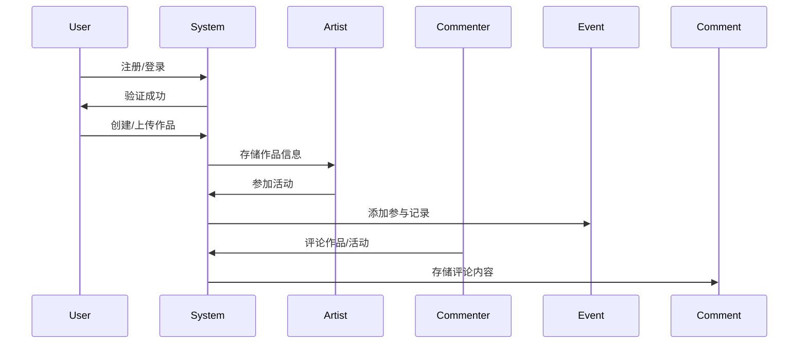

                 

### 引言：存在的美学：探索生活与艺术的融合

“存在的美学：将生活转化为艺术”是一本探讨生活与艺术关系，引导读者发现和创造生活中美学的书籍。本书由著名哲学家和美学研究者大卫·贝尔曼撰写，他在书中通过丰富的案例和深入的思考，揭示了美学在生活中的重要性和实践方法。让我们先来思考几个问题：为什么我们要将生活转化为艺术？生活的艺术化究竟意味着什么？

首先，我们需要理解“存在的美学”这一核心概念。美学是哲学的一个分支，研究美和审美经验。而“存在的美学”则进一步探讨审美经验如何在我们的日常生活中发挥作用。它不仅关注艺术品和美学理论，更强调将美学视角应用于实际生活，通过提高对美的感知和创造美的能力，使生活变得更加丰富和有意义。

贝尔曼在书中提出，生活的艺术化是一种哲学态度，是对存在的深刻理解和积极回应。它鼓励我们重新审视日常生活中的每一个细节，从中发现美的价值和意义。这不仅是一种美学追求，更是一种生活方式的变革。

接下来，我们将逐步探讨存在的美学概念、生活与艺术的关系、将生活转化为艺术的方法、日常生活中的美学实践、艺术与生活的融合，以及存在的美学对个人和社会的意义。通过这些探讨，我们将深入理解美学在生活中的重要性，学会将生活转化为艺术，从而提升生活质量。

### 美学的定义与意义

美学，作为哲学的一个分支，探讨美和审美经验。它的起源可以追溯到古希腊时期，当时的哲学家们开始思考什么是美，以及如何通过艺术来表达美。美学不仅仅是对美的研究，它更关注审美经验的本质和意义。

在美学中，美的定义多种多样。一些哲学家认为，美是一种感官上的愉悦，是形式和内容的和谐统一；另一些则强调美与道德、情感和思想的关系。总体而言，美学试图理解美是如何产生和感知的，以及它在我们生活中的作用。

美学的意义在于它为我们提供了一种理解世界的方式，一种超越物质现实的审美体验。通过美学，我们能够发现日常生活中的美好，从而提升生活的质量。美学不仅关注艺术品，也关注自然界、人类创造和日常生活中的美。它帮助我们培养对美的敏感度，提高审美鉴赏能力。

在生活中的应用，美学可以体现在许多方面。例如，家居布置、服装搭配、食物烹饪、甚至日常行为的规范，都可以通过美学原则来提升其审美价值。美学不仅是一种艺术追求，更是一种生活态度。它鼓励我们以美的眼光看待世界，从而发现生活中的美好。

### 存在主义与美学的关系

存在主义是20世纪哲学的一个重要流派，强调个体存在的自由和责任。与美学的关系可以从多个层面来探讨。首先，存在主义关注个体如何面对生活的意义和目的，而美学则提供了对这一过程的审美体验和情感表达。两者在探讨人的自由和存在的价值上有着深刻的共鸣。

在存在主义美学中，个体的自由和创造力是核心。存在主义者认为，人不是被动地接受世界的给予，而是通过主动的选择和创造来定义自己的存在。美学在这个过程中起到了重要的作用，它不仅提供了审美体验，也激励人们通过艺术表达自我、探索存在的意义。

具体来说，存在主义美学主张通过艺术来反映和表达个体存在的真实体验。艺术家通过创作，不仅传达了他们对世界的理解，也展示了个体在面对存在困境时的选择和态度。这种艺术创作和审美体验，既是对存在主义理念的深化，也是对个体自由和创造力的肯定。

在存在主义美学中，审美不仅是感官上的愉悦，更是一种深刻的思想和情感体验。它要求我们以开放的视角去审视生活，从中发现和创造美。通过美学，我们可以更好地理解自己的存在，找到生活的意义和目的。

总之，存在主义与美学的关系体现了个体存在的自由和创造性，它们共同推动我们对生活意义的深入探讨和积极实践。美学为存在主义提供了丰富的表达工具，使个体在自由选择和创造中找到存在的价值。

### 与存在美学相关的其他概念

在探讨存在的美学时，我们不可避免地会涉及到一些与之密切相关的重要概念，如“生活艺术化”和“艺术的存在”。这些概念不仅丰富了存在美学的内涵，也为我们理解如何将生活转化为艺术提供了新的视角。

首先，我们来看“生活艺术化”。生活艺术化是一种将日常生活与艺术创作相结合的哲学和实践。它主张通过艺术化的思维和行为，使日常生活变得更加有意义和美好。生活艺术化不仅仅是将艺术品带入生活，更是一种对生活本身的审美追求。例如，通过精心布置家居，创造出一个温馨和谐的环境；通过烹饪和饮食，体验食物的艺术美；通过日常行为的艺术化，提升生活的品质。生活艺术化强调，生活本身就是一种艺术，我们可以在其中发现和创造美。

接下来，探讨“艺术的存在”。艺术的存在不仅仅是艺术品的存在，更是艺术在日常生活中的一种体现。艺术的存在意味着，艺术不仅存在于画廊和博物馆中，也存在于我们的日常生活中。通过日常行为和体验，我们可以将艺术融入生活。例如，通过绘画、摄影、音乐等艺术形式，我们可以在日常生活中感受到艺术的美。艺术的存在还体现在我们对世界的观察和思考中，通过艺术化的视角，我们可以更深入地理解世界和自我。

“生活艺术化”和“艺术的存在”与存在的美学紧密相连。它们不仅扩展了美学的研究范围，也提供了具体的实践方法。生活艺术化使我们能够在日常生活中发现和创造美，而艺术的存在则提醒我们，美无处不在，我们只需用心去感受和发现。这些概念共同构成了存在的美学，使我们能够通过艺术化生活，提升存在的质量和意义。

### 生活与艺术的关系

探讨生活与艺术的关系，我们需要理解两者之间的内在联系和相互转化。首先，艺术是一种表达和创造的方式，它通过视觉、听觉、触觉等多种感官形式，传达创作者的情感和思想。而生活，则是我们每天经历的点点滴滴，充满了平凡和琐碎。但正是这些看似平凡的生活片段，成为了艺术创作的源泉。

生活与艺术的相互转化体现在多个方面。首先，艺术家通过艺术创作，将生活中的经历和感悟转化为具有审美价值的艺术品。例如，文艺复兴时期的艺术家通过绘画和雕塑，将他们观察到的生活细节和哲学思考融入作品中。其次，生活本身也可以通过艺术化的方式，转化为一种审美体验。我们可以在日常生活中，通过绘画、摄影、音乐等艺术形式，发现和创造美。

生活中的平凡和琐碎，往往是艺术创作的灵感来源。艺术家们通过对日常生活的细致观察和深刻感悟，将平凡转化为非凡。例如，威廉·亨利·哈特曼通过摄影记录了他生活中的琐碎瞬间，这些照片不仅展示了生活的真实面貌，也赋予了平凡以美感。艺术的存在使生活变得更加丰富和有意义，它不仅提供了美的体验，也让我们更深入地理解生活的本质。

总之，生活与艺术之间的关系是相互依存的。艺术通过表达和创造，丰富了我们的生活体验，而生活则为艺术提供了源源不断的灵感。通过这种相互转化，我们可以在平凡的生活中发现和创造美，使生活成为一种艺术化的存在。

### 如何将日常生活转化为艺术形式

将日常生活转化为艺术形式不仅是一种美学实践，更是一种生活态度的体现。让我们一步步探讨如何通过具体的艺术形式，将日常生活转化为具有审美价值的艺术作品。

首先，**创造性写作**是日常生活中的一种常见艺术形式。无论是写日记、短篇小说还是诗歌，写作都能帮助我们捕捉生活中的瞬间，并通过文字表达内心的感受。例如，记录日常生活中的某个小插曲，或者描述一段风景，都可以通过文字赋予其独特的艺术魅力。在这个过程中，关键在于保持真实和情感的投入，让文字流淌出内心的声音。

其次，**视觉艺术创作**如绘画、摄影和手工艺术等，也是一种有效的转化方式。绘画可以记录生活中的美好瞬间，而摄影则可以捕捉生活中的瞬间美。手工艺术，如编织、陶艺和木工，不仅能够创造美观的物品，还能在制作过程中带来内心的满足感。通过这些艺术形式，我们可以将日常生活中的材料，赋予新的生命和意义。

**舞蹈和音乐**也是将生活转化为艺术的重要形式。舞蹈通过身体的语言，表达内心的情感和故事，而音乐则通过声音的韵律和旋律，传达深邃的情感。参与舞蹈和音乐创作，不仅能够提升我们的审美能力，还能丰富我们的生活体验。例如，在家中演奏乐器，或与朋友一起跳舞，都是将生活转化为艺术的好方法。

**艺术展览和表演**也是一种展示日常生活中艺术创作成果的方式。通过举办个人展览或参加社区活动，我们可以与他人分享自己的艺术作品，感受艺术带来的共鸣和交流。

总之，将日常生活转化为艺术形式，不仅能够提升我们的审美能力，还能让生活变得更加丰富多彩。通过创造性写作、视觉艺术创作、舞蹈和音乐等多种形式，我们可以在日常生活中发现和创造美，让生活成为一种艺术化的存在。

### 创造性写作：记录生活中的艺术瞬间

创造性写作是将日常生活转化为艺术的一种有效方式，它通过文字的力量捕捉生活中的美好瞬间，并赋予其独特的艺术魅力。首先，让我们探讨一些常见的创造性写作技巧：

1. **细节描写**：通过详细描绘生活中的细节，可以让读者感受到场景的真实感和情感的深度。例如，描述一个雨天的小巷，洒落的雨滴、潮湿的地面、弥漫的雾气，这些细节都能使读者仿佛置身其中。

2. **情感表达**：情感是写作的核心，通过情感的表达，我们可以让读者产生共鸣。例如，在描述一次旅行时，不仅描述风景，还可以表达对家人的思念或对未来的憧憬。

3. **隐喻和象征**：隐喻和象征是创造性写作的重要技巧，它们通过将事物赋予新的意义，使文字具有深度和层次感。例如，用花朵象征生命的美好，用风暴象征内心的挣扎。

4. **故事叙述**：故事是写作的一种基本形式，通过叙述生活中的故事，我们可以让读者感受到生活的曲折和变化。例如，讲述一个关于家庭聚会的故事，不仅展示了家庭的和谐，也反映了家庭的矛盾和成长。

接下来，我们来看一些具体的例子：

- **例子1**：描述一次黄昏的散步，通过描绘天空的颜色、鸟儿的叫声、微风的感觉，使读者感受到黄昏的美丽和宁静。

- **例子2**：记录一次旅行中的意外，例如迷路或遇到一个有趣的陌生人，通过这些经历，展示生活中的不确定性和惊喜。

- **例子3**：写一首关于季节变化的诗，通过描绘季节的变迁，表达对时间和生命的感悟。

总之，创造性写作不仅能够记录生活中的美好瞬间，还能通过文字的艺术表达，使这些瞬间具有永恒的价值。通过细节描写、情感表达、隐喻和象征，以及故事叙述等技巧，我们可以将日常生活转化为具有审美价值的艺术作品。

### 视觉艺术创作：捕捉生活中的视觉美

视觉艺术创作是将生活转化为艺术的一种直观而富有表现力的方式。通过绘画、摄影等艺术形式，我们可以将生活中的美好瞬间定格在画布或相纸上，使其成为永久的视觉记忆。以下是几种常见的视觉艺术创作方法和技巧：

1. **绘画**：绘画是一种通过色彩和线条表达情感和思想的视觉艺术形式。无论是素描、水彩、油画还是数字绘画，画家都可以通过不同的技法和材料，捕捉生活中的视觉美。例如，通过运用光影和透视技巧，画家可以创造出立体感和空间感，使画面更具生动性。此外，色彩的选择和搭配也是绘画中至关重要的部分，冷暖色调的对比、色彩的渐变等都能增强画面的艺术效果。

2. **摄影**：摄影则通过捕捉瞬间的画面，将生活中的美定格在影像中。摄影师可以通过构图、光线和角度的调整，创造出具有视觉冲击力的作品。例如，使用大光圈和浅景深，可以使背景模糊，突出主体；利用侧光和逆光，可以创造出丰富的光影效果，增强画面的层次感。此外，不同的拍摄技术和后期处理也可以使照片更加生动和具有艺术感。

3. **手工艺术**：手工艺术如编织、陶艺和木工等，也是一种将生活转化为艺术的形式。这些艺术形式不仅能够创造出美观的物品，还在制作过程中提供了手工艺的乐趣和满足感。例如，通过编织，可以制作出温暖而具有纹理的毛衣或围巾；通过陶艺，可以创作出形态各异的花瓶和雕塑；通过木工，可以打造出精美的家具和装饰品。

为了更具体地了解视觉艺术创作的方法，以下是一些实用技巧和案例：

- **案例1**：一位艺术家通过油画描绘了他家乡的风景，通过细腻的色彩和光影处理，将夕阳下的山脉和田野描绘得栩栩如生，使观者仿佛置身其中。

- **案例2**：一位摄影师在一次旅行中记录了一组街头摄影作品，通过独特的视角和光影效果，展示了日常生活中的美好瞬间，如行人、建筑和街景等。

- **案例3**：一位手工艺术家通过编织制作了一件精美的毛衣，不仅展现了高超的编织技巧，还通过独特的图案设计，使毛衣具有了独特的艺术魅力。

总之，视觉艺术创作不仅是一种美学实践，也是一种表达自我和感知世界的手段。通过绘画、摄影和手工艺术等多种形式，我们可以将生活中的视觉美转化为具有持久魅力的艺术作品。

### 舞蹈与音乐：通过身体和声音传达生活之美

舞蹈与音乐是两种极具表现力的艺术形式，它们不仅能够传达情感和思想，还能够深刻地反映生活的状态。通过舞蹈和音乐的创作与表演，我们可以在日常生活中发现和创造美。

首先，舞蹈是一种通过身体语言表达情感的艺术形式。舞者通过舞步、姿态和表情，传达内心的情感和故事。例如，现代舞强调即兴和情感的表达，舞者通过自由的舞动，传达内心的挣扎、喜悦或悲伤。而芭蕾舞则通过优雅的舞步和准确的动作，展现美和和谐。舞蹈不仅是一种身体的运动，更是一种情感和思想的表达。通过舞蹈，我们可以将内心的感受转化为视觉艺术，使观众感受到生活的多样性和丰富性。

其次，音乐是一种通过声音传达情感和思想的艺术形式。无论是古典音乐、流行音乐还是民间音乐，音乐都能够唤起人们的情感共鸣。例如，一首悠扬的乐曲可以让人感受到宁静和平和，而一首激昂的乐曲则能激发人们的斗志和激情。音乐不仅能够表达情感，还能够影响情绪和心态。通过音乐创作和表演，我们可以将生活中的点滴感受转化为美妙的旋律，与他人分享内心的世界。

舞蹈与音乐在艺术创作中的具体应用包括：

1. **舞蹈剧场**：舞蹈剧场是一种将舞蹈与戏剧、音乐、灯光等多种艺术形式结合的表演形式。通过舞蹈剧场，舞者可以讲述故事、表达思想，使舞蹈成为一种富有叙事性的艺术形式。

2. **音乐剧**：音乐剧结合了音乐、舞蹈和戏剧，通过歌唱和表演，讲述故事和传达情感。音乐剧中的歌曲和舞蹈不仅增添了表演的观赏性，也增强了叙事的感染力。

3. **即兴创作**：即兴创作是一种通过现场反应和灵感创作艺术作品的形式。无论是即兴舞蹈还是即兴音乐，都要求艺术家在短时间内快速反应和创作，这种过程充满了创造力和惊喜。

通过舞蹈与音乐，我们可以在日常生活中发现和创造美。这些艺术形式不仅能够丰富我们的生活体验，还能让我们更深入地理解自己和世界。无论是通过舞蹈表达情感，还是通过音乐传达思想，我们都能在艺术创作中找到生活的美好。

### 日常生活中的美学实践

在日常生活的各个方面，我们可以通过美学实践来提升生活的质量。以下是一些具体的美学实践案例，包括家居布置、饮食和服饰搭配等方面。

首先，**家居布置**是日常生活中最重要的美学实践之一。通过精心设计和布置，我们可以将家变成一个温馨、舒适的空间。例如，选择合适的颜色和材料来打造和谐的室内环境，摆放一些艺术品或植物来增添生活气息。在家居布置中，关键在于简洁与舒适的平衡。通过合理的布局和细节的打磨，我们可以创造出既美观又实用的居住空间。

其次，**饮食**也是一种重要的美学实践。通过精心烹饪和搭配食物，我们可以将日常饮食变成一种艺术享受。例如，制作一份色彩丰富、营养均衡的早餐，或者设计一道创意十足的菜肴，都可以提升饮食的美感和营养价值。此外，餐桌布置和餐具的选择也是饮食美学的重要组成部分。通过选择合适的餐具和布置餐具，我们可以营造出愉悦的用餐氛围。

**服饰搭配**是另一个日常生活中不可或缺的美学实践。通过合理的搭配，我们可以根据自己的风格和场合，打造出时尚而得体的形象。例如，选择合适的颜色和款式，可以使整体造型更加和谐。此外，配饰的选择和搭配也是服饰美学的关键。通过巧妙地运用围巾、首饰和鞋履等配饰，我们可以为整体造型增添亮点。

总之，日常生活中的美学实践不仅能够提升生活的质量，还能让我们更加关注生活的细节和美好。通过家居布置、饮食和服饰搭配等多种美学实践，我们可以在平凡的生活中发现和创造美，让生活变得更加丰富多彩。

### 美学实践技巧与建议

在日常美学实践中，掌握一些实用的技巧和建议，可以帮助我们更好地发现和创造生活中的美。以下是一些具体的方法和经验：

1. **颜色搭配**：颜色是美学中至关重要的一环。在室内设计中，选择和谐的颜色搭配可以营造温馨舒适的环境。例如，使用相近色系可以产生柔和的视觉效果，而对比色则可以增加空间的活力。在服饰搭配中，了解色彩的理论和搭配原则，可以帮助我们选择适合自己肤色和气质的颜色，打造出时尚的造型。

2. **布局与对称**：在布局上，对称和平衡是创造和谐美感的重要原则。无论是家居布置还是服饰搭配，合理的布局和对称设计都能使整体更加美观。例如，在家居布置中，将家具对称地放置在空间的两侧，可以营造出平衡感；在服饰搭配中，通过对称的配饰或颜色分布，可以使整体造型更加和谐。

3. **细节打磨**：细节决定美感。在日常美学实践中，注重细节的处理，可以使整体效果更加精致。例如，在室内设计中，使用精致的窗帘、装饰品或独特的灯具，可以提升空间的层次感；在服饰搭配中，通过巧妙的配饰，如丝巾、项链或耳环，可以增添造型的亮点。

4. **情感表达**：美学不仅仅是视觉上的享受，更是情感的表达。在美学实践中，我们可以通过个人化的元素和风格，表达自己的情感和个性。例如，在家中放置一些有特殊意义的照片或纪念品，可以营造出温馨的氛围；在服饰搭配中，通过选择具有个人风格的单品，可以展现出独特的自我。

总之，通过颜色搭配、布局与对称、细节打磨和情感表达等技巧，我们可以在日常美学实践中发现和创造生活中的美，提升生活的整体质量。

### 融合艺术与生活：创造丰富的生活体验

将艺术融入生活，不仅能提升我们的审美能力，还能丰富我们的生活体验。通过艺术，我们可以重新审视和感受生活中的每一个细节，使其变得更加有意义和美好。以下探讨如何将艺术融入生活，创造丰富的体验。

首先，**环境布置**是一种有效的融合艺术与生活的方式。通过精心设计的家居环境，我们可以将艺术作品融入日常生活的空间。例如，在墙上挂一幅精美的画作，或摆放一些独特的装饰品，如陶瓷、雕塑等，都可以为室内空间增添艺术气息。此外，通过色彩和布局的巧妙运用，我们可以在家中创造出一种和谐而富有美感的氛围。

**日常活动**也是艺术融入生活的重要途径。例如，在烹饪过程中，我们可以尝试创新菜肴的摆盘和配色，使其成为一种视觉艺术。在阅读时，我们可以通过手写笔记或绘画来记录阅读感悟，这不仅是一种记忆的方法，也是一种创造性的艺术表达。此外，参与舞蹈、音乐、手工艺等艺术活动，不仅能够提升我们的艺术修养，还能带来身心愉悦的体验。

**艺术分享**是另一个重要的方面。通过举办个人艺术展览或参与社区艺术活动，我们可以与他人分享自己的艺术创作，感受艺术的共鸣和交流。例如，在社区中组织艺术工作坊，邀请邻居共同创作艺术品，不仅能够增进邻里之间的互动，也能让艺术成为连接彼此的桥梁。

总之，通过将艺术融入生活，我们可以创造出丰富而有意义的生活体验。无论是环境布置、日常活动，还是艺术分享，艺术都为我们提供了重新审视和感受生活的新视角，使我们的生活变得更加美好和充实。

### 个人艺术表达：通过艺术传递情感和思想

个人艺术表达是一种通过艺术形式传递个人情感和思想的方式，它不仅能够丰富我们的内心世界，还能让我们的感受和思考得到更深刻的表达。无论是通过绘画、写作、音乐，还是其他艺术形式，每个人都可以找到属于自己的艺术表达途径。

首先，绘画是一种直观而富有表现力的艺术形式。通过色彩和线条，我们可以将自己的情感和思想可视化。例如，一幅充满热情的画作可能表达了我们对生活的热爱和向往，而一幅充满忧郁的画作则可能反映了我们内心的挣扎和不安。在绘画中，我们可以自由地挥洒情感，通过艺术的语言传达内心的声音。

写作则是另一种有效的艺术表达方式。通过文字，我们可以细腻地描绘情感和思考，让读者感受到我们内心的波动。例如，一篇优美的散文可以表达我们对自然美景的感悟，一首感人的诗歌可以传达我们对爱情的思念。在写作中，语言的选择和结构的安排都至关重要，它们能够帮助我们将情感和思想有条理地表达出来。

音乐也是一种强大的艺术表达工具。通过旋律和节奏，我们可以将自己的情感和内心感受转化为美妙的音符。无论是创作一首歌曲，还是演奏一首乐曲，音乐都能帮助我们传达内心的情感和思想。例如，一首欢快的乐曲可能表达了我们对生活的喜悦和希望，而一首悲伤的乐曲则可能反映了我们内心的痛苦和失落。

除了绘画、写作和音乐，还有许多其他艺术形式可以用来表达个人情感和思想。例如，舞蹈、雕塑、摄影等，每种艺术形式都有其独特的表现方式和优势。通过探索不同的艺术形式，我们可以找到最适合自己的表达途径，让我们的情感和思想得到更深刻的表达。

总之，个人艺术表达不仅是一种艺术创作，更是一种心灵的交流。通过艺术，我们可以传递情感和思想，与他人分享我们的内心世界，从而创造出丰富而深刻的交流体验。

### 艺术与生活的互动：共鸣与分享

艺术与生活的互动不仅能够丰富个人的内心世界，还能在社区中产生积极的共鸣和分享。首先，艺术作为情感的载体，能够跨越文化和语言的界限，触动人们内心深处的共鸣。通过艺术活动，如艺术展览、音乐会、戏剧表演等，人们可以分享彼此的感受和体验，从而加深彼此的理解和联系。

社区艺术项目是促进艺术与生活互动的有效方式。例如，社区画廊和艺术工作室不仅为居民提供了一个展示自己艺术作品的空间，也成为了邻里互动的平台。在这样的空间中，居民可以通过共同参与艺术创作，分享彼此的生活经验和艺术感悟，从而建立起更加紧密的社区联系。

此外，艺术教育也是促进艺术与生活互动的重要手段。通过艺术课程和活动，孩子们可以在轻松愉快的氛围中学习艺术知识，培养审美能力和创造力。同时，艺术教育也可以帮助成年人重新发现和欣赏生活中的美，从而提升他们的生活质量和幸福感。

总之，艺术与生活的互动不仅能够带来个人的情感满足和心灵成长，还能在社区中产生积极的共鸣和分享，为构建和谐社会贡献力量。

### 总结：存在的美学与生活艺术化

存在的美学是一种哲学态度，它强调通过艺术化生活来提升我们的生活质量。通过将美学视角应用于日常生活，我们可以发现和创造生活中的美，从而增强生活的意义和幸福感。从创造性写作、视觉艺术创作到舞蹈与音乐，各种艺术形式为我们提供了丰富的表达和体验手段。通过这些艺术实践，我们不仅能够提升个人的审美能力，还能在社区中产生积极的共鸣和互动。

存在的美学不仅对个人具有重要意义，也对社会发展有着深远的影响。它鼓励我们以开放的心态去体验和创造美，从而培养出更加敏锐的审美意识和创新精神。这种美学理念不仅能够提升个人的生活质量，还能为社区和文化的发展注入新的活力。

因此，我们应当积极实践存在的美学，将艺术融入日常生活，通过艺术创作和分享，发现和创造生活中的美。这不仅是一种美学追求，更是一种对生活的深刻理解和积极回应。通过艺术化生活，我们可以找到生活的真谛，让每一天都充满意义和美好。

### 反思与启示：存在的美学实践

在反思存在的美学实践时，我们不仅要认识到美学在生活中的重要性，还应该思考如何在日常生活中更好地应用美学原则。以下是一些启示和建议，帮助我们在生活中实践存在的美学。

首先，**保持对美的敏感**。培养对美的敏锐感知能力，是美学实践的基础。我们可以通过阅读艺术书籍、参观艺术展览、欣赏自然风景等方式，增强对美的认知。在日常生活的细节中，发现美的存在，如一束鲜花、一幅画作或一段音乐，这些都是生活中的美学元素。

其次，**注重日常生活中的艺术创作**。无论是在家中布置艺术品，还是在烹饪时设计美食的摆盘，都可以通过艺术化的方式提升生活的质量。例如，尝试创作一幅水彩画，记录生活中的美好瞬间；或是在烹饪时，注重食物的色彩搭配和口感，使之成为一种艺术享受。

此外，**与他人分享美学体验**。通过举办个人艺术展览、参加社区艺术活动或参与艺术工作坊，我们可以与他人分享美学体验，从而增进彼此的理解和情感联系。这不仅能够增强社区的凝聚力，也能让我们在分享中不断学习和成长。

最后，**保持开放的心态**。存在的美学要求我们以开放的心态去体验和创造美。在生活中，我们可能会遇到各种各样的挑战和困境，但通过艺术化的视角，我们可以找到生活中的美好和希望。保持一颗开放的心，勇于尝试新事物，是美学实践的重要品质。

总之，通过保持对美的敏感、注重日常生活中的艺术创作、与他人分享美学体验和保持开放的心态，我们可以在生活中实践存在的美学，从而提升生活的质量，发现生活的真谛。

### 未来展望

存在的美学作为一种深刻的哲学和生活理念，其未来发展潜力巨大。首先，随着科技的进步，艺术与科技的融合将更加紧密，为美学实践提供新的可能。例如，虚拟现实（VR）和增强现实（AR）技术可以创造沉浸式的艺术体验，让更多人体验到艺术的美感。此外，人工智能（AI）技术在艺术创作中的应用也将越来越普遍，AI可以帮助艺术家们探索新的创作方式和风格。

其次，教育和培训领域也将受益于存在的美学。将美学融入教育体系，不仅可以培养学生的审美能力，还能激发他们的创造力和创新精神。例如，通过开设美学课程和工作坊，学生可以在实践中学习如何将美学原则应用于日常生活和创作中。

最后，社会文化的发展也将受到存在的美学的深远影响。美学理念在社区文化、城市规划和公共艺术项目中的应用，将提升社会整体的美学素养，创造更加和谐和富有活力的社会环境。通过推广存在的美学，我们可以培养出更多有品味、有创造力的人才，为社会的进步和发展贡献力量。

### 附录

#### 1. 美学核心概念与联系

**核心概念：**
- **美学**：研究美和审美经验的哲学分支。
- **存在主义**：关注个体存在的自由和责任。
- **生活艺术化**：将日常生活与艺术创作相结合。
- **艺术的存在**：艺术在生活中的体现。

**概念联系：**
| 概念            | 关系描述                                                     |
|-----------------|------------------------------------------------------------|
| 美学            | 存在主义的哲学基础，关注个体如何通过审美体验理解世界。           |
| 生活艺术化      | 美学在生活中的具体应用，通过艺术化的生活提升生活质量。           |
| 艺术的存在      | 艺术与生活之间的互动，艺术作为一种生活体验，丰富我们的日常。     |
| 存在主义        | 强调个体存在的自由和创造性，美学提供了表达这种自由的方式。       |

#### 2. 美学在生活中的应用案例

**案例1：家居布置**
- **背景**：通过颜色搭配、布局和装饰品的选择，使家居环境更加美观和谐。
- **应用**：使用明亮的色彩提升空间活力，合理布局家具，摆放艺术品和植物，营造温馨的氛围。

**案例2：饮食美学**
- **背景**：通过精心烹饪和食物摆盘，提升饮食的艺术价值。
- **应用**：使用不同颜色和形状的食物进行搭配，设计创意菜肴的摆盘，提供视觉和味觉的双重享受。

**案例3：服饰搭配**
- **背景**：通过选择合适的颜色、款式和配饰，打造时尚得体的形象。
- **应用**：根据个人风格和场合，合理搭配服饰，运用配饰如围巾、首饰，增添整体的和谐美。

#### 3. 系统分析与架构设计

**问题场景**：设计一个社区艺术项目，通过线上平台和线下活动，促进艺术创作与分享。

**项目介绍**：
- **目标**：搭建一个社区艺术平台，让居民可以展示自己的艺术作品，参与艺术活动。
- **功能**：用户注册、作品上传、活动报名、评论互动、艺术课程等。

**系统功能设计（领域模型）**：
```mermaid
classDiagram
Class::User << (身份验证)
Class::Artist << (艺术家，扩展User)
Class::Artwork << (艺术品)
Class::Event << (活动)
Class::Comment << (评论)

User o--o Artist
User o--o Comment
Artist o--o Artwork
Artwork o--o Comment
Event o--o Artist
Event o--o Comment
```

**系统架构设计**：


#### 4. 项目实战

**环境安装**：
- **Python环境**：安装Python 3.8及以上版本。
- **依赖库**：安装Flask、SQLAlchemy、Flask-Login等库。

**系统核心实现**：
```python
# 示例代码：用户注册功能
from flask import Flask, request, redirect, url_for
from flask_sqlalchemy import SQLAlchemy
from flask_login import LoginManager, UserMixin, login_user

app = Flask(__name__)
app.config['SQLALCHEMY_DATABASE_URI'] = 'sqlite:///users.db'
db = SQLAlchemy(app)
login_manager = LoginManager(app)

class User(UserMixin, db.Model):
    id = db.Column(db.Integer, primary_key=True)
    username = db.Column(db.String(100), unique=True, nullable=False)
    password = db.Column(db.String(100), nullable=False)

@login_manager.user_loader
def load_user(user_id):
    return User.query.get(int(user_id))

@app.route('/register', methods=['GET', 'POST'])
def register():
    if request.method == 'POST':
        username = request.form['username']
        password = request.form['password']
        new_user = User(username=username, password=password)
        db.session.add(new_user)
        db.session.commit()
        login_user(new_user)
        return redirect(url_for('dashboard'))
    return '''
    <form method="post">
        Username: <input type="text" name="username"><br>
        Password: <input type="password" name="password"><br>
        <input type="submit" value="Register">
    </form>
    '''

if __name__ == '__main__':
    db.create_all()
    app.run(debug=True)
```

**代码应用解读与分析**：
- **用户注册功能**：通过Flask框架和SQLAlchemy库实现，用户输入用户名和密码后，系统将信息存储到数据库中，并使用Flask-Login库进行用户身份验证。

**实际案例分析和详细讲解**：
- **案例分析**：通过一个实际的社区艺术平台项目，展示如何实现用户注册、作品上传、活动报名和评论互动等功能，分析各个功能模块的设计和实现。

**项目小结**：
- **项目小结**：通过实际案例，展示了如何应用存在的美学理念，设计并实现一个社区艺术平台，不仅提供了艺术创作和分享的功能，还通过用户互动提升了社区文化的活力。

#### 5. 最佳实践 Tips、小结、注意事项、拓展阅读

**最佳实践 Tips**：
- 保持对美的敏感，注重生活中的细节和体验。
- 通过绘画、摄影、写作等方式记录生活中的美好瞬间。
- 参与社区艺术活动，与他人分享美学体验。

**小结**：
- 美学不仅是一种艺术追求，更是一种生活态度。
- 通过将艺术融入生活，我们可以提升生活质量，发现生活的美好。

**注意事项**：
- 在艺术创作中，保持真实和情感的投入。
- 在美学实践中，注重平衡与和谐，避免过度装饰。

**拓展阅读**：
- 《艺术的生活》- 罗伯特·休斯
- 《美的历程》- 李泽厚
- 《存在主义哲学导论》- 萨特

通过这些拓展阅读，我们可以进一步深入了解美学和生活艺术化的理论和实践。

