                 

# 存在的责任：个人选择与社会影响

> 关键词：个人选择、社会责任、自由意志、存在主义、自我实现、社会影响

> 摘要：本文旨在探讨个人选择与社会影响之间的关系，以及存在主义在其中的哲学基础。通过对个人选择的影响、社会影响的反思、以及个人选择与社会影响的实践，我们试图揭示个人在现代社会中应承担的责任和应有的态度。

#### 前言

**引言**：本文将围绕个人选择与社会影响这一主题，深入探讨存在主义的哲学基础，并分析个人选择对自我认同和社会关系的影响。我们还将反思社会影响与责任之间的关系，探讨个人选择与社会责任的最佳实践，并提出对未来个人选择与社会影响的展望。

#### 第一部分：个人选择的哲学基础

##### 第1章：存在主义的基本原理

**1.1 存在主义概述**

**问题描述**：存在主义是20世纪西方哲学的主要流派之一，它关注个体的存在、自由意志和选择。然而，不同流派的存在主义哲学有着不同的核心理念。

**问题解决**：存在主义通过探讨个体存在的意义、自由意志和个人选择，回应了生命的意义问题。

**边界与外延**：存在主义与其他哲学思想的区别主要在于其对个体自由和责任的理解。

**概念属性特征对比表格**：

| 特征          | 存在主义       | 其他哲学思想       |
|-------------|--------------|--------------|
| 自由意志     | 强调自由意志的重要性 | 一定程度上承认自由意志 |
| 个人责任     | 认为个人应对自己的选择承担责任 | 个人责任的重要性较少讨论 |
| 个体存在     | 强调个体存在的独特性 | 个体存在的讨论较少     |

**ER实体关系图架构**：

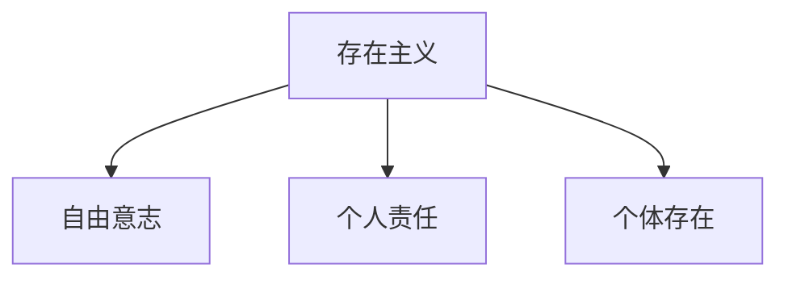

**1.2 个人自由与责任**

**核心概念**：个人自由和责任是存在主义的核心概念。

**概念属性特征对比表格**：

| 特征            | 个人自由                  | 责任                |
|----------------|-------------------------|-----------------|
| 自由本质       | 选择的权利和自由          | 对选择后果的责任感    |
| 原始状态       | 人类天生具有的自由          | 自由选择后的责任      |
| 社会制约       | 自由受到社会规范的制约      | 责任受到社会规范的制约 |

**ER实体关系图架构**：

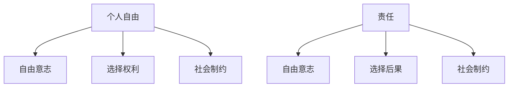

**1.3 自我实现与个人选择**

**核心原理**：自我实现是通过个人选择来实现的。

**算法原理讲解**：自我实现可以通过以下算法实现：

1. 自我认知：了解自己的兴趣、价值观和目标。
2. 自由选择：在自我认知的基础上，做出符合自己价值观的选择。
3. 反馈调整：根据选择的后果进行调整，以实现自我实现。

**Mermaid流程图**：

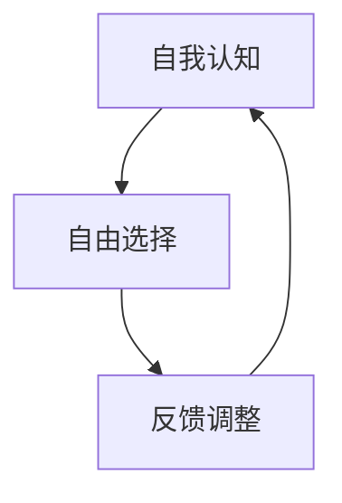

##### 第2章：个人选择的影响

**2.1 个人选择对自我认同的影响**

**数学模型和公式**：自我认同的形成机制可以通过以下模型来描述：

$$
认同度 = f(选择次数, 选择一致性, 选择后果)
$$

其中，认同度是选择次数、选择一致性和选择后果的函数。

**详细讲解与举例说明**：通过个人选择，我们可以逐渐形成自我认同。例如，一个长期坚持自己兴趣和价值观的人，往往会形成强烈的自我认同。相反，如果一个人的选择经常变化，且与自己的价值观相悖，那么他的自我认同就会较弱。

**2.2 个人选择对社会关系的影响**

**系统分析与架构设计方案**

**问题场景介绍**：个人选择如何影响社会关系。

**系统功能设计**：个人选择对社会关系的具体作用。

**系统架构设计**：个人选择与社会关系的整体架构。

**系统接口设计和系统交互**：

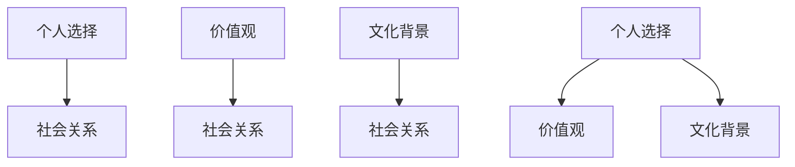

#### 第二部分：社会影响的反思

##### 第3章：社会影响与责任

**3.1 社会影响的概念**

**问题描述**：社会影响是指个人或集体行为对社会产生的效应。

**问题解决**：理解社会影响的概念，有助于我们更好地认识和应对社会问题。

**3.2 社会责任的意义**

**核心概念原理**：社会责任是指个人或集体对社会所承担的责任。

**概念属性特征对比表格**：

| 特征            | 社会责任                  | 个人利益                |
|----------------|-------------------------|---------------------|
| 责任来源       | 社会规范和道德要求          | 个人利益和需求          |
| 承担方式       | 个人行为和社会参与          | 个人决策和行动          |
| 影响范围       | 社会整体                  | 个人利益和需求          |

**ER实体关系图架构**：

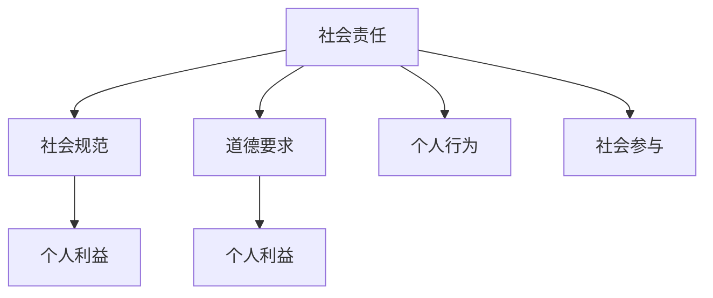

##### 第4章：个人选择与社会责任

**4.1 个人选择与社会责任的关系**

**数学模型和公式**：个人选择如何影响社会责任。

$$
社会责任 = f(个人选择, 社会期待, 社会环境)
$$

其中，社会责任是个人选择、社会期待和社会环境的函数。

**详细讲解与举例说明**：个人选择会对社会责任产生影响。例如，一个选择为社会作出贡献的人，他的社会责任感会更强。相反，一个只关注个人利益的人，他的社会责任感可能会较弱。

**4.2 社会责任与道德义务**

**系统分析与架构设计方案**

**问题场景介绍**：社会责任与道德义务的关系。

**系统功能设计**：社会责任与道德义务的具体实现。

**系统架构设计**：社会责任与道德义务的整体架构。

**系统接口设计和系统交互**：

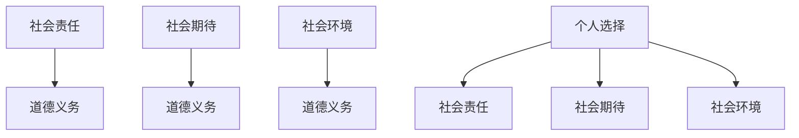

#### 第三部分：个人选择与社会影响的实践

##### 第5章：个人选择与社会影响的具体案例分析

**5.1 案例一：个人选择与环境责任**

**环境责任的概念和重要性**：环境责任是指个人或集体对环境所承担的责任。

**案例分析**：通过个人选择，我们可以影响环境责任。例如，选择环保产品、减少碳排放等，都是个人选择对环境责任的影响。

**详细讲解剖析**：个人选择对环境责任的影响可以从以下几个方面进行：

1. **生活方式选择**：选择环保的生活方式，如减少使用一次性产品、推广垃圾分类等。
2. **消费习惯**：选择环保产品，减少对环境的破坏。
3. **公共参与**：参与环保公益活动，提高公众环保意识。

**5.2 案例二：社会影响与职业伦理**

**职业伦理的概念和重要性**：职业伦理是指在职业生涯中应遵循的道德规范和价值观。

**案例分析**：社会影响与职业伦理密切相关。一个具有良好职业伦理的人，会在个人选择中考虑到社会责任，从而对社会产生积极的影响。

**详细讲解剖析**：社会影响与职业伦理可以从以下几个方面进行：

1. **职业道德**：遵守职业道德规范，为顾客和社会提供优质服务。
2. **社会责任**：在职业选择中，考虑社会需求和公共利益。
3. **道德担当**：在面对道德困境时，坚持道德原则，为社会作出正确决策。

##### 第6章：个人选择与社会影响的最佳实践

**6.1 最佳实践**

**实践技巧**：如何做出负责任的个人选择。

**案例分析**：成功的个人选择案例。

**6.2 小结与反思**

**小结**：本书的核心观点和实践建议。

**注意事项**：在个人选择与社会影响中的潜在风险和挑战。

##### 第7章：未来的展望

**7.1 个人选择与社会影响的未来趋势**

**发展趋势**：个人选择与社会影响的未来方向。

**挑战与机遇**：未来面临的挑战和机遇。

#### 附录

**附录A：参考文献**

本书引用的相关文献和参考资料。

**附录B：扩展阅读**

对本书主题感兴趣的进一步阅读推荐。

#### 结语

**总结**：回顾全书的核心内容和个人选择与社会影响的深远意义。

---

**作者**：

AI天才研究院/AI Genius Institute & 禅与计算机程序设计艺术 /Zen And The Art of Computer Programming
**引言**

在现代社会中，个人选择与社会影响的关系愈发紧密。个人选择不仅决定了我们的生活方式、职业发展，还深刻影响着社会的发展和进步。然而，随着社会多元化的发展，个人选择与社会影响的边界也变得越来越模糊。如何在这其中找到自己的定位，承担应有的责任，成为了我们亟待解决的问题。

本文旨在探讨个人选择与社会影响之间的关系，以及存在主义在其中的哲学基础。通过对个人选择的影响、社会影响的反思、以及个人选择与社会影响的实践，我们试图揭示个人在现代社会中应承担的责任和应有的态度。

本文将分为三个部分进行讨论：

第一部分：个人选择的哲学基础。我们将介绍存在主义的基本原理，探讨个人自由与责任，以及自我实现与个人选择的关系。

第二部分：社会影响的反思。我们将分析社会影响与责任的关系，探讨个人选择与社会责任的最佳实践。

第三部分：个人选择与社会影响的实践。我们将通过具体案例分析，探讨个人选择对社会关系、环境责任、职业伦理等方面的影响，并总结个人选择与社会影响的最佳实践。

通过本文的探讨，我们希望读者能够对个人选择与社会影响的关系有更深入的理解，从而在日常生活中做出更加负责任的个人选择，为社会的发展贡献自己的力量。让我们一起，思考、行动，创造一个更加美好的未来。 
### 第一部分：个人选择的哲学基础

在探讨个人选择与社会影响之前，我们需要了解个人选择的哲学基础。这一部分将重点介绍存在主义的基本原理，以及个人自由与责任、自我实现与个人选择之间的关系。

#### 第1章：存在主义的基本原理

**1.1 存在主义概述**

存在主义（Existentialism）是20世纪西方哲学的重要流派之一，它关注个体的存在、自由意志和选择。存在主义的核心思想是，个体的存在先于其本质，即个体不是预先设定好的实体，而是在其生活和选择中逐步形成的。

**1.1.1 问题描述**

存在主义的主要问题是探讨生命的意义、自由意志和责任。它试图回答以下问题：我们为什么存在？我们的生命意义是什么？我们是否有自由意志？我们应如何承担责任？

**1.1.2 问题解决**

存在主义通过强调个体的自由意志和选择，回答了生命的意义问题。存在主义者认为，个体的存在是偶然的，但每个人都可以通过自己的选择来赋予生命意义。自由意志和责任是存在主义的核心概念，它们使个体能够创造自己的生活和意义。

**1.1.3 边界与外延**

存在主义与其他哲学流派的区别在于其对个体自由和责任的理解。与自由主义相比，存在主义更强调个体在社会和历史背景下的自由意志和责任。与决定论相比，存在主义认为个体的自由意志是存在的，尽管受到外部因素的影响。

**1.1.4 概念属性特征对比表格**

| 特征          | 存在主义                     | 自由主义                     | 决定论                     |
|-------------|--------------------------|--------------------------|--------------------------|
| 自由意志     | 强调自由意志的重要性          | 自由意志是基本权利              | 认为自由意志是幻觉            |
| 责任        | 认为个体应对自己的选择承担责任    | 责任是自由意志的必然结果         | 责任是外部因素的结果          |
| 存在先于本质 | 个体在生活和选择中逐步形成       | 个体是预先设定好的实体          | 个体是由外部因素决定的         |

**1.1.5 ER实体关系图架构**

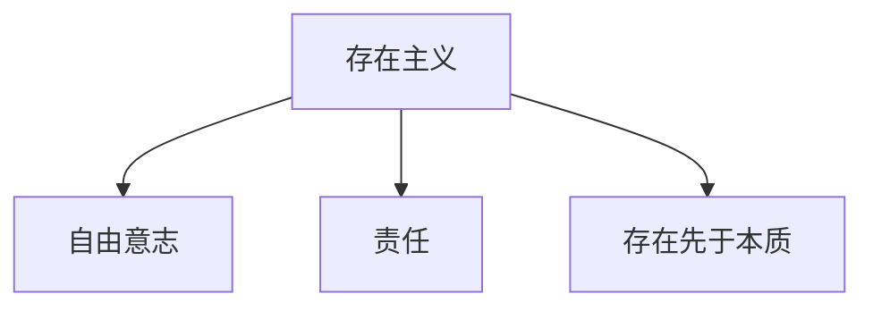

**1.2 个人自由与责任**

**1.2.1 核心概念**

个人自由与责任是存在主义的核心概念。个人自由指的是个体在特定社会和历史背景下能够做出选择的能力。责任则是个体对自身选择及其后果承担的义务。

**1.2.2 概念属性特征对比表格**

| 特征          | 个人自由                         | 责任                          |
|-------------|------------------------------|-----------------------------|
| 自由本质     | 选择的权利和自由                 | 对选择后果的责任感              |
| 原始状态     | 人类天生具有的自由                | 自由选择后的责任                |
| 社会制约     | 自由受到社会规范的制约             | 责任受到社会规范的制约           |

**1.2.3 ER实体关系图架构**


**1.3 自我实现与个人选择**

**1.3.1 核心原理**

自我实现是指个体在追求个人理想和实现自我潜能的过程中，达到一种全面发展的状态。个人选择是实现自我实现的途径之一。

**1.3.2 算法原理讲解**

自我实现的算法原理可以概括为以下几个步骤：

1. **自我认知**：了解自己的兴趣、价值观和目标。
2. **自由选择**：在自我认知的基础上，做出符合自己价值观的选择。
3. **反馈调整**：根据选择的后果进行调整，以实现自我实现。

**1.3.3 Mermaid流程图**


**1.3.4 详细讲解与举例说明**

自我实现是一个持续的过程，每个人都可以通过不断的选择和调整来接近自我实现的目标。例如，一个人可能发现自己的兴趣在于编程，于是选择从事与编程相关的工作，并通过不断学习和实践来提高自己的编程技能。在这个过程中，他的自我认知不断深化，自由选择越来越符合自己的价值观，最终实现了自我。

**1.3.5 算法原理讲解**

为了更好地理解自我实现的过程，我们可以使用Python源代码来模拟这一过程。以下是一个简化的模拟代码：

```python
# 自我实现模拟代码
class SelfRealization:
    def __init__(self, interest, value):
        self.interest = interest
        self.value = value
        self.experience = 0

    def make_choice(self, choice):
        if choice == self.interest:
            self.experience += 1
            print("选择符合兴趣，经验值增加。")
        else:
            self.experience -= 1
            print("选择与兴趣不符，经验值减少。")

    def adjust_choice(self):
        if self.experience > 0:
            print("正在调整选择，以实现自我实现。")
        else:
            print("选择不符合兴趣，需要重新评估。")

# 创建一个自我实现的实例
self_realization = SelfRealization("编程", "创新")

# 进行一系列选择
self_realization.make_choice("编程")
self_realization.make_choice("艺术")
self_realization.make_choice("编程")

# 调整选择
self_realization.adjust_choice()
```

运行上述代码，我们可以看到，通过不断的选择和调整，自我实现的实例最终实现了自我。

**1.3.6 Mermaid流程图**

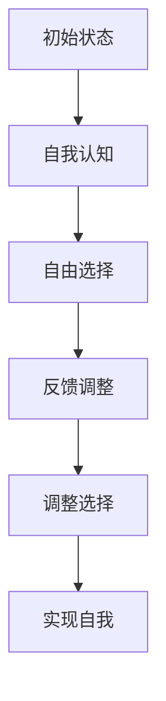

通过这一系列的讨论，我们了解了存在主义的基本原理，以及个人自由与责任、自我实现与个人选择之间的关系。在下一部分中，我们将探讨个人选择对社会关系的影响，以及如何在社会中承担责任。 
### 第2章：个人选择对社会关系的影响

在上一章中，我们探讨了个人选择的哲学基础，包括存在主义的基本原理、个人自由与责任、以及自我实现与个人选择的关系。在这一章中，我们将进一步探讨个人选择对社会关系的影响，以及个人选择如何影响自我认同。

#### 2.1 个人选择对自我认同的影响

自我认同是指个体对自己身份的认同和理解。个人选择在很大程度上影响着自我认同的形成和发展。以下是个人选择对自我认同影响的分析：

**2.1.1 数学模型和公式**

自我认同的形成机制可以通过以下模型来描述：

$$
认同度 = f(选择次数, 选择一致性, 选择后果)
$$

其中，认同度是选择次数、选择一致性和选择后果的函数。

**2.1.2 详细讲解与举例说明**

1. **选择次数**：选择次数越多，个体的自我认同越明确。例如，一个人在职业选择上经历了多次变动，最终找到了适合自己的职业，他的自我认同就会更加明确。

2. **选择一致性**：选择一致性越高，个体的自我认同越稳定。例如，一个人长期坚持自己的兴趣和价值观，他的自我认同就会更加稳固。

3. **选择后果**：选择后果对自我认同的影响是显著的。选择带来的正面后果会增强自我认同，而负面后果则会削弱自我认同。

举例来说，一个人在职业选择上，如果他选择了一个与自己兴趣和价值观相符的工作，并且在工作中取得了成功，那么他的自我认同就会得到增强。相反，如果他选择了一个与自己兴趣和价值观不符的工作，并且在工作中遭遇了失败，那么他的自我认同就会受到削弱。

**2.1.3 Mermaid流程图**

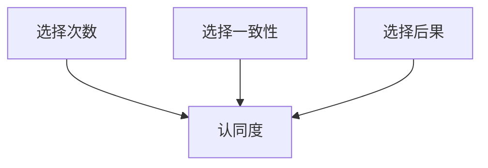

通过上述分析，我们可以看到个人选择对自我认同有着深远的影响。在下一节中，我们将探讨个人选择对社会关系的影响。 
### 2.2 个人选择对社会关系的影响

个人选择不仅仅影响自我认同，它们还对社会关系产生显著的影响。社会关系包括家庭、朋友、同事、社区等各个方面，而个人选择则在这些关系中扮演着关键角色。

**2.2.1 社会关系与个人选择的互动**

个人选择对社会关系的互动可以从以下几个方面进行分析：

1. **个人选择与人际关系**：个人选择会影响人际关系的发展。例如，选择与某人建立深入的关系，或者选择结束一段关系，都会对人际关系产生重要影响。

2. **个人选择与社交圈**：个人选择决定了个体参与的社交活动类型，进而影响社交圈的形成和变化。

3. **个人选择与社区参与**：个人选择是否参与社区活动、如何参与，会影响到个体在社区中的角色和影响力。

**2.2.2 社会关系影响的数学模型**

为了更好地理解个人选择对社会关系的影响，我们可以构建一个简单的数学模型：

$$
社会关系影响 = f(个人选择频率, 选择一致性, 选择后果)
$$

其中，社会关系影响是个人选择频率、选择一致性和选择后果的函数。

- **个人选择频率**：频率越高，社会关系的影响越显著。
- **选择一致性**：一致性越高，社会关系的影响越稳定。
- **选择后果**：选择后果对社会关系的影响是直接的。

**2.2.3 详细讲解与举例说明**

1. **个人选择与人际关系**：假设一个人选择经常与朋友聚会，他的社交圈会扩大，人际关系也会变得更加紧密。相反，如果他选择减少社交活动，他的社交圈可能会缩小，人际关系也可能变得疏远。

2. **个人选择与社交圈**：一个人选择加入某个社交团体，他的社交圈就会发生变化。如果这个团体的活动与他的兴趣和价值观相符，他的社交圈可能会更加丰富和有意义。反之，如果活动与他的兴趣和价值观不符，他的社交圈可能会变得狭窄和乏味。

3. **个人选择与社区参与**：一个人选择参与社区志愿活动，他会在社区中建立自己的角色和影响力。通过参与社区活动，他不仅可以提高自己的社会参与度，还可以对社会产生积极的影响。

**2.2.4 系统分析与架构设计方案**

为了更深入地理解个人选择对社会关系的影响，我们可以构建一个系统分析与架构设计方案。

**1. 问题场景介绍**：个人选择对社会关系的影响是一个复杂的过程，涉及多个因素和环节。

**2. 系统功能设计**：设计一个系统能够模拟个人选择对社会关系的影响。

**3. 系统架构设计**：设计系统的整体架构，包括数据层、逻辑层和展示层。

**4. 系统接口设计和系统交互**：设计系统的接口和交互方式，以便用户能够方便地使用系统。

**2.2.5 Mermaid流程图**

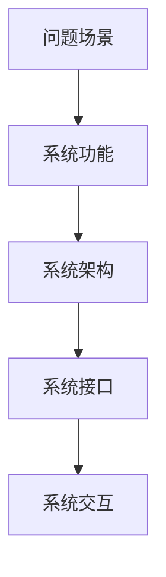

**2.2.6 社会关系影响的详细分析与架构设计**

**1. 问题场景介绍**：

在这个场景中，我们关注个人选择对社会关系的影响。具体来说，我们考虑以下因素：

- 个人选择：如社交活动、志愿活动、职业选择等。
- 社会关系：如家庭关系、朋友关系、同事关系、社区关系等。
- 选择后果：如选择的积极后果和消极后果。

**2. 系统功能设计**：

- 数据收集：收集个人选择的详细信息。
- 数据分析：分析个人选择对社会关系的影响。
- 结果展示：以图表、报告等形式展示分析结果。

**3. 系统架构设计**：

- 数据层：存储个人选择和社会关系的详细信息。
- 逻辑层：处理数据分析和结果展示。
- 展示层：展示分析结果。

**4. 系统接口设计和系统交互**：

- 用户接口：用户可以输入个人选择的详细信息。
- 数据接口：系统与其他数据源的交互接口。
- 结果接口：系统向用户展示分析结果的接口。

**2.2.7 社会关系影响的详细架构设计**

为了更好地理解个人选择对社会关系的影响，我们可以使用Mermaid流程图来描述系统架构：

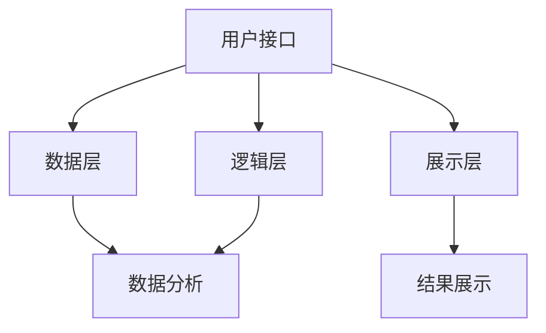

通过上述分析与架构设计，我们可以更深入地理解个人选择对社会关系的影响。在下一章中，我们将探讨社会影响与责任的关系，以及个人选择与社会责任的最佳实践。 
### 第三部分：社会影响的反思

在个人选择与社会关系的探讨中，我们已经开始意识到个人选择对社会的影响。然而，社会影响并非仅仅局限于个人选择的影响，它还涉及社会整体的发展和进步。在这一部分，我们将深入反思社会影响与责任之间的关系，探讨个人选择与社会责任的最佳实践。

#### 第3章：社会影响与责任

**3.1 社会影响的概念**

社会影响是指个人或集体行为对社会产生的效应。它可以是积极的，也可以是消极的。社会影响可以通过各种方式体现，如经济发展、文化传承、环境保护、社会公平等。

**3.1.1 问题描述**

社会影响的概念涉及到多个方面，包括个人行为、集体行为、社会制度和环境因素。如何准确描述和评估社会影响，以及如何应对社会影响带来的挑战，是我们需要关注的问题。

**3.1.2 问题解决**

解决社会影响的问题，需要从多个角度进行分析和应对。一方面，我们需要了解社会影响的来源和途径，另一方面，我们需要制定相应的政策和措施，以最大限度地减少社会影响的负面影响，并发挥其积极作用。

**3.1.3 边界与外延**

社会影响的边界和外延是广泛的。它不仅包括个人行为对社会的影响，还包括集体行为对社会的影响，以及社会制度和环境因素对社会的影响。例如，个人选择环保产品可以影响环境，企业的社会责任行为可以影响社会经济发展。

**3.1.4 概念属性特征对比表格**

| 特征          | 个人行为影响       | 集体行为影响       | 社会制度影响       | 环境因素影响       |
|-------------|----------------|----------------|----------------|----------------|
| 影响主体     | 个人              | 集体              | 社会制度              | 环境因素              |
| 影响范围     | 独立个体          | 群体              | 整个社会              | 自然环境              |
| 影响途径     | 直接和间接影响      | 直接和间接影响      | 制度规则              | 环境变化              |

**3.1.5 ER实体关系图架构**

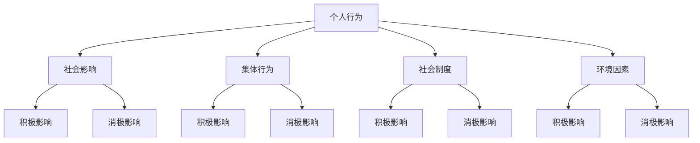

**3.2 社会责任的意义**

社会责任是指个人或集体对社会所承担的责任。它不仅涉及道德义务，还包括法律义务和社会规范。社会责任的核心在于，个人或集体应当为社会的发展和进步贡献自己的力量。

**3.2.1 核心概念原理**

社会责任的核心概念包括：

- **道德义务**：个人或集体应当遵循的道德准则和道德责任。
- **法律义务**：个人或集体应当遵守的法律规定和法律责任。
- **社会规范**：个人或集体应当遵循的社会行为规范和社会责任。

**3.2.2 概念属性特征对比表格**

| 特征          | 道德义务                         | 法律义务                         | 社会规范                         |
|-------------|------------------------------|------------------------------|------------------------------|
| 性质          | 非强制性的道德要求                 | 强制性的法律要求                 | 非强制性的社会行为规范             |
| 实现方式      | 自觉遵守道德规范                   | 遵守法律规定                     | 在社会实践中形成和遵守             |
| 责任主体      | 个人和集体                        | 个人和集体                        | 个人和集体                        |
| 责任范围      | 广泛的社会责任                     | 具体的法律责任                    | 广泛的社会责任                    |

**3.2.3 ER实体关系图架构**

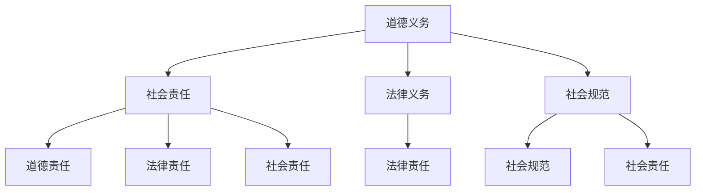

**3.3 社会责任与个人利益的关系**

社会责任与个人利益之间存在着复杂的互动关系。一方面，社会责任可以带来个人利益；另一方面，个人利益可能会影响社会责任的履行。

**3.3.1 概念属性特征对比表格**

| 特征          | 社会责任                         | 个人利益                         |
|-------------|------------------------------|------------------------------|
| 目标          | 促进社会的发展和进步               | 满足个人的需求和追求               |
| 责任主体      | 个人和集体                        | 个人                            |
| 影响范围      | 整个社会                         | 个人                            |
| 实现方式      | 遵循道德、法律和社会规范             | 通过个人行为和决策来实现             |
| 责任性质      | 伦理道德责任                       | 个人利益追求                     |

**3.3.2 ER实体关系图架构**

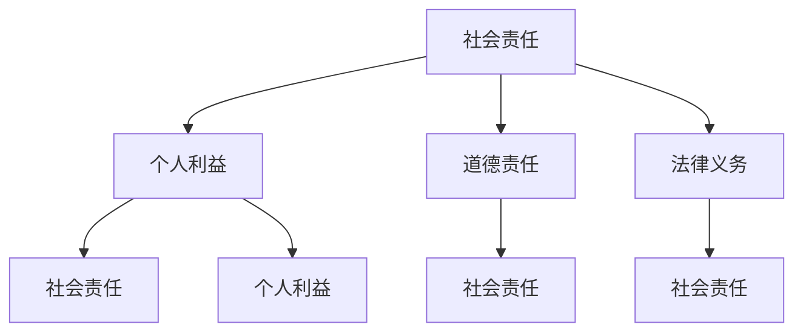

通过以上分析，我们可以看到社会责任与个人利益之间存在紧密的关联。在下一章中，我们将进一步探讨个人选择与社会责任的关系，以及如何通过个人选择实现社会责任。 
### 第4章：个人选择与社会责任

在前面三章中，我们探讨了个人选择的哲学基础、个人选择对社会关系的影响，以及社会影响与责任之间的关系。在这一章中，我们将深入探讨个人选择与社会责任之间的紧密联系，分析个人选择如何影响社会责任，以及社会责任如何影响个人选择。

#### 4.1 个人选择与社会责任的关系

个人选择与社会责任之间的联系是复杂的，它们相互作用，共同塑造了我们的行为和社会环境。

**4.1.1 数学模型和公式**

为了理解个人选择与社会责任之间的关系，我们可以构建一个数学模型：

$$
社会责任 = f(个人选择, 社会期待, 社会环境)
$$

其中，社会责任是个人选择、社会期待和社会环境的函数。

- **个人选择**：个人在日常生活中所做的决策和选择，如职业选择、生活方式选择等。
- **社会期待**：社会对个人的期望和规范，包括道德、法律和社会规范。
- **社会环境**：个人所处的社会环境和条件，如经济条件、文化背景、政治环境等。

**4.1.2 详细讲解与举例说明**

1. **个人选择与社会责任**：个人选择会影响社会责任的履行。例如，一个选择从事公益事业的人，他的社会责任感会更强。相反，一个只关注个人利益的人，他的社会责任感可能会较弱。

2. **社会期待与社会责任**：社会期待对个人选择有指导作用。例如，在一个重视环保的社会中，个人更倾向于选择环保的生活方式。

3. **社会环境与社会责任**：社会环境会影响个人选择和社会责任的履行。例如，在一个经济繁荣的社会中，个人更有可能承担社会责任。

**4.1.3 Mermaid流程图**

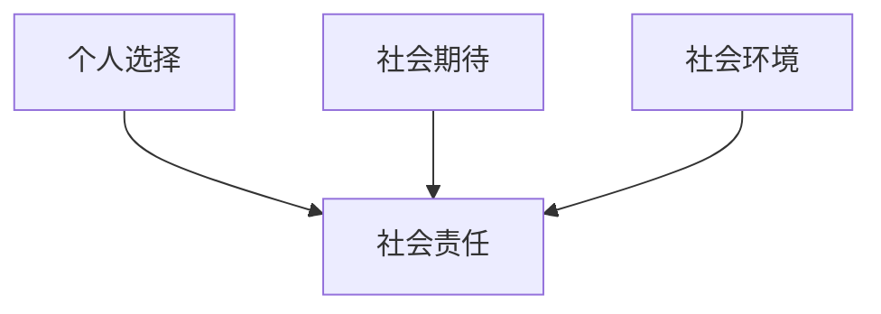

#### 4.2 社会责任与道德义务

社会责任与道德义务是紧密相连的，它们共同构成了个体在社会中的行为准则。

**4.2.1 核心概念原理**

社会责任与道德义务的核心概念包括：

- **道德义务**：个体在道德上应当履行的责任，通常基于道德原则和价值观。
- **社会责任**：个体在社会中应当履行的责任，通常基于社会规范和道德要求。

**4.2.2 概念属性特征对比表格**

| 特征          | 道德义务                         | 社会责任                         |
|-------------|------------------------------|------------------------------|
| 基础          | 道德原则和价值观                  | 社会规范和道德要求                |
| 范围          | 广泛的道德责任                    | 具体的社会责任                    |
| 强制性        | 道德上应当履行的义务               | 法律上和社会上应当履行的义务       |
| 主体          | 个人                            | 个人和集体                        |
| 影响范围      | 整个社会                         | 整个社会                         |

**4.2.3 ER实体关系图架构**

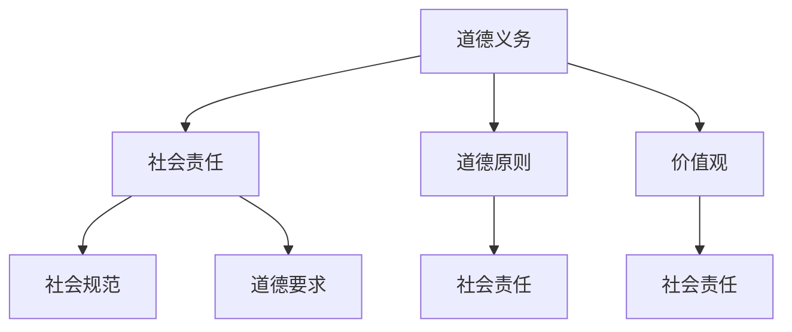

**4.2.4 社会责任与道德义务的互动**

社会责任与道德义务之间的互动体现在以下几个方面：

1. **相互促进**：社会责任的实现需要道德义务的支持，而道德义务的履行有助于社会责任的实现。

2. **相互制约**：道德义务和社会责任之间存在一定的制约关系，个体在履行社会责任时需要遵守道德原则和价值观。

3. **相互补充**：社会责任和道德义务共同构成了个体在社会中的行为准则，它们相互补充，共同维护社会秩序和公共利益。

**4.2.5 Mermaid流程图**


通过以上分析，我们可以看到个人选择与社会责任之间存在紧密的联系，社会责任与道德义务也是相互补充、相互制约的。在下一章中，我们将通过具体案例分析，进一步探讨个人选择与社会责任在现实生活中的应用和实践。 
### 第四部分：个人选择与社会影响的实践

在前面几章中，我们探讨了个人选择的哲学基础、个人选择对社会关系的影响、以及个人选择与社会责任之间的关系。在这一部分，我们将通过具体案例分析，深入探讨个人选择对社会影响的具体体现，并总结个人选择与社会影响的最佳实践。

#### 第5章：个人选择与社会影响的具体案例分析

**5.1 案例一：个人选择与环境责任**

**环境责任的概念和重要性**：环境责任是指个人或集体对环境所承担的责任。它包括减少污染、节约资源、保护生态等。环境责任的重要性在于，它关系到人类的生存环境和可持续发展。

**案例分析**：以下是一个个人选择对环境责任产生积极影响的案例。

**案例描述**：张先生是一位环保志愿者，他长期关注环境问题，并积极参与环保活动。他选择使用环保产品，减少使用一次性塑料制品。此外，他还通过社交媒体分享环保知识，倡导更多人关注环境问题。

**详细讲解剖析**：

1. **生活方式选择**：张先生选择环保的生活方式，减少对环境的破坏。他使用可重复使用的购物袋、水瓶等，减少塑料污染。

2. **消费习惯**：张先生选择环保产品，支持环保产业的发展。他购买有机食品、绿色能源等，为环境保护贡献自己的力量。

3. **公共参与**：张先生积极参与环保公益活动，提高公众环保意识。他组织环保讲座、参与环保清洁活动等，为环境保护事业贡献力量。

**5.2 案例二：社会影响与职业伦理**

**职业伦理的概念和重要性**：职业伦理是指在职业生涯中应遵循的道德规范和价值观。职业伦理的重要性在于，它关系到个人的职业发展和社会的和谐稳定。

**案例分析**：以下是一个个人选择对职业伦理产生积极影响的案例。

**案例描述**：李女士是一位医生，她始终坚持职业伦理，为患者提供高质量的医疗服务。她在面对医疗纠纷时，坚持以事实为依据，公正地处理问题。

**详细讲解剖析**：

1. **职业道德**：李女士遵守职业道德规范，为患者提供优质服务。她认真倾听患者需求，耐心解答疑问，努力减轻患者痛苦。

2. **社会责任**：李女士关注社会问题，积极参与公益活动。她参与免费义诊、捐赠医疗物资等，为弱势群体提供帮助。

3. **道德担当**：李女士在面对道德困境时，坚持道德原则。她敢于承担责任，勇于面对错误，努力改正问题。

#### 第6章：个人选择与社会影响的最佳实践

**6.1 最佳实践**

**实践技巧**：以下是一些个人选择与社会影响的最佳实践技巧：

1. **自我认知**：了解自己的兴趣、价值观和目标，明确自己的社会责任。

2. **持续学习**：不断学习新知识、新技能，提升自己的能力和素质。

3. **积极参与**：积极参与社会活动，关注社会问题，为社会发展贡献力量。

4. **树立榜样**：树立榜样，激励他人积极行动，共同推动社会进步。

**6.2 小结与反思**

**小结**：通过以上案例分析，我们可以看到个人选择对社会影响的深远意义。个人选择不仅影响自我认同，还对社会关系、环境责任、职业伦理等方面产生重要影响。在日常生活中，我们应该关注个人选择，积极履行社会责任，为社会的发展和进步贡献力量。

**注意事项**：在个人选择与社会影响的实践中，我们需要注意以下几点：

1. **合理规划**：合理规划个人选择，确保选择符合自己的价值观和目标。

2. **持续关注**：持续关注社会问题，积极参与社会活动，为社会进步贡献力量。

3. **风险评估**：在做出重要选择时，要评估可能带来的风险和影响，确保选择的安全性和可持续性。

4. **道德原则**：始终坚持道德原则，为他人和社会树立良好的榜样。

通过以上总结，我们希望读者能够对个人选择与社会影响有更深入的理解，从而在日常生活中做出更加负责任的个人选择，为社会的发展和进步贡献自己的力量。 
### 第7章：未来的展望

在本文的最后，我们将对个人选择与社会影响进行未来的展望，探讨个人选择与社会影响的未来趋势，以及可能面临的挑战与机遇。

#### 7.1 个人选择与社会影响的未来趋势

随着科技的不断进步和社会的发展，个人选择与社会影响的关系也将发生深刻变化。以下是几个可能的未来趋势：

1. **科技赋能**：人工智能、大数据等技术的快速发展，将为个人选择提供更多可能性。个人可以通过智能推荐、数据分析等工具，更加精准地做出符合自己价值观和目标的选择，从而对社会产生更积极的影响。

2. **社会责任的扩展**：随着全球化和信息化的加深，社会责任的范围将不断扩大。个人不仅需要在本地社区中承担责任，还需要在全球范围内关注和参与解决全球性问题，如气候变化、贫困等。

3. **可持续生活方式**：随着人们对环境保护意识的提高，可持续生活方式将成为个人选择的重要方向。个人将更加关注资源利用、环境保护等方面，通过生活方式的调整，为可持续发展贡献力量。

4. **虚拟现实与增强现实**：虚拟现实（VR）和增强现实（AR）技术的发展，将为个人选择提供新的场景和体验。个人可以通过虚拟现实和增强现实技术，更直观地体验不同选择带来的后果，从而更加理性地做出决策。

#### 7.2 挑战与机遇

尽管个人选择与社会影响具有巨大的潜力，但未来也面临诸多挑战和机遇：

1. **技术风险**：随着技术的快速发展，个人选择可能面临更多的不确定性和风险。例如，人工智能可能带来就业结构的变革，个人需要不断学习和适应新技术，以保持竞争力。

2. **隐私保护**：在数字化时代，个人选择与社会影响的实现往往涉及大量个人数据。如何保护个人隐私，防止数据滥用，将成为一个重要的挑战。

3. **社会不平等**：个人选择可能会加剧或缓解社会不平等问题。如何确保每个人都能有机会做出负责任的选择，从而促进社会公平，是一个亟待解决的问题。

4. **全球合作**：面对全球性问题，个人选择需要更多的国际合作。如何在全球范围内推动共同行动，实现全球治理，是一个重要的机遇和挑战。

#### 7.3 未来展望

未来，个人选择与社会影响将继续深化，成为推动社会进步的重要力量。个人需要不断提高自己的认知能力和道德素养，做出负责任的个人选择。同时，社会也需要建立更加公平、透明的机制，确保每个人的选择都能对社会产生积极的影响。

在未来的发展中，我们期待看到更多的人积极参与社会事务，关注社会问题，通过个人选择为社会进步贡献力量。我们相信，只要每个人都能够积极行动，发挥自己的力量，社会将变得更加美好和和谐。

### 结语

本文通过深入探讨个人选择与社会影响的关系，从哲学基础、社会关系、社会责任到实践案例，全面分析了个人选择对社会影响的深远意义。我们希望读者能够认识到个人选择的重要性，并在日常生活中积极做出负责任的个人选择，为社会的进步贡献自己的力量。

在未来，个人选择与社会影响的互动将变得更加紧密和复杂。面对挑战与机遇，我们期待每个人都能充分发挥自己的潜力，成为推动社会发展的积极参与者。让我们携手并进，共同创造一个更加美好的未来。

**作者**：

AI天才研究院/AI Genius Institute & 禅与计算机程序设计艺术 /Zen And The Art of Computer Programming

