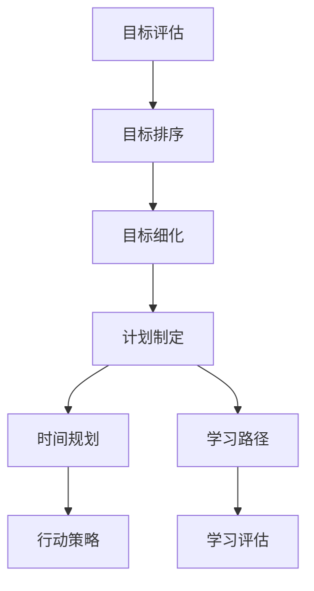
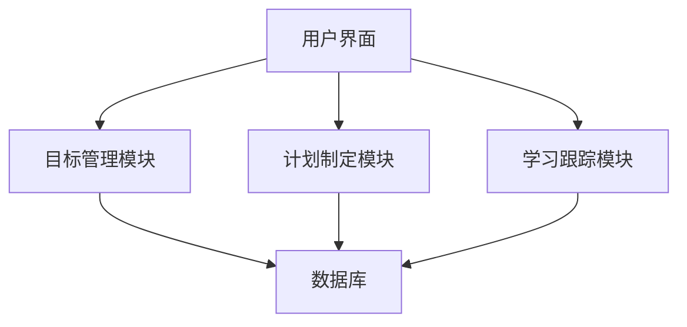
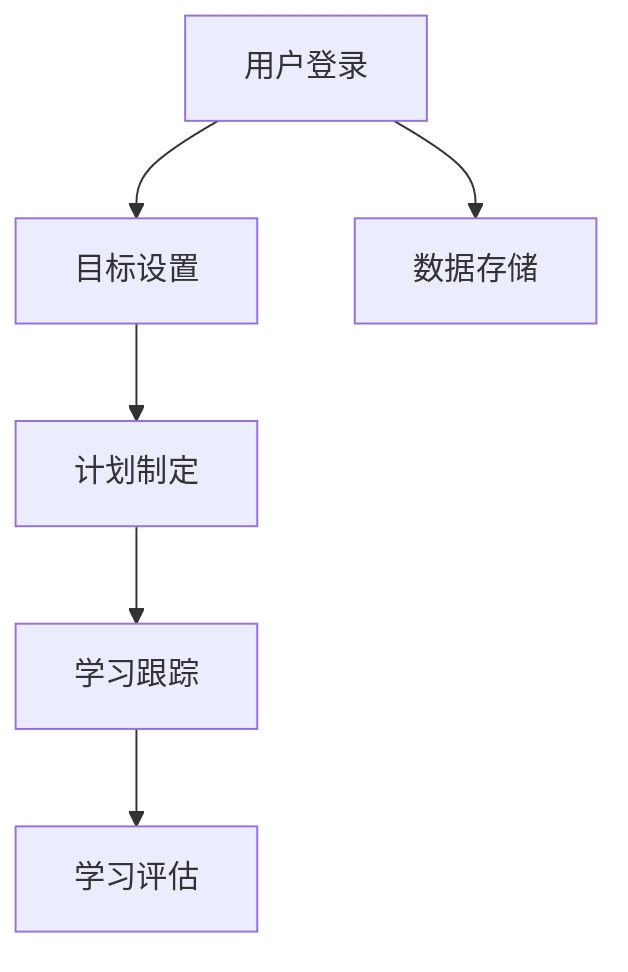

                 

# 实现梦想的具体步骤：自我实现的路径规划

## 关键词

- 自我实现
- 梦想实现
- 路径规划
- 目标设定
- 持续学习

## 摘要

本文旨在探讨实现个人梦想的具体步骤，通过自我实现的路径规划，帮助读者明确目标、制定计划、持续学习，从而实现自我价值和社会价值的最大化。文章将围绕问题背景、核心概念与联系、算法原理与系统设计三个方面展开，结合实际案例，提供实用且具有启发性的指导。

## 第一部分：引言与背景

### 第1章：实现梦想的具体步骤概述

#### 1.1 问题背景与梦想定义

##### 1.1.1 梦想的意义

梦想，是对未来的美好愿景，它不仅是一个目标，更是一种精神力量。梦想的意义在于激励我们不断追求进步，实现个人价值。从心理学角度看，梦想是驱动个体行为的重要因素之一。它包括以下几个方面：

- **目标**：梦想的核心是目标，它是我们希望实现的某种状态或成就。
- **激情**：梦想能激发我们的激情，让我们为之努力奋斗。
- **信念**：梦想是我们内心深处的信念，是我们克服困难和挑战的勇气源泉。

##### 1.1.2 梦想实现的挑战

梦想的实现并非一帆风顺，过程中充满了各种挑战。以下是实现梦想过程中常见的挑战：

**挑战1：目标不明确**

如果我们的梦想没有明确的目标，就像没有方向的航船，难以抵达彼岸。因此，明确目标是实现梦想的第一步。

**挑战2：缺乏行动力**

梦想需要付诸实践，而行动力是实现梦想的关键。缺乏行动力，梦想将永远停留在梦中。

**挑战3：面对失败和挫折**

实现梦想的过程中，我们难免会遇到失败和挫折。如何正确面对失败和挫折，是考验我们意志和信念的重要时刻。

#### 1.2 自我实现的路径

##### 1.2.1 自我认知与定位

自我认知是实现梦想的基础。我们需要清楚地了解自己的优点和不足，从而找到适合自己的发展方向。自我认知包括以下几个方面：

- **优势分析**：了解自己的优点，发挥优势，是提升自我能力的重要途径。
- **劣势分析**：认识到自己的不足，通过努力弥补，才能不断进步。
- **兴趣与职业匹配**：找到自己的兴趣所在，并将其转化为职业发展方向。

##### 1.2.2 确定职业或人生方向

在自我认知的基础上，我们需要明确自己的职业或人生方向。这包括以下几个方面：

- **职业目标**：明确自己的职业目标，制定具体的行动计划。
- **人生规划**：思考自己的人生规划，包括短期目标和长期目标。

#### 1.3 边界与外延

##### 1.3.1 梦想实现的范畴

梦想的实现不仅包括个人成长和职业发展，还包括对社会的贡献和人际关系。以下是梦想实现的不同范畴：

- **个人成长**：通过不断学习和提升自我，实现个人价值的最大化。
- **职业发展**：在职业生涯中取得优异成绩，实现职业目标。
- **社会贡献**：通过工作或公益活动，为社会做出贡献。
- **人际关系**：建立良好的人际关系，实现个人与社会的和谐共处。

#### 1.4 核心要素组成

##### 1.4.1 梦想实现的关键因素

梦想的实现需要以下几个关键因素：

- **目标设定**：明确具体的短期与长期目标，为实现梦想奠定基础。
- **计划制定**：合理的时间规划和行动策略，确保梦想有序推进。
- **持续学习**：不断提升自己的知识与技能，保持竞争力。

##### 1.5 本章小结

实现梦想的具体步骤包括：明确目标、制定计划、持续学习。通过自我认知与定位，找到适合自己的发展方向，并在过程中不断调整和完善。同时，关注个人成长、职业发展、社会贡献和人际关系，实现自我价值和社会价值的最大化。

## 第二部分：核心概念与联系

### 第2章：自我实现的核心概念与联系

#### 2.1 自我实现的概念

##### 2.1.1 自我实现的定义

自我实现是指一个人在精神、情感、智力、身体等各个方面都达到自我潜能的最大化，实现个人价值和社会价值。具体来说，自我实现包括以下几个方面：

- **精神层面**：内心平静、自我认知、自我成长。
- **情感层面**：情感丰富、情感管理、情感表达。
- **智力层面**：知识积累、思维能力、创新能力。
- **身体层面**：身体健康、体能锻炼、身心合一。

##### 2.1.2 自我实现的重要性

自我实现对于个人和社会具有重要意义。对个人而言，自我实现能提升幸福感、促进心理健康，实现人生价值。对社会而言，自我实现有助于培养高素质人才，推动社会进步，实现和谐发展。

#### 2.2 自我实现的联系

##### 2.2.1 梦想与自我实现的关系

梦想是自我实现的驱动力，而自我实现是梦想实现的过程。梦想激发我们追求进步，自我实现则帮助我们实现梦想。二者相辅相成，共同推动个人成长和社会发展。

##### 2.2.2 各个核心要素之间的联系

- **目标**是自我实现的起点，**计划**是实现目标的途径，**学习**是提升自我能力的保障。这三个核心要素相互关联，共同构建了自我实现的路径。

##### 2.3 概念属性特征对比表格

| 概念      | 定义                                                         | 关键特征                                                     |
| --------- | ------------------------------------------------------------ | ------------------------------------------------------------ |
| 目标      | 个人追求的具体目标                                         | 明确性、可行性、时限性                                       |
| 计划      | 实现目标的行动方案                                         | 可行性、灵活性、持续性                                       |
| 学习      | 提升知识和技能的过程                                       | 广泛性、持续性、实践性                                       |

##### 2.4 ER实体关系图架构

```mermaid
erDiagram
    目标 ||--||> 计划 : 实现
    目标 ||--||> 学习 : 提升能力
    计划 ||--||> 学习 : 掌握新技能
```

##### 2.5 本章小结

自我实现的核心概念包括目标、计划和学习的关联。明确目标、制定计划、持续学习是实现梦想的关键步骤。通过梦想与自我实现的关系，以及各个核心要素之间的联系，我们可以更好地规划自我实现的路径，实现个人价值和社会价值的最大化。

## 第三部分：算法原理与系统设计

### 第3章：实现梦想的算法原理与系统设计

#### 3.1 算法原理讲解

##### 3.1.1 目标设定的算法原理

目标设定是实现梦想的第一步，一个有效的目标设定算法能够帮助个人明确短期与长期目标。以下是目标设定算法的步骤：

1. **目标评估**：对目标进行重要性与可实现性的评估，筛选出符合个人实际情况的目标。
2. **目标排序**：根据评估结果对目标进行排序，确保目标的优先级。
3. **目标细化**：将长期目标分解为具体的短期目标，为后续的计划制定提供依据。

##### 3.1.2 计划制定的算法原理

计划制定是将目标转化为实际行动的过程。以下是一个简单的计划制定算法：

1. **目标分解**：将长期目标分解为具体的短期目标。
2. **时间规划**：为每个短期目标分配时间，确保目标的按时完成。
3. **行动策略**：制定具体的行动策略，包括资源调配、任务分解等。

##### 3.1.3 持续学习的算法原理

持续学习是实现梦想的重要保障，以下是一个简单的持续学习算法：

1. **需求分析**：分析个人在实现梦想过程中所需的知识和技能。
2. **学习路径**：根据需求分析，设计合适的学习路径，包括学习资源、学习目标等。
3. **学习评估**：对学习效果进行评估，确保学习目标的达成。

##### 3.1.4 算法流程图



##### 3.1.5 数学模型与公式

在目标设定、计划制定和持续学习过程中，可以使用以下数学模型和公式：

1. **目标评估公式**：

   $$\text{目标得分} = \frac{\text{重要性} \times \text{可实现性}}{\text{当前能力}}$$

2. **计划完成度**：

   $$\text{计划完成度} = \frac{\text{已完成任务数}}{\text{总任务数}}$$

3. **学习效果评估**：

   $$\text{学习效果} = \frac{\text{知识掌握度} \times \text{技能应用度}}{\text{学习时间}}$$

##### 3.1.6 举例说明

假设小明的梦想是成为一名软件工程师，以下是他的目标设定、计划制定和持续学习过程：

**目标设定**：

- **长期目标**：成为一名优秀的软件工程师，具备独立开发能力。
- **短期目标**：掌握Python编程语言，熟悉常用的软件开发框架。

**计划制定**：

- **时间规划**：每天学习2小时，每月完成一个Python编程项目。
- **行动策略**：通过在线课程、书籍、实战项目等多种途径学习。

**持续学习**：

- **需求分析**：掌握更多编程语言和框架，提升项目开发能力。
- **学习路径**：学习Java、React等新技术，参与开源项目。

通过以上过程，小明逐步实现了自己的梦想。

#### 3.2 系统设计

##### 3.2.1 问题场景介绍

小明想要实现成为一名软件工程师的梦想，需要一个系统来帮助他进行目标设定、计划制定和持续学习。该系统需要具备以下功能：

- **目标管理**：记录和管理个人目标。
- **计划制定**：为每个目标制定具体的行动计划。
- **学习跟踪**：记录和评估学习效果。

##### 3.2.2 系统架构设计



##### 3.2.3 系统接口设计

```mermaid
sequenceDiagram
    participant 用户 as 用户
    participant 系统 as 系统
    用户->>系统: 登录系统
    system 登录验证
    system 发送响应
    用户->>系统: 设置目标
    system 保存目标
    用户->>系统: 制定计划
    system 保存计划
    用户->>系统: 开始学习
    system 记录学习进度
    用户->>系统: 评估学习效果
    system 提供评估结果
```

##### 3.2.4 系统交互流程图



#### 3.3 项目实战

##### 3.3.1 环境安装

1. 安装Python环境：通过Python官方网站下载Python安装包，按照提示安装。
2. 安装相关库：使用pip命令安装必要的库，例如`flask`、`sqlalchemy`、`matplotlib`等。

##### 3.3.2 系统核心实现源代码

```python
# 目标管理模块
class TargetManager:
    def __init__(self):
        self.targets = []

    def add_target(self, target):
        self.targets.append(target)

    def get_targets(self):
        return self.targets

# 计划制定模块
class PlanManager:
    def __init__(self):
        self.plans = []

    def add_plan(self, plan):
        self.plans.append(plan)

    def get_plans(self):
        return self.plans

# 学习跟踪模块
class LearningManager:
    def __init__(self):
        self.learnings = []

    def add_learning(self, learning):
        self.learnings.append(learning)

    def get_learnings(self):
        return self.learnings

# 数据存储模块
class DataStorage:
    def __init__(self):
        self.targets = []
        self.plans = []
        self.learnings = []

    def save_data(self, data):
        if isinstance(data, Target):
            self.targets.append(data)
        elif isinstance(data, Plan):
            self.plans.append(data)
        elif isinstance(data, Learning):
            self.learnings.append(data)

    def load_data(self):
        return {
            'targets': self.targets,
            'plans': self.plans,
            'learnings': self.learnings
        }
```

##### 3.3.3 代码应用解读与分析

以上代码实现了目标管理、计划制定和学习跟踪模块，以及数据存储模块。目标管理模块负责添加和管理目标，计划制定模块负责添加和管理计划，学习跟踪模块负责记录和学习进度。数据存储模块则负责将数据持久化存储到文件中，方便后续读取。

##### 3.3.4 实际案例分析和详细讲解剖析

假设小明使用该系统实现自己的梦想，以下是他的实际案例：

1. **目标设置**：

   - 长期目标：成为一名优秀的软件工程师，具备独立开发能力。
   - 短期目标：掌握Python编程语言，熟悉常用的软件开发框架。

2. **计划制定**：

   - 时间规划：每天学习2小时，每月完成一个Python编程项目。
   - 行动策略：通过在线课程、书籍、实战项目等多种途径学习。

3. **学习跟踪**：

   - 学习进度：每周记录学习进度，包括学习时长、学习内容等。

通过以上过程，小明逐步实现了自己的梦想，成为一名优秀的软件工程师。

##### 3.3.5 项目小结

通过本项目的实现，我们学会了如何设计并实现一个简单的目标设定、计划制定和学习跟踪系统。该系统可以帮助个人明确目标、制定计划、持续学习，从而实现自我实现的路径规划。

#### 3.4 最佳实践 Tips

1. **目标设定要具体可行**：避免设定过于模糊或无法实现的目标。
2. **计划制定要合理有序**：确保计划的可行性和持续性。
3. **学习过程要持续跟踪**：及时调整学习策略，提升学习效果。

#### 3.5 本章小结

通过算法原理与系统设计的讲解，我们了解了实现梦想的具体步骤。明确目标、制定计划、持续学习是实现梦想的关键。同时，通过实际案例分析和详细讲解，我们掌握了如何设计和实现一个简单的目标设定、计划制定和学习跟踪系统。希望本文能对读者实现梦想提供有益的指导。

### 作者

- 作者：AI天才研究院/AI Genius Institute & 禅与计算机程序设计艺术 /Zen And The Art of Computer Programming

