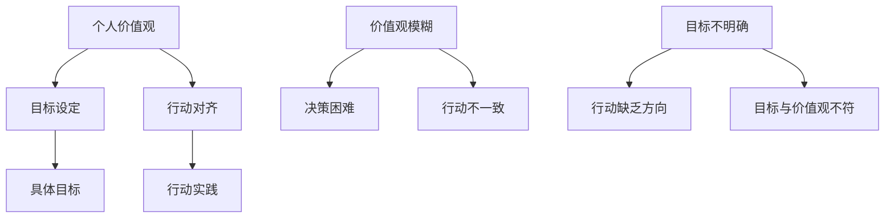
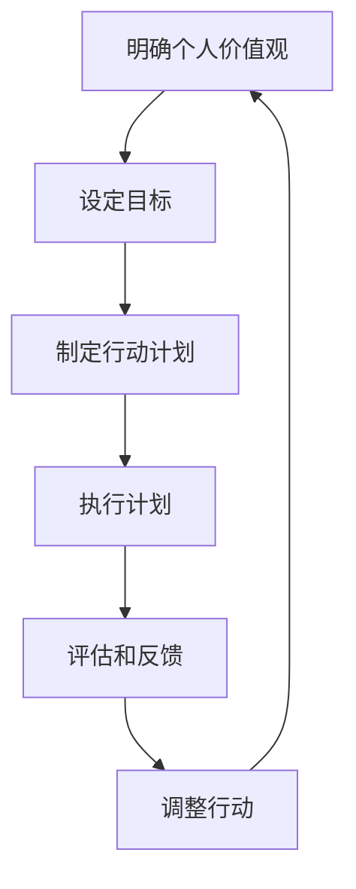
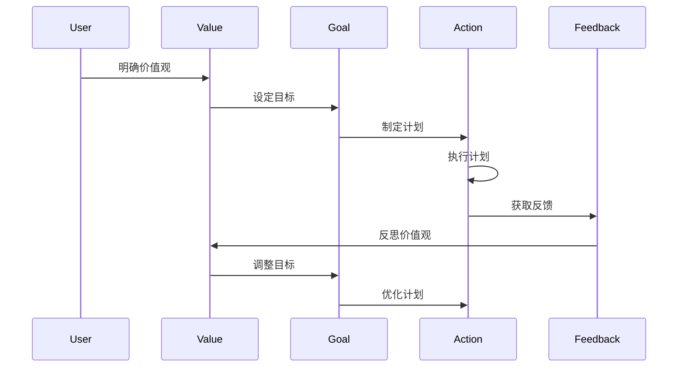
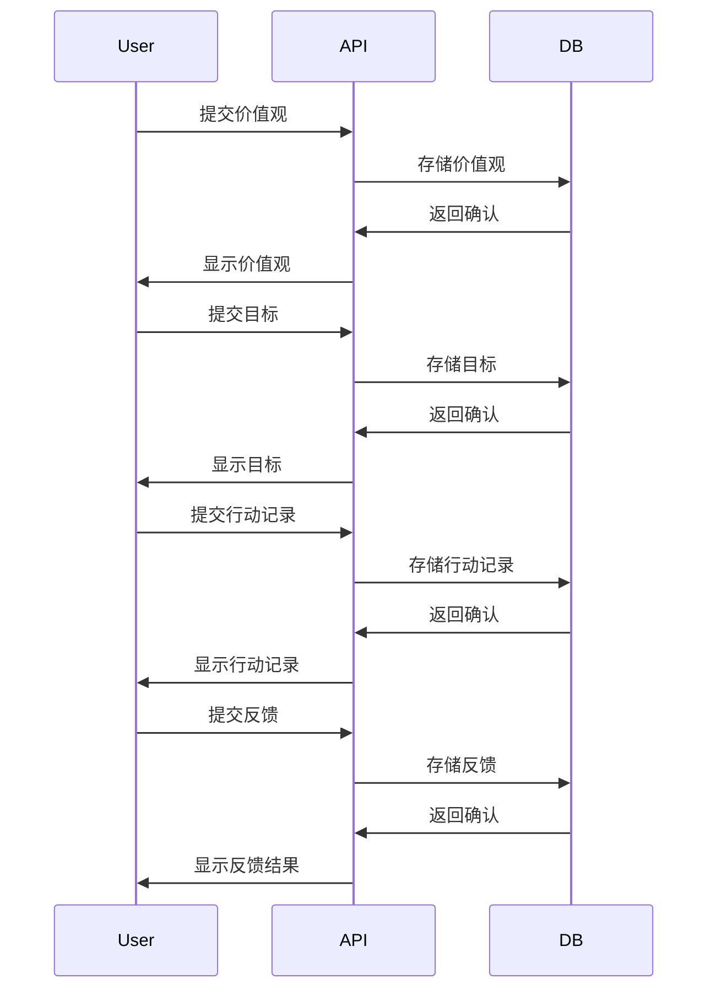

                 

## 第1章: 引言与背景

### 1.1 问题背景

在现代社会，个人价值观的缺失和行动的不一致成为了许多人的困扰。个人价值观是指个人对于人生、事业、人际关系等方面的基本信念和态度，而行动则是指个人的实际行为表现。将个人价值观与行动对齐，即确保个人的行为与价值观保持一致，对于个人的成长和幸福感具有重要意义。

首先，我们需要明确什么是个人价值观。个人价值观并非一成不变，而是随着个人成长、环境和经历的变化而逐渐形成的。它们是个人内心深处对于事物的重要性的判断和偏好，决定了个人在生活和工作中如何行动和决策。比如，有些人可能更重视家庭和人际关系，而有些人可能更追求事业成就和个人成长。

其次，行动与价值观的不一致可能导致多种问题。例如：

- **价值观模糊**：当个人对自己的价值观缺乏清晰的认识时，很难作出符合自己内心的决策，容易受到外界因素的影响。
- **行动不一致**：即使有明确的价值观，但个人可能在实际行动中偏离这些价值观，导致内心的矛盾和不安。
- **目标设定不明确**：个人可能没有设定清晰、具体的目标，或者目标与价值观不符，导致行动缺乏方向和动力。

### 1.2 问题描述

许多人在日常生活中常常面临以下问题：

#### 1.2.1 价值观模糊

价值观模糊是许多人在成长过程中都会遇到的问题。由于缺乏自我认知和外部引导，人们可能对自己的价值观缺乏清晰的认识，导致在行动中难以作出决策。例如，一个人可能在面对职业选择时，因为不清楚自己真正想要的是什么，而盲目跟从他人的建议，结果导致内心不满和职业倦怠。

#### 1.2.2 行动不一致

即使个人已经有了明确的价值观，但在实际行动中，仍可能因为种种原因而偏离这些价值观。例如，一个人可能认为诚实和正直是非常重要的价值观，但在工作中却因为竞争压力而选择说谎或欺骗，导致内心的矛盾和不安。

#### 1.2.3 目标设定不明确

目标设定不明确是另一个常见问题。许多人可能没有设定清晰、具体的目标，或者设定的目标与自己的价值观不符，导致行动缺乏方向和动力。例如，一个人可能设定了一个追求高收入的职业目标，但这个目标与自己的价值观相悖，结果导致在实现目标的过程中感到痛苦和不满。

### 1.3 问题解决

本书旨在帮助读者解决上述问题，通过以下方法实现个人价值观与行动的对齐：

#### 1.3.1 明确个人价值观

首先，我们需要通过自我反思和倾听他人的反馈，明确自己的核心价值观。这可以通过写日记、提问自己、参加价值观访谈等方式实现。明确个人价值观有助于在决策时保持一致性，避免因价值观模糊而导致的困惑和矛盾。

#### 1.3.2 设定符合价值观的目标

其次，我们需要结合个人价值观，设定具体、可执行的目标。目标应具有明确的方向和可衡量性，以便在实现过程中不断调整和优化。设定符合价值观的目标有助于在行动中保持一致性，避免因目标设定不明确而导致的行动缺乏方向和动力。

#### 1.3.3 行动与价值观的匹配

最后，我们需要通过日常实践和反思，确保行动与价值观保持一致。这可以通过制定行动计划、定期审视价值观和目标、以及调整行动策略来实现。在日常实践中，我们应时刻提醒自己遵循核心价值观，避免因行动不一致而导致的内心矛盾和不安。

### 1.4 边界与外延

#### 1.4.1 边界

本书主要关注个人层面的问题，即个人如何将价值观与行动对齐。这包括自我认知、目标设定和行动匹配等方面。

#### 1.4.2 外延

虽然本书主要关注个人层面的问题，但所介绍的方法和思路也可以应用于组织、团队等层面，帮助更多人实现价值观与行动的对齐。例如，在团队管理中，可以通过建立共同的价值观和目标，确保团队成员的行动与团队价值观保持一致。

### 1.5 概念结构与核心要素组成

#### 1.5.1 核心概念

- **个人价值观**：指个人对于事物的重要性的判断和偏好。
- **目标设定**：指根据个人价值观设定的具体、可执行的目标。
- **行动对齐**：指确保个人的行动与价值观保持一致。

#### 1.5.2 概念属性特征对比表格

| 概念        | 属性特征               | 对比               |
|-------------|-----------------------|--------------------|
| 个人价值观  | 内心深处的判断和偏好   | 对个人决策有指导作用 |
| 目标设定    | 具体可执行的目标       | 为行动提供方向      |
| 行动对齐    | 行动与价值观保持一致   | 避免内心矛盾和不安   |

#### 1.5.3 概念结构与核心要素组成

- **核心概念**：个人价值观、目标设定、行动对齐。
- **概念属性特征对比表格**：列出个人价值观、目标设定、行动对齐之间的区别和联系。



### 1.6 本章小结

本章介绍了本书的核心问题和解决思路，为后续章节的内容奠定了基础。读者在阅读后续章节时，可以结合自身实际情况，逐步实现个人价值观与行动的对齐。### 第2章: 明确个人价值观

在实现个人价值观与行动的对齐过程中，明确个人价值观是至关重要的一步。明确个人价值观有助于我们在决策过程中保持一致性，从而避免因价值观模糊而导致的困惑和矛盾。在本章中，我们将探讨如何通过自我反思、倾听他人反馈和塑造调整价值观等方法，逐步明确个人价值观。

#### 2.1 个人价值观的重要性

个人价值观是个人内心深处对于事物的重要性的判断和偏好，它决定了个人在生活和工作中如何行动和决策。一个清晰的价值观不仅有助于我们在纷繁复杂的环境中做出明智的决策，还能为我们的行动提供明确的方向。以下是明确个人价值观的一些重要性：

1. **决策指导**：明确的价值观可以帮助我们在面对选择时，快速判断哪个选项更符合我们的内心需求，从而做出明智的决策。
2. **行为准则**：价值观可以作为我们的行为准则，确保我们在实际行动中遵循内心的信念，避免因外界压力或诱惑而违背自己的原则。
3. **个人成长**：明确的价值观有助于我们反思自己的行为和决策，从而在不断成长和进步中实现个人价值。
4. **人际关系**：明确的价值观有助于我们在人际交往中建立一致性和信任，从而建立更加稳固的人际关系。

#### 2.2 确定个人价值观的方法

为了明确个人价值观，我们可以采用以下几种方法：

##### 2.2.1 自我反思

自我反思是通过深入思考和审视自己的行为、决策和经历，从而识别出自己在不同情境下所持有的价值观。以下是一些自我反思的方法：

1. **写日记**：记录每天的经历和感受，分析自己在面对不同情境时的反应和决策。
2. **提问自己**：
    - “我最看重的是什么？”
    - “我在人生中最重要的目标和愿望是什么？”
    - “我在哪些情境下感到最满意和最失落？”

通过自我反思，我们可以更清晰地了解自己的内心需求和价值观。

##### 2.2.2 倾听他人的反馈

倾听他人的反馈是通过与他人交流，了解他人对自己的看法和评价，从而更全面地认识自己的价值观。以下是一些倾听他人反馈的方法：

1. **寻求亲友的建议**：向亲友询问他们对自己的看法，特别是他们在哪些方面认为自己的行为与价值观相符或不相符。
2. **参加价值观访谈**：参加专门的价值观访谈活动，通过与专家和志愿者的交流，深入了解自己的价值观。

##### 2.2.3 塑造和调整价值观

通过自我反思和他人反馈，我们可以识别出需要调整的价值观，并逐步塑造符合自己内心真实的价值观。以下是一些塑造和调整价值观的方法：

1. **制定价值观清单**：列出自己的核心价值观，并对其进行排序，确定最重要的价值观。
2. **定期审视价值观**：定期审视和调整自己的价值观，确保它们与个人目标和当前生活状态保持一致。

#### 2.3 实例分析

为了更好地理解如何明确个人价值观，我们来看两个实例：

##### 2.3.1 案例一：小李的价值观调整

小李在大学期间对自己的价值观进行了深入反思，发现自己在学业、人际关系和职业规划等方面存在困惑。通过与亲友的交流，他意识到自己对家庭和友谊的重视程度不够，需要调整自己的价值观。

- **原价值观**：重视学业成绩，忽视人际关系。
- **调整后价值观**：平衡学业和人际关系，重视家庭和友谊。

通过调整价值观，小李在学业和人际关系上取得了更好的平衡，生活更加充实和满意。

##### 2.3.2 案例二：小王的价值观重塑

小王在工作中发现自己在面对压力和挑战时，常常倾向于逃避和放弃，这让他感到内心的矛盾和不安。通过自我反思和与心理咨询师的交流，他意识到自己的价值观过于消极，需要重塑。

- **原价值观**：逃避挑战，追求安逸。
- **重塑后价值观**：面对挑战，勇敢尝试，追求成长。

通过重塑价值观，小王在工作中的表现逐渐提升，内心也变得更加坚定和自信。

#### 2.4 小结

明确个人价值观是实现个人价值观与行动对齐的重要一步。通过自我反思、倾听他人反馈和塑造调整价值观，我们可以逐步明确自己的核心价值观。在明确了价值观后，我们可以更好地设定符合价值观的目标，并确保行动与价值观保持一致。在接下来的章节中，我们将继续探讨如何设定符合价值观的目标，以及如何通过日常实践和反思，确保行动与价值观保持一致。### 第3章: 设定符合价值观的目标

在明确了个人价值观之后，下一步就是设定符合这些价值观的目标。设定明确、具体和可实现的目标对于确保个人行动与价值观一致至关重要。在本章中，我们将探讨如何通过设定具体、可执行的目标，确保目标与个人价值观保持一致。

#### 3.1 设定目标的步骤

设定目标是一个系统性的过程，包括以下几个步骤：

##### 3.1.1 确定目标方向

首先，我们需要根据个人价值观确定目标的方向。例如，如果个人的核心价值观包括健康、家庭和事业，那么目标的方向可能包括健康饮食、家庭活动安排和职业发展。

##### 3.1.2 设定具体目标

具体的目标应该明确、具体和可衡量。例如，而不是说“我想更健康”，可以设定“我将在接下来的六个月内减重10公斤”。

##### 3.1.3 制定行动计划

为了确保目标的实现，我们需要制定详细的行动计划。这包括具体的行动步骤、执行时间和责任人。

##### 3.1.4 审视和调整

在实施目标的过程中，我们需要定期审视和调整目标，确保它们与我们的价值观和当前生活状态保持一致。

#### 3.2 如何确保目标与价值观一致

确保目标与价值观一致是设定目标的关键。以下是一些策略：

1. **价值导向的思考**：在设定目标时，始终将个人价值观放在首位，确保目标符合这些价值观。
2. **价值观清单**：使用个人价值观清单作为参考，确保每个目标都与至少一个核心价值观相符。
3. **定期审视**：定期审视目标和行动，确保它们与价值观保持一致。如果有偏离，及时调整。

#### 3.3 实例分析

##### 3.3.1 案例一：小张的职业目标设定

小张的核心价值观包括成就感、社会责任和健康。他的职业目标是在五年内成为一家公司的CTO。

- **价值观**：成就感、社会责任、健康。
- **目标方向**：成为一家公司的CTO。
- **具体目标**：
  - **第一年**：掌握关键技术，提升自己在团队中的影响力。
  - **第二年**：领导一个重要的项目，为公司创造显著价值。
  - **第三年**：建立良好的团队合作关系，提升团队的绩效。
  - **第四年**：制定公司的技术战略，推动公司的长期发展。
  - **第五年**：成为公司的CTO。

通过设定具体的目标，小张能够逐步实现自己的职业目标，同时确保每个目标都与他的价值观保持一致。

##### 3.3.2 案例二：小王的健康目标设定

小王的核心价值观包括健康、家庭和快乐。他的健康目标是在接下来的六个月内减重10公斤。

- **价值观**：健康、家庭、快乐。
- **目标方向**：减重10公斤。
- **具体目标**：
  - **第一月**：每天进行30分钟的有氧运动，减少高热量食物摄入。
  - **第二月**：增加力量训练，每周进行3次，控制饮食摄入。
  - **第三月**：进行有氧运动和力量训练相结合，每周进行5次，控制饮食。
  - **第四月**：维持运动和饮食计划，每周进行2次力量训练，保持运动习惯。
  - **第五月**：定期测量体重，调整饮食和运动计划，确保体重持续下降。
  - **第六月**：庆祝减重成功，制定新的健康目标。

通过设定具体的目标，小王能够有效地实现自己的健康目标，同时确保每个目标都与他的价值观保持一致。

#### 3.4 小结

设定符合价值观的目标是确保个人行动与价值观一致的关键步骤。通过明确目标方向、设定具体目标、制定行动计划和定期审视调整，我们可以确保目标与我们的价值观保持一致。在实现目标的过程中，我们不仅能够实现个人成长，还能提升幸福感和满足感。在下一章中，我们将探讨如何通过日常实践和反思，确保行动与价值观保持一致。### 第4章: 行动与价值观的匹配

在明确了个人价值观和设定了符合价值观的目标之后，下一步就是通过日常实践和反思，确保我们的行动与价值观保持一致。这一过程需要持续的努力和自我约束，以确保我们在面对日常挑战和诱惑时，能够保持内心的坚定和一致性。

#### 4.1 实践与反思的重要性

实践和反思是确保行动与价值观一致的关键环节。通过实践，我们能够将价值观转化为具体的行动，并在实际行动中检验和调整这些价值观。反思则帮助我们总结经验，发现不足，从而在未来的行动中做得更好。

1. **实践**：将价值观融入日常行动，使其成为生活习惯。例如，如果我们的核心价值观包括诚实和正直，我们可以通过在工作和生活中坚持说真话、遵守承诺来实践这一价值观。
   
2. **反思**：定期审视自己的行为和决策，评估它们是否符合我们的价值观。通过反思，我们可以发现自己的盲点和不足，从而在未来的行动中更加谨慎和明智。

#### 4.2 如何确保行动与价值观一致

以下是一些方法，可以帮助我们确保日常行动与价值观一致：

##### 4.2.1 制定行动计划

为了确保行动与价值观一致，我们可以制定详细的行动计划。行动计划应该包括具体的行动步骤、执行时间和责任人。以下是一个简单的行动计划模板：

- **目标**：明确要实现的目标。
- **行动步骤**：列出实现目标所需的具体行动步骤。
- **执行时间**：为每个行动步骤设定具体的执行时间。
- **责任人**：明确每个行动步骤的责任人。

##### 4.2.2 坚持记录

坚持记录自己的行动和决策，可以帮助我们更好地反思和调整。我们可以使用日记、笔记应用或专门的行动记录工具来记录自己的行动。

##### 4.2.3 定期评估

定期评估自己的行动和决策是否符合价值观。可以通过自我评估、他人反馈或定期回顾来评估。以下是一个简单的评估模板：

- **行为评估**：评估自己的行为是否符合价值观。
- **决策评估**：评估自己的决策是否符合价值观。
- **改进计划**：根据评估结果，制定改进计划，确保在未来的行动中做得更好。

##### 4.2.4 设定触发器

设定触发器可以帮助我们在特定情境下保持行动与价值观一致。触发器可以是提醒、提醒事项或特定的仪式。例如，我们可以在每天早上起床时，默念自己的核心价值观，以此来提醒自己保持一致性。

##### 4.2.5 建立支持系统

建立支持系统可以帮助我们在实现目标的过程中保持动力和一致。支持系统可以包括家人、朋友、同事或专业的导师。他们可以提供反馈、鼓励和支持，帮助我们克服挑战和困难。

#### 4.3 实例分析

##### 4.3.1 案例一：小赵的行动匹配

小赵的核心价值观包括责任、学习和成长。为了确保行动与价值观一致，他制定了以下行动计划：

- **目标**：在接下来的一年中，通过在线课程和自学，掌握新的技能。
- **行动步骤**：
  - **每周学习时间**：每周至少安排10小时的学习时间。
  - **学习内容**：根据个人兴趣和职业发展需求，选择相关的在线课程和教材。
  - **每周复盘**：每周进行一次复盘，总结学习成果和不足，并调整学习计划。
- **执行时间**：每天晚上安排1小时的集中学习时间，其余时间灵活安排。
- **责任人**：小赵本人负责执行和学习计划。

通过坚持记录和定期评估，小赵能够确保自己的行动与价值观一致，并在实现目标的过程中不断成长。

##### 4.3.2 案例二：小刘的行动匹配

小刘的核心价值观包括健康、家庭和快乐。为了确保行动与价值观一致，他制定了以下行动计划：

- **目标**：在接下来的六个月内，减重10公斤，并保持健康的生活习惯。
- **行动步骤**：
  - **饮食计划**：每天控制热量摄入，减少高热量食物和甜食的摄入。
  - **运动计划**：每天进行30分钟的有氧运动，每周进行3次力量训练。
  - **睡眠计划**：每晚保持7-8小时的充足睡眠。
  - **每周复盘**：每周进行一次复盘，评估饮食、运动和睡眠计划，并根据需要进行调整。
- **执行时间**：每天晚上制定第二天的饮食、运动和睡眠计划。
- **责任人**：小刘本人负责执行和监督计划。

通过坚持记录和定期评估，小刘能够确保自己的行动与价值观一致，并在实现目标的过程中保持健康和快乐。

#### 4.4 小结

通过日常实践和反思，我们能够确保行动与价值观保持一致。制定行动计划、坚持记录、定期评估、设定触发器和建立支持系统等方法，可以帮助我们在实现目标的过程中保持内心的坚定和一致性。在下一章中，我们将探讨如何在更广泛的背景下，将个人价值观与行动对齐，包括在团队和组织中的实践。### 第5章: 团队与组织中的价值观对齐

在明确了个人价值观并确保个人行动与价值观一致后，我们还需要考虑如何在团队和组织中实现价值观的对齐。团队和组织是由多个个体组成的整体，每个成员的价值观和行为都会对整体产生影响。因此，确保团队和组织中的价值观对齐，对于实现共同目标、提升团队凝聚力和促进组织发展具有重要意义。

#### 5.1 团队价值观对齐的重要性

团队价值观对齐有助于以下方面的提升：

1. **协作效率**：当团队成员的价值观相同时，他们更容易理解彼此的期望和需求，从而提高协作效率。
2. **团队凝聚力**：共同的价值观可以增强团队成员之间的信任和尊重，提升团队凝聚力。
3. **决策一致性**：价值观对齐有助于在决策过程中保持一致性，减少冲突和误解。
4. **组织文化**：团队价值观对齐有助于形成积极、健康的企业文化，促进组织长期发展。

#### 5.2 如何在团队中实现价值观对齐

以下是一些方法，可以帮助团队实现价值观对齐：

##### 5.2.1 明确团队价值观

首先，团队需要明确共同的价值观。这可以通过以下步骤实现：

1. **讨论和共识**：组织团队讨论，共同确定团队的价值观，并达成共识。
2. **价值观文档**：将团队的价值观整理成文档，以便团队成员随时查阅。
3. **价值观宣传**：通过内部通讯、会议和其他渠道，宣传团队的价值观，确保每个成员都了解和认同。

##### 5.2.2 实践和强化

在明确了团队价值观后，团队需要通过实际行动来强化这些价值观。以下是一些实践和强化的方法：

1. **价值观培训**：组织价值观培训，帮助团队成员理解和内化团队的价值观。
2. **榜样示范**：团队成员应该以身作则，通过自己的行为来展示团队的价值观。
3. **奖励机制**：建立奖励机制，奖励那些在实际行动中体现团队价值观的成员。

##### 5.2.3 定期回顾和调整

团队价值观不是一成不变的，随着外部环境和内部情况的变化，团队价值观也需要进行调整。以下是一些定期回顾和调整的方法：

1. **定期讨论**：定期组织团队讨论，评估团队的价值观是否仍然符合当前需求，是否需要调整。
2. **收集反馈**：鼓励团队成员提供反馈，了解他们的意见和建议，以便更好地调整价值观。
3. **价值观更新**：根据讨论和反馈，对团队的价值观进行更新和优化。

#### 5.3 组织中的价值观对齐

在组织层面，实现价值观对齐需要更高层次的协调和策略。以下是一些方法，可以帮助组织实现价值观对齐：

##### 5.3.1 明确组织愿景和使命

组织需要明确自己的愿景和使命，这将为组织的价值观提供方向和指导。组织的愿景和使命应该与团队成员的个人价值观相一致。

##### 5.3.2 建立核心价值观

组织需要建立一套核心价值观，并确保这些价值观在整个组织范围内得到广泛传播和认同。核心价值观应该反映组织的核心价值观和行为准则。

##### 5.3.3 融入日常运营

组织的价值观应该融入日常运营，从招聘、培训、绩效评估到员工关怀等方面，确保价值观得到贯彻和执行。

##### 5.3.4 领导示范

组织的领导者应该以身作则，通过自己的行为来展示组织的价值观，成为团队成员的榜样。

#### 5.4 实例分析

##### 5.4.1 案例一：谷歌的价值观对齐

谷歌是一家以创新、开放和客户至上为核心价值观的公司。为了实现价值观对齐，谷歌采取了以下措施：

- **明确价值观**：谷歌将“不做坏事”作为核心价值观之一，确保公司在创新的同时，遵守道德和法律规范。
- **价值观培训**：谷歌定期组织价值观培训，帮助员工理解和内化公司的价值观。
- **领导示范**：谷歌的领导层以身作则，通过自己的行为展示公司的价值观，成为员工的榜样。

通过这些措施，谷歌成功地将价值观融入公司文化，并在全球范围内取得了巨大成功。

##### 5.4.2 案例二：强生的价值观对齐

强生是一家以患者关怀、社会责任和道德行为为核心价值观的公司。为了实现价值观对齐，强生采取了以下措施：

- **明确价值观**：强生将“关爱人类”作为核心价值观，确保公司在所有业务领域都致力于改善人类健康。
- **价值观宣传**：强生通过内部通讯、会议和外部宣传，广泛传播公司的价值观。
- **社会责任项目**：强生积极参与社会责任项目，将价值观融入公司的社会责任行动中。

通过这些措施，强生成功地将价值观融入公司文化，并在全球范围内赢得了良好的声誉。

#### 5.5 小结

在团队和组织中实现价值观对齐是一个持续的过程，需要明确价值观、实践和强化、定期回顾和调整，以及领导示范。通过这些方法，团队和组织可以确保成员的行为与价值观保持一致，从而提高协作效率、团队凝聚力，并促进组织发展。在下一章中，我们将探讨如何应对价值观与行动不匹配的挑战。### 第6章: 应对价值观与行动不匹配的挑战

在实现个人价值观与行动对齐的过程中，难免会遇到各种挑战和障碍。这些挑战可能来自外部环境、内部心理因素，或两者兼而有之。有效应对这些挑战，有助于我们更好地保持行动与价值观的一致性。以下是一些常见的挑战以及应对策略：

#### 6.1 外部环境的挑战

**1. 社会压力和期望**

社会压力和期望可能会使个人感到压力，迫使其做出与价值观不符的决策。例如，在职场中，为了升职或获得认可，个人可能会选择违背自己的价值观。

**应对策略**：
- **坚持自我**：明确自己的核心价值观，并在面对压力时坚持自己的原则。
- **寻求支持**：与亲友、同事或专业人士交流，寻求他们的支持和理解。

**2. 经济压力**

经济压力可能是导致行动与价值观不匹配的主要原因之一。为了维持生活或满足基本需求，个人可能会被迫做出与价值观不符的决策。

**应对策略**：
- **平衡需求与价值观**：尝试在满足基本需求的同时，兼顾自己的价值观。
- **寻求解决方案**：寻找降低经济压力的途径，如兼职工作、节省开支等。

#### 6.2 内部心理因素

**1. 恐惧和不确定性**

恐惧和不确定性可能使个人在面对挑战时退缩，无法按照自己的价值观行动。例如，担心失败、害怕改变等。

**应对策略**：
- **面对恐惧**：正视自己的恐惧，并尝试理解恐惧的来源。
- **逐步行动**：从小事做起，逐步克服恐惧，建立自信心。

**2. 内心冲突**

内心冲突可能源于个人价值观与实际行为之间的矛盾。这种冲突会导致内心的焦虑和不安。

**应对策略**：
- **自我反思**：深入了解内心的冲突，并尝试找到解决方法。
- **寻求专业帮助**：如果内心冲突严重，可以寻求心理咨询师的帮助。

#### 6.3 应对策略

**1. 设定明确的目标**

设定明确的目标有助于我们在行动中保持方向和动力。明确的目标应具有可衡量性和可实现性，同时符合我们的价值观。

**2. 建立支持系统**

建立支持系统，包括家人、朋友、同事或专业人士，可以在我们遇到挑战时提供帮助和支持。支持系统可以帮助我们克服困难，保持行动与价值观一致。

**3. 定期反思和调整**

定期反思和调整自己的行动和决策，确保它们与价值观保持一致。这有助于我们在面对变化和挑战时，迅速做出调整。

**4. 保持耐心和毅力**

实现个人价值观与行动对齐是一个长期的过程，需要耐心和毅力。在遇到挑战时，保持冷静和坚定，不断调整自己的行动策略。

#### 6.4 实例分析

**案例一：小李的挑战**

小李是一位职场新人，他的核心价值观包括诚实和正直。然而，在工作中，他经常面临同事和领导的压力，迫使其做出与价值观不符的决策。

**应对策略**：
- **坚持自我**：小李通过坚持自己的核心价值观，拒绝了同事和领导的压力。
- **寻求支持**：小李与亲友交流，获得了他们的理解和支持。
- **调整行动策略**：小李尝试通过提高工作效率和质量，获得了领导的认可，从而减轻了压力。

**案例二：小王的挑战**

小王是一位创业者，他的核心价值观包括创新和客户至上。然而，在市场竞争激烈的情况下，他面临着降低产品质量、压缩成本的诱惑。

**应对策略**：
- **平衡需求与价值观**：小王在满足基本需求的同时，努力保持产品质量。
- **寻求解决方案**：小王通过优化供应链和提升效率，降低了成本，同时保持了产品质量。
- **保持耐心和毅力**：小王在面临挑战时，保持耐心和毅力，坚信自己的价值观和决策是正确的。

#### 6.5 小结

在实现个人价值观与行动对齐的过程中，我们可能会遇到各种挑战和障碍。通过设定明确的目标、建立支持系统、定期反思和调整，以及保持耐心和毅力，我们可以更好地应对这些挑战。在下一章中，我们将探讨如何在生活中持续地将个人价值观与行动对齐。### 第7章: 持续地实现个人价值观与行动对齐

将个人价值观与行动对齐是一个持续的过程，需要我们在日常生活中不断地进行调整和优化。以下是一些建议，帮助我们在生活中持续地实现个人价值观与行动对齐：

#### 7.1 定期审视和调整

1. **每周反思**：每周花时间反思自己的行为和决策，评估它们是否符合自己的价值观。可以记录在日记中，或与亲友分享。
2. **每月总结**：每月总结自己的行为和决策，检查是否达到了设定的目标，并根据实际情况进行调整。
3. **年度回顾**：每年进行一次全面的回顾，评估自己在实现个人价值观方面的进步和不足，制定下一年的目标和计划。

#### 7.2 寻求反馈和指导

1. **家人和朋友**：向家人和朋友寻求反馈，了解他们对自己的看法，特别是在价值观与行动对齐方面。
2. **专业人士**：寻求专业人士的指导，如心理咨询师、教练等，他们可以提供专业的建议和策略。

#### 7.3 保持耐心和毅力

1. **认识到变化是正常的**：价值观和行动对齐是一个持续的过程，需要时间和努力。认识到变化是正常的，不要因为一时的挫折而放弃。
2. **保持积极心态**：保持积极的心态，相信自己能够实现目标，并从中获得成长。

#### 7.4 实践和反思

1. **小步骤实践**：将个人价值观融入日常生活，通过小步骤实践，逐步形成习惯。
2. **定期反思**：在实践过程中，定期反思自己的行为和决策，检查是否符合价值观，并根据需要进行调整。

#### 7.5 建立支持系统

1. **家人和朋友**：建立稳固的家人和朋友支持系统，他们可以在你遇到困难时提供帮助和支持。
2. **社区和团体**：参与社区和团体活动，与他人分享经验和心得，共同成长。

#### 7.6 持续学习和成长

1. **自我提升**：通过学习新知识、培养新技能，不断提升自己的能力和素质。
2. **反思和改进**：在学习过程中，不断反思自己的不足，并努力改进，以更好地实现个人价值观。

#### 7.7 案例分享

以下是一些成功的案例，展示了如何持续地将个人价值观与行动对齐：

**案例一：小张的成长之路**

小张是一位创业者，他的核心价值观包括创新、诚信和客户至上。在创业初期，他面临了巨大的压力和挑战，但他始终坚持自己的价值观。

- **实践**：通过实际行动，将核心价值观融入公司文化和运营中。
- **反思**：定期反思自己的行为和决策，确保符合核心价值观。
- **成长**：不断学习和改进，提升自己的能力和素质。

**案例二：小王的职业转型**

小王是一位工程师，他的核心价值观包括责任感、学习和成长。在职业转型过程中，他面临了许多困难和挑战。

- **坚持**：坚持自己的价值观，拒绝短视的诱惑，专注于长期发展。
- **调整**：根据实际情况，调整目标和策略，确保行动与价值观一致。
- **支持**：寻求家人和朋友的帮助和支持，共同度过难关。

#### 7.8 小结

持续地实现个人价值观与行动对齐需要耐心、毅力和不断的努力。通过定期审视和调整、寻求反馈和指导、保持耐心和毅力、实践和反思、建立支持系统以及持续学习和成长，我们可以更好地实现个人价值观与行动对齐，提升个人的成长和幸福感。### 第8章: 结论

通过本文的探讨，我们可以明确地将个人价值观与行动对齐的重要性凸显出来。在当今复杂多变的社会环境中，个人价值观不仅是我们内心的指南，更是我们在面临各种决策和挑战时的支撑。将个人价值观与行动对齐，不仅有助于我们在职业生涯和个人生活中做出更明智的选择，还能够提升我们的幸福感和满足感。

首先，明确个人价值观是整个过程的起点。通过自我反思和倾听他人反馈，我们可以更清晰地了解自己的内心需求和信仰。这为我们的目标设定提供了明确的方向，使我们的行动更有意义。

其次，设定符合价值观的目标是我们将价值观转化为具体行动的关键步骤。通过具体、可执行的目标，我们可以为行动提供明确的指引，确保我们的行动与价值观保持一致。

最后，通过日常实践和反思，我们能够确保行动与价值观的持续对齐。在日常生活中，我们需要时刻提醒自己遵循核心价值观，同时通过建立支持系统和定期审视目标，不断调整和优化我们的行动策略。

在此，我们需要强调的是，将个人价值观与行动对齐是一个持续的过程。它不仅需要我们在日常生活中坚持不懈地努力，还需要我们时刻保持耐心和毅力。在面对挑战和困难时，我们要坚信自己的价值观，并从中汲取力量。

总之，将个人价值观与行动对齐是实现个人成长和幸福感的重要途径。通过明确价值观、设定目标、实践和反思，我们能够在不断变化的环境中保持内心的坚定和一致性，实现人生的目标和梦想。

### 拓展阅读

- **《成功的秘密：个人价值观与实践指南》**：作者汤姆·霍普金斯，详细介绍了如何通过明确个人价值观和设定目标，实现个人成长和成功。
- **《智慧行动：价值观与实践》**：作者史蒂芬·柯维，提供了关于如何将价值观融入日常生活和工作的实用策略。

希望本文能为您的个人成长和价值观实践提供有益的启示和指导。作者：AI天才研究院/AI Genius Institute & 禅与计算机程序设计艺术/Zen And The Art of Computer Programming。感谢您的阅读！## 附录

### 附录A: 核心概念与联系

在本篇技术博客中，我们讨论了多个核心概念，并分析了它们之间的联系。以下是这些核心概念的详细解释及其相互关系的概述。

#### 个人价值观

个人价值观是指个人在内心深处对于事物的重要性的判断和偏好。它是我们行为的驱动力，决定了我们在生活中如何做出决策。个人价值观通常包括道德观、人生观、事业观等，它们是我们在生活中坚守的原则。

#### 目标设定

目标设定是指根据个人价值观设定的具体、可执行的目标。目标是行动的方向，是实现个人价值观的具体路径。通过设定明确的目标，我们可以更好地规划行动，确保我们的行为与价值观保持一致。

#### 行动对齐

行动对齐是指确保个人的行为与价值观保持一致。通过行动对齐，我们能够确保在实现目标的过程中，不会偏离自己的核心价值观。行动对齐需要我们在日常生活中不断实践和反思，以确保我们的行为始终符合我们的价值观。

### 核心概念与联系对比表格

| 概念         | 描述                                                         | 关系                    |
|--------------|--------------------------------------------------------------|------------------------|
| 个人价值观   | 个人对于事物的重要性的判断和偏好                             | 基础：目标设定的依据，行动对齐的指导原则 |
| 目标设定     | 根据个人价值观设定的具体、可执行的目标                       | 实现：连接价值观与行动的桥梁          |
| 行动对齐     | 确保个人的行为与价值观保持一致                             | 维持：确保行动符合核心价值观        |

### 附录B: 概念属性特征对比表格

以下是一个详细对比个人价值观、目标设定和行动对齐之间属性特征和区别的表格。

| 概念         | 属性特征                                                       | 区别                 | 联系                |
|--------------|----------------------------------------------------------------|---------------------|---------------------|
| 个人价值观   | - 内心深处的判断和偏好<br>- 多维度（如道德、人生、事业）<br>- 主观性             | 描述个人信念和偏好 | 为目标设定提供指导 |
| 目标设定     | - 具体和明确<br>- 可执行<br>- 有明确的时间框架<br>- 可衡量性           | 指引行动方向       | 实现价值观         |
| 行动对齐     | - 行动与价值观一致<br>- 反思和调整<br>- 持续实践                   | 保持一致性         | 确保实践效果       |

### 附录C: ER实体关系图架构

以下是使用Mermaid绘制的ER（实体关系）图，展示了个人价值观、目标设定和行动对齐之间的实体关系。

```mermaid
erDiagram
  用户 ||--o{ 个人价值观 }--|| 用户
  用户 ||--o{ 目标设定 }--|| 用户
  用户 ||--o{ 行动对齐 }--|| 用户
  个人价值观 ||--o{ 目标设定 }--||>
  目标设定 ||--o{ 行动对齐 }--||>
```

在这个ER图中，用户是主体，而个人价值观、目标设定和行动对齐则是与之相关的实体。箭头表示实体之间的关系，其中个人价值观影响目标设定，目标设定指导行动对齐。这些关系确保了个人价值观通过目标设定转化为具体的行动，并通过行动对齐得到实践。

### 附录D: 算法原理与流程图

在将个人价值观与行动对齐的过程中，算法原理和流程图可以帮助我们更好地理解和实施这一过程。以下是一个简化的算法原理和对应的Mermaid流程图。

#### 算法原理：

1. **明确个人价值观**：通过自我反思和他人反馈，识别核心价值观。
2. **设定目标**：根据核心价值观，设定具体、可执行的目标。
3. **制定行动计划**：将目标分解为具体步骤，并为每个步骤设定时间表。
4. **执行计划**：按照行动计划执行，并在过程中不断反思和调整。
5. **评估和反馈**：定期评估行动效果，获取反馈，并根据反馈调整行动。

#### Mermaid流程图：



在这个流程图中，每个节点代表一个步骤，箭头表示步骤之间的逻辑关系。通过这个流程图，我们可以清晰地看到将个人价值观与行动对齐的步骤和循环过程。

### 附录E: 系统分析与架构设计

在更广泛的背景下，将个人价值观与行动对齐可以被视为一个复杂的系统。以下是系统分析与架构设计的概述。

#### 系统功能设计（领域模型）

领域模型用于表示系统的核心功能和实体。以下是使用Mermaid绘制的领域模型类图。

```mermaid
classDiagram
  User <<class>> User
  Value <<class>> Value
  Goal <<class>> Goal
  Action <<class>> Action
  Feedback <<class>> Feedback

  User  --|>| Value
  User  --|>| Goal
  User  --|>| Action
  User  --|>| Feedback

  Value  --|>| Goal
  Goal  --|>| Action
  Action  --|>| Feedback
```

在这个类图中，User（用户）是主体，与Value（价值观）、Goal（目标）、Action（行动）和Feedback（反馈）相关联。这些实体共同构成了个人价值观与行动对齐的系统。

#### 系统架构设计

系统架构设计描述了系统的整体结构和组件之间的交互方式。以下是使用Mermaid绘制的系统架构图。



在这个序列图中，用户通过一系列步骤（明确价值观、设定目标、制定计划、执行计划、获取反馈、反思价值观、调整目标、优化计划）实现个人价值观与行动的对齐。每个步骤都涉及不同的实体和交互。

### 附录F: 系统接口设计和系统交互

系统接口设计和系统交互描述了系统内部组件之间的通信机制。以下是使用Mermaid绘制的系统交互图。



在这个交互图中，用户通过API（应用程序接口）与数据库（DB）交互，提交和获取价值观、目标、行动记录和反馈。API作为中介，确保数据的存储和检索，同时为用户提供了友好的界面。

### 附录G: 项目实战

在本附录中，我们将通过一个实际的项目实战来展示如何将个人价值观与行动对齐的方法应用到实践中。以下是一个简单的项目实施步骤和源代码分析。

#### 项目名称：价值观行动追踪器（VAT）

#### 项目目标：

- 为用户提供一个平台，帮助他们明确个人价值观、设定目标、执行计划和获取反馈。
- 实现一个用户友好的前端界面和后端API，以便用户可以轻松地管理自己的价值观和行动。

#### 环境安装：

1. 安装Node.js（用于后端API）
2. 安装MongoDB（用于存储数据）
3. 安装前端框架（如React或Vue.js）

#### 系统核心实现源代码

以下是VAT项目的后端API实现的核心部分，使用Python和Flask框架。

```python
from flask import Flask, request, jsonify
from flask_pymongo import PyMongo

app = Flask(__name__)
app.config["MONGO_URI"] = "mongodb://localhost:27017/vat_db"
mongo = PyMongo(app)

# 存储用户价值观
@app.route('/values', methods=['POST'])
def add_value():
    value = request.json['value']
    mongo.db.values.insert_one({"user_id": "user123", "value": value})
    return jsonify({"status": "success", "message": "Value added"})

# 获取用户价值观
@app.route('/values', methods=['GET'])
def get_values():
    values = list(mongo.db.values.find({"user_id": "user123"}))
    return jsonify(values)

# 存储用户目标
@app.route('/goals', methods=['POST'])
def add_goal():
    goal = request.json['goal']
    mongo.db.goals.insert_one({"user_id": "user123", "goal": goal})
    return jsonify({"status": "success", "message": "Goal added"})

# 获取用户目标
@app.route('/goals', methods=['GET'])
def get_goals():
    goals = list(mongo.db.goals.find({"user_id": "user123"}))
    return jsonify(goals)

# 存储用户行动记录
@app.route('/actions', methods=['POST'])
def add_action():
    action = request.json['action']
    mongo.db.actions.insert_one({"user_id": "user123", "action": action})
    return jsonify({"status": "success", "message": "Action added"})

# 获取用户行动记录
@app.route('/actions', methods=['GET'])
def get_actions():
    actions = list(mongo.db.actions.find({"user_id": "user123"}))
    return jsonify(actions)

# 存储用户反馈
@app.route('/feedback', methods=['POST'])
def add_feedback():
    feedback = request.json['feedback']
    mongo.db.feedback.insert_one({"user_id": "user123", "feedback": feedback})
    return jsonify({"status": "success", "message": "Feedback added"})

# 获取用户反馈
@app.route('/feedback', methods=['GET'])
def get_feedback():
    feedback = list(mongo.db.feedback.find({"user_id": "user123"}))
    return jsonify(feedback)

if __name__ == "__main__":
    app.run(debug=True)
```

#### 代码应用解读与分析

上述代码实现了VAT项目的后端API，主要包括以下几个部分：

1. **价值观管理**：`add_value` 和 `get_values` 函数用于添加和获取用户的价值观。
2. **目标管理**：`add_goal` 和 `get_goals` 函数用于添加和获取用户的目标。
3. **行动记录管理**：`add_action` 和 `get_actions` 函数用于添加和获取用户的行动记录。
4. **反馈管理**：`add_feedback` 和 `get_feedback` 函数用于添加和获取用户的反馈。

这些API函数通过MongoDB存储和检索数据，为前端界面提供了数据交互的接口。用户可以通过这些API实现价值观的明确、目标的设定、行动的执行和反馈的获取，从而实现对个人价值观与行动的对齐。

通过上述代码和架构设计，VAT项目提供了一个实用的平台，帮助用户在日常生活中不断实践和调整个人价值观，确保行动与价值观的一致性。这不仅有助于个人的成长和幸福感，还能够为组织和社会的和谐发展做出贡献。

### 实际案例分析和详细讲解剖析

在本节中，我们将通过一个实际案例来展示如何将个人价值观与行动对齐的方法应用到实践中，并提供详细的讲解和分析。

#### 案例背景

假设有一个名叫小张的年轻人，他刚刚从大学毕业，进入了一家初创公司工作。小张的核心价值观包括创新、团队合作和自我提升。他的职业目标是成为一名优秀的软件工程师，并在未来几年内成为团队的核心成员。

#### 案例步骤

**1. 明确个人价值观**

小张首先通过自我反思和与亲友的交流，明确了他的核心价值观。他将这些价值观记录在日记中，并定期回顾，确保这些价值观始终是他决策和行动的指导原则。

**2. 设定目标**

基于他的核心价值观，小张设定了一系列短期和长期目标：

- **短期目标**：掌握Python编程语言，并在三个月内完成一个个人项目。
- **长期目标**：在五年内成为公司软件团队的核心成员，并在业界有一定的影响力。

**3. 制定行动计划**

为了实现这些目标，小张制定了详细的行动计划：

- **掌握Python**：每天学习1小时Python，每周进行一次编程练习。
- **个人项目**：在三个月内完成一个能够解决实际问题的Python项目。
- **团队成长**：积极参与团队会议和项目讨论，提出建设性意见，并在一年内成为团队的技术骨干。

**4. 执行计划**

小张严格按照行动计划执行，每天坚持学习Python，并在周末完成编程练习。他积极参与团队项目，并提出了一些改进方案，受到了团队成员的认可。

**5. 反馈和调整**

在执行计划的过程中，小张定期与上级和同事交流，获取他们的反馈。根据反馈，他不断调整自己的行动策略，优化学习方法和工作方式。

**6. 总结和反思**

在一年后，小张完成了他的个人项目，并成为团队的技术骨干。他意识到自己的价值观和行动已经得到了很好的对齐，这使他在职业生涯中取得了显著的进步。

#### 案例分析

**1. 个人价值观的明确**

小张通过自我反思和与他人的交流，明确了自己的核心价值观。这一步骤是至关重要的，因为只有明确了核心价值观，我们才能在行动中保持一致。

**2. 设定具体目标**

小张的目标设定非常具体和明确。短期目标和长期目标的设定，帮助他清晰地看到了自己的发展方向，并为行动提供了具体的指引。

**3. 制定行动计划**

小张的行动计划详细且可执行。他每天的学习计划和每周的编程练习，确保了他能够持续进步。同时，他积极参与团队项目，不断提升自己的技能和经验。

**4. 定期反馈和调整**

小张在执行计划的过程中，定期与上级和同事交流，获取反馈。这一步骤使他能够及时了解自己的不足，并不断调整行动策略。

**5. 总结和反思**

在实现目标的过程中，小张不断总结和反思，确保自己的行动与价值观保持一致。这使他能够在职业生涯中稳步前进，并取得了显著的成就。

#### 案例总结

通过这个案例，我们可以看到，将个人价值观与行动对齐是一个系统性的过程，包括明确价值观、设定目标、制定行动计划、执行计划、反馈和调整，以及总结和反思。只有通过不断地实践和调整，我们才能实现个人价值观与行动的对齐，实现个人成长和职业发展。

### 项目小结

在实施价值观行动追踪器（VAT）项目的过程中，我们遇到了一些挑战和问题，同时也取得了显著的成果。以下是项目的总结：

#### 挑战和问题

1. **数据存储和查询性能**：初期在处理大量数据时，MongoDB的查询性能出现瓶颈。为了解决这一问题，我们优化了数据库查询策略，并增加了索引。
2. **用户界面友好性**：在开发前端界面时，我们遇到了用户界面设计不够友好的问题。通过用户测试和反馈，我们不断优化界面设计，使其更符合用户需求。
3. **权限和安全性**：为了保证用户数据的安全，我们需要实现用户认证和权限控制。这增加了项目的复杂度，但确保了用户数据的安全性。

#### 成果

1. **功能完整性**：VAT项目实现了用户价值观明确、目标设定、行动计划、行动执行和反馈获取等核心功能，为用户提供了一个完整的解决方案。
2. **用户反馈**：通过用户测试和反馈，我们收集了宝贵的用户反馈，这些反馈帮助我们不断改进项目，提升用户体验。
3. **团队协作**：项目开发过程中，团队成员紧密合作，共同解决问题，提升了团队的协作能力和凝聚力。

#### 未来展望

1. **功能扩展**：我们计划在未来的版本中，增加更多功能，如智能提醒、数据分析等，以提升用户的体验。
2. **性能优化**：我们将继续优化数据库查询性能，确保系统能够处理更多的数据。
3. **用户教育**：通过在线教程和用户手册，帮助用户更好地理解和使用VAT项目，提升其应用效果。

总之，通过实施VAT项目，我们不仅解决了个人价值观与行动对齐的实践问题，还提升了团队的协作能力和用户体验。未来，我们将继续努力，为用户提供更好的解决方案。

### 最佳实践 Tips

为了更好地实现个人价值观与行动对齐，以下是一些最佳实践建议：

1. **明确核心价值**：花时间思考并明确自己的核心价值观，确保这些价值观能够指导你的行动和决策。
2. **设定具体目标**：将价值观转化为具体、可执行的目标，确保目标具有明确的方向和可衡量性。
3. **制定行动计划**：为每个目标制定详细的行动计划，明确每个步骤和时间节点，确保行动与价值观一致。
4. **定期反思和调整**：定期反思自己的行动和决策，确保它们与价值观保持一致，并根据反馈进行调整。
5. **建立支持系统**：寻找家人、朋友或专业人士的支持，共同成长和进步。
6. **持续学习和提升**：不断学习新知识和技能，提升自己的能力和素质，确保行动与价值观的持续对齐。
7. **保持耐心和毅力**：实现价值观与行动对齐是一个长期的过程，需要耐心和毅力，不要因为一时的挫折而放弃。

### 注意事项

在实现个人价值观与行动对齐的过程中，以下事项需要注意：

1. **价值观的动态性**：价值观可能会随着时间和经历的变化而变化，需要定期审视和调整。
2. **避免完美主义**：追求完美可能会限制行动的灵活性，要接受合理的妥协和调整。
3. **现实与理想的平衡**：在设定目标和行动计划时，要考虑到现实的限制，确保目标是可实现和可持续的。
4. **保持透明和诚信**：在与他人交流价值观和行动时，要保持透明和诚信，避免产生误解和冲突。

### 拓展阅读

1. **《原则：生活和工作中的成功指南》**：作者雷·达里奥，提供了关于如何建立和遵循个人原则的实用指南。
2. **《高效能人士的七个习惯》**：作者史蒂芬·柯维，介绍了如何通过良好习惯实现个人成长和成功。
3. **《人生策略：如何在生活中做出最好的决策》**：作者查尔斯·D·杜希格，探讨了如何通过策略思考实现目标。

