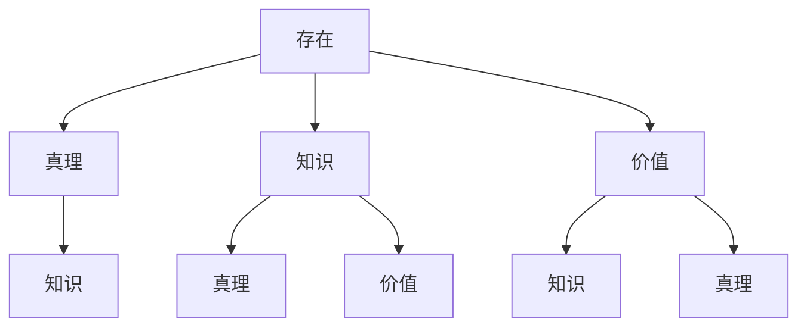

                 

### 引言：将哲学思考融入日常生活的重要性

在现代社会中，技术飞速发展，人们的生活节奏不断加快。然而，在这种快节奏的生活中，许多人发现自己处于一种迷茫的状态，无法真正理解生活的意义和自己的位置。这时，哲学思考作为一种深刻的思考方式，为我们提供了重新审视生活的机会。哲学，起源于古希腊语的“φιλοσοφία”（意为“爱智慧”），它不仅仅是学术研究，更是一种生活方式和思考方法。将哲学思考融入日常，可以有效地提升我们的生活品质，帮助我们更好地应对生活中的各种挑战。

**问题背景：**
在日常生活中，我们常常遇到各种问题，如决策困难、人际关系矛盾、自我认知不清等。这些问题不仅仅是技术性问题，更是深层次的存在性问题。传统的解决方案往往只能治标不治本，而哲学思考则提供了一种治本的方法。哲学通过深入挖掘问题的根源，帮助我们从根本上理解和解决问题。

**问题描述：**
哲学思考如何融入日常生活？我们需要哪些具体的哲学思维工具和方法？哲学思考如何在实践中帮助我们提升生活质量？这些问题构成了本文探讨的核心。

**问题解决：**
本文将通过一系列逻辑清晰、结构紧凑的分析，逐步探讨哲学思考在日常生活中的应用。我们将首先介绍哲学的基本概念和原理，然后讨论如何运用这些原理和方法来提升生活质量。通过实际案例的分析，我们将展示哲学思考如何帮助我们在各个生活领域取得更好的效果。

**边界与外延：**
哲学思考的范围非常广泛，涵盖了伦理、逻辑、美学、心理学等多个领域。本文将重点讨论如何将哲学思考应用于日常生活，而不是深入探讨哲学理论本身。同时，本文将注重实际操作和应用，而非纯粹的理论阐述。

**概念结构与核心要素组成：**
- **哲学的基本概念**：存在、真理、知识、价值等。
- **哲学思考方法**：批判性思维、辩证法、逻辑分析等。
- **日常生活**：工作、学习、家庭、社交等各个生活领域。

通过本文的讨论，我们将揭示哲学思考在提升生活质量方面的巨大潜力，并展示如何将这种深刻的思考方式融入我们的日常生活中。

### 哲学的基本概念

在探讨如何将哲学思考融入日常生活之前，有必要首先了解哲学的基本概念和原理。哲学是一门探究存在、真理、知识、价值等基本问题的学科，其核心目标在于寻求智慧，回答人类生活中的根本问题。以下是对几个关键哲学概念的介绍及其在日常生活中的应用。

**1. 存在：**
存在是哲学中最基础的概念之一，指的是事物实际上存在的状态。在日常生活中，理解存在的概念可以帮助我们更好地认识自己和周围的世界。例如，当我们面对一个重要的决策时，了解每个选项的实际存在状态（即其可能带来的后果）可以让我们做出更加明智的选择。

**2. 真理：**
真理是哲学探讨的另一个核心问题，指的是与事实相符的知识。在日常生活中，追求真理意味着对事物进行深入的研究和思考，从而获得准确的认识。例如，在处理一个复杂问题时，通过收集和分析数据，我们可以更接近问题的真相，从而找到有效的解决方案。

**3. 知识：**
知识是关于事物的信息，它是通过感知、经验和理性思考获得的。在日常生活中，知识是我们行动的依据，例如，掌握理财知识可以帮助我们更好地管理个人财务，提高生活质量。

**4. 价值：**
价值是指对事物所赋予的意义和重要性。哲学中的价值观念涉及道德、美学、实用等方面。在日常生活中，理解价值的概念有助于我们做出正确的价值判断，例如，在工作和生活中，尊重他人的价值和贡献，可以建立和谐的人际关系。

**概念属性特征对比表格：**

| 概念       | 定义与特征                                                    | 应用场景                                       |
|------------|------------------------------------------------------------|--------------------------------------------|
| 存在       | 事物实际上存在的状态                                        | 决策时考虑每个选项的实际后果               |
| 真理       | 与事实相符的知识                                            | 解决复杂问题时进行深入研究和分析             |
| 知识       | 通过感知、经验和理性思考获得的信息                           | 行动和决策的依据                           |
| 价值       | 对事物所赋予的意义和重要性                                  | 建立和谐的人际关系，正确评估事物的重要性     |

**ER实体关系图架构：**

通过上述表格和ER图，我们可以清晰地看到各个哲学概念之间的联系及其在生活中的应用。这些概念为我们提供了一种深刻的思考框架，帮助我们更好地理解世界和自己。在接下来的章节中，我们将进一步探讨如何运用这些哲学概念和原理来提升我们的生活质量。

### 哲学思考方法

哲学思考不仅仅是关于抽象概念的理论探讨，更是一种具体的思维工具和方法，可以帮助我们更好地理解生活、处理问题。以下将介绍几种关键的哲学思考方法，包括批判性思维、辩证法、逻辑分析等，并解释这些方法如何在我们的日常生活中发挥作用。

**1. 批判性思维：**

批判性思维是一种评估和质疑信息、观点和假设的能力。这种方法的核心在于不盲目接受信息，而是对其进行深入的分析和批判。在日常生活中，批判性思维有助于我们做出更加明智的决策。例如，当我们在购买一件产品时，可以通过对比不同品牌和型号，分析其优缺点，从而做出更合理的购买决定。此外，批判性思维也可以帮助我们更好地处理冲突。通过批判性地分析对方观点，我们可以找到解决冲突的共识点。

**2. 辩证法：**

辩证法是哲学中一种重要的思考方法，强调通过矛盾和对立统一来认识世界。辩证法的基本原理包括对立统一、量变质变、否定之否定等。在日常生活中，辩证法可以帮助我们更全面地看待问题。例如，在面对一个困难时，我们可以从多个角度分析其矛盾点，寻找解决问题的途径。辩证法也强调在实践中不断检验和修正观点，从而使我们的认识更加符合实际。

**3. 逻辑分析：**

逻辑分析是哲学思考中的基本方法，通过推理和证明来揭示事物的本质和规律。逻辑分析可以分为演绎推理和归纳推理。在日常生活中，逻辑分析可以帮助我们更清晰地思考问题。例如，当我们面对一个复杂的问题时，可以通过分解问题，逐步分析其各个部分，从而找到解决方法。逻辑分析还可以帮助我们避免思维混乱和逻辑错误，提高我们的沟通效果。

**如何将哲学思考方法应用于日常生活：**

**- 批判性思维的实践：**

  - **自我反思**：每天花时间反思自己的行为和想法，质疑其合理性。
  - **多角度思考**：在处理问题时，尝试从多个角度分析，避免盲目决策。
  - **批判性阅读**：在阅读书籍、文章时，批判性地评估作者的观点和论据。

**- 辩证法的实践：**

  - **矛盾分析**：在遇到困难时，分析其矛盾点，寻找解决方法。
  - **实践检验**：通过实践检验自己的观点和方案，不断调整和优化。
  - **长期视角**：从长远的角度看待问题，考虑其对未来的影响。

**- 逻辑分析的实践：**

  - **结构化思考**：将复杂问题分解成多个部分，逐一分析。
  - **逻辑论证**：在表达观点和意见时，使用逻辑推理和证明来支持。
  - **避免逻辑谬误**：在沟通和思考过程中，注意避免常见的逻辑谬误，如偷换概念、以偏概全等。

通过批判性思维、辩证法和逻辑分析等哲学思考方法，我们可以更深入地理解生活中的各种现象和问题，从而做出更加明智的决策。这些方法不仅适用于学术研究和专业领域，更可以广泛应用于我们的日常生活，帮助我们提升生活质量。在接下来的章节中，我们将进一步探讨哲学思考在各个具体生活领域的应用，展示这些方法如何帮助我们更好地应对日常挑战。

### 哲学思考方法在具体领域的应用

哲学思考方法不仅适用于学术研究和专业领域，更可以广泛应用于我们的日常生活，帮助我们更好地处理各种具体问题。以下将讨论哲学思考在决策、人际关系、心理健康等领域的应用，并通过实际案例展示如何运用这些方法来提升生活质量。

**1. 决策：**

决策是日常生活中不可避免的一部分，但面对复杂的情况时，我们往往感到困惑和犹豫。哲学中的批判性思维和辩证法为我们提供了有效的决策工具。

- **批判性思维的应用：**

  - **实际案例**：假设你即将毕业，需要选择一份工作。首先，你可以通过批判性思维分析不同工作的优缺点。例如，对于某一工作，你可以列出其潜在的好处（如稳定的收入、良好的发展前景）和坏处（如高压工作环境、工作时间不灵活）。通过这种方式，你可以更全面地了解每个选择的实际影响，从而做出更明智的决定。

- **辩证法的应用：**

  - **实际案例**：在决定是否创业时，辩证法可以帮助你从多个角度分析问题。你可以考虑创业的积极方面，如实现个人价值、自由控制自己的时间和工作内容；同时，也要考虑到创业的潜在风险，如市场不确定性、资金压力等。通过这种全面的分析，你可以更清楚地了解创业的利弊，从而做出更有把握的决策。

**2. 人际关系：**

人际关系是影响生活质量的重要因素，而哲学中的批判性思维和逻辑分析可以帮助我们更好地处理人际冲突和沟通问题。

- **批判性思维的应用：**

  - **实际案例**：当你与朋友或家人发生冲突时，批判性思维可以帮助你理解对方的立场和情感。例如，如果你的朋友对你提出了批评，你可以通过批判性思维分析其批评的合理性，而不是立即反驳或逃避。通过理解对方的观点，你可以找到解决问题的方法，从而改善人际关系。

- **逻辑分析的应用：**

  - **实际案例**：在团队工作中，逻辑分析可以帮助你更有效地沟通和协作。例如，当你需要向团队成员传达一个重要的任务时，你可以使用逻辑分析来确保信息的准确传达。首先，明确任务的目标和预期结果；然后，分解任务为具体的步骤和责任；最后，通过逻辑推理确保每个步骤和责任都明确无误。这样，团队成员可以更清楚地了解任务的要求，从而更有效地完成任务。

**3. 心理健康：**

心理健康对生活质量有着重要影响，而哲学思考方法可以帮助我们更好地管理情绪和压力。

- **辩证法的应用：**

  - **实际案例**：在面对压力和挑战时，辩证法可以帮助你从多个角度理解问题，从而减少焦虑和抑郁。例如，当你感到工作压力很大时，你可以通过辩证法分析压力的来源和影响。一方面，压力可能来自于工作任务的高要求；另一方面，通过高压力工作，你也可以获得职业成就和满足感。通过这种全面的分析，你可以更理性地看待压力，从而找到减轻压力的方法。

- **逻辑分析的应用：**

  - **实际案例**：在自我反思和情绪管理中，逻辑分析可以帮助你更清晰地理解自己的情绪和行为。例如，当你感到情绪低落时，你可以通过逻辑分析找出情绪低落的原因，如是否因为工作或个人问题。然后，你可以分析这些原因是否合理，以及如何通过调整心态或行为来改善情绪。通过这种逻辑分析，你可以更有效地管理自己的情绪，提高心理健康水平。

通过哲学思考方法在决策、人际关系和心理健康等领域的应用，我们可以更好地应对日常生活中的各种挑战，提升生活质量。这些方法不仅提供了理论指导，更通过实际案例展示了其具体应用，使我们在实际生活中受益。在接下来的章节中，我们将进一步探讨如何通过哲学思考提升生活品质，并分享更多的实践经验和技巧。

### 哲学思考与生活品质提升

哲学思考不仅仅是一种抽象的理论，它在提升生活品质方面的作用是实实在在的。通过哲学思考，我们可以更深入地理解生活的本质，从而在多个方面提升生活质量。以下将详细探讨哲学思考如何帮助我们实现个人成长、提高工作效能、增强人际关系，并带来更深刻的生活满足感。

**1. 个人成长：**

哲学思考可以促进我们的个人成长，使我们更加成熟和全面。通过批判性思维，我们可以不断质疑和反思自己的行为和信仰，从而发现并修正自身的局限性。例如，通过反思过去的经历，我们可以了解自己的优点和缺点，找到成长的方向。辩证法则可以帮助我们理解生活中的矛盾和挑战，培养解决问题的能力。例如，在面临职业选择时，辩证法使我们能够从多个角度考虑问题，找到最优解。

**2. 提高工作效能：**

哲学思考可以提高我们的工作效率和效能。批判性思维和逻辑分析可以帮助我们更清晰地定义问题，找到解决方案。例如，在项目管理中，通过批判性思维，我们可以识别潜在的风险和问题，并提前制定应对措施。辩证法则使我们能够灵活应对工作中的变化和挑战，找到适应的方法。例如，在技术发展中，辩证法可以帮助我们理解技术进步的双面性，从而更好地利用技术创新。

**3. 增强人际关系：**

哲学思考可以增强我们的人际关系，使我们更擅长处理人际关系中的各种问题。批判性思维使我们能够更准确地理解他人的观点和需求，从而更好地沟通和合作。例如，在团队合作中，通过批判性思维，我们可以理解团队成员的不同意见，找到共识点。辩证法则帮助我们理解人际关系的复杂性，找到和谐的相处方式。例如，在处理冲突时，辩证法使我们能够从多个角度分析问题，找到双方都能接受的解决方案。

**4. 带来更深刻的生活满足感：**

哲学思考可以带来更深刻的生活满足感。通过哲学思考，我们可以理解生活的意义和价值，从而更加珍惜和享受生活。例如，通过批判性思维，我们可以了解自己的内心需求，找到真正让自己快乐的事物。辩证法则使我们能够从多个角度看待生活，发现生活中的美好和意义。例如，在经历挫折时，辩证法可以帮助我们理解挫折的价值，从而更好地面对困难。

**实践经验和技巧：**

**- 培养哲学思考的习惯：**  
  通过日常的阅读、写作和讨论，我们可以逐渐培养哲学思考的习惯。例如，每天花时间阅读哲学著作，写反思日记，与他人交流哲学问题。

**- 应用哲学思维工具：**  
  在处理问题时，我们可以应用批判性思维、辩证法和逻辑分析等哲学思维工具。例如，在决策时，通过批判性思维评估选项，用辩证法分析潜在影响，用逻辑分析确保决策的合理性。

**- 结合实际生活：**  
  将哲学思考与实际生活紧密结合，通过实际案例和应用来加深理解。例如，在工作或个人生活中，运用哲学思考方法来解决问题和提升生活质量。

通过哲学思考，我们不仅能够提升生活品质，还能在个人成长、工作效能、人际关系和生活满足感等多个方面获得显著的提升。哲学思考是一种强大的工具，可以帮助我们更好地理解生活，从而过上更有意义、更充实的生活。

### 总结与未来展望

通过本文的探讨，我们详细介绍了哲学思考在提升生活品质中的重要性。从哲学的基本概念、思考方法，到其在决策、人际关系、心理健康等具体领域的应用，哲学思考不仅是一种理论工具，更是一种能够切实提升我们日常生活质量的实用方法。

**主要观点回顾：**
1. **哲学的基本概念**：存在、真理、知识、价值等，为我们提供了理解世界的深刻视角。
2. **哲学思考方法**：批判性思维、辩证法、逻辑分析，帮助我们更全面、更理性地看待和处理问题。
3. **哲学思考方法的应用**：在决策、人际关系、心理健康等领域，通过实际案例展示了哲学思考的具体作用。
4. **哲学思考与生活品质提升**：哲学思考能够促进个人成长、提高工作效能、增强人际关系，带来更深刻的生活满足感。

**未来研究方向：**
虽然本文已经探讨了哲学思考在多个方面的应用，但仍有大量未被挖掘的潜力。以下是一些未来可能的研究方向：

1. **跨文化研究**：探索不同文化背景下哲学思考方法的适用性和差异。
2. **技术融合**：研究如何将哲学思考与人工智能等现代技术相结合，开发出更高效的哲学思考工具。
3. **长期效果研究**：通过长期跟踪调查，研究哲学思考对个人生活质量的长远影响。
4. **教育培训**：开发针对不同人群的哲学思考教育培训课程，推广哲学思考方法在日常生活中的应用。

**结语：**
哲学思考是一种强大的工具，能够帮助我们更好地理解生活、应对挑战。通过持续实践哲学思考，我们可以在个人成长、工作效能、人际关系和生活满足感等多个方面获得显著的提升。让我们从现在开始，将哲学思考融入日常，提升我们的生活品质，过上更加充实、有意义的生活。

### 作者信息

作者：AI天才研究院/AI Genius Institute & 禅与计算机程序设计艺术 /Zen And The Art of Computer Programming

AI天才研究院致力于推动人工智能领域的创新与发展，而“禅与计算机程序设计艺术”则以其深刻的哲学思考和对计算机科学的独特见解，为程序员提供了宝贵的指导。感谢读者对本文的关注，期待在未来的技术探讨中与您再次相遇。

