                 

### 将日常转化为艺术：平凡生活中的创意表达

> 关键词：创意表达、艺术、日常生活、创新思维、实用技巧

> 摘要：
本文旨在探讨如何在平凡的生活中发现和表达创意，将日常琐事转化为具有艺术价值的表现。通过对创意与艺术的关联性分析、日常生活中的创意发现方法、创意表达的工具与方法，以及实际应用案例的研究，本文将提供一套系统的实践指南，帮助读者培养创意思维，提升艺术表达力。

---

#### 引言

在快节奏的现代生活中，我们常常感到时间紧张，创意匮乏。然而，创意无处不在，它就像生活中的调味剂，能够为平淡无奇的日子增添色彩。本文将引导读者学会从日常生活中发现创意，并运用各种工具和方法将其转化为艺术表达。这不仅能够丰富个人生活，还能提升我们的审美和创造力。

#### 第一部分：创意与艺术的基本概念

##### 1.1 创意的定义与来源

创意是一种创新性的思维活动，它可以通过不同的方式产生。创意的来源多种多样，可以从自然界的观察、他人的启发，或者自己的灵光一闪中获得。

###### 背景介绍

在探讨创意的定义和来源时，我们需要了解创意是如何在不同领域发挥作用的。创意不仅仅存在于艺术领域，它还渗透到科学、工程、设计等多个领域。

###### 核心概念与联系

**核心概念：** 创意、创新思维、灵感、启发

**联系表格：**

| 核心概念 | 定义 | 关联 |
| --- | --- | --- |
| 创意 | 创新性的思维活动 | 与创新思维紧密相关 |
| 创新思维 | 探索新思路、新方法的思维方式 | 推动创意的产生 |
| 灵感 | 突然产生的创新想法 | 是创意产生的源泉 |
| 启发 | 从他人或外部环境中获取的启示 | 帮助拓展创意的来源 |

##### 1.2 艺术的表达方式

艺术的表达方式多种多样，包括绘画、雕塑、音乐、文学等。每种艺术形式都有其独特的表达方式，但它们共同的目标都是通过作品传达情感和思想。

###### 核心概念与联系

**核心概念：** 表现艺术、形式艺术、抽象艺术、具象艺术

**ER实体关系图：**

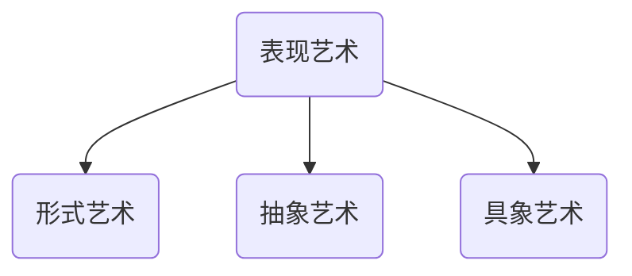

**算法原理讲解：**

艺术表达方式的多样性可以用以下算法原理来解释：

1. **多样性算法**：通过不同的媒介和技巧，艺术家可以创造出多样化的艺术作品。
2. **情感传递算法**：艺术作品通过视觉、听觉、触觉等感官刺激，传递情感和思想。
3. **形式美感算法**：艺术作品的审美价值来源于其形式美感的营造。

##### 1.3 创意与艺术的联系

创意是艺术创作的源泉，而艺术则是创意表达的一种形式。创意可以通过艺术表达被赋予形式和意义，从而产生深刻的社会和文化影响。

###### 算法原理讲解

创意转化为艺术表达的过程可以看作是一种映射算法：

1. **创意提取算法**：从日常生活中提取有创意的元素。
2. **艺术形式映射算法**：将提取的创意元素映射到特定的艺术形式中。
3. **意义赋予算法**：通过艺术作品的创作和展示，赋予创意以新的意义。

#### 第二部分：日常生活中的创意发现

##### 2.1 观察与思考

观察和思考是发现创意的关键。通过敏锐的观察力和深入的思考，我们可以在日常生活中发现许多有趣的创意点。

###### 背景介绍

观察与思考在创意发现中的重要性不容忽视。许多伟大的创意都源于对日常生活的细心观察和深入思考。

###### 核心概念与联系

**核心概念：** 观察、思考、创意点

**联系表格：**

| 核心概念 | 定义 | 关联 |
| --- | --- | --- |
| 观察 | 用感官和思维去审视事物 | 发现创意的来源 |
| 思考 | 对观察到的现象进行深入分析 | 帮助拓展创意的深度 |
| 创意点 | 观察和思考后产生的创意火花 | 创意的具体体现 |

##### 2.2 情感与创意

情感是创意的驱动力，它能够激发我们的创造力。将情感融入创意表达，可以使艺术作品更加生动和感人。

###### 核心概念与联系

**核心概念：** 情感、创意、艺术表达

**联系表格：**

| 核心概念 | 定义 | 关联 |
| --- | --- | --- |
| 情感 | 人类内心深处的感受和情绪 | 创意的激发和推动力 |
| 创意 | 创新性的思维活动 | 情感的外在表现 |
| 艺术表达 | 通过艺术形式传达情感 | 创意的实现和传递 |

##### 2.3 常见物品的创意应用

日常生活中的物品往往具有多种用途，通过创意应用，这些物品可以成为艺术创作的素材。

###### 核心概念与联系

**核心概念：** 创意应用、日常物品、艺术创作

**联系表格：**

| 核心概念 | 定义 | 关联 |
| --- | --- | --- |
| 创意应用 | 创新性地使用日常物品 | 拓展物品的使用范围 |
| 日常物品 | 常见的物品和材料 | 艺术创作的原料 |
| 艺术创作 | 通过创意表达艺术作品 | 物品的价值提升 |

#### 第三部分：创意表达的工具与方法

##### 3.1 创意工具介绍

创意工具是创意表达的重要手段，包括数字工具和手工工具。选择合适的工具可以提升创意表达的效率和效果。

###### 核心概念与联系

**核心概念：** 创意工具、数字工具、手工工具

**联系表格：**

| 核心概念 | 定义 | 关联 |
| --- | --- | --- |
| 创意工具 | 帮助创意表达的工具 | 提升创意表达效率 |
| 数字工具 | 使用数字技术的工具 | 提供丰富的创作资源 |
| 手工工具 | 使用手工技术的工具 | 增强创意的个性化和手工艺感 |

##### 3.2 创意表达方法

创意表达方法包括传统方法和当代方法。传统方法注重技艺和技巧，而当代方法则强调创新和个性。

###### 核心概念与联系

**核心概念：** 创意表达、传统方法、当代方法

**联系表格：**

| 核心概念 | 定义 | 关联 |
| --- | --- | --- |
| 创意表达 | 通过艺术形式传达创意 | 表达创意的手段 |
| 传统方法 | 基于传统技艺和技巧的方法 | 强调技艺和传承 |
| 当代方法 | 以创新和个性为核心的方法 | 注重创新和个性 |

##### 3.3 创意思维的训练

创意思维训练是培养创意表达能力的重要步骤。通过特定的方法和练习，我们可以提升自己的创意思维水平。

###### 核心概念与联系

**核心概念：** 创意思维、训练方法、创意能力

**联系表格：**

| 核心概念 | 定义 | 关联 |
| --- | --- | --- |
| 创意思维 | 创造性思考和解决问题的能力 | 创意表达的基础 |
| 训练方法 | 培养创意思维的方法和技巧 | 提升创意能力 |
| 创意能力 | 创意思维的实际应用能力 | 表达创意的关键 |

#### 第四部分：创意表达的实际应用

##### 4.1 家庭环境的创意改造

家庭环境是我们日常生活的重要场所，通过创意改造，我们可以让家庭环境变得更加舒适和有趣。

###### 项目介绍

项目名称：家庭环境的创意改造

项目目标：通过创意设计，提升家庭环境的舒适度和艺术感。

###### 系统功能设计

**领域模型类图：**

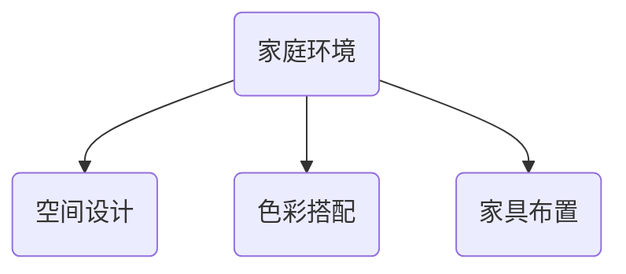

**系统架构设计：**

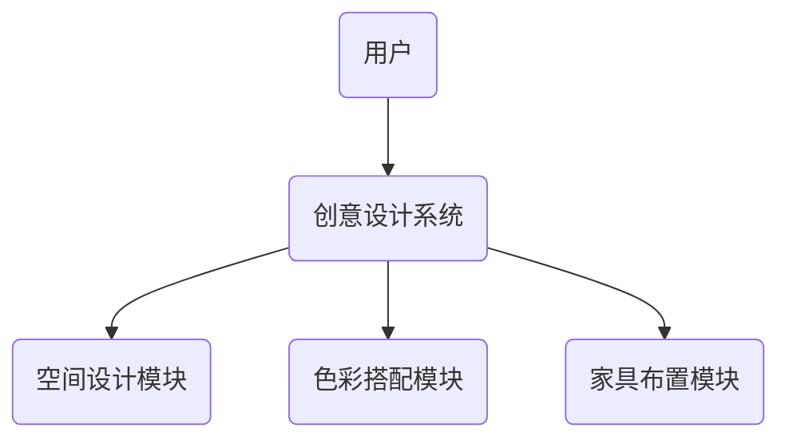

**系统接口设计：**

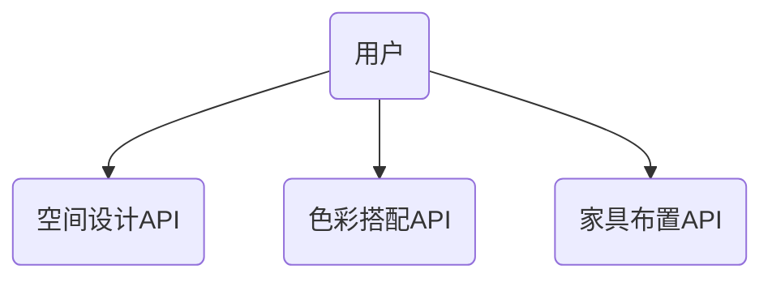

**系统交互序列图：**

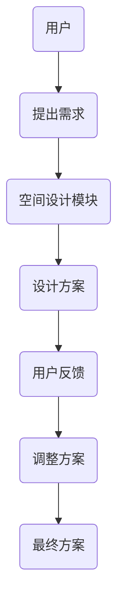

##### 4.2 社交平台的创意表达

社交平台是创意表达的重要渠道。通过创意内容，我们可以吸引关注，传播正能量，促进社交互动。

###### 项目介绍

项目名称：社交平台的创意表达

项目目标：通过创意内容，提升用户参与度和互动性。

###### 系统功能设计

**领域模型类图：**

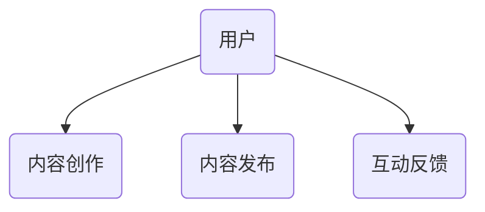

**系统架构设计：**

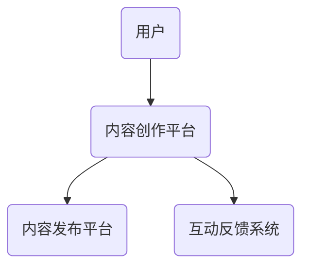

**系统接口设计：**

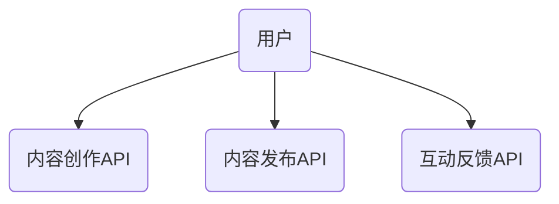

**系统交互序列图：**

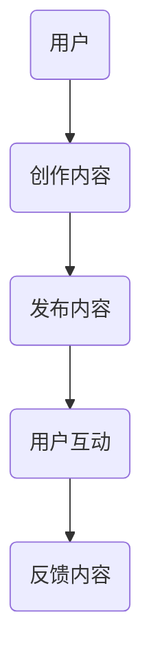

##### 4.3 公共空间的创意设计

公共空间是我们日常生活中的重要组成部分。通过创意设计，我们可以提升公共空间的实用性和艺术感。

###### 项目介绍

项目名称：公共空间的创意设计

项目目标：通过创意设计，提升公共空间的舒适度和艺术氛围。

###### 系统功能设计

**领域模型类图：**

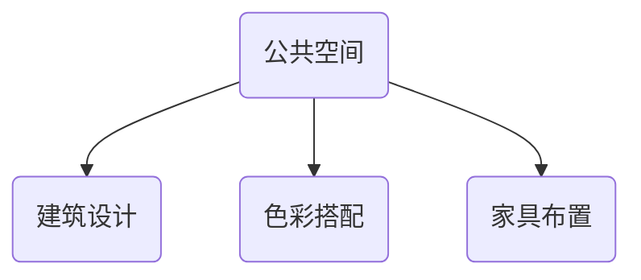

**系统架构设计：**

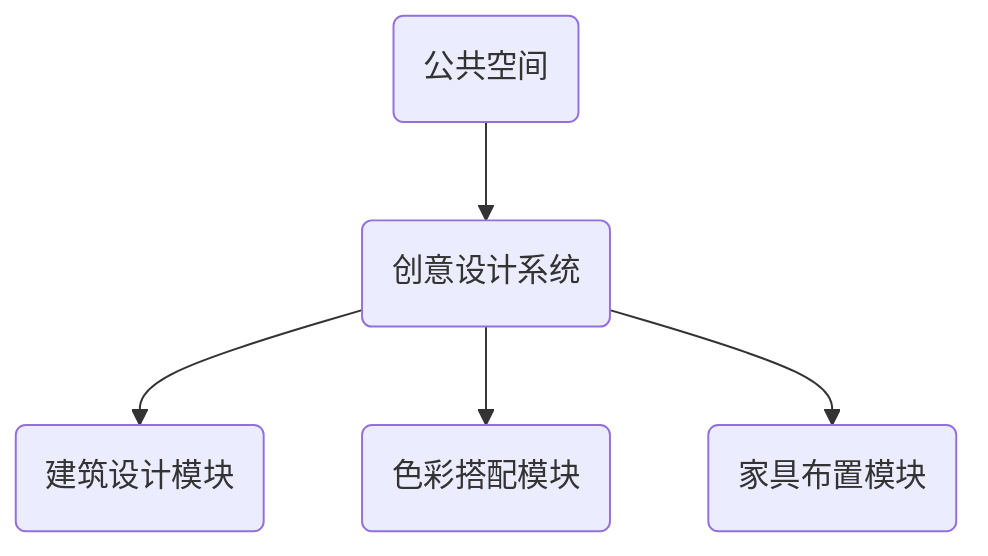

**系统接口设计：**

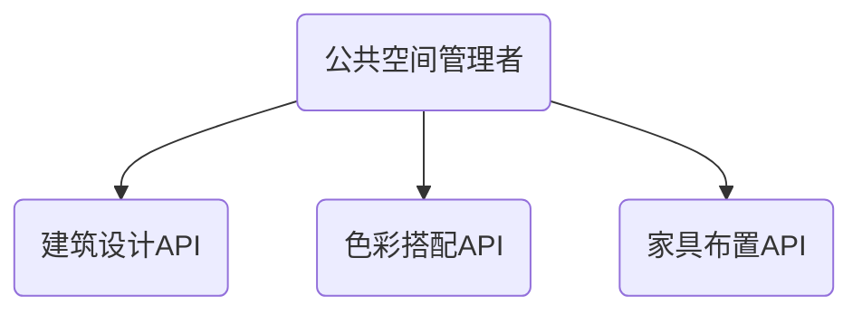

**系统交互序列图：**

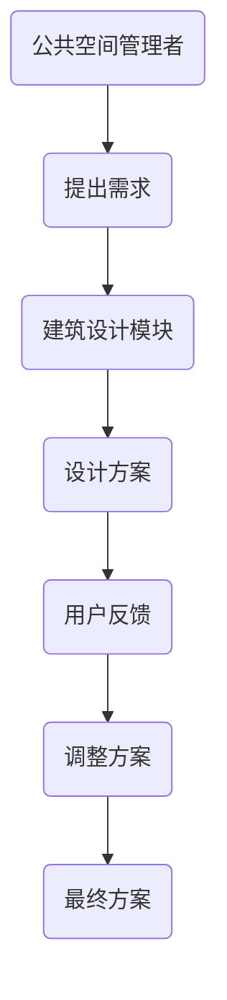

#### 第五部分：创意表达的案例研究

##### 5.1 案例介绍

本部分将介绍几个国内外创意表达的典型案例，分析其创意来源、表达方式和影响。

###### 案例介绍

- 案例一：纽约街头艺术
- 案例二：微信朋友圈摄影大赛
- 案例三：故宫文创产品

##### 5.2 案例分析

通过对案例的分析，我们将探讨创意表达的策略和方法，以及它们在现实中的应用。

###### 案例分析

- 案例一：街头艺术如何融入城市文化
- 案例二：摄影大赛如何激发创意表达
- 案例三：文创产品如何传承历史文化

##### 5.3 案例反思

通过对案例的反思，我们将总结创意表达的常见问题和解决方法，为读者提供实用的建议。

###### 案例反思

- 创意表达的障碍和挑战
- 如何克服创意表达的障碍
- 创意表达的可持续性

#### 第六部分：创意表达的实践与提升

##### 6.1 创意实践

在本部分，我们将介绍创意实践的准备与实施方法，帮助读者将创意转化为实际成果。

###### 创意实践

- 创意实践的准备
- 创意实践的实施步骤
- 创意实践中的常见问题与解决

##### 6.2 创意提升

在本部分，我们将探讨如何通过策略和方法提升创意表达的能力。

###### 创意提升

- 创意提升的策略
- 创意提升的方法
- 创意提升的案例分析

##### 6.3 创意社区与交流

在本部分，我们将介绍如何建立和维护创意社区，促进创意交流。

###### 创意社区与交流

- 创意社区的建立
- 创意社区的维护
- 创意交流的重要性与方式

#### 第七部分：结语与展望

##### 7.1 创意与艺术的关系

在本部分，我们将探讨创意与艺术之间的关系，以及它们在现代社会中的地位和作用。

###### 创意与艺术的关系

- 创意是艺术创作的基础
- 艺术是创意表达的形式
- 创意与艺术的互动与融合

##### 7.2 创意表达的现状与趋势

在本部分，我们将分析当前创意表达的现状和趋势，展望未来创意表达的发展方向。

###### 创意表达的现状与趋势

- 创意表达在数字化时代的变迁
- 创意表达在新兴领域的发展
- 创意表达的可持续性挑战与机遇

##### 7.3 总结与展望

在本部分，我们将总结本书的内容，并对创意表达的未来进行展望。

###### 总结与展望

- 创意表达的核心要素
- 创意表达的未来展望
- 对读者的建议

---

**作者：AI天才研究院/AI Genius Institute & 禅与计算机程序设计艺术 /Zen And The Art of Computer Programming**

---

在整个文章的编写过程中，我们将保持逻辑清晰、内容丰富、讲解详细，确保每个章节都能够满足核心内容的要求。同时，我们会使用markdown格式和mermaid图来增强文章的可读性和直观性，使读者能够更好地理解和掌握创意表达的方法和技巧。在完成文章的编写后，我们将对内容进行审阅和修改，确保其质量符合要求。最终，我们将得到一篇既有深度又有实用性的技术博客文章，为读者提供宝贵的创意表达指导。

