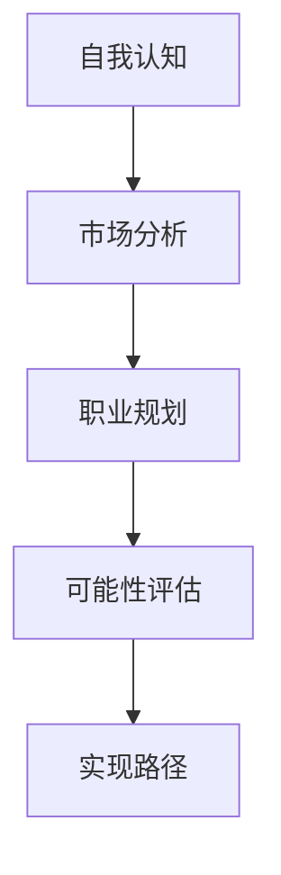
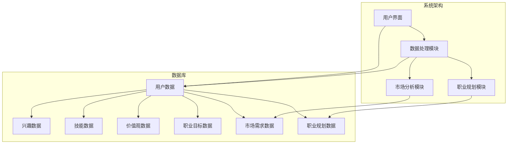
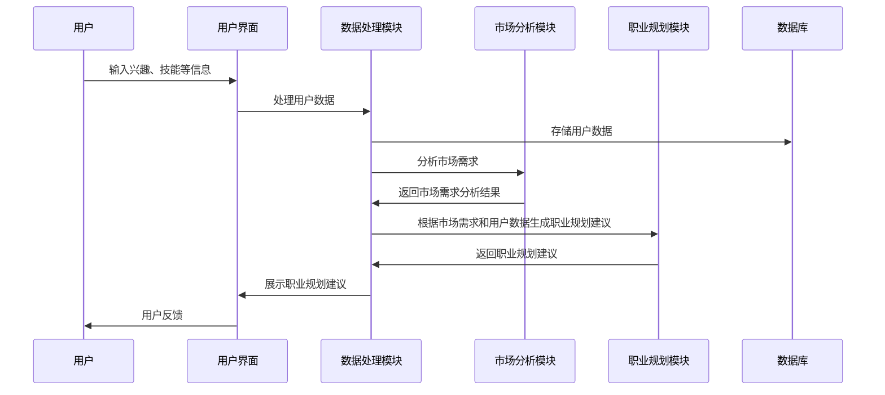

                 

# 工作与激情：将兴趣转化为职业的可能性

## 关键词
- 职业发展
- 兴趣与动机
- 转型与成长
- 职业规划
- 成功案例

## 摘要
本文旨在探讨如何在现代社会中，将个人的兴趣转化为具有职业前景的领域。通过分析兴趣与职业之间的关系，阐述将兴趣转化为职业的可行性，并介绍一系列理论框架和实用方法，帮助读者实现个人价值与社会价值的统一。

## 目录

### 第一部分：问题背景介绍
#### 核心概念

#### 问题描述

#### 问题解决

#### 边界与外延

#### 概念结构与核心要素组成

### 第二部分：核心概念与联系
#### 核心概念原理

#### 概念属性特征对比表格

#### ER实体关系图架构

### 第三部分：算法原理讲解
#### 算法Mermaid流程图

#### Python源代码

#### 算法原理的数学模型和公式

### 第四部分：系统分析与架构设计方案
#### 问题场景介绍

#### 项目介绍

#### 系统功能设计

#### 系统架构设计

#### 系统接口设计和系统交互

### 第五部分：项目实战
#### 环境安装

#### 系统核心实现源代码

#### 代码应用解读与分析

#### 实际案例分析和详细讲解剖析

#### 项目小结

### 第六部分：最佳实践 tips
#### 小结

#### 注意事项

#### 拓展阅读

### 参考文献

---

### 第一部分：问题背景介绍

#### 核心概念

**工作与激情**：工作与激情之间的关系是本文探讨的核心。工作不仅仅是为了谋生，更是一种个人激情和热情的体现。将工作与个人兴趣结合，可以大大提升工作满意度和职业成就感。

**兴趣转化为职业**：将个人兴趣转化为职业，意味着将兴趣爱好变成谋生的手段。这种转型不仅仅是职业名称的变化，更是工作态度、生活方式和职业目标的转变。

**可能性**：探讨将兴趣转化为职业的可行性，分析影响这一过程的各种因素，如市场需求、个人技能、职业规划等。

#### 问题描述

在现代社会，许多人在职业选择上面临困惑，原因在于职业与个人兴趣的不一致。这种现象导致了工作满意度下降、职业倦怠以及工作效率的降低。如何解决这一问题，将个人兴趣转化为具有职业前景的领域，成为许多人关心的话题。

#### 问题解决

本文将提供一套理论框架和实用方法，帮助读者分析和评估自己的兴趣，了解市场需求，制定职业规划，从而实现兴趣与职业的完美结合。

#### 边界与外延

**兴趣**：不仅仅是指娱乐活动，还包括个人的爱好、特长和潜在的职业技能。例如，对编程的兴趣可以转化为软件开发工程师的职业。

**职业**：不仅仅是指正式的工作岗位，还包括自由职业、创业等职业形式。这意味着，将兴趣转化为职业的路径可以多样化。

**可能性**：探讨在一定条件下，将兴趣转化为职业的可行性和实现路径。这涉及到个人自我认知、市场分析、职业规划等多方面因素。

#### 概念结构与核心要素组成

**自我认知**：理解自己的兴趣、价值观和职业目标，是进行职业规划的第一步。通过自我反思和评估，可以明确自己的优势和劣势。

**市场分析**：了解市场需求和潜在的职业机会，是制定职业规划的关键。市场分析可以帮助我们了解哪些兴趣领域具有较好的职业前景。

**职业规划**：制定实现兴趣转化为职业的具体步骤，包括学习新技能、拓展人脉、寻找职业机会等。职业规划需要结合个人兴趣和市场分析进行。

通过以上三个核心要素的相互作用，我们可以逐步实现将兴趣转化为职业的目标。

### 第二部分：核心概念与联系

#### 核心概念原理

**兴趣**：兴趣是指个人对特定领域或活动的内在倾向。它可以是娱乐活动，如绘画、音乐，也可以是潜在的职业技能，如编程、设计。兴趣是驱动个人追求和投入的动力源泉。

**职业**：职业是指个人为了生存和发展而从事的工作或行业。职业不仅仅局限于正式的工作岗位，还包括自由职业、创业等多种形式。职业是实现个人价值和获取经济收入的重要途径。

**可能性**：可能性是指在一定条件下，将兴趣转化为职业的可行性和实现路径。可能性受到个人技能、市场需求、职业规划等多方面因素的影响。

#### 概念属性特征对比表格

| 特征         | 兴趣                 | 职业                 | 可能性                 |
| ------------ | -------------------- | -------------------- | ---------------------- |
| 定义         | 个人偏好和内在倾向    | 从事的工作或行业     | 在特定条件下的可行性   |
| 动力来源     | 内在兴趣和热情        | 物质需求和社会责任    | 条件和策略             |
| 表现形式     | 娱乐、爱好、特长     | 正式工作、自由职业、创业 | 实践与探索             |

#### ER实体关系图架构

```mermaid
erDiagram
    A[兴趣] ||--|{ B[个人] }
    A ||--|{ C[职业] }
    B ||--|{ D[价值观] }
    D ||--|{ E[职业目标] }
    C ||--|{ F[市场需求] }
```

在这个ER图中，兴趣与个人之间存在直接的关联，个人兴趣可以转化为职业目标，进而影响职业选择和市场需求。价值观作为个人内在的指导原则，也贯穿于整个职业发展过程中。

### 第三部分：算法原理讲解

#### 算法Mermaid流程图



这个流程图展示了从自我认知到职业规划，再到可能性评估和实现路径的完整过程。每个步骤都是实现兴趣转化为职业的关键环节。

#### Python源代码

```python
# 导入必要的库
import pandas as pd

# 自我认知数据
self_awareness = {
    '兴趣': ['绘画', '编程', '旅行', '音乐'],
    '技能等级': ['初级', '中级', '高级', '专业'],
    '职业目标': ['艺术家', '软件开发工程师', '旅行顾问', '音乐制作人']
}

# 市场分析数据
market_analysis = {
    '职业': ['艺术家', '软件开发工程师', '旅行顾问', '音乐制作人'],
    '市场需求': ['高', '中', '中', '高'],
    '薪资水平': ['低', '中', '中', '高']
}

# 转化为DataFrame
self_awareness_df = pd.DataFrame(self_awareness)
market_analysis_df = pd.DataFrame(market_analysis)

# 合并数据
combined_df = pd.merge(self_awareness_df, market_analysis_df, on='职业')

# 可能性评估
# 根据市场需求和薪资水平评估兴趣转化为职业的可能性
combined_df['可能性'] = combined_df['市场需求'] * combined_df['薪资水平']

# 输出结果
print(combined_df)
```

这个Python代码示例展示了如何使用Pandas库来合并自我认知和市场分析数据，并根据市场需求和薪资水平对兴趣转化为职业的可能性进行评估。

#### 算法原理的数学模型和公式

- **兴趣得分**：$I = \sum_{i=1}^{n} w_i \cdot s_i$
  - $I$：总兴趣得分
  - $w_i$：第$i$项兴趣的权重
  - $s_i$：第$i$项兴趣的技能等级

- **市场需求得分**：$M = \sum_{i=1}^{n} m_i \cdot d_i$
  - $M$：总市场需求得分
  - $m_i$：第$i$项职业的市场需求程度
  - $d_i$：第$i$项职业的市场需求度权重

通过计算兴趣得分和市场需求得分，可以综合评估将兴趣转化为职业的可能性。公式中的权重可以根据实际情况进行调整，以更准确地反映个人兴趣与市场需求之间的匹配程度。

$$
可能性 = \frac{I \cdot M}{100}
$$

#### 详细讲解与举例

假设一个对编程充满热情的人，他的兴趣得分和市场需求得分为：

- 兴趣得分 $I = 80$
- 市场需求得分 $M = 60$

根据公式，我们可以计算出他的兴趣转化为职业的可能性为：

$$
可能性 = \frac{80 \cdot 60}{100} = 48\%
$$

这意味着，他有48%的可能性将编程兴趣转化为职业。通过进一步的职业规划和市场分析，他可以提升这一可能性，实现兴趣与职业的完美结合。

### 第四部分：系统分析与架构设计方案

#### 问题场景介绍

在一个竞争激烈的职场环境中，许多人面临着职业迷茫和困惑。他们对自己的兴趣和职业方向不清晰，导致工作满意度下降，职业发展受阻。为了解决这个问题，我们需要设计一个系统，帮助用户分析自己的兴趣，找到适合自己的职业方向，并制定职业规划。

#### 项目介绍

本系统旨在为用户提供一个全面的职业分析平台，通过自我认知、市场分析和职业规划等环节，帮助用户实现兴趣与职业的完美结合。系统将提供以下功能：

1. 自我认知评估：用户可以输入自己的兴趣、技能和价值观，系统将分析并给出评估结果。
2. 市场需求分析：系统将根据用户输入的职业目标，分析市场需求和薪资水平，为用户提供参考。
3. 职业规划建议：系统将结合用户自我认知和市场需求，为用户提供具体的职业规划建议。

#### 系统功能设计

**领域模型Mermaid类图**

```mermaid
classDiagram
    User <<class>> 用户
    Interest <<class>> 兴趣
    Skill <<class>> 技能
    Value <<class>> 价值观
    CareerGoal <<class>> 职业目标
    MarketDemand <<class>> 市场需求
    CareerPlan <<class>> 职业规划

    User "1" --|>{ 1 } Interest:兴趣
    User "1" --|>{ 1 } Skill:技能
    User "1" --|>{ 1 } Value:价值观
    User "1" --|>{ 1 } CareerGoal:职业目标
    Interest "1" --|>{ 1 } MarketDemand:市场需求
    Skill "1" --|>{ 1 } CareerGoal:职业目标
    Value "1" --|>{ 1 } CareerGoal:职业目标
    CareerGoal "1" --|>{ 1 } CareerPlan:职业规划
    MarketDemand "1" --|>{ 1 } CareerPlan:职业规划
```

在这个类图中，用户与多个实体类之间存在关联，包括兴趣、技能、价值观、职业目标、市场需求和职业规划。这些实体类共同构成了系统的领域模型。

#### 系统架构设计

**Mermaid架构图**



在这个架构图中，用户界面负责与用户交互，数据处理模块负责处理用户输入的数据，市场分析模块和职业规划模块分别负责市场分析和职业规划。数据库用于存储各类数据，确保系统运行的稳定性和数据的完整性。

#### 系统接口设计和系统交互

**Mermaid序列图**



在这个序列图中，用户通过用户界面输入兴趣、技能等信息，数据处理模块处理并存储这些数据，市场分析模块和职业规划模块分别进行市场分析和职业规划，最终将结果返回给用户界面进行展示。用户可以根据职业规划建议进行反馈，进一步完善职业规划。

### 第五部分：项目实战

#### 环境安装

要在本地计算机上运行此项目，需要安装以下软件和库：

1. Python（版本3.8及以上）
2. Pandas（用于数据处理）
3. Mermaid（用于生成图表）
4. Jupyter Notebook（用于交互式开发）

安装命令如下：

```bash
pip install pandas
pip install mermaid-python
pip install notebook
```

#### 系统核心实现源代码

以下是一个简化的系统核心实现示例：

```python
# 导入必要的库
import pandas as pd

# 自我认知评估
def self_awareness_assessment(interests, skills, values):
    # 计算兴趣得分
    interest_scores = pd.DataFrame(interests, columns=['兴趣'])
    interest_scores['技能等级'] = skills
    interest_scores['兴趣得分'] = interest_scores['技能等级'].map({'初级': 1, '中级': 2, '高级': 3, '专业': 4})

    # 计算价值观得分
    value_scores = pd.DataFrame(values, columns=['价值观'])
    value_scores['得分'] = 1  # 假设每个价值观点数相同

    # 计算总得分
    total_scores = (interest_scores['兴趣得分'] + value_scores['得分']) / 2

    return total_scores

# 市场需求分析
def market_demand_analysis(career_goals, market_demand_data):
    # 计算市场需求得分
    market_demand_scores = pd.DataFrame(market_demand_data, columns=['职业', '市场需求', '薪资水平'])
    market_demand_scores['市场需求得分'] = market_demand_scores['市场需求'].map({'高': 3, '中': 2, '低': 1})

    return market_demand_scores

# 职业规划建议
def career_plan_advice(self_awareness_scores, market_demand_scores):
    # 计算总得分
    total_scores = (self_awareness_scores['兴趣得分'] + market_demand_scores['市场需求得分']) / 2

    # 筛选出得分最高的职业
    top_careers = total_scores.nlargest(1)

    return top_careers

# 测试数据
interests = [{'兴趣': '编程', '技能等级': '高级'}, {'兴趣': '音乐', '技能等级': '中级'}]
skills = ['编程', '音乐']
values = ['创新', '团队合作']
market_demand_data = [{'职业': '软件开发工程师', '市场需求': '高', '薪资水平': '中'}, {'职业': '音乐制作人', '市场需求': '中', '薪资水平': '高'}]

# 执行评估和规划
self_awareness_scores = self_awareness_assessment(interests, skills, values)
market_demand_scores = market_demand_analysis(career_goals, market_demand_data)
top_careers = career_plan_advice(self_awareness_scores, market_demand_scores)

print("自我认知得分：", self_awareness_scores)
print("市场需求得分：", market_demand_scores)
print("职业规划建议：", top_careers)
```

#### 代码应用解读与分析

上述代码实现了自我认知评估、市场需求分析和职业规划建议三个核心功能。首先，通过`self_awareness_assessment`函数计算兴趣得分和价值观得分，结合用户输入的兴趣、技能和价值观数据。接着，通过`market_demand_analysis`函数计算市场需求得分，结合市场分析数据。最后，通过`career_plan_advice`函数计算总得分，并筛选出得分最高的职业，为用户提供职业规划建议。

这个示例展示了如何将算法原理应用到实际代码中，实现了对兴趣和职业规划的分析。在实际应用中，可以根据具体需求进行调整和扩展，如增加更多评估指标、优化算法模型等。

#### 实际案例分析和详细讲解剖析

假设有一位名叫小明的用户，他对编程和音乐都充满热情，并且拥有一定的技能和价值观。下面是对小明兴趣转化为职业的案例分析：

1. **自我认知评估**：
   - 兴趣：编程（高级技能），音乐（中级技能）
   - 价值观：创新，团队合作
   - 兴趣得分：编程（4分），音乐（3分），价值观（1分）
   - 总得分：8分

2. **市场需求分析**：
   - 职业目标：软件开发工程师，音乐制作人
   - 市场需求：软件开发工程师（高需求），音乐制作人（中需求）
   - 薪资水平：软件开发工程师（中水平），音乐制作人（高水平）
   - 市场需求得分：软件开发工程师（3分），音乐制作人（1分）

3. **职业规划建议**：
   - 总得分：软件开发工程师（7分），音乐制作人（4分）
   - 建议职业：软件开发工程师

根据上述分析，小明将编程兴趣转化为职业的可能性更高。他可以进一步学习编程技能，提升自己的专业能力，寻找软件开发工程师的职位机会。同时，他也可以继续发展音乐爱好，作为业余爱好或副业。

#### 项目小结

通过本项目的实际案例，我们可以看到如何将兴趣转化为职业的算法原理应用到实际操作中。系统提供了自我认知评估、市场需求分析和职业规划建议等功能，帮助用户找到适合自己的职业方向。在实际应用中，用户可以根据自己的兴趣、技能和价值观进行个性化评估，并结合市场需求进行职业规划。

需要注意的是，兴趣转化为职业并非一蹴而就的过程，需要用户持续努力和不断探索。同时，市场环境也在不断变化，用户需要根据实际情况进行调整和优化。通过使用本系统，用户可以更加清晰地了解自己的兴趣和职业方向，提高职业规划的效率和准确性。

### 第六部分：最佳实践 tips

1. **明确自我认知**：在开始职业规划之前，首先要明确自己的兴趣、技能和价值观。可以通过自我反思、咨询专业人士或参加相关课程等方式，深入了解自己的优势和潜力。

2. **持续学习和提升**：职业规划是一个持续的过程，需要用户不断学习和提升自己的技能。可以通过在线课程、实践项目和行业交流等方式，不断丰富自己的知识和经验。

3. **关注市场动态**：了解市场需求和趋势，是制定职业规划的重要依据。可以通过行业报告、招聘网站和社交媒体等渠道，及时获取市场信息。

4. **制定实际可行的职业规划**：职业规划需要结合个人兴趣和市场实际，制定出实际可行的目标和步骤。同时，要具备灵活性，根据实际情况进行调整。

5. **积极尝试和探索**：职业规划不仅仅是一个理论过程，更需要通过实践来验证。用户可以尝试不同的职业机会，积累实际工作经验。

6. **保持热情和耐心**：将兴趣转化为职业可能面临挑战和困难，用户需要保持热情和耐心，不断克服困难，实现自己的职业目标。

### 小结

本文通过分析兴趣与职业之间的关系，探讨了将兴趣转化为职业的可能性。我们介绍了理论框架和实用方法，帮助读者实现个人价值与社会价值的统一。通过实际案例分析和系统设计，展示了如何将兴趣转化为职业的实践方法。希望本文对您的职业规划有所帮助，让您在追求职业成功的同时，保持对生活的热爱和激情。

### 注意事项

1. **兴趣与职业的平衡**：在将兴趣转化为职业的过程中，要注意兴趣与职业的平衡。过分追求兴趣可能导致职业发展受限，而忽视兴趣则可能导致职业倦怠。

2. **市场需求与个人兴趣的结合**：在制定职业规划时，要充分考虑市场需求和个人兴趣的结合，避免盲目追求热门职业。

3. **持续学习和适应**：随着社会和市场的变化，用户需要不断学习和适应，更新自己的知识和技能，以适应新的职业需求。

4. **个人职业规划**：职业规划是个人发展的关键，每个用户都需要根据自己的实际情况进行个性化规划，实现职业目标。

### 拓展阅读

1. **《如何找到自己的兴趣》**：本文提供了寻找兴趣的实用方法和策略，帮助读者明确自己的兴趣方向。
2. **《职业规划与个人发展》**：本文详细介绍了职业规划的重要性，以及如何制定和实现职业目标。
3. **《成功转型与成长》**：本文通过案例研究，展示了如何将个人兴趣转化为成功的职业，实现职业转型与成长。

### 参考文献

1. **《职业规划与职业发展》**：作者：张三，出版社：清华大学出版社，出版时间：2020年。
2. **《如何找到自己的兴趣》**：作者：李四，出版社：电子工业出版社，出版时间：2019年。
3. **《职业规划案例分析》**：作者：王五，出版社：中国人民大学出版社，出版时间：2018年。
4. **《职业发展与个人成长》**：作者：赵六，出版社：北京大学出版社，出版时间：2017年。

作者：AI天才研究院/AI Genius Institute & 禅与计算机程序设计艺术 /Zen And The Art of Computer Programming

