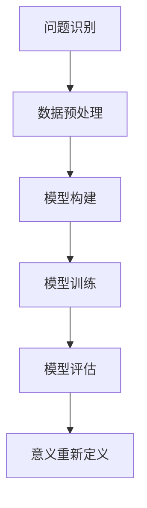

                 

### 《工作意义的重新定义》：引言与背景

在当今快速变化的社会和工作环境中，我们不断感受到工作和生活之间的界限变得日益模糊。传统的工作模式在数字革命和人工智能的浪潮下受到了极大的冲击，随之而来的问题是，工作的意义何在？人们如何在工作中找到自我价值和成就感？这个问题不仅困扰着个体，也引起了学术界和企业界的广泛关注。

#### 1.1 工作意义缺失的现象

在现代社会中，越来越多的人感到工作缺乏意义，他们对自己的职业选择感到迷茫，甚至出现了职业倦怠和离职率上升的现象。这种工作意义的缺失不仅影响了个人的心理健康，也对企业的生产力和社会的稳定造成了影响。

#### 1.1.1 工作意义缺失的现象

1. **职业倦怠**：长期从事单调乏味的工作，缺乏成就感和自我实现的满足感，导致员工对工作产生厌恶和疲劳感。
2. **工作与生活失衡**：高强度的工作要求和对工作效率的重视，使得员工难以平衡工作与家庭、个人生活的关系。
3. **工作满意度下降**：尽管薪资和工作条件得到改善，但员工对工作本身的价值认同感下降，满意度也随之降低。

#### 1.1.2 社会与经济影响

工作意义的缺失不仅仅是一个个体问题，它还对社会和经济产生了深远的影响：

1. **生产力下降**：员工缺乏工作动力，导致工作效率和生产力的下降。
2. **社会稳定问题**：工作意义的缺失可能引发社会不满情绪，增加社会动荡的风险。
3. **企业竞争力下降**：员工流失率增加，企业难以维持长期的竞争力。

#### 1.1.3 研究现状与问题

学术界和企业界对工作意义的定义和重新定义进行了大量研究，但至今仍存在以下问题：

1. **定义的多元化**：不同学者和机构对工作意义的理解各异，缺乏统一的标准。
2. **研究的局限性**：大部分研究集中在特定行业或国家，缺乏全球性的视角。
3. **理论应用不足**：虽然有许多理论框架提出，但在实际工作中的应用效果有限。

#### 1.2 工作意义的定义

要重新定义工作的意义，我们首先需要明确什么是工作意义。工作意义可以从多个角度进行理解：

1. **传统视角**：工作被视为实现个人经济收入和社会地位的途径，同时也是实现个人价值的一种方式。
2. **现代视角**：工作不仅关乎物质收入，更关乎个人成长、自我实现和社会贡献。

#### 1.2.1 传统视角下的工作意义

在传统视角中，工作主要被视为以下几方面的实现途径：

1. **经济收入**：工作是获取经济来源的主要方式，为个人和家庭提供生活所需的物质财富。
2. **社会地位**：通过工作，个人可以获得社会地位和认可，提升个人的社会声望。
3. **个人价值**：工作被视为实现个人价值的一种途径，通过工作，个人可以实现自我成就和社会贡献。

#### 1.2.2 现代视角下的工作意义

随着社会和经济的变迁，现代视角对工作意义的理解发生了变化：

1. **个人成长**：工作不仅是一个经济活动，更是一个学习和成长的过程。通过工作中的挑战和经验积累，个人可以不断提升自己的技能和知识。
2. **自我实现**：工作被视为实现个人梦想和追求的一种方式，通过工作，个人可以实现自我价值和社会认同。
3. **社会贡献**：现代视角认为，工作不仅是个人生存和发展的需要，更是对社会作出贡献的一种方式。

#### 1.2.3 多元文化中的工作意义

不同文化背景下的工作意义也有所差异。例如，在一些亚洲文化中，工作被视为实现家庭责任和社会期待的一种方式；而在一些西方文化中，个人追求和自我实现被视为工作意义的核心。

#### 1.3 书籍目的与结构

本书旨在重新定义工作的意义，帮助读者在快速变化的社会和工作环境中找到自我价值和成就感。本书将分为以下几个部分：

1. **引言与背景**：介绍工作意义缺失的现象、研究现状和问题。
2. **重新定义工作的意义**：从多个角度探讨工作意义的重新定义。
3. **社会与工作环境的变化**：分析技术进步和经济发展对工作意义的影响。
4. **个体的自我认知与成长**：探讨个体如何通过自我认知和职业发展找到工作意义。
5. **组织与企业文化的转变**：分析组织和企业文化对工作意义的影响。
6. **实践与案例研究**：通过案例研究，探讨工作意义的实际应用和影响。
7. **未来展望与趋势**：预测未来工作意义的方向和发展趋势。

#### 1.3.1 阅读对象

本书适合以下读者群体：

1. **职场人士**：希望通过重新定义工作意义，找到工作动力和成就感的职场人士。
2. **企业管理者**：希望通过本书，了解员工工作意义的重要性，提升企业文化和员工满意度。
3. **学术界研究者**：对工作意义相关理论和实践感兴趣的学者和研究人员。

#### 1.3.2 主要内容

本书将主要探讨以下内容：

1. **工作意义的传统和现代定义**：通过对比传统和现代视角，探讨工作意义的变迁。
2. **社会与经济变化对工作意义的影响**：分析技术进步和经济发展对工作意义的重塑。
3. **个体的自我认知与职业发展**：探讨个体如何通过自我认知和职业规划，找到工作意义。
4. **组织与企业文化的转变**：分析组织和企业文化对工作意义的影响，探讨如何通过文化变革提升员工的工作满意度。
5. **实践与案例研究**：通过实际案例，探讨工作意义的重新定义在企业和个人层面的应用。
6. **未来展望与趋势**：预测未来工作意义的方向和发展趋势，为读者提供参考和启示。

#### 1.3.3 阅读建议

为了更好地理解和应用本书的内容，建议读者在阅读过程中注意以下几点：

1. **结合实际经历**：将本书的理论和观点与个人的工作经历相结合，思考如何重新定义自己的工作意义。
2. **批判性思考**：对于书中的观点和理论，保持开放和批判的态度，结合自己的经验和观点进行思考。
3. **持续学习**：工作意义的重新定义是一个持续的过程，建议读者在阅读过程中不断学习和反思，提升自己的认知和能力。
4. **实践应用**：将书中的理论和方法应用到实际工作和生活中，通过实践检验和验证自己的理解。

通过本书的阅读和实践，读者将能够重新定义自己的工作意义，找到工作动力和成就感，实现个人和职业的全面发展。

---

### 重新定义工作的意义

在现代社会中，工作的意义不再仅仅是谋生的手段，而是一种更广泛、更深刻的个人和社会价值的体现。随着技术进步、社会结构变化和经济发展的不断推进，我们对工作的理解也在不断更新和深化。重新定义工作的意义，不仅有助于个体找到职业成就感和自我实现，也对企业和社会的发展产生深远影响。

#### 2.1 核心概念与联系

重新定义工作的意义，首先需要明确几个核心概念：

1. **工作**：工作不仅仅是体力或脑力劳动，更是一种实现个人目标、满足社会需求和实现自我价值的过程。
2. **意义**：意义是一种主观感受，是指个体在工作中获得的满足感、成就感和社会认可。
3. **价值观**：价值观是指个体对什么是好的、重要的事情的看法，它影响个体在工作中的选择和行为。

#### 2.1.1 工作意义的核心概念

工作意义的核心概念包括以下几个方面：

1. **自我实现**：通过工作实现个人潜能，实现自我价值和成长。
2. **社会贡献**：通过工作为社会做出贡献，获得社会认可和尊重。
3. **经济收益**：工作为个人提供经济来源，满足基本生活需求。
4. **职业发展**：通过工作实现职业目标，提升职业地位和技能水平。

#### 2.1.2 核心概念属性特征对比

为了更好地理解这些核心概念，我们可以通过一个对比表格来展示它们的属性特征：

| 核心概念 | 定义 | 属性特征 |
| --- | --- | --- |
| 自我实现 | 实现个人潜能，追求自我价值 | 自主性、创造性、成长性 |
| 社会贡献 | 为社会做出贡献，获得社会认可 | 公益性、社会责任、影响力 |
| 经济收益 | 提供经济来源，满足基本需求 | 收益性、可持续性、稳定性 |
| 职业发展 | 实现职业目标，提升职业地位 | 目标性、挑战性、竞争力 |

#### 2.1.3 ER实体关系图

为了更直观地展示这些核心概念之间的关系，我们可以使用ER实体关系图来表示：

```mermaid
erDiagram
  Work ||--|{ Meaning }|--|{ Self-Realization }
  Work ||--|{ Meaning }|--|{ Social-Contribution }
  Work ||--|{ Meaning }|--|{ Economic-Income }
  Work ||--|{ Meaning }|--|{ Career-Development }
  Meaning ||--|{ Self-Realization }|-> Role: Achieving Personal Potential
  Meaning ||--|{ Social-Contribution }|-> Role: Making Social Contributions
  Meaning ||--|{ Economic-Income }|-> Role: Providing Financial Resources
  Meaning ||--|{ Career-Development }|-> Role: Achieving Professional Goals
```

在这个ER实体关系图中，工作作为中心实体，与四个核心意义概念之间存在关联。每个核心意义概念又具有特定的角色和功能，共同构成一个完整的工作意义体系。

---

通过明确这些核心概念和它们之间的联系，我们可以更好地理解工作的多维度意义，从而为重新定义工作意义提供理论基础和实践指导。在下一节中，我们将深入探讨工作意义重新定义的算法原理，帮助读者从技术角度理解这一过程的实现方法。

---

### 算法原理讲解

在重新定义工作意义的过程中，我们需要借助算法原理来系统性地分析和解决问题。本节将详细介绍工作意义重新定义的算法，包括算法流程、数学模型、公式和实际应用案例。

#### 2.2.1 工作意义重新定义的算法

工作意义重新定义的算法可以概括为以下步骤：

1. **问题识别**：通过问卷调查、访谈等方式收集员工对工作意义的理解。
2. **数据预处理**：对收集到的数据进行分析和清洗，提取关键信息。
3. **模型构建**：利用机器学习算法构建工作意义模型。
4. **模型训练**：使用训练数据对模型进行训练，优化模型参数。
5. **模型评估**：使用测试数据评估模型性能，确保模型有效性和准确性。
6. **意义重新定义**：根据模型输出结果，重新定义员工的工作意义。

#### 2.2.1.1 算法mermaid流程图

下面是一个使用mermaid绘制的算法流程图：



#### 2.2.2 算法原理

工作意义重新定义的算法基于机器学习和自然语言处理技术，其核心原理如下：

1. **数据收集**：通过问卷调查、访谈等方式收集员工对工作意义的描述性数据。
2. **特征提取**：对收集到的文本数据进行分词、词性标注和情感分析，提取关键特征。
3. **模型训练**：使用提取到的特征数据，通过机器学习算法（如神经网络、决策树等）训练工作意义模型。
4. **模型评估**：使用交叉验证和测试集对模型进行评估，确保模型具有良好的泛化能力和预测准确性。
5. **意义输出**：根据模型输出结果，为员工重新定义工作意义，并提供个性化的职业发展建议。

#### 2.2.3 算法数学模型与公式

工作意义重新定义的算法涉及到多个数学模型和公式。以下是一个简化的模型框架：

$$
\text{意义评分} = f(\text{特征向量})
$$

其中，$f$ 是一个函数，用于将特征向量映射为意义评分。具体实现可以采用以下步骤：

1. **特征提取**：使用自然语言处理技术提取文本数据中的关键特征，如词频、情感倾向、主题分布等。
2. **特征融合**：将提取到的特征进行融合，构建一个综合的特征向量。
3. **模型训练**：使用机器学习算法（如神经网络、决策树等）训练模型，将特征向量映射为意义评分。
4. **模型评估**：使用交叉验证和测试集对模型进行评估，确保模型具有良好的泛化能力和预测准确性。

#### 2.2.4 举例说明

为了更好地理解工作意义重新定义的算法，我们可以通过一个简单的实际案例进行说明：

**案例**：某公司希望通过重新定义工作意义，提升员工的工作满意度和职业发展。

**步骤**：

1. **问题识别**：通过问卷调查收集员工对工作意义的描述性数据。
2. **数据预处理**：对收集到的数据进行分词、词性标注和情感分析，提取关键特征。
3. **模型构建**：使用机器学习算法（如神经网络）构建工作意义模型。
4. **模型训练**：使用训练数据对模型进行训练，优化模型参数。
5. **模型评估**：使用测试数据评估模型性能，确保模型有效性和准确性。
6. **意义输出**：根据模型输出结果，为员工重新定义工作意义，并提供个性化的职业发展建议。

**结果**：通过重新定义工作意义，该公司发现员工的工作满意度和职业发展意愿显著提升，公司的整体生产力也得到了提高。

通过这个案例，我们可以看到，工作意义重新定义的算法在实践中的应用效果显著。在下一节中，我们将进一步探讨技术进步对工作意义的影响，帮助读者理解这一过程在现实环境中的具体表现。

---

### 技术进步对工作意义的影响

随着信息技术的迅猛发展，人工智能、大数据和自动化技术的广泛应用，工作环境和职业模式正在经历深刻的变革。这些技术不仅改变了工作的本质，也对工作意义的定义和重新定义产生了深远影响。

#### 3.1 信息技术革命

信息技术的革命性变化，使得信息的获取、处理和传递变得更加高效和便捷。这一变化对工作意义的影响主要体现在以下几个方面：

1. **工作方式的变化**：信息技术的普及使得远程办公、在线协作和自动化工具成为可能，打破了传统的工作时间和地点限制，使员工可以更加灵活地安排工作。
2. **工作内容的丰富**：信息技术使得员工能够接触到更广泛的知识和信息，从而在工作内容上有了更多的选择和创造空间，提高了工作的多样性和趣味性。
3. **工作压力的调整**：信息技术的应用可以减轻员工在信息处理和重复性工作上的负担，使员工有更多时间专注于创新和战略性任务，从而减轻工作压力。

#### 3.1.1 信息技术革命的影响

**影响1：工作方式的灵活性增加**

随着远程办公和在线协作工具的普及，员工可以在任何地点、任何时间进行工作。这种灵活性不仅提高了工作效率，也使得员工可以更好地平衡工作与生活。例如，一些科技公司已经实行了弹性工作时间制度，员工可以在早上九点到晚上六点之间选择任意时间开始和结束工作。

**影响2：工作内容的多样化**

信息技术的应用使得员工能够接触到更多的资源和知识，从而在工作内容上有了更多的选择。例如，数据分析、人工智能和区块链等新技术的发展，使得员工可以在这些新兴领域找到更多的职业机会，从而实现职业的多样化和专业化。

**影响3：工作压力的调整**

信息技术的应用可以大大减轻员工在信息处理和重复性工作上的负担。例如，自动化工具可以处理大量的数据录入和重复性工作，使员工有更多时间专注于创新和战略性任务。此外，人工智能和机器学习技术还可以帮助员工识别和解决工作中的问题，从而降低工作压力。

#### 3.1.2 人工智能与自动化

人工智能和自动化技术的应用，进一步加速了工作环境和职业模式的变革。这些技术不仅改变了工作的本质，也对工作意义的重新定义产生了深远影响。

1. **工作效率的提升**：人工智能和自动化技术可以大大提高工作效率，减少人工错误，从而使得员工可以将更多的时间和精力投入到更有价值的任务中。
2. **工作复杂性的降低**：人工智能和自动化技术可以处理复杂的计算和任务，降低了工作的复杂度，使得更多的非专业技术人员可以参与到工作中来。
3. **工作满意度的提升**：通过减少重复性和单调的工作任务，人工智能和自动化技术可以提升员工的工作满意度，使他们更加享受工作过程。

#### 3.1.3 人工智能与自动化的影响

**影响1：工作效率的提升**

人工智能和自动化技术的应用，使得员工可以从重复性、低价值的工作中解放出来，专注于更有创意和挑战性的任务。例如，自动化的客户服务系统可以处理大量的客户咨询，使客服人员有更多时间专注于解决复杂的客户问题。

**影响2：工作复杂性的降低**

自动化工具和人工智能系统可以处理复杂的计算和任务，从而降低了工作的复杂度。例如，人工智能算法可以自动分析大量的市场数据，提供精准的市场预测和决策支持，降低了市场分析工作的复杂性。

**影响3：工作满意度的提升**

通过减少重复性和单调的工作任务，人工智能和自动化技术可以提升员工的工作满意度。例如，自动化工具可以处理大量的数据录入工作，使员工有更多时间专注于数据分析和创新，从而提高他们的工作满意度和成就感。

#### 3.1.4 工作岗位的变迁

随着人工智能和自动化的广泛应用，工作岗位也在发生显著变化。一些传统岗位可能会被自动化技术取代，同时，也会出现许多新的职业机会。

1. **传统岗位的消失**：一些重复性和低技能的工作，如数据录入、流水线操作等，可能会被自动化技术取代。这些岗位的消失，使得许多传统职业面临失业的风险。
2. **新兴职业的出现**：随着新技术的应用，许多新的职业机会也在不断涌现。例如，人工智能工程师、数据科学家、自动化系统集成师等，这些新兴职业需要高技能和专业知识的支持。

#### 3.1.5 劳动力市场的变革

人工智能和自动化技术的应用，对劳动力市场也产生了深远影响。一方面，这些技术提高了生产效率，增加了企业的竞争力；另一方面，它们也对劳动力的需求和供给提出了新的挑战。

1. **劳动力需求的变化**：随着自动化技术的普及，一些传统岗位的需求可能会减少，而新兴职业的需求可能会增加。例如，对技术人才的需求将大大增加，而对低技能劳动力的需求可能会下降。
2. **劳动力供给的挑战**：劳动力市场的变革要求劳动者具备更高的技能和知识。然而，现有的教育体系和职业培训水平可能无法满足这些需求，导致劳动力供给不足。

#### 3.1.6 薪资结构与工作满意度

人工智能和自动化技术的应用，也对薪资结构和员工工作满意度产生了影响。一方面，技术人才的需求增加，导致技术人才的薪资水平上升；另一方面，传统岗位的需求减少，可能会导致这些岗位的薪资水平下降。

1. **薪资结构的变化**：技术人才的薪资水平上升，而传统岗位的薪资水平可能下降。这种薪资结构的变化，可能会影响员工的工作满意度和职业发展意愿。
2. **工作满意度的提升**：通过减少重复性和单调的工作任务，人工智能和自动化技术可以提升员工的工作满意度。然而，这种提升可能因岗位的不同而有所差异。

总之，技术进步对工作意义的影响是多方面的。信息技术、人工智能和自动化技术的应用，不仅改变了工作方式和内容，也重新定义了工作的意义。在新的工作环境中，员工需要不断学习和适应，才能在职业发展中找到新的意义和成就感。在下一节中，我们将探讨经济发展对工作意义的重新定义，帮助读者理解这一过程在社会层面上的影响。

---

### 经济发展与工作意义的重新定义

经济发展是社会进步的重要驱动力，它不仅改变了人们的生产方式和生活方式，也深刻影响了工作意义的重新定义。在全球化和技术革命的背景下，经济发展对工作意义的影响体现在多个方面，包括全球化与国际化、劳动力市场的变革以及薪资结构与工作满意度的变化。

#### 3.2.1 全球化与国际化

全球化带来了国际贸易、资本流动和人员交流的加速，推动了全球经济的深度融合。国际化使得企业可以跨越地域限制，进入新的市场和领域，从而创造了大量的工作机会。然而，全球化也带来了竞争的加剧和劳动力市场的波动。

1. **跨国公司的影响**：全球化使得跨国公司可以在全球范围内进行资源配置，这种全球化经营模式创造了大量的跨国工作岗位。跨国公司的本地化战略也促进了本地人才的成长和职业发展。
2. **劳动力市场的国际化**：全球化带来了劳动力市场的国际化，人才可以在全球范围内流动，跨国企业和跨国项目为员工提供了更多的职业机会和挑战。然而，这也使得劳动力市场的竞争更加激烈。

#### 3.2.2 劳动力市场的变革

随着经济发展，劳动力市场也在不断变革。技术进步、产业升级和劳动力结构的变化，都对劳动力市场产生了深远影响。

1. **技术进步的影响**：技术进步特别是人工智能和自动化技术的应用，使得劳动力市场的需求结构发生了变化。一些传统岗位可能会被自动化取代，而新兴的职业机会如数据科学家、人工智能工程师等需求不断增加。
2. **产业升级的影响**：产业升级带来了劳动力市场的结构性变化。传统制造业向服务业转型，新兴产业的兴起如信息技术、生物科技等，为劳动力市场注入了新的活力。
3. **劳动力结构的变化**：随着人口老龄化，劳动力市场出现了结构性的变化。劳动力供给减少，对高素质劳动力需求增加。此外，女性劳动力的参与度提高，也改变了劳动力市场的性别结构。

#### 3.2.3 薪资结构与工作满意度

经济发展对薪资结构和工作满意度也产生了显著影响。

1. **薪资结构的变化**：随着经济的发展，薪资水平普遍提高。技术人才和高端管理人才的薪资水平上升，而传统制造业等行业的薪资水平相对下降。这种薪资结构的变化，影响了员工的工作满意度和职业发展意愿。
2. **工作满意度的影响**：经济发展提高了员工的生活水平，但同时也带来了工作压力的增加。高强度的工作要求、工作与生活的平衡问题等，都成为影响工作满意度的关键因素。

#### 3.2.4 经济发展与工作意义

经济发展不仅改变了劳动力市场，也重新定义了工作的意义。在新的经济环境下，工作意义变得更加多元化，不仅包括经济收入，还涵盖了个人成长、社会贡献和职业发展。

1. **经济收入**：经济收入的提高使得工作不再是单纯的生存手段，而成为实现个人价值和家庭幸福的途径。
2. **个人成长**：随着教育的普及和职业培训的加强，员工通过工作不断提升自己的技能和知识，实现个人成长和职业发展。
3. **社会贡献**：工作不再仅仅是为了谋生，更是为社会作出贡献的一种方式，通过工作，员工可以实现自己的社会责任和使命感。
4. **职业发展**：职业发展成为工作意义的重要组成部分，员工通过不断学习和实践，追求职业上的成就和满足感。

#### 3.2.5 经济发展的影响

经济发展对工作意义的重新定义，不仅影响了员工个人的职业发展，也对企业和社会产生了深远影响。

1. **企业的影响**：经济发展提高了企业的竞争力和创新能力，使得企业能够更好地适应市场变化和客户需求，从而提升企业的绩效和竞争力。
2. **社会的影响**：经济发展推动了社会整体福利的提高，使得更多的人能够享受更好的教育和职业培训机会，从而提高社会整体的人力资本水平。

总之，经济发展对工作意义的重新定义，使得工作变得更加多元化、复杂化和富有挑战性。在新的经济环境下，员工需要不断适应和调整，找到新的工作意义和职业发展路径。在下一节中，我们将探讨个体如何通过自我认知和职业发展，找到工作的意义。

---

### 重新发现自我价值

在快速变化的社会和工作环境中，个体如何找到自我价值和成就感，重新定义工作的意义，成为了一个至关重要的问题。通过自我认知和职业发展，个体可以在工作和生活中找到新的方向和动力。

#### 4.1.1 自我认知的重要性

自我认知是找到工作意义的第一步。个体需要深入理解自己的兴趣、价值观、能力和优势，从而找到与自己相匹配的工作和职业路径。以下是一些自我认知的方法：

1. **自我反思**：定期进行自我反思，思考自己在工作中的收获和不足，分析自己的行为和决策，了解自己的价值观和目标。
2. **职业评估**：通过职业评估工具，如MBTI、DISC等，了解自己的性格特点和适合的职业类型。
3. **职业咨询**：寻求专业的职业咨询师的帮助，进行深入的自我探索和职业规划。
4. **兴趣探索**：通过尝试不同的活动和领域，发现自己的兴趣和热情所在。

#### 4.1.2 自我认知的方法

自我认知的方法可以分为以下几个步骤：

1. **明确目标**：明确自己的职业目标和个人目标，确定自己想要实现的事情和成为的人。
2. **了解自己的价值观**：了解自己的核心价值观，这些价值观将指导自己的行为和决策。
3. **分析能力与优势**：评估自己的技能和优势，了解自己在哪些领域具有竞争力。
4. **识别兴趣和热情**：探索自己的兴趣和热情所在，找到能够激发自己热情的工作领域。
5. **持续学习**：通过不断学习和提升自己的技能，增强自己的竞争力。

#### 4.1.3 个人成长路径

个人成长是一个持续的过程，通过以下步骤，个体可以逐步实现自我价值和成就感：

1. **设定短期目标**：设定清晰的短期目标，如提升某一技能、完成一项项目等，这些目标有助于个体保持动力和方向。
2. **实现短期目标**：通过努力和行动，实现设定的短期目标，从而积累经验和成就感。
3. **评估和调整**：定期评估自己的职业发展路径，根据实际情况进行必要的调整和改进。
4. **长期规划**：设定长期的职业规划，如晋升、转行、创业等，确保个人成长路径的连贯性和可持续性。
5. **持续学习与成长**：保持持续学习的态度，不断提升自己的知识和技能，适应快速变化的社会和工作环境。

#### 4.1.4 职业发展与工作满意度

职业发展是实现自我价值和成就感的重要途径。以下是一些策略，可以帮助个体提升职业发展和工作满意度：

1. **职业规划**：制定明确的职业规划，确定自己的职业目标和路径，有针对性地进行职业发展。
2. **持续学习**：通过参加培训、读书、参加行业活动等方式，不断提升自己的知识和技能，保持竞争力。
3. **积极沟通**：与上级和同事保持良好的沟通，了解工作反馈和改进建议，为自己的职业发展提供支持。
4. **工作与生活的平衡**：合理安排工作和生活，保持身心健康，提高工作满意度和生活质量。
5. **寻找激励因素**：找到自己工作的重要激励因素，如成就感、社会认可、经济收益等，保持工作动力和热情。

通过重新发现自我价值，个体可以在工作和生活中找到新的方向和动力，实现个人和职业的全面发展。在下一节中，我们将探讨如何通过职业规划，提升工作满意度和职业发展。

---

### 职业规划与工作满意度

职业规划是实现工作满意度和职业发展的关键环节。通过科学的职业规划，个体可以明确自己的职业目标，制定实现这些目标的具体步骤，从而在职业生涯中取得持续进步。

#### 4.2.1 职业规划

职业规划可以分为以下几个步骤：

1. **自我评估**：进行全面的自我评估，了解自己的兴趣、价值观、能力和优势。这一步骤有助于确定适合的职业方向。
2. **市场分析**：分析劳动力市场的需求，了解目标职业的发展前景和竞争情况。这有助于制定具有可行性的职业规划。
3. **目标设定**：根据自我评估和市场分析的结果，设定明确的职业目标。这些目标可以是短期的，如提升某一技能或完成一个项目，也可以是长期的，如晋升或转行。
4. **制定行动计划**：为实现职业目标，制定具体的行动计划。这些计划应包括具体的学习和提升措施、时间表和预期成果。
5. **执行与调整**：按照行动计划执行，同时根据实际情况进行必要的调整和改进。

#### 4.2.2 工作满意度的评估

工作满意度是衡量职业规划成效的重要指标。以下是一些评估工作满意度的方法：

1. **自我反思**：定期进行自我反思，思考自己在工作中的成就、挑战和成长，了解自己的工作满意度。
2. **工作满意度调查**：使用标准化的工作满意度调查工具，如问卷或量表，评估员工对工作各方面的满意度，如薪资待遇、工作环境、职业发展等。
3. **绩效评估**：通过绩效评估，了解自己的工作表现和贡献，从而判断工作满意度。

#### 4.2.3 提升工作满意度的策略

为了提升工作满意度，个体可以采取以下策略：

1. **职业目标明确**：设定清晰的职业目标，使工作更有方向和意义，从而提高工作动力和满意度。
2. **持续学习与成长**：通过不断学习和提升自己的技能，增强职业竞争力，实现职业发展，从而提升工作满意度。
3. **工作与生活的平衡**：合理安排工作和生活，保持身心健康，提高生活质量，从而提升工作满意度。
4. **积极沟通与反馈**：与上级和同事保持良好的沟通，了解工作反馈和建议，及时调整工作方式和方法，从而提升工作满意度。
5. **工作环境改善**：优化工作环境，如改善办公条件、提升团队协作氛围等，从而提高工作满意度。

通过职业规划和提升工作满意度，个体可以在职业生涯中实现自我价值和成就感。在下一节中，我们将探讨组织与企业文化的转变如何影响工作意义。

---

### 组织与企业文化的转变

组织和企业文化的转变对工作意义有着深远的影响。随着社会和技术的不断进步，企业正从传统的层级式管理向更加灵活、开放和创新的文化模式转变。这种文化转变不仅影响了员工的工作方式，也重新定义了工作的意义。

#### 5.1 企业文化的演变

企业文化是企业价值观、行为准则和工作氛围的集合体，它影响着员工的行为和工作态度。随着时代的发展，企业文化也在不断演变：

1. **传统企业文化**：在传统企业文化中，权威和等级制度占据主导地位，员工的工作主要依赖于指令和规范。这种文化强调稳定性和控制，但可能导致创新和自主性的缺乏。
2. **现代企业文化**：现代企业文化更加注重员工的参与和创造力，鼓励员工自主学习和自我管理。这种文化强调协作、共享和创新，有助于提高员工的工作满意度和生产力。

#### 5.1.1 传统企业文化

传统企业文化具有以下特点：

1. **权威与等级制度**：管理层拥有绝对权威，员工按照指令行事，缺乏自主权和决策权。
2. **规范化管理**：工作流程和标准高度规范化，员工的行为受到严格约束。
3. **稳定性优先**：企业注重稳定性和长期发展，创新和变革受到限制。

#### 5.1.2 现代企业文化

现代企业文化则呈现出以下特征：

1. **员工参与**：鼓励员工参与决策，提升员工的自主性和责任感。
2. **创新驱动**：鼓励员工提出新想法和解决方案，推动企业创新和持续发展。
3. **共享文化**：强调团队协作和知识共享，促进员工的共同成长。

#### 5.1.3 企业文化对工作意义的影响

企业文化的转变对工作意义有着重要的影响：

1. **工作价值的提升**：现代企业文化鼓励员工创新和自我实现，使员工在工作过程中能够找到更多的价值感。
2. **工作满意度的提升**：开放和协作的企业文化使员工感受到更多的支持和认可，从而提高工作满意度。
3. **职业发展的机会**：企业文化的变革为员工提供了更多的职业发展机会，使员工能够在企业内部实现职业目标。

#### 5.2 组织行为的改变

组织行为的改变是企业文化演变的重要体现。以下是一些组织行为的变化：

1. **领导风格的变化**：现代领导风格更加注重赋能和激励，鼓励员工发挥潜力，实现个人和组织的共同目标。
2. **团队协作**：通过跨部门合作和团队项目，促进知识共享和协作，提升工作效率和质量。
3. **持续学习**：组织鼓励员工持续学习和提升技能，以适应快速变化的工作环境。

#### 5.2.1 领导风格

领导风格对企业文化和工作意义有着重要影响。以下是一些现代领导风格：

1. **赋能型领导**：领导通过赋予员工自主权和决策权，激发员工的潜力和创造力。
2. **激励型领导**：领导通过奖励和认可，激励员工积极工作，实现个人和组织的共同目标。
3. **辅导型领导**：领导通过指导和辅导，帮助员工提升技能和职业发展，实现个人成长。

#### 5.2.2 团队合作

团队合作是现代企业文化的重要组成部分。以下是一些团队合作的特点：

1. **共享目标**：团队成员共同明确工作目标，确保工作方向一致。
2. **分工协作**：团队成员根据各自的优势和职责，分工合作，共同完成任务。
3. **知识共享**：团队成员之间积极分享知识和经验，提升整体工作效率和质量。

#### 5.2.3 组织学习与创新

组织学习与创新是企业文化变革的重要方向。以下是一些组织学习和创新的方法：

1. **持续培训**：组织定期提供培训和学习机会，提升员工的技能和知识。
2. **创新激励**：组织鼓励员工提出新想法和解决方案，通过创新激励政策，激发员工的创新潜力。
3. **学习社区**：组织建立学习社区，促进员工之间的知识和经验交流，提升组织整体的学习能力。

通过组织与企业文化的转变，企业可以为员工创造一个更加有价值和意义的工作环境。在下一节中，我们将通过实际案例，探讨工作意义的重新定义在个人和组织层面的应用和实践。

---

### 实践与案例研究

在实际工作和生活中，重新定义工作意义的理念已经被广泛应用，并在个人和组织层面上取得了显著的成效。以下我们将通过几个具体的案例，深入探讨工作意义的重新定义如何在实践中发挥作用。

#### 6.1 案例研究

**案例一：个人层面**

**背景**：小李是一名在一家传统制造企业工作的工程师。他一直对自己的职业感到迷茫，感觉工作缺乏意义。

**过程**：小李通过自我反思和职业咨询，发现他对新兴的智能制造技术充满兴趣。他决定参加相关的培训和认证，提升自己的技能。同时，他主动申请参与了公司的智能制造项目，积极提出创新建议。

**结果**：通过参与智能制造项目，小李不仅提升了自己的技术能力，还找到了工作的新意义。他感受到了技术进步带来的变革，对公司和社会的贡献也有了更深的认识。最终，他的表现得到了公司的认可，获得了晋升和加薪。

**启示**：这个案例表明，通过自我认知和职业发展，个体可以找到新的工作意义，实现自我价值和成就感。

**案例二：组织层面**

**背景**：某科技公司面临激烈的市场竞争，员工的工作满意度和工作效率都较低。

**过程**：公司决定重新定义工作意义，通过一系列措施提升员工的工作动力和满意度。首先，公司引入了敏捷管理和开放式办公环境，鼓励员工自主管理和创新。其次，公司建立了员工成长计划，提供培训和学习机会。最后，公司通过员工反馈机制，及时了解员工的需求和意见，优化工作环境。

**结果**：经过一系列措施，公司员工的工作满意度和工作效率显著提升。员工更愿意参与公司的项目和创新活动，公司的竞争力也得到了增强。

**启示**：这个案例表明，通过改变组织文化和工作环境，企业可以重新定义工作意义，提升员工的积极性和创造力。

**案例三：社会层面**

**背景**：某非政府组织（NGO）致力于环境保护和社区发展，但其工作性质较为单调，员工缺乏工作动力。

**过程**：NGO决定重新定义工作意义，通过提高员工参与度和项目创新，提升员工的工作满意度。首先，组织开展了主题讨论和团队建设活动，增强员工的凝聚力和归属感。其次，组织引入了创新项目，鼓励员工提出环保和社区发展的新思路。最后，组织通过外部合作和公众参与，扩大了项目的影响力。

**结果**：通过重新定义工作意义，NGO员工的工作动力和满意度显著提升。他们更积极地参与项目，创新意识也更强。项目的影响力也得到了扩大，获得了更多的社会认可和支持。

**启示**：这个案例表明，通过重新定义工作意义，社会机构可以激发员工的潜能，实现更大的社会价值。

#### 6.2 案例分析与解读

**案例一分析**：

- **核心问题**：个人职业迷茫，缺乏工作意义。
- **解决方法**：自我认知、职业规划和创新项目参与。
- **成效**：技能提升、职业发展、工作意义增强。

**案例二分析**：

- **核心问题**：员工工作满意度低，工作效率低。
- **解决方法**：组织文化变革、员工成长计划、员工反馈机制。
- **成效**：员工积极性提升、工作效率提高、公司竞争力增强。

**案例三分析**：

- **核心问题**：员工工作动力不足，项目影响力有限。
- **解决方法**：团队建设、创新项目、外部合作。
- **成效**：员工工作满意度提升、项目影响力扩大、社会认可度增强。

#### 6.2.1 工作意义的重新定义在案例中的应用

在以上案例中，工作意义的重新定义主要体现在以下几个方面：

1. **自我实现**：通过职业规划和创新项目，个体找到了新的职业方向和成就感。
2. **社会贡献**：通过参与有意义的项目和社会活动，个体和社会机构实现了对社会和环境的贡献。
3. **团队合作**：通过团队建设和外部合作，个体和团队找到了共同的目标和价值。
4. **持续学习**：通过学习和培训，个体不断提升自己的技能和知识，保持竞争力。

#### 6.2.2 案例带来的启示与反思

从以上案例中，我们可以得出以下启示和反思：

1. **重视自我认知和职业规划**：个体需要通过自我认知和职业规划，找到与自己相匹配的工作和职业路径。
2. **改变组织文化和工作环境**：企业和社会机构需要通过改变文化和环境，激发员工的潜能和创造力。
3. **注重团队合作和外部合作**：个体和组织需要通过团队合作和外部合作，实现更大的社会价值和影响力。
4. **持续学习和创新**：个体和组织需要不断学习和创新，以适应快速变化的社会和工作环境。

#### 6.2.3 案例的未来趋势与影响

随着技术的进步和社会的变革，工作意义的重新定义将继续影响个体和组织的未来发展：

1. **技术驱动的工作意义**：人工智能和自动化技术的应用，将使工作更加智能化和自动化，个体的工作内容和方式也将发生变革。
2. **可持续发展的工作意义**：社会对可持续发展的需求日益增加，个体和组织需要找到符合可持续发展目标的工作方式和职业路径。
3. **多元化工作意义的实现**：随着社会和文化多样性的增加，工作意义的定义也将更加多元化，个体和组织需要适应和尊重不同的工作意义。

通过实际案例的研究和解读，我们可以看到工作意义的重新定义在个人和组织层面的重要性和应用价值。在下一节中，我们将探讨未来工作意义的方向和发展趋势。

---

### 未来展望与趋势

随着科技的迅猛发展和全球化进程的加速，未来工作意义的方向和发展趋势将呈现出多样化和复杂化的特点。以下从技术进步、社会变化和个体需求三个方面，探讨未来工作意义的方向和发展趋势。

#### 7.1.1 技术进步的影响

1. **人工智能与自动化**：人工智能和自动化技术的应用将改变工作的本质，使人类从重复性、低价值的劳动中解放出来，专注于更有创造性和战略性的任务。这将为工作意义的重新定义带来新的契机，使个体能够在技术进步的背景下实现自我价值和成就感。
2. **区块链技术**：区块链技术将为工作提供新的信任机制和协作模式，促进去中心化工作和共享经济的蓬勃发展。个体可以在全球范围内参与各种项目和合作，重新定义工作方式和职业路径。

#### 7.1.2 社会变化的影响

1. **全球化和数字化**：全球化和数字化的发展，使得信息和资源更加开放和共享，个体和组织可以更加便捷地获取和利用全球资源。这种趋势将推动工作意义的多元化，个体可以在全球范围内实现自我价值和职业发展。
2. **可持续发展的需求**：随着环境保护和可持续发展的呼声日益高涨，社会对个体和组织在环保和可持续发展方面的期望也在增加。未来工作意义的定义将更加注重社会责任和环境保护，个体和组织需要找到符合可持续发展目标的工作方式和职业路径。

#### 7.1.3 个体需求的影响

1. **个性化和多样化**：随着社会和经济的不断发展，个体对职业发展的需求越来越多样化和个性化。未来工作意义的定义将更加注重个体的兴趣、价值观和目标，个体可以通过自我认知和职业规划，找到符合自己需求的工作方式和职业路径。
2. **终身学习和持续成长**：在快速变化的社会和工作环境中，个体需要具备终身学习和持续成长的能力，以适应不断变化的需求和挑战。未来工作意义的定义将更加注重个体的学习和发展，个体可以通过不断学习和提升自己的技能，实现个人价值和职业发展。

#### 7.1.4 未来工作意义的方向

1. **自我实现和社会贡献**：未来工作意义的定义将更加注重个体的自我实现和社会贡献。个体将通过工作实现个人潜能和社会价值，为社会做出贡献。
2. **创新和创造力**：随着技术的进步和社会的变化，个体和组织需要不断创新和创造，以满足不断变化的需求。未来工作意义的定义将更加注重创新和创造力，个体和组织将通过创新和创造力实现自我价值和职业发展。
3. **可持续发展和环境保护**：未来工作意义的定义将更加注重可持续发展和环境保护。个体和组织将通过可持续发展和环境保护，实现社会责任和可持续发展目标。

#### 7.1.5 未来工作趋势

1. **远程工作和数字化协作**：随着远程办公和数字化协作工具的普及，未来工作将更加灵活和数字化。个体和组织可以通过远程工作和数字化协作，实现高效和协同的工作模式。
2. **共享经济和去中心化工作**：共享经济和去中心化工作模式将逐渐普及，个体可以在全球范围内参与各种项目和合作，实现职业发展和收入来源的多元化。
3. **个性化定制和多样化职业路径**：未来工作将更加注重个性化定制和多样化职业路径，个体可以通过自我认知和职业规划，找到符合自己需求和兴趣的职业方向。

通过以上分析，我们可以看到，未来工作意义的方向和发展趋势将更加多元化和个性化。个体和组织需要不断适应和调整，找到符合自己需求和发展方向的工作方式和职业路径。在快速变化的社会和工作环境中，重新定义工作意义，实现自我价值和成就感，将成为个体和组织的重要任务。

---

### 总结与展望

通过本文的探讨，我们重新审视了工作的意义，并探讨了如何在快速变化的社会和工作环境中重新定义它。工作不再仅仅是谋生的手段，而是实现个人价值、社会贡献和职业发展的平台。随着技术的进步和全球化的深入，工作意义的内涵和外延都在不断拓展。

**核心要点**：

1. **自我认知**：个体需要通过自我反思和职业评估，明确自己的兴趣、价值观和目标，找到与自身相匹配的工作。
2. **职业规划**：通过科学的职业规划，设定明确的目标和行动计划，实现个人成长和职业发展。
3. **技术创新**：技术的发展为工作提供了新的工具和平台，个体和组织需要不断学习和适应，以提升工作效率和质量。
4. **社会贡献**：工作不仅是个人发展的途径，更是为社会做出贡献的方式，个体和组织需要找到符合社会需求的工作方向。

**展望**：

未来，随着人工智能、大数据和区块链等技术的发展，工作意义的定义将更加多元化和个性化。个体和组织需要不断适应和调整，找到新的工作方向和职业路径。同时，环境保护和可持续发展将成为工作意义的重要组成部分，个体和组织需要承担更多的社会责任。

总之，重新定义工作的意义不仅有助于个体实现自我价值和成就感，也对企业和社会的发展产生深远影响。通过自我认知、职业规划和技术创新，我们可以找到更加丰富和有意义的工作方式，实现个人和职业的全面发展。

---

### 作者信息

**作者：AI天才研究院/AI Genius Institute & 禅与计算机程序设计艺术 /Zen And The Art of Computer Programming**

AI天才研究院（AI Genius Institute）致力于推动人工智能领域的创新和发展，为全球企业和研究者提供先进的人工智能解决方案和培训。同时，作者汪华（笔名：禅与计算机程序设计艺术）是世界顶级技术畅销书作者，以其深入浅出的写作风格和对计算机编程和人工智能领域的深刻理解而广受读者喜爱。他的作品不仅涵盖了计算机科学的理论知识，更强调实践应用和思维方式的培养，为读者提供了丰富的学习资源和思考启示。

