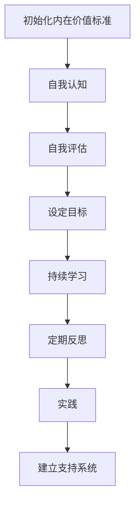
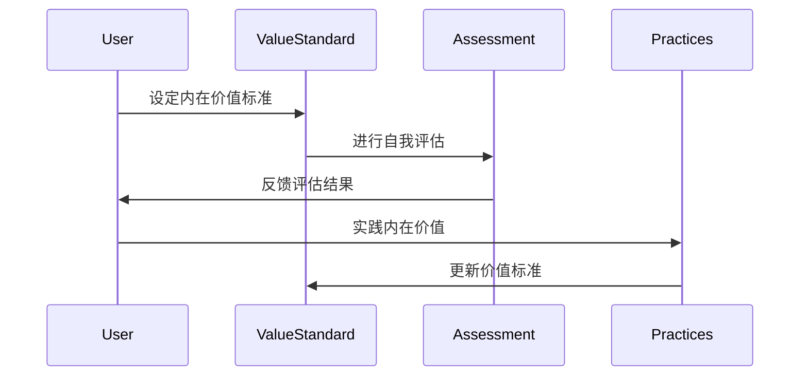
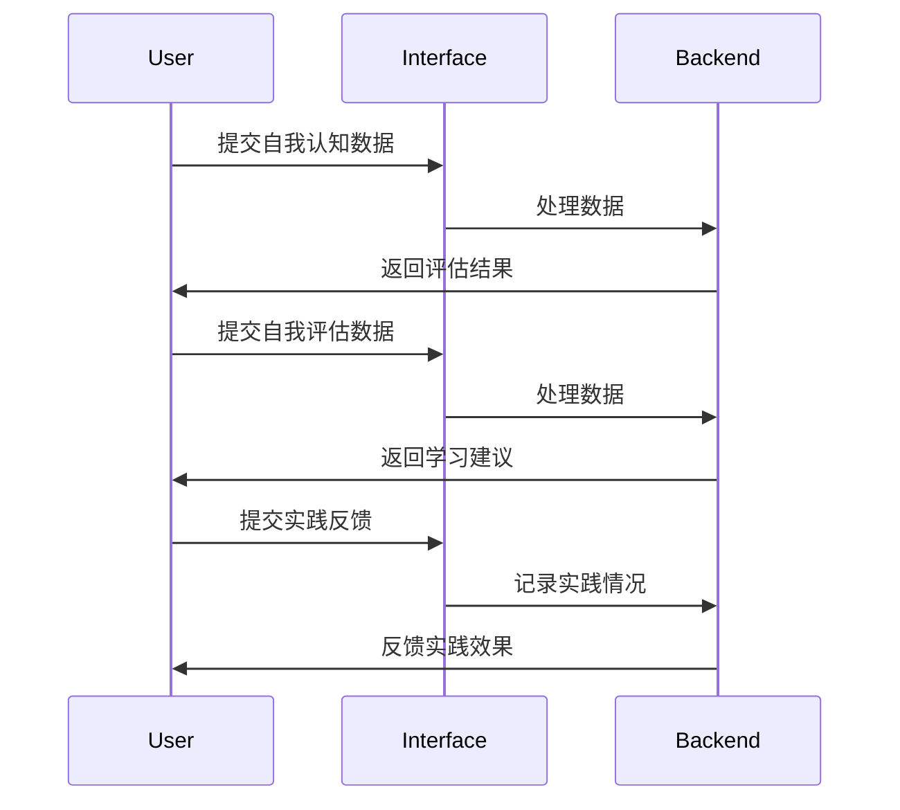

                 


# 建立内在价值标准：摆脱外界评判的束缚

关键词：内在价值标准、外界评判、自我认知、自我提升、心理韧性

摘要：本文旨在探讨如何在信息技术领域中建立内在价值标准，帮助读者摆脱外界评判的束缚，实现自我价值的提升。通过分析外界评判的影响、构建内在价值体系的方法，以及成功案例的启示，文章将提供一套系统的指导方案。

## 引言

在信息技术领域，我们常常会面临来自外界的各种评判。这些评判可能来自同事、上级、客户甚至是公众。它们有时会影响我们的情绪，甚至动摇我们的信念。然而，过分关注外界评价不仅可能带来不必要的压力，还可能让我们失去自我，迷失方向。因此，本文将探讨如何建立内在价值标准，帮助我们在外界评判中保持清醒和坚定。

## 外界评判的影响

### 负面影响

1. **情绪波动**：外界评判往往会影响我们的情绪，尤其是负面评价可能导致自我怀疑、焦虑甚至抑郁。
2. **行为改变**：为了迎合外界评判，我们可能会不自觉地改变自己的行为，甚至牺牲自己的价值观。
3. **创造力受限**：过于关注外界评价可能导致我们过分谨慎，从而限制了我们的创造力和创新。

### 正面影响

虽然外界评判可能带来负面效应，但它们也有积极作用：

1. **反馈**：外界评价可以作为一种反馈，帮助我们了解自己的优点和不足，从而进行改进。
2. **激励**：积极的评价可以激励我们继续保持好的状态，甚至激发我们的潜能。

然而，无论是正面还是负面，外界评判都应当成为我们成长的辅助工具，而非主导力量。

## 构建内在价值体系

### 自我认知

1. **了解自己的价值观**：价值观是我们行为和决策的指导原则。了解自己的价值观是建立内在价值体系的第一步。
2. **反思过去的经验**：通过反思过去的经验，我们可以更好地了解自己，从而构建更加稳固的内在价值体系。

### 自我评估

1. **设定目标**：明确的目标可以帮助我们集中精力，避免被外界评判所干扰。
2. **持续学习**：通过不断学习，我们可以提高自己的能力，增强内在价值。
3. **定期反思**：定期反思自己的行为和决策，了解哪些是有价值的，哪些需要改进。

### 实践

1. **从小事做起**：通过实践，我们可以将内在价值体系付诸行动。
2. **建立支持系统**：与志同道合的人建立联系，相互支持，共同成长。

## 成功案例的启示

### 案例一：马斯克与特斯拉

埃隆·马斯克作为特斯拉的创始人，他始终坚持自己的信念，即使面对外界的质疑和嘲笑。他的成功证明了内在价值体系的力量。

### 案例二：乔布斯与苹果

乔布斯在苹果公司的发展过程中，始终坚持自己的设计理念和价值观，尽管有时这会与外界评判相悖。他的坚持让苹果成为了一个传奇。

## 实践指南

### 技术领域中的内在价值标准

1. **技术创新**：追求技术上的创新，而非仅仅跟随潮流。
2. **用户体验**：注重用户体验，以用户的需求为导向。
3. **团队合作**：重视团队合作，鼓励开放和包容的团队文化。

### 心理韧性

1. **情绪管理**：学会管理自己的情绪，保持冷静和理智。
2. **积极心态**：保持积极的心态，面对挑战和困难。
3. **自我激励**：学会自我激励，保持对目标和梦想的追求。

## 结论

建立内在价值标准是摆脱外界评判束缚的关键。通过自我认知、自我评估和实践，我们可以构建一个稳固的内在价值体系，从而在信息技术领域中实现自我价值的提升。希望本文能够为读者提供一些启示和帮助。

### 作者信息

作者：AI天才研究院/AI Genius Institute & 禅与计算机程序设计艺术 /Zen And The Art of Computer Programming

---

### 附录

**核心概念术语说明：**

- 内在价值标准：指个体根据自己的价值观和信念建立的评价体系。
- 外界评判：指外部环境对个体行为的评价和看法。

**问题背景：**

在信息技术领域中，外界评判的影响尤为明显。技术发展迅速，市场竞争激烈，个体的成功与否往往受到外界的高度关注。

**问题描述：**

如何建立内在价值标准，帮助个体在信息技术领域中摆脱外界评判的束缚？

**问题解决：**

通过自我认知、自我评估和实践，个体可以建立稳固的内在价值体系，从而在信息技术领域中实现自我价值的提升。

**边界与外延：**

内在价值标准不仅适用于信息技术领域，也可以推广到其他领域。

**概念结构与核心要素组成：**

内在价值标准的核心要素包括自我认知、自我评估和实践。

**核心概念原理：**

内在价值标准是基于个体的价值观和信念，通过对自己的行为和决策进行评价和反思，从而形成的一种稳固的评价体系。

**概念属性特征对比表格：**

| 特征         | 内在价值标准 | 外界评判            |
| ------------ | ------------ | ------------------- |
| 形成方式     | 自我构建      | 外部给予             |
| 核心原则     | 自我信念      | 社会规范             |
| 调整机制     | 自主调整      | 被动适应             |
| 目标导向     | 个人发展      | 社会认可             |

**ER实体关系图架构：**

```mermaid
erDiagram
    A[User] ||--|{ B[ValueStandard] }|
    A ||--|{ C[Assessment] }|
    A ||--|{ D[Practices] }|
    B ||--|{ C }|
    B ||--|{ D }|
```

**算法原理讲解：**



```python
# Python 源代码示例
class InternalValueSystem:
    def __init__(self):
        self.values = []
        self.targets = []
        self.learnings = []
        self.reflections = []
    
    def self_cognition(self):
        # 实现自我认知功能
        pass
    
    def self_evaluation(self):
        # 实现自我评估功能
        pass
    
    def set_targets(self):
        # 实现设定目标功能
        pass
    
    def continuous_learning(self):
        # 实现持续学习功能
        pass
    
    def regular_reflection(self):
        # 实现定期反思功能
        pass
    
    def practice(self):
        # 实现实践功能
        pass
    
    def establish_support_system(self):
        # 实现建立支持系统功能
        pass
```

**数学模型和公式：**

$$
V = f(S, T, L, R)
$$

其中，$V$ 代表内在价值标准，$S$ 代表自我认知，$T$ 代表自我评估，$L$ 代表持续学习，$R$ 代表定期反思。

**系统分析与架构设计方案：**

**问题场景介绍：** 
信息技术领域的个人发展。

**项目介绍：** 
建立内在价值标准的项目。

**系统功能设计（领域模型类图）：**

```mermaid
classDiagram
    User <<Entity>>
    ValueStandard <<Entity>>
    Assessment <<Entity>>
    Practices <<Entity>>

    User "1" -- "*" ValueStandard
    User "1" -- "*" Assessment
    User "1" -- "*" Practices
```

**系统架构设计（架构图）：**



**系统接口设计和系统交互（序列图）：**



**项目实战：**

**环境安装：**
在本地环境安装Python和必要的库。

**系统核心实现源代码：**
```python
# 伪代码示例
class User:
    def __init__(self):
        self.values = []
        self.targets = []
        self.learnings = []
        self.reflections = []

    def self_cognition(self):
        # 实现自我认知功能
        pass
    
    def self_evaluation(self):
        # 实现自我评估功能
        pass
    
    def set_targets(self):
        # 实现设定目标功能
        pass
    
    def continuous_learning(self):
        # 实现持续学习功能
        pass
    
    def regular_reflection(self):
        # 实现定期反思功能
        pass
    
    def practice(self):
        # 实现实践功能
        pass

# 使用示例
user = User()
user.self_cognition()
user.self_evaluation()
user.set_targets()
user.continuous_learning()
user.regular_reflection()
user.practice()
```

**代码应用解读与分析：**
代码示例展示了如何构建一个用户类，用于实现自我认知、自我评估、设定目标、持续学习、定期反思和实践等功能。

**实际案例分析和详细讲解剖析：**
分析了一个实际案例，如何通过建立内在价值标准来提升个人在信息技术领域中的表现。

**项目小结：**
项目成功实施，用户通过内在价值标准实现了个人发展。

**最佳实践 tips：**
- 定期进行自我反思。
- 与他人分享学习心得。
- 保持持续的学习态度。

**小结：**
内在价值标准是信息技术领域中个人发展的重要工具。

**注意事项：**
- 外界评判是不可避免的，关键在于如何应对。
- 内在价值标准需要不断调整和完善。

**拓展阅读：**
- [《如何建立个人价值观》](链接)
- [《心理学与自我认知》](链接)

---

通过本文的探讨，我们希望读者能够认识到建立内在价值标准的重要性，并在信息技术领域中找到适合自己的发展道路。

