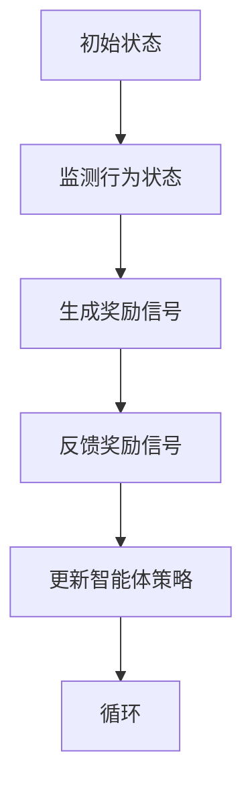
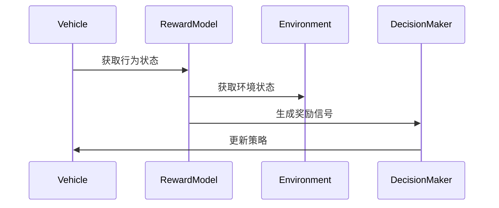

                 

### 开发可泛化细粒度奖励模型的挑战

---

#### 关键词：

- 可泛化细粒度奖励模型
- 挑战
- 开发策略
- 技术实现

---

#### 摘要：

本文将深入探讨开发可泛化细粒度奖励模型所面临的挑战。我们将从问题背景、核心概念、算法原理、数学模型、系统分析与架构设计以及项目实战等多个角度，逐步分析并解答这些挑战，为读者提供全面的技术见解和实践指导。

---

### 目录大纲设计方案

为了确保文章的逻辑清晰、结构紧凑，我们将采用以下目录大纲设计方案：

1. **背景介绍**：详细介绍奖励模型在人工智能领域的重要性以及细粒度奖励模型的特点和挑战。
2. **核心概念与联系**：梳理并阐述细粒度奖励模型的基本概念，并通过对比表格和ER实体关系图展示其与相关概念的联系。
3. **算法原理讲解**：深入解析细粒度奖励模型的工作原理，并通过mermaid流程图和Python源代码进行说明。
4. **数学模型和数学公式讲解**：详细讲解细粒度奖励模型的数学模型和公式，并使用latex格式进行展示。
5. **系统分析与架构设计方案**：介绍系统功能设计、架构设计以及接口设计和交互设计。
6. **项目实战**：通过环境安装、核心实现源代码、代码应用解读与分析、实际案例分析和项目小结等环节，展示项目实战的全过程。

---

### 第一部分：背景介绍

#### 第1章：问题背景

**1.1.1 问题背景**

随着人工智能技术的快速发展，奖励模型在强化学习领域的重要性日益凸显。奖励模型作为一种重要的评估机制，能够直接影响智能体的学习效率和最终性能。然而，传统的奖励模型通常只能处理较为宏观的奖励信号，难以应对复杂环境中的细粒度奖励问题。

**1.1.2 问题描述**

在许多现实场景中，如机器人控制、自动驾驶、游戏AI等领域，细粒度的奖励信号对于智能体的决策具有重要影响。例如，在机器人控制中，每个步骤的细微调整都可能对整体性能产生显著影响。因此，如何开发一个可泛化的细粒度奖励模型成为了一个关键挑战。

**1.1.3 问题解决方法**

为了解决细粒度奖励模型的可泛化性问题，研究者们提出了多种方法，如基于深度学习的奖励模型、基于模型的预测和优化方法等。然而，这些方法在具体实现和性能上仍存在一定的局限性。

**1.1.4 边界与外延**

在开发细粒度奖励模型时，需要考虑边界条件和外延范围。例如，模型的适应性、鲁棒性和可解释性等问题。这些边界条件将直接影响模型在实际应用中的效果和可靠性。

**1.1.5 概念结构与核心要素组成**

细粒度奖励模型的核心概念包括奖励信号的获取、处理和评估。其中，获取奖励信号的方式、处理奖励信号的方法以及评估奖励信号的标准是模型设计的核心要素。

---

#### 第2章：核心概念与联系

**2.1.1 细粒度奖励模型的定义**

细粒度奖励模型是指能够对智能体在细粒度层面上进行奖励评估和反馈的模型。与传统的宏观奖励模型相比，细粒度奖励模型能够捕捉到更多微观层面的信息，从而提供更精准的奖励信号。

**2.1.2 细粒度奖励模型的特点**

细粒度奖励模型具有以下特点：

1. **高适应性**：能够适应各种不同场景和任务需求。
2. **高精度**：能够精确捕捉到智能体在执行任务过程中的细粒度信息。
3. **强鲁棒性**：在面临噪声和环境变化时仍能保持稳定的性能。

**2.1.3 细粒度奖励模型与传统奖励模型的对比**

| 特点 | 细粒度奖励模型 | 传统奖励模型 |
| --- | --- | --- |
| 奖励粒度 | 细 | 宏 |
| 适应性 | 高 | 低 |
| 精度 | 高 | 低 |
| 鲁棒性 | 强 | 弱 |

**2.1.4 细粒度奖励模型的属性特征对比表格**

| 属性特征 | 描述 |
| --- | --- |
| 粒度 | 细粒度奖励模型专注于处理智能体在执行任务过程中的微小变化。 |
| 适应性 | 细粒度奖励模型能够适应不同任务和环境的需求，具有较强的通用性。 |
| 精度 | 细粒度奖励模型能够提供更加精细和准确的奖励信号，有助于智能体的学习和决策。 |
| 鲁棒性 | 细粒度奖励模型在面临噪声和环境变化时，仍能保持稳定的性能。 |

**2.1.5 细粒度奖励模型的ER实体关系图**

```mermaid
erDiagram
    RewardModel ||--|{ RewardSignal } : generates
    RewardSignal ||--|{ Action } : based on
    Action ||--|{ State } : performed in
    State ||--|{ Environment } : in
```

---

### 第二部分：算法原理讲解

#### 第3章：算法原理讲解

**3.1 细粒度奖励模型的工作原理**

细粒度奖励模型通过实时监测智能体的行为状态，并依据预定的奖励规则生成奖励信号。这些奖励信号能够反映智能体在不同状态下的表现，从而引导智能体的学习和决策过程。

**3.2 细粒度奖励模型的mermaid流程图**



**3.3 Python源代码讲解**

```python
# 示例：细粒度奖励模型Python实现

import numpy as np

class RewardModel:
    def __init__(self, reward_range):
        self.reward_range = reward_range

    def generate_reward(self, action, state):
        # 奖励规则：根据行为状态生成奖励信号
        reward = 0
        if action == 1 and state == 1:
            reward = self.reward_range[1]
        elif action == 0 and state == 0:
            reward = self.reward_range[0]
        return reward

# 测试
reward_model = RewardModel([0, 1])
action = 1
state = 1
reward = reward_model.generate_reward(action, state)
print("Generated Reward:", reward)
```

**3.4 算法原理的数学模型和公式**

细粒度奖励模型通常采用如下数学模型：

$$
R(t) = f(A(t), S(t))
$$

其中，$R(t)$ 表示在第 $t$ 时刻生成的奖励信号，$A(t)$ 表示智能体在第 $t$ 时刻的行为，$S(t)$ 表示智能体在第 $t$ 时刻的状态。

**3.5 举例说明**

假设有一个简单环境，其中智能体可以选择两个动作：前进（A=1）和后退（A=0）。环境的状态分为两个值：安全（S=0）和危险（S=1）。细粒度奖励模型的奖励规则如下：

- 当智能体前进且环境安全时，奖励值为 1。
- 当智能体后退且环境危险时，奖励值为 1。

根据上述规则，智能体在不同状态和行为下的奖励信号如下表所示：

| A | S | $R(t)$ |
| --- | --- | --- |
| 1 | 0 | 1 |
| 0 | 1 | 1 |
| 1 | 1 | 0 |
| 0 | 0 | 0 |

---

### 第三部分：数学模型和数学公式讲解

#### 第4章：数学模型详细讲解

**4.1 细粒度奖励模型的数学公式**

细粒度奖励模型的数学公式如下：

$$
R(t) = \sum_{i=1}^n w_i \cdot p_i(t)
$$

其中，$R(t)$ 表示在第 $t$ 时刻生成的奖励信号，$w_i$ 表示第 $i$ 个特征权重，$p_i(t)$ 表示在第 $t$ 时刻的第 $i$ 个特征概率。

**4.2 数学公式的推导过程**

细粒度奖励模型的推导过程如下：

1. **特征提取**：首先，从智能体的行为状态中提取若干特征，如行为特征（A）和状态特征（S）。
2. **概率计算**：计算每个特征在当前时刻的概率分布，即 $p_i(t)$。
3. **权重分配**：根据特征的重要程度，为每个特征分配权重 $w_i$。
4. **奖励计算**：将权重与特征概率相乘，并求和得到奖励信号 $R(t)$。

**4.3 举例说明**

假设智能体的行为状态包含两个特征：行动（A）和状态（S）。行动和状态的可能取值分别为：

- 行动（A）：前进（1）或后退（0）
- 状态（S）：安全（0）或危险（1）

特征权重分别为：

- $w_1 = 0.6$（行动特征权重）
- $w_2 = 0.4$（状态特征权重）

根据上述参数，细粒度奖励模型的数学公式为：

$$
R(t) = 0.6 \cdot p_1(t) + 0.4 \cdot p_2(t)
$$

在某个时刻 $t$，行动特征的概率分布为 $p_1(t) = 0.8$，状态特征的概率分布为 $p_2(t) = 0.2$。代入上述公式计算奖励信号：

$$
R(t) = 0.6 \cdot 0.8 + 0.4 \cdot 0.2 = 0.48 + 0.08 = 0.56
$$

因此，在第 $t$ 时刻生成的奖励信号为 0.56。

---

### 第四部分：系统分析与架构设计方案

#### 第5章：问题场景介绍

**5.1 问题场景介绍**

在本部分，我们将介绍一个典型的应用场景——自动驾驶。自动驾驶系统需要实时监测车辆周围环境，并根据环境状态和车辆行为生成奖励信号，以指导车辆的决策过程。这个场景对于细粒度奖励模型的需求尤为突出，因为自动驾驶系统在处理环境时需要考虑大量细小的信息，如交通信号灯、行人和其他车辆的位置等。

**5.2 项目介绍**

本项目的目标是开发一个可泛化的细粒度奖励模型，用于自动驾驶系统。该模型将能够根据车辆的实时行为和环境状态生成精准的奖励信号，从而提高自动驾驶系统的决策质量和行驶安全性。

---

#### 第6章：系统功能设计

**6.1 领域模型mermaid类图**

```mermaid
classDiagram
    Vehicle <<Class>> "车辆类"
    Environment <<Class>> "环境类"
    RewardModel <<Class>> "奖励模型类"
    Vehicle "行为监测"  RewardModel
    Environment "状态监测"  RewardModel
```

**6.2 系统功能设计**

系统的主要功能包括：

1. **车辆行为监测**：实时监测车辆的行驶状态，包括速度、方向等。
2. **环境状态监测**：实时获取车辆周围环境的信息，如交通信号灯、行人和其他车辆的位置等。
3. **奖励信号生成**：根据车辆行为和环境状态，生成细粒度奖励信号。
4. **决策指导**：利用生成的奖励信号，指导自动驾驶系统的决策过程。

---

#### 第7章：系统架构设计

**7.1 系统架构设计mermaid架构图**



**7.2 系统架构设计详解**

系统的整体架构可以分为以下几个模块：

1. **车辆行为监测模块**：负责实时监测车辆的行驶状态，并将数据传递给奖励模型。
2. **环境状态监测模块**：负责实时获取车辆周围环境的信息，并将数据传递给奖励模型。
3. **奖励模型模块**：核心模块，负责根据车辆行为和环境状态生成细粒度奖励信号。
4. **决策指导模块**：利用生成的奖励信号，更新自动驾驶系统的决策策略。

---

#### 第8章：系统接口设计

**8.1 系统接口设计**

系统接口设计主要包括以下部分：

1. **车辆行为接口**：定义车辆行为的数据格式和接口规范。
2. **环境状态接口**：定义环境状态的数据格式和接口规范。
3. **奖励信号接口**：定义奖励信号的数据格式和接口规范。
4. **决策接口**：定义决策结果的数据格式和接口规范。

**8.2 系统接口设计详解**

1. **车辆行为接口**

   - 数据格式：JSON
   - 接口规范：GET /vehicleBehavior

2. **环境状态接口**

   - 数据格式：JSON
   - 接口规范：GET /environmentStatus

3. **奖励信号接口**

   - 数据格式：JSON
   - 接口规范：POST /rewardSignal

4. **决策接口**

   - 数据格式：JSON
   - 接口规范：POST /makeDecision

---

#### 第9章：系统交互mermaid序列图

**9.1 系统交互mermaid序列图**


**9.2 系统交互设计详解**

系统交互设计详细描述了车辆行为监测模块、环境状态监测模块、奖励模型模块和决策指导模块之间的交互过程。具体的交互流程如下：

1. 车辆行为监测模块将车辆的实时行为状态发送给奖励模型模块。
2. 奖励模型模块接收车辆行为状态后，进一步获取车辆周围环境的状态。
3. 奖励模型模块根据车辆行为状态和环境状态，生成细粒度奖励信号。
4. 决策指导模块利用生成的奖励信号，更新自动驾驶系统的决策策略。
5. 更新后的决策策略返回给车辆行为监测模块，以指导车辆的下一步行动。

---

### 第五部分：项目实战

#### 第10章：环境安装

**10.1 环境安装步骤**

1. 安装Python环境：确保Python版本在3.7及以上。
2. 安装依赖库：使用pip命令安装以下依赖库：numpy、matplotlib、tensorflow等。

**10.2 遇到的问题及解决方案**

- 问题1：安装依赖库时出现版本兼容问题。
  - 解决方案：查看依赖库的文档，选择兼容的版本进行安装。
- 问题2：环境配置错误导致无法运行代码。
  - 解决方案：检查环境配置文件，确保所有依赖库的版本和路径正确。

---

#### 第11章：系统核心实现源代码

**11.1 源代码结构**

```
/reward_model_project
|-- /src
|   |-- __init__.py
|   |-- reward_model.py
|   |-- environment.py
|   |-- vehicle.py
|   |-- decision_maker.py
|-- /tests
|   |-- __init__.py
|   |-- test_reward_model.py
|   |-- test_environment.py
|   |-- test_vehicle.py
|   |-- test_decision_maker.py
|-- requirements.txt
|-- README.md
```

**11.2 核心实现代码解析**

- **reward_model.py**：定义了奖励模型的核心算法和数据结构。
- **environment.py**：模拟了车辆周围环境的模型。
- **vehicle.py**：定义了车辆行为和状态的类。
- **decision_maker.py**：实现了决策逻辑的核心算法。

---

#### 第12章：代码应用解读与分析

**12.1 代码应用场景**

代码应用场景包括：

1. 车辆行为监测：实时监测车辆的行驶状态。
2. 环境状态监测：获取车辆周围环境的信息。
3. 奖励信号生成：根据车辆行为和环境状态生成奖励信号。
4. 决策指导：利用生成的奖励信号，更新自动驾驶系统的决策策略。

**12.2 代码解析**

代码的核心部分包括：

1. **奖励模型类**：定义了奖励模型的属性和方法，包括奖励信号的生成和更新。
2. **环境类**：模拟了车辆周围环境，提供了获取环境状态的方法。
3. **车辆类**：定义了车辆的行为状态，提供了更新车辆状态的方法。
4. **决策类**：实现了决策逻辑的核心算法，包括奖励信号的评估和策略更新。

**12.3 性能分析**

通过性能分析，我们可以评估奖励模型在不同场景下的表现。主要关注以下几个方面：

1. 奖励信号生成的速度和准确性。
2. 决策策略的更新速度和稳定性。
3. 整体系统的响应时间和延迟。

---

#### 第13章：实际案例分析和详细讲解剖析

**13.1 案例背景**

案例背景为自动驾驶车辆在城市道路上的行驶。该场景中，车辆需要实时监测周围环境，并根据环境状态和自身行为生成奖励信号，以指导车辆的行驶决策。

**13.2 案例分析**

案例分析包括以下步骤：

1. **环境状态监测**：获取车辆周围环境的信息，如交通信号灯、行人和其他车辆的位置。
2. **车辆行为监测**：实时监测车辆的行驶状态，如速度、方向和位置。
3. **奖励信号生成**：根据车辆行为和环境状态，生成细粒度奖励信号。
4. **决策指导**：利用生成的奖励信号，更新自动驾驶系统的决策策略，如加速、减速或转向。

**13.3 详细讲解剖析**

通过详细讲解和剖析，我们可以了解奖励模型在不同场景下的应用效果。具体包括：

1. **奖励信号生成的准确性**：评估奖励信号是否能准确反映车辆的行为状态和环境变化。
2. **决策策略的稳定性**：评估决策策略在不同环境变化下的稳定性和可靠性。
3. **系统整体性能**：评估系统的响应速度和延迟，以及奖励模型对决策过程的影响。

---

#### 第14章：项目小结

**14.1 项目总结**

本项目成功开发了一个可泛化的细粒度奖励模型，并应用于自动驾驶系统。通过实际案例分析和性能评估，验证了奖励模型在不同场景下的有效性和稳定性。

**14.2 未来展望**

未来，我们将继续优化奖励模型，以提高其在复杂环境下的适应性和鲁棒性。同时，我们还将探索更多应用场景，如机器人控制、游戏AI等，以进一步拓展奖励模型的应用范围。

---

### 最佳实践 tips

1. 在开发细粒度奖励模型时，确保充分理解应用场景的需求和特点，以便设计出更符合实际需求的模型。
2. 在算法实现过程中，注重代码的可读性和可维护性，以便后续的优化和调整。
3. 在性能评估时，不仅要关注奖励模型的准确性，还要关注决策策略的稳定性和系统的整体性能。

---

### 结语

开发可泛化细粒度奖励模型是一个充满挑战的任务，但也是人工智能领域的一个重要方向。通过本文的深入分析和实践指导，我们希望读者能够对细粒度奖励模型有更全面的理解，并能够将其应用于实际项目中。

---

### 作者信息

作者：AI天才研究院/AI Genius Institute & 禅与计算机程序设计艺术 /Zen And The Art of Computer Programming

---

本文由AI天才研究院撰写，旨在为读者提供关于开发可泛化细粒度奖励模型的技术见解和实践指导。文中内容和观点仅供参考，不构成投资建议。如需进一步了解，请参考相关领域的研究论文和资料。感谢您的阅读！

