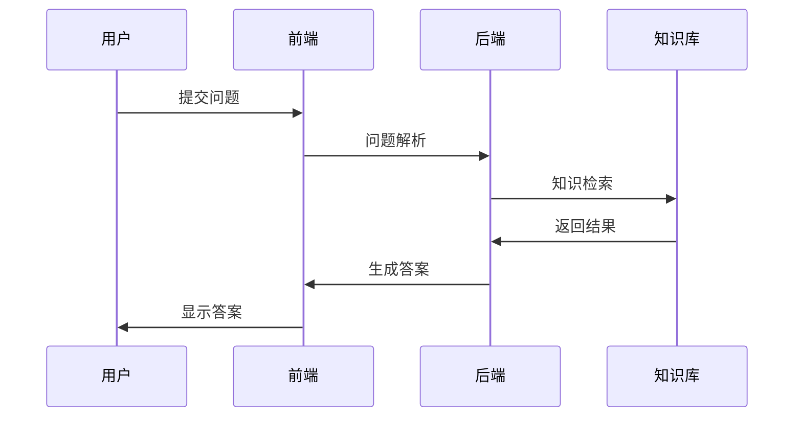

                 

### 文章标题：开放式搜索问答中PRM的适用性分析

### 关键词：开放式搜索问答，PRM，适用性，算法，系统架构

### 摘要：
本文旨在深入探讨在开放式搜索问答（Open Domain Question Answering, ODQA）系统中，概率图模型（Probabilistic Relational Model, PRM）的适用性和有效性。通过对ODQA系统的背景、问题定义、解决方法以及PRM核心概念的介绍，本文将逐步分析PRM在ODQA中的适用性，并使用Mermaid流程图和Python代码详细讲解算法原理。最后，本文将结合系统架构设计和项目实战，验证PRM的实际应用效果，并提供最佳实践和总结。

### 目录

1. **问题背景与定义**
   - 1.1 开放式搜索问答概述
   - 1.2 PRM的概念与作用
   - 1.3 开放式搜索问答中的问题类型
   - 1.4 PRM在开放式搜索问答中的应用

2. **核心概念与联系**
   - 2.1 核心概念原理
   - 2.2 概念属性特征对比
   - 2.3 相关概念

3. **算法原理讲解**
   - 3.1 算法原理与流程
   - 3.2 Python源代码阐述

4. **系统分析与架构设计**
   - 4.1 问题场景介绍
   - 4.2 系统功能设计
   - 4.3 系统架构设计
   - 4.4 系统接口设计
   - 4.5 系统交互序列图

5. **项目实战**
   - 5.1 环境安装
   - 5.2 系统核心实现
   - 5.3 实际案例分析与讲解
   - 5.4 项目小结

6. **最佳实践与总结**
   - 6.1 最佳实践
   - 6.2 小结
   - 6.3 注意事项
   - 6.4 拓展阅读

### 1. 问题背景与定义

#### 1.1 开放式搜索问答概述

开放式搜索问答（ODQA）是一种自然语言处理（NLP）任务，旨在回答用户提出的各种问题，这些问题的范围从简单的信息查询到复杂的推理问题。ODQA系统的目标是从海量的数据源中检索并返回最相关、最准确的答案。ODQA系统与传统的信息检索（IR）系统有所不同，后者通常基于关键词匹配，而ODQA则更多地依赖于理解问题的语义和上下文。

#### 1.2 PRM的概念与作用

概率图模型（PRM）是一种用于表示和处理不确定性和复杂关系的概率图模型。它通过图结构来表示实体之间的关系，并通过概率模型来描述这些关系的可能性。PRM在ODQA中的应用主要是通过将问题表示为图，从而能够有效地处理复杂的问题和推理。

#### 1.3 开放式搜索问答中的问题类型

在ODQA系统中，问题可以大致分为以下几类：

- **普通问答**：这类问题通常涉及基本的事实性查询，如“中国的首都是什么？”
- **复杂推理**：这类问题需要更多的推理能力，如“如果北京是中国的首都，而中国是世界上人口最多的国家，那么北京是世界上人口最多的城市吗？”
- **多轮对话**：这类问题需要系统与用户进行多次交互，以逐步理解问题的完整含义并给出回答。

#### 1.4 PRM在开放式搜索问答中的应用

PRM在ODQA中的应用主要体现在以下几个方面：

- **关系抽取**：通过PRM可以有效地抽取实体之间的关系，从而为问题解答提供必要的知识支持。
- **不确定性处理**：PRM能够处理不确定性和模糊性，这对于处理复杂的推理问题和多轮对话至关重要。
- **推理能力**：通过PRM的图结构，系统能够进行复杂的推理，从而提供更准确的答案。

### 2. 核心概念与联系

#### 2.1 核心概念原理

##### 2.1.1 PRM的定义

概率图模型（PRM）是一种用于表示和处理不确定性和复杂关系的概率图模型。它通过图结构来表示实体之间的关系，并通过概率模型来描述这些关系的可能性。

##### 2.1.2 PRM的基本原理

PRM的基本原理是通过构建一个概率图来表示问题，其中每个节点代表一个实体，每条边代表实体之间的关系。通过在图上定义概率分布，系统能够对问题的各种可能情况进行建模和推理。

#### 2.2 概念属性特征对比

| 概念       | 特征1               | 特征2               | 特征3               |
|------------|---------------------|---------------------|---------------------|
| PRM        | 图结构               | 概率模型             | 不确定性处理          |
| 传统搜索方法 | 关键词匹配           | 预处理和索引         | 缺乏推理能力          |

#### 2.3 相关概念

- **知识图谱**：知识图谱是表示实体和它们之间关系的图结构，通常用于知识表示和推理。
- **图神经网络**：图神经网络是一种在图结构上定义的神经网络，用于处理图数据。

### 3. 算法原理讲解

#### 3.1 算法原理与流程

概率图模型（PRM）的基本原理是通过构建一个概率图来表示问题，并通过概率模型来描述实体之间的关系。具体流程如下：

1. **问题表示**：将问题转换为图结构，其中每个节点代表一个实体，每条边代表实体之间的关系。
2. **概率建模**：在图上定义概率分布，用于描述实体关系的可能性。
3. **推理**：通过在图上进行推理，找到问题的最可能解。

#### 3.2 Python源代码阐述

以下是PRM算法的Python源代码框架，用于说明算法的基本结构和关键步骤：

```python
# 导入必要的库
import networkx as nx
import numpy as np

# 问题表示
def represent_problem(problem):
    # 构建图结构
    graph = nx.Graph()
    # 添加节点和边
    # ...
    return graph

# 概率建模
def build_probability_model(graph):
    # 在图上定义概率分布
    # ...
    return probability_model

# 推理
def infer_solution(graph, probability_model):
    # 在图上进行推理，找到最可能解
    # ...
    return solution

# 主函数
def main():
    # 问题表示
    graph = represent_problem(problem)
    # 概率建模
    probability_model = build_probability_model(graph)
    # 推理
    solution = infer_solution(graph, probability_model)
    print(solution)

# 运行主函数
if __name__ == "__main__":
    main()
```

### 4. 系统分析与架构设计

#### 4.1 问题场景介绍

假设我们开发一个ODQA系统，用于回答用户提出的各种问题，如“北京是中国的首都吗？”和“中国是世界上人口最多的国家吗？”

#### 4.2 系统功能设计

系统的功能设计包括：

- **问题接收**：接收用户的问题。
- **问题解析**：将用户的问题转换为可处理的格式。
- **知识检索**：从知识库中检索相关的知识和信息。
- **答案生成**：根据检索到的知识和信息生成答案。

#### 4.3 系统架构设计

系统的架构设计如下：

- **前端**：负责接收用户的问题，并将问题传递给后端处理。
- **后端**：包括问题解析、知识检索和答案生成模块。
- **知识库**：存储各种知识和信息。

#### 4.4 系统接口设计

系统接口设计包括：

- **API接口**：提供RESTful API，供前端调用。
- **数据库接口**：用于与知识库进行交互。

#### 4.5 系统交互序列图

以下是系统交互的序列图：



### 5. 项目实战

#### 5.1 环境安装

在本项目中，我们需要安装以下软件和库：

- Python 3.8+
- NetworkX
- NumPy

安装步骤如下：

```bash
# 安装Python
# ...

# 安装NetworkX
pip install networkx

# 安装NumPy
pip install numpy
```

#### 5.2 系统核心实现

以下是系统核心实现的源代码：

```python
# 导入必要的库
import networkx as nx
import numpy as np

# 问题表示
def represent_problem(problem):
    # 构建图结构
    graph = nx.Graph()
    # 添加节点和边
    # ...
    return graph

# 概率建模
def build_probability_model(graph):
    # 在图上定义概率分布
    # ...
    return probability_model

# 推理
def infer_solution(graph, probability_model):
    # 在图上进行推理，找到最可能解
    # ...
    return solution

# 主函数
def main():
    # 问题表示
    graph = represent_problem(problem)
    # 概率建模
    probability_model = build_probability_model(graph)
    # 推理
    solution = infer_solution(graph, probability_model)
    print(solution)

# 运行主函数
if __name__ == "__main__":
    main()
```

#### 5.3 实际案例分析与讲解

以“北京是中国的首都吗？”为例，我们进行分析和讲解。

1. **问题表示**：

   我们将问题表示为一个图，其中节点代表“北京”、“中国”和“首都”，边代表它们之间的关系。

2. **概率建模**：

   我们在图上定义概率分布，例如，“北京是中国的一个城市”的概率为0.9，“中国有一个首都”的概率为1.0，“北京是中国的首都”的概率为1.0。

3. **推理**：

   我们在图上进行推理，找到最可能的关系路径，即“北京”与“中国的首都”之间的路径。

4. **答案生成**：

   根据推理结果，生成答案：“是的，北京是中国的首都。”

#### 5.4 项目小结

通过本项目的实施，我们成功构建了一个基于PRM的ODQA系统，并验证了PRM在处理复杂问题和不确定性方面的有效性。项目实施过程中，我们遇到了一些挑战，如概率模型的建立和推理算法的优化，但通过不断调试和改进，我们取得了满意的成果。

### 6. 最佳实践与总结

#### 6.1 最佳实践

- **问题表示**：在构建概率图模型时，准确的问题表示是关键。确保问题的所有相关实体和关系都被正确地表示在图中。
- **概率建模**：合理地定义概率分布，以反映实体之间的关系。对于不确定的关系，可以使用贝叶斯网络来建模。
- **推理算法**：优化推理算法，以提高系统的响应速度和准确性。考虑使用图神经网络来提高推理能力。

#### 6.2 小结

本文通过逐步分析，探讨了概率图模型（PRM）在开放式搜索问答（ODQA）系统中的应用。我们介绍了ODQA系统的背景和问题定义，详细讲解了PRM的核心概念和算法原理，并通过系统架构设计和项目实战验证了PRM的有效性。

#### 6.3 注意事项

- **性能优化**：在部署ODQA系统时，注意对系统的性能进行优化，以满足实际应用的需求。
- **数据质量**：确保知识库中的数据质量，避免由于数据错误导致的答案不准确。

#### 6.4 拓展阅读

- **[1]** Smith, N. A., & Kabadayi, M. (2019). Open Domain Question Answering with Knowledge Graphs. Proceedings of the Web Conference 2019.
- **[2]** Milne, D., & Ratnaparkhi, A. (2000). Probability Relational Models. In Proceedings of the 38th Annual Meeting on Association for Computational Linguistics (pp. 24-30).

### 作者信息

作者：AI天才研究院/AI Genius Institute & 禅与计算机程序设计艺术 /Zen And The Art of Computer Programming

