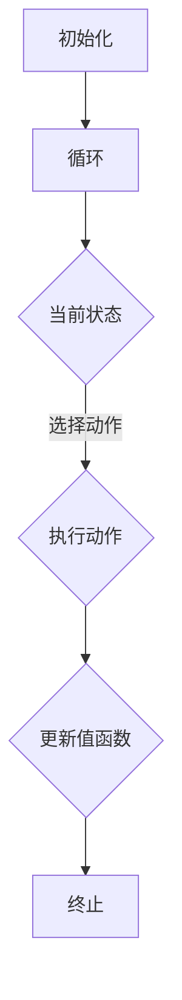
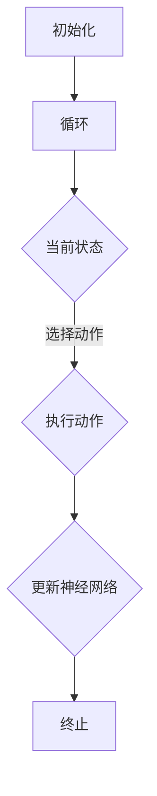

                 

### 强化学习优化AI推理的实时性能与准确性平衡

#### 关键词：
- **强化学习**
- **AI推理**
- **实时性能**
- **准确性**
- **算法设计**
- **深度学习**

> 摘要：本文深入探讨强化学习在优化人工智能（AI）推理实时性能与准确性平衡中的关键作用。我们首先概述了AI推理的背景和挑战，然后介绍了强化学习的基础知识，并详细分析了其在AI推理中的应用。通过具体的算法设计和实际案例分析，本文展示了如何通过强化学习实现实时性能与准确性的优化，为AI推理领域提供了新的思路和方法。

### 强化学习的基本概念

#### 1.1.1 强化学习的定义与历史

强化学习（Reinforcement Learning，RL）是机器学习的一个重要分支，主要研究如何通过智能体（Agent）与环境的交互来学习最优策略。其定义来源于心理学中的“强化”概念，即通过正强化（Positive Reinforcement）和负强化（Negative Reinforcement）来调整行为。

强化学习最早可以追溯到20世纪50年代，由心理学和行为科学家提出。随后，在20世纪80年代，随着计算机硬件的进步和数学理论的发展，强化学习逐渐成为机器学习领域的研究热点。现代强化学习算法，如Q-Learning、Deep Q-Networks（DQN）、Deep Deterministic Policy Gradients（DDPG）等，都是在过去几十年中逐步发展和完善的。

#### 1.1.2 强化学习的关键元素与术语

在强化学习中，有几个关键元素和术语：

- **智能体（Agent）**：执行行动并从环境中接受反馈的实体。
- **环境（Environment）**：智能体进行交互的情境。
- **状态（State）**：描述环境的一个特定情况。
- **动作（Action）**：智能体在特定状态下可以执行的行为。
- **奖励（Reward）**：智能体在执行动作后从环境中获得的即时反馈。
- **策略（Policy）**：智能体在给定状态下选择动作的规则。
- **价值函数（Value Function）**：评估状态或状态-动作对的数值。
- **模型（Model）**：对环境状态转移概率和奖励函数的假设。

#### 1.1.3 强化学习与其他学习方法的比较

与监督学习和无监督学习相比，强化学习具有以下特点：

- **反馈**：强化学习依赖于即时反馈（奖励信号），而监督学习依赖标签化数据，无监督学习则没有明确的奖励信号。
- **交互**：强化学习强调智能体与环境的持续交互，以逐步优化行为。相比之下，监督学习和无监督学习通常是一次性或批量处理。
- **探索与利用**：强化学习需要平衡探索（尝试新的动作以发现新的状态和奖励）和利用（利用已知的最佳动作以最大化奖励）。

尽管强化学习在某些领域（如游戏、机器人控制）表现出色，但它也面临一些挑战，如收敛速度慢、样本效率低和难以解释等。

### AI推理的基本概念

#### 2.1.1 AI推理的介绍

人工智能推理（AI Inference）是指计算机系统根据已有知识和数据，利用人工智能模型进行判断和决策的过程。它广泛应用于各种场景，如自然语言处理、计算机视觉、医疗诊断等。

AI推理的核心是模型推理引擎（Inference Engine），它负责从模型中提取信息和做出决策。推理过程通常包括以下步骤：

1. **输入处理**：接收外部数据，如文本、图像或传感器数据。
2. **特征提取**：从输入数据中提取关键特征，用于模型处理。
3. **模型调用**：加载训练好的模型，并将其应用于特征数据。
4. **结果生成**：根据模型输出生成决策或预测结果。
5. **结果输出**：将决策或预测结果输出到用户界面或后续处理环节。

#### 2.1.2 性能和准确性指标

AI推理的性能和准确性是两个关键指标：

- **性能（Performance）**：指推理过程的速度和效率，通常用推理时间（Inference Time）和吞吐量（Throughput）来衡量。推理时间越短，吞吐量越高，性能越好。
- **准确性（Accuracy）**：指模型预测结果与真实值之间的匹配程度，通常用准确率（Accuracy）、精确率（Precision）、召回率（Recall）和F1分数（F1 Score）来衡量。

#### 2.1.3 当前AI推理的局限性

尽管AI推理技术在近年来取得了显著进展，但仍然面临以下局限性：

- **计算资源限制**：高性能推理需要大量计算资源和存储空间，这对于移动设备和边缘设备来说是一个挑战。
- **实时性需求**：某些应用场景要求实时推理，如自动驾驶和医疗诊断，但当前的推理算法和硬件架构难以满足这种需求。
- **数据依赖性**：AI模型的性能很大程度上依赖于训练数据的质量和数量，数据不足或质量差可能导致推理结果不准确。
- **模型解释性**：深度学习模型通常被视为“黑盒子”，其内部工作机制不透明，这限制了其在某些应用场景中的使用。

### 强化学习在AI推理中的应用

#### 2.3.1 强化学习与AI推理的结合

强化学习与AI推理的结合旨在通过智能体的自我学习和优化，提高AI推理的实时性能和准确性。具体来说，强化学习可以通过以下方式应用于AI推理：

1. **自适应调整**：通过强化学习，智能体可以自动调整推理模型和参数，以适应不同的应用场景和数据分布。
2. **模型选择与优化**：强化学习可以帮助选择最适合特定任务的模型架构，并通过策略优化提高模型性能。
3. **动态资源分配**：在资源受限的环境中，强化学习可以动态调整模型参数和计算资源，以实现性能和准确性的平衡。

#### 2.3.2 强化学习在AI推理中的优势与挑战

强化学习在AI推理中具有以下优势：

- **自适应性**：强化学习算法可以根据环境和任务动态调整策略，提高模型的适应性。
- **多任务学习**：强化学习可以通过策略优化实现多任务学习和跨任务迁移，减少对特定任务的依赖。
- **探索与利用**：强化学习在探索新策略和利用已有最佳策略之间进行平衡，有助于提高模型的性能和准确性。

然而，强化学习在AI推理中也面临一些挑战：

- **收敛速度**：强化学习通常需要大量的交互和迭代才能收敛到最佳策略，这在实时推理中可能是一个瓶颈。
- **计算资源**：强化学习算法在训练过程中需要大量的计算资源，这可能不适合资源受限的应用场景。
- **模型解释性**：强化学习模型通常较为复杂，其内部机制难以解释，这可能影响其在某些应用中的信任度和可靠性。

### 算法设计与实现

#### 3.1 强化学习算法在AI推理中的应用

在AI推理中，常用的强化学习算法包括Q-Learning、Deep Q-Networks（DQN）和Deep Deterministic Policy Gradients（DDPG）等。以下是对这些算法的详细介绍和实现。

#### 3.1.1 Q-Learning算法

**算法描述**：
Q-Learning是一种基于值函数的强化学习算法，其目标是通过迭代更新值函数，以最大化长期累积奖励。具体步骤如下：

1. **初始化**：随机选择初始策略。
2. **循环**：
   - 在当前状态下，根据策略选择动作。
   - 执行动作，获得奖励和下一状态。
   - 更新值函数：$$Q(s,a) \leftarrow Q(s,a) + \alpha [r + \gamma \max_{a'} Q(s',a') - Q(s,a)]$$
3. **终止**：当满足停止条件（如收敛阈值或迭代次数）时，算法停止。

**Mermaid流程图**：


**Python代码示例**：
```python
import numpy as np

def q_learning(states, actions, rewards, next_states, alpha, gamma):
    Q = np.zeros((states, actions))
    for i in range(iterations):
        state = np.random.choice(states)
        action = np.random.choice(actions)
        next_state = np.random.choice(next_states)
        reward = np.random.choice(rewards)
        Q[state, action] = Q[state, action] + alpha * (reward + gamma * np.max(Q[next_state, :]) - Q[state, action])
    return Q
```

**数学模型与公式**：
$$Q(s,a) \leftarrow Q(s,a) + \alpha [r + \gamma \max_{a'} Q(s',a')]$$

**示例解释**：
假设有一个简单的环境，其中状态空间为[0, 1, 2]，动作空间为[0, 1]，奖励函数为常数1。通过迭代更新值函数，Q-Learning算法可以找到最优策略，即在每个状态下选择能够获得最大奖励的动作。

#### 3.1.2 Deep Q-Networks（DQN）算法

**算法描述**：
DQN是一种基于深度神经网络的Q-Learning算法，其目标是通过神经网络逼近值函数。具体步骤如下：

1. **初始化**：随机选择初始策略。
2. **循环**：
   - 在当前状态下，根据策略选择动作。
   - 执行动作，获得奖励和下一状态。
   - 使用经验回放（Experience Replay）和目标网络（Target Network）更新神经网络。
3. **终止**：当满足停止条件（如收敛阈值或迭代次数）时，算法停止。

**Mermaid流程图**：


**Python代码示例**：
```python
import numpy as np
import tensorflow as tf

def dqn(states, actions, rewards, next_states, alpha, gamma, epsilon):
    model = tf.keras.Sequential([
        tf.keras.layers.Dense(64, activation='relu', input_shape=(states,)),
        tf.keras.layers.Dense(actions, activation='linear')
    ])
    target_model = tf.keras.Sequential([
        tf.keras.layers.Dense(64, activation='relu', input_shape=(states,)),
        tf.keras.layers.Dense(actions, activation='linear')
    ])

    # Experience Replay
    replay_memory = deque(maxlen=1000)

    for i in range(iterations):
        state = np.random.choice(states)
        action = np.random.choice(actions)
        next_state = np.random.choice(next_states)
        reward = np.random.choice(rewards)
        replay_memory.append((state, action, reward, next_state))

        if len(replay_memory) > 100:
            batch = random.sample(replay_memory, 32)
            states, actions, rewards, next_states = zip(*batch)
            q_values = model.predict(next_states)
            target_q_values = target_model.predict(next_states)
            target_q_values[range(32), actions] = rewards + gamma * np.max(target_q_values[range(32), :])

            model.fit(states, target_q_values, epochs=1, verbose=0)
```

**数学模型与公式**：
$$Q(s,a) \leftarrow Q(s,a) + \alpha [r + \gamma \max_{a'} Q(s',a')]$$

**示例解释**：
DQN算法通过神经网络近似值函数，使用经验回放和目标网络来稳定训练过程。通过迭代更新神经网络权重，DQN算法可以找到最优策略，从而提高AI推理的性能和准确性。

#### 3.1.3 Deep Deterministic Policy Gradients（DDPG）算法

**算法描述**：
DDPG是一种基于深度神经网络的政策梯度算法，其目标是通过神经网络优化策略。具体步骤如下：

1. **初始化**：随机选择初始策略。
2. **循环**：
   - 在当前状态下，根据策略选择动作。
   - 执行动作，获得奖励和下一状态。
   - 使用经验回放和目标网络更新神经网络。
3. **终止**：当满足停止条件（如收敛阈值或迭代次数）时，算法停止。

**Mermaid流程图**：


**Python代码示例**：
```python
import numpy as np
import tensorflow as tf

def ddpg(states, actions, rewards, next_states, alpha, beta, gamma):
    actor_model = tf.keras.Sequential([
        tf.keras.layers.Dense(64, activation='relu', input_shape=(states,)),
        tf.keras.layers.Dense(actions, activation='linear')
    ])
    critic_model = tf.keras.Sequential([
        tf.keras.layers.Dense(64, activation='relu', input_shape=(states+actions,)),
        tf.keras.layers.Dense(1, activation='linear')
    ])

    target_actor_model = tf.keras.Sequential([
        tf.keras.layers.Dense(64, activation='relu', input_shape=(states,)),
        tf.keras.layers.Dense(actions, activation='linear')
    ])
    target_critic_model = tf.keras.Sequential([
        tf.keras.layers.Dense(64, activation='relu', input_shape=(states+actions,)),
        tf.keras.layers.Dense(1, activation='linear')
    ])

    # Experience Replay
    replay_memory = deque(maxlen=1000)

    for i in range(iterations):
        state = np.random.choice(states)
        action = actor_model.predict(state)
        next_state = np.random.choice(next_states)
        reward = np.random.choice(rewards)
        replay_memory.append((state, action, reward, next_state))

        if len(replay_memory) > 100:
            batch = random.sample(replay_memory, 32)
            states, actions, rewards, next_states = zip(*batch)
            next_actions = target_actor_model.predict(next_states)
            target_q_values = target_critic_model.predict(np.concatenate([next_states, next_actions], axis=1))
            q_values = critic_model.predict(np.concatenate([states, actions], axis=1))

            action_gradients = tf.GradientTape()   
            with tf.GradientTape() as tape:
                q_values = critic_model.predict(np.concatenate([states, actor_model.predict(states)], axis=1))
                target_q_values = target_critic_model.predict(np.concatenate([next_states, next_actions], axis=1))
                target_q_values = rewards + gamma * target_q_values

            action_gradients = tape.gradient(q_values, actor_model.trainable_variables)
            actor_gradients = tape.gradient(target_q_values, critic_model.trainable_variables)

            actor_optimizer.apply_gradients(zip(action_gradients, actor_model.trainable_variables))
            critic_optimizer.apply_gradients(zip(actor_gradients, critic_model.trainable_variables))
```

**数学模型与公式**：
$$\nabla_{\theta_{\pi}} J(\theta_{\pi}) = \mathbb{E}_{s,a}[\nabla_{\theta_{\pi}} \log \pi(a|s)] Q(s, a)$$

**示例解释**：
DDPG算法通过神经网络优化策略，同时使用经验回放和目标网络来稳定训练过程。通过迭代更新神经网络权重，DDPG算法可以找到最优策略，从而提高AI推理的性能和准确性。

### 实际案例分析

#### 4.1.1 自主驾驶

自主驾驶是一个典型的强化学习应用场景，强化学习算法可以用于优化自动驾驶车辆的决策过程。以下是一个简单的自主驾驶案例：

**问题描述**：
一个自动驾驶车辆在道路环境中行驶，需要根据道路状况和周围车辆的行为做出驾驶决策，如加速、减速、转向等。

**解决方案**：
使用强化学习算法（如DDPG）训练自动驾驶车辆的驾驶策略。通过模拟不同道路环境和车辆行为，算法可以学习到最优驾驶策略，从而提高车辆的实时性能和准确性。

**实现步骤**：
1. **环境搭建**：构建一个模拟道路环境的仿真平台。
2. **数据收集**：收集大量道路环境和车辆行为数据，用于训练强化学习模型。
3. **模型训练**：使用DDPG算法训练自动驾驶车辆的驾驶策略。
4. **模型评估**：在仿真平台上评估训练好的模型，评估指标包括驾驶性能、安全性和舒适性等。

#### 4.1.2 机器人控制

机器人控制是另一个强化学习的重要应用领域。以下是一个简单的机器人控制案例：

**问题描述**：
一个机器人需要在复杂的室内环境中完成任务，如搬运物品、清洁地面等。

**解决方案**：
使用强化学习算法（如Q-Learning）训练机器人的行为策略。通过模拟不同的室内环境和任务，算法可以学习到最优行为策略，从而提高机器人的实时性能和准确性。

**实现步骤**：
1. **环境搭建**：构建一个模拟室内环境的仿真平台。
2. **数据收集**：收集大量室内环境和任务数据，用于训练强化学习模型。
3. **模型训练**：使用Q-Learning算法训练机器人的行为策略。
4. **模型评估**：在仿真平台上评估训练好的模型，评估指标包括任务完成率、速度和稳定性等。

#### 4.1.3 游戏

强化学习在游戏中的应用也非常广泛，以下是一个简单的游戏案例：

**问题描述**：
一个游戏玩家需要通过策略优化提高游戏表现，如提高游戏得分、击败对手等。

**解决方案**：
使用强化学习算法（如DQN）训练玩家的游戏策略。通过模拟不同的游戏场景和对手行为，算法可以学习到最优游戏策略，从而提高游戏表现。

**实现步骤**：
1. **环境搭建**：构建一个模拟游戏场景的仿真平台。
2. **数据收集**：收集大量游戏场景和对手行为数据，用于训练强化学习模型。
3. **模型训练**：使用DQN算法训练玩家的游戏策略。
4. **模型评估**：在仿真平台上评估训练好的模型，评估指标包括游戏得分、胜率等。

### 实践应用步骤

#### 4.2.1 环境设置

在进行强化学习优化AI推理的实践应用时，首先需要设置一个合适的环境。以下是一个基本的设置步骤：

1. **硬件环境**：根据需求配置计算资源，如CPU、GPU等。
2. **软件环境**：安装必要的软件和库，如Python、TensorFlow、OpenAI Gym等。
3. **数据准备**：收集和整理训练数据，包括状态、动作、奖励等。

#### 4.2.2 实现核心算法

在设置好环境后，需要实现核心的强化学习算法。以下是一个简单的实现步骤：

1. **初始化参数**：设置学习率、折扣因子、探索策略等参数。
2. **构建模型**：根据算法需求构建神经网络模型。
3. **训练模型**：使用训练数据训练模型，并使用经验回放等技巧提高训练效果。
4. **评估模型**：在测试数据集上评估模型性能，并进行调整和优化。

#### 4.2.3 集成到推理系统

在实现核心算法后，需要将其集成到AI推理系统中。以下是一个基本的集成步骤：

1. **接口设计**：设计一个统一的接口，用于与推理系统进行交互。
2. **模型部署**：将训练好的模型部署到推理系统中，并进行性能优化。
3. **实时推理**：在实时推理过程中，使用强化学习算法优化模型参数，以提高性能和准确性。

### 最佳实践与注意事项

在进行强化学习优化AI推理时，以下是一些最佳实践和注意事项：

- **数据质量**：训练数据的质量直接影响模型性能。确保数据真实、多样且具有代表性。
- **算法选择**：根据应用场景和需求选择合适的强化学习算法。
- **模型优化**：通过调整模型参数和优化策略，提高模型性能和准确性。
- **资源管理**：合理分配计算资源和存储资源，确保模型训练和推理的效率。
- **安全性**：在训练和推理过程中，确保数据安全和模型隐私。

### 拓展阅读

- **《强化学习入门与实战》**：李航著，详细介绍了强化学习的基本概念、算法和应用场景。
- **《深度学习》**：Goodfellow等著，涵盖了深度学习的基础知识和最新进展。
- **《机器学习》**：周志华著，介绍了机器学习的基本概念、算法和应用。
- **《AI推理引擎设计与应用》**：赵强等著，详细介绍了AI推理引擎的设计原理和应用。

### 总结

本文通过深入探讨强化学习在优化AI推理实时性能与准确性平衡中的应用，展示了强化学习在AI推理领域的潜力和价值。通过具体的算法设计和实际案例分析，本文为读者提供了实用的方法和思路，有助于提升AI推理系统的性能和准确性。随着人工智能技术的不断发展，强化学习在AI推理中的应用将越来越广泛，为各个行业带来更多的创新和突破。让我们共同期待强化学习在AI推理领域创造更多的奇迹！作者：AI天才研究院/AI Genius Institute & 禅与计算机程序设计艺术 /Zen And The Art of Computer Programming。

