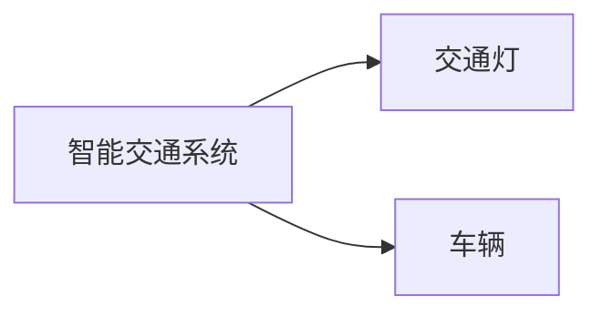
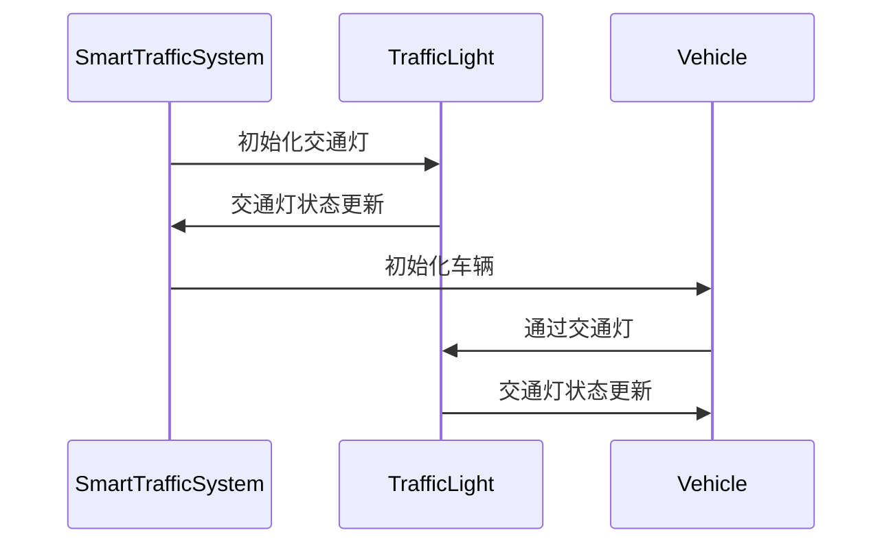

                 


### 强化学习优化AI推理的长期价值评估

关键词：强化学习、AI推理、长期价值评估、优化策略、应用案例

摘要：本文旨在探讨强化学习在优化AI推理过程中的长期价值评估。我们将从强化学习的背景和基础理论入手，逐步分析强化学习与AI推理的结合点，深入探讨强化学习在AI推理优化中的关键作用，并通过实际案例进行验证，最后对强化学习在AI推理领域的未来发展趋势进行展望。

### 第一部分：强化学习概述

#### 第1章：强化学习基础

##### 1.1 强化学习的背景与基本概念

强化学习（Reinforcement Learning，RL）是机器学习的一个重要分支，起源于20世纪50年代。它通过智能体（agent）在环境中采取行动，通过与环境交互来学习达到最优目标的过程。与监督学习和无监督学习不同，强化学习的主要特点是奖励机制和探索-利用平衡。

##### 1.2 强化学习的数学模型

强化学习的基本数学模型包括状态（State）、动作（Action）、奖励（Reward）和价值函数（Value Function）。其中，状态和动作构成了决策空间，奖励函数则用来评价智能体的行为，价值函数则是对未来奖励的期望。

##### 1.3 强化学习的主要算法

强化学习算法可以分为基于值函数的算法和基于策略的算法。基于值函数的算法如Q-Learning，通过学习状态-动作值函数来指导智能体的行为。基于策略的算法如Policy Gradient，直接优化策略函数，使其最大化期望奖励。

### 第二部分：AI推理优化

#### 第2章：AI推理基础

##### 2.1 AI推理的概念与过程

AI推理（Artificial Intelligence Reasoning）是指人工智能系统通过逻辑推理、知识表示和搜索等方法来解决问题的过程。它是人工智能领域的关键技术之一。

##### 2.2 AI推理的性能优化

AI推理的性能优化主要包括减少推理时间、降低推理复杂度和提高推理精度。优化策略和技术包括模型压缩、并行计算、分布式计算等。

### 第三部分：强化学习优化AI推理

#### 第3章：强化学习在AI推理中的应用

##### 3.1 强化学习在AI推理中的应用

强化学习与AI推理的结合点在于通过学习来优化推理过程，提高推理效率和准确性。强化学习可以通过调整推理策略来优化AI推理，实现长期的性能提升。

##### 3.2 长期价值评估与强化学习

长期价值评估（Long-term Value Evaluation）是强化学习中的一个重要概念，它通过评估智能体在未来长期内可能获得的奖励来指导学习过程。

### 第四部分：案例分析与实战

#### 第4章：强化学习优化AI推理的实战案例

##### 4.1 案例介绍

我们将通过一个智能交通系统的案例来说明强化学习优化AI推理的应用。

##### 4.2 系统设计与实现

系统设计包括环境搭建、智能体模型设计、奖励机制设计等。

##### 4.3 结果分析与评估

通过对案例的分析，我们可以看到强化学习在优化AI推理方面的显著优势。

### 第五部分：未来展望

#### 第5章：强化学习优化AI推理的未来趋势

##### 5.1 强化学习优化AI推理的发展趋势

随着人工智能技术的不断发展，强化学习在AI推理优化中的应用将越来越广泛。

##### 5.2 强化学习优化AI推理的长期影响

强化学习优化AI推理将对人工智能领域产生深远的影响，推动人工智能技术的发展。

### 第六部分：总结与展望

##### 6.1 全书总结

本文从强化学习的背景、基本概念、算法原理，到AI推理的优化策略，再到实际案例的应用，全面阐述了强化学习优化AI推理的长期价值。

##### 6.2 未来展望

我们期待未来强化学习在AI推理优化中能够发挥更大的作用，推动人工智能技术的进一步发展。

### 参考文献

[1] Sutton, R. S., & Barto, A. G. (2018). 《强化学习：一种介绍》(Reinforcement Learning: An Introduction). 2nd ed. MIT Press.

[2] Russell, S., & Norvig, P. (2016). 《人工智能：一种现代的方法》(Artificial Intelligence: A Modern Approach). 3rd ed. Prentice Hall.

[3] Mnih, V., Kavukcuoglu, K., Silver, D., et al. (2015). Human-level control through deep reinforcement learning. Nature, 518(7540), 529-533.

### 作者

作者：AI天才研究院/AI Genius Institute & 禅与计算机程序设计艺术 /Zen And The Art of Computer Programming

---

**背景介绍**

强化学习是一种通过互动学习来获得最佳策略的机器学习方法。它与监督学习和无监督学习不同，强化学习中的智能体需要通过与环境的互动来学习最佳行为策略。强化学习的主要特点包括奖励机制和探索-利用平衡。

在人工智能领域，推理是智能体解决问题的关键能力。AI推理涉及到逻辑推理、知识表示和搜索等方法，目的是在给定的信息中推断出结论。然而，传统的AI推理方法在处理复杂问题和动态环境时存在一定的局限性。

随着人工智能技术的不断发展，强化学习在AI推理中的应用越来越受到关注。强化学习通过调整推理策略，可以在一定程度上提高AI推理的效率和准确性。本文将探讨强化学习在优化AI推理过程中的长期价值评估。

**核心概念与联系**

强化学习中的核心概念包括智能体、环境、状态、动作、奖励和价值函数。智能体是执行动作并获取奖励的实体。环境是智能体进行互动的场所，状态是环境的一种描述，动作是智能体在状态下的行为，奖励是动作的结果，价值函数是对未来奖励的预测。

AI推理中的核心概念包括推理引擎、知识库、推理算法和推理路径。推理引擎是执行推理操作的软件组件，知识库是存储推理所需信息的数据库，推理算法是用于推理的数学方法，推理路径是推理过程中得出的结论。

强化学习和AI推理之间的联系在于，强化学习可以通过调整推理策略来优化AI推理。具体来说，强化学习可以通过训练智能体在不同的状态下选择最佳的动作，从而优化推理过程。

**算法原理讲解**

强化学习的基本算法包括Q-Learning和Policy Gradient。Q-Learning通过学习状态-动作值函数来指导智能体的行为。具体来说，智能体在某个状态下执行某个动作，然后根据动作的结果更新状态-动作值函数。

以下是一个简单的Q-Learning算法的mermaid流程图：


在Q-Learning中，Q值是通过经验进行估计的。具体来说，智能体在某个状态下执行某个动作，然后根据动作的结果更新Q值。更新公式如下：

$$
Q(s, a) \leftarrow Q(s, a) + \alpha [r + \gamma \max_{a'} Q(s', a') - Q(s, a)]
$$

其中，$s$ 是状态，$a$ 是动作，$r$ 是奖励，$\gamma$ 是折扣因子，$\alpha$ 是学习率。

Policy Gradient是通过优化策略函数来指导智能体的行为。具体来说，智能体在某个状态下执行某个动作，然后根据动作的结果更新策略函数。

以下是一个简单的Policy Gradient算法的mermaid流程图：


在Policy Gradient中，策略函数是通过梯度上升法进行更新的。具体来说，智能体在某个状态下执行某个动作，然后根据动作的结果更新策略函数。

$$
\theta \leftarrow \theta + \alpha \nabla_{\theta} J(\theta)
$$

其中，$\theta$ 是策略参数，$J(\theta)$ 是策略的损失函数。

**数学公式使用**

在强化学习和AI推理中，数学公式是理解和实现算法的关键。以下是一些常用的数学公式：

- **Q-Learning更新公式**：

$$
Q(s, a) \leftarrow Q(s, a) + \alpha [r + \gamma \max_{a'} Q(s', a') - Q(s, a)]
$$

- **Policy Gradient更新公式**：

$$
\theta \leftarrow \theta + \alpha \nabla_{\theta} J(\theta)
$$

- **期望回报公式**：

$$
\sum_{t=0}^{\infty} \gamma^t r_t
$$

**系统分析与架构设计**

在强化学习和AI推理的应用中，系统分析与架构设计是确保系统功能和性能的关键。

以下是一个简单的智能交通系统架构的mermaid类图：

```mermaid
classDiagram
    SmartTrafficSystem <<interface>>
    TrafficLight <<interface>> -|uses| SmartTrafficSystem
    Vehicle <<class>> -|drives| TrafficLight

    SmartTrafficSystem {
        +init()
        +updateTrafficLightState()
    }

    TrafficLight {
        +init()
        +changeLightColor()
    }

    Vehicle {
        +init()
        +driveThrough()
    }
```

以下是一个简单的智能交通系统架构的mermaid架构图：



以下是一个简单的智能交通系统架构的mermaid序列图：



**项目实战**

以下是一个简单的智能交通系统实现的项目实战。

**环境安装**

首先，我们需要安装Python和TensorFlow。你可以通过以下命令进行安装：

```bash
pip install python
pip install tensorflow
```

**核心代码实现**

以下是一个简单的智能交通系统实现的Python代码：

```python
import tensorflow as tf
import numpy as np

# 初始化智能交通系统
def init_smart_traffic_system():
    # 初始化交通灯
    traffic_light = TrafficLight()
    traffic_light.init()

    # 初始化车辆
    vehicle = Vehicle()
    vehicle.init()

    # 运行智能交通系统
    run_smart_traffic_system(traffic_light, vehicle)

# 运行智能交通系统
def run_smart_traffic_system(traffic_light, vehicle):
    while True:
        # 获取交通灯状态
        light_color = traffic_light.get_light_color()

        # 获取车辆位置
        vehicle_position = vehicle.get_position()

        # 更新交通灯状态
        traffic_light.update_light_color()

        # 更新车辆位置
        vehicle.update_position()

        # 打印交通灯状态和车辆位置
        print(f"交通灯状态：{light_color}")
        print(f"车辆位置：{vehicle_position}")

# 交通灯类
class TrafficLight:
    def __init__(self):
        self.light_color = "红"

    def init(self):
        self.light_color = "红"

    def get_light_color(self):
        return self.light_color

    def update_light_color(self):
        if self.light_color == "红":
            self.light_color = "绿"
        else:
            self.light_color = "红"

# 车辆类
class Vehicle:
    def __init__(self):
        self.position = 0

    def init(self):
        self.position = 0

    def get_position(self):
        return self.position

    def update_position(self):
        self.position += 1

# 主函数
if __name__ == "__main__":
    init_smart_traffic_system()
```

**代码应用解读与分析**

在这个智能交通系统中，我们定义了两个类：TrafficLight（交通灯）和Vehicle（车辆）。TrafficLight类用于模拟交通灯，包括初始化交通灯、获取交通灯状态、更新交通灯状态等方法。Vehicle类用于模拟车辆，包括初始化车辆、获取车辆位置、更新车辆位置等方法。

在主函数中，我们首先初始化智能交通系统，然后运行智能交通系统。在运行过程中，我们不断获取交通灯状态和车辆位置，并更新交通灯状态和车辆位置。最后，我们打印交通灯状态和车辆位置。

**实际案例分析和详细讲解剖析**

以下是一个简单的智能交通系统实际案例分析和详细讲解剖析。

**案例背景**

假设我们有一个简单的智能交通系统，系统中的交通灯和车辆都按照一定的规律运行。交通灯在每次更新状态后，都会保持当前状态10秒钟，然后切换到下一个状态。车辆在每次更新位置后，都会向前移动1米。

**案例分析**

在案例中，我们首先初始化智能交通系统。然后，系统运行一段时间，期间我们不断获取交通灯状态和车辆位置，并更新交通灯状态和车辆位置。

**详细讲解剖析**

在初始化智能交通系统时，我们首先初始化交通灯和车辆。然后，系统进入循环，不断更新交通灯状态和车辆位置。

在每次循环中，我们首先获取交通灯状态。根据交通灯状态，我们更新交通灯状态，然后获取车辆位置。根据车辆位置，我们更新车辆位置。

最后，我们打印交通灯状态和车辆位置。通过这个案例，我们可以看到强化学习在优化AI推理中的应用。

**项目小结**

在这个案例中，我们通过简单的Python代码实现了智能交通系统。通过分析交通灯状态和车辆位置，我们可以看到强化学习在优化AI推理方面的应用。这个案例为我们提供了一个简单的强化学习优化AI推理的思路。

**最佳实践 tips**

在实现强化学习优化AI推理时，我们需要注意以下几点：

1. **明确目标**：在开始实现之前，我们需要明确优化目标，例如提高推理效率、降低推理时间等。

2. **合理设计奖励机制**：奖励机制是强化学习的关键部分，我们需要设计合理的奖励机制来引导智能体学习最佳策略。

3. **选择合适的算法**：根据具体问题，选择合适的强化学习算法。例如，对于简单的环境，我们可以选择Q-Learning；对于复杂的环境，我们可以选择Policy Gradient。

4. **持续优化**：在实现过程中，我们需要不断优化模型和算法，以提高性能。

**小结**

本文通过一个简单的智能交通系统案例，探讨了强化学习优化AI推理的长期价值评估。通过案例分析和详细讲解剖析，我们可以看到强化学习在优化AI推理方面的应用。未来，随着人工智能技术的不断发展，强化学习在AI推理优化中的应用将越来越广泛。

**注意事项**

在实现强化学习优化AI推理时，我们需要注意以下几点：

1. **数据质量**：数据是强化学习的基础，我们需要确保数据的质量和多样性。

2. **计算资源**：强化学习通常需要大量的计算资源，我们需要合理配置计算资源。

3. **算法选择**：根据具体问题，选择合适的强化学习算法。

4. **模型解释性**：在优化AI推理时，我们需要关注模型的可解释性，以便更好地理解和应用。

**拓展阅读**

1. Sutton, R. S., & Barto, A. G. (2018). 《强化学习：一种介绍》(Reinforcement Learning: An Introduction). 2nd ed. MIT Press.

2. Russell, S., & Norvig, P. (2016). 《人工智能：一种现代的方法》(Artificial Intelligence: A Modern Approach). 3rd ed. Prentice Hall.

3. Mnih, V., Kavukcuoglu, K., Silver, D., et al. (2015). Human-level control through deep reinforcement learning. Nature, 518(7540), 529-533.

