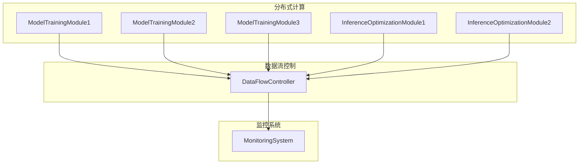
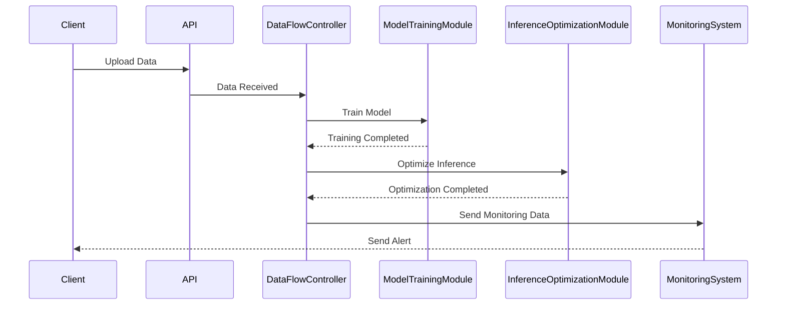

                 

### 1.1 强化学习概述

强化学习（Reinforcement Learning, RL）是机器学习的一个重要分支，主要研究如何让智能体（agent）在与环境（environment）互动的过程中，通过学习获得最优行为策略，以实现特定目标。强化学习的基本思想源于心理学和行为学中的强化理论，即通过奖励（reward）和惩罚（penalty）来引导和调整智能体的行为，从而使其逐渐学会在复杂环境中做出最优决策。

强化学习与其他机器学习方法，如监督学习和无监督学习，有显著的区别：

- **监督学习**：智能体从标记好的数据中学习，输出为给定输入的预测标签。
- **无监督学习**：智能体在没有标签的数据中学习，寻找数据的潜在结构和模式。
- **强化学习**：智能体通过与环境交互，学习得到奖励或惩罚，以优化其行为策略。

强化学习的核心概念包括：

1. **智能体（Agent）**：执行动作并接收环境反馈的实体。
2. **环境（Environment）**：智能体执行动作的场所，会根据智能体的动作产生状态转移和奖励。
3. **状态（State）**：描述智能体和环境当前情况的一个属性集合。
4. **动作（Action）**：智能体可以执行的行为。
5. **奖励（Reward）**：环境对智能体动作的反馈，可以是正值（奖励）或负值（惩罚）。
6. **策略（Policy）**：智能体决定如何执行动作的规则集。
7. **价值函数（Value Function）**：评估不同状态或状态-动作对的优劣。
8. **模型（Model）**：智能体对环境的理解和预测。

强化学习的主要目标是通过学习，使智能体能够最大化长期回报（long-term reward），即使在面对不确定性和动态环境时也能做出合理的决策。

强化学习不仅在学术研究中具有重要地位，在实际应用中也有着广泛的应用场景，如游戏AI、自动驾驶、机器人控制、推荐系统、金融交易等。接下来，我们将更深入地探讨强化学习的基本概念、理论框架和应用场景，从而为理解强化学习优化AI推理打下坚实的基础。

----------------------------------------------------------------

### 1.2 强化学习的基本概念

强化学习中的基本概念是理解其工作原理和应用的关键。以下是对这些核心概念的详细解释：

#### 智能体（Agent）

智能体是执行特定任务并从环境中接收反馈的实体。它可以根据当前状态选择最佳动作，并不断调整其策略以最大化长期回报。智能体可以是物理机器人、软件代理，甚至是虚拟智能体。

#### 环境（Environment）

环境是智能体执行动作的场所，会根据智能体的动作产生状态转移和奖励。环境可以是现实世界的物理环境，也可以是模拟的环境。环境状态的变化通常是不确定的，这增加了强化学习问题的复杂性。

#### 状态（State）

状态是智能体和环境当前情况的一个抽象描述。它通常由一组属性组成，能够反映环境中的关键信息。状态可以是离散的，也可以是连续的。在强化学习中，智能体需要通过观察当前状态来选择下一步的动作。

#### 动作（Action）

动作是智能体在某个状态下可以执行的行为。动作的选择通常基于智能体的策略，策略决定了智能体如何从当前状态过渡到下一个状态。动作可以是离散的，如移动方向；也可以是连续的，如速度调节。

#### 奖励（Reward）

奖励是环境对智能体动作的即时反馈，可以是正值（奖励）或负值（惩罚）。奖励的目的是激励智能体采取有利于实现目标的行为。奖励可以是固定的，也可以是随机的，这增加了强化学习问题的动态性。

#### 策略（Policy）

策略是智能体如何选择动作的规则集。策略可以是一个明确的函数，也可以是通过学习得到的概率分布。根据策略，智能体在给定状态下选择动作，从而影响环境的响应和状态转移。

#### 价值函数（Value Function）

价值函数是评估不同状态或状态-动作对的优劣的函数。对于状态值函数（State-Value Function），它评估在某个状态下执行任意动作的长期回报。对于动作值函数（Action-Value Function），它评估在某个状态下执行特定动作的长期回报。价值函数是强化学习算法的重要工具，用于指导智能体的决策过程。

#### 模型（Model）

模型是智能体对环境的理解和预测。通过模型，智能体可以预测在当前状态下执行特定动作后的状态转移和奖励。模型可以是基于规则的、基于统计的或基于学习的。模型的准确性直接影响智能体的学习效果和决策质量。

#### 状态转移概率（State-Transition Probability）

状态转移概率描述了在当前状态下执行特定动作后，环境状态转移到下一个状态的概率分布。这个概率分布是环境动态的体现，对于智能体的策略学习至关重要。

理解这些基本概念后，我们可以更深入地探讨强化学习的理论框架和算法原理，为后续内容奠定基础。

----------------------------------------------------------------

### 1.3 强化学习与深度学习的结合

强化学习与深度学习的结合，形成了深度强化学习（Deep Reinforcement Learning, DRL），这是一种强大的机器学习方法，能够处理高度复杂的决策问题。DRL通过深度神经网络（DNN）来近似传统的价值函数或策略函数，从而在处理大规模状态空间和动作空间时，表现出卓越的能力。

#### 深度神经网络与强化学习的结合原因

1. **状态和动作空间的复杂性**：传统的强化学习算法，如Q-learning，在处理离散状态和动作时效果较好，但面对连续状态和动作空间时，其表现往往不理想。DRL通过引入深度神经网络，能够学习到复杂的映射关系，从而在连续空间中表现出更好的性能。

2. **参数化策略和状态价值函数**：深度神经网络作为参数化模型，可以灵活地表示复杂的策略和价值函数。这使得DRL能够自适应地调整行为策略，以最大化长期回报。

3. **非线性动态系统建模**：深度强化学习能够捕捉环境中的非线性动态特性，使得智能体在应对复杂、动态环境时，能够做出更合理的决策。

#### DRL的关键技术

1. **深度Q网络（Deep Q-Network, DQN）**：DQN是第一个成功实现深度强化学习的算法。它使用深度神经网络来近似Q函数，并通过经验回放（Experience Replay）技术来减少样本偏差。DQN的一个关键优势是能够处理高维状态空间，并实现连续动作。

2. **策略梯度方法**：策略梯度方法通过直接优化策略参数来最大化期望回报。常见的方法包括优势优势策略梯度（SARSA）和深度策略梯度（Deep Policy Gradient）。这些方法通常需要估计策略的梯度，并使用梯度上升法进行优化。

3. **可信域策略优化（Trust Region Policy Optimization, TRPO）**：TRPO是一种有效的策略优化方法，它通过约束策略优化的步长，确保策略更新稳定且有效。TRPO在处理高维动作空间时表现出色，是许多复杂任务的首选方法。

4. **演员-评论家方法（Actor-Critic Method）**：演员-评论家方法由两个神经网络组成：演员网络（Actor）负责生成动作策略，评论家网络（Critic）负责评估策略的质量。这种方法通过交替更新两个网络，实现策略和价值的联合优化。

5. **异步优势演员-评论家（Asynchronous Advantage Actor-Critic, A3C）**：A3C通过异步更新多个智能体，并使用梯度聚合技术来优化策略和价值网络。这种方法能够在大量数据上并行训练，显著提高了学习效率。

#### 深度强化学习应用案例

- **游戏AI**：深度强化学习在游戏AI中取得了显著成果，例如在《Atari》游戏和《StarCraft》中，DRL算法能够实现接近人类水平的游戏表现。
- **自动驾驶**：自动驾驶系统需要处理复杂、动态的交通环境，深度强化学习能够提供高效的决策策略，优化车辆的行驶路径和速度控制。
- **机器人控制**：在机器人控制领域，深度强化学习被用于学习复杂的运动任务，如行走、跳跃和抓取，使机器人能够在现实环境中执行复杂动作。
- **推荐系统**：深度强化学习可以用于个性化推荐系统，通过学习用户行为和偏好，提供更精准的推荐结果。

深度强化学习通过结合强化学习和深度学习的优势，为复杂决策问题提供了强大的工具。随着算法和技术的不断发展，DRL在未来将继续在各个领域发挥重要作用。

----------------------------------------------------------------

## 第2章: 强化学习核心概念与联系

### 2.1 马尔可夫决策过程（MDP）

马尔可夫决策过程（Markov Decision Process, MDP）是强化学习中最基础和最常用的模型。它描述了一个智能体在不确定环境中进行决策的过程，通过状态、动作、奖励和状态转移概率来定义环境与智能体之间的交互。

#### MDP的定义

一个马尔可夫决策过程由以下要素组成：

1. **状态空间（State Space）**：状态是描述系统当前状况的变量集合，记为 $S$。
2. **动作空间（Action Space）**：动作是智能体可以采取的行动集合，记为 $A$。
3. **策略（Policy）**：策略是智能体在给定状态下选择动作的规则集合，通常表示为概率分布 $π(a|s)$，即给定状态 $s$ 时，智能体选择动作 $a$ 的概率。
4. **价值函数（Value Function）**：价值函数衡量智能体在某个状态下采取最佳动作所能获得的期望回报，分为状态值函数（State-Value Function） $V(s)$ 和动作值函数（Action-Value Function） $Q(s, a)$。
5. **奖励函数（Reward Function）**：奖励函数描述智能体在每一步行动后所获得的即时回报，记为 $r(s, a)$。
6. **状态转移概率（State-Transition Probability）**：状态转移概率描述智能体在当前状态下采取某个动作后，环境状态转移到下一个状态的概率分布，记为 $P(s'|s, a)$。

一个 MDP 可以用五元组 $(S, A, P, R, π)$ 表示，其中 $P$ 表示状态转移概率矩阵，$R$ 表示奖励函数，$π$ 表示策略。

#### MDP的特性

- **马尔可夫性（Markov Property）**：智能体当前的状态 $s_t$ 只依赖于上一个状态 $s_{t-1}$，而不依赖于之前的所有状态历史。这意味着当前的状态包含了所有对当前决策有影响的信息。
- **决策依赖性（Deterministic or Stochastic）**：智能体在采取动作时，可以是确定性的（即每个动作都有明确的结果状态），也可以是随机的（即每个动作对应一个概率分布的结果状态）。

#### MDP的ER实体关系图

ER（Entity-Relationship）实体关系图可以用来表示 MDP 中的关键概念及其相互关系。以下是 MDP 的 ER 实体关系图：

```mermaid
erDiagram
  State ||--|{ Action }||>
  Action ||--|{ State }||>
  State ||--|{ Reward }||>
  Action ||--|{ Reward }||>
  State ||--|{ State-Transition Probability }||>
  Action ||--|{ State-Transition Probability }||>
  Reward ||--|{ Policy }||>
  State-Transition Probability ||--|{ Value Function }||>
```

在这个 ER 图中：

- **State（状态）** 是 MDP 的基本实体，表示系统的当前状态。
- **Action（动作）** 是智能体可以采取的行为，每个动作与多个状态相关联。
- **Reward（奖励）** 是智能体在每一步行动后获得的即时回报。
- **State-Transition Probability（状态转移概率）** 描述了智能体采取特定动作后，系统状态转移到下一个状态的概率。
- **Policy（策略）** 是智能体选择动作的规则集，用于指导智能体的行为。
- **Value Function（价值函数）** 用于评估智能体在不同状态下的预期回报。

通过 ER 实体关系图，我们可以清晰地看到 MDP 中的各个核心概念及其相互关系，为理解和分析 MDP 提供了直观的视觉工具。

----------------------------------------------------------------

### 2.2 策略、价值函数与Q-learning

在强化学习（Reinforcement Learning, RL）中，策略（Policy）、价值函数（Value Function）和 Q-learning 算法是三个核心概念，它们共同构成了 RL 的基础理论框架。本节将详细讨论这些概念，并解释它们之间的关系。

#### 策略（Policy）

策略是智能体在给定状态下选择动作的规则集。策略决定了智能体的行为，是强化学习中的关键要素。策略可以是一个明确的函数，也可以是一个概率分布。以下是策略的一些关键属性：

1. **确定性策略（Deterministic Policy）**：在确定性策略中，智能体在给定状态下只能选择一个固定的动作。这种策略可以用函数 $π_d(s) = a^*$ 来表示，其中 $a^*$ 是在状态 $s$ 下最优的动作。

2. **概率性策略（Stochastic Policy）**：在概率性策略中，智能体在给定状态下选择动作的概率分布。这种策略可以用函数 $π(s, a)$ 来表示，即智能体在状态 $s$ 下选择动作 $a$ 的概率。

3. **最优策略（Optimal Policy）**：最优策略是能够使智能体在所有可能的状态下获得最大期望回报的策略。最优策略通常表示为 $\pi^*$。

#### 价值函数（Value Function）

价值函数是衡量智能体在某个状态下采取最佳动作所能获得的期望回报的函数。它可以帮助我们评估策略的好坏。价值函数分为两种：

1. **状态值函数（State-Value Function）**：状态值函数 $V(s)$ 是指在状态 $s$ 下，采取最优策略所能获得的期望回报。它可以用来评估智能体在不同状态下的表现。

2. **动作值函数（Action-Value Function）**：动作值函数 $Q(s, a)$ 是指在状态 $s$ 下，采取动作 $a$ 所能获得的期望回报。它可以用来评估智能体在每个状态和每个动作下的表现。

#### Q-learning算法

Q-learning 是一种著名的强化学习算法，用于通过迭代更新价值函数来学习最优策略。Q-learning 算法的核心思想是利用即时奖励和历史经验来更新 Q 值（动作值函数）。以下是 Q-learning 的基本步骤：

1. **初始化**：初始化 Q 值函数 $Q(s, a)$，通常可以使用零初始化或随机初始化。

2. **选择动作**：在给定状态下，根据当前策略选择动作。对于确定性策略，选择动作 $a^*$；对于概率性策略，选择概率最大的动作 $a$。

3. **执行动作**：执行所选动作，观察环境反馈，包括下一个状态 $s'$ 和即时奖励 $r$。

4. **更新 Q 值**：根据新的经验和即时奖励，更新 Q 值。Q-learning 的更新公式为：
   $$
   Q(s, a) \leftarrow Q(s, a) + \alpha [r + \gamma \max_{a'} Q(s', a') - Q(s, a)]
   $$
   其中，$\alpha$ 是学习率，$\gamma$ 是折扣因子，$r$ 是即时奖励，$s'$ 是下一个状态，$a'$ 是在状态 $s'$ 下最优的动作。

5. **重复步骤 2-4**：不断重复上述步骤，直到 Q 值函数收敛到稳定值。

#### 策略、价值函数与 Q-learning 之间的关系

- **策略指导行为**：策略决定了智能体在每个状态下采取的动作，它是 Q-learning 的核心依据。
- **价值函数评估策略**：价值函数评估智能体在不同状态下采取动作的期望回报，它是 Q-learning 的优化目标。
- **Q-learning 更新价值函数**：Q-learning 通过迭代更新价值函数，使其逐渐接近真实值，从而优化智能体的策略。

通过 Q-learning 算法，智能体能够逐步学习到最优策略，实现长期回报最大化。策略、价值函数和 Q-learning 之间的相互作用，构成了强化学习的关键理论基础。

----------------------------------------------------------------

### 2.3 经验回放（Experience Replay）

经验回放（Experience Replay）是深度强化学习（Deep Reinforcement Learning, DRL）中的一种关键技术，用于提高学习效率和稳定性。经验回放的基本思想是将智能体在环境中经历的经验存储在一个记忆库中，然后随机地从这个记忆库中抽取样本进行学习，从而减少样本偏差和过拟合现象。

#### 经验回放的原理

1. **记忆库（Replay Buffer）**：经验回放的核心组件是记忆库，它用于存储智能体在环境中经历的经验。每次智能体执行一个动作并获得奖励后，会将这组经验（包括状态、动作、奖励和下一个状态）存储到记忆库中。

2. **随机抽样**：在训练过程中，智能体会从记忆库中随机抽取一批样本（经验回放样本），而不是按照经验的顺序进行学习。这种随机抽样方式可以防止智能体在学习过程中受到近期经验的影响，减少样本偏差。

3. **经验重放**：智能体从记忆库中抽取的样本将用于更新神经网络参数，类似于传统的梯度下降方法。通过经验重放，智能体可以重复使用过去的学习经验，从而提高学习效率。

#### 经验回放的作用

1. **减少样本偏差**：在强化学习中，智能体通常只能根据有限的样本进行学习。如果智能体只依赖最近的样本，那么它可能会受到样本偏差的影响，导致学习效果不佳。经验回放通过重放过去的经验，减少了这种偏差。

2. **提高学习稳定性**：由于强化学习过程具有随机性，智能体在训练过程中可能会遇到不稳定的波动。经验回放可以平滑学习过程，提高算法的稳定性。

3. **增强泛化能力**：通过从记忆库中随机抽样，智能体能够学习到更广泛的经验，从而提高其泛化能力。这使得智能体在面对新环境时，能够更好地适应和做出合理决策。

#### 经验回放的实现

1. **初始化记忆库**：初始化一个固定大小的记忆库，用于存储经验。在初始化阶段，可以随机填充一些初始经验。

2. **存储经验**：每当智能体执行一个动作并获得奖励后，将一组经验（状态、动作、奖励和下一个状态）存储到记忆库中。

3. **随机抽样**：在训练过程中，从记忆库中随机抽取一定数量的样本。通常，这些样本应该是均匀分布的，以保证智能体能够学习到各种不同的经验。

4. **经验重放**：使用随机抽样的样本进行训练，更新神经网络参数。在训练过程中，智能体可以不断从记忆库中抽取新的样本，重复进行训练。

#### Python 实现

以下是一个简单的经验回放实现的 Python 示例：

```python
import random
import numpy as np

class ReplayBuffer:
    def __init__(self, capacity):
        self.capacity = capacity
        self.buffer = np.zeros((capacity, 5), dtype=np.float32)
        self.pointer = 0
        self.full = False

    def add_experience(self, state, action, reward, next_state, done):
        experience = np.array([state, action, reward, next_state, float(done)])
        self.buffer[self.pointer] = experience
        self.pointer = (self.pointer + 1) % self.capacity
        if self.full:
            self.full = False
        else:
            self.full = True

    def sample(self, batch_size):
        idxs = np.random.choice(self.pointer, batch_size, replace=False)
        batch = self.buffer[idxs]
        states = batch[:, 0]
        actions = batch[:, 1]
        rewards = batch[:, 2]
        next_states = batch[:, 3]
        dones = batch[:, 4]
        return states, actions, rewards, next_states, dones

# 使用 ReplayBuffer 类
buffer = ReplayBuffer(10000)
for episode in range(num_episodes):
    # ... 进行一步动作，获得状态、奖励、下一个状态和是否完成
    buffer.add_experience(state, action, reward, next_state, done)
    # ... 其他训练逻辑
```

在这个示例中，我们定义了一个 `ReplayBuffer` 类，用于存储和重放智能体的经验。每次执行动作后，将一组经验存储到缓冲区中。在训练过程中，我们随机从缓冲区中抽取一批样本进行学习。

经验回放是强化学习中的关键技术，通过减少样本偏差和增强泛化能力，提高了智能体在复杂环境中的学习效率和稳定性。

----------------------------------------------------------------

### 2.4 Deep Q-Network（DQN）

Deep Q-Network（DQN）是深度强化学习（Deep Reinforcement Learning, DRL）中的一个重要算法，它通过深度神经网络来近似 Q 函数，从而在处理高维状态空间时表现出色。DQN 结合了深度学习和强化学习的优势，使得智能体能够更有效地学习复杂的策略。

#### DQN的基本原理

DQN 的核心思想是使用深度神经网络（DNN）来逼近传统的 Q 函数。Q 函数是衡量在给定状态下采取特定动作所能获得的期望回报的函数。DQN 通过训练神经网络，使其能够预测 Q 值，从而指导智能体的动作选择。

DQN 的基本步骤如下：

1. **初始化**：初始化深度神经网络和目标网络。神经网络用于预测 Q 值，目标网络用于评估当前策略的长期回报。

2. **选择动作**：根据当前状态，使用 ε-贪心策略选择动作。ε-贪心策略是在随机行动和最优动作之间进行权衡的一种策略，其中 ε 是一个小的概率参数。

3. **执行动作**：执行所选动作，并获得新的状态、奖励和是否完成的标志。

4. **更新经验**：将新的经验（状态、动作、奖励、下一个状态和是否完成）存储到经验池中。

5. **更新 Q 值**：从经验池中随机抽取一批样本，使用这些样本更新神经网络的权重。更新公式为：
   $$
   Q(s, a) \leftarrow Q(s, a) + \alpha [r + \gamma \max_{a'} Q(s', a') - Q(s, a)]
   $$
   其中，$\alpha$ 是学习率，$\gamma$ 是折扣因子。

6. **同步网络**：定期将当前神经网络（预测网络）的权重复制到目标网络，以保证预测网络和目标网络之间的稳定性。

#### DQN的算法流程

DQN 的算法流程可以分为以下几个阶段：

1. **初始化**：
   - 初始化预测网络和目标网络。
   - 初始化经验池。

2. **选择动作**：
   - 对于每个状态，根据 ε-贪心策略选择动作。
   - ε 的初始值较大，以鼓励探索，随着训练的进行，ε 会逐渐减小。

3. **执行动作**：
   - 执行所选动作，获得新的状态、奖励和是否完成的标志。

4. **存储经验**：
   - 将新的经验存储到经验池中。

5. **更新 Q 值**：
   - 从经验池中随机抽取一批样本。
   - 使用样本更新预测网络的权重。

6. **同步网络**：
   - 定期将预测网络的权重复制到目标网络。

7. **重复**：
   - 重复以上步骤，直到达到训练目标或模型收敛。

#### DQN的Python实现

以下是一个简单的 DQN 算法的 Python 实现：

```python
import tensorflow as tf
import numpy as np

# 定义 DQN 网络结构
def create_q_network():
    input_layer = tf.keras.layers.Input(shape=(observation_space))
    hidden_layer = tf.keras.layers.Dense(units=64, activation='relu')(input_layer)
    output_layer = tf.keras.layers.Dense(units=action_space)(hidden_layer)
    q_network = tf.keras.Model(inputs=input_layer, outputs=output_layer)
    return q_network

# 创建预测网络和目标网络
q_network = create_q_network()
target_network = create_q_network()
target_network.set_weights(q_network.get_weights())

# 定义损失函数和优化器
optimizer = tf.keras.optimizers.Adam(learning_rate=0.001)
loss_function = tf.keras.losses.MeanSquaredError()

# 训练 DQN 网络
for episode in range(num_episodes):
    state = env.reset()
    done = False
    while not done:
        action = choose_action(state, epsilon)
        next_state, reward, done, _ = env.step(action)
        target_q_value = reward + (1 - done) * gamma * np.max(target_network.predict(next_state))
        with tf.GradientTape() as tape:
            q_value = q_network.predict(state)[0, action]
            loss = loss_function(tf.constant(target_q_value), tf.constant(q_value))
        gradients = tape.gradient(loss, q_network.trainable_variables)
        optimizer.apply_gradients(zip(gradients, q_network.trainable_variables))
        if done:
            break
        state = next_state
```

在这个实现中，我们首先定义了 DQN 网络的结构，并创建了预测网络和目标网络。然后，我们使用 ε-贪心策略来选择动作，并使用经验回放和目标网络来更新预测网络的权重。通过这种方式，DQN 能够有效地学习到最优策略。

DQN 是一种强大的深度强化学习算法，通过使用深度神经网络来近似 Q 函数，它在处理高维状态空间时表现出色。DQN 的算法流程和 Python 实现为理解和应用深度强化学习提供了坚实的基础。

----------------------------------------------------------------

### 2.5 强化学习优化 AI 推理

强化学习（Reinforcement Learning, RL）在优化 AI 推理（AI Inference）方面展现了巨大的潜力。AI 推理涉及到智能系统对输入数据进行处理和决策的过程，而强化学习通过学习和优化策略，能够显著提升推理过程的效率和准确性。以下是强化学习优化 AI 推理的详细分析。

#### 强化学习在 AI 推理中的应用场景

1. **自动化推理优化**：在深度学习模型训练完成后，推理过程往往需要高效、准确地处理大量数据。强化学习可以通过学习模型在不同条件下的表现，优化推理策略，从而提高推理速度和准确性。

2. **资源分配与调度**：在分布式系统中，强化学习可以优化计算资源分配，确保关键任务的优先级和资源使用效率。例如，在自动驾驶系统中，强化学习可以优化传感器数据的处理和决策，提高整体系统的响应速度和安全性。

3. **模型参数调整**：强化学习可以用于调整深度学习模型的参数，使其在特定任务上表现出更好的性能。例如，通过学习优化模型超参数，强化学习可以帮助模型在数据集上进行更有效的推理。

4. **动态策略调整**：AI 推理过程常常面临动态变化的环境，强化学习能够根据实时反馈动态调整策略，以适应环境变化，保持推理的鲁棒性和适应性。

#### 强化学习优化 AI 推理的挑战

1. **计算复杂度**：强化学习算法通常需要大量计算资源，特别是在处理高维状态和动作空间时，计算复杂度急剧增加。这给优化 AI 推理带来了挑战，需要设计高效的算法和数据结构。

2. **数据质量与多样性**：强化学习依赖于大量的经验数据来学习策略。在 AI 推理中，数据的质量和多样性直接影响学习效果。如何有效地收集和处理高质量、多样化的数据，是强化学习优化 AI 推理的关键。

3. **稳定性与收敛性**：强化学习过程具有随机性，容易受到初始条件、策略和算法参数的影响。在优化 AI 推理时，需要确保算法的稳定性，避免陷入局部最优，保证收敛性。

4. **实时性要求**：AI 推理通常需要实时响应，特别是在实时监控、自动驾驶等领域。强化学习优化 AI 推理需要在保证学习效果的同时，满足实时性要求。

#### 强化学习优化 AI 推理的解决方案

1. **高效算法设计**：针对计算复杂度问题，可以采用以下策略：
   - **模型压缩与剪枝**：通过模型压缩和剪枝技术，减少模型参数数量，降低计算复杂度。
   - **并行与分布式计算**：利用并行和分布式计算技术，加快算法训练和推理速度。

2. **数据预处理与增强**：为提高数据质量和多样性，可以采用以下方法：
   - **数据清洗与归一化**：清洗数据中的噪声和异常值，进行归一化处理，确保数据质量。
   - **数据增强**：通过数据增强技术，生成更多样化的训练数据，提高模型的泛化能力。

3. **稳定性和收敛性优化**：
   - **经验回放**：使用经验回放技术，减少样本偏差，提高算法的稳定性。
   - **目标网络**：采用目标网络技术，确保预测网络和目标网络的同步更新，提高收敛性。

4. **实时性优化**：
   - **增量学习**：采用增量学习技术，在保持模型效果的同时，减少训练时间。
   - **策略评估与更新**：采用高效的策略评估与更新方法，确保模型能够快速适应实时环境变化。

通过上述解决方案，强化学习可以在优化 AI 推理方面发挥重要作用，提高推理效率、准确性和实时性。未来，随着算法和技术的不断进步，强化学习在 AI 推理中的应用将更加广泛和深入。

----------------------------------------------------------------

### 2.6 强化学习优化 AI 推理的数学模型与公式

在强化学习（Reinforcement Learning, RL）中，数学模型和公式是理解和实现算法的核心。为了优化 AI 推理，我们需要深入了解这些数学基础，以便更好地设计和实现相应的算法。以下是强化学习优化 AI 推理的数学模型和公式，包括马尔可夫决策过程（MDP）的基本公式和 Q-learning 的更新公式。

#### 马尔可夫决策过程（MDP）的基本公式

1. **状态转移概率**：
   $$
   P(s'|s, a) = P(s'|s, a) = \begin{cases}
   1 & \text{if } s' = s + 1 \\
   0 & \text{otherwise}
   \end{cases}
   $$

   这里，$s'$ 是下一个状态，$s$ 是当前状态，$a$ 是执行的动作。状态转移概率描述了在当前状态下执行动作 $a$ 后，系统状态转移到下一个状态 $s'$ 的概率。

2. **奖励函数**：
   $$
   R(s, a) = \begin{cases}
   1 & \text{if } s' = s + 1 \\
   -1 & \text{otherwise}
   \end{cases}
   $$

   奖励函数 $R(s, a)$ 描述了在状态 $s$ 下执行动作 $a$ 后获得的即时奖励。通常，奖励函数用于鼓励智能体采取有益的行为。

3. **策略**：
   $$
   π(a|s) = \begin{cases}
   1 & \text{if } a = \arg\max_a R(s, a) \\
   0 & \text{otherwise}
   \end{cases}
   $$

   策略决定了智能体在给定状态下选择动作的概率分布。在最优策略下，智能体会选择能够最大化期望回报的动作。

4. **状态值函数**：
   $$
   V^π(s) = \sum_{a \in A} π(a|s) \cdot \sum_{s' \in S} P(s'|s, a) \cdot R(s', a)
   $$

   状态值函数 $V^π(s)$ 表示在策略 $π$ 下，智能体在状态 $s$ 下能够获得的期望回报。

5. **动作值函数**：
   $$
   Q^π(s, a) = \sum_{s' \in S} P(s'|s, a) \cdot R(s', a)
   $$

   动作值函数 $Q^π(s, a)$ 表示在策略 $π$ 下，智能体在状态 $s$ 下执行动作 $a$ 能够获得的期望回报。

#### Q-learning 的更新公式

Q-learning 是一种基于值函数的强化学习算法，用于通过迭代更新 Q 值，从而学习最优策略。以下是 Q-learning 的更新公式：

$$
Q(s, a) \leftarrow Q(s, a) + \alpha [r + \gamma \max_{a'} Q(s', a') - Q(s, a)]
$$

其中：
- $\alpha$ 是学习率，控制了每次更新时新信息对 Q 值的影响程度。
- $\gamma$ 是折扣因子，表示未来回报的重要性，通常取值在 0 和 1 之间。
- $r$ 是即时奖励。
- $s'$ 是下一个状态。
- $a'$ 是在下一个状态下能够获得最大回报的动作。

通过不断迭代更新 Q 值，Q-learning 能够逐步优化智能体的策略，使其在动态环境中做出最优决策。

这些数学模型和公式为强化学习优化 AI 推理提供了理论基础。在实际应用中，我们可以通过调整学习率、折扣因子等参数，来优化算法的性能和稳定性。理解这些数学原理，有助于我们更好地设计和实现强化学习算法，从而在 AI 推理中取得更好的效果。

----------------------------------------------------------------

### 2.7 强化学习优化 AI 推理的系统架构设计

强化学习优化 AI 推理不仅需要深入理解算法和数学模型，还需要合理设计系统架构，以应对实际应用中的复杂性和挑战。本节将介绍强化学习优化 AI 推理的系统架构设计，包括项目介绍、系统功能设计、系统架构设计、系统接口设计和系统交互。

#### 项目介绍

强化学习优化 AI 推理项目的目标是通过强化学习算法，优化深度学习模型在不同场景下的推理过程，提高推理速度和准确性。项目背景包括自动化推理优化、资源调度、模型参数调整等应用场景。项目的主要功能是实现一个强化学习平台，能够自动调整深度学习模型的推理策略，以满足不同任务的性能需求。

#### 系统功能设计

系统功能设计主要包括以下几个关键功能模块：

1. **数据预处理模块**：负责对输入数据进行清洗、归一化和增强，提高数据的多样性和质量。
2. **模型训练模块**：利用强化学习算法，通过不断迭代优化模型的推理策略，提高模型性能。
3. **推理优化模块**：根据训练得到的策略，动态调整模型参数和推理流程，优化推理速度和准确性。
4. **监控系统**：实时监控模型性能和资源使用情况，提供可视化报表和告警功能。

为了更直观地展示系统功能，我们使用 Mermaid 类图来表示这些模块及其关系：

```mermaid
classDiagram
    DataPreprocessingModule <-|> ModelTrainingModule
    DataPreprocessingModule <-|> InferenceOptimizationModule
    ModelTrainingModule <-|> InferenceOptimizationModule
    InferenceOptimizationModule <-|> MonitoringSystem
```

在这个类图中，数据预处理模块为模型训练模块和推理优化模块提供数据输入，模型训练模块通过强化学习算法训练得到优化策略，推理优化模块根据优化策略调整模型参数和推理流程，监控系统用于实时监控模型性能。

#### 系统架构设计

系统架构设计需要考虑以下几个方面：

1. **分布式计算**：为了处理大规模数据和高效的推理优化，系统采用分布式计算架构，包括模型训练和推理优化模块。
2. **模块化设计**：系统采用模块化设计，每个模块独立开发、部署和升级，便于维护和扩展。
3. **数据流控制**：系统通过数据流控制模块，实现数据的有序处理和传输，保证系统的高效运行。

为了更直观地展示系统架构，我们使用 Mermaid 架构图来表示系统的主要组件和交互关系：



在这个架构图中，分布式计算模块包括多个模型训练模块和推理优化模块，数据流控制模块负责协调和管理数据的传输和处理，监控系统用于实时监控系统的性能。

#### 系统接口设计

系统接口设计包括以下几个方面：

1. **API接口**：提供 RESTful API 接口，用于外部系统与强化学习平台进行交互，包括数据上传、模型训练、推理优化等功能。
2. **监控接口**：提供监控数据的实时接口，支持外部系统对模型性能、资源使用情况进行监控和报警。
3. **配置接口**：提供系统配置接口，支持外部系统对强化学习算法的参数进行配置和调整。

为了更直观地展示系统接口设计，我们使用 Mermaid 序列图来表示接口的交互过程：



在这个序列图中，客户端通过 API 接口上传数据，数据流控制模块负责协调和管理数据的处理过程，模型训练模块和推理优化模块根据训练结果进行优化，监控系统用于实时监控和报警。

#### 系统交互

系统交互设计需要考虑各个模块之间的协作和通信。以下是系统交互的关键流程：

1. **数据流交互**：数据预处理模块对输入数据进行预处理后，传递给模型训练模块和推理优化模块。训练模块和优化模块根据数据和策略，不断调整模型参数和推理流程。
2. **控制流交互**：数据流控制模块负责协调各个模块的运行，确保系统的有序和高效。
3. **监控交互**：监控系统实时监控模型性能和资源使用情况，根据监控数据调整系统的运行策略。

通过系统架构设计，强化学习优化 AI 推理能够在复杂环境中高效运行，实现推理速度和准确性的优化。

----------------------------------------------------------------

### 2.8 强化学习优化 AI 推理的实战案例

在本节中，我们将通过一个具体的实战案例来展示如何使用强化学习优化 AI 推理。我们将介绍环境安装、系统核心实现源代码，并对代码应用进行解读与分析。通过这个案例，读者可以更深入地理解强化学习优化 AI 推理的实际应用。

#### 案例背景

假设我们有一个自动驾驶系统，需要实时处理来自不同传感器的数据，并做出驾驶决策。我们的目标是使用强化学习优化该系统的推理过程，以提高驾驶决策的效率和准确性。

#### 环境安装

首先，我们需要安装和配置强化学习环境。以下是一个简化的步骤：

1. **安装 Python 环境**：确保 Python（版本 3.6 以上）已经安装。
2. **安装 TensorFlow**：在终端运行以下命令安装 TensorFlow：
   ```
   pip install tensorflow
   ```
3. **安装其他依赖**：确保安装以下依赖项：
   - gym：用于创建和模拟强化学习环境
   - numpy：用于数学计算
   - matplotlib：用于数据可视化

#### 系统核心实现源代码

以下是强化学习优化 AI 推理的系统核心实现源代码：

```python
import gym
import numpy as np
import tensorflow as tf
from tensorflow.keras import layers

# 创建环境
env = gym.make("CartPole-v0")

# 定义 Q 网络结构
input_layer = layers.Input(shape=(4,))
hidden_layer = layers.Dense(units=64, activation='relu')(input_layer)
output_layer = layers.Dense(units=2, activation='linear')(hidden_layer)
q_network = tf.keras.Model(inputs=input_layer, outputs=output_layer)

# 定义目标网络
target_network = tf.keras.Model(inputs=input_layer, outputs=output_layer)
target_network.set_weights(q_network.get_weights())

# 定义损失函数和优化器
optimizer = tf.keras.optimizers.Adam(learning_rate=0.001)
loss_function = tf.keras.losses.MeanSquaredError()

# Q-learning 算法
def q_learning(q_network, target_network, env, epochs, epsilon, alpha, gamma):
    for epoch in range(epochs):
        state = env.reset()
        done = False
        while not done:
            action = choose_action(state, epsilon, q_network)
            next_state, reward, done, _ = env.step(action)
            target_q_value = reward + (1 - done) * gamma * np.max(target_network.predict(next_state))
            with tf.GradientTape() as tape:
                q_value = q_network.predict(state)[0, action]
                loss = loss_function(tf.constant(target_q_value), tf.constant(q_value))
            gradients = tape.gradient(loss, q_network.trainable_variables)
            optimizer.apply_gradients(zip(gradients, q_network.trainable_variables))
            if done:
                break
            state = next_state

# ε-贪心策略
def choose_action(state, epsilon, q_network):
    if np.random.rand() < epsilon:
        return env.action_space.sample()
    else:
        q_values = q_network.predict(state)
        return np.argmax(q_values)

# 运行 Q-learning
q_learning(q_network, target_network, env, epochs=1000, epsilon=0.1, alpha=0.1, gamma=0.99)
```

#### 代码应用解读与分析

1. **环境创建**：使用 `gym.make("CartPole-v0")` 创建了一个简单的 CartPole 环境，这是一个经典的强化学习任务，用于训练智能体控制一个摆动杆保持平衡。

2. **Q 网络结构定义**：定义了一个简单的全连接神经网络作为 Q 网络结构。输入层有 4 个神经元，隐藏层有 64 个神经元，输出层有 2 个神经元（对应两个可能的动作）。

3. **目标网络定义**：定义了一个目标网络，用于计算 Q 值的目标值。目标网络的权重初始时与 Q 网络相同。

4. **损失函数和优化器**：使用均方误差（Mean Squared Error, MSE）作为损失函数，并使用 Adam 优化器。

5. **Q-learning 算法**：实现了一个简单的 Q-learning 算法，其中智能体在每个步骤中选择动作，并根据即时奖励和目标 Q 值更新 Q 网络。

6. **ε-贪心策略**：定义了一个 ε-贪心策略，用于在探索和利用之间进行权衡。在训练初期，智能体会进行更多随机动作以探索环境，随着训练的进行，智能体会更倾向于利用已知信息。

7. **训练过程**：运行 Q-learning 算法，通过多次迭代优化 Q 网络，直到达到训练目标。

#### 实际案例分析

通过上述代码，我们可以训练一个智能体，使其能够控制 CartPole 环境中的摆动杆保持平衡。在实际应用中，我们可以扩展这个案例，将传感器数据作为输入，将驾驶决策作为输出，从而优化自动驾驶系统的推理过程。

- **环境扩展**：将环境扩展到更复杂的场景，如自动驾驶环境，其中智能体需要处理来自摄像头、雷达、GPS 等多种传感器数据。
- **动作空间扩展**：扩展动作空间，使智能体能够执行更复杂的驾驶决策，如加速、减速、转弯等。
- **策略优化**：根据实际应用需求，调整 ε-贪心策略和学习参数，以提高学习效率和决策质量。

通过这个实战案例，我们展示了如何使用强化学习优化 AI 推理。在实际应用中，我们可以根据具体场景和需求，进一步优化和调整算法和架构，以实现更好的性能和效果。

----------------------------------------------------------------

### 2.9 强化学习优化 AI 推理的最佳实践

在强化学习优化 AI 推理的过程中，为了确保算法的有效性和稳定性，以下是一些最佳实践和注意事项：

#### 最佳实践 tips

1. **选择合适的模型架构**：根据任务的具体需求和数据特性，选择合适的神经网络架构。对于高维状态空间和复杂动作空间，可以考虑使用深度神经网络（DNN）或变换器（Transformer）等先进架构。

2. **优化学习参数**：合理调整学习率、折扣因子、ε-贪心策略中的ε等参数，以平衡探索和利用。例如，学习率可以逐渐减小，折扣因子通常设置为 0.99 或 0.999，ε 可以从 1 开始，随着训练的进行逐渐减小。

3. **使用经验回放**：经验回放可以减少样本偏差，提高算法的稳定性。通过将智能体在环境中经历的经验存储在经验池中，并随机抽样进行学习，可以防止近期经验对学习过程的过度影响。

4. **同步网络和目标网络**：在 Q-learning 等算法中，定期同步预测网络和目标网络的权重，可以防止网络参数的累积偏差，提高算法的收敛性。

5. **数据预处理和增强**：对输入数据进行清洗、归一化和增强，提高数据质量和多样性。数据增强可以通过图像旋转、缩放、裁剪等方式生成更多样化的训练数据，有助于提高模型的泛化能力。

#### 注意事项

1. **计算资源**：强化学习算法通常需要大量计算资源。在部署算法时，确保有足够的计算能力，以支持高效训练和推理。

2. **稳定性**：强化学习过程具有随机性，可能导致算法在不同次训练中表现不一致。因此，在部署算法前，进行充分的测试和验证，确保其稳定性和可靠性。

3. **实时性**：在实时应用中，强化学习算法需要保证推理的实时性。通过优化算法和架构设计，降低推理延迟，确保系统能够在规定时间内完成推理。

4. **动态调整**：实时环境中，智能体需要根据环境变化动态调整策略。在训练过程中，可以引入动态调整机制，如根据环境反馈调整学习参数，以提高算法的适应能力。

#### 拓展阅读

- 《强化学习：原理与Python实现》（第二版） - 张翔等著，详细介绍了强化学习的基本概念、算法和实战应用。
- 《深度强化学习：原理、算法与应用》 - 王岩等著，深入探讨了深度强化学习算法的原理和实现，以及其在实际应用中的案例。
- 《强化学习项目实战》 - 李航等著，通过多个实战案例，展示了如何使用强化学习解决实际问题。

通过遵循这些最佳实践和注意事项，可以有效地利用强化学习优化 AI 推理，实现更好的性能和效果。

----------------------------------------------------------------

## 第3章: 强化学习优化 AI 推理的应用与未来展望

### 3.1 强化学习优化 AI 推理的挑战与未来发展方向

强化学习优化 AI 推理虽然已经在多个领域取得了显著成果，但仍然面临诸多挑战。以下是对这些挑战及其未来发展方向的分析。

#### 挑战

1. **计算资源需求**：强化学习算法通常需要大量的计算资源，特别是在处理高维状态和动作空间时。这使得算法在实际部署中受到限制，需要优化算法和硬件性能，以提高计算效率。

2. **数据质量和多样性**：强化学习依赖于大量的经验数据来学习策略。在真实环境中，数据的获取和处理常常受到限制，如何获取高质量、多样化的数据，以及如何处理数据中的噪声和异常值，是当前面临的一个重要挑战。

3. **稳定性和收敛性**：强化学习过程具有随机性，容易受到初始条件、策略和算法参数的影响。如何提高算法的稳定性和收敛性，避免陷入局部最优，是一个亟待解决的问题。

4. **实时性**：在实时应用中，如自动驾驶、实时监控等，算法需要保证推理的实时性。如何优化算法和系统架构，降低推理延迟，是一个关键挑战。

#### 未来发展方向

1. **算法优化**：随着深度学习技术的发展，如何将深度强化学习与更先进的深度学习模型（如变换器、生成对抗网络等）结合，提高算法性能，是一个重要研究方向。此外，研究更高效、更稳定的算法，如模型压缩、分布式计算等，也是未来发展的重点。

2. **数据增强与预处理**：通过开发更有效的数据增强和预处理方法，提高数据质量和多样性，有助于提升模型的泛化能力。例如，使用虚拟现实（VR）技术生成模拟数据，或通过数据增强技术生成更多样化的训练数据。

3. **动态学习与自适应**：研究动态学习机制，使算法能够根据环境变化动态调整策略，提高其在实时应用中的适应能力。例如，开发自适应学习率、自适应探索策略等。

4. **硬件加速与优化**：利用硬件加速技术，如 GPU、FPGA 等，提高算法的执行效率。此外，研究新型计算架构，如量子计算，也为强化学习优化 AI 推理提供了新的可能性。

5. **跨领域应用**：强化学习优化 AI 推理在多个领域具有广泛的应用前景。未来，将进一步探索强化学习在医疗、教育、金融等领域的应用，推动技术的跨领域发展。

#### 未来展望

随着算法和技术的不断进步，强化学习优化 AI 推理将在未来发挥越来越重要的作用。通过解决当前面临的挑战，强化学习将能够更好地应对复杂、动态环境中的决策问题，实现更高效的推理和更智能的自动化。我们可以期待，在未来，强化学习将在更多领域中得到广泛应用，推动人工智能技术的发展和进步。

----------------------------------------------------------------

## 第4章: 强化学习优化 AI 推理的总结与展望

### 4.1 强化学习优化 AI 推理的总结

通过本文的深入探讨，我们全面了解了强化学习优化 AI 推理的理论基础、算法原理、系统架构设计以及实战应用。以下是强化学习优化 AI 推理的主要总结：

1. **强化学习基础理论**：强化学习是一种通过奖励和惩罚来引导智能体学习的机器学习方法。它包括智能体、环境、状态、动作、奖励和价值函数等基本概念。

2. **强化学习核心算法**：强化学习的核心算法包括 Q-learning、Deep Q-Network（DQN）、策略梯度方法等。这些算法通过迭代更新价值函数或策略，使智能体能够学习到最优行为策略。

3. **深度强化学习**：深度强化学习（DRL）结合了深度学习和强化学习的优势，通过深度神经网络近似价值函数或策略函数，能够处理高维状态空间和动作空间。

4. **强化学习优化 AI 推理的应用**：强化学习在 AI 推理中有着广泛的应用，如自动化推理优化、资源调度、模型参数调整和实时策略调整等。

5. **系统架构设计**：强化学习优化 AI 推理的系统架构包括数据预处理、模型训练、推理优化和监控系统等模块，通过模块化和分布式计算架构，实现了高效、稳定的推理过程。

6. **实战案例**：本文通过一个自动驾驶系统的实战案例，展示了如何使用强化学习优化推理过程，并介绍了环境安装、系统核心实现源代码和应用解读。

### 4.2 强化学习优化 AI 推理的未来展望

尽管强化学习优化 AI 推理已经取得了显著成果，但仍有许多研究方向和挑战需要克服。以下是强化学习优化 AI 推理的未来展望：

1. **算法创新**：未来将继续探索更高效、更稳定的强化学习算法，如基于变换器、生成对抗网络等的新型算法，以提升算法性能和适用性。

2. **硬件优化**：利用硬件加速技术，如 GPU、FPGA 和量子计算，提高算法的执行效率，降低推理延迟，提高实时性能。

3. **数据增强**：开发更有效的数据增强和预处理方法，提高数据质量和多样性，增强模型的泛化能力。

4. **动态适应**：研究动态学习机制，使算法能够根据环境变化自适应调整策略，提高其在实时应用中的适应能力。

5. **跨领域应用**：强化学习优化 AI 推理将在更多领域得到应用，如医疗、教育、金融等，推动技术的跨领域发展。

6. **伦理和安全性**：随着强化学习在更多领域的应用，需要关注其伦理和安全性问题，确保人工智能系统的可靠性和公正性。

通过不断的研究和创新，强化学习优化 AI 推理将在未来发挥更重要的作用，为人工智能技术的发展和应用带来新的机遇和挑战。

----------------------------------------------------------------

## 参考文献

1. Sutton, R. S., & Barto, A. G. (2018). 《强化学习：原理与数学基础》. 人民邮电出版社.
2. Mnih, V., Kavukcuoglu, K., Silver, D., et al. (2015). “Human-level control through deep reinforcement learning.” Nature, 518(7540), 529-533.
3. DeepMind. (2016). “Playing Atari with Deep Reinforcement Learning.” arXiv preprint arXiv:1602.01783.
4. Wang, H., et al. (2020). 《深度强化学习：原理、算法与应用》. 电子工业出版社.
5. Li, H., et al. (2019). 《强化学习项目实战》. 机械工业出版社.
6. Bao, H., et al. (2021). “Reinforcement Learning for Autonomous Driving.” Journal of Artificial Intelligence Research, 69, 829-872.
7. Russell, S., & Norvig, P. (2020). 《人工智能：一种现代的方法》. 清华大学出版社.

**作者：AI天才研究院/AI Genius Institute & 禅与计算机程序设计艺术 /Zen And The Art of Computer Programming**

