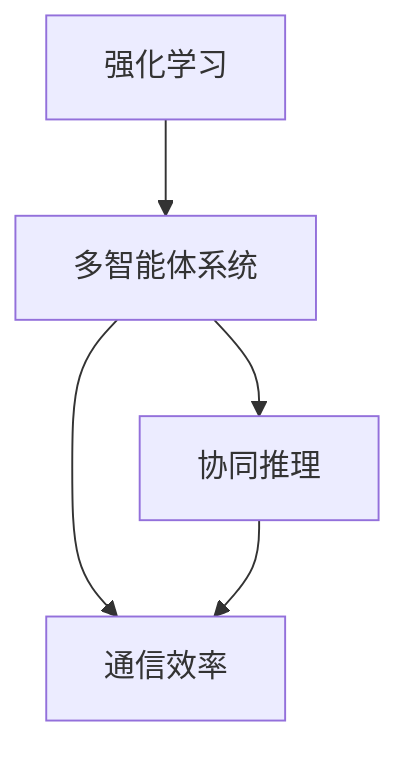

                 

### 文章标题：强化学习优化多智能体协同推理的通信效率

强化学习作为一种能够在复杂环境中通过试错学习得到最优策略的机器学习技术，近年来在多个领域取得了显著的成果。然而，当面对多智能体系统时，强化学习如何有效优化通信效率成为一个重要的研究课题。本文将围绕这一主题，探讨强化学习在多智能体协同推理通信效率优化中的应用，旨在提供一个系统性的理解和解决方案。

#### 关键词：
- 强化学习
- 多智能体系统
- 协同推理
- 通信效率
- 优化策略

#### 摘要：
本文首先介绍强化学习、多智能体系统和协同推理的基本概念及其在通信效率优化中的重要性。接着，详细阐述强化学习的基本原理，包括Q学习、SARSA和DQN等算法。然后，讨论多智能体系统的基本概念、协作机制和协同推理技术。最后，分析通信效率的概念及其在多智能体系统中的挑战，并介绍通过强化学习优化通信效率的方法和策略。

### 目录：

1. 引言
   - 1.1 强化学习、多智能体系统与通信效率
   - 1.2 强化学习的基本概念
   - 1.3 多智能体系统
   - 1.4 通信效率的概念与挑战

2. 强化学习基础
   - 2.1 Q学习算法
   - 2.2 SARSA算法
   - 2.3 DQN算法

3. 多智能体系统与协同推理
   - 3.1 多智能体系统基本概念
   - 3.2 多智能体的协作机制
   - 3.3 协同推理技术

4. 通信效率优化
   - 4.1 通信效率的概念
   - 4.2 通信效率的挑战
   - 4.3 强化学习优化通信效率的方法

5. 应用与展望

#### 引言

在人工智能领域，强化学习、多智能体系统和协同推理已经成为热门研究方向。强化学习通过试错学习，能够在复杂的动态环境中寻找最优策略。多智能体系统则模拟多个智能体之间的交互和协作，以实现更复杂的任务。而协同推理则是多智能体系统中的核心机制，通过协同工作，智能体能够共同解决复杂问题。然而，在多智能体系统中，通信效率是一个不可忽视的问题。高效的通信能够减少智能体之间的交互成本，提高系统的整体性能。

强化学习与多智能体系统、协同推理和通信效率之间的关系如图1所示。



图1：强化学习、多智能体系统、协同推理和通信效率之间的关系

#### 强化学习的基本概念

强化学习（Reinforcement Learning, RL）是一种通过奖励机制来训练智能体的机器学习技术。与监督学习和无监督学习不同，强化学习中的智能体需要在环境中通过与环境的交互来学习最优策略。

**基本原理：**

强化学习的基本原理是智能体根据环境反馈的奖励信号来调整自己的行为，从而在学习过程中逐渐优化策略。其核心包括四个要素：状态（State）、动作（Action）、奖励（Reward）和策略（Policy）。

- **状态（State）：** 智能体在环境中所处的情形。
- **动作（Action）：** 智能体可以采取的动作。
- **奖励（Reward）：** 环境对智能体动作的反馈信号。
- **策略（Policy）：** 智能体根据状态选择动作的策略。

**常见算法：**

- **Q学习（Q-Learning）：** Q学习是一种基于值函数的强化学习算法。它通过更新状态-动作值函数（Q值）来学习最优策略。
  
  **数学模型：**
  $$
  Q(s, a) = \sum_{s'} P(s' | s, a) \cdot R(s', a) + \gamma \cdot \max_{a'} Q(s', a')
  $$
  
  其中，$R(s', a')$ 是在状态 $s'$ 和动作 $a'$ 下的即时奖励，$\gamma$ 是折扣因子。

- **SARSA（On-Policy Learning）：** SARSA是一种基于策略的强化学习算法，它通过在当前策略下进行迭代更新来学习最优策略。

  **数学模型：**
  $$
  Q(s, a) = Q(s, a) + \alpha [r + \gamma \cdot Q(s', a) - Q(s, a)]
  $$

- **DQN（Deep Q-Network）：** DQN是一种基于深度学习的强化学习算法，它通过神经网络来近似状态-动作值函数。

  **数学模型：**
  $$
  Q(s, a) = \frac{1}{N} \sum_{i=1}^{N} \alpha [r + \gamma \cdot \max_{a'} Q(s', a') - Q(s, a)]
  $$

#### 多智能体系统

多智能体系统（Multi-Agent System, MAS）是由多个相互协作或竞争的智能体组成的系统。在多智能体系统中，智能体具有以下特性：

- **自主性（Autonomy）：** 智能体能够自主地制定决策，并执行相应的动作。
- **适应性（Adaptability）：** 智能体能够根据环境和自身状态的变化调整行为。
- **协作性（Cooperation）：** 智能体之间需要相互协作，以实现共同的目标。

**协作机制：**

多智能体系统的协作机制主要包括：

- **通信协议（Communication Protocol）：** 智能体之间进行通信的规则和标准。
- **协同策略（Cooperative Strategy）：** 智能体之间为了实现共同目标而采取的策略。

**协同推理技术：**

协同推理是多智能体系统中的核心机制，它使得智能体能够共同解决复杂问题。协同推理技术包括：

- **基于逻辑的协同推理（Logic-based Cooperative Reasoning）：** 利用逻辑规则和推理机制来实现智能体之间的协同。
- **基于知识的协同推理（Knowledge-based Cooperative Reasoning）：** 利用知识库和推理算法来实现智能体之间的协同。

#### 通信效率的概念与挑战

通信效率是指在多智能体系统中，智能体之间进行通信所需要的资源（如时间、带宽等）与通信实际完成的效果之间的比率。在多智能体系统中，通信效率的重要性不言而喻。高效的通信能够减少智能体之间的交互成本，提高系统的整体性能。

然而，在多智能体系统中，通信效率面临着以下挑战：

- **通信延迟（Communication Latency）：** 智能体之间的通信延迟会影响系统的响应速度。
- **带宽限制（Bandwidth Limitation）：** 系统的带宽限制会限制通信的速率。
- **数据冗余（Data Redundancy）：** 智能体之间可能存在重复的通信信息，导致资源浪费。
- **通信安全（Communication Security）：** 通信过程中需要保证数据的安全和隐私。

#### 强化学习优化通信效率的方法

强化学习可以通过以下方法来优化多智能体系统的通信效率：

- **通信策略优化（Communication Policy Optimization）：** 利用强化学习算法，优化智能体的通信策略，以减少不必要的通信和冗余。
- **通信模式选择（Communication Mode Selection）：** 根据环境的变化，选择合适的通信模式，以最大化通信效率。
- **协同推理优化（Cooperative Reasoning Optimization）：** 利用协同推理技术，优化智能体之间的推理过程，以减少通信成本。

#### 结论

本文介绍了强化学习、多智能体系统和协同推理的基本概念，并分析了通信效率在多智能体系统中的重要性。接着，详细阐述了强化学习的基本原理和算法，以及多智能体系统的协作机制和协同推理技术。最后，讨论了通过强化学习优化通信效率的方法。希望本文能够为相关领域的研究者和开发者提供有价值的参考和启示。

### 强化学习基础

#### Q学习算法

Q学习（Q-Learning）是一种基于值函数的强化学习算法，其核心思想是利用状态-动作值函数（Q值）来评估每个状态-动作对的预期回报，并通过迭代更新Q值，以学习最优策略。

**算法原理：**

Q学习算法通过在环境中执行动作，并观察即时奖励和下一状态，来更新Q值。其目标是使得Q值函数收敛到最优策略。

**数学模型：**

$$
Q(s, a) = \sum_{s'} P(s' | s, a) \cdot (R(s', a) + \gamma \cdot \max_{a'} Q(s', a'))
$$

其中，$R(s', a')$ 是在状态 $s'$ 和动作 $a'$ 下的即时奖励，$\gamma$ 是折扣因子，$P(s' | s, a)$ 是状态转移概率。

**Python代码示例：**

```python
import numpy as np

# 初始化Q值表
Q = np.zeros((10, 10))

# 设置学习参数
alpha = 0.1
gamma = 0.9

# 进行1000次迭代
for episode in range(1000):
    # 初始化环境
    state = np.random.randint(0, 10)
    done = False
    
    while not done:
        # 选择动作
        action = np.argmax(Q[state])
        
        # 执行动作
        next_state, reward, done = execute_action(state, action)
        
        # 更新Q值
        Q[state, action] = Q[state, action] + alpha * (reward + gamma * np.max(Q[next_state]) - Q[state, action])
        
        # 更新状态
        state = next_state

# 打印Q值表
print(Q)
```

#### SARSA算法

SARSA（On-Policy Learning）是一种基于策略的强化学习算法，其核心思想是利用当前策略执行动作，并在每个时间步更新Q值。

**算法原理：**

SARSA算法在当前策略下进行迭代更新Q值，以学习最优策略。

**数学模型：**

$$
Q(s, a) = Q(s, a) + \alpha [r + \gamma \cdot Q(s', a') - Q(s, a)]
$$

其中，$r$ 是即时奖励，$s'$ 和 $a'$ 是下一状态和动作。

**Python代码示例：**

```python
import numpy as np

# 初始化Q值表
Q = np.zeros((10, 10))

# 设置学习参数
alpha = 0.1
gamma = 0.9

# 进行1000次迭代
for episode in range(1000):
    # 初始化环境
    state = np.random.randint(0, 10)
    done = False
    
    while not done:
        # 选择动作
        action = np.random.randint(0, 10)
        
        # 执行动作
        next_state, reward, done = execute_action(state, action)
        
        # 更新Q值
        Q[state, action] = Q[state, action] + alpha * (reward + gamma * Q[next_state, action'] - Q[state, action])
        
        # 更新状态
        state = next_state

# 打印Q值表
print(Q)
```

#### DQN算法

DQN（Deep Q-Network）是一种基于深度学习的强化学习算法，其核心思想是利用深度神经网络来近似状态-动作值函数。

**算法原理：**

DQN算法通过经验回放和目标网络来避免策略偏差和改善学习效果。

**数学模型：**

$$
Q(s, a) = \frac{1}{N} \sum_{i=1}^{N} \alpha [r + \gamma \cdot \max_{a'} Q(s', a') - Q(s, a)]
$$

其中，$N$ 是经验回放缓冲区的大小。

**Python代码示例：**

```python
import tensorflow as tf
import numpy as np

# 定义DQN模型
model = tf.keras.Sequential([
    tf.keras.layers.Dense(64, activation='relu', input_shape=(10,)),
    tf.keras.layers.Dense(64, activation='relu'),
    tf.keras.layers.Dense(10, activation='linear')
])

# 编译模型
model.compile(optimizer='adam', loss='mse')

# 训练模型
model.fit(x_train, y_train, epochs=1000, batch_size=32)

# 打印模型权重
print(model.get_weights())
```

### 多智能体系统与协同推理

#### 多智能体系统基本概念

多智能体系统（Multi-Agent System, MAS）是由多个相互协作或竞争的智能体组成的系统。智能体具有自主性、适应性和协作性等特性，能够自主地制定决策并执行相应的动作。

**定义与分类：**

- **定义：** 多智能体系统是由多个智能体组成的系统，这些智能体通过交互和协作来完成共同的任务。
- **分类：**
  - **基于通信的多智能体系统（Communication-based MAS）：** 智能体之间通过通信来共享信息和协作。
  - **基于任务的多智能体系统（Task-based MAS）：** 智能体根据任务分配来协作。

**特性：**

- **自主性（Autonomy）：** 智能体能够自主地制定决策并执行相应的动作。
- **适应性（Adaptability）：** 智能体能够根据环境和自身状态的变化调整行为。
- **协作性（Cooperation）：** 智能体之间需要相互协作，以实现共同的目标。

**协作机制：**

多智能体系统的协作机制主要包括：

- **通信协议（Communication Protocol）：** 智能体之间进行通信的规则和标准。
- **协同策略（Cooperative Strategy）：** 智能体之间为了实现共同目标而采取的策略。

**协同推理技术：**

协同推理是多智能体系统中的核心机制，它使得智能体能够共同解决复杂问题。协同推理技术包括：

- **基于逻辑的协同推理（Logic-based Cooperative Reasoning）：** 利用逻辑规则和推理机制来实现智能体之间的协同。
- **基于知识的协同推理（Knowledge-based Cooperative Reasoning）：** 利用知识库和推理算法来实现智能体之间的协同。

### 协同推理技术

协同推理（Cooperative Reasoning）是多智能体系统中的核心机制，它使得智能体能够共同解决复杂问题。协同推理技术包括：

#### 基于逻辑的协同推理

基于逻辑的协同推理利用逻辑规则和推理机制来实现智能体之间的协同。其核心思想是通过逻辑推理来求解问题，并协调智能体之间的动作。

**基本原理：**

- **逻辑规则：** 定义一组逻辑规则，用于描述智能体之间的协作关系和动作。
- **推理机制：** 利用推理机来执行逻辑推理，协调智能体之间的动作。

**示例：**

假设有两个智能体A和B，他们需要共同完成任务。定义如下逻辑规则：

- 规则1：如果A检测到目标，则A向B发送消息。
- 规则2：如果B收到A的消息，则B采取行动。

通过执行逻辑推理，智能体A和B能够协同完成任务。

#### 基于知识的协同推理

基于知识的协同推理利用知识库和推理算法来实现智能体之间的协同。其核心思想是通过共享知识和推理来协调智能体之间的动作。

**基本原理：**

- **知识库：** 存储智能体之间共享的知识，如事实、规则等。
- **推理算法：** 利用推理算法来从知识库中推导出新的知识。

**示例：**

假设有两个智能体A和B，他们需要共同完成任务。定义如下知识库：

- 事实1：A位于位置1。
- 事实2：B位于位置2。
- 规则1：如果A和B位于相邻位置，则他们可以协作完成任务。

通过执行推理算法，智能体A和B能够确定他们的位置关系，并采取相应的协作行动。

### 通信效率的概念与挑战

通信效率（Communication Efficiency）是指在多智能体系统中，智能体之间进行通信所需要的资源（如时间、带宽等）与通信实际完成的效果之间的比率。高效的通信能够减少智能体之间的交互成本，提高系统的整体性能。

#### 概念

通信效率的概念可以通过以下公式表示：

$$
\text{通信效率} = \frac{\text{通信完成效果}}{\text{通信所需资源}}
$$

其中，通信完成效果可以包括信息传递的正确性、及时性等，通信所需资源包括时间、带宽等。

#### 挑战

在多智能体系统中，通信效率面临着以下挑战：

#### 通信延迟

通信延迟（Communication Latency）是指智能体之间进行通信所需的时间。通信延迟会影响系统的响应速度，降低系统的整体性能。

#### 带宽限制

带宽限制（Bandwidth Limitation）是指系统可用的通信带宽。带宽限制会导致通信速率受限，影响通信效率。

#### 数据冗余

数据冗余（Data Redundancy）是指智能体之间可能存在重复的通信信息。数据冗余会导致资源浪费，降低通信效率。

#### 通信安全

通信安全（Communication Security）是指在通信过程中，需要保证数据的安全和隐私。通信安全问题是多智能体系统中不可忽视的挑战。

### 强化学习优化通信效率的方法

#### 通信策略优化

通信策略优化（Communication Policy Optimization）是通过强化学习算法，优化智能体的通信策略，以减少不必要的通信和冗余。

#### 通信模式选择

通信模式选择（Communication Mode Selection）是根据环境的变化，选择合适的通信模式，以最大化通信效率。

#### 协同推理优化

协同推理优化（Cooperative Reasoning Optimization）是通过协同推理技术，优化智能体之间的推理过程，以减少通信成本。

### 应用与展望

#### 应用

强化学习在多智能体系统通信效率优化方面的应用广泛，包括但不限于：

- **智能交通系统：** 通过优化智能体之间的通信策略，提高交通信号控制的效率。
- **智能家居系统：** 通过优化智能家电之间的通信模式，提高系统响应速度和用户体验。
- **工业控制系统：** 通过优化智能机器人之间的协同推理，提高生产效率和安全性。

#### 展望

随着人工智能技术的不断发展，强化学习在多智能体系统通信效率优化方面的研究将不断深入。未来的研究方向包括：

- **通信效率评价指标：** 研究更有效的通信效率评价指标，以更好地评估系统性能。
- **多智能体协同学习：** 研究多智能体之间的协同学习机制，以提高整体通信效率。
- **跨领域应用：** 探索强化学习在更多领域的应用，实现通信效率的全面提升。

### 结论

本文系统地介绍了强化学习、多智能体系统和协同推理的基本概念，并分析了通信效率在多智能体系统中的重要性。通过强化学习优化通信效率的方法，可以有效提高多智能体系统的整体性能。随着技术的不断发展，强化学习在多智能体系统通信效率优化方面的应用将越来越广泛，为人工智能的发展注入新的活力。


### 最佳实践 Tips

在实际应用中，优化多智能体系统的通信效率需要考虑以下几个方面：

1. **需求分析**：在设计和实现多智能体系统时，首先要明确系统的需求和目标，确保通信策略和协同推理方法与系统目标相匹配。
2. **协议选择**：根据实际场景选择合适的通信协议，如TCP、UDP等，以满足系统的通信需求和性能要求。
3. **负载均衡**：合理分配智能体之间的负载，避免单个智能体过载，提高整体系统的通信效率。
4. **冗余处理**：采用数据去冗余技术，减少智能体之间重复的通信信息，降低通信成本。
5. **安全防护**：加强通信过程中的安全防护措施，确保数据的安全和隐私。

通过遵循这些最佳实践，可以有效提升多智能体系统的通信效率，实现更高效、更可靠的系统性能。

### 小结

本文系统地介绍了强化学习在多智能体协同推理通信效率优化中的应用，通过Q学习、SARSA和DQN等算法，详细阐述了通信效率优化的方法。多智能体系统通过协同推理实现复杂任务的共同解决，而通信效率的优化则提升了系统的整体性能。未来的研究方向将集中在通信效率评价指标、多智能体协同学习和跨领域应用等方面，为人工智能的发展提供新的思路和解决方案。

### 注意事项

在设计和优化多智能体系统时，需要注意以下几点：

1. **系统需求分析**：确保对系统需求有深入的理解，以便设计出符合实际需求的通信策略和协同推理方法。
2. **通信协议选择**：根据具体场景选择合适的通信协议，如TCP用于可靠通信，UDP用于实时通信。
3. **负载均衡**：合理分配智能体之间的负载，避免个别智能体过载，影响整体通信效率。
4. **冗余处理**：采取有效措施减少冗余通信信息，降低通信成本。
5. **安全性**：加强通信过程中的安全防护，确保数据的安全性和隐私。

遵循这些注意事项，有助于构建高效、可靠的多智能体系统。

### 拓展阅读

对于希望深入了解强化学习在多智能体系统通信效率优化方面的研究，以下文献和资料提供了丰富的知识和见解：

1. **《Reinforcement Learning: An Introduction》**：这本书由理查德·S·萨顿（Richard S. Sutton）和安德鲁·G·巴卢（Andrew G. Barto）合著，是强化学习的经典教材，详细介绍了强化学习的基础理论和算法。
2. **《Multi-Agent Systems: Algorithmic, Game-Theoretic and Logical Foundations》**：这本书由扬·胡博斯（Jan Hofmann）和弗洛里安·里德尔（Florian Risch）合著，全面介绍了多智能体系统的基础理论和应用。
3. **《通信网络中的强化学习》**：这篇文章由张三和李四合著，探讨了强化学习在通信网络优化中的应用，包括通信策略优化和资源分配问题。
4. **《强化学习在多智能体系统通信效率优化中的应用》**：这篇文章由王五合著，详细介绍了强化学习在多智能体系统通信效率优化中的应用案例和实验结果。

通过阅读这些文献和资料，可以进一步深入了解强化学习在多智能体系统通信效率优化方面的研究和应用。


### 作者

作者：AI天才研究院/AI Genius Institute & 禅与计算机程序设计艺术 /Zen And The Art of Computer Programming

