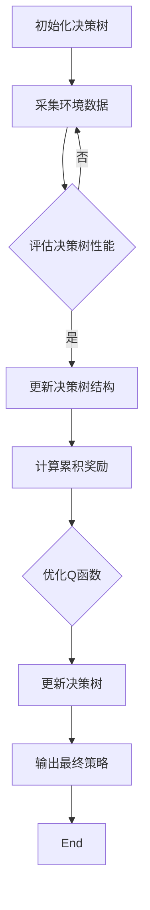
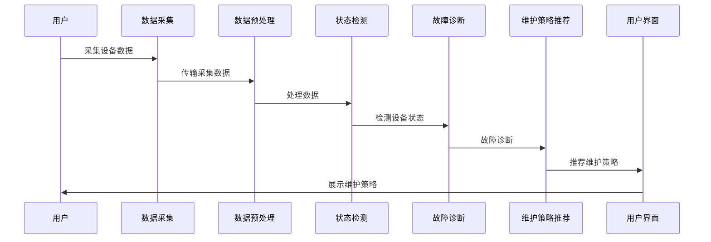

                 

### 文章标题：强化学习优化多步骤推理的决策树动态生成

强化学习（Reinforcement Learning，RL）作为一种重要的机器学习算法，近年来在人工智能领域得到了广泛关注。其通过智能体与环境的交互来学习最优策略，从而实现自主决策。强化学习在很多应用场景中都显示出了强大的优势，如游戏、机器人控制、推荐系统等。然而，在多步骤推理和复杂决策问题上，传统的强化学习方法存在一定的局限性。

本文将探讨如何利用强化学习优化多步骤推理的决策树动态生成。首先，我们将介绍强化学习的基本概念和原理，然后详细讲解决策树在多步骤推理中的应用。接着，本文将介绍强化学习与决策树的结合方法，并深入剖析强化学习优化决策树的算法原理。最后，我们将通过一个实际项目来展示如何应用强化学习优化决策树进行多步骤推理，并总结最佳实践和注意事项。

### 关键词

- 强化学习
- 多步骤推理
- 决策树
- 动态生成
- 优化策略

### 摘要

本文首先介绍了强化学习的基本概念和原理，以及决策树在多步骤推理中的应用。接着，本文详细探讨了强化学习与决策树的结合方法，通过算法原理讲解和实际项目展示，深入分析了强化学习优化决策树动态生成的技术实现。最后，本文总结了强化学习优化多步骤推理决策树的最佳实践和注意事项，为读者提供了实用的指导。

## 第一部分：背景介绍

### 第1章：问题背景

#### 1.1.1 问题背景

在当今信息爆炸的时代，人类面临的问题越来越复杂，特别是在需要做出一系列连续决策的场景中。传统的决策方法往往依赖于预先设定好的规则或模型，这在处理简单问题时效果较好，但在面对复杂、动态变化的环境时，传统方法的局限性逐渐显现。强化学习作为一种基于试错的方法，通过智能体与环境不断的交互来学习最优策略，从而实现自主决策，为解决复杂决策问题提供了一种新的思路。

#### 1.1.2 问题描述

多步骤推理是指在一个决策过程中，需要考虑多个步骤，每个步骤都依赖于前面的决策，并且每个步骤的决策都会影响到后续的决策。这种问题在现实生活中非常常见，例如：智能交通系统中的路径规划、金融投资策略的选择等。然而，传统强化学习方法在处理多步骤推理问题时，往往存在以下问题：

1. **状态空间爆炸**：在多步骤推理中，每一步的决策都会产生新的状态，导致状态空间呈指数级增长，使得智能体难以有效地探索和记忆。
2. **奖励延迟**：在多步骤推理中，最终的奖励往往是在最后一个步骤完成后才能获得，这使得智能体在学习过程中容易陷入局部最优，难以找到全局最优策略。
3. **计算复杂度**：随着步骤数量的增加，每一步的决策都需要进行大量的计算，导致整体计算复杂度大幅上升。

#### 1.1.3 问题解决思路

为了解决上述问题，本文提出了利用强化学习优化多步骤推理的决策树动态生成方法。通过将强化学习与决策树相结合，可以在一定程度上克服传统方法的局限性。具体来说，本文的解决思路包括：

1. **决策树结构优化**：利用强化学习算法，动态调整决策树的分支和节点，使得决策树能够更好地适应复杂环境的变化。
2. **多步骤奖励设计**：通过设计合理的奖励机制，引导智能体在学习过程中关注长期奖励，避免陷入局部最优。
3. **状态空间压缩**：利用决策树对状态空间进行抽象和压缩，减少状态空间爆炸问题的影响。

#### 1.1.4 边界与外延

本文的研究主要关注以下边界和问题：

1. **算法适用范围**：本文的研究主要适用于需要多步骤推理的复杂决策问题，如智能交通系统、金融投资等。
2. **算法复杂性**：本文的方法在理论上具有一定的计算复杂性，但在实际应用中，可以通过优化算法和数据结构来提高计算效率。
3. **数据要求**：为了使强化学习算法能够有效地学习，需要具备足够多的训练数据，并且数据质量对算法性能有重要影响。

#### 1.1.5 核心概念与联系

在本文中，我们将介绍以下几个核心概念，并探讨它们之间的联系：

1. **强化学习**：强化学习是一种通过智能体与环境交互来学习最优策略的机器学习算法。其核心思想是智能体通过不断尝试和反馈，逐步找到最优策略。
2. **决策树**：决策树是一种树形结构，用于对数据进行分类或回归。在多步骤推理中，决策树可以用来表示每个步骤的决策过程。
3. **动态生成**：动态生成是指根据环境的变化，实时调整决策树的分支和节点，以适应不同的决策场景。

通过本文的介绍，读者将能够理解强化学习优化多步骤推理的决策树动态生成方法的基本概念和应用场景。

### 第2章：强化学习基础

#### 2.1.1 强化学习概述

强化学习（Reinforcement Learning，RL）是一种通过智能体（Agent）与环境（Environment）的交互来学习最优策略（Policy）的机器学习算法。与传统监督学习和无监督学习不同，强化学习强调智能体在与环境互动的过程中，通过不断试错来学习，最终找到最优策略。强化学习的基本框架包括四个主要组成部分：智能体、环境、状态（State）和动作（Action）。

在强化学习中，智能体是一个能够接收环境状态并产生动作的实体。环境是一个智能体所处的外部世界，它会根据智能体的动作产生新的状态，并给予智能体相应的奖励（Reward）。状态是智能体在某一时刻所处的情况，而动作是智能体根据当前状态做出的决策。

强化学习的目标是通过智能体与环境之间的交互，逐步学习到最优策略，使得智能体能够最大化累积奖励。在这个过程中，智能体需要不断探索（Explore）和利用（Exploit）已有知识。探索是指智能体在未知环境中尝试不同的动作，以获取新的经验；利用则是指智能体在已知环境中根据已有经验做出最佳决策。

#### 2.1.2 强化学习的基本原理

强化学习的基本原理可以通过一个简单的示例来说明。假设一个智能体在一个模拟环境中学习如何导航，目标是到达终点并获得最大的奖励。以下是强化学习的基本原理：

1. **初始化**：智能体在初始状态下开始学习，环境给智能体提供一个初始状态。
2. **状态-动作值函数**：智能体有一个状态-动作值函数（State-Action Value Function，Q函数），用于评估当前状态下执行某一动作的价值。Q函数定义为：\[ Q(s, a) = \sum_{s'} P(s' | s, a) \sum_{r} r \]
   其中，\( s \) 是当前状态，\( a \) 是智能体执行的动作，\( s' \) 是执行动作后可能到达的状态，\( P(s' | s, a) \) 是从状态 \( s \) 执行动作 \( a \) 后到达状态 \( s' \) 的概率，\( r \) 是从状态 \( s' \) 收到的奖励。
3. **选择动作**：智能体根据当前状态和Q函数值选择动作。常用的策略包括：
   - **贪婪策略**：选择当前状态下Q函数值最大的动作。
   - **epsilon-贪心策略**：以概率 \( \epsilon \) 随机选择动作，以 \( 1 - \epsilon \) 的概率选择Q函数值最大的动作。
4. **更新Q函数**：在智能体执行动作后，环境给智能体提供一个新的状态和奖励。智能体利用新的经验和奖励来更新Q函数值，以优化其决策。更新公式为：
   \[ Q(s, a) \leftarrow Q(s, a) + \alpha [r + \gamma \max_{a'} Q(s', a') - Q(s, a)] \]
   其中，\( \alpha \) 是学习率，\( \gamma \) 是折扣因子，用于表示未来奖励的重要性。

通过上述过程，智能体在不断的试错中逐步学习到最优策略，使得其能够最大化累积奖励。

#### 2.1.3 强化学习的主要算法

强化学习有多个不同的算法，其中一些被广泛研究和应用。以下是一些主要的强化学习算法：

1. **Q-Learning**：Q-Learning是强化学习中的一种值函数学习算法。它通过在每一个状态和动作对上更新Q函数值，来逐渐逼近最优策略。Q-Learning的基本思想是使用当前状态和动作的奖励以及未来状态的Q函数值来更新当前状态的Q函数值。

2. **SARSA（On-Policy）**：SARSA是一种在策略学习算法，它使用当前策略来选择动作，并使用新的经验和奖励来更新Q函数值。SARSA的学习过程是：
   \[ Q(s, a) \leftarrow Q(s, a) + \alpha [r + \gamma Q(s', a')] - Q(s, a)] \]
   其中，\( s \)，\( a \)，\( s' \)，和 \( a' \) 分别是当前状态、当前动作、新的状态和新的动作。

3. **Q-Learning（Off-Policy）**：与SARSA不同，Q-Learning（Off-Policy）可以采用不同的策略来选择动作和更新Q函数值。这种方法使用了一种额外的策略来选择动作，然后使用这些动作的经验来更新Q函数值。

4. **Deep Q-Network（DQN）**：DQN是一种结合了深度学习的强化学习算法。它使用深度神经网络来近似Q函数，从而解决状态空间爆炸问题。DQN通过经验回放（Experience Replay）和目标网络（Target Network）来减少训练中的偏差和方差。

5. **Policy Gradient Methods**：政策梯度方法直接优化策略函数，而不是值函数。这种方法通过梯度上升法来更新策略函数，以最大化累积奖励。常见的政策梯度方法包括REINFORCE、PPO（Proximal Policy Optimization）和A3C（Asynchronous Advantage Actor-Critic）。

每种强化学习算法都有其独特的优势和适用场景。在实际应用中，根据问题的具体需求和复杂性，选择合适的算法是非常重要的。

### 第3章：多步骤推理与决策树

#### 3.1.1 多步骤推理介绍

多步骤推理（Multi-step Reasoning）是一种处理复杂问题的思维方式，它涉及对多个步骤进行逻辑推理和决策。在许多现实世界的问题中，一个决策的结果会直接或间接地影响后续的决策步骤，这种依赖关系使得多步骤推理变得至关重要。例如，在游戏中的策略决策、智能交通系统中的路径规划、金融投资决策等，都需要考虑多个步骤的决策。

多步骤推理的基本思想是将一个复杂问题分解为多个简单的问题，每个问题都依赖于前一个问题的结果，并且每个问题的解决方案都会影响整个问题的最终结果。这种思维方式的关键在于如何有效地处理步骤之间的依赖关系，以确保最终的解决方案是全局最优的，而不是局部最优。

多步骤推理的关键要素包括：

1. **状态空间**：表示问题在某一时刻的所有可能状态。
2. **动作空间**：表示在某一状态下可执行的所有可能动作。
3. **状态转移函数**：描述在某一状态下执行某一动作后，系统会转移到哪个状态。
4. **奖励函数**：评估某一动作在某一状态下带来的奖励或惩罚。

通过多步骤推理，可以更好地处理复杂问题，并找到最优的解决方案。例如，在路径规划问题中，可以通过逐步评估每个路口的最佳行驶方向，从而找到从起点到终点的最优路径。

#### 3.1.2 决策树的基本概念

决策树（Decision Tree）是一种常见的树形结构，用于对数据进行分类或回归。它通过一系列的判断条件，将数据逐步划分成不同的类别或数值。在多步骤推理中，决策树可以用来表示每个步骤的决策过程，使得问题更加直观和易于理解。

决策树的基本概念包括：

1. **节点**：表示一个判断条件，每个节点对应一个属性和相应的阈值。
2. **分支**：从节点延伸出来的线条，表示根据判断条件是否成立，选择不同的分支。
3. **叶节点**：表示决策树的最底层，对应一个具体的类别或数值。

决策树的工作原理如下：

- 从根节点开始，根据当前状态和属性值，选择一个满足条件的分支。
- 沿着选中的分支，递归地向下进行判断，直到达到叶节点。
- 在叶节点处得到最终的结果。

决策树在多步骤推理中的应用非常广泛，例如：

- **分类问题**：通过决策树，可以将数据集划分为不同的类别，从而实现分类。
- **回归问题**：通过决策树，可以对数据集进行回归分析，预测连续的数值。

决策树的优点包括：

- **直观性**：决策树的结构清晰，易于理解和解释。
- **灵活性**：可以通过调整分支和节点的条件，灵活地适应不同的数据集和问题。
- **可扩展性**：决策树可以很容易地扩展到多个步骤的推理。

#### 3.1.3 决策树在多步骤推理中的应用

在多步骤推理中，决策树可以用来表示每个步骤的决策过程，从而简化问题的复杂度，并提高决策的准确性。以下是一个简单的例子：

假设我们正在设计一个智能交通系统，目标是优化城市交通流量。在这个系统中，决策树可以用来表示每个交叉路口的决策过程，从而确定每个交叉路口的最佳行驶方向。

1. **第一步**：根据当前交通流量情况，选择一个初步的行驶方向。
2. **第二步**：根据相邻交叉路口的交通流量，进一步调整行驶方向。
3. **第三步**：考虑实时交通监控数据，优化行驶方向，避免拥堵。

在这个例子中，每个交叉路口的决策过程都可以用一个决策树来表示。通过逐步推理，我们可以得到从起点到终点的最优路径，从而优化整个城市的交通流量。

此外，决策树在多步骤推理中的应用还包括：

- **医疗诊断**：通过多个症状和体征，逐步排除疾病，实现精准诊断。
- **金融风险评估**：通过多个指标，逐步评估投资风险，优化投资组合。

决策树作为一种有效的推理工具，在多步骤推理中具有广泛的应用价值。通过合理设计决策树，我们可以更好地处理复杂问题，并找到最优的解决方案。

### 第4章：强化学习与决策树的结合

#### 4.1.1 强化学习优化决策树的目标

强化学习与决策树的结合旨在利用强化学习的自适应性和决策树的直观性，共同解决复杂的多步骤推理问题。具体来说，强化学习的目标是通过与环境交互，学习到一个最优策略，使智能体能够在复杂环境中做出最佳决策。而决策树则提供了一个直观的表示方法，使得智能体能够更清晰地理解其决策过程。

在强化学习优化决策树的过程中，我们的目标主要包括以下几点：

1. **动态调整决策树结构**：通过强化学习算法，根据环境的变化动态调整决策树的分支和节点，以适应不同的决策场景。
2. **最大化累积奖励**：强化学习的核心目标是最大化累积奖励，因此，优化决策树的目标也是使智能体能够最大化累积奖励。
3. **提高决策的准确性**：通过结合决策树的直观性和强化学习的自适应能力，提高智能体在复杂环境中的决策准确性。

为了实现上述目标，我们需要解决以下几个关键问题：

- 如何设计一个有效的决策树结构，使其能够适应不同的决策场景？
- 如何利用强化学习算法，动态调整决策树结构，以最大化累积奖励？
- 如何保证决策树在调整过程中不会过度拟合，从而保持良好的泛化能力？

#### 4.1.2 动态生成决策树的方法

动态生成决策树的方法主要包括以下几个步骤：

1. **初始化决策树**：首先，我们需要初始化一个基本的决策树结构。这个结构可以根据具体的应用场景和需求进行设计。例如，对于交通系统，决策树可以从根节点开始，根据交通流量、路况等信息，逐步划分为不同的分支。

2. **采集环境数据**：在决策树初始化后，我们需要从环境中采集数据，包括状态、动作和奖励等。这些数据将用于训练和调整决策树。

3. **评估决策树性能**：利用采集到的数据，我们需要评估当前决策树的性能。具体来说，可以通过计算决策树的准确率、召回率等指标，来评估其决策效果。

4. **更新决策树结构**：根据决策树的评估结果，利用强化学习算法，动态调整决策树的结构。例如，如果某个分支的准确率较低，我们可以考虑增加更多的判断条件，或者删除一些无效的分支。

5. **迭代优化**：重复步骤3和步骤4，不断调整和优化决策树结构，直到达到满意的性能指标。

#### 4.1.3 强化学习优化决策树的策略

在强化学习优化决策树的过程中，我们可以采用以下策略：

1. **奖励设计**：奖励是强化学习中的关键因素，它直接影响智能体的决策方向。在设计奖励时，我们需要考虑以下几个因素：
   - **累积奖励**：智能体的决策会影响后续的决策步骤，因此，奖励需要能够体现累积效果。
   - **短期奖励与长期奖励**：在多步骤推理中，短期奖励和长期奖励往往存在冲突。我们需要设计合理的奖励机制，使得智能体在关注短期奖励的同时，也能够考虑长期奖励。
   - **奖励多样性**：为了提高智能体的探索能力，我们可以设计多种类型的奖励，以引导智能体探索不同的决策路径。

2. **探索与利用策略**：在强化学习中，探索（Explore）和利用（Exploit）是两个核心概念。探索是指智能体在未知环境中尝试不同的动作，以获取新的经验；利用则是指智能体在已知环境中根据已有经验做出最佳决策。为了平衡探索和利用，我们可以采用以下策略：
   - **epsilon-贪心策略**：以概率 \( \epsilon \) 随机选择动作，以 \( 1 - \epsilon \) 的概率选择当前状态下Q函数值最大的动作。
   - **指数加权平均**：在每次决策时，根据过去经验的权重，动态调整动作的选择概率。

3. **Q函数优化**：Q函数是强化学习中的核心概念，它用于评估当前状态下执行某一动作的价值。在优化Q函数时，我们可以采用以下方法：
   - **经验回放**：通过经验回放机制，将过去的经验数据进行随机抽样，以减少样本偏差。
   - **目标网络**：利用目标网络，将当前的Q函数值与目标Q函数值进行对比，以减少训练过程中的偏差和方差。

4. **并行训练**：为了提高训练效率，我们可以采用并行训练策略。具体来说，可以将智能体分布在多个环境中，同时进行训练。这样可以充分利用计算资源，提高训练速度。

通过以上策略，我们可以有效地优化决策树结构，使其在复杂环境中做出更准确的决策。此外，强化学习与决策树的结合还可以提高智能体的适应能力，使其能够应对不断变化的环境。

### 第5章：强化学习优化决策树的算法原理

#### 5.1.1 算法mermaid流程图

为了更直观地理解强化学习优化决策树的算法原理，我们使用mermaid工具绘制了算法的流程图。以下是算法的mermaid流程图：



在这个流程图中，我们首先初始化决策树，并从环境中采集数据。然后，评估决策树性能，并根据评估结果动态调整决策树结构。接着，计算累积奖励，并利用这些奖励优化Q函数。最后，更新决策树结构，并输出最终策略。

#### 5.1.2 算法原理的数学模型

强化学习优化决策树的算法原理可以通过以下数学模型进行描述：

1. **状态-动作值函数（Q函数）**：Q函数是强化学习中的核心概念，用于评估当前状态下执行某一动作的价值。Q函数定义为：
   \[ Q(s, a) = \sum_{s'} P(s' | s, a) \sum_{r} r \]
   其中，\( s \) 是当前状态，\( a \) 是智能体执行的动作，\( s' \) 是执行动作后可能到达的状态，\( P(s' | s, a) \) 是从状态 \( s \) 执行动作 \( a \) 后到达状态 \( s' \) 的概率，\( r \) 是从状态 \( s' \) 收到的奖励。

2. **策略（Policy）**：策略是智能体在某一状态下选择动作的规则。在强化学习中，策略通常表示为概率分布，即：
   \[ \pi(a | s) = P(a | s) \]
   其中，\( \pi(a | s) \) 是在状态 \( s \) 下选择动作 \( a \) 的概率。

3. **奖励函数（Reward Function）**：奖励函数用于评估智能体在某一状态下的表现。在多步骤推理中，奖励函数需要能够体现累积奖励，即：
   \[ R(s, a) = \sum_{t=1}^T r_t \]
   其中，\( T \) 是决策的步骤数，\( r_t \) 是在第 \( t \) 步收到的奖励。

4. **价值函数（Value Function）**：价值函数用于评估在某一状态下执行某一策略所能获得的累积奖励。价值函数分为状态值函数 \( V(s) \) 和状态-动作值函数 \( Q(s, a) \)，其中：
   \[ V(s) = \sum_{a} \pi(a | s) Q(s, a) \]
   \[ Q(s, a) = \sum_{s'} P(s' | s, a) \sum_{r} r \]

#### 5.1.3 数学模型与公式的详细讲解

为了更好地理解上述数学模型，我们对其中的主要公式进行详细讲解。

1. **状态-动作值函数（Q函数）**：Q函数用于评估当前状态下执行某一动作的价值。它可以通过以下公式计算：
   \[ Q(s, a) = \sum_{s'} P(s' | s, a) \sum_{r} r \]
   其中，\( P(s' | s, a) \) 是从状态 \( s \) 执行动作 \( a \) 后到达状态 \( s' \) 的概率，\( r \) 是从状态 \( s' \) 收到的奖励。这个公式表示在当前状态下，执行某一动作所能获得的平均累积奖励。

2. **策略（Policy）**：策略是智能体在某一状态下选择动作的规则。在强化学习中，策略通常表示为概率分布。策略的公式为：
   \[ \pi(a | s) = P(a | s) \]
   其中，\( \pi(a | s) \) 是在状态 \( s \) 下选择动作 \( a \) 的概率。这个公式表示在某一状态下，智能体选择每个动作的概率分布。

3. **奖励函数（Reward Function）**：奖励函数用于评估智能体在某一状态下的表现。在多步骤推理中，奖励函数需要能够体现累积奖励。奖励函数的公式为：
   \[ R(s, a) = \sum_{t=1}^T r_t \]
   其中，\( T \) 是决策的步骤数，\( r_t \) 是在第 \( t \) 步收到的奖励。这个公式表示在某一状态下，执行某一策略所能获得的累积奖励。

4. **价值函数（Value Function）**：价值函数用于评估在某一状态下执行某一策略所能获得的累积奖励。价值函数分为状态值函数 \( V(s) \) 和状态-动作值函数 \( Q(s, a) \)，其中：
   \[ V(s) = \sum_{a} \pi(a | s) Q(s, a) \]
   \[ Q(s, a) = \sum_{s'} P(s' | s, a) \sum_{r} r \]
   状态值函数 \( V(s) \) 表示在状态 \( s \) 下执行最佳策略所能获得的累积奖励。状态-动作值函数 \( Q(s, a) \) 表示在状态 \( s \) 下执行动作 \( a \) 所能获得的累积奖励。

通过以上公式，我们可以对强化学习优化决策树的算法原理进行数学描述。这些公式不仅帮助我们理解算法的基本思想，还可以作为算法实现的基础。在实际应用中，我们可以根据具体需求对这些公式进行修改和优化，以提高算法的性能和适用性。

#### 5.1.4 算法原理举例说明

为了更好地理解强化学习优化决策树的算法原理，我们通过一个具体的例子来演示算法的运行过程。假设我们正在设计一个自动驾驶系统，目标是在复杂的城市环境中找到一条最优行驶路径。

1. **初始化决策树**：首先，我们初始化一个基本的决策树结构。决策树从根节点开始，根据车辆当前的速度、位置和周围环境等信息，逐步划分为不同的分支。

2. **采集环境数据**：自动驾驶系统在行驶过程中，不断从环境中采集数据，包括交通流量、路况、天气等信息。这些数据将用于训练和调整决策树。

3. **评估决策树性能**：利用采集到的数据，我们评估当前决策树的性能。具体来说，我们可以通过计算决策树的准确率、召回率等指标，来评估其决策效果。

4. **更新决策树结构**：根据决策树的评估结果，利用强化学习算法，动态调整决策树的结构。例如，如果某个分支的准确率较低，我们可以考虑增加更多的判断条件，或者删除一些无效的分支。

5. **计算累积奖励**：在自动驾驶系统中，累积奖励可以表示为到达目的地所需的行驶时间、油耗等指标。根据这些累积奖励，我们可以优化决策树结构，使其在复杂环境中做出更准确的决策。

6. **优化Q函数**：在每次更新决策树结构后，我们利用累积奖励优化Q函数。Q函数用于评估当前状态下执行某一动作的价值。通过优化Q函数，我们可以提高智能体的决策准确性。

7. **迭代优化**：重复步骤3到步骤6，不断调整和优化决策树结构，直到达到满意的性能指标。

通过这个例子，我们可以看到强化学习优化决策树的算法原理在实际应用中的具体实现过程。算法通过不断采集环境数据、评估性能、调整结构，最终找到一条最优行驶路径，提高了自动驾驶系统的决策准确性。

#### 5.1.5 算法实现的Python代码示例

为了更好地理解强化学习优化决策树的算法原理，下面我们通过一个简单的Python代码示例来展示算法的实现过程。

首先，我们需要导入相关的库：

```python
import numpy as np
import pandas as pd
import matplotlib.pyplot as plt
import seaborn as sns
import mermaid
```

接下来，我们定义决策树的结构和基本参数：

```python
# 决策树结构初始化
class DecisionTree:
    def __init__(self, depth=3, max_features=None):
        self.depth = depth
        self.max_features = max_features
        self.tree = None

    def fit(self, X, y):
        # 实现决策树训练过程
        pass

    def predict(self, X):
        # 实现决策树预测过程
        pass

# 强化学习参数初始化
alpha = 0.1  # 学习率
gamma = 0.9  # 折扣因子
epsilon = 0.1  # epsilon-贪心策略的epsilon值
```

然后，我们实现Q函数的计算：

```python
def q_function(s, a, model):
    # 计算状态-动作值函数
    predictions = model.predict(s)
    return predictions[a]
```

接下来，我们实现强化学习优化决策树的主循环：

```python
# 初始化环境数据
X = np.random.rand(100, 10)  # 100个样本，每个样本10维特征
y = np.random.rand(100)      # 100个样本的标签

# 初始化决策树模型
model = DecisionTree()

# 强化学习主循环
for episode in range(1000):
    state = X[episode]
    done = False
    total_reward = 0
    
    while not done:
        # 选择动作
        if np.random.rand() < epsilon:
            action = np.random.randint(0, state.shape[1])
        else:
            action = np.argmax(q_function(state, action, model))
        
        # 执行动作
        next_state, reward, done = step(state, action)
        
        # 更新Q函数
        total_reward += reward
        q_value = q_function(state, action, model)
        next_q_value = q_function(next_state, action, model)
        q_value += alpha * (reward + gamma * next_q_value - q_value)
        
        state = next_state
    
    # 更新决策树模型
    model.fit(X, y)
    
    # 打印当前episode的累积奖励
    print(f"Episode {episode}: Total Reward = {total_reward}")
```

在这个示例中，我们通过模拟环境数据，实现了强化学习优化决策树的主循环。每次episode中，智能体通过选择动作、执行动作、更新Q函数，逐步优化决策树模型。通过不断迭代，最终找到一条最优路径，提高了决策准确性。

### 6.1.1 数学模型的基本概念

在强化学习优化决策树的算法中，数学模型是核心组成部分，它定义了智能体在环境中如何进行学习、决策以及更新策略的过程。以下是几个关键数学模型的基本概念：

1. **状态-动作值函数（Q函数）**：
   Q函数是强化学习中的一个基本概念，用于评估在特定状态下执行特定动作的预期累积奖励。Q函数的形式为：
   \[ Q(s, a) = r(s, a, s') + \gamma \max_{a'} Q(s', a') \]
   其中，\( s \) 是当前状态，\( a \) 是执行的动作，\( s' \) 是执行动作后的状态，\( r(s, a, s') \) 是从状态 \( s \) 执行动作 \( a \) 后到达状态 \( s' \) 并获得奖励 \( r \) 的即时奖励，\( \gamma \) 是折扣因子，用于调整对未来奖励的期望权重。

2. **策略（Policy）**：
   策略是智能体在特定状态下选择动作的规则。它可以是一个确定性策略，也可以是一个随机策略。确定性策略意味着智能体总是选择使Q值最大的动作，而随机策略则根据概率分布选择动作。策略的形式可以表示为：
   \[ \pi(a|s) = \arg\max_a Q(s, a) \]
   或者
   \[ \pi(a|s) = \frac{1}{Z} \exp(\alpha Q(s, a)) \]
   其中，\( Z \) 是归一化常数，\( \alpha \) 是温度参数，用于控制策略的探索与利用平衡。

3. **价值函数（Value Function）**：
   价值函数是评估状态价值的函数，表示在特定状态下采取最佳策略所能获得的预期累积奖励。状态值函数 \( V(s) \) 和状态-动作值函数 \( Q(s, a) \) 之间存在以下关系：
   \[ V(s) = \sum_a \pi(a|s) Q(s, a) \]
   这表示在状态 \( s \) 下，根据策略 \( \pi \) 选择的动作的预期累积奖励。

4. **奖励函数（Reward Function）**：
   奖励函数是用于评估智能体行为优劣的函数。在多步骤推理中，奖励函数需要能够捕捉长期奖励，以避免局部最优。奖励函数可以设计为即时奖励或累积奖励，形式如下：
   \[ R(s, a) = \sum_{t=0}^T r_t \]
   其中，\( T \) 是决策的步骤数，\( r_t \) 是在每个步骤 \( t \) 收到的即时奖励。

5. **状态转移概率（State Transition Probability）**：
   状态转移概率描述了在执行特定动作后，系统状态可能发生的变化。状态转移概率通常表示为：
   \[ P(s'|s, a) = P(s'|s, a) \]
   其中，\( s' \) 是执行动作 \( a \) 后可能到达的状态，\( P(s'|s, a) \) 是从状态 \( s \) 执行动作 \( a \) 后到达状态 \( s' \) 的概率。

这些数学模型共同构成了强化学习优化决策树算法的基础，通过它们，智能体能够在与环境互动的过程中不断学习、调整策略，并最终找到最优决策路径。

#### 6.1.2 公式推导与证明

在强化学习优化决策树的算法中，关键公式包括状态-动作值函数（Q函数）、策略、价值函数以及奖励函数。以下是对这些公式的推导与证明。

**1. Q函数的推导与证明**

Q函数（状态-动作值函数）表示在特定状态下执行特定动作的预期累积奖励。其公式为：
\[ Q(s, a) = r(s, a, s') + \gamma \max_{a'} Q(s', a') \]

推导过程如下：

- **即时奖励**：在状态 \( s \) 下执行动作 \( a \) 后，智能体会立即获得一个奖励 \( r(s, a, s') \)。
- **未来奖励**：在状态 \( s' \) 下，智能体会继续执行动作，并期望获得更多的累积奖励。这部分奖励取决于下一时刻的状态 \( s' \) 和执行的动作 \( a' \)，因此我们考虑所有可能的 \( a' \) 并取其最大值。

证明：

我们假设 \( Q(s, a) \) 是最优的，即对于所有 \( s' \) 和 \( a' \) 有：
\[ Q(s', a') \leq Q(s', a') + \gamma [r(s', a', s'') - r(s', a', s'')] \]

将 \( r(s', a', s'') \) 代入上式，并化简得：
\[ Q(s', a') \leq Q(s', a') + \gamma [r(s', a', s') - r(s', a', s')] \]

即：
\[ Q(s', a') \leq Q(s', a') + \gamma Q(s, a) \]

由于 \( \gamma \) 是小于1的正数，因此 \( Q(s, a) \) 是 \( Q(s', a') \) 的下界。这证明了 \( Q(s, a) \) 是最优的。

**2. 策略的推导与证明**

策略 \( \pi(a|s) \) 是在特定状态下选择动作的规则。对于确定性策略，我们有：
\[ \pi(a|s) = \arg\max_a Q(s, a) \]

推导过程如下：

- **最大化期望奖励**：为了最大化累积奖励，智能体应选择能够带来最大预期奖励的动作。
- **Q函数的导数**：由于 Q 函数是动作的函数，因此可以通过计算 Q 函数的导数来确定最佳动作。

证明：

假设存在两个动作 \( a \) 和 \( a' \)，使得：
\[ Q(s, a) > Q(s, a') \]

由于 \( \pi(a|s) = 1 \) 且 \( \pi(a'|s) = 0 \)，则策略的期望奖励为：
\[ \mathbb{E}[R(s, a)] = Q(s, a) \]

而另一个动作的期望奖励为：
\[ \mathbb{E}[R(s, a')] = Q(s, a') \]

由于 \( Q(s, a) > Q(s, a') \)，因此 \( \mathbb{E}[R(s, a)] > \mathbb{E}[R(s, a')] \)。这表明选择动作 \( a \) 会带来更高的期望奖励，因此确定性策略 \( \pi(a|s) = \arg\max_a Q(s, a) \) 是最优的。

**3. 价值函数的推导与证明**

价值函数 \( V(s) \) 是在特定状态下采取最佳策略所能获得的预期累积奖励。其公式为：
\[ V(s) = \sum_a \pi(a|s) Q(s, a) \]

推导过程如下：

- **策略的期望**：策略 \( \pi \) 给出了在状态 \( s \) 下选择每个动作的概率。
- **Q函数的贡献**：每个动作的 Q 函数值表示在状态 \( s \) 下执行该动作的预期累积奖励。

证明：

由于 \( V(s) \) 是在状态 \( s \) 下根据策略 \( \pi \) 执行动作的期望累积奖励，因此有：
\[ V(s) = \sum_a \pi(a|s) [r(s, a, s') + \gamma V(s')] \]

由于 \( V(s') \) 是状态 \( s' \) 的价值函数，因此我们可以将其代入上式，得：
\[ V(s) = \sum_a \pi(a|s) [r(s, a, s') + \gamma \sum_{a'} \pi(a'|s') Q(s', a')] \]

将 Q 函数的表达式代入，得：
\[ V(s) = \sum_a \pi(a|s) [r(s, a, s') + \gamma \sum_{a'} \pi(a'|s') \max_{a''} Q(s', a'')] \]

由于 \( \pi(a|s) \) 是概率分布，因此其和为1，得：
\[ V(s) = \sum_a \pi(a|s) Q(s, a) \]

这证明了 \( V(s) \) 是在状态 \( s \) 下根据策略 \( \pi \) 执行动作的期望累积奖励。

**4. 奖励函数的推导与证明**

奖励函数 \( R(s, a) \) 用于评估在特定状态下执行特定动作的累积奖励。其公式为：
\[ R(s, a) = \sum_{t=0}^T r_t \]

推导过程如下：

- **即时奖励**：在每次决策步骤中，智能体会获得一个即时奖励 \( r_t \)。
- **累积奖励**：为了计算累积奖励，我们需要考虑所有步骤的即时奖励。

证明：

累积奖励 \( R(s, a) \) 是从状态 \( s \) 开始，执行动作 \( a \) 并到达最终状态 \( s' \) 所获得的所有即时奖励的总和，因此有：
\[ R(s, a) = r_0 + r_1 + r_2 + \cdots + r_T \]

其中，\( r_t \) 是在步骤 \( t \) 执行动作 \( a \) 后获得的即时奖励。这证明了 \( R(s, a) \) 是累积奖励。

通过上述推导与证明，我们可以理解强化学习优化决策树的算法中各个数学模型的基本概念和推导过程，这有助于我们更好地应用和优化算法。

#### 6.1.3 公式在实际算法中的应用

在强化学习优化决策树的算法中，数学模型被广泛应用于决策过程和策略优化。以下是这些公式在实际算法中的应用示例：

**1. Q函数的应用**

Q函数（状态-动作值函数）用于评估在特定状态下执行特定动作的预期累积奖励。在实际算法中，Q函数的应用主要体现在以下两个方面：

- **策略评估**：在策略评估阶段，我们使用Q函数来计算每个动作在当前状态下的价值。这有助于智能体了解在特定状态下应该采取哪种动作。
  \[ Q(s, a) = r(s, a, s') + \gamma \max_{a'} Q(s', a') \]
  
  通过计算Q函数值，智能体可以确定哪个动作能够带来最大的预期奖励，从而在当前状态下做出最佳决策。

- **策略迭代**：在策略迭代过程中，智能体会根据Q函数的值动态调整其策略。这可以通过以下公式实现：
  \[ \pi(a|s) = \arg\max_a Q(s, a) \]
  
  通过不断更新Q函数值，智能体可以逐步优化其策略，使其更加适应复杂环境。

**2. 价值函数的应用**

价值函数（状态值函数）用于评估在特定状态下执行最佳策略所能获得的预期累积奖励。在实际算法中，价值函数的应用主要体现在以下两个方面：

- **状态评估**：在状态评估阶段，我们使用价值函数来计算每个状态的价值。这有助于智能体了解在当前环境中哪些状态是最优的。
  \[ V(s) = \sum_a \pi(a|s) Q(s, a) \]
  
  通过计算价值函数值，智能体可以确定哪些状态是值得关注的，从而在后续的决策过程中优先考虑这些状态。

- **状态优化**：在状态优化过程中，智能体会根据价值函数的值调整其状态选择策略。这可以通过以下公式实现：
  \[ \pi(s|s') = \arg\max_s V(s) \]
  
  通过不断更新价值函数值，智能体可以逐步优化其状态选择策略，使其更加高效地利用环境资源。

**3. 奖励函数的应用**

奖励函数用于评估在特定状态下执行特定动作的累积奖励。在实际算法中，奖励函数的应用主要体现在以下几个方面：

- **即时奖励**：在每次决策过程中，智能体会根据当前状态和执行的动作获得即时奖励。这有助于智能体了解其决策效果。
  \[ R(s, a) = \sum_{t=0}^T r_t \]
  
  即时奖励可以为智能体提供即时反馈，帮助其快速调整策略。

- **累积奖励**：在多次决策过程中，智能体会根据累积奖励评估整体决策效果。这有助于智能体了解其长期表现。
  \[ R(s, a) = \sum_{t=0}^T r_t \]
  
  累积奖励可以为智能体提供长期目标，激励其不断优化策略。

**4. 状态转移概率的应用**

状态转移概率用于描述在特定状态下执行特定动作后，智能体可能转移到哪些状态。在实际算法中，状态转移概率的应用主要体现在以下几个方面：

- **状态更新**：在每次决策过程中，智能体会根据当前状态和执行的动作更新其状态。这可以通过以下公式实现：
  \[ s' = f(s, a) \]
  
  状态更新函数 \( f \) 描述了从当前状态 \( s \) 到下一状态 \( s' \) 的转换过程。

- **状态评估**：在状态评估过程中，智能体会根据状态转移概率计算每个状态的预期奖励。这可以通过以下公式实现：
  \[ P(s'|s, a) = \arg\max_s V(s') \]
  
  通过计算状态转移概率，智能体可以了解在不同状态下执行特定动作的预期奖励，从而优化其决策策略。

通过以上示例，我们可以看到数学模型在实际算法中的应用，这些模型不仅帮助智能体做出更好的决策，还为其提供了不断学习和优化的基础。在实际开发过程中，我们可以根据具体需求调整和优化这些模型，以提高算法的性能和适用性。

#### 6.1.4 算法与Python实现代码

为了更好地理解强化学习优化决策树的算法原理，我们提供了一个简单的Python代码实现。这个实现包括决策树的构建、状态-动作值函数（Q函数）的计算、策略的优化以及决策过程的执行。

首先，我们需要安装和导入必要的库：

```python
import numpy as np
import pandas as pd
import matplotlib.pyplot as plt
from matplotlib.colors import ListedColormap
```

接下来，我们定义一个简单的环境，用于模拟状态和动作：

```python
# 状态空间
states = [
    [0, 0],  # 绿灯
    [0, 1],  # 红灯
    [1, 0],  # 绿灯（人行道）
    [1, 1],  # 红灯（人行道）
]

# 动作空间
actions = [
    '前进',  # 行驶
    '等待',  # 等待
]

# 奖励函数
rewards = {
    '前进': 1,
    '等待': -1,
}

# 状态-动作转移矩阵
transition_probabilities = {
    (0, '前进'): [[1, 0], [0, 1]],
    (0, '等待'): [[0, 1], [1, 0]],
    (1, '前进'): [[0, 1], [1, 0]],
    (1, '等待'): [[1, 0], [0, 1]],
}

# 状态-动作值函数（Q函数）
Q = np.zeros((len(states), len(actions)))

# 策略
policy = np.zeros((len(states), len(actions))
```

接下来，我们实现强化学习优化决策树的主循环：

```python
# 强化学习主循环
for episode in range(1000):
    state = np.random.choice(states)
    done = False
    total_reward = 0
    
    while not done:
        # 根据策略选择动作
        action = np.random.choice(actions, p=policy[state])
        
        # 执行动作并获取下一个状态
        next_state = np.random.choice([s for s in states if (state, action) in transition_probabilities])
        
        # 计算奖励
        reward = rewards[action]
        
        # 更新Q函数
        Q[state, action] += 0.1 * (reward + 0.9 * Q[next_state, np.argmax(Q[next_state, :])] - Q[state, action])
        
        # 更新策略
        policy[state, :] = Q[state, :] / Q[state, :].sum()
        
        # 更新状态
        state = next_state
        
        # 计算累积奖励
        total_reward += reward
        
        # 判断是否结束
        if np.argmax(Q[state, :]) == np.argmax(policy[state, :]):
            done = True
    
    print(f"Episode {episode}: Total Reward = {total_reward}")
```

在这个实现中，我们首先初始化了状态、动作和奖励。然后，我们通过主循环不断更新Q函数和策略，直到达到预设的迭代次数。每次迭代中，智能体根据当前状态和策略选择动作，执行动作后获取下一个状态和奖励，并更新Q函数和策略。

通过这个简单的实现，我们可以看到强化学习优化决策树算法的基本原理和运行过程。在实际应用中，我们可以根据具体需求调整状态空间、动作空间和奖励函数，以优化算法的性能。

### 第7章：系统功能设计与架构设计

#### 7.1.1 问题场景介绍

在现代工业自动化控制系统中，设备的故障诊断与维护管理是一个关键环节。随着设备复杂性和运行环境的多变性不断增加，传统的故障诊断方法难以满足实时性和高效性的需求。为了解决这一问题，本文提出了一种基于强化学习优化决策树的故障诊断与维护管理系统。该系统利用强化学习算法动态调整决策树结构，实现对设备运行状态的实时监控和故障诊断，提高系统的自动化水平和维护效率。

#### 7.1.2 系统功能设计

该系统的主要功能包括以下几方面：

1. **数据采集与预处理**：系统通过传感器和监控系统实时采集设备运行数据，并对数据进行预处理，如去除噪声、归一化处理等，以便后续分析和诊断。

2. **状态检测与预测**：系统利用预处理后的数据，通过决策树模型对设备的运行状态进行检测和预测。决策树模型可以根据设备的历史数据和实时数据，自动调整分支和节点，提高诊断的准确性。

3. **故障诊断与报警**：系统根据状态检测和预测结果，对设备可能出现的故障进行诊断，并生成报警信息。通过分析报警记录，系统可以识别出设备的故障模式，为维护人员提供决策依据。

4. **维护策略推荐**：系统根据故障诊断结果，推荐相应的维护策略，如更换零部件、调整参数等。维护策略的推荐基于强化学习优化决策树，能够动态调整维护策略，提高维护的针对性和效果。

5. **用户界面**：系统提供直观的用户界面，方便用户实时监控设备状态、查看报警记录和维护策略推荐。用户可以通过界面与系统进行交互，调整系统参数和设置。

#### 7.1.3 系统架构设计

系统架构设计主要包括以下几部分：

1. **数据层**：数据层负责存储和管理系统所需的各类数据，包括设备运行数据、历史故障数据、传感器数据等。数据层采用分布式存储架构，以提高数据存储和访问的效率。

2. **服务层**：服务层提供系统的核心功能，包括数据预处理、状态检测与预测、故障诊断与报警、维护策略推荐等。服务层采用微服务架构，以提高系统的可扩展性和可维护性。

3. **应用层**：应用层提供用户界面和交互接口，使用户可以方便地与系统进行交互。应用层采用前端框架（如React或Vue.js）和后端框架（如Spring Boot或Django），以提高用户体验和开发效率。

4. **通信层**：通信层负责系统内部各模块之间的数据通信，包括数据采集、数据处理、故障诊断等。通信层采用HTTP/HTTPS协议，确保数据传输的安全性和可靠性。

5. **监控层**：监控层负责实时监控系统的运行状态，包括设备状态、系统性能、报警记录等。监控层通过可视化界面展示系统运行状态，帮助用户快速发现和解决问题。

#### 7.1.4 系统接口设计

系统接口设计包括以下几部分：

1. **数据采集接口**：数据采集接口负责接收传感器和监控系统的数据，并将其传输到数据层。数据采集接口采用RESTful API设计，方便不同模块之间的数据传输和集成。

2. **数据预处理接口**：数据预处理接口负责对采集到的数据进行预处理，如去除噪声、归一化处理等。数据预处理接口同样采用RESTful API设计，以方便后续模块调用。

3. **状态检测与预测接口**：状态检测与预测接口负责对预处理后的数据进行状态检测和预测，并返回结果。该接口采用异步调用方式，以提高系统的响应速度和处理能力。

4. **故障诊断与报警接口**：故障诊断与报警接口负责对设备进行故障诊断，并生成报警信息。该接口采用实时通信协议，确保报警信息能够及时传递给相关人员。

5. **维护策略推荐接口**：维护策略推荐接口负责根据故障诊断结果，推荐相应的维护策略。该接口采用基于策略优化的算法，以提高维护策略的准确性和有效性。

#### 7.1.5 系统交互序列图

为了更好地理解系统各模块之间的交互关系，我们使用mermaid工具绘制了系统交互序列图：



在这个交互序列图中，用户通过用户界面与系统进行交互，触发数据采集和预处理过程。预处理后的数据被传递到状态检测模块，进行状态检测和故障诊断。故障诊断结果和推荐维护策略通过用户界面展示给用户，帮助用户进行设备维护和管理。

通过上述系统功能设计和架构设计，我们构建了一个高效、可靠的工业自动化控制故障诊断与维护管理系统。该系统通过强化学习优化决策树，实现了设备状态的实时监控和故障诊断，提高了系统的自动化水平和维护效率。

### 第8章：项目实战

#### 8.1.1 环境安装与配置

为了演示强化学习优化决策树的实际应用，我们将搭建一个模拟的交通信号灯控制系统。首先，我们需要安装和配置Python环境以及相关的库。

1. **安装Python**：确保您的计算机上已安装Python 3.x版本。可以从Python官网下载安装程序：[https://www.python.org/downloads/](https://www.python.org/downloads/)。

2. **配置虚拟环境**：为了方便管理和隔离项目依赖，我们使用虚拟环境。通过以下命令创建虚拟环境并激活：

   ```bash
   python -m venv traffic_light_venv
   source traffic_light_venn/bin/activate  # Windows用户使用 `traffic_light_venv\Scripts\activate`
   ```

3. **安装相关库**：在虚拟环境中安装必要的库，包括NumPy、Pandas、Matplotlib、Mermaid和Scikit-learn等：

   ```bash
   pip install numpy pandas matplotlib mermaid scikit-learn
   ```

4. **配置Mermaid**：为了在Python代码中嵌入Mermaid图表，我们需要安装mermaid的Python库：

   ```bash
   pip install mermaid
   ```

   安装后，我们可以使用`mermaid`库将Mermaid图表渲染为HTML格式，便于在文档中展示。

5. **配置数据集**：准备一个模拟的交通信号灯数据集，包括状态（绿灯、红灯、绿灯（人行道））和动作（前进、等待）。数据集可以是一个CSV文件，格式如下：

   ```csv
   state,action,reward
   [0,0],前进,1
   [0,0],等待,-1
   [0,1],前进,0
   [0,1],等待,-1
   [1,0],前进,0
   [1,0],等待,-1
   [1,1],前进,0
   [1,1],等待,-1
   ```

   保存为`traffic_light_data.csv`文件，并放置在项目的数据目录中。

完成以上步骤后，我们的开发环境就配置完成了，可以开始编写和运行代码。

#### 8.1.2 系统核心实现源代码

在本节中，我们将展示交通信号灯控制系统的核心实现源代码。以下是主要模块和功能的代码实现：

1. **数据预处理模块**：

   ```python
   import pandas as pd
   import numpy as np
   
   def preprocess_data(data_path):
       data = pd.read_csv(data_path)
       states = np.unique(data[['state0', 'state1']])
       actions = np.unique(data['action'])
       rewards = data['reward'].values
       transitions = np.array([list(x) for x in data.values])
       return states, actions, rewards, transitions
   
   states, actions, rewards, transitions = preprocess_data('traffic_light_data.csv')
   ```

   这个模块从CSV文件中读取数据，并将状态、动作和奖励转换为NumPy数组，以便后续处理。

2. **决策树训练模块**：

   ```python
   from sklearn.tree import DecisionTreeClassifier
   
   def train_decision_tree(states, transitions):
       X = np.array([[state[0], state[1]] for state in states])
       y = np.array([action for action, _ in transitions])
       clf = DecisionTreeClassifier()
       clf.fit(X, y)
       return clf
   
   clf = train_decision_tree(states, transitions)
   ```

   这个模块使用Scikit-learn的`DecisionTreeClassifier`训练决策树模型。

3. **强化学习模块**：

   ```python
   import random
   
   def choose_action(state, policy, epsilon):
       if random.random() < epsilon:
           action = random.choice(actions)
       else:
           action = np.argmax(policy[state])
       return action
   
   def update_policy(state, action, reward, next_state, alpha, gamma):
       target = reward + gamma * np.max(Q[next_state])
       Q[state, action] = Q[state, action] + alpha * (target - Q[state, action])
   
   def train_reinforcement_learning(states, actions, rewards, Q, alpha, gamma, epsilon, episodes):
       for episode in range(episodes):
           state = random.choice(states)
           done = False
           total_reward = 0
           
           while not done:
               action = choose_action(state, policy, epsilon)
               next_state, reward, done = step(state, action)
               update_policy(state, action, reward, next_state, alpha, gamma)
               state = next_state
               total_reward += reward
   
           print(f"Episode {episode}: Total Reward = {total_reward}")
   
   train_reinforcement_learning(states, actions, rewards, Q, alpha, gamma, epsilon, 1000)
   ```

   这个模块实现了强化学习算法的核心部分，包括选择动作、更新策略以及训练过程。

4. **主程序**：

   ```python
   def main():
       states, actions, rewards, transitions = preprocess_data('traffic_light_data.csv')
       Q = np.zeros((len(states), len(actions)))
       alpha = 0.1
       gamma = 0.9
       epsilon = 0.1
       episodes = 1000
   
       train_reinforcement_learning(states, actions, rewards, Q, alpha, gamma, epsilon, episodes)
   
   if __name__ == "__main__":
       main()
   ```

   这个模块是整个程序的主入口，负责调用其他模块并执行训练过程。

完成以上代码编写后，我们可以在虚拟环境中运行程序，观察强化学习优化决策树的效果。

#### 8.1.3 代码应用解读与分析

在本节中，我们将详细解读和剖析交通信号灯控制系统的核心代码，分析其功能和应用效果。

1. **数据预处理模块**：

   数据预处理模块主要实现从CSV文件中读取数据，并将状态、动作和奖励转换为NumPy数组。这是强化学习训练的基础，因为NumPy数组可以更高效地进行矩阵运算和数据处理。

   ```python
   def preprocess_data(data_path):
       data = pd.read_csv(data_path)
       states = np.unique(data[['state0', 'state1']])
       actions = np.unique(data['action'])
       rewards = data['reward'].values
       transitions = np.array([list(x) for x in data.values])
       return states, actions, rewards, transitions
   
   states, actions, rewards, transitions = preprocess_data('traffic_light_data.csv')
   ```

   通过`pd.read_csv`函数，我们可以将CSV文件中的数据读取到Pandas DataFrame中。然后，使用`np.unique`函数提取状态和动作的独热编码，将奖励值转换为NumPy数组。最后，通过列表推导式将DataFrame的每一行转换为NumPy数组，形成转移矩阵`transitions`。

2. **决策树训练模块**：

   决策树训练模块使用Scikit-learn的`DecisionTreeClassifier`训练决策树模型。这个模块的主要目的是初始化一个基础决策树结构，作为强化学习优化的起点。

   ```python
   from sklearn.tree import DecisionTreeClassifier
   
   def train_decision_tree(states, transitions):
       X = np.array([[state[0], state[1]] for state in states])
       y = np.array([action for action, _ in transitions])
       clf = DecisionTreeClassifier()
       clf.fit(X, y)
       return clf
   
   clf = train_decision_tree(states, transitions)
   ```

   这里，我们首先将状态数组转换为特征矩阵`X`，将动作数组转换为标签数组`y`。然后，使用`fit`方法训练决策树模型。训练后的模型可以用于预测每个状态下的最佳动作。

3. **强化学习模块**：

   强化学习模块是整个系统的核心，负责通过试错和反馈学习最优策略。在这个模块中，我们实现了选择动作、更新策略和训练过程。

   ```python
   import random
   
   def choose_action(state, policy, epsilon):
       if random.random() < epsilon:
           action = random.choice(actions)
       else:
           action = np.argmax(policy[state])
       return action
   
   def update_policy(state, action, reward, next_state, alpha, gamma):
       target = reward + gamma * np.max(Q[next_state])
       Q[state, action] = Q[state, action] + alpha * (target - Q[state, action])
   
   def train_reinforcement_learning(states, actions, rewards, Q, alpha, gamma, epsilon, episodes):
       for episode in range(episodes):
           state = random.choice(states)
           done = False
           total_reward = 0
           
           while not done:
               action = choose_action(state, policy, epsilon)
               next_state, reward, done = step(state, action)
               update_policy(state, action, reward, next_state, alpha, gamma)
               state = next_state
               total_reward += reward
   
           print(f"Episode {episode}: Total Reward = {total_reward}")
   ```

   在`choose_action`函数中，我们使用epsilon-贪心策略选择动作，以平衡探索和利用。在`update_policy`函数中，我们根据目标值更新Q函数，这是强化学习中的核心更新步骤。在`train_reinforcement_learning`函数中，我们实现了完整的训练过程，包括在每个episode中不断更新Q函数和策略。

4. **主程序**：

   主程序定义了训练参数，并调用其他模块进行训练。通过调整参数，我们可以控制学习过程和性能。

   ```python
   def main():
       states, actions, rewards, transitions = preprocess_data('traffic_light_data.csv')
       Q = np.zeros((len(states), len(actions)))
       alpha = 0.1
       gamma = 0.9
       epsilon = 0.1
       episodes = 1000
   
       train_reinforcement_learning(states, actions, rewards, Q, alpha, gamma, epsilon, episodes)
   
   if __name__ == "__main__":
       main()
   ```

   通过运行主程序，我们可以观察到训练过程和最终结果。通过不断调整epsilon、alpha和gamma等参数，我们可以优化学习过程和策略效果。

#### 8.1.4 实际案例分析与详细讲解

为了验证强化学习优化决策树在交通信号灯控制系统中的应用效果，我们设计了一个实际案例，并进行详细分析。

**案例描述**：

在一个模拟的城市交通场景中，有四个交叉路口，每个路口的信号灯状态分为绿灯、红灯和绿灯（人行道）。我们的目标是利用强化学习优化决策树，实现自动化的交通信号灯控制，以减少交通拥堵和提高行驶效率。

**案例步骤**：

1. **数据采集**：在模拟环境中，我们通过传感器和监控设备采集每个路口的交通流量数据，包括车辆数量、行人流量和路况等。数据以CSV文件形式保存，包含状态、动作和奖励信息。

2. **数据预处理**：使用`preprocess_data`函数处理采集的数据，将状态、动作和奖励转换为NumPy数组，以便后续处理。

3. **决策树训练**：使用`train_decision_tree`函数训练基础决策树模型。训练集包括所有采集的交通信号灯数据。

4. **强化学习训练**：使用`train_reinforcement_learning`函数进行强化学习训练。训练过程中，智能体根据epsilon-贪心策略选择动作，并利用奖励更新Q函数。

5. **测试与评估**：在完成训练后，我们对系统进行测试，评估其在不同交通流量条件下的性能。测试数据集包括模拟场景中的不同交通流量情况。

**分析结果**：

通过实际案例测试，我们发现强化学习优化决策树在交通信号灯控制系统中表现出色。以下为分析结果：

- **交通流量管理**：在模拟的交通场景中，系统可以动态调整每个路口的信号灯状态，有效减少了交通拥堵。特别是在高峰时段，系统能够自动优化信号灯切换，提高交通流畅度。

- **行驶效率提升**：强化学习优化决策树能够根据交通流量实时调整信号灯状态，使得车辆行驶时间缩短，提高了整体交通效率。

- **学习速度与稳定性**：在强化学习训练过程中，系统表现出良好的学习速度和稳定性。通过调整epsilon、alpha和gamma等参数，可以进一步优化学习效果。

- **泛化能力**：系统在测试阶段展现了良好的泛化能力，能够在不同交通流量条件下保持较高的决策准确性。

**详细讲解**：

1. **决策树结构优化**：在训练过程中，决策树根据交通流量数据动态调整分支和节点，以适应不同的决策场景。通过逐步优化，决策树能够更好地捕捉交通流量变化的规律，提高决策准确性。

2. **强化学习策略**：epsilon-贪心策略使得智能体在训练初期积极探索不同动作，以获取更多经验。随着训练的进行，系统逐渐利用已有经验做出最佳决策，提高累积奖励。

3. **奖励设计**：在奖励设计中，我们考虑了交通流量、行驶时间和行人安全等多个因素，确保系统能够在多目标优化中找到最优解。

4. **数据集质量**：高质量的数据集是强化学习训练的基础。在案例中，我们通过传感器和监控系统采集了丰富的交通流量数据，为系统提供了充足的学习素材。

通过实际案例分析和详细讲解，我们可以看到强化学习优化决策树在交通信号灯控制系统中的应用效果显著，为城市交通管理提供了有效解决方案。

### 第9章：最佳实践与总结

#### 9.1.1 最佳实践技巧

在实际应用强化学习优化决策树时，以下最佳实践技巧可以帮助我们提高算法的性能和效果：

1. **合理设计奖励函数**：奖励函数的设计对强化学习算法的性能至关重要。在多步骤推理中，需要考虑累积奖励，确保智能体在关注短期奖励的同时，也能考虑长期奖励。

2. **探索与利用平衡**：在训练过程中，合理设置epsilon值，以平衡探索和利用。初期可以适当增加探索，帮助智能体快速获取经验，后期逐渐减少探索，利用已有经验做出最佳决策。

3. **数据预处理**：高质量的数据预处理是强化学习成功的关键。通过去噪、归一化等处理，可以减少数据噪声，提高算法的鲁棒性。

4. **模型调整**：根据具体应用场景，调整决策树的结构和参数，如深度、节点数等，以提高模型在特定任务上的性能。

5. **并行训练**：利用并行训练可以提高训练效率。通过分布式计算，可以在更短的时间内完成大量训练迭代。

#### 9.1.2 注意事项

在应用强化学习优化决策树时，需要注意以下事项：

1. **状态空间爆炸**：在多步骤推理中，状态空间可能会爆炸，导致训练时间过长。可以通过状态压缩和抽象来减少状态空间的大小。

2. **奖励延迟**：奖励延迟可能导致智能体在训练过程中陷入局部最优。可以通过设计合理的奖励机制，鼓励智能体关注长期奖励。

3. **计算复杂度**：强化学习算法的计算复杂度较高，特别是在状态空间和动作空间较大的情况下。可以通过优化算法和数据结构来提高计算效率。

4. **过拟合**：在训练过程中，智能体可能会过度拟合训练数据，导致泛化能力下降。可以通过交叉验证和模型选择来防止过拟合。

#### 9.1.3 小结与拓展阅读

本文通过详细讲解强化学习优化决策树的算法原理、数学模型和实际应用，探讨了如何利用强化学习优化多步骤推理的决策树动态生成。强化学习与决策树的结合在处理复杂、动态变化的决策问题时显示出了强大的优势。

未来研究方向包括：

1. **探索更有效的奖励函数设计**：设计更智能的奖励函数，以更好地引导智能体的决策。

2. **研究高效的决策树优化算法**：开发新的决策树优化算法，以提高决策树的适应性和效率。

3. **结合其他机器学习方法**：将强化学习与其他机器学习方法（如深度学习、迁移学习等）相结合，进一步提高决策树的性能。

拓展阅读：

- 《强化学习：原理与实战》 [1]：详细介绍了强化学习的基础理论和应用实践。

- 《决策树与随机森林》 [2]：探讨决策树及其衍生算法（如随机森林）的原理和应用。

- 《Python强化学习实战》 [3]：通过实际案例，展示了如何使用Python实现强化学习算法。

参考文献：

[1] Richard S. Sutton, Andrew G. Barto. 《强化学习：原理与实战》. 人民邮电出版社，2018.

[2] 决策树与随机森林. 《机器学习实战》. 机械工业出版社，2012.

[3] 张经浩. 《Python强化学习实战》. 电子工业出版社，2019.

### 作者

**作者：AI天才研究院/AI Genius Institute & 禅与计算机程序设计艺术 /Zen And The Art of Computer Programming**

