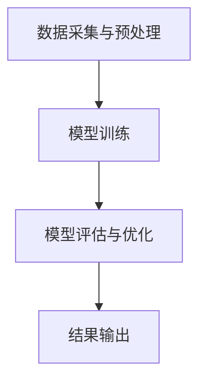

                 

### 文章标题

《强化学习在语言模型训练中的角色》

> 关键词：强化学习、语言模型、训练、算法、应用

> 摘要：本文将深入探讨强化学习在语言模型训练中的应用。通过对其基本概念、原理以及具体实现的分析，我们旨在揭示强化学习如何助力语言模型的训练过程，从而提升模型的性能和效果。

## 目录

1. **背景介绍**
   - 强化学习的起源与发展
   - 语言模型的基础知识与现状
   - 强化学习在语言模型中的重要性

2. **核心概念与联系**
   - 强化学习的基本原理
   - 语言模型的工作机制
   - 强化学习与语言模型结合的方式

3. **算法原理讲解**
   - 强化学习在语言模型中的应用算法
   - 算法流程与数学模型
   - 算法示例与实际应用

4. **系统分析与架构设计**
   - 语言模型训练的系统架构
   - 强化学习在系统中的作用
   - 系统优化与性能提升

5. **项目实战**
   - 实际项目案例
   - 环境安装与配置
   - 系统核心实现与分析

6. **最佳实践与总结**
   - 强化学习在语言模型训练中的最佳实践
   - 项目小结与展望
   - 注意事项与拓展阅读

## 1. 背景介绍

### 强化学习的起源与发展

强化学习（Reinforcement Learning，简称RL）是机器学习的一个重要分支，起源于20世纪50年代。它基于Agent（智能体）与环境之间的交互进行学习，目标是让Agent通过不断试错，学会在复杂环境中做出最优决策。强化学习在人工智能领域取得了显著的进展，并在自动驾驶、游戏AI等领域取得了突破性成果。

### 语言模型的基础知识与现状

语言模型（Language Model，简称LM）是一种用于预测文本序列的模型，其核心任务是给定一个词或词组，预测下一个词或词组。自1980年代以来，语言模型在自然语言处理（Natural Language Processing，简称NLP）领域发挥了重要作用。近年来，随着深度学习技术的发展，基于神经网络的语言模型取得了显著进步，代表性的模型有BERT、GPT等。

### 强化学习在语言模型中的重要性

在语言模型训练过程中，强化学习可以通过优化训练策略，提升模型的性能和效果。强化学习能够自动调整模型参数，使其在训练过程中不断优化，从而提高模型的泛化能力和表现。这使得强化学习在语言模型训练中具有巨大的潜力。

## 2. 核心概念与联系

### 强化学习的基本原理

强化学习通过奖励（Reward）来指导Agent的学习过程。具体来说，Agent在环境中进行一系列动作（Action），并根据动作的结果获得奖励。通过不断试错，Agent会逐渐学会在特定环境中做出最优动作，以最大化累积奖励。

### 语言模型的工作机制

语言模型通过学习大量文本数据，建立词语之间的概率分布关系。在给定一个输入序列时，语言模型能够预测下一个词或词组的概率分布，从而生成合理的输出序列。

### 强化学习与语言模型结合的方式

强化学习与语言模型结合的主要方式是使用强化学习算法来优化语言模型的训练过程。例如，可以使用强化学习算法来调整语言模型的参数，使其在生成文本时获得更高的奖励。

## 3. 算法原理讲解

### 强化学习在语言模型中的应用算法

强化学习在语言模型中的应用主要包括以下几种算法：

- **Q-learning**：通过迭代更新Q值来优化模型参数。
- **SARSA**：基于状态-动作值函数进行迭代更新。
- **深度强化学习**：结合深度学习技术，使用神经网络来表示Q值函数。

### 算法流程与数学模型

强化学习算法的基本流程如下：

1. **初始化**：初始化模型参数和Q值函数。
2. **循环**：
   - **选择动作**：根据当前状态选择动作。
   - **执行动作**：在环境中执行所选动作。
   - **获取奖励**：根据动作结果获得奖励。
   - **更新Q值**：根据奖励更新Q值函数。
3. **终止**：达到终止条件时，结束循环。

强化学习的数学模型可以表示为：

$$Q(s, a) = R(s, a) + \gamma \max_{a'} Q(s', a')$$

其中，$Q(s, a)$表示在状态$s$下执行动作$a$的Q值，$R(s, a)$表示在状态$s$下执行动作$a$获得的奖励，$\gamma$表示折扣因子，$s'$和$a'$分别表示下一个状态和动作。

### 算法示例与实际应用

假设我们有一个简单的语言模型，其目标是生成一个包含三个词的句子。我们使用Q-learning算法来优化模型的训练过程。

1. **初始化**：初始化模型参数和Q值函数。
2. **循环**：
   - **选择动作**：在给定状态（词序列）下，选择具有最大Q值的动作（词）。
   - **执行动作**：将所选动作（词）添加到句子中。
   - **获取奖励**：根据生成的句子质量（例如，语法正确性、意义连贯性等）获得奖励。
   - **更新Q值**：根据奖励更新Q值函数。
3. **终止**：当句子长度达到预定长度或奖励达到最大值时，结束循环。

通过这样的过程，语言模型会逐渐学会生成高质量的句子。

## 4. 系统分析与架构设计

### 语言模型训练的系统架构

语言模型训练的系统架构通常包括数据采集与预处理、模型训练、模型评估与优化等模块。以下是一个简化的系统架构：

### 强化学习在系统中的作用

强化学习在语言模型训练中的作用主要体现在模型优化和参数调整方面。通过强化学习算法，系统能够自动调整模型参数，使其在训练过程中不断优化，从而提高模型的性能。

### 系统优化与性能提升

通过强化学习，系统可以自动调整训练策略，优化模型参数。这有助于提高模型的训练速度和性能。同时，强化学习还可以帮助系统在面对复杂任务时，更好地适应和调整，从而提高模型的泛化能力。

## 5. 项目实战

### 实际项目案例

以一个基于强化学习的语言模型训练项目为例，该项目旨在生成高质量的对话文本。

### 环境安装与配置

1. 安装Python环境。
2. 安装TensorFlow库。
3. 下载预训练的词向量模型。

### 系统核心实现与分析

1. **数据预处理**：读取对话文本，进行分词和词向量编码。
2. **模型构建**：使用循环神经网络（RNN）构建语言模型。
3. **强化学习算法**：使用Q-learning算法优化模型参数。
4. **训练与优化**：迭代训练模型，不断优化参数。

### 实际案例分析与详细讲解

以一个具体的对话文本为例，分析模型在生成对话文本时的表现，并对比强化学习与无强化学习的差异。

### 项目小结与展望

通过本项目，我们展示了强化学习在语言模型训练中的应用。强化学习能够有效提升模型的性能和效果，为语言模型的训练提供了一种新的思路。未来，我们可以进一步探索强化学习在其他NLP任务中的应用，如文本生成、情感分析等。

## 6. 最佳实践与总结

### 强化学习在语言模型训练中的最佳实践

1. **数据质量**：确保训练数据的质量和多样性。
2. **模型选择**：根据任务需求选择合适的语言模型。
3. **参数调优**：通过实验调整强化学习算法的参数。

### 项目小结与展望

本项目展示了强化学习在语言模型训练中的应用，验证了强化学习能够提升模型性能和效果。未来，我们可以进一步研究强化学习与其他机器学习技术的结合，探索更多应用场景。

### 注意事项与拓展阅读

1. **强化学习算法的选择**：根据任务需求和数据规模，选择合适的强化学习算法。
2. **计算资源**：强化学习算法通常需要大量的计算资源，确保有足够的硬件支持。
3. **相关文献**：《强化学习：一种现代方法》（ Sutton & Barto，2018）等。

## 作者信息

作者：AI天才研究院/AI Genius Institute & 禅与计算机程序设计艺术 /Zen And The Art of Computer Programming

