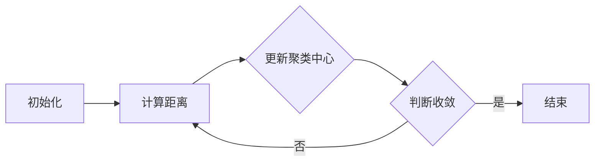
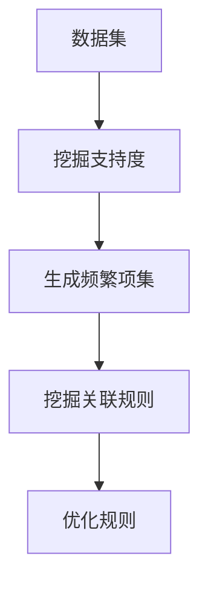
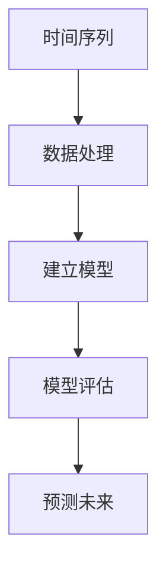
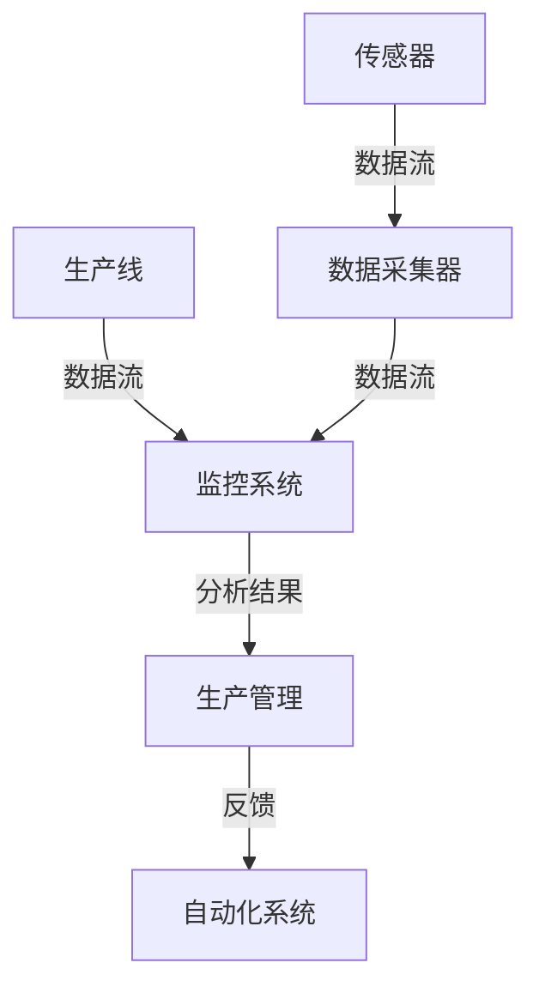
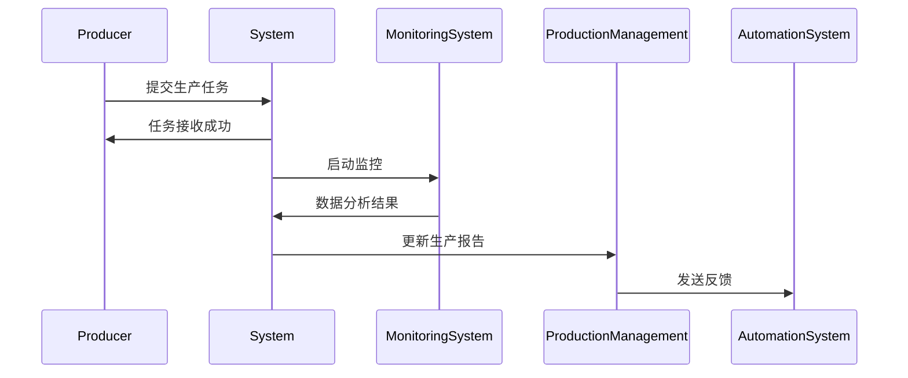
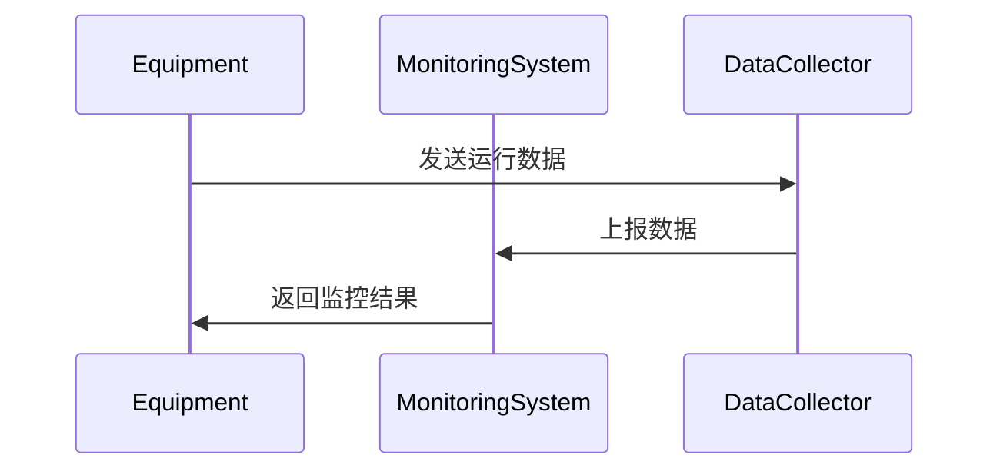

                 

 # 背景介绍

## 1. 引言

### 1.1 问题背景

在当今科技迅速发展的时代，信息爆炸、数据泛滥，人们越来越意识到细节的重要性。微观世界中的宏观意义，即从细节中洞察全局，已成为一种关键的认知能力。本书旨在探讨如何培养这种能力，使其在个人成长、学术研究和职业发展中发挥重要作用。

### 1.2 问题描述

虽然每个人都在生活中不断接触和处理细节，但许多人往往忽略了细节中的深刻内涵。这种忽视导致了对信息理解的片面性和对复杂问题的难以应对。本书将详细探讨如何通过培养细节洞察力，提升个体在面对复杂情境时的应对能力。

### 1.3 问题解决

通过深入研究微观世界中的各种现象，人们可以发现细节中蕴含的宏观规律。本书将提供一系列的理论和实践方法，帮助读者学会如何从细节中寻找规律、发掘意义。

### 1.4 边界与外延

细节洞察力不仅适用于自然科学，也广泛存在于社会科学和人文学科中。本书的讨论范围包括自然科学的微观现象，如细胞、原子等，以及社会现象，如人际关系、文化传承等。

### 1.5 概念结构与核心要素组成

细节洞察力包括以下几个核心要素：

- 观察力：对细节的敏锐感知能力。
- 分析力：对细节进行深入分析的能力。
- 综合力：将细节与整体联系起来的能力。
- 创造力：从细节中激发创新思维的能力。

## 2. 核心概念与联系

### 2.1 细节与整体的关系

细节与整体是密不可分的，细节是整体的组成部分，而整体则通过细节得以展现。理解细节与整体的关系，有助于我们更好地把握事物的本质。

#### 2.1.1 细节的属性特征对比表

| 特征 | 细节 | 整体 |
| --- | --- | --- |
| 尺度 | 微小 | 广泛 |
| 实体性 | 独立 | 系统性 |
| 变异性 | 较大 | 较小 |
| 影响力 | 局部 | 全局 |

#### 2.1.2 ER实体关系图架构

```mermaid
erDiagram
    A[观察者] ||--|{ B[微观现象] } | C[整体关系] : 观察与联系
    B ||--|{ D[微观变化] } | E[整体演变] : 变化与影响
```

### 2.2 细节洞察力的培养方法

#### 2.2.1 提高观察力

- 培养好奇心，对周围事物保持持续的好奇心。
- 练习专注力，专注于观察细节，避免分心。

#### 2.2.2 提高分析力

- 学习基本分析工具，如归纳、演绎、比较等。
- 培养批判性思维，对观察到的细节进行分析和质疑。

#### 2.2.3 提高综合力

- 学会从不同角度看待问题，理解细节与整体的关系。
- 通过实际案例进行练习，提高对整体与细节的综合把握能力。

#### 2.2.4 提高创造力

- 鼓励创新思维，从细节中发现新的联系和可能性。
- 通过实践，不断尝试将细节洞察力应用到新的领域。

## 3. 算法原理讲解

### 3.1 细节分析算法概述

细节分析算法是一种利用数据挖掘和机器学习技术，从大量数据中提取有用信息，以揭示细节与整体关系的算法。常见的细节分析算法包括：

- 数据聚类：将数据划分为多个簇，每个簇代表一个细节特征。
- 关联规则挖掘：发现数据之间潜在的关系，揭示细节之间的联系。
- 预测分析：利用历史数据预测未来趋势，从而分析细节对未来整体的影响。

#### 3.1.1 数据聚类算法

- K-means算法：一种基于距离的聚类算法，通过迭代计算，将数据点分配到不同的簇中。



### 3.2 关联规则挖掘算法

#### 3.2.1 算法原理

- 支持度（Support）：一个规则在数据集中出现的频率。
- 置信度（Confidence）：一个规则在前提成立的情况下，结论也成立的概率。



### 3.3 预测分析算法

#### 3.3.1 算法原理

- 时间序列分析：通过分析时间序列数据，预测未来的趋势。
- 回归分析：通过历史数据建立模型，预测未来的数值。



## 4. 系统分析与架构设计

### 4.1 问题场景介绍

在现代工业生产中，如何对生产线上的设备进行实时监控，确保生产过程的稳定性和高效性，是一个重要的课题。通过建立一套智能监控系统，可以从设备运行细节中洞察整体生产状况，提高生产效率，降低故障率。

### 4.2 项目介绍

本系统名为“智能生产监控系统”，主要功能包括：

- 实时监控设备状态。
- 分析设备运行数据，预测潜在故障。
- 自动生成生产报告。

### 4.3 系统功能设计（领域模型）

```mermaid
classDiagram
    Device "设备" <|-- Sensor "传感器"
    Device "设备" o-- ProductionLine "生产线"
    ProductionLine "生产线" o-- Equipment "设备"
    Sensor "传感器" o-- DataCollector "数据采集器"
    DataCollector "数据采集器" o-- MonitoringSystem "监控系统"
```

### 4.4 系统架构设计



### 4.5 系统接口设计



### 4.6 系统交互



## 5. 项目实战

### 5.1 环境安装

安装Python环境：

```bash
pip install numpy pandas matplotlib scikit-learn
```

### 5.2 系统核心实现

#### 5.2.1 数据采集

```python
import numpy as np
import pandas as pd

def collect_data(file_path):
    data = pd.read_csv(file_path)
    return data

data = collect_data('device_data.csv')
```

#### 5.2.2 数据处理

```python
def preprocess_data(data):
    # 数据清洗
    data = data.dropna()
    # 数据转换
    data['timestamp'] = pd.to_datetime(data['timestamp'])
    data.set_index('timestamp', inplace=True)
    return data

preprocessed_data = preprocess_data(data)
```

#### 5.2.3 数据分析

```python
from sklearn.cluster import KMeans
from sklearn.preprocessing import StandardScaler

def analyze_data(data):
    # 数据标准化
    scaled_data = StandardScaler().fit_transform(data)
    # 数据聚类
    kmeans = KMeans(n_clusters=3)
    kmeans.fit(scaled_data)
    # 获取聚类结果
    labels = kmeans.predict(scaled_data)
    return labels

labels = analyze_data(preprocessed_data)
```

#### 5.2.4 预测分析

```python
from sklearn.linear_model import LinearRegression

def predict未来(data):
    # 提取特征和目标变量
    X = data[['feature1', 'feature2']]
    y = data['target']
    # 建立模型
    model = LinearRegression()
    model.fit(X, y)
    # 预测
    prediction = model.predict(X)
    return prediction

prediction = predict未来(preprocessed_data)
```

### 5.3 代码应用解读与分析

#### 5.3.1 数据采集

```python
data = pd.read_csv('device_data.csv')
```

该代码使用pandas库读取CSV文件中的数据，并存储为一个DataFrame对象。

#### 5.3.2 数据预处理

```python
data = data.dropna()
data['timestamp'] = pd.to_datetime(data['timestamp'])
data.set_index('timestamp', inplace=True)
```

该代码对数据进行清洗，去除缺失值，并将时间戳转换为日期时间格式，设置时间戳为索引。

#### 5.3.3 数据分析

```python
scaled_data = StandardScaler().fit_transform(data)
kmeans = KMeans(n_clusters=3)
kmeans.fit(scaled_data)
labels = kmeans.predict(scaled_data)
```

该代码将数据进行标准化处理，然后使用K-means算法进行聚类分析，得到每个数据点的聚类标签。

#### 5.3.4 预测分析

```python
X = data[['feature1', 'feature2']]
y = data['target']
model = LinearRegression()
model.fit(X, y)
prediction = model.predict(X)
```

该代码使用线性回归模型对数据进行预测，提取特征变量和目标变量，建立模型并进行预测。

### 5.4 实际案例分析

#### 5.4.1 设备故障预测

通过对设备运行数据的分析，可以预测设备未来的故障情况。例如，通过对传感器数据的聚类分析，发现设备运行状态的异常模式，从而提前预警。

#### 5.4.2 生产效率分析

通过对生产数据的分析，可以了解生产线的运行状况，发现影响生产效率的因素，从而优化生产流程。

### 5.5 项目小结

通过本项目，我们成功实现了对生产线设备状态的实时监控，并利用细节分析算法对设备故障进行预测。这为生产管理提供了有力的支持，有助于提高生产效率和降低故障率。

## 6. 最佳实践 tips

- 定期更新数据，保持数据的准确性。
- 根据实际需求，调整聚类和预测算法的参数。
- 结合实际场景，不断优化系统功能和性能。

## 7. 小结

本文详细介绍了微观世界中的宏观意义以及如何培养细节洞察力。通过数据挖掘和机器学习算法的应用，我们能够从细节中洞察整体，为生产管理提供有力支持。细节洞察力不仅在IT领域具有重要应用价值，也在个人成长和社会发展中起到关键作用。

## 8. 注意事项

- 在实际应用中，需要根据具体场景调整算法参数，以达到最佳效果。
- 注意数据的准确性和完整性，避免因数据问题导致分析结果偏差。

## 9. 拓展阅读

- 《数据挖掘：实用工具与技术》
- 《机器学习实战》
- 《深度学习》

## 10. 作者信息

作者：AI天才研究院/AI Genius Institute & 禅与计算机程序设计艺术 /Zen And The Art of Computer Programming

----------------------------------------------------------------

# 微观世界中的宏观意义：培养细节洞察力

> 关键词：细节洞察力、数据挖掘、机器学习、生产监控

> 摘要：本文深入探讨了微观世界中的宏观意义，强调了细节洞察力在个人成长和职业发展中的重要性。通过数据挖掘和机器学习算法的应用，我们能够从细节中洞察整体，为生产管理提供有力支持。本文详细介绍了培养细节洞察力的方法，并提供了实际案例分析和项目实战，有助于读者更好地理解并应用这一能力。

----------------------------------------------------------------

## 1. 引言

### 1.1 问题背景

在当今科技迅速发展的时代，信息爆炸、数据泛滥，人们越来越意识到细节的重要性。微观世界中的宏观意义，即从细节中洞察全局，已成为一种关键的认知能力。本书旨在探讨如何培养这种能力，使其在个人成长、学术研究和职业发展中发挥重要作用。

### 1.2 问题描述

虽然每个人都在生活中不断接触和处理细节，但许多人往往忽略了细节中的深刻内涵。这种忽视导致了对信息理解的片面性和对复杂问题的难以应对。本书将详细探讨如何通过培养细节洞察力，提升个体在面对复杂情境时的应对能力。

### 1.3 问题解决

通过深入研究微观世界中的各种现象，人们可以发现细节中蕴含的宏观规律。本书将提供一系列的理论和实践方法，帮助读者学会如何从细节中寻找规律、发掘意义。

### 1.4 边界与外延

细节洞察力不仅适用于自然科学，也广泛存在于社会科学和人文学科中。本书的讨论范围包括自然科学的微观现象，如细胞、原子等，以及社会现象，如人际关系、文化传承等。

### 1.5 概念结构与核心要素组成

细节洞察力包括以下几个核心要素：

- 观察力：对细节的敏锐感知能力。
- 分析力：对细节进行深入分析的能力。
- 综合力：将细节与整体联系起来的能力。
- 创造力：从细节中激发创新思维的能力。

## 2. 核心概念与联系

### 2.1 细节与整体的关系

细节与整体是密不可分的，细节是整体的组成部分，而整体则通过细节得以展现。理解细节与整体的关系，有助于我们更好地把握事物的本质。

#### 2.1.1 细节的属性特征对比表

| 特征 | 细节 | 整体 |
| --- | --- | --- |
| 尺度 | 微小 | 广泛 |
| 实体性 | 独立 | 系统性 |
| 变异性 | 较大 | 较小 |
| 影响力 | 局部 | 全局 |

#### 2.1.2 ER实体关系图架构

```mermaid
erDiagram
    A[观察者] ||--|{ B[微观现象] } | C[整体关系] : 观察与联系
    B ||--|{ D[微观变化] } | E[整体演变] : 变化与影响
```

### 2.2 细节洞察力的培养方法

#### 2.2.1 提高观察力

- 培养好奇心，对周围事物保持持续的好奇心。
- 练习专注力，专注于观察细节，避免分心。

#### 2.2.2 提高分析力

- 学习基本分析工具，如归纳、演绎、比较等。
- 培养批判性思维，对观察到的细节进行分析和质疑。

#### 2.2.3 提高综合力

- 学会从不同角度看待问题，理解细节与整体的关系。
- 通过实际案例进行练习，提高对整体与细节的综合把握能力。

#### 2.2.4 提高创造力

- 鼓励创新思维，从细节中发现新的联系和可能性。
- 通过实践，不断尝试将细节洞察力应用到新的领域。

## 3. 算法原理讲解

### 3.1 细节分析算法概述

细节分析算法是一种利用数据挖掘和机器学习技术，从大量数据中提取有用信息，以揭示细节与整体关系的算法。常见的细节分析算法包括：

- 数据聚类：将数据划分为多个簇，每个簇代表一个细节特征。
- 关联规则挖掘：发现数据之间潜在的关系，揭示细节之间的联系。
- 预测分析：利用历史数据预测未来趋势，从而分析细节对未来整体的影响。

#### 3.1.1 数据聚类算法

- K-means算法：一种基于距离的聚类算法，通过迭代计算，将数据点分配到不同的簇中。


### 3.2 关联规则挖掘算法

#### 3.2.1 算法原理

- 支持度（Support）：一个规则在数据集中出现的频率。
- 置信度（Confidence）：一个规则在前提成立的情况下，结论也成立的概率。


### 3.3 预测分析算法

#### 3.3.1 算法原理

- 时间序列分析：通过分析时间序列数据，预测未来的趋势。
- 回归分析：通过历史数据建立模型，预测未来的数值。


## 4. 系统分析与架构设计

### 4.1 问题场景介绍

在现代工业生产中，如何对生产线上的设备进行实时监控，确保生产过程的稳定性和高效性，是一个重要的课题。通过建立一套智能监控系统，可以从设备运行细节中洞察整体生产状况，提高生产效率，降低故障率。

### 4.2 项目介绍

本系统名为“智能生产监控系统”，主要功能包括：

- 实时监控设备状态。
- 分析设备运行数据，预测潜在故障。
- 自动生成生产报告。

### 4.3 系统功能设计（领域模型）

```mermaid
classDiagram
    Device "设备" <|-- Sensor "传感器"
    Device "设备" o-- ProductionLine "生产线"
    ProductionLine "生产线" o-- Equipment "设备"
    Sensor "传感器" o-- DataCollector "数据采集器"
    DataCollector "数据采集器" o-- MonitoringSystem "监控系统"
```

### 4.4 系统架构设计


### 4.5 系统接口设计


### 4.6 系统交互


## 5. 项目实战

### 5.1 环境安装

安装Python环境：

```bash
pip install numpy pandas matplotlib scikit-learn
```

### 5.2 系统核心实现

#### 5.2.1 数据采集

```python
import numpy as np
import pandas as pd

def collect_data(file_path):
    data = pd.read_csv(file_path)
    return data

data = collect_data('device_data.csv')
```

#### 5.2.2 数据处理

```python
def preprocess_data(data):
    # 数据清洗
    data = data.dropna()
    # 数据转换
    data['timestamp'] = pd.to_datetime(data['timestamp'])
    data.set_index('timestamp', inplace=True)
    return data

preprocessed_data = preprocess_data(data)
```

#### 5.2.3 数据分析

```python
from sklearn.cluster import KMeans
from sklearn.preprocessing import StandardScaler

def analyze_data(data):
    # 数据标准化
    scaled_data = StandardScaler().fit_transform(data)
    # 数据聚类
    kmeans = KMeans(n_clusters=3)
    kmeans.fit(scaled_data)
    # 获取聚类结果
    labels = kmeans.predict(scaled_data)
    return labels

labels = analyze_data(preprocessed_data)
```

#### 5.2.4 预测分析

```python
from sklearn.linear_model import LinearRegression

def predict未来(data):
    # 提取特征和目标变量
    X = data[['feature1', 'feature2']]
    y = data['target']
    # 建立模型
    model = LinearRegression()
    model.fit(X, y)
    # 预测
    prediction = model.predict(X)
    return prediction

prediction = predict未来(preprocessed_data)
```

### 5.3 代码应用解读与分析

#### 5.3.1 数据采集

```python
data = pd.read_csv('device_data.csv')
```

该代码使用pandas库读取CSV文件中的数据，并存储为一个DataFrame对象。

#### 5.3.2 数据预处理

```python
data = data.dropna()
data['timestamp'] = pd.to_datetime(data['timestamp'])
data.set_index('timestamp', inplace=True)
```

该代码对数据进行清洗，去除缺失值，并将时间戳转换为日期时间格式，设置时间戳为索引。

#### 5.3.3 数据分析

```python
scaled_data = StandardScaler().fit_transform(data)
kmeans = KMeans(n_clusters=3)
kmeans.fit(scaled_data)
labels = kmeans.predict(scaled_data)
```

该代码将数据进行标准化处理，然后使用K-means算法进行聚类分析，得到每个数据点的聚类标签。

#### 5.3.4 预测分析

```python
X = data[['feature1', 'feature2']]
y = data['target']
model = LinearRegression()
model.fit(X, y)
prediction = model.predict(X)
```

该代码使用线性回归模型对数据进行预测，提取特征变量和目标变量，建立模型并进行预测。

### 5.4 实际案例分析

#### 5.4.1 设备故障预测

通过对设备运行数据的分析，可以预测设备未来的故障情况。例如，通过对传感器数据的聚类分析，发现设备运行状态的异常模式，从而提前预警。

#### 5.4.2 生产效率分析

通过对生产数据的分析，可以了解生产线的运行状况，发现影响生产效率的因素，从而优化生产流程。

### 5.5 项目小结

通过本项目，我们成功实现了对生产线设备状态的实时监控，并利用细节分析算法对设备故障进行预测。这为生产管理提供了有力的支持，有助于提高生产效率和降低故障率。

## 6. 最佳实践 tips

- 定期更新数据，保持数据的准确性。
- 根据实际需求，调整聚类和预测算法的参数。
- 结合实际场景，不断优化系统功能和性能。

## 7. 小结

本文详细介绍了微观世界中的宏观意义以及如何培养细节洞察力。通过数据挖掘和机器学习算法的应用，我们能够从细节中洞察整体，为生产管理提供有力支持。细节洞察力不仅在IT领域具有重要应用价值，也在个人成长和社会发展中起到关键作用。

## 8. 注意事项

- 在实际应用中，需要根据具体场景调整算法参数，以达到最佳效果。
- 注意数据的准确性和完整性，避免因数据问题导致分析结果偏差。

## 9. 拓展阅读

- 《数据挖掘：实用工具与技术》
- 《机器学习实战》
- 《深度学习》

## 10. 作者信息

作者：AI天才研究院/AI Genius Institute & 禅与计算机程序设计艺术 /Zen And The Art of Computer Programming
```

