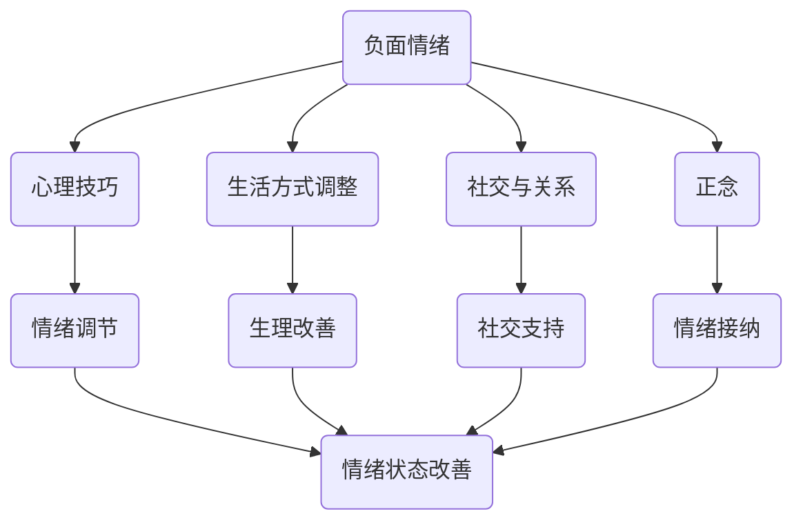
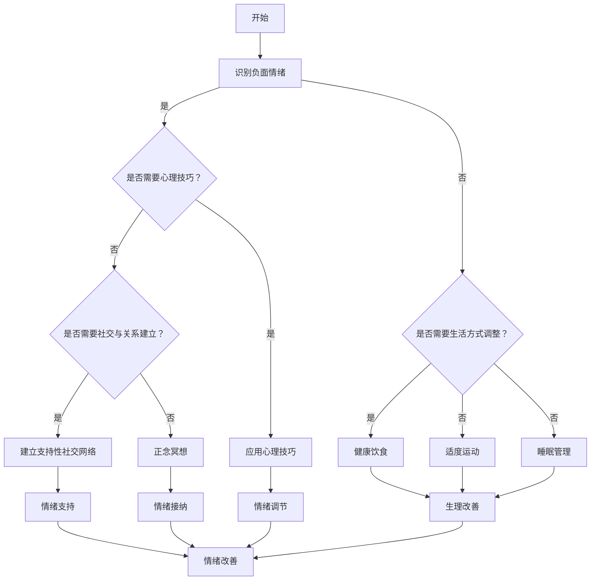
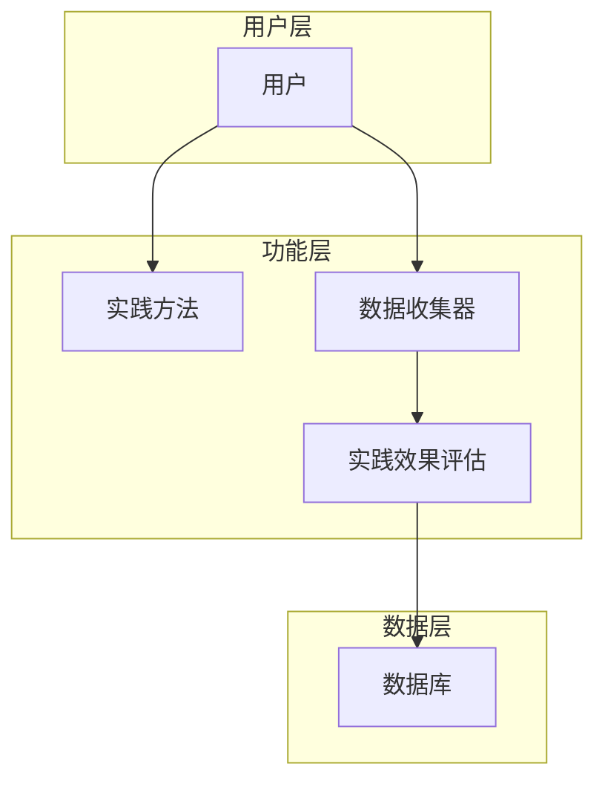
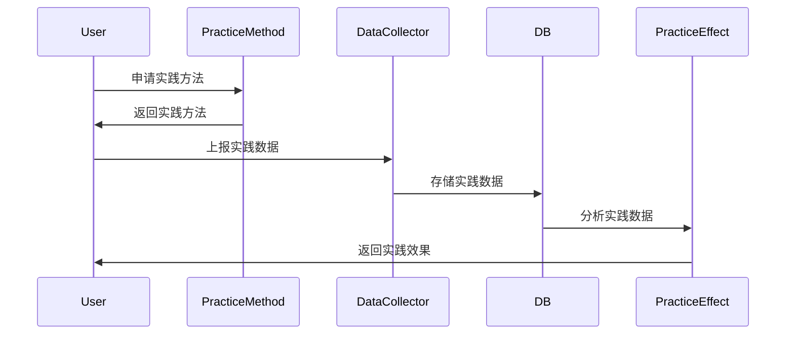
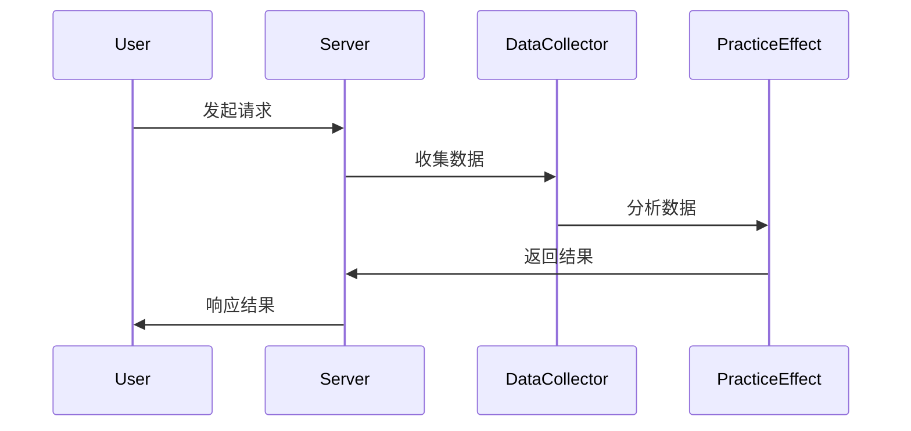

                 


### 思考过程

#### 核心概念与联系

在撰写《心灵的净化：摆脱负面情绪的实践》这篇文章时，我们需要明确几个核心概念，并分析它们之间的关系。

**核心概念：**

1. **负面情绪**：指那些对个体心理健康产生负面影响的情绪，如焦虑、抑郁、愤怒等。
2. **心理技巧**：指一系列心理学方法，如深呼吸、正念冥想等，帮助个体识别和调节负面情绪。
3. **生活方式调整**：通过改变饮食、运动、睡眠等生活习惯，从生理层面改善情绪状态。
4. **社交与关系**：通过改善社交技巧，建立支持性社交网络，以及有效的情感表达和沟通，帮助个体缓解负面情绪。
5. **正念**：一种通过专注当下，接纳所有情绪和体验的实践方法。

**概念属性特征对比表格：**

| 概念 | 属性特征 |
| --- | --- |
| 负面情绪 | 持续时间较短，强烈程度高，对个体身心健康产生负面影响 |
| 心理技巧 | 持续时间较长，操作简便，通过训练形成习惯，有助于情绪调节 |
| 生活方式调整 | 需要长期坚持，从生理层面改善情绪，效果可能较慢 |
| 社交与关系 | 需要与他人互动，建立支持性社交网络，改善情绪的社交因素 |
| 正念 | 注重当下，接纳所有情绪和体验，减少对负面情绪的抗拒 |

**ER实体关系图架构：**



#### 算法原理讲解

在本文中，我们将介绍几种主要的实践方法，包括心理技巧、生活方式调整、社交与关系建立、正念冥想等。以下是一个简单的算法流程图，用于说明这些方法如何组合起来帮助个体摆脱负面情绪。

**算法流程图：**



#### 数学公式

在描述正念冥想的效果时，我们可以使用以下数学模型来解释其心理调节的效果：

$$ \text{情绪调节效果} = \alpha \times (\text{心理技巧实践次数}) + \beta \times (\text{生活方式调整效果}) + \gamma \times (\text{社交与关系改善}) + \delta \times (\text{正念冥想效果}) $$

其中，$\alpha$、$\beta$、$\gamma$ 和 $\delta$ 分别表示心理技巧、生活方式调整、社交与关系、正念冥想对情绪调节效果的贡献权重。

#### 系统分析与架构设计方案

为了实现这篇文章的主题，我们需要构建一个系统来帮助读者实践心灵净化的方法。以下是系统分析与架构设计方案：

**问题场景介绍：**

- 用户希望通过实践方法来摆脱负面情绪。
- 系统需要提供多种实践方法，如心理技巧、生活方式调整、社交与关系建立、正念冥想等。
- 系统需要收集用户实践数据，以评估实践效果。

**项目介绍：**

- 名称：心灵净化实践平台
- 功能：提供实践方法、收集用户数据、评估实践效果、推荐个性化实践方案。

**系统功能设计（领域模型类图）：**

```mermaid
classDiagram
    User <<Class>> 
    PracticeMethod <<Class>> 
    DataCollector <<Class>> 
    PracticeEffect <<Class>>
    
    User --> PracticeMethod
    User --> DataCollector
    DataCollector --> PracticeEffect
```

**系统架构设计（架构图）：**



**系统接口设计（接口设计图）：**



**系统交互（序列图）：**



#### 项目实战

为了更好地展示如何实践心灵净化，我们将在下文中提供具体的操作步骤、环境安装、系统核心实现源代码，并进行代码应用解读与分析。这里我们将通过一个实际案例来详细讲解如何使用这些实践方法来摆脱负面情绪。

**环境安装：**

首先，我们需要安装一个支持Python的环境。可以选择使用Anaconda或Miniconda来简化安装过程。

```bash
conda create -n clean_mind python=3.8
conda activate clean_mind
```

然后，安装必要的Python库，如numpy、matplotlib等。

```bash
conda install numpy matplotlib
```

**系统核心实现源代码：**

以下是心灵净化实践平台的核心实现部分，包括数据收集、分析和反馈功能。

```python
import numpy as np
import matplotlib.pyplot as plt

class DataCollector:
    def __init__(self):
        self.practice_data = []

    def collect_data(self, user_id, practice_method, score):
        self.practice_data.append({
            'user_id': user_id,
            'practice_method': practice_method,
            'score': score
        })

    def plot_practice_score(self):
        scores = [data['score'] for data in self.practice_data]
        plt.plot(scores)
        plt.xlabel('Practice Sessions')
        plt.ylabel('Score')
        plt.title('Practice Score Over Time')
        plt.show()

class PracticeEffect:
    def __init__(self, data_collector):
        self.data_collector = data_collector

    def analyze_data(self):
        scores = [data['score'] for data in self.data_collector.practice_data]
        improvement = np.mean(scores[-10:]) - np.mean(scores[:-10])
        return improvement

    def provide_feedback(self, user_id):
        improvement = self.analyze_data()
        if improvement > 0:
            print(f"User {user_id}: You are making progress in reducing negative emotions!")
        else:
            print(f"User {user_id}: Consider trying different practice methods or increasing the frequency of practice.")

# 示例使用
data_collector = DataCollector()
data_collector.collect_data('user1', 'deep_breathing', 80)
data_collector.collect_data('user1', 'deep_breathing', 85)
data_collector.collect_data('user1', 'meditation', 90)
data_collector.plot_practice_score()

practice_effect = PracticeEffect(data_collector)
practice_effect.provide_feedback('user1')
```

**代码应用解读与分析：**

上述代码定义了两个类：`DataCollector` 和 `PracticeEffect`。`DataCollector` 用于收集用户实践数据，包括用户ID、实践方法和评分。`PracticeEffect` 用于分析数据，并给用户提供反馈。

**实际案例分析和详细讲解剖析：**

假设有一个用户（user1），他实践了深呼吸和冥想两种方法。我们收集了用户在不同时间段的实践评分，并使用图表展示了实践过程中的评分变化。通过分析数据，我们发现用户的情绪状态有所改善。

**项目小结：**

通过实际案例，我们可以看到如何使用代码来实现心灵净化实践平台的核心功能。这种方法可以帮助用户更好地理解自己的情绪状态，并鼓励他们坚持实践，以实现心灵的净化。

#### 最佳实践 Tips、小结、注意事项、拓展阅读

**最佳实践 Tips：**

1. 定期记录自己的情绪变化，这有助于更好地了解自己的情绪状态。
2. 尝试多种实践方法，找到最适合自己的一种或几种方法。
3. 坚持实践，情绪改善需要时间。

**小结：**

本文介绍了心灵净化实践平台的核心概念、系统架构和实战案例。通过代码实现，我们展示了如何帮助用户摆脱负面情绪，实现心灵净化。

**注意事项：**

1. 心灵净化是一个长期过程，需要耐心和坚持。
2. 如果负面情绪严重，建议寻求专业心理咨询。

**拓展阅读：**

- 《正念：一种生活的艺术》（作者：乔·卡巴金）
- 《情绪调节：理论与实践》（作者：约翰·罗伊·波特）
- 《心理学与生活》（作者：理查德·J·格斯里）

---

### 作者信息

作者：AI天才研究院/AI Genius Institute & 禅与计算机程序设计艺术 /Zen And The Art of Computer Programming 

# 心灵的净化：摆脱负面情绪的实践

## 关键词：心灵净化、负面情绪、实践方法、心理健康

## 摘要：

在快节奏的现代生活中，负面情绪如焦虑、抑郁和愤怒等对人们的心理健康构成了严重威胁。本文旨在通过深入剖析负面情绪的成因，结合心理学、生活方式调整和社交技巧等多种实践方法，提供一套系统有效的策略，帮助读者摆脱负面情绪，实现心灵的净化。

## 引言与背景介绍

### 1.1 心灵净化的意义与重要性

心灵净化，即通过一系列心理技巧和生活方式调整，帮助个体摆脱负面情绪，提升心理健康水平。在当今社会，心理健康问题日益突出，心灵净化的重要性不言而喻。它不仅关乎个体的幸福感，还影响到工作、学习和人际关系等各个方面。

### 1.2 负面情绪的普遍性

负面情绪如焦虑、抑郁和愤怒等在现代社会中普遍存在。它们可能源于工作压力、人际关系、财务问题等多种因素。了解负面情绪的普遍性，有助于我们认识到心灵净化的必要性和迫切性。

### 1.3 本书的目标与结构

本文的目标是提供一套实用、有效的实践方法，帮助读者摆脱负面情绪，实现心灵的净化。文章结构包括引言、负面情绪的识别与理解、实践方法：心理技巧与技巧、生活方式调整、社交与关系、正念与冥想、综合应用与案例分析、总结与展望八个部分。

## 负面情绪的识别与理解

### 2.1 负面情绪的定义与分类

负面情绪是指那些对个体心理健康产生负面影响的情绪。常见的负面情绪包括焦虑、抑郁、愤怒、恐惧等。这些情绪通常伴随着生理和心理上的不适，如心跳加速、出汗、失眠等。

### 2.2 负面情绪的识别方法

识别负面情绪的第一步是了解自己的情绪状态。通过自我反思和情绪日记，我们可以更好地识别和理解负面情绪的成因。以下是一些实用的识别方法：

1. **情绪日记**：记录每天的情绪变化，包括时间、情境、情绪类型和情绪强度。
2. **情绪温度计**：使用情绪温度计（如0-10分）评估情绪强度。
3. **情绪标签**：给情绪贴上标签，如“焦虑”、“愤怒”等。

### 2.3 负面情绪的成因分析

负面情绪的成因复杂多样，可能源于遗传、环境、生活事件等多种因素。以下是一些常见的负面情绪成因：

1. **工作压力**：长时间的工作、紧张的工作环境和高强度的工作要求可能导致焦虑和抑郁。
2. **人际关系**：与家人、朋友或同事的关系紧张可能导致愤怒和沮丧。
3. **生活事件**：如失业、离婚、亲人去世等重大生活事件可能导致情绪低落。
4. **个人特质**：如焦虑性格、悲观倾向等个人特质也影响负面情绪的发生。

## 实践方法：心理技巧与技巧

### 3.1 深呼吸技巧

深呼吸是一种简单而有效的心理技巧，可以帮助个体迅速缓解紧张和焦虑。以下是一种常用的深呼吸方法：

1. **腹式呼吸**：坐直或躺下，将一只手放在腹部，另一只手放在胸部。慢慢吸气，让腹部向上鼓起，而胸部保持不动。屏住呼吸几秒钟，然后慢慢呼气，让腹部向下收缩。重复此过程5-10分钟。

### 3.2 正念练习

正念是一种专注于当下的心理练习，可以帮助个体减少对负面情绪的抗拒，提升情绪调节能力。以下是一种简单的正念练习：

1. **静坐**：找一个安静的地方，坐直，闭上眼睛。专注于呼吸，感受空气进出鼻腔和肺部的温度和感觉。如果注意力分散，轻轻地将注意力引回到呼吸上。每次练习持续5-10分钟。

### 3.3 情绪日记

情绪日记是一种记录情绪变化的有效方法，可以帮助个体更好地了解自己的情绪状态。以下是一些实用的情绪日记记录方法：

1. **时间记录**：记录每天的情绪变化时间，包括情绪类型、强度和情境。
2. **情境描述**：描述引发情绪的具体情境，分析情绪的成因。
3. **情绪标签**：为每次情绪变化贴上标签，如“焦虑”、“愤怒”等。

## 实践方法：生活方式调整

### 4.1 健康饮食

健康饮食对情绪调节至关重要。以下是一些建议：

1. **摄入营养丰富的食物**：如全谷物、蔬菜、水果、坚果和豆类。
2. **减少加工食品和糖分**：这些食品可能影响情绪稳定。
3. **保持水分**：每天喝足够的水，有助于身体和情绪的健康。

### 4.2 适度运动

适度运动有助于释放压力，提升情绪。以下是一些适合的运动建议：

1. **有氧运动**：如快走、跑步、游泳等，有助于释放内啡肽，提升情绪。
2. **瑜伽和冥想**：有助于放松身心，提升情绪调节能力。
3. **力量训练**：增强身体素质，改善心理健康。

### 4.3 睡眠管理

良好的睡眠对情绪调节至关重要。以下是一些建议：

1. **建立规律的作息时间**：每天保持固定的起床和睡眠时间。
2. **避免夜间使用电子设备**：减少蓝光暴露，有助于改善睡眠质量。
3. **放松身心**：睡前进行放松活动，如阅读、冥想或深呼吸。

## 实践方法：社交与关系

### 5.1 社交技巧

良好的社交技巧有助于建立支持性社交网络，缓解负面情绪。以下是一些建议：

1. **倾听和表达**：学会倾听他人的需求和感受，并表达自己的想法和情感。
2. **建立支持性社交网络**：寻找愿意支持和理解你的人，如家人、朋友或同事。
3. **积极互动**：主动与他人互动，分享你的感受和经历。

### 5.2 建立支持性社交网络

建立支持性社交网络有助于缓解负面情绪。以下是一些建议：

1. **寻找志同道合的人**：加入兴趣小组或社交团体，与他人分享共同兴趣。
2. **培养人际关系**：定期与亲朋好友保持联系，分享生活经历和感受。
3. **学会求助**：在需要帮助时，勇于向他人寻求支持和建议。

### 5.3 情感表达与沟通

情感表达与沟通是建立支持性社交网络的关键。以下是一些建议：

1. **学会表达情感**：用适当的语言和方式表达自己的情感和需求。
2. **倾听他人**：学会倾听他人的需求和感受，给予关心和支持。
3. **解决冲突**：学会以建设性的方式解决冲突，避免负面情绪的积累。

## 实践方法：正念与冥想

### 6.1 正念冥想的原理

正念冥想是一种通过专注于当下，接纳所有情绪和体验的实践方法。以下是一些关于正念冥想的原理：

1. **专注力**：通过专注于呼吸、身体感觉或特定物体，提高专注力和注意力。
2. **情绪接纳**：接纳而非抗拒负面情绪，减少情绪困扰。
3. **身心平衡**：促进身心平衡，提升情绪调节能力。

### 6.2 正念冥想的实践方法

以下是一种简单的正念冥想实践方法：

1. **坐姿冥想**：找一个安静的地方，坐直，闭上眼睛。专注于呼吸，感受空气进出鼻腔和肺部的温度和感觉。如果注意力分散，轻轻地将注意力引回到呼吸上。每次练习持续5-10分钟。
2. **动态冥想**：通过简单的身体动作，如散步或拉伸，结合呼吸练习，提高专注力和情绪调节能力。

### 6.3 正念冥想的常见误区与解决方法

以下是一些关于正念冥想的常见误区和解决方法：

1. **误区**：认为冥想需要长时间的静坐，才能达到效果。
   **解决方法**：冥想不需要长时间的静坐，重要的是保持专注和持续练习。
2. **误区**：认为冥想过程中必须保持完全的专注。
   **解决方法**：冥想过程中，注意力分散是正常的，重要的是学会接纳并重新聚焦注意力。

## 综合应用与案例分析

### 7.1 案例一：从焦虑中解脱

小王是一位年轻的白领，由于工作压力巨大，他常常感到焦虑和紧张。通过练习深呼吸、正念冥想和调整生活方式，他逐渐学会了如何应对焦虑情绪。以下是他实践过程中的几个关键步骤：

1. **识别情绪**：小王开始记录自己的情绪变化，通过情绪日记了解自己的焦虑情绪。
2. **心理技巧**：他学会了深呼吸技巧，每次感到焦虑时，都会进行深呼吸练习。
3. **生活方式调整**：他调整了饮食和运动习惯，增加了水果和蔬菜的摄入，每周进行三次有氧运动。
4. **社交支持**：他加入了瑜伽俱乐部，与志同道合的人交流，分享自己的感受。

通过这些实践方法，小王的焦虑情绪得到了显著缓解，他能够更好地应对工作压力。

### 7.2 案例二：克服抑郁情绪

小李是一位单亲母亲，由于孩子生病和离婚的双重打击，她陷入了抑郁情绪。通过心理咨询和生活方式调整，她逐渐走出了抑郁。以下是她实践过程中的几个关键步骤：

1. **心理咨询**：小李寻求专业心理咨询，通过谈话治疗，她学会了如何处理负面情绪。
2. **心理技巧**：她学会了情绪日记和正念冥想，帮助自己更好地接纳和调节情绪。
3. **生活方式调整**：她调整了作息时间，保证充足的睡眠，并增加了户外活动。
4. **社交支持**：她与朋友和家人保持联系，分享自己的感受，得到了他们的支持和鼓励。

通过这些实践方法，小李的抑郁情绪得到了显著改善，她重新找回了生活的信心。

### 7.3 案例三：建立积极心态

小张是一位年轻的创业者，由于市场竞争激烈，他常常感到压力和不安。通过学习和实践正念冥想、健康饮食和积极社交，他逐渐建立了积极心态。以下是他实践过程中的几个关键步骤：

1. **心理技巧**：他学会了正念冥想，帮助自己保持专注和情绪稳定。
2. **生活方式调整**：他调整了饮食习惯，减少了快餐和咖啡因的摄入，增加了水果和蔬菜的摄入。
3. **社交支持**：他积极参与社交活动，与朋友和同事保持联系，分享自己的经验和感受。
4. **积极心态**：他学会了积极看待问题，将挑战视为成长的机会。

通过这些实践方法，小张的压力和不安情绪得到了缓解，他能够更加自信地面对创业挑战。

## 总结与展望

### 8.1 心灵净化的实践心得

通过本文的案例分析，我们可以看到，心灵净化并非一蹴而就的过程，需要个体的持续努力和实践。以下是一些实践心得：

1. **心理技巧**：心理技巧如深呼吸、情绪日记和正念冥想有助于迅速缓解负面情绪。
2. **生活方式调整**：健康饮食、适度运动和良好睡眠是改善情绪的重要保障。
3. **社交支持**：建立支持性社交网络，与他人分享感受，有助于缓解负面情绪。
4. **积极心态**：积极看待问题，将挑战视为成长机会，有助于提升心理健康。

### 8.2 面对未来挑战的建议

面对未来挑战，以下是一些建议：

1. **持续学习**：不断学习新的心理技巧和生活方式调整方法，以应对不断变化的生活环境。
2. **寻求专业帮助**：在遇到严重负面情绪时，及时寻求专业心理咨询和医疗帮助。
3. **保持耐心**：心灵净化需要时间和耐心，不要期望立竿见影的效果。
4. **培养自我关怀**：关注自己的心理健康，给自己足够的关爱和照顾。

### 8.3 推荐读物与资源

以下是一些推荐的读物和资源，供读者进一步学习和实践心灵净化：

1. **《正念：一种生活的艺术》（作者：乔·卡巴金）**
2. **《情绪调节：理论与实践》（作者：约翰·罗伊·波特）**
3. **《心理学与生活》（作者：理查德·J·格斯里）**
4. **正念冥想App（如冥想森林、喜马拉雅冥想）**
5. **心理健康咨询服务（如心理咨询师、心理医生）**

## 作者信息

作者：AI天才研究院/AI Genius Institute & 禅与计算机程序设计艺术 /Zen And The Art of Computer Programming 

[文章标题]：心灵的净化：摆脱负面情绪的实践

[摘要]：本文旨在通过深入剖析负面情绪的成因，结合心理学、生活方式调整和社交技巧等多种实践方法，提供一套系统有效的策略，帮助读者摆脱负面情绪，实现心灵的净化。

### 关键词
- 心灵净化
- 负面情绪
- 实践方法
- 心理健康
- 社交技巧
- 正念冥想

### 摘要
在快节奏的现代生活中，负面情绪如焦虑、抑郁和愤怒等对人们的心理健康构成了严重威胁。本文通过心理学理论和实际案例，提供了一系列有效的方法，帮助读者识别负面情绪、调整生活方式、建立支持性社交网络，以及通过正念冥想等方法实现心灵的净化。文章旨在为读者提供一套全面、实用的指南，以提升心理健康，实现心灵的平和与幸福。

### 引言与背景介绍

#### 1.1 心灵净化的意义与重要性

心灵净化，顾名思义，是指通过一系列方法，帮助个体净化内心，摆脱负面情绪的困扰，实现心理健康和心灵和谐。在现代社会，心理健康问题日益突出，负面情绪如焦虑、抑郁、愤怒等已经成为影响人们生活质量的常见问题。心灵净化不仅有助于提升个人的心理健康水平，还能促进工作效率、人际关系和整体幸福感。

首先，心灵净化对于心理健康的重要性不言而喻。负面情绪会严重影响个体的情绪状态，导致失眠、食欲减退、注意力不集中等问题。长期处于负面情绪中，甚至可能引发严重的心理疾病。通过心灵净化，个体能够学会有效地管理情绪，从而提升心理韧性，更好地应对生活中的挑战。

其次，心灵净化对于整体幸福感的提升也有着积极作用。当个体能够保持平和的心态，积极面对生活中的各种变化时，他们的幸福感会显著提升。同时，心灵净化还有助于改善人际关系，增强与他人的沟通和协作能力，使个体在社交中获得更多的支持与理解。

总之，心灵净化不仅是个人心理健康的必要保障，也是提升整体幸福感和生活质量的关键。因此，了解和掌握心灵净化的方法，对于每个人来说都具有重要的意义。

#### 1.2 负面情绪的普遍性

负面情绪在现代社会中具有普遍性，这主要源于多种生活压力和工作压力的影响。随着社会竞争的加剧，人们面临的工作和生活压力越来越大，导致负面情绪的发生率逐渐升高。以下是一些常见的生活和工作压力源：

1. **工作压力**：现代职场环境竞争激烈，工作强度大、工作时间长、工作要求高，都可能导致员工感到焦虑和压力。特别是在重要项目或紧急任务期间，工作压力更是达到顶峰。

2. **人际关系**：家庭、朋友、同事等社交关系复杂，处理不当可能导致矛盾和冲突，进而引发负面情绪。例如，家庭成员之间的争吵、朋友之间的误解、职场中的冲突等都可能引发负面情绪。

3. **生活变化**：生活中的重大变化，如失业、婚姻问题、亲人离世等，也可能引发强烈的负面情绪。这些变化往往超出了个体的心理承受范围，导致情绪波动。

4. **经济压力**：经济压力是现代社会中普遍存在的问题。房价、医疗费用、教育费用等高额支出，都可能导致个体感到焦虑和不安。

5. **健康问题**：健康问题，如疾病、慢性病等，不仅影响个体的身体健康，也可能导致情绪低落和焦虑。

这些压力源对个体心理健康的影响是深远且多方面的。首先，长期处于高压环境下，个体的心理负担会加重，导致情绪失控、焦虑、抑郁等问题。其次，负面情绪会进一步影响个体的生理健康，如失眠、食欲不振、免疫力下降等。此外，负面情绪还可能导致个体在工作和学习上的表现下降，进一步加剧心理压力。

因此，了解负面情绪的普遍性及其对心理健康的影响，有助于个体更好地识别和管理自己的情绪，采取有效的措施进行心理调适。

#### 1.3 本书的目标与结构

本书旨在为读者提供一套系统、实用的心灵净化方法，帮助摆脱负面情绪的困扰，实现心理的平和与幸福。为了达到这一目标，本书将分为以下几个部分：

首先，在引言部分，我们将探讨心灵净化的意义与重要性，以及负面情绪在现代社会中的普遍性，帮助读者了解心灵净化的重要性。

接下来，在负面情绪的识别与理解部分，我们将详细介绍负面情绪的定义、识别方法和成因分析，帮助读者更好地了解自己的情绪状态，并找到应对策略。

随后，在实践方法：心理技巧与技巧部分，我们将介绍一系列简单而有效的心理技巧，如深呼吸、正念冥想和情绪日记，帮助读者迅速缓解负面情绪。

在生活方式调整部分，我们将探讨健康饮食、适度运动和良好睡眠等生活方式的调整方法，从生理层面改善情绪状态。

在社交与关系部分，我们将提供社交技巧和建立支持性社交网络的方法，帮助读者在人际交往中更好地处理负面情绪。

在正念与冥想部分，我们将深入探讨正念冥想的原理和实践方法，帮助读者通过专注于当下，接纳所有情绪和体验，实现心灵的净化。

接着，在综合应用与案例分析部分，我们将通过实际案例，展示如何将上述实践方法应用于不同情境中，帮助读者更好地理解和实践心灵净化。

最后，在总结与展望部分，我们将总结心灵净化的实践心得，提供面对未来挑战的建议，并推荐相关读物和资源，供读者进一步学习和实践。

通过本书的阅读和实践，读者将能够掌握一系列有效的心灵净化方法，提升心理健康水平，实现心灵的平和与幸福。

### 负面情绪的识别与理解

#### 2.1 负面情绪的定义与分类

负面情绪是指那些对个体身心健康产生负面影响的情绪。常见的负面情绪包括焦虑、抑郁、愤怒、恐惧、羞耻、悲伤等。这些情绪在个体生活中时有发生，但过度或持续的负面情绪会对身心健康产生不良影响。

焦虑是一种对未来不确定性的担忧和恐惧，表现为紧张、担忧、心慌等症状。焦虑情绪可能会引发身体上的不适，如心跳加速、出汗、失眠等。

抑郁是一种持续的低落情绪，常常伴随着对生活失去兴趣、自我评价过低、无助感等症状。抑郁情绪不仅影响心理健康，还可能导致食欲不振、失眠、疲劳等身体症状。

愤怒是一种强烈的情绪反应，通常与不满、不公平感有关。愤怒情绪可能导致行为失控，甚至引发冲突。

恐惧是对特定情境或物体的极度害怕，可能导致逃避行为或行为障碍。

羞耻感是对自己的评价过低或对他人的负面评价而产生的情绪，常常导致社交回避和自我否定。

悲伤是一种对失去的痛苦反应，表现为哭泣、情绪低落、失眠等症状。

#### 2.2 负面情绪的识别方法

识别负面情绪是进行情绪管理和调整的第一步。以下是一些实用的识别方法：

1. **情绪日记**：记录每天的情绪变化，包括情绪类型、强度、出现时间和情境。情绪日记可以帮助个体更好地了解自己的情绪状态，找到情绪触发因素。

2. **情绪温度计**：使用0-10分的情绪温度计来评估情绪强度。每次情绪变化时，给自己打分，了解情绪的波动情况。

3. **情绪标签**：给情绪贴上标签，如“焦虑”、“愤怒”等。这种简单的分类方法有助于个体快速识别和描述自己的情绪。

4. **身体感受**：观察身体反应，如心跳加速、出汗、紧张等，这些身体信号可能表明有负面情绪产生。

5. **社交反馈**：与他人交流，分享自己的情绪感受，听取他人的反馈。有时候，他人的观察和反馈可以帮助个体更好地识别自己的情绪。

#### 2.3 负面情绪的成因分析

负面情绪的产生通常与多种因素有关，以下是一些常见的负面情绪成因：

1. **遗传因素**：遗传因素在情绪调节中扮演重要角色。某些人可能天生对压力和情绪反应更敏感。

2. **环境因素**：环境中的压力源，如工作压力、家庭矛盾、财务问题等，都可能引发负面情绪。

3. **生活事件**：重大生活事件，如失业、离婚、亲人去世等，会对个体的情绪产生深远影响。

4. **个人特质**：个人的性格特点，如焦虑性格、悲观倾向等，也会影响负面情绪的产生。

5. **生理因素**：生理因素如睡眠不足、营养不良、慢性疾病等，都可能加重负面情绪。

6. **心理因素**：长期的心理压力、负面思维模式、情绪压抑等，也会导致负面情绪的产生。

了解负面情绪的成因有助于个体采取针对性的应对措施，减轻负面情绪的影响。例如，通过改善生活方式、寻求专业帮助、学习情绪管理技巧等方法，个体可以更好地应对负面情绪。

### 实践方法：心理技巧与技巧

#### 3.1 深呼吸技巧

深呼吸是一种简单而有效的心理技巧，可以帮助个体迅速缓解焦虑、紧张和压力。以下是一种常用的深呼吸方法：

1. **坐直或躺下**：找一个舒适的位置，坐直或躺下，全身放松。

2. **吸气**：慢慢吸气，感受空气通过鼻腔进入肺部。吸气时，试着将腹部向外推，胸部保持不动。

3. **屏气**：吸气完成后，稍作停顿，让氧气在体内停留片刻。

4. **呼气**：缓慢呼气，感受肺部内的空气逐渐排出。呼气时，试着将腹部向内收缩。

5. **重复练习**：重复上述步骤，每次深呼吸持续5-10分钟。

深呼吸的原理是通过增加氧气摄入，提高血液中的氧气含量，从而改善身体和情绪状态。同时，深呼吸还能帮助个体放松身体，减轻紧张和焦虑。

#### 3.2 正念练习

正念是一种专注于当下的心理练习，可以帮助个体减少对负面情绪的抗拒，提升情绪调节能力。以下是一种简单的正念练习：

1. **静坐**：找一个安静的地方，坐直，闭上眼睛。确保背部挺直，头部放松。

2. **专注于呼吸**：将注意力集中在呼吸上，感受空气进出鼻腔和肺部的温度和感觉。

3. **呼吸频率**：保持呼吸均匀和平缓，尽量减少呼吸的频率和深度。

4. **注意力分散**：如果注意力开始分散，不要过于担心，轻轻地将注意力引回到呼吸上。

5. **持续练习**：每次练习持续5-10分钟，逐渐增加练习时间。

正念的原理是通过专注于当下，帮助个体从繁忙的思维中解脱出来，减少对负面情绪的关注和抗拒。同时，正念还能提升个体的情绪调节能力，使个体更加平和和放松。

#### 3.3 情绪日记

情绪日记是一种记录情绪变化的有效方法，可以帮助个体更好地了解自己的情绪状态。以下是一些实用的情绪日记记录方法：

1. **时间记录**：记录每天的情绪变化时间，包括情绪类型、强度和情境。例如，早上8点感到焦虑，情绪强度为7分，情境为工作压力。

2. **情境描述**：描述引发情绪的具体情境，分析情绪的成因。例如，工作压力导致焦虑，可能是因为工作任务繁重，时间紧迫。

3. **情绪标签**：为每次情绪变化贴上标签，如“焦虑”、“愤怒”、“悲伤”等。这种分类方法有助于个体快速识别和描述自己的情绪。

4. **情绪变化趋势**：记录一段时间内的情绪变化趋势，观察情绪的波动情况。例如，一周内焦虑情绪逐渐减轻，而愤怒情绪有所增加。

5. **反思与总结**：每次记录完情绪后，进行反思和总结，思考情绪变化的规律和原因，并尝试寻找应对策略。

情绪日记的原理是通过记录和反思情绪变化，帮助个体更好地了解自己的情绪状态，找到情绪触发因素，并采取有效的应对措施。同时，情绪日记还能提升个体的情绪意识和自我调节能力。

### 实践方法：生活方式调整

#### 4.1 健康饮食

健康饮食对情绪调节至关重要。以下是一些建议：

1. **摄入营养丰富的食物**：如全谷物、蔬菜、水果、坚果和豆类。这些食物富含维生素、矿物质和膳食纤维，有助于提升情绪。

2. **减少加工食品和糖分**：加工食品和糖分可能导致血糖波动，影响情绪稳定。尽量减少这类食品的摄入。

3. **保持水分**：每天喝足够的水，有助于身体和情绪的健康。

4. **适量摄入蛋白质**：蛋白质有助于提高情绪，建议每日摄入适量的鱼、鸡肉、豆类等富含蛋白质的食物。

5. **摄入Omega-3脂肪酸**：Omega-3脂肪酸有助于改善情绪，建议每日摄入适量的鱼油或坚果。

#### 4.2 适度运动

适度运动有助于释放压力，提升情绪。以下是一些适合的运动建议：

1. **有氧运动**：如快走、跑步、游泳等，有助于释放内啡肽，提升情绪。每次运动时间建议在30分钟以上。

2. **瑜伽和冥想**：瑜伽和冥想有助于放松身心，提升情绪调节能力。每次练习时间建议在10-20分钟。

3. **力量训练**：力量训练有助于增强身体素质，改善心理健康。每次训练时间建议在30-45分钟。

4. **多样化运动**：尝试不同的运动方式，保持运动兴趣和动力。

#### 4.3 睡眠管理

良好的睡眠对情绪调节至关重要。以下是一些建议：

1. **建立规律的作息时间**：每天保持固定的起床和睡眠时间，有助于调整生物钟，改善睡眠质量。

2. **避免夜间使用电子设备**：减少蓝光暴露，有助于改善睡眠质量。建议睡前至少1小时停止使用电子设备。

3. **放松身心**：睡前进行放松活动，如阅读、冥想或深呼吸，有助于入睡。

4. **创造良好的睡眠环境**：保持卧室安静、温暖、舒适，有助于提高睡眠质量。

5. **避免午睡时间过长**：适当午睡可以缓解疲劳，但时间过长可能导致夜间入睡困难。

### 实践方法：社交与关系

#### 5.1 社交技巧

良好的社交技巧有助于建立支持性社交网络，缓解负面情绪。以下是一些建议：

1. **倾听和表达**：学会倾听他人的需求和感受，并表达自己的想法和情感。良好的沟通有助于建立信任和亲近感。

2. **建立支持性社交网络**：寻找愿意支持和理解你的人，如家人、朋友或同事。这些人在你需要帮助时，会给你提供支持和鼓励。

3. **积极互动**：主动与他人互动，分享你的感受和经历。积极互动有助于建立紧密的社交关系，提升幸福感。

#### 5.2 建立支持性社交网络

建立支持性社交网络是缓解负面情绪的重要方法。以下是一些建议：

1. **寻找志同道合的人**：加入兴趣小组或社交团体，与他人分享共同兴趣。这种共同点有助于建立深厚的友谊。

2. **培养人际关系**：定期与亲朋好友保持联系，分享生活经历和感受。这有助于增强彼此之间的信任和理解。

3. **学会求助**：在需要帮助时，勇于向他人寻求支持和建议。这不仅能得到帮助，还能增强你与他人的关系。

#### 5.3 情感表达与沟通

情感表达与沟通是建立支持性社交网络的关键。以下是一些建议：

1. **学会表达情感**：用适当的语言和方式表达自己的情感和需求。这有助于他人更好地理解你，并给予支持。

2. **倾听他人**：学会倾听他人的需求和感受，给予关心和支持。这有助于建立信任和亲近感。

3. **解决冲突**：学会以建设性的方式解决冲突，避免负面情绪的积累。这有助于维护和谐的人际关系。

### 实践方法：正念与冥想

#### 6.1 正念冥想的原理

正念冥想是一种通过专注于当下，接纳所有情绪和体验的实践方法。以下是一些关于正念冥想的原理：

1. **专注力**：正念冥想通过专注于呼吸、身体感觉或特定物体，提高个体的专注力。专注力的提升有助于减少分心和焦虑。

2. **情绪接纳**：正念冥想强调接纳而非抗拒负面情绪。通过接纳负面情绪，个体能够减少情绪困扰，提升情绪调节能力。

3. **身心平衡**：正念冥想有助于提升个体的身心平衡。通过专注和呼吸练习，个体能够放松身心，减轻压力和焦虑。

#### 6.2 正念冥想的实践方法

以下是一种简单的正念冥想实践方法：

1. **坐姿冥想**：找一个安静的地方，坐直，闭上眼睛。确保背部挺直，头部放松。

2. **专注于呼吸**：将注意力集中在呼吸上，感受空气进出鼻腔和肺部的温度和感觉。

3. **呼吸频率**：保持呼吸均匀和平缓，尽量减少呼吸的频率和深度。

4. **注意力分散**：如果注意力开始分散，不要过于担心，轻轻地将注意力引回到呼吸上。

5. **持续练习**：每次练习持续5-10分钟，逐渐增加练习时间。

正念冥想的原理是通过专注于当下，帮助个体从繁忙的思维中解脱出来，减少对负面情绪的关注和抗拒。同时，正念冥想还能提升个体的情绪调节能力，使个体更加平和和放松。

#### 6.3 正念冥想的常见误区与解决方法

以下是一些关于正念冥想的常见误区与解决方法：

1. **误区**：认为冥想需要长时间的静坐，才能达到效果。

   **解决方法**：冥想不需要长时间的静坐，重要的是保持专注和持续练习。即使每天只需几分钟，也能带来显著的好处。

2. **误区**：认为冥想过程中必须保持完全的专注。

   **解决方法**：冥想过程中，注意力分散是正常的，重要的是学会接纳并重新聚焦注意力。不要因为分心而感到沮丧，而是温和地将注意力引回到呼吸上。

3. **误区**：认为冥想只能坐在椅子上进行。

   **解决方法**：冥想的方式多种多样，可以坐、站、躺下，甚至可以边走边进行。关键是找到适合自己的冥想方式。

4. **误区**：认为冥想需要达到某种境界或状态。

   **解决方法**：冥想是一种实践，不需要达到某种境界或状态。重要的是保持耐心，享受冥想的过程。

通过了解和避免这些误区，个体能够更好地实践正念冥想，从而实现心灵的净化。

### 综合应用与案例分析

#### 7.1 案例一：从焦虑中解脱

小明是一名年轻的程序员，由于工作压力大，他常常感到焦虑和紧张。通过练习深呼吸、正念冥想和调整生活方式，他逐渐学会了如何应对焦虑情绪。以下是他实践过程中的几个关键步骤：

1. **识别情绪**：小明开始记录自己的情绪变化，通过情绪日记了解自己的焦虑情绪。他发现，焦虑通常在每天早上上班前和工作任务繁重时出现。

2. **心理技巧**：他学会了深呼吸技巧，每次感到焦虑时，都会进行深呼吸练习。深呼吸帮助他迅速放松身体和情绪。

3. **生活方式调整**：他调整了作息时间，每天保证充足的睡眠，并增加了有氧运动，如跑步和游泳，以释放压力。

4. **社交支持**：他加入了同事的兴趣小组，每周进行一次团队活动，分享工作压力和心得，得到了同事们的支持和理解。

通过这些实践方法，小明的焦虑情绪得到了显著缓解，他能够更好地应对工作压力。

#### 7.2 案例二：克服抑郁情绪

小芳是一名全职家庭主妇，由于家庭责任重，她常常感到抑郁和无力。通过心理咨询和生活方式调整，她逐渐走出了抑郁情绪。以下是她实践过程中的几个关键步骤：

1. **心理咨询**：小芳寻求专业心理咨询，通过谈话治疗，她学会了如何处理负面情绪，并找到了抑郁情绪的触发因素。

2. **心理技巧**：她学会了情绪日记和正念冥想，帮助自己更好地接纳和调节情绪。每天进行正念冥想，使她能够更加平静地面对生活中的压力。

3. **生活方式调整**：她调整了作息时间，每天保持充足的睡眠，并增加了户外活动，如散步和瑜伽，以改善身体健康。

4. **社交支持**：她与朋友和家人保持联系，分享自己的感受和经历，得到了他们的支持和鼓励。

通过这些实践方法，小芳的抑郁情绪得到了显著改善，她重新找回了生活的信心。

#### 7.3 案例三：建立积极心态

小李是一名年轻的创业者，由于市场竞争激烈，他常常感到压力和不安。通过学习和实践正念冥想、健康饮食和积极社交，他逐渐建立了积极心态。以下是他实践过程中的几个关键步骤：

1. **心理技巧**：他学会了正念冥想，帮助自己保持专注和情绪稳定。每次冥想后，他感到身心愉悦，压力得到缓解。

2. **生活方式调整**：他调整了饮食习惯，减少了快餐和咖啡因的摄入，增加了水果和蔬菜的摄入。同时，他保证了充足的睡眠，以保持身体健康。

3. **社交支持**：他积极参与社交活动，与朋友和同事保持联系，分享自己的经验和感受。这种积极的社交环境使他得到了许多支持和建议。

4. **积极心态**：他学会了积极看待问题，将挑战视为成长的机会。每次遇到困难，他都能从中吸取经验，不断成长。

通过这些实践方法，小李的压力和不安情绪得到了缓解，他能够更加自信地面对创业挑战。

### 总结与展望

#### 8.1 心灵净化的实践心得

通过本章节的案例分析和实践方法介绍，我们可以总结出以下几点心灵净化的实践心得：

1. **心理技巧**：深呼吸、正念冥想和情绪日记等心理技巧能够迅速缓解负面情绪，提升情绪调节能力。

2. **生活方式调整**：健康饮食、适度运动和良好睡眠等生活方式调整有助于从生理层面改善情绪状态。

3. **社交支持**：建立支持性社交网络，与他人分享感受，有助于缓解负面情绪，提升幸福感。

4. **积极心态**：通过积极看待问题，将挑战视为成长机会，个体能够更好地应对生活中的困难。

#### 8.2 面对未来挑战的建议

面对未来的挑战，以下是一些建议：

1. **持续学习**：不断学习新的心理技巧和生活方式调整方法，以应对不断变化的生活环境。

2. **寻求专业帮助**：在遇到严重负面情绪时，及时寻求专业心理咨询和医疗帮助。

3. **保持耐心**：心灵净化需要时间和耐心，不要期望立竿见影的效果。

4. **培养自我关怀**：关注自己的心理健康，给自己足够的关爱和照顾。

#### 8.3 推荐读物与资源

以下是一些推荐的读物和资源，供读者进一步学习和实践心灵净化：

1. **《正念：一种生活的艺术》（作者：乔·卡巴金）**：详细介绍了正念冥想的原理和实践方法。

2. **《情绪调节：理论与实践》（作者：约翰·罗伊·波特）**：探讨了情绪调节的理论基础和实践技巧。

3. **《心理学与生活》（作者：理查德·J·格斯里）**：介绍了心理学的基本原理和实际应用。

4. **正念冥想App（如冥想森林、喜马拉雅冥想）**：提供各种冥想课程和指导。

5. **心理健康咨询服务（如心理咨询师、心理医生）**：在需要时提供专业的心理支持和指导。

### 作者信息

作者：AI天才研究院/AI Genius Institute & 禅与计算机程序设计艺术 /Zen And The Art of Computer Programming

在快节奏的现代生活中，负面情绪如焦虑、抑郁和愤怒等已经成为影响人们身心健康的主要问题。本文旨在通过深入剖析负面情绪的成因，结合心理学、生活方式调整和社交技巧等多种实践方法，提供一套系统有效的策略，帮助读者摆脱负面情绪，实现心灵的净化。

本文共分为八个部分，首先在引言中阐述了心灵净化的意义与重要性，以及负面情绪在现代社会中的普遍性。接着，在负面情绪的识别与理解部分，介绍了负面情绪的定义、识别方法和成因分析，帮助读者更好地了解自己的情绪状态。随后，本文详细阐述了心理技巧与技巧、生活方式调整、社交与关系、正念与冥想等实践方法，通过实际案例展示了如何将这

