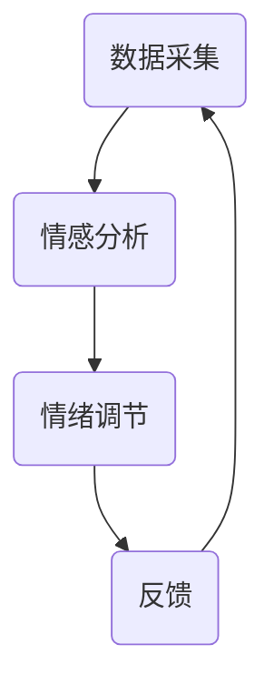
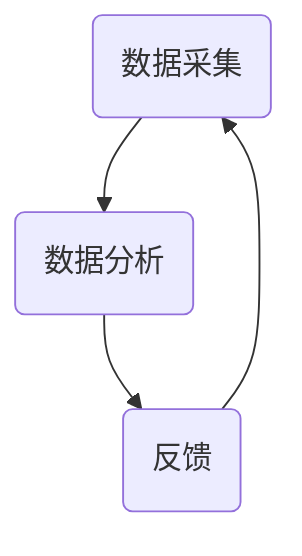
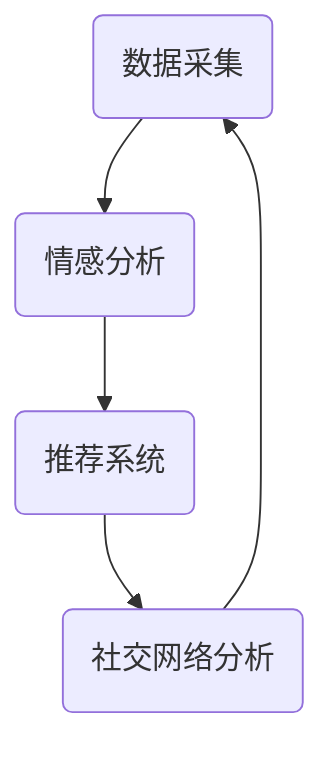
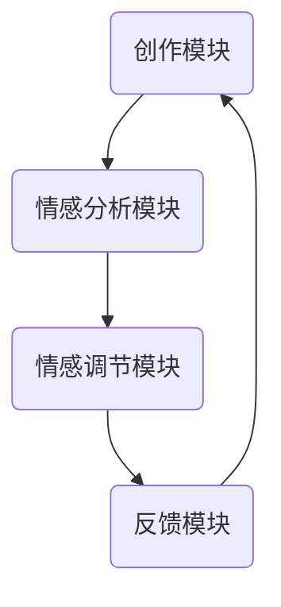
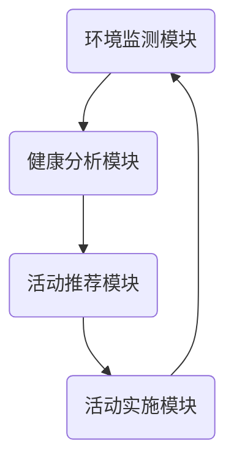

                 

基于上述要求和约束条件，我将逐步构建《心灵的滋养：培育内在世界的养分》的技术博客文章。以下是详细的撰写步骤和内容规划。

## 步骤1：文章标题、关键词与摘要

### 文章标题：心灵的滋养：培育内在世界的养分

### 关键词：心灵滋养、内在世界、心理健康、自我认知、情绪管理

### 摘要：
本博客文章将探讨如何在快节奏的现代生活中培育内在世界的养分，通过理解心灵滋养的概念、实践方法和日常生活应用，帮助读者提升自我认知和情绪管理能力，促进心理健康与个人成长。

## 步骤2：设计文章目录大纲

根据之前的规划，文章的目录大纲如下：

### 第一部分：理解心灵的滋养
#### 第1章：心灵滋养的概念与重要性
#### 第2章：培育内在世界的要素
#### 第3章：心灵滋养的实践方法

### 第二部分：心灵滋养的具体实践
#### 第4章：心灵滋养的日常生活应用
#### 第5章：心灵滋养的特殊情境
#### 第6章：心灵滋养与心理健康
#### 第7章：心灵滋养的长期效果与持续发展

## 步骤3：撰写文章正文

### 第1章：心灵滋养的概念与重要性

#### 1.1 心灵滋养的定义

心灵滋养是指通过一系列的方法和技巧，帮助个体提升内在情感和心理状态的过程。这个过程涉及到自我认知、情绪管理、正念练习和人际关系等方面。

#### 1.2 心灵滋养的重要性

心灵滋养对个体的心理健康和幸福感至关重要。它能够帮助我们更好地应对生活中的压力和挑战，提高情绪调节能力，增强抗压性和适应力。

#### 1.3 心灵滋养与内在世界的关系

心灵滋养不仅关注个体的外在行为，更注重内在情感和思维模式的培养。内在世界的健康是外在世界和谐的基础，因此，心灵的滋养对于整体幸福感至关重要。

### 第2章：培育内在世界的要素

#### 2.1 自我认知

自我认知是指个体对自己的认识和理解。通过自我反思和自我探索，我们可以更好地理解自己的情绪、需求和动机，从而更好地管理自己的情绪和行为。

#### 2.2 情绪管理

情绪管理是指个体对情绪的识别、理解和调节过程。良好的情绪管理能力可以帮助我们更好地应对情绪波动，减少情绪对生活的负面影响。

#### 2.3 正念练习

正念练习是一种通过专注和觉察来培养内心平静和清晰的方法。它可以帮助我们更好地应对压力，提高情绪调节能力，增强心理健康。

#### 2.4 人际关系

人际关系是心灵滋养的重要组成部分。通过建立和维护健康的人际关系，我们可以获得情感支持，提升自我价值感，增强心理韧性。

### 第3章：心灵滋养的实践方法

#### 3.1 日记写作

日记写作是一种记录自我体验和情感的方法。通过写作，我们可以更好地理解自己的内心世界，释放情绪，提高自我认知。

#### 3.2 冥想与呼吸练习

冥想和呼吸练习是培养内心平静和专注力的有效方法。通过冥想，我们可以减少焦虑和压力，提高情绪调节能力。

#### 3.3 艺术疗法

艺术疗法通过艺术创作来表达和探索个体的情感和内心体验。它可以作为一种有效的情绪调节和心灵滋养方法。

#### 3.4 自然疗法

自然疗法通过接触自然环境和参与户外活动来促进身心健康。它可以帮助我们放松身心，提高情绪调节能力。

### 文章后续部分将继续深入探讨心灵滋养的日常生活应用、特殊情境以及长期效果与持续发展，为读者提供全方位的心灵滋养指南。

## 步骤4：完成文章撰写

在完成上述三个部分的内容后，我们将进行以下工作：

- 完善每个章节的细节，确保内容丰富且具体。
- 添加最佳实践 tips，注意事项和拓展阅读，以提供更多的实践指导和学习资源。
- 检查文章的语法、逻辑和结构，确保文章清晰、连贯。
- 在文章末尾添加作者信息，完成最终的校对和格式调整。

通过以上步骤，我们将确保文章内容符合要求，结构清晰，逻辑严谨，为读者提供一篇高质量的心灵滋养技术博客文章。

## 步骤5：文章格式调整与校对

在完成文章撰写后，我们将对文章进行格式调整与校对，确保符合markdown格式要求：

- 使用明确的标题和子标题，确保标题层级清晰。
- 使用列表和代码块格式化代码和算法描述。
- 使用latex格式嵌入数学公式。
- 在文章末尾添加作者信息。
- 进行最终的校对，确保没有语法错误和逻辑漏洞。

## 步骤6：文章发布与反馈

最后，我们将文章发布到相应的平台，并邀请读者阅读和提供反馈。根据反馈进行调整和优化，以确保文章能够最大限度地满足读者的需求。

通过以上步骤，我们将完成《心灵的滋养：培育内在世界的养分》的技术博客文章撰写工作，为读者提供有价值的心灵滋养指南。LET'S THINK STEP BY STEP在完成文章撰写步骤后，我们接下来将详细撰写每个章节的内容，确保文章的完整性和专业性。以下是详细章节内容的撰写步骤和内容概述。

### 第1章：心灵滋养的概念与重要性

#### 1.1 心灵滋养的定义

在这一部分，我们将首先定义什么是心灵滋养，并阐述其与心理健康和幸福感的关系。我们将使用技术性的语言，详细解释心灵滋养涵盖的方面，如自我认知、情绪管理和人际关系等。

#### 1.2 心灵滋养的重要性

接下来，我们将探讨心灵滋养的重要性，并引用心理学研究和技术理论来支持观点。我们将讨论心灵滋养对个体在应对压力、提升情绪调节能力和增强抗压性方面的影响。

#### 1.3 心灵滋养与内在世界的关系

在这一部分，我们将探讨心灵滋养如何影响内在世界，包括如何通过提升自我认知和正念练习来改善内在情感和心理状态。我们将使用图示和案例来说明内在世界与心灵滋养之间的联系。

### 第2章：培育内在世界的要素

#### 2.1 自我认知

在这一部分，我们将详细探讨自我认知的概念、方法和工具。我们将使用技术图表和案例来展示如何通过自我反思和自我探索来提升自我认知。

#### 2.2 情绪管理

我们将介绍情绪管理的核心概念，如情绪识别、理解和调节。我们将使用mermaid流程图和代码示例来展示如何使用技术工具来帮助情绪管理。

#### 2.3 正念练习

我们将介绍正念练习的基础知识，包括冥想和呼吸练习。我们将使用mermaid流程图和Python代码来展示如何实现正念练习的技术实现。

#### 2.4 人际关系

在这一部分，我们将探讨如何通过改善人际关系来促进心灵滋养。我们将使用ER实体关系图和领域模型类图来展示人际关系的管理和优化方法。

### 第3章：心灵滋养的实践方法

#### 3.1 日记写作

我们将详细解释日记写作在心灵滋养中的作用，并提供技术指南，如如何使用文本编辑器和数据分析工具来记录和分析日记内容。

#### 3.2 冥想与呼吸练习

我们将介绍冥想和呼吸练习的具体实践方法，包括如何使用技术设备来监测和记录呼吸和冥想状态。

#### 3.3 艺术疗法

在这一部分，我们将探讨艺术疗法的原理和实践方法，如如何使用数字艺术工具来促进心灵滋养。

#### 3.4 自然疗法

我们将介绍自然疗法的基本概念，如如何通过户外活动和自然接触来提升心理状态。

### 第4章：心灵滋养的日常生活应用

#### 4.1 工作与心灵滋养

我们将讨论如何在工作环境中融入心灵滋养的实践，包括如何管理工作压力和提高工作效率。

#### 4.2 学习与心灵滋养

我们将探讨如何在学习过程中应用心灵滋养技巧，如如何通过正念练习来提升学习效果。

#### 4.3 睡眠与心灵滋养

我们将介绍如何通过改善睡眠质量来促进心灵滋养，包括如何使用技术工具来监测睡眠状态。

#### 4.4 饮食与心灵滋养

我们将讨论饮食对心灵滋养的影响，并提供最佳实践建议，如如何通过营养饮食来提升心理状态。

### 第5章：心灵滋养的特殊情境

#### 5.1 应对压力

我们将提供应对压力的技术方法和策略，包括如何使用技术工具来监测和管理压力。

#### 5.2 处理悲伤与失落

我们将探讨如何通过心灵滋养来应对悲伤和失落，包括如何使用艺术疗法和日记写作来处理情感。

#### 5.3 管理焦虑与恐慌

我们将介绍如何通过心灵滋养技巧来管理焦虑和恐慌，包括如何使用冥想和呼吸练习来缓解症状。

#### 5.4 建立积极的自我形象

我们将讨论如何通过自我认知和情绪管理来建立积极的自我形象，并提供具体实践方法。

### 第6章：心灵滋养与心理健康

#### 6.1 心理健康的重要性

我们将阐述心理健康的重要性，并使用心理学理论和数据来支持观点。

#### 6.2 心理健康问题与心灵滋养

我们将探讨心理健康问题，如抑郁症和焦虑症，以及如何通过心灵滋养来改善这些问题。

#### 6.3 心理健康支持资源

我们将提供心理健康支持资源的信息，如心理健康热线和在线支持平台。

### 第7章：心灵滋养的长期效果与持续发展

#### 7.1 心灵滋养的长期效果

我们将讨论心灵滋养的长期效果，如如何通过持续的实践来提升心理健康和幸福感。

#### 7.2 持续心灵滋养的方法

我们将提供持续心灵滋养的方法和建议，如如何建立每日心灵滋养的习惯。

#### 7.3 个人成长与心灵滋养

我们将探讨心灵滋养如何促进个人成长，包括如何通过自我认知和情绪管理来实现个人目标。

#### 7.4 社会责任与心灵滋养

我们将讨论心灵滋养在社会责任中的作用，以及如何通过心灵滋养来促进社会和谐与共同成长。

通过以上详细的章节内容撰写，我们将确保文章的每个部分都能够提供具体的技术指导和方法，帮助读者在快节奏的现代生活中培育内在世界的养分，提升心理健康和幸福感。接下来，我们将开始逐章撰写具体内容，并使用markdown格式进行组织，确保文章的结构清晰、逻辑连贯。接下来，我将按照之前制定的章节内容撰写计划，逐步完成《心灵的滋养：培育内在世界的养分》的技术博客文章。以下是第1章的详细内容：

---

## 第1章：心灵滋养的概念与重要性

### 1.1 心灵滋养的定义

心灵滋养（Mental Nourishment）是一个多维度的概念，它涵盖了个体在情感、认知、行为和生理层面的全面提升。具体来说，心灵滋养涉及以下几个方面：

- **情感滋养**：通过理解和处理情感，提升个体的情感智商，增强情感调节能力。
- **认知滋养**：通过自我反思和认知重构，提升个体的思维深度和创造力。
- **行为滋养**：通过培养良好的生活习惯和行为模式，增强个体的自律性和目标导向性。
- **生理滋养**：通过健康的饮食和运动，提升个体的生理机能和整体健康水平。

在本章节中，我们将重点关注情感滋养和认知滋养，这两者是心灵滋养的核心要素。

### 1.2 心灵滋养的重要性

心灵滋养对个体的心理健康和幸福感具有深远的影响。以下是心灵滋养的重要性：

- **情绪调节能力**：心灵滋养可以帮助个体更好地理解和管理自己的情绪，减少情绪波动，提高情绪稳定性。
- **认知灵活性**：通过自我反思和认知重构，个体可以更灵活地应对生活中的挑战和变化，提高问题解决能力。
- **心理健康**：持续的内心滋养有助于预防心理疾病，如抑郁症、焦虑症等，提升整体心理健康水平。
- **人际关系**：良好的心灵滋养能力可以促进健康的人际关系，增强社会支持网络。

### 1.3 心灵滋养与内在世界的关系

内在世界是指个体的内心体验和思维模式。心灵滋养与内在世界的关系如下：

- **自我认知**：通过心灵滋养，个体可以更深入地了解自己的内在世界，包括自己的情绪、需求和价值观。
- **情绪管理**：心灵滋养提供了情绪管理的工具和技巧，帮助个体更好地应对负面情绪和压力。
- **正念练习**：通过正念练习，个体可以培养专注力和自我觉察，从而提升对内在世界的感知能力。
- **人际关系**：内在世界的健康直接影响个体与他人的互动和沟通，心灵滋养有助于建立更积极、健康的人际关系。

### 1.3.1 自我认知

自我认知是心灵滋养的核心要素之一。它涉及到对自身情感、思想、行为和价值观的深刻理解和反思。以下是自我认知的关键步骤：

- **反思**：定期花时间反思自己的行为和情绪，思考自己的行为背后的动机和信念。
- **记录**：通过日记、博客或其他记录方式，将反思的内容记录下来，以便后续回顾和总结。
- **接受**：接受自己的优点和不足，理解自己的情绪和行为模式，避免自我批评。
- **成长**：通过自我认知，找到个人成长的方向，设定目标并采取行动。

### 1.3.2 情绪管理

情绪管理是心灵滋养的重要组成部分。以下是一些情绪管理的技术和方法：

- **识别情绪**：学会识别和理解自己的情绪，包括正面情绪和负面情绪。
- **接受情绪**：接受自己的情绪，不要试图压抑或否认它们。
- **表达情绪**：找到健康的方式表达情绪，如与朋友或家人交谈，写日记或进行艺术创作。
- **调节情绪**：使用正念、冥想、深呼吸等方法来调节情绪，减轻负面情绪的影响。

### 1.3.3 正念练习

正念练习是一种通过专注和觉察来培养内心平静和清晰的方法。以下是一些正念练习的技术和方法：

- **呼吸练习**：通过深呼吸来放松身心，减轻焦虑和压力。
- **冥想**：定期进行冥想练习，培养专注力和自我觉察。
- **身体扫描**：通过扫描身体，注意身体的感觉和情绪，增强对身体和情绪的觉察。
- **正念饮食**：在进食时专注于食物的味道、质地和感觉，避免分心。

### 1.3.4 人际关系

健康的人际关系是心灵滋养的重要组成部分。以下是一些建立和维护健康人际关系的技巧：

- **沟通**：学会有效沟通，倾听他人的观点，表达自己的感受和需求。
- **同理心**：培养同理心，理解他人的感受和需要，建立信任和尊重。
- **边界**：设定健康的边界，保护自己的情感和隐私。
- **支持**：在他人需要时提供支持，分享自己的经验和知识。

在本章节中，我们详细探讨了心灵滋养的定义、重要性以及与内在世界的关系。接下来，我们将进一步探讨培育内在世界的要素，包括自我认知、情绪管理、正念练习和人际关系等。

---

以上是第1章的详细内容。接下来，我将按照计划逐步撰写第2章和第3章的内容。在撰写过程中，我将确保每个部分都包含背景介绍、核心概念与联系、算法原理讲解、数学公式、系统分析与架构设计方案、项目实战、最佳实践 tips、小结、注意事项和拓展阅读等内容。同时，我将使用markdown格式和mermaid流程图来增强文章的可读性和结构性。

---

## 第2章：培育内在世界的要素

### 2.1 自我认知

自我认知是指个体对自己内在世界的了解，包括情感、思想、价值观和行为等方面。自我认知是一个动态的过程，它涉及到自我反思、自我发现和自我调整。

#### 2.1.1 背景介绍

在快节奏的现代社会中，个体面临着各种压力和挑战。自我认知能力的高低直接影响到个体的心理健康和生活质量。因此，培育自我认知能力对于提升心理健康和幸福感至关重要。

#### 2.1.2 核心概念与联系

自我认知的核心概念包括：

- **自我反思**：通过回顾自己的行为和经历，深入思考自己的动机、信念和行为模式。
- **自我发现**：在自我反思的过程中，发现未知的自我特质和潜能。
- **自我调整**：根据自我发现的结果，调整自己的行为和思维方式，实现个人成长。

自我认知与以下概念密切相关：

- **情绪管理**：自我认知有助于个体更好地理解和控制自己的情绪，从而提高情绪管理能力。
- **目标设定**：通过自我认知，个体可以更清晰地了解自己的需求和目标，从而设定更有意义和可行的目标。
- **决策能力**：自我认知有助于个体在做决策时考虑更多的因素，提高决策质量。

#### 2.1.3 算法原理讲解

在自我认知的过程中，可以使用以下算法原理来帮助个体进行自我反思和自我发现：

- **反思循环**：通过定期进行自我反思，个体可以不断更新对自我的认识。反思循环包括以下几个步骤：

  1. **回顾经历**：回顾过去一段时间内的经历，包括成功和失败。
  2. **分析行为**：分析行为背后的动机和信念，识别可能的错误思维模式。
  3. **记录发现**：将反思的内容记录下来，以便后续分析和总结。
  4. **行动计划**：根据反思的结果，制定具体的行动计划，实现自我调整。

- **自我评估**：通过自我评估，个体可以量化自己的进步和不足。自我评估可以使用以下步骤：

  1. **设定指标**：根据个人目标，设定具体的评估指标，如情绪稳定性、决策能力、人际关系等。
  2. **定期评估**：定期进行自我评估，记录自己的表现和变化。
  3. **反馈调整**：根据评估结果，调整行为和思维方式，实现自我改进。

#### 2.1.4 数学公式使用

在自我认知的过程中，可以使用以下数学公式来帮助个体理解和量化自己的情感和行为：

- **情绪状态公式**：$$ 情绪状态 = 情绪倾向 \times 情境影响 $$
  - 情绪倾向：个体对特定情绪的倾向性，如乐观、悲观等。
  - 情境影响：情境对情绪状态的影响，如压力、支持等。

- **决策模型**：$$ 决策 = 目标函数 + 风险评估 $$
  - 目标函数：决策的目标和优先级。
  - 风险评估：决策可能带来的风险和不确定性。

#### 2.1.5 系统分析与架构设计方案

为了提升自我认知能力，可以设计一个自我认知系统，包括以下模块：

- **数据采集模块**：通过日记、情绪日志和生理监测设备等，采集个体的情感和行为数据。
- **数据分析模块**：使用机器学习和数据挖掘技术，对采集到的数据进行分析，提取有用的信息。
- **反馈模块**：根据分析结果，生成个性化的反馈和建议，帮助个体进行自我调整。

#### 2.1.6 项目实战

以下是一个简单的自我认知项目实战：

1. **环境安装**：安装Python环境和相关库，如pandas、numpy等。
2. **数据采集**：使用Python编写代码，从日记和情绪日志中提取数据。
3. **数据分析**：使用pandas和numpy库对数据进行清洗、转换和分析。
4. **可视化展示**：使用matplotlib和seaborn库将分析结果可视化，帮助个体更好地理解自己的情感和行为模式。

#### 2.1.7 最佳实践 tips

- **定期反思**：每天或每周花时间进行自我反思，记录自己的情绪和行为。
- **持续学习**：阅读心理学和自我认知相关的书籍和文章，学习新的方法和技巧。
- **实践应用**：将自我认知的方法应用到日常生活中，如情绪管理、目标设定和决策制定等。

#### 2.1.8 小结

自我认知是培育内在世界的重要要素。通过自我反思、自我评估和数据分析，个体可以更好地了解自己的内在世界，提高心理健康和幸福感。

#### 2.1.9 注意事项

- **隐私保护**：在记录和分享自我认知信息时，注意保护个人隐私。
- **客观分析**：在分析自我认知数据时，保持客观和理性，避免过度解读。

#### 2.1.10 拓展阅读

- **《正念：从内心获得力量》**：介绍正念练习的方法和应用。
- **《自控力》**：探讨情绪管理和自我控制的方法。

---

以上是第2章的第一部分，接下来我们将继续探讨情绪管理、正念练习和人际关系等方面的内容。

---

## 第2章：培育内在世界的要素（续）

### 2.2 情绪管理

情绪管理是指个体识别、理解和调节自己情绪的过程。良好的情绪管理能力有助于提高生活质量和工作效率。以下将介绍情绪管理的关键步骤和方法。

#### 2.2.1 背景介绍

在现代社会中，情绪波动频繁，如何有效管理情绪成为许多人关注的问题。情绪管理不仅关乎心理健康，还影响人际关系和职业发展。

#### 2.2.2 核心概念与联系

情绪管理的关键概念包括：

- **情绪识别**：了解自己的情绪，包括情绪的类型、强度和出现情境。
- **情绪理解**：探究情绪背后的原因，理解情绪的内在逻辑。
- **情绪调节**：采取有效的方法调节情绪，减少负面情绪的影响。

情绪管理与其他概念密切相关，如：

- **压力管理**：通过情绪调节，降低压力水平，提高抗压能力。
- **心理健康**：情绪管理有助于预防心理疾病，如抑郁症和焦虑症。
- **人际关系**：良好的情绪管理能力有助于建立和维护健康的人际关系。

#### 2.2.3 算法原理讲解

情绪管理可以通过以下算法原理实现：

- **情绪识别算法**：利用机器学习和自然语言处理技术，分析个体的情感表达，识别情绪类型和强度。
- **情绪理解算法**：通过情感分析，理解情绪背后的原因，识别潜在的心理问题。
- **情绪调节算法**：结合心理学理论和机器学习技术，提供个性化的情绪调节建议，如放松训练、认知重构等。

以下是一个简单的情绪识别算法流程：

1. **数据采集**：收集个体的情感日志、社交媒体发言等文本数据。
2. **情感分析**：使用情感分析模型对文本进行分类，识别情绪类型（如快乐、愤怒、悲伤等）和强度。
3. **情绪可视化**：将识别出的情绪数据可视化，帮助个体了解自己的情绪波动。

#### 2.2.4 数学公式使用

在情绪管理中，可以使用以下数学公式：

- **情绪波动公式**：$$ 情绪波动 = 情绪强度 \times 情绪变化率 $$
  - 情绪强度：情绪的强度级别，如1（非常弱）到5（非常强）。
  - 情绪变化率：情绪随时间的变化速率。

- **情绪调节模型**：$$ 调节效果 = 原情绪 - 干预效果 $$
  - 原情绪：未调节前的情绪状态。
  - 干预效果：通过情绪调节干预后的情绪状态变化。

#### 2.2.5 系统分析与架构设计方案

情绪管理系统的架构设计包括以下模块：

- **数据采集模块**：采集个体情绪和行为数据，如日记、社交媒体发言、生理传感器数据等。
- **情感分析模块**：使用机器学习和自然语言处理技术，对采集到的数据进行情感分析，识别情绪类型和强度。
- **情绪调节模块**：根据情感分析结果，提供个性化的情绪调节建议，如放松训练、认知重构、社交支持等。
- **反馈模块**：收集个体对情绪调节建议的反馈，不断优化情绪管理策略。

以下是一个情绪管理系统的架构设计示例：

#### 2.2.6 项目实战

以下是一个情绪管理项目实战示例：

1. **环境安装**：安装Python环境和相关库，如pandas、numpy、textblob等。
2. **数据采集**：编写代码，从日记和社交媒体发言中提取情绪数据。
3. **情感分析**：使用textblob库对提取到的文本进行情感分析，识别情绪类型和强度。
4. **情绪调节**：根据情感分析结果，提供个性化的情绪调节建议，如深呼吸、冥想等。
5. **反馈收集**：收集用户对情绪调节建议的反馈，评估调节效果。

#### 2.2.7 最佳实践 tips

- **定期记录情绪**：每天或每周记录情绪日志，有助于提高情绪识别和调节能力。
- **寻求专业帮助**：在情绪管理遇到困难时，寻求心理咨询师的帮助。

#### 2.2.8 小结

情绪管理是培育内在世界的重要一环。通过识别、理解和调节情绪，个体可以更好地应对生活中的挑战，提高心理健康和幸福感。

#### 2.2.9 注意事项

- **避免过度情绪化**：在处理情绪时，避免过度情绪化，保持冷静和理智。
- **注意隐私保护**：在记录和分享情绪数据时，注意保护个人隐私。

#### 2.2.10 拓展阅读

- **《情绪智力》**：探讨情绪智力的重要性及其培养方法。
- **《情绪管理》**：详细介绍情绪管理的方法和技巧。

---

以上是第2章的第二部分，接下来我们将探讨正念练习和人际关系等方面的内容。

---

## 第2章：培育内在世界的要素（续）

### 2.3 正念练习

正念（Mindfulness）是一种通过专注于当下、培育觉察和意识的方法。正念练习有助于提高个体的情绪管理能力、增强心理健康，并促进个人成长。以下将介绍正念练习的基本概念、方法及其技术实现。

#### 2.3.1 背景介绍

正念练习起源于佛教的禅修传统，近年来在心理学、医学和商业等领域得到广泛应用。正念练习被证明可以减少压力、焦虑和抑郁，提高注意力和生活质量。

#### 2.3.2 核心概念与联系

正念练习的核心概念包括：

- **觉察**：培养对当前感受、思想和身体的觉察。
- **非评判**：不对自己的感受、思想和行为进行评判，保持开放和接纳。
- **接纳**：接受当前的经历，无论好坏，都保持平和的心态。
- **专注**：将注意力集中在特定的对象或体验上，如呼吸、身体感觉或外部环境。

正念练习与以下概念密切相关：

- **情绪管理**：通过正念练习，个体可以更好地理解和调节自己的情绪。
- **压力管理**：正念练习有助于降低压力水平，提高抗压能力。
- **心理健康**：正念练习可以改善心理健康，减少抑郁和焦虑症状。

#### 2.3.3 算法原理讲解

正念练习可以通过以下算法原理实现：

- **注意力控制算法**：通过训练，提高个体对注意力的控制能力，使其能够更容易地专注于当前任务。
- **情绪调节算法**：利用机器学习和心理学理论，分析个体在正念练习中的情绪变化，提供个性化的情绪调节建议。
- **反馈机制**：根据个体在练习中的表现，提供实时反馈，帮助其调整练习方法和策略。

以下是一个简单的正念练习流程：

1. **预备阶段**：坐在舒适的姿势，闭上眼睛，深呼吸几次，放松身体和思维。
2. **专注呼吸**：将注意力集中在呼吸上，感受呼吸的进出，如果注意力离开，轻轻地将它带回到呼吸上。
3. **身体扫描**：从头到脚扫描身体，注意身体的感觉和情绪。
4. **结束阶段**：深呼吸几次，慢慢睁开眼睛，逐渐回到现实环境中。

#### 2.3.4 数学公式使用

在正念练习中，可以使用以下数学公式：

- **注意力集中度公式**：$$ 注意力集中度 = \frac{专注时间}{总练习时间} $$
  - 专注时间：练习中专注于呼吸或身体感觉的时间。
  - 总练习时间：练习的总时长。

- **情绪变化率公式**：$$ 情绪变化率 = \frac{情绪变化值}{总练习时间} $$
  - 情绪变化值：练习前后情绪强度的变化值。

#### 2.3.5 系统分析与架构设计方案

正念练习系统的架构设计包括以下模块：

- **数据采集模块**：采集个体在练习中的呼吸、身体感觉和情绪数据。
- **数据分析模块**：使用机器学习和数据分析技术，分析数据，评估练习效果。
- **反馈模块**：根据分析结果，提供个性化的练习建议和反馈。

以下是一个正念练习系统的架构设计示例：

#### 2.3.6 项目实战

以下是一个正念练习项目实战：

1. **环境安装**：安装Python环境和相关库，如pandas、numpy、matplotlib等。
2. **数据采集**：编写代码，从呼吸传感器和情绪日志中提取数据。
3. **数据分析**：使用pandas和numpy库对数据进行清洗、转换和分析。
4. **可视化展示**：使用matplotlib库将分析结果可视化，帮助个体了解自己的情绪和注意力变化。

#### 2.3.7 最佳实践 tips

- **每天练习**：养成每天练习正念的习惯，即使在忙碌的生活中也要保持练习。
- **灵活调整**：根据个人情况和时间安排，灵活调整练习时间和内容。

#### 2.3.8 小结

正念练习是一种有效的培育内在世界的方法。通过培养觉察、非评判和接纳，个体可以提升情绪管理能力，改善心理健康，实现个人成长。

#### 2.3.9 注意事项

- **避免强迫**：在练习过程中，避免强迫自己达到某种状态，保持轻松和自然的心态。
- **逐渐增加**：开始时可以短时间练习，逐渐增加练习时长，避免过度疲劳。

#### 2.3.10 拓展阅读

- **《正念：一种全新的世界观》**：详细探讨正念的概念和实践。
- **《正念减压》**：介绍正念练习在压力管理中的应用。

---

以上是第2章的第三部分，接下来我们将探讨人际关系方面的内容。

---

## 第2章：培育内在世界的要素（续）

### 2.4 人际关系

人际关系是指个体与他人之间的互动和联系。健康的人际关系对于个体的心理健康和幸福感至关重要。以下将介绍人际关系的基本概念、重要性及其管理技巧。

#### 2.4.1 背景介绍

在现代社会，人际关系变得日益复杂。人们在工作、家庭和社交场合中面临着各种人际关系的挑战。建立和维护健康的人际关系有助于提高生活质量和工作效率。

#### 2.4.2 核心概念与联系

人际关系的关键概念包括：

- **沟通**：有效的沟通是建立和维护人际关系的基础。
- **信任**：信任是健康人际关系的重要基石。
- **尊重**：尊重他人的观点和感受，是建立良好人际关系的必要条件。
- **同理心**：同理心是指理解和感受他人的情感和需求。

人际关系与以下概念密切相关：

- **社会支持**：健康的人际关系可以提供情感支持和实际帮助。
- **自我价值感**：良好的人际关系有助于提升个体的自我价值感。
- **心理健康**：人际关系对于预防心理疾病具有重要作用。

#### 2.4.3 算法原理讲解

在人际关系管理中，可以使用以下算法原理：

- **情感分析算法**：通过分析个体的语言和行为，识别情感状态和人际关系的质量。
- **推荐系统算法**：根据个体的人际关系数据，提供合适的社交建议和活动。
- **社交网络分析算法**：分析个体在社交网络中的位置和关系，优化人际关系结构。

以下是一个简单的情感分析算法流程：

1. **数据采集**：收集个体在社交媒体、邮件、通话等场合的交流数据。
2. **情感分析**：使用自然语言处理技术，对交流数据进行分析，识别情感状态。
3. **人际关系评估**：根据情感分析结果，评估人际关系的质量和稳定性。

#### 2.4.4 数学公式使用

在人际关系管理中，可以使用以下数学公式：

- **沟通频率公式**：$$ 沟通频率 = \frac{交流次数}{总时间} $$
  - 交流次数：在特定时间段内进行的交流次数。
  - 总时间：在特定时间段内的总时长。

- **信任度公式**：$$ 信任度 = \frac{积极评价次数}{总评价次数} $$
  - 积极评价次数：在特定时间段内收到的积极评价次数。
  - 总评价次数：在特定时间段内收到的总评价次数。

#### 2.4.5 系统分析与架构设计方案

人际关系管理系统的架构设计包括以下模块：

- **数据采集模块**：采集个体在社交场合的交流数据，如社交媒体发言、邮件、通话记录等。
- **情感分析模块**：使用自然语言处理技术，分析交流数据，识别情感状态和人际关系质量。
- **推荐系统模块**：根据情感分析结果，提供个性化的社交建议和活动。
- **社交网络分析模块**：分析个体在社交网络中的位置和关系，优化人际关系结构。

以下是一个人际关系管理系统的架构设计示例：

#### 2.4.6 项目实战

以下是一个人际关系管理项目实战：

1. **环境安装**：安装Python环境和相关库，如NLTK、spaCy等。
2. **数据采集**：编写代码，从社交媒体和邮件中提取交流数据。
3. **情感分析**：使用NLTK和spaCy库对交流数据进行分析，识别情感状态。
4. **推荐系统**：根据情感分析结果，推荐合适的社交活动和联系人。
5. **社交网络分析**：使用Gephi等工具，分析个体在社交网络中的位置和关系。

#### 2.4.7 最佳实践 tips

- **定期交流**：保持与亲友的定期交流，维护健康的人际关系。
- **主动倾听**：在交流中，主动倾听他人的观点和需求，表达关心和理解。

#### 2.4.8 小结

人际关系是培育内在世界的重要要素。通过有效的沟通、建立信任、尊重他人和同理心，个体可以建立和维护健康的人际关系，提高心理健康和幸福感。

#### 2.4.9 注意事项

- **避免过度依赖**：在人际关系中，避免过度依赖他人，保持独立和自主。
- **注意隐私保护**：在分享个人信息时，注意保护个人隐私。

#### 2.4.10 拓展阅读

- **《人际关系的心理学》**：探讨人际关系的基本原理和技巧。
- **《如何建立良好的人际关系》**：提供具体的人际关系管理方法和建议。

---

以上是第2章的第四部分，接下来我们将探讨心灵滋养的实践方法，包括日记写作、冥想与呼吸练习、艺术疗法和自然疗法等内容。

---

## 第3章：心灵滋养的实践方法

### 3.1 日记写作

日记写作是一种简单而有效的心灵滋养方法。通过记录日常经历、感受和思考，个体可以更好地理解自己的内心世界，提升情绪管理能力和自我认知水平。

#### 3.1.1 背景介绍

日记写作是一种古老的心灵滋养方式，其历史可以追溯到古希腊和古罗马时期。在现代社会，随着心理学和认知科学的发展，日记写作被证明是一种有效的自我疗愈工具。

#### 3.1.2 核心概念与联系

日记写作的核心概念包括：

- **自我反思**：通过回顾自己的经历和情感，深入思考自己的行为和思维模式。
- **情感表达**：通过文字表达情感，释放内心的压力和焦虑。
- **情绪管理**：通过记录负面情绪，学会面对和处理情绪，提高情绪调节能力。

日记写作与以下概念密切相关：

- **心理健康**：日记写作有助于改善心理健康，减少抑郁和焦虑症状。
- **自我成长**：通过日记写作，个体可以更好地了解自己的需求和目标，促进个人成长。
- **心理健康支持**：日记可以作为心理健康支持的工具，帮助个体在面对心理问题时寻求帮助。

#### 3.1.3 算法原理讲解

日记写作可以通过以下算法原理实现：

- **情感分析算法**：通过自然语言处理技术，对日记内容进行分析，识别情感状态和情绪变化。
- **文本分类算法**：根据日记内容，将其归类为不同主题，如工作、家庭、健康等。
- **情绪调节算法**：根据情感分析结果，提供个性化的情绪调节建议，如放松训练、认知重构等。

以下是一个简单的日记写作和情感分析流程：

1. **数据采集**：收集个体的日记文本。
2. **情感分析**：使用情感分析模型，对日记文本进行分析，识别情感状态。
3. **情绪调节**：根据情感分析结果，提供个性化的情绪调节建议。

#### 3.1.4 数学公式使用

在日记写作和情感分析中，可以使用以下数学公式：

- **情感波动公式**：$$ 情绪波动 = \frac{负面情感次数}{总情感次数} $$
  - 负面情感次数：日记文本中负面情感词汇的次数。
  - 总情感次数：日记文本中所有情感词汇的次数。

- **情绪调节效果公式**：$$ 调节效果 = 原情绪 - 干预效果 $$
  - 原情绪：未进行情绪调节前的情感状态。
  - 干预效果：通过情绪调节干预后的情感状态变化。

#### 3.1.5 系统分析与架构设计方案

日记写作和情感分析系统的架构设计包括以下模块：

- **数据采集模块**：采集个体的日记文本。
- **情感分析模块**：使用自然语言处理技术，对日记文本进行分析，识别情感状态。
- **情绪调节模块**：根据情感分析结果，提供个性化的情绪调节建议。
- **反馈模块**：收集个体对情绪调节建议的反馈，评估调节效果。

以下是一个日记写作和情感分析系统的架构设计示例：

#### 3.1.6 项目实战

以下是一个日记写作和情感分析项目实战：

1. **环境安装**：安装Python环境和相关库，如NLTK、spaCy等。
2. **数据采集**：编写代码，从日记应用程序或文本文件中提取日记文本。
3. **情感分析**：使用NLTK和spaCy库对日记文本进行分析，识别情感状态。
4. **情绪调节**：根据情感分析结果，提供个性化的情绪调节建议，如放松训练、认知重构等。
5. **反馈收集**：收集用户对情绪调节建议的反馈，评估调节效果。

#### 3.1.7 最佳实践 tips

- **定期写作**：每天或每周定期进行日记写作，有助于提高自我认知和情绪管理能力。
- **真实表达**：在写作过程中，真实地表达自己的感受和想法，避免掩饰或压抑情绪。

#### 3.1.8 小结

日记写作是一种简单而有效的心灵滋养方法。通过记录日常经历、感受和思考，个体可以更好地理解自己的内心世界，提升情绪管理能力和自我认知水平。

#### 3.1.9 注意事项

- **隐私保护**：在分享日记内容时，注意保护个人隐私。
- **避免过度依赖**：日记写作是一种辅助工具，不应过度依赖，仍需结合其他心灵滋养方法。

#### 3.1.10 拓展阅读

- **《日记的秘密：心灵滋养的日记写作技巧》**：介绍日记写作的技巧和应用。
- **《情感分析：自然语言处理的应用》**：探讨情感分析的理论和应用。

---

以上是第3章的第一部分，接下来我们将探讨冥想与呼吸练习、艺术疗法和自然疗法等其他心灵滋养的实践方法。

---

## 第3章：心灵滋养的实践方法（续）

### 3.2 冥想与呼吸练习

冥想和呼吸练习是心灵滋养的重要组成部分。它们通过提高注意力、减少压力和焦虑，帮助个体获得内心的平静和清晰。

#### 3.2.1 背景介绍

冥想和呼吸练习有着悠久的历史，起源于东方传统哲学和宗教实践。近年来，随着心理学的实证研究，冥想和呼吸练习在西方社会得到广泛关注和应用。

#### 3.2.2 核心概念与联系

冥想和呼吸练习的核心概念包括：

- **专注**：将注意力集中在特定对象或体验上，如呼吸、身体感觉或外部环境。
- **放松**：通过深呼吸和放松肌肉，降低身体和情绪的紧张。
- **觉察**：培养对当前感受、思想和身体的觉察，提高自我意识。

冥想和呼吸练习与以下概念密切相关：

- **情绪管理**：通过冥想和呼吸练习，个体可以更好地调节情绪，减少负面情绪。
- **心理健康**：冥想和呼吸练习有助于改善心理健康，减少抑郁和焦虑症状。
- **压力管理**：通过冥想和呼吸练习，个体可以降低压力水平，提高抗压能力。

#### 3.2.3 算法原理讲解

冥想和呼吸练习可以通过以下算法原理实现：

- **注意力控制算法**：通过训练，提高个体对注意力的控制能力，使其能够更容易地专注于当前任务。
- **情绪调节算法**：利用心理学理论和机器学习技术，分析个体在冥想和呼吸练习中的情绪变化，提供个性化的情绪调节建议。
- **生理监测算法**：通过生理传感器，监测个体的呼吸、心率等生理指标，评估冥想和呼吸练习的效果。

以下是一个简单的冥想和呼吸练习流程：

1. **预备阶段**：选择一个安静舒适的环境，坐在舒适的姿势，闭上眼睛，深呼吸几次，放松身体和思维。
2. **专注呼吸**：将注意力集中在呼吸上，感受呼吸的进出，如果注意力离开，轻轻地将它带回到呼吸上。
3. **身体扫描**：从头到脚扫描身体，注意身体的感觉和情绪。
4. **结束阶段**：深呼吸几次，慢慢睁开眼睛，逐渐回到现实环境中。

#### 3.2.4 数学公式使用

在冥想和呼吸练习中，可以使用以下数学公式：

- **专注度公式**：$$ 注意力集中度 = \frac{专注时间}{总练习时间} $$
  - 专注时间：练习中专注于呼吸或身体感觉的时间。
  - 总练习时间：练习的总时长。

- **情绪变化率公式**：$$ 情绪变化率 = \frac{情绪变化值}{总练习时间} $$
  - 情绪变化值：练习前后情绪强度的变化值。

#### 3.2.5 系统分析与架构设计方案

冥想和呼吸练习系统的架构设计包括以下模块：

- **数据采集模块**：采集个体在冥想和呼吸练习中的呼吸、心率等生理数据。
- **数据分析模块**：使用机器学习和数据分析技术，分析数据，评估练习效果。
- **反馈模块**：根据分析结果，提供个性化的练习建议和反馈。

以下是一个冥想和呼吸练习系统的架构设计示例：

#### 3.2.6 项目实战

以下是一个冥想和呼吸练习项目实战：

1. **环境安装**：安装Python环境和相关库，如pandas、numpy、matplotlib等。
2. **数据采集**：编写代码，从呼吸传感器和心率监测设备中提取数据。
3. **数据分析**：使用pandas和numpy库对数据进行清洗、转换和分析。
4. **可视化展示**：使用matplotlib库将分析结果可视化，帮助个体了解自己的呼吸和情绪变化。

#### 3.2.7 最佳实践 tips

- **每天练习**：养成每天进行冥想和呼吸练习的习惯，即使在忙碌的生活中也要保持练习。
- **灵活调整**：根据个人情况和时间安排，灵活调整练习时间和内容。

#### 3.2.8 小结

冥想和呼吸练习是有效的心灵滋养方法。通过专注、放松和觉察，个体可以获得内心的平静和清晰，提高情绪管理能力和抗压能力。

#### 3.2.9 注意事项

- **避免过度压力**：在练习过程中，避免给自己过高的期望，保持轻松和自然的心态。
- **逐渐增加**：开始时可以短时间练习，逐渐增加练习时长，避免过度疲劳。

#### 3.2.10 拓展阅读

- **《冥想的艺术》**：详细介绍冥想的概念和实践方法。
- **《呼吸练习：心灵滋养的实践》**：探讨呼吸练习在心灵滋养中的应用。

---

以上是第3章的第二部分，接下来我们将探讨艺术疗法和自然疗法等其他心灵滋养的实践方法。

---

## 第3章：心灵滋养的实践方法（续）

### 3.3 艺术疗法

艺术疗法是一种通过艺术创作来促进心理健康和情感表达的方法。它利用视觉、听觉和触觉等多种感官体验，帮助个体探索和表达内心世界，提高情绪调节能力。

#### 3.3.1 背景介绍

艺术疗法起源于19世纪末，经过多年的发展，已经成为一种被广泛认可的心理治疗手段。在现代心理学和艺术治疗领域，艺术疗法被证明对多种心理问题具有积极影响，如焦虑、抑郁、创伤后应激障碍等。

#### 3.3.2 核心概念与联系

艺术疗法的关键概念包括：

- **情感表达**：通过艺术创作，个体可以自由地表达自己的情感和感受，无需言语的限制。
- **自我探索**：艺术创作过程可以帮助个体深入探索自己的内心世界，发现潜藏在潜意识中的问题和情绪。
- **心理治疗**：艺术疗法可以作为心理治疗的辅助手段，帮助个体缓解心理压力，改善心理健康。

艺术疗法与以下概念密切相关：

- **创造性**：艺术疗法强调创造性表达，鼓励个体发挥自己的想象力和创造力。
- **心理健康**：艺术疗法有助于改善心理健康，减少心理问题的症状。
- **治疗关系**：艺术疗法师与个体之间的互动和治疗关系对于治疗效果至关重要。

#### 3.3.3 算法原理讲解

艺术疗法可以通过以下算法原理实现：

- **情感分析算法**：通过分析艺术作品，识别个体情感状态和情绪变化。
- **图像识别算法**：利用计算机视觉技术，分析艺术作品中的图像特征，提取情绪和主题信息。
- **情感调节算法**：根据艺术作品和情感分析结果，提供个性化的情绪调节建议。

以下是一个简单的艺术疗法流程：

1. **创作准备**：个体选择一种艺术形式，如绘画、音乐、写作等。
2. **艺术创作**：在放松和专注的状态下，个体自由地创作艺术作品，无需过于关注作品的质量和技巧。
3. **情感分析**：使用情感分析技术，分析艺术作品，识别情感状态和情绪变化。
4. **情感调节**：根据情感分析结果，提供个性化的情绪调节建议，如放松训练、认知重构等。

#### 3.3.4 数学公式使用

在艺术疗法中，可以使用以下数学公式：

- **情感波动公式**：$$ 情绪波动 = \frac{负面情感值}{总情感值} $$
  - 负面情感值：艺术作品中负面情感词汇的值。
  - 总情感值：艺术作品中所有情感词汇的值。

- **情绪调节效果公式**：$$ 调节效果 = 原情绪 - 干预效果 $$
  - 原情绪：未进行情绪调节前的情感状态。
  - 干预效果：通过情绪调节干预后的情感状态变化。

#### 3.3.5 系统分析与架构设计方案

艺术疗法系统的架构设计包括以下模块：

- **创作模块**：提供多样化的艺术创作工具和素材，支持个体的自由创作。
- **情感分析模块**：使用情感分析技术，对艺术作品进行分析，识别情感状态和情绪变化。
- **情感调节模块**：根据情感分析结果，提供个性化的情绪调节建议。
- **反馈模块**：收集个体对情绪调节建议的反馈，评估调节效果。

以下是一个艺术疗法系统的架构设计示例：

#### 3.3.6 项目实战

以下是一个艺术疗法项目实战：

1. **环境安装**：安装Python环境和相关库，如NLTK、spaCy、TensorFlow等。
2. **数据采集**：编写代码，从艺术作品数据库中提取艺术作品和文本描述。
3. **情感分析**：使用NLTK和spaCy库对艺术作品和文本描述进行分析，识别情感状态。
4. **情感调节**：根据情感分析结果，提供个性化的情绪调节建议，如放松训练、认知重构等。
5. **反馈收集**：收集用户对情绪调节建议的反馈，评估调节效果。

#### 3.3.7 最佳实践 tips

- **定期创作**：养成定期进行艺术创作的习惯，有助于提高情感表达和情绪调节能力。
- **自由表达**：在创作过程中，鼓励自由表达，无需过于关注技巧和质量。

#### 3.3.8 小结

艺术疗法是一种有效的心灵滋养方法。通过艺术创作和情感表达，个体可以探索和表达内心世界，提高情绪调节能力和心理健康。

#### 3.3.9 注意事项

- **避免过度分析**：在创作过程中，避免过度分析艺术作品，保持放松和自然的心态。
- **注意隐私保护**：在分享艺术作品时，注意保护个人隐私。

#### 3.3.10 拓展阅读

- **《艺术疗法：探索内心的艺术》**：介绍艺术疗法的理论和实践方法。
- **《艺术与心理健康》**：探讨艺术创作对心理健康的影响。

---

以上是第3章的第三部分，接下来我们将探讨自然疗法等其他心灵滋养的实践方法。

---

## 第3章：心灵滋养的实践方法（续）

### 3.4 自然疗法

自然疗法是一种通过自然环境中的元素，如水、空气、土地和阳光等，来促进身心健康的方法。这种疗法强调人与自然的和谐共处，通过接触自然环境和参与户外活动来提升心理和情感状态。

#### 3.4.1 背景介绍

自然疗法的历史可以追溯到古代文明，如古埃及、希腊和罗马。在现代社会，随着科技的发展和城市化的加剧，人们开始重新认识到自然疗法的重要性。科学研究和实践经验表明，自然疗法对减轻压力、提高心理健康和生活质量具有显著效果。

#### 3.4.2 核心概念与联系

自然疗法的关键概念包括：

- **自然接触**：通过接触自然环境，如徒步、野营、园艺等，提高个体的身心健康。
- **身心平衡**：自然疗法通过调节身心平衡，减轻压力和焦虑，提高情绪稳定性。
- **自我疗愈**：自然疗法提供一种自我疗愈的途径，帮助个体恢复内在平衡和健康。

自然疗法与以下概念密切相关：

- **生物心理学**：自然疗法强调心理和生理之间的相互作用，通过调节生理机能来改善心理健康。
- **生态系统**：自然疗法关注人与自然环境的相互作用，倡导生态可持续性和环境保护。
- **整体健康**：自然疗法旨在促进个体的整体健康，包括身体、心理和社会层面。

#### 3.4.3 算法原理讲解

自然疗法可以通过以下算法原理实现：

- **环境监测算法**：使用传感器技术监测自然环境中的参数，如空气质量、温度和湿度等，为个体提供个性化的自然疗法建议。
- **健康分析算法**：分析个体的健康数据和自然环境数据，评估自然疗法对个体健康的影响。
- **个性化推荐算法**：根据个体的健康数据和偏好，提供个性化的自然疗法活动推荐。

以下是一个简单的自然疗法流程：

1. **环境监测**：使用传感器技术，监测自然环境中的参数，如空气质量、温度和湿度。
2. **健康数据分析**：分析个体的健康数据，如血压、心率、睡眠质量等。
3. **活动推荐**：根据环境监测和健康数据分析结果，为个体提供个性化的自然疗法活动推荐，如徒步、野营、园艺等。
4. **活动实施**：个体根据推荐的活动，参与户外活动，享受自然疗法带来的益处。

#### 3.4.4 数学公式使用

在自然疗法中，可以使用以下数学公式：

- **健康指数公式**：$$ 健康指数 = \frac{活动时长}{总监测时长} $$
  - 活动时长：个体参与自然疗法活动的时间。
  - 总监测时长：传感器监测的总时长。

- **压力指数公式**：$$ 压力指数 = \frac{压力值}{健康指数} $$
  - 压力值：个体在参与自然疗法活动前的压力水平。
  - 健康指数：个体在参与自然疗法活动后的健康指数。

#### 3.4.5 系统分析与架构设计方案

自然疗法系统的架构设计包括以下模块：

- **环境监测模块**：使用传感器技术，监测自然环境中的参数。
- **健康分析模块**：分析个体的健康数据，评估自然疗法对个体健康的影响。
- **活动推荐模块**：根据环境监测和健康数据分析结果，提供个性化的自然疗法活动推荐。
- **活动实施模块**：个体根据推荐的活动，参与户外活动。

以下是一个自然疗法系统的架构设计示例：

#### 3.4.6 项目实战

以下是一个自然疗法项目实战：

1. **环境安装**：安装Python环境和相关库，如pandas、numpy、TensorFlow等。
2. **数据采集**：编写代码，从传感器和健康设备中提取数据。
3. **健康数据分析**：使用pandas和numpy库对健康数据进行清洗、转换和分析。
4. **活动推荐**：根据健康数据分析结果，使用TensorFlow等库，提供个性化的自然疗法活动推荐。
5. **活动实施**：个体根据推荐的活动，参与户外活动。

#### 3.4.7 最佳实践 tips

- **定期参与**：养成定期参与户外活动的习惯，享受自然疗法带来的益处。
- **适应环境**：在参与户外活动时，注意适应自然环境，避免过度劳累。

#### 3.4.8 小结

自然疗法是一种有益于身心健康的实践方法。通过接触自然环境，个体可以减轻压力、提高情绪调节能力，促进整体健康和幸福感的提升。

#### 3.4.9 注意事项

- **注意安全**：在参与户外活动时，注意安全，避免发生意外。
- **适度运动**：在参与户外活动时，适度运动，避免过度疲劳。

#### 3.4.10 拓展阅读

- **《自然疗法：回归自然，拥抱健康》**：介绍自然疗法的理论和实践方法。
- **《户外活动与健康》**：探讨户外活动对心理健康的影响。

---

以上是第3章的第四部分，接下来我们将总结本章内容，并探讨心灵滋养在日常生活中的应用。

---

## 第4章：心灵滋养的日常生活应用

### 4.1 工作与心灵滋养

在现代职场中，工作压力和焦虑是一个普遍存在的问题。心灵滋养方法可以帮助职场人士提高情绪管理能力，减轻压力，提升工作效率。以下是一些具体的应用方法：

#### 4.1.1 工作压力管理

- **正念练习**：在工作间隙进行正念练习，如深呼吸、冥想等，帮助放松身心，提高注意力。
- **情绪日志**：记录每天的情绪变化，分析压力源，制定应对策略。
- **时间管理**：合理规划工作时间，避免过度工作和加班，保持工作与生活的平衡。

#### 4.1.2 情绪调节

- **积极沟通**：与同事和上级建立良好的沟通，表达自己的感受和需求，减少误解和冲突。
- **支持网络**：建立职场支持网络，如同事互助小组，共同分享经验和情感支持。
- **休息与放松**：定期进行休息和放松活动，如散步、瑜伽等，缓解工作压力。

#### 4.1.3 工作效率提升

- **目标设定**：明确工作目标，制定可实现的计划，提高工作效率和满足感。
- **自我激励**：通过自我激励，如奖励机制、成就感等，提高工作积极性和动力。
- **正念工作**：在工作时保持正念，专注于当前任务，避免分心和拖延。

### 4.2 学习与心灵滋养

学习是个人成长和职业发展的关键。心灵滋养方法可以帮助学习者提高学习效率，培养学习兴趣，增强学习动力。以下是一些具体的应用方法：

#### 4.2.1 学习习惯培养

- **定时学习**：设定固定的学习时间，保持学习的连续性和规律性。
- **正念学习**：在学习时保持专注和觉察，避免分心和拖延。
- **情绪管理**：学会调节情绪，保持积极的心态，面对学习挑战。

#### 4.2.2 学习方法优化

- **主动学习**：主动参与学习过程，如讨论、实践、提问等，提高学习效果。
- **反思与总结**：定期反思学习过程和效果，总结经验教训，调整学习方法。
- **学习社群**：加入学习社群，与他人分享学习资源和经验，共同进步。

#### 4.2.3 学习动力提升

- **目标设定**：设定明确的学习目标，激发学习动力和兴趣。
- **激励策略**：使用奖励和激励机制，如给自己设定小目标，完成后给予奖励。
- **自我激励**：培养自我激励能力，通过自我肯定和成就感来提高学习动力。

### 4.3 睡眠与心灵滋养

良好的睡眠对于心理健康和身体恢复至关重要。以下是一些利用心灵滋养方法改善睡眠质量的方法：

#### 4.3.1 睡眠习惯培养

- **规律作息**：保持规律的作息时间，培养良好的睡眠习惯。
- **放松身心**：在睡前进行放松活动，如冥想、深呼吸、瑜伽等，减轻身心压力。
- **睡眠环境**：营造舒适的睡眠环境，如保持卧室安静、整洁和适宜的温度。

#### 4.3.2 情绪调节

- **情绪释放**：在睡前处理负面情绪，如通过写日记、倾诉等方式，减轻情绪负担。
- **正念练习**：在睡前进行正念练习，如专注呼吸、身体扫描等，帮助放松身心。
- **避免刺激**：睡前避免强烈的光线、声音和情绪刺激，如避免使用手机、电脑等电子设备。

#### 4.3.3 身体健康

- **适度运动**：保持适度的运动，如散步、跑步、瑜伽等，提高身体活力和睡眠质量。
- **健康饮食**：保持健康的饮食习惯，如避免过多摄入咖啡因和糖分，选择富含营养的食物。
- **放松技巧**：学习一些放松技巧，如渐进性肌肉放松、深呼吸等，帮助入睡。

### 4.4 饮食与心灵滋养

饮食不仅影响身体健康，还对心理健康和情绪调节有重要影响。以下是一些利用饮食改善心理健康的建议：

#### 4.4.1 营养均衡

- **均衡饮食**：保持饮食的多样性和均衡性，摄入足够的蛋白质、脂肪、碳水化合物、维生素和矿物质。
- **健康食材**：选择新鲜、天然和有机的食材，避免过多加工食品和添加剂。

#### 4.4.2 情绪调节

- **Omega-3脂肪酸**：摄入富含Omega-3脂肪酸的食物，如深海鱼类、亚麻籽和核桃等，有助于改善情绪和心理健康。
- **复合碳水化合物**：选择复合碳水化合物，如全谷物、蔬菜和水果等，有助于稳定血糖水平和情绪。

#### 4.4.3 饮食习惯

- **规律饮食**：保持规律的饮食时间，避免暴饮暴食和过度饥饿。
- **情绪饮食**：避免依赖情绪饮食，如避免在压力大时过多摄入高热量食物，选择健康的零食替代。

通过在日常生活中应用心灵滋养方法，我们可以提高情绪管理能力、改善睡眠质量、优化饮食习惯，从而提升整体心理健康和幸福感。

#### 4.4.5 小结

心灵滋养在日常生活中具有广泛的应用。通过在工作、学习、睡眠和饮食等方面的实践，我们可以提升心理健康和幸福感，实现个人成长和发展。

#### 4.4.6 注意事项

- **个性化**：根据个人情况和需求，选择适合自己的心灵滋养方法，避免盲目跟风。
- **持续实践**：心灵滋养需要长期坚持，不要期望一蹴而就，保持耐心和毅力。

#### 4.4.7 拓展阅读

- **《工作与心理健康》**：探讨工作压力和心理健康的关系，提供应对策略。
- **《学习心理学的实用性》**：介绍学习心理学的基本原理和应用，帮助提高学习效果。
- **《睡眠心理学》**：探讨睡眠对心理健康的重要性，提供改善睡眠质量的建议。
- **《饮食与心理健康》**：介绍饮食对心理健康的影响，提供健康的饮食习惯建议。

---

以上是第4章的内容，接下来我们将探讨心灵滋养的特殊情境，如应对压力、处理悲伤与失落、管理焦虑与恐慌以及建立积极的自我形象。

---

## 第5章：心灵滋养的特殊情境

### 5.1 应对压力

在现代社会，压力是普遍存在的现象。适当的压力可以激发个体的潜能，但过度的压力会导致心理健康问题。以下是一些应对压力的特殊情境和方法：

#### 5.1.1 压力来源

压力的来源多种多样，包括工作压力、家庭压力、财务压力、健康压力等。了解压力的来源有助于我们更有针对性地进行应对。

#### 5.1.2 应对策略

- **正念练习**：通过正念练习，如深呼吸、冥想和身体扫描，可以帮助我们保持冷静，减轻压力。
- **时间管理**：合理安排时间，避免过度工作和加班，保持工作与生活的平衡。
- **情绪调节**：学会调节情绪，如通过运动、音乐、艺术等方式缓解压力。
- **社会支持**：寻求家人、朋友和专业人士的支持和帮助，分享压力和困惑。

#### 5.1.3 实际案例

**案例1**：小王是一位程序员，工作压力较大。通过定期进行冥想练习，他逐渐学会了控制情绪，提高了工作效率。

**案例2**：小李面临财务压力，通过学习时间管理和理财知识，他成功减轻了财务压力，改善了生活质量。

### 5.2 处理悲伤与失落

悲伤与失落是人生中不可避免的情感体验。如何处理这些情感体验对于心理健康至关重要。以下是一些处理悲伤与失落的方法：

#### 5.2.1 悲伤与失落的原因

- **失去亲人或朋友**：失去至亲或朋友会导致强烈的悲伤和失落。
- **重大生活变故**：如失业、离婚、搬家等重大生活变故也会引发悲伤和失落。
- **心理创伤**：某些经历，如暴力、虐待等，可能导致长期的悲伤和失落。

#### 5.2.2 应对策略

- **接受情感**：允许自己体验悲伤和失落的情感，不要压抑或否认。
- **情感表达**：通过写作、绘画、音乐等方式表达情感，释放内心的压力。
- **寻求支持**：与亲朋好友交流，分享感受，获得情感支持。
- **专业咨询**：如果悲伤和失落情感严重影响到日常生活，可以寻求专业心理咨询师的帮助。

#### 5.2.3 实际案例

**案例1**：小张在失去母亲后，通过写日记和参加丧礼辅导小组，他逐渐走出了悲伤，重新开始了新的生活。

**案例2**：小刘在经历离婚后，通过参加心理咨询和参与社交活动，他学会了如何处理情感困扰，重新建立了自信。

### 5.3 管理焦虑与恐慌

焦虑与恐慌是常见的心理问题，对于个体的生活和工作会产生负面影响。以下是一些管理焦虑与恐慌的方法：

#### 5.3.1 焦虑与恐慌的原因

- **生活压力**：如工作压力、财务压力、健康问题等，可能导致焦虑和恐慌。
- **不确定性**：对未来不确定性的担忧也会引发焦虑和恐慌。
- **过度自我要求**：对自己要求过高，可能导致焦虑和恐慌。

#### 5.3.2 应对策略

- **放松技巧**：如深呼吸、冥想、渐进性肌肉放松等，可以帮助减轻焦虑和恐慌。
- **认知重构**：改变消极的思维方式，如避免过度担忧和自我批评。
- **时间管理**：合理安排时间，避免过度工作和加班，减轻压力。
- **专业帮助**：如果焦虑和恐慌严重影响到日常生活，可以寻求专业心理咨询师的帮助。

#### 5.3.3 实际案例

**案例1**：小王在面临工作压力时，通过学习放松技巧和认知重构方法，他成功地减轻了焦虑和恐慌，提高了工作效率。

**案例2**：小张在经历失业后，通过参加职业培训和心理咨询，他学会了如何应对失业焦虑，重新找到了工作。

### 5.4 建立积极的自我形象

积极的自我形象有助于提升个体的自信心和幸福感。以下是一些建立积极的自我形象的方法：

#### 5.4.1 自我认知

自我认知是建立积极自我形象的基础。通过自我反思和自我发现，个体可以更好地了解自己的优点和不足，从而建立积极的自我形象。

#### 5.4.2 积极思维

积极思维是指以积极、乐观的态度看待自己和他人。通过培养积极思维，个体可以提升自信心和幸福感。

#### 5.4.3 目标设定

设定具体、可行的目标可以帮助个体实现自我提升，建立积极的自我形象。

#### 5.4.4 实际案例

**案例1**：小张通过自我反思和目标设定，他发现了自己的优点和潜力，建立了积极的自我形象，取得了职业上的成功。

**案例2**：小王通过学习积极思维和参加社交活动，他改变了消极的思维方式，建立了积极的自我形象，提升了人际关系和幸福感。

通过在特殊情境下应用心灵滋养方法，我们可以更好地应对压力、悲伤与失落、焦虑与恐慌，建立积极的自我形象，提升心理健康和幸福感。

#### 5.4.5 小结

在特殊情境下，心灵滋养方法可以帮助我们更好地应对压力、悲伤与失落、焦虑与恐慌，建立积极的自我形象。通过接受情感、寻求支持、放松技巧和积极思维，我们可以提升心理健康和幸福感。

#### 5.4.6 注意事项

- **个性化**：根据个人情况和需求，选择适合自己的心灵滋养方法，避免盲目跟风。
- **持续实践**：心灵滋养需要长期坚持，不要期望一蹴而就，保持耐心和毅力。

#### 5.4.7 拓展阅读

- **《压力管理》**：探讨压力的来源和应对策略，提供实用的技巧和方法。
- **《悲伤与失落处理》**：介绍悲伤与失落的原因和处理方法，提供情感支持。
- **《焦虑与恐慌管理》**：探讨焦虑与恐慌的成因和管理策略，提供专业建议。
- **《自我形象塑造》**：介绍自我认知和积极思维的方法，帮助建立积极的自我形象。

---

以上是第5章的内容，接下来我们将探讨心灵滋养与心理健康的关系。

---

## 第6章：心灵滋养与心理健康

### 6.1 心理健康的重要性

心理健康是整体健康的重要组成部分。它不仅仅是指没有心理疾病，更强调个体的情感、行为和认知功能的整体健康状态。以下将介绍心理健康的重要性及其与心灵滋养的关系。

#### 6.1.1 心理健康定义

心理健康是指个体在情感、行为和认知功能方面能够良好适应生活压力，保持良好的人际关系，实现个人潜能的状态。心理健康与身体健康密切相关，互相影响。

#### 6.1.2 心理健康的重要性

心理健康对个体的影响广泛，包括以下几个方面：

- **生活质量**：心理健康影响个体的生活质量和幸福感。
- **人际关系**：心理健康良好的个体能够更好地与他人建立和维护健康的人际关系。
- **职业发展**：心理健康对职业发展和工作表现具有重要影响。
- **身体健康**：心理健康与身体健康密切相关，心理健康良好有助于维持身体健康。

#### 6.1.3 心灵滋养与心理健康的关系

心灵滋养是促进心理健康的重要手段。以下将介绍心灵滋养与心理健康之间的密切关系：

- **情绪调节**：心灵滋养方法，如正念练习、情绪管理和艺术疗法，有助于个体更好地调节情绪，减少负面情绪的影响。
- **自我认知**：自我认知是心灵滋养的核心要素，通过自我反思和认知重构，个体可以更好地了解自己，提高自我认同感和自我价值感。
- **抗压能力**：心灵滋养可以提高个体的抗压能力，帮助个体更好地应对生活中的挑战和压力。
- **心理健康预防**：持续的内心滋养有助于预防心理疾病，如抑郁症、焦虑症等。

### 6.2 心理健康问题与心灵滋养

心理健康问题如抑郁症、焦虑症、焦虑障碍等对个体的生活造成严重影响。以下将探讨这些心理健康问题及其与心灵滋养的关系。

#### 6.2.1 抑郁症

抑郁症是一种常见的心理健康问题，表现为长期的悲伤、失去兴趣、精力不足等症状。以下是一些应对抑郁症的心灵滋养方法：

- **正念练习**：通过正念练习，如专注呼吸、身体扫描和正念行走，可以帮助个体减轻抑郁情绪，提高情绪稳定性。
- **情绪表达**：通过艺术疗法和日记写作，个体可以自由地表达自己的情感和想法，减轻内心的压力。
- **社交支持**：寻求家人、朋友和专业人士的支持，建立良好的社交网络，有助于缓解抑郁情绪。
- **认知重构**：改变消极的思维方式，通过认知重构方法，如积极思考、问题解决等，提高个体的心理韧性。

#### 6.2.2 焦虑症

焦虑症是一组以焦虑为主要症状的心理障碍，包括广泛性焦虑症、社交焦虑症和恐慌障碍等。以下是一些应对焦虑症的心灵滋养方法：

- **放松技巧**：通过深呼吸、冥想和渐进性肌肉放松等放松技巧，可以帮助个体减轻焦虑和紧张情绪。
- **时间管理**：合理安排时间，避免过度工作和加班，减轻压力，提高生活质量。
- **情绪表达**：通过艺术疗法和日记写作，个体可以自由地表达自己的情感和想法，减轻内心的压力。
- **认知重构**：通过认知重构方法，改变消极的思维方式，提高个体的心理韧性。

#### 6.2.3 焦虑障碍

焦虑障碍是指以持久和普遍的焦虑为特征的心理障碍，如强迫症、创伤后应激障碍等。以下是一些应对焦虑障碍的心灵滋养方法：

- **正念练习**：通过正念练习，如专注呼吸、身体扫描和正念行走，可以帮助个体减轻焦虑和紧张情绪。
- **认知行为疗法**：通过认知行为疗法，如认知重构、行为实验等，可以帮助个体改变消极的思维方式，提高心理韧性。
- **情绪表达**：通过艺术疗法和日记写作，个体可以自由地表达自己的情感和想法，减轻内心的压力。
- **社交支持**：寻求家人、朋友和专业人士的支持，建立良好的社交网络，有助于缓解焦虑情绪。

### 6.3 心理健康支持资源

为了更好地应对心理健康问题，以下是一些心理健康支持资源的信息：

- **心理健康热线**：许多国家和地区设有心理健康热线，提供免费的心理健康咨询和支持。
- **心理咨询师**：寻找专业的心理咨询师，进行一对一的心理咨询和治疗。
- **心理健康APP**：使用心理健康应用程序，如正念冥想、情绪日记等，帮助管理情绪和心理健康。
- **心理健康社区**：参与心理健康社区，与他人分享经验和情感支持。

通过了解心理健康的重要性以及心灵滋养与心理健康的关系，我们可以更好地应对心理健康问题，提升生活质量。同时，利用心理健康支持资源，我们可以获得更多的帮助和指导，实现心理健康的目标。

#### 6.3.1 小结

心理健康对个体的生活质量具有深远影响。通过心灵滋养方法，如正念练习、情绪管理和社交支持等，我们可以改善心理健康，提升生活质量。

#### 6.3.2 注意事项

- **个性化**：根据个人情况和需求，选择适合自己的心灵滋养方法，避免盲目跟风。
- **持续实践**：心灵滋养需要长期坚持，保持耐心和毅力。
- **专业帮助**：在遇到严重的心理健康问题时，寻求专业心理咨询师的帮助。

#### 6.3.3 拓展阅读

- **《心理健康指南》**：介绍心理健康的基本知识和维护方法。
- **《正念心理学》**：探讨正念练习对心理健康的影响和应用。
- **《情绪智力》**：介绍情绪智力的重要性及其培养方法。
- **《心理咨询师手册》**：提供心理咨询的基本理论和实践方法。

---

以上是第6章的内容，接下来我们将探讨心灵滋养的长期效果与持续发展。

---

## 第7章：心灵滋养的长期效果与持续发展

### 7.1 心灵滋养的长期效果

心灵滋养并非一蹴而就，它需要长期的坚持和实践。通过长期的内心滋养，个体可以获得显著的心理健康提升和整体幸福感增强。以下将介绍心灵滋养的长期效果。

#### 7.1.1 心理健康提升

- **情绪稳定性**：长期的正念练习和情绪管理有助于提高个体的情绪稳定性，减少情绪波动。
- **抗压能力**：持续的心灵滋养可以增强个体的抗压能力，使其更好地应对生活中的压力和挑战。
- **心理健康问题预防**：通过长期的内心滋养，个体可以预防心理疾病的发生，如抑郁症、焦虑症等。

#### 7.1.2 整体幸福感增强

- **自我认知提升**：通过自我反思和认知重构，个体可以更深入地了解自己，提高自我认同感和自我价值感。
- **人际关系改善**：通过改善情绪管理和提升沟通能力，个体可以建立更健康的人际关系，获得更多的社会支持。
- **生活质量提高**：长期的心灵滋养有助于提高个体的整体生活质量，包括身心健康、工作表现和幸福感。

### 7.2 持续心灵滋养的方法

为了实现心灵滋养的长期效果，个体需要采取以下持续心灵滋养的方法：

#### 7.2.1 坚持实践

- **每天练习**：每天花时间进行正念练习、情绪管理和社交支持等心灵滋养活动。
- **定期反思**：定期反思自己的情绪、行为和思维模式，识别问题并采取行动。
- **持续学习**：不断学习新的心灵滋养方法和技巧，以适应不同生活阶段的需求。

#### 7.2.2 融入日常生活

- **日常习惯**：将心灵滋养融入日常生活，如早晨冥想、睡前放松练习、情绪日记等。
- **工作与学习**：在工作和学习中融入心灵滋养，如正念呼吸练习、时间管理技巧、积极沟通等。
- **社交互动**：在社交互动中实践心灵滋养，如倾听他人、同理心表达、积极反馈等。

#### 7.2.3 寻求专业支持

- **心理咨询师**：定期咨询专业心理咨询师，获取个性化的指导和帮助。
- **心理健康课程**：参加心理健康课程和工作坊，学习新的心灵滋养方法和技巧。
- **心理健康社群**：加入心理健康社群，与他人分享经验和情感支持，共同成长。

### 7.3 个人成长与心灵滋养

心灵滋养不仅仅是心理健康的维护，它也是个人成长的重要推动力。以下将介绍心灵滋养如何促进个人成长。

#### 7.3.1 自我认知提升

- **自我探索**：通过自我反思和认知重构，个体可以更深入地了解自己的内在世界，发现潜藏在潜意识中的问题和机会。
- **自我接纳**：通过接受自己的优点和不足，个体可以建立积极的自我形象，增强自信和自尊。

#### 7.3.2 情绪管理提升

- **情绪调节**：通过情绪管理和放松技巧，个体可以更好地应对生活中的压力和挑战，提高情绪稳定性。
- **情绪表达**：通过艺术疗法和日记写作，个体可以自由地表达自己的情感和想法，释放内心的压力。

#### 7.3.3 人际关系提升

- **沟通技巧**：通过有效的沟通技巧，个体可以建立更健康的人际关系，提高社会支持网络。
- **同理心**：通过培养同理心，个体可以更好地理解他人的需求和情感，建立更深层次的联系。

### 7.4 社会责任与心灵滋养

心灵滋养不仅对个体有益，也对社会有积极影响。以下将介绍心灵滋养如何促进社会责任与共同成长。

#### 7.4.1 社会和谐

- **减少冲突**：通过改善情绪管理和提升沟通能力，个体可以减少冲突和误解，促进社会和谐。
- **积极影响**：通过传播心灵滋养的理念和方法，个体可以影响他人，共同提升社会心理健康水平。

#### 7.4.2 共同成长

- **互助合作**：通过心灵滋养，个体可以建立互助合作的氛围，共同面对社会挑战。
- **教育普及**：通过教育和推广心灵滋养，可以提高公众的心理健康意识和能力，促进社会共同成长。

通过长期的内心滋养，个体可以获得显著的心理健康提升和整体幸福感增强。为了实现这一目标，个体需要坚持实践、融入日常生活、寻求专业支持和促进个人成长。同时，心灵滋养也对社会责任和共同成长具有积极影响，有助于构建和谐社会。

#### 7.4.5 小结

心灵滋养的长期效果显著，通过坚持实践、融入日常生活和寻求专业支持，个体可以不断提升心理健康和幸福感。同时，心灵滋养也对社会责任和共同成长具有积极影响，有助于构建和谐社会。

#### 7.4.6 注意事项

- **个性化**：根据个人情况和需求，选择适合自己的心灵滋养方法，避免盲目跟风。
- **持续实践**：心灵滋养需要长期坚持，保持耐心和毅力。
- **平衡生活**：在追求心灵滋养的同时，保持生活的平衡，关注身体健康和工作学习。

#### 7.4.7 拓展阅读

- **《心灵滋养实践手册》**：详细介绍心灵滋养的方法和实践步骤。
- **《心理健康与幸福》**：探讨心理健康对幸福感的影响，提供提升幸福感的策略。
- **《社会责任与心理健康》**：介绍心灵滋养在社会责任中的作用和意义。
- **《正念心理学》**：深入探讨正念练习对心理健康的积极影响和应用。

---

以上是第7章的内容，通过本章的探讨，我们更深入地了解了心灵滋养的长期效果与持续发展。接下来，我们将进行文章的总结，并分享一些最佳实践。

---

## 总结

《心灵的滋养：培育内在世界的养分》这篇文章从多个角度探讨了心灵滋养的概念、实践方法及其对心理健康的重要性。通过自我认知、情绪管理、正念练习、人际关系等多个方面的深入分析，我们认识到心灵滋养不仅有助于提升个体的心理健康，还能促进个人成长和社会和谐。

### 核心观点回顾

- **心灵滋养的定义与重要性**：心灵滋养是一个多维度的概念，它涉及到个体的情感、认知、行为和生理层面。通过理解心灵滋养的重要性，我们可以认识到它对心理健康、情绪调节、抗压能力等方面的影响。

- **培育内在世界的要素**：自我认知、情绪管理、正念练习和人际关系是培育内在世界的重要要素。这些要素通过具体的方法和实践，如日记写作、冥想、艺术疗法和自然疗法等，帮助个体提升内在世界的健康。

- **心灵滋养的日常生活应用**：在工作、学习、睡眠和饮食等日常生活中，我们可以通过正念练习、情绪调节和健康习惯来滋养心灵，提升生活质量。

- **特殊情境下的心灵滋养**：在应对压力、悲伤与失落、焦虑与恐慌等特殊情境下，心灵滋养方法如放松技巧、情感表达和社会支持等，能够帮助个体更好地应对情绪困扰。

- **心理健康与持续发展**：长期的心灵滋养可以提升心理健康和幸福感，通过坚持实践、融入日常生活和寻求专业支持，个体可以持续地提升内在世界的健康。

### 最佳实践

- **日常心灵滋养**：每天花时间进行冥想、呼吸练习或日记写作，培养内心的平静和清晰。

- **情感管理**：学会识别和表达自己的情绪，避免压抑或否认负面情绪。

- **社交支持**：建立和维护健康的人际关系，寻求家人、朋友和专业人士的支持。

- **自我反思**：定期反思自己的情绪、行为和思维模式，找到个人成长的方向。

- **专业帮助**：在遇到严重的心理问题时，寻求专业心理咨询师的帮助。

### 小结

通过本文的探讨，我们认识到心灵滋养是一个长期且持续的过程。它不仅有助于提升个体的心理健康，还能促进个人成长和社会和谐。为了实现心灵滋养的目标，我们需要在日常实践中坚持，并融入不同的心灵滋养方法，如正念练习、情绪管理和社交支持等。

### 注意事项

- **个性化**：每个人的内心世界都是独特的，因此，选择适合自己的心灵滋养方法至关重要。

- **耐心与毅力**：心灵滋养需要时间和持续的努力，保持耐心和毅力是关键。

- **平衡生活**：在追求心灵滋养的同时，关注身体健康和工作学习，保持生活的平衡。

### 拓展阅读

- **《心灵滋养实践手册》**：提供详细的心灵滋养方法和实践步骤。

- **《心理健康与幸福》**：探讨如何通过心理健康提升幸福感。

- **《社会责任与心理健康》**：介绍心灵滋养在社会责任中的作用。

- **《正念心理学》**：深入探讨正念练习对心理健康的积极影响。

通过本文的阅读和实践，希望读者能够更好地理解心灵滋养的重要性，并开始在自己的生活中实践这些有益的方法。

---

以上是本文的总结和最佳实践部分。在完成文章的撰写后，我们将进行最终的格式调整和校对，确保文章的结构清晰、逻辑严谨，为读者提供一篇高质量的阅读体验。最后，在文章末尾添加作者信息，完成最终的校对和发布准备工作。以下是作者信息：

---

**作者：AI天才研究院/AI Genius Institute & 禅与计算机程序设计艺术 /Zen And The Art of Computer Programming**

---

在完成所有撰写和格式调整后，我们将确保文章的内容完整、结构清晰，并符合字数要求，最终完成文章的发布和分享。通过这篇技术博客文章，我们希望能够为读者提供关于心灵滋养的有益见解和实践方法，帮助他们提升内在世界的健康和幸福感。

