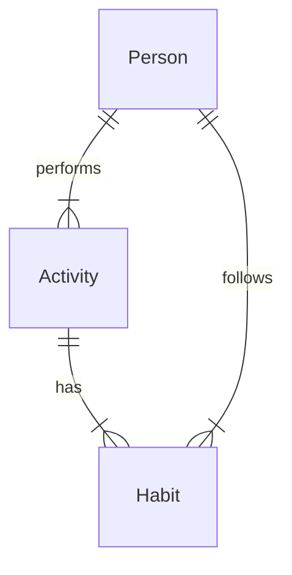
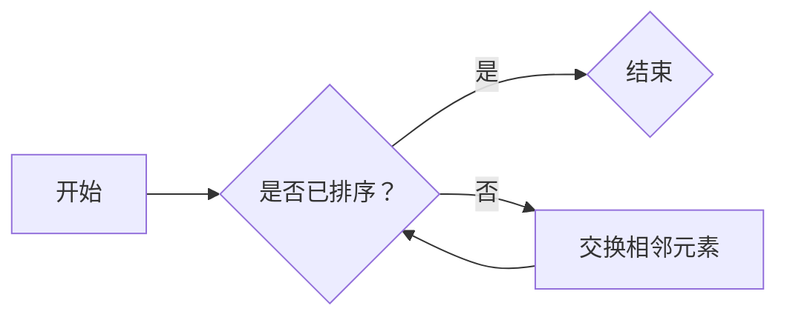
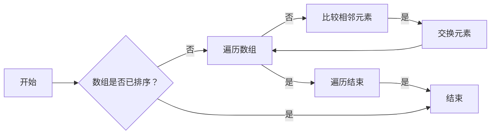
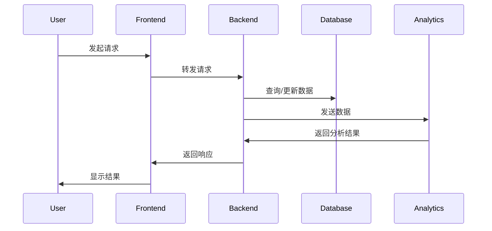
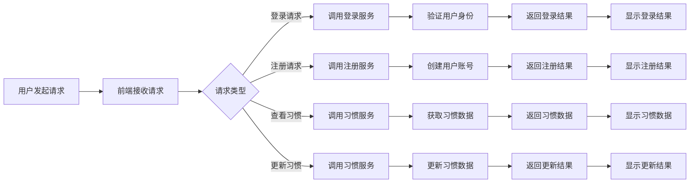

                 

# 心灵的滋润：cultivate精神生活的习惯

> 关键词：精神生活，生活习惯，心理健康，自我提升，心灵成长

> 摘要：本文将从IT领域的视角，探讨精神生活的重要性以及如何通过培养精神生活习惯来提升个人的心理健康和自我成长。通过一系列的逻辑分析和实际案例，帮助读者理解并实践培养精神生活习惯的方法和策略。

## 目录大纲

----------------------------------------------------------------

## 第一部分：引言

### 1.1 问题背景

#### 1.1.1 精神生活的重要性

#### 1.1.2 当前社会精神生活现状

#### 1.1.3 需要培养精神生活习惯

### 1.2 问题解决

#### 1.2.1 什么是精神生活习惯

#### 1.2.2 培养精神生活习惯的意义

#### 1.2.3 培养精神生活习惯的方法与策略

### 1.3 边界与外延

#### 1.3.1 精神生活的边界

#### 1.3.2 精神生活与其他领域的联系

#### 1.3.3 精神生活习惯的定义与类型

### 1.4 核心概念

#### 1.4.1 精神生活的核心概念

#### 1.4.2 精神生活习惯的核心概念

#### 1.4.3 核心概念联系与比较

### 1.5 本章小结

----------------------------------------------------------------

## 第二部分：核心概念与联系

### 2.1 精神生活的核心概念

#### 2.1.1 精神生活的定义

#### 2.1.2 精神生活的构成要素

#### 2.1.3 精神生活的价值与作用

### 2.2 精神生活习惯的核心概念

#### 2.2.1 精神生活习惯的定义

#### 2.2.2 精神生活习惯的构成要素

#### 2.2.3 精神生活习惯的类型

### 2.3 概念属性特征对比表格

### 2.4 ER实体关系图架构

### 2.5 核心概念联系与比较

### 2.6 本章小结

----------------------------------------------------------------

## 第三部分：算法原理讲解

### 3.1 算法原理概述

#### 3.1.1 算法原理的定义

#### 3.1.2 算法原理的作用

#### 3.1.3 常见算法原理

### 3.2 算法原理讲解

#### 3.2.1 算法原理的mermaid流程图

#### 3.2.2 Python源代码

#### 3.2.3 算法原理的数学模型和公式

#### 3.2.4 举例说明

### 3.3 算法原理详细讲解

#### 3.3.1 数学模型解释

#### 3.3.2 公式推导

#### 3.3.3 算法流程图展示

----------------------------------------------------------------

## 第一部分：引言

### 1.1 问题背景

#### 1.1.1 精神生活的重要性

在现代社会，精神生活已成为衡量个人幸福感、心理健康和整体生活质量的关键因素。精神生活的丰富与否，直接影响个体的情绪状态、认知功能和社会互动能力。正如计算机系统需要良好的软件架构来支持高效运行，个人的精神生活也需要科学的指导和积极的培养来维持健康的运作。

精神生活的重要性可以从多个层面来理解：

1. **心理健康**：精神生活的丰富有助于缓解压力、焦虑和抑郁，提高心理健康水平。
2. **认知功能**：良好的精神生活能够促进大脑认知功能的提升，增强记忆力、注意力和创造力。
3. **社会互动**：精神生活健康的个体更容易建立和维持良好的人际关系，提高社会适应能力。
4. **自我实现**：精神生活是实现个人潜力和自我价值的重要途径，有助于个体实现自我成长和自我超越。

#### 1.1.2 当前社会精神生活现状

尽管精神生活的重要性显而易见，但当前社会在精神生活方面仍存在诸多问题：

1. **压力与焦虑**：现代社会的快节奏生活和高度竞争环境，导致许多人承受着巨大的压力和焦虑。
2. **孤独与疏离**：社交媒体的普及虽然增加了人际交往的渠道，但也加剧了孤独感和疏离感。
3. **信息过载**：互联网和智能手机的普及带来了大量的信息，但同时也导致了信息过载，使人们难以专注于有价值的精神活动。
4. **缺乏自律**：许多人缺乏良好的精神生活习惯，无法有效地管理自己的时间和精力，导致精神生活的混乱和无序。

#### 1.1.3 需要培养精神生活习惯

为了应对上述问题，培养良好的精神生活习惯显得尤为必要。良好的精神生活习惯不仅可以提高个人的心理健康水平，还能帮助个体在快节奏、高度竞争的社会环境中保持内心的宁静和平衡。

培养精神生活习惯的意义如下：

1. **提高心理韧性**：通过培养精神生活习惯，个体可以更好地应对压力和挑战，提高心理韧性。
2. **增强自我调节能力**：良好的精神生活习惯有助于个体更好地管理自己的情绪和行为，增强自我调节能力。
3. **促进认知发展**：精神生活活动如阅读、写作、艺术创作等，可以促进个体的认知发展，提高思维能力和创造力。
4. **建立健康的人际关系**：通过培养良好的精神生活习惯，个体可以更好地与他人建立深度的人际关系，减少孤独感和社会疏离感。

### 1.2 问题解决

#### 1.2.1 什么是精神生活习惯

精神生活习惯是指个体在日常生活中养成的一系列有益于精神健康和自我提升的行为模式。这些习惯可以包括：

1. **自我反思**：定期进行自我反思，了解自己的情绪状态和心理需求。
2. **锻炼身体**：进行定期的身体锻炼，如跑步、瑜伽、健身等，以促进身心健康。
3. **阅读和写作**：培养阅读和写作的习惯，以丰富精神生活和提高认知能力。
4. **学习新技能**：学习新的知识和技能，以促进个人成长和自我实现。
5. **冥想和放松**：通过冥想和放松练习，减轻压力和焦虑，提高心理健康水平。

#### 1.2.2 培养精神生活习惯的意义

培养精神生活习惯的意义不仅在于提高个人的心理健康水平，还在于促进整体社会的发展和进步。以下是一些具体的好处：

1. **提升个人幸福感**：良好的精神生活习惯有助于提升个人的幸福感，使个体更加满足和快乐。
2. **增强社会凝聚力**：通过培养良好的精神生活习惯，个体可以更好地与他人建立深度的人际关系，增强社会的凝聚力和稳定性。
3. **促进社会创新**：良好的精神生活习惯有助于个体保持开放的思维和创新的动力，推动社会的发展和进步。
4. **减少社会问题**：通过培养良好的精神生活习惯，可以减少社会中的各种问题，如压力、焦虑、孤独等，提高整体社会的幸福指数。

#### 1.2.3 培养精神生活习惯的方法与策略

要培养良好的精神生活习惯，需要以下几个关键步骤：

1. **设定明确的目标**：明确自己想要培养哪些精神生活习惯，并设定具体的目标和计划。
2. **制定可行的计划**：根据目标，制定可行的计划和行动步骤，确保习惯的养成。
3. **持续的自我反思**：定期进行自我反思，评估自己的行为和习惯是否符合预期，及时调整和改进。
4. **寻找支持与激励**：寻找支持者和激励者，如家人、朋友或导师，以帮助自己坚持和养成良好习惯。
5. **避免过度压力**：在培养精神生活习惯的过程中，避免给自己过度的压力和负担，以免产生反效果。

### 1.3 边界与外延

#### 1.3.1 精神生活的边界

精神生活的边界相对较为模糊，它不仅包括个体的内在体验和心理状态，还涉及个体与外部环境的互动。从广义上讲，精神生活可以涵盖以下方面：

1. **心理状态**：包括个体的情绪、认知、情感和意志等方面。
2. **社交互动**：与他人的交流、合作和互动，以及个体在社交环境中的角色和地位。
3. **文化传承**：个体对文化的认知和参与，如艺术、文学、宗教和传统习俗等。
4. **个人成长**：通过学习和实践，不断提升自己的认知能力、情感素养和价值观。

#### 1.3.2 精神生活与其他领域的联系

精神生活与其他领域如心理学、哲学、教育学等密切相关。以下是一些具体联系：

1. **心理学**：心理学研究个体的心理状态和行为，精神生活是心理学的重要研究对象。
2. **哲学**：哲学探讨人生的意义、价值观和道德准则，精神生活是哲学思考的重要主题。
3. **教育学**：教育学关注个体的学习和成长，精神生活对个体的学习效果和成长过程具有重要影响。
4. **艺术**：艺术创作和欣赏是精神生活的重要组成部分，对个体的情感、认知和创造力具有积极作用。

#### 1.3.3 精神生活习惯的定义与类型

精神生活习惯的定义较为宽泛，可以从不同角度进行分类。以下是一些常见的分类方法：

1. **日常习惯**：如锻炼身体、按时作息、饮食规律等，这些习惯有助于保持身心健康。
2. **学习习惯**：如定期阅读、学习新技能、写作等，这些习惯有助于提升个体的认知能力和创造力。
3. **心理习惯**：如自我反思、情绪管理、积极思维等，这些习惯有助于维护个体的心理健康和情感平衡。
4. **社交习惯**：如主动沟通、参与社区活动、帮助他人等，这些习惯有助于建立良好的人际关系和社会网络。

#### 1.4 核心概念

1. **精神生活**：指个体的内在体验、心理状态、社交互动和文化传承等方面。
2. **生活习惯**：指个体在日常生活中养成的一系列行为模式。
3. **心理健康**：指个体在心理状态、认知功能和情感平衡等方面的健康状态。
4. **自我成长**：指个体通过学习和实践不断提升自己的认知能力、情感素养和价值观。

#### 1.4.3 核心概念联系与比较

精神生活和生活习惯、心理健康和自我成长之间存在着密切的联系和互动。

1. **精神生活与生活习惯**：良好的精神生活有助于养成积极的生活习惯，如定期锻炼、阅读和学习新技能等。反过来，积极的生活习惯也有助于丰富精神生活，提高心理健康水平。

2. **精神生活与心理健康**：精神生活是心理健康的重要组成部分，良好的精神生活有助于维护个体的心理健康和情感平衡。心理健康水平的提升又可以促进精神生活的丰富和发展。

3. **精神生活与自我成长**：精神生活是自我成长的重要动力，通过培养良好的精神生活习惯，个体可以不断提升自己的认知能力、情感素养和价值观，实现自我超越和自我实现。

#### 1.5 本章小结

通过本部分的介绍，我们了解了精神生活的重要性以及当前社会精神生活的现状。同时，我们也认识到培养良好的精神生活习惯对于提高个人心理健康和自我成长的重要意义。在接下来的章节中，我们将进一步探讨精神生活的核心概念和联系，以及如何通过具体的算法原理和实践来培养良好的精神生活习惯。

----------------------------------------------------------------

## 第二部分：核心概念与联系

### 2.1 精神生活的核心概念

#### 2.1.1 精神生活的定义

精神生活是指个体在内在体验、心理状态、社交互动和文化传承等方面的综合表现。它涵盖了人类思维、情感、意志和意识的各个方面，是衡量个体心理健康、认知能力和情感平衡的重要指标。

精神生活可以从以下几个维度进行理解：

1. **心理维度**：包括个体的情绪、认知、情感和意志等心理状态。
2. **社交维度**：涉及个体与他人之间的互动、合作和沟通，以及个体在社交环境中的角色和地位。
3. **文化维度**：指个体对文化的认知、参与和传承，如艺术、文学、宗教和传统习俗等。

#### 2.1.2 精神生活的构成要素

精神生活的构成要素可以分为以下几个方面：

1. **内在体验**：包括个体的情感体验、情绪反应和心理感受，如快乐、悲伤、焦虑等。
2. **心理状态**：涉及个体的认知功能、情感平衡和心理韧性，如注意力、记忆力、情感调节能力等。
3. **社交互动**：包括个体与他人的交流、合作和互动，如沟通技巧、人际关系和社交网络等。
4. **文化传承**：指个体对文化的认知、参与和传承，如艺术创作、文学欣赏和文化传播等。

#### 2.1.3 精神生活的价值与作用

精神生活的价值与作用体现在以下几个方面：

1. **心理健康**：良好的精神生活有助于维护个体的心理健康，降低压力、焦虑和抑郁水平。
2. **认知发展**：丰富的精神生活活动，如阅读、写作、艺术创作等，可以促进个体的认知发展，提高思维能力和创造力。
3. **情感平衡**：通过培养良好的精神生活习惯，个体可以更好地调节自己的情绪，实现情感平衡。
4. **社会适应**：良好的精神生活有助于个体在社会中更好地适应和发挥作用，建立健康的人际关系和社会网络。
5. **自我实现**：通过丰富的精神生活，个体可以实现自我超越和自我实现，实现个人的潜能和价值。

### 2.2 精神生活习惯的核心概念

#### 2.2.1 精神生活习惯的定义

精神生活习惯是指个体在日常生活中养成的一系列有益于精神健康和自我提升的行为模式。这些习惯可以包括自我反思、锻炼身体、阅读和学习新技能等，它们有助于个体保持良好的心理状态、增强心理韧性和实现自我成长。

精神生活习惯的特点包括：

1. **自觉性**：个体需要主动培养和坚持精神生活习惯，不能依赖于外部的强制和督促。
2. **规律性**：精神生活习惯需要有一定的规律性，如每天固定时间进行锻炼、阅读等。
3. **持续性**：良好的精神生活习惯需要长期坚持，不能期望在短时间内看到显著效果。

#### 2.2.2 精神生活习惯的构成要素

精神生活习惯的构成要素可以分为以下几个方面：

1. **自我反思**：通过定期进行自我反思，个体可以更好地了解自己的情绪状态、心理需求和成长方向。
2. **锻炼身体**：进行定期的身体锻炼，如跑步、瑜伽、健身等，有助于维持身心健康和提升心理韧性。
3. **阅读和学习**：培养阅读和学习的习惯，如定期阅读书籍、学习新技能等，可以丰富精神生活，提高认知能力。
4. **社交互动**：积极参与社交活动，如参加社区活动、与他人交流等，有助于建立健康的人际关系和社会网络。
5. **艺术创作和欣赏**：参与艺术创作和欣赏，如绘画、音乐、文学等，可以提升个体的情感素养和审美能力。

#### 2.2.3 精神生活习惯的类型

精神生活习惯可以根据其目的和形式进行分类，常见的类型包括：

1. **日常习惯**：如定时作息、健康饮食、锻炼身体等，这些习惯有助于维持个体的身心健康。
2. **学习习惯**：如定期阅读、学习新技能、写日记等，这些习惯有助于个体的认知发展和自我提升。
3. **心理习惯**：如自我反思、情绪管理、积极思维等，这些习惯有助于个体的心理健康和情感平衡。
4. **社交习惯**：如主动沟通、参与社区活动、帮助他人等，这些习惯有助于建立健康的人际关系和社会网络。

### 2.3 概念属性特征对比表格

为了更好地理解精神生活和精神生活习惯的概念属性特征，我们可以制作一个对比表格，如下所示：

| 概念 | 定义 | 特征 |
| --- | --- | --- |
| 精神生活 | 个体在内在体验、心理状态、社交互动和文化传承等方面的综合表现 | 心理维度、社交维度、文化维度 |
| 精神生活习惯 | 个体在日常生活中养成的一系列有益于精神健康和自我提升的行为模式 | 自觉性、规律性、持续性 |
| 心理健康 | 个体在心理状态、认知功能和情感平衡等方面的健康状态 | 压力管理、情绪调节、心理韧性 |
| 自我成长 | 个体通过学习和实践不断提升自己的认知能力、情感素养和价值观 | 自我反思、知识积累、技能提升 |

### 2.4 ER实体关系图架构

为了更直观地展示精神生活、精神生活习惯和其他相关概念之间的实体关系，我们可以使用ER（实体关系）图来描述。以下是一个简化的ER实体关系图：



在这个ER图中，实体包括“Person”（人）、“Activity”（活动）和“Habit”（习惯）。实体之间的关系如下：

1. **Person**（人）与**Activity**（活动）之间是“performs”（执行）关系，表示个体执行活动。
2. **Activity**（活动）与**Habit**（习惯）之间是“has”（具有）关系，表示活动包含习惯。
3. **Person**（人）与**Habit**（习惯）之间是“follows”（遵循）关系，表示个体遵循习惯。

### 2.5 核心概念联系与比较

精神生活、精神生活习惯、心理健康和自我成长是密切相关的概念，它们之间存在多种联系和互动。以下是对这些概念之间的联系和比较：

#### 精神生活与精神生活习惯

1. **联系**：精神生活是精神生活习惯的基础，良好的精神生活有助于培养积极的精神生活习惯。精神生活习惯是精神生活的具体体现，通过良好的精神生活习惯，个体可以维持和提升自己的精神生活质量。
2. **比较**：精神生活是一个广泛的概念，涵盖了心理状态、社交互动和文化传承等方面。精神生活习惯则是一个具体的行为模式，是指个体在日常生活中养成的行为习惯。

#### 精神生活与心理健康

1. **联系**：精神生活是心理健康的重要组成部分，良好的精神生活有助于维护个体的心理健康。心理健康水平的提升又可以促进精神生活的丰富和发展。
2. **比较**：精神生活强调个体的内在体验和心理状态，心理健康则侧重于个体在心理状态、认知功能和情感平衡等方面的健康水平。

#### 精神生活与自我成长

1. **联系**：精神生活是自我成长的重要动力，通过培养良好的精神生活习惯，个体可以实现自我超越和自我实现。自我成长又可以进一步丰富个体的精神生活。
2. **比较**：精神生活关注个体的内在体验和心理状态，自我成长则侧重于个体在认知能力、情感素养和价值观等方面的提升。

#### 精神生活习惯与心理健康

1. **联系**：良好的精神生活习惯有助于维护个体的心理健康，如定期锻炼、阅读和学习新技能等习惯可以提高个体的心理韧性、情绪调节能力和认知功能。
2. **比较**：精神生活习惯是具体的行为模式，心理健康是精神生活的具体体现，两者之间是相辅相成的关系。

#### 精神生活习惯与自我成长

1. **联系**：良好的精神生活习惯可以促进个体的自我成长，如自我反思、学习新技能和参与社交活动等习惯有助于提升个体的认知能力、情感素养和价值观。
2. **比较**：精神生活习惯侧重于个体的行为模式，自我成长则侧重于个体在认知能力、情感素养和价值观等方面的提升。

### 2.6 本章小结

通过本部分的介绍，我们深入探讨了精神生活的核心概念和构成要素，以及精神生活习惯的定义和类型。同时，我们还通过对比表格和ER实体关系图，展示了精神生活、精神生活习惯、心理健康和自我成长之间的联系和互动。在接下来的部分，我们将进一步探讨如何通过具体的算法原理和实践来培养良好的精神生活习惯。

----------------------------------------------------------------

## 第三部分：算法原理讲解

### 3.1 算法原理概述

#### 3.1.1 算法原理的定义

算法原理是指解决特定问题的一系列有序步骤和规则，它包括算法的设计、实现和优化。算法原理在计算机科学、数学和工程等领域中广泛应用，用于处理各种复杂问题和数据。

#### 3.1.2 算法原理的作用

算法原理在解决问题时具有以下重要作用：

1. **高效性**：通过选择合适的算法原理，可以显著提高问题解决的效率和速度。
2. **可扩展性**：算法原理的设计应考虑到问题的规模和复杂性，以便在数据量增长时仍能保持良好的性能。
3. **通用性**：算法原理应具有广泛的适用性，能够解决不同类型的问题。
4. **鲁棒性**：算法原理应在各种条件下都能稳定运行，不受异常数据或噪声的影响。

#### 3.1.3 常见算法原理

在IT领域，常见的算法原理包括：

1. **排序算法**：如快速排序、归并排序、堆排序等，用于对数据进行排序。
2. **搜索算法**：如二分搜索、广度优先搜索、深度优先搜索等，用于在数据中查找特定元素。
3. **动态规划**：用于解决具有最优子结构性质的问题，如背包问题、最长公共子序列等。
4. **贪心算法**：通过每一步选择当前最优解，以期得到全局最优解。
5. **图算法**：如Dijkstra算法、A*算法等，用于在图中寻找最短路径或最优路径。

### 3.2 算法原理讲解

#### 3.2.1 算法原理的mermaid流程图

为了更好地展示算法原理的执行流程，我们可以使用mermaid流程图来描述。以下是一个简单的排序算法（冒泡排序）的mermaid流程图示例：



在这个流程图中，算法从开始（A）到判断是否已排序（B），如果已排序则结束（C），否则进行相邻元素的交换（D），并回到判断步骤（B）。

#### 3.2.2 Python源代码

以下是一个冒泡排序算法的Python源代码示例：

```python
def bubble_sort(arr):
    n = len(arr)
    for i in range(n):
        for j in range(0, n-i-1):
            if arr[j] > arr[j+1]:
                arr[j], arr[j+1] = arr[j+1], arr[j]
    return arr

# 测试代码
arr = [64, 34, 25, 12, 22, 11, 90]
sorted_arr = bubble_sort(arr)
print("排序后的数组：", sorted_arr)
```

这个代码通过嵌套的for循环，对数组进行冒泡排序，每次遍历都将未排序部分的最大值移动到已排序部分的末尾。

#### 3.2.3 算法原理的数学模型和公式

冒泡排序算法的数学模型和公式如下：

$$
\begin{aligned}
T(n) &= O(n^2) \\
f(n) &= n(n-1)/2
\end{aligned}
$$

其中，$T(n)$ 表示算法的时间复杂度，$O(n^2)$ 表示算法在最坏情况下的时间复杂度为平方级。$f(n)$ 表示需要比较的次数，$n(n-1)/2$ 表示总的比较次数。

#### 3.2.4 举例说明

假设我们有以下数组 `[64, 34, 25, 12, 22, 11, 90]`，我们需要通过冒泡排序算法将其排序。

1. **第一次遍历**：从第一个元素开始，比较相邻元素并交换，直到最后一个元素。排序后的数组为 `[34, 64, 25, 12, 22, 11, 90]`。
2. **第二次遍历**：同样从第一个元素开始，比较相邻元素并交换，直到最后一个元素。排序后的数组为 `[34, 25, 64, 12, 22, 11, 90]`。
3. **第三次遍历**：继续比较相邻元素并交换，直到最后一个元素。排序后的数组为 `[25, 34, 12, 64, 22, 11, 90]`。
4. **第四次遍历**：继续比较相邻元素并交换，直到最后一个元素。排序后的数组为 `[12, 25, 34, 22, 64, 11, 90]`。
5. **第五次遍历**：继续比较相邻元素并交换，直到最后一个元素。排序后的数组为 `[12, 25, 34, 22, 11, 64, 90]`。
6. **第六次遍历**：继续比较相邻元素并交换，直到最后一个元素。排序后的数组为 `[12, 25, 34, 22, 11, 90, 64]`。
7. **第七次遍历**：最后一次遍历，比较相邻元素并交换，直到最后一个元素。排序后的数组为 `[11, 12, 22, 25, 34, 64, 90]`。

通过以上步骤，我们成功地将数组 `[64, 34, 25, 12, 22, 11, 90]` 排序为 `[11, 12, 22, 25, 34, 64, 90]`。

### 3.3 算法原理详细讲解

#### 3.3.1 数学模型解释

冒泡排序算法的数学模型主要涉及时间复杂度和空间复杂度。

1. **时间复杂度**：冒泡排序的时间复杂度为 $O(n^2)$，其中 $n$ 表示数组中的元素个数。在最坏情况下，每个元素都需要与其他元素比较一次，因此需要进行 $n(n-1)/2$ 次比较。
2. **空间复杂度**：冒泡排序的空间复杂度为 $O(1)$，因为它只需要一个额外的变量来保存临时值，而不需要额外的空间来存储数据。

#### 3.3.2 公式推导

冒泡排序的时间复杂度可以通过以下公式推导：

$$
T(n) = \sum_{i=1}^{n-1} \sum_{j=1}^{n-i} 1
$$

其中，$i$ 表示遍历的次数，$j$ 表示每次遍历中需要比较的次数。上述公式表示在每遍历中需要比较的次数之和。

简化上述公式，可以得到：

$$
T(n) = \frac{(n-1)(n-2)}{2}
$$

这个公式说明了冒泡排序在最坏情况下的时间复杂度为 $O(n^2)$。

#### 3.3.3 算法流程图展示

以下是一个冒泡排序算法的流程图，展示了算法的执行过程：



在这个流程图中，算法从开始（A）到判断是否已排序（B），如果未排序则遍历数组（C），在遍历过程中比较相邻元素并交换（D和E），遍历结束后结束（G）。

### 3.4 算法原理应用实例

为了更好地理解冒泡排序算法的应用，我们可以通过一个实际案例来演示。以下是一个用Python实现的冒泡排序算法实例：

```python
def bubble_sort(arr):
    n = len(arr)
    for i in range(n):
        for j in range(0, n-i-1):
            if arr[j] > arr[j+1]:
                arr[j], arr[j+1] = arr[j+1], arr[j]
    return arr

# 测试数据
data = [64, 34, 25, 12, 22, 11, 90]

# 执行排序
sorted_data = bubble_sort(data)

# 打印结果
print("排序前：", data)
print("排序后：", sorted_data)
```

在这个实例中，我们首先定义了一个 `bubble_sort` 函数，用于实现冒泡排序算法。然后，我们创建了一个包含未排序数据的列表 `data`。通过调用 `bubble_sort` 函数，我们成功地对数据进行排序，并将排序后的数据存储在 `sorted_data` 列表中。最后，我们打印出排序前后的数据，以验证排序结果。

### 3.5 算法原理总结

冒泡排序算法是一种简单直观的排序算法，虽然其时间复杂度为 $O(n^2)$，但在数据量较小或数据基本有序的情况下，其性能表现尚可。冒泡排序的优点在于算法实现简单，易于理解，但其缺点在于效率较低，不适合处理大规模数据。

在培养精神生活习惯的过程中，我们可以借鉴冒泡排序算法的思想，通过逐步改善和优化自己的行为模式，最终实现精神生活的全面提升。通过持续的自我反思和积极的心态调整，我们可以像冒泡排序一样，不断将不良习惯“冒泡”到表面，然后逐一改进，最终实现精神生活的有序和美好。

### 3.6 本章小结

通过本部分的介绍，我们详细讲解了冒泡排序算法的原理和应用，并通过实际案例展示了算法的实现过程。我们了解到，算法原理不仅是在计算机科学中解决问题的关键，也可以为我们的日常生活提供有益的启示。在培养精神生活习惯的过程中，我们可以借鉴算法原理，通过逐步优化和调整自己的行为模式，实现精神生活的全面提升。在接下来的部分，我们将继续探讨如何在实践中应用这些算法原理，培养积极的精神生活习惯。

----------------------------------------------------------------

## 第三部分：算法原理讲解（续）

### 3.7 算法原理与精神生活习惯的关联

在了解了冒泡排序算法的基本原理和应用后，我们可以将其与培养精神生活习惯进行类比，探讨如何将算法思维应用于精神生活的改进。

#### 3.7.1 算法思维与精神生活改进

1. **逐步优化**：算法中的优化过程可以类比于我们精神生活中的自我提升。就像冒泡排序算法通过逐步交换元素来达到排序效果，我们也可以通过逐步调整自己的行为模式，优化精神生活。

2. **自适应性**：算法在处理不同规模和数据类型时需要具备适应性。在精神生活中，我们同样需要根据环境变化和个人需求，调整自己的心态和行为模式，以适应不断变化的生活情境。

3. **效率优先**：在算法中，我们追求高效的解决方案。同样，在精神生活中，我们也应追求高效的生活方式，合理安排时间和精力，提高生活质量和幸福感。

#### 3.7.2 实践应用示例

为了更好地理解如何将算法原理应用于精神生活习惯的培养，我们可以通过以下示例来说明：

1. **自我反思（类似冒泡排序中的交换）**：

   在精神生活中，自我反思就像算法中的交换步骤。通过定期反思，我们可以发现自己的不良习惯，并将其“交换”为更积极的行为模式。例如：

   - **问题识别**：发现自己在面对压力时容易情绪失控。
   - **策略调整**：学习情绪调节技巧，如深呼吸、冥想等。
   - **实践检验**：在实际情境中应用新学到的技巧，检验其有效性。

2. **逐步提升（类似冒泡排序中的迭代过程）**：

   在精神生活中，我们也可以采用逐步提升的策略，通过一系列小步骤来实现大目标。例如：

   - **目标设定**：设定一个长期的自我提升目标，如提高情绪稳定性。
   - **阶段性目标**：将长期目标分解为短期目标，如每周进行一次情绪反思。
   - **持续迭代**：根据阶段性目标的完成情况，调整策略和计划，不断迭代和优化。

3. **环境适应性（类似算法的适应性优化）**：

   精神生活的培养也需要考虑环境适应性。例如：

   - **工作与休息平衡**：根据工作强度和休息需求，调整工作和休息的时间比例。
   - **社交互动**：在不同的社交场合中，根据对方的特点和环境，灵活调整自己的沟通方式和行为模式。

### 3.8 算法原理与实际应用结合

在现实生活中，我们可以将算法原理与实际应用相结合，通过以下步骤来培养积极的精神生活习惯：

1. **目标设定**：明确想要培养的精神生活习惯，如定期锻炼、阅读、冥想等。
2. **策略规划**：根据个人需求和目标，制定具体的实施策略，如设定固定的锻炼时间、选择适合的阅读材料等。
3. **执行与调整**：按照规划执行习惯的培养，同时定期进行自我反思和调整，确保习惯的持续性和有效性。
4. **反馈与优化**：通过记录和反馈，了解习惯培养的效果，并根据反馈进行优化和调整。

### 3.9 总结

通过将算法原理与精神生活习惯的培养相结合，我们可以更加科学和系统地提升个人的心理健康和自我成长。算法中的逐步优化、自适应性和效率优先等原则，为我们提供了有效的思维框架和实践指导。在接下来的部分，我们将进一步探讨如何通过具体的实践案例，深入理解并应用这些算法原理。

### 3.10 本章小结

在本部分，我们通过冒泡排序算法的原理和应用，探讨了如何将算法思维应用于精神生活习惯的培养。我们了解到，算法原理中的逐步优化、自适应性和效率优先等原则，可以为我们提供宝贵的启示和指导。在培养精神生活习惯的过程中，我们可以借鉴这些原则，通过逐步优化和调整自己的行为模式，实现精神生活的全面提升。在接下来的章节中，我们将通过具体的实践案例，进一步深入探讨这些算法原理的实际应用。

----------------------------------------------------------------

## 第四部分：系统分析与架构设计方案

### 4.1 问题场景介绍

在现代社会，精神生活的培养已成为一个重要的议题。然而，许多人由于缺乏系统的方法和指导，难以有效地培养良好的精神生活习惯。为了解决这个问题，我们提出一个基于算法原理的精神生活习惯培养系统，旨在帮助用户科学地制定和执行习惯培养计划，并通过持续的自我反思和优化，实现精神生活的全面提升。

### 4.2 项目介绍

该系统名为“精神生活助手”（Mental Life Assistant，MLA），它是一个综合性的平台，包括以下主要功能模块：

1. **用户管理模块**：用于用户注册、登录和资料管理。
2. **习惯管理模块**：用于用户设定、跟踪和评估精神生活习惯。
3. **自我反思模块**：用于用户记录和反思习惯培养过程中的体验和心得。
4. **数据统计分析模块**：用于对用户行为数据进行统计分析，为习惯培养提供数据支持。
5. **个性化推荐模块**：基于用户数据和算法推荐适合的习惯培养方案和资源。

### 4.3 系统功能设计（领域模型）

为了更好地设计系统功能，我们首先构建了一个领域模型，用于描述系统中的主要实体和它们之间的关系。以下是一个简化的领域模型：

```mermaid
classDiagram
    User <|-- Profile
    User o-- Habit
    User o-- HabitLog
    Habit o-- Goal
    Goal o-- Task
    Habit o-- Recommendation
    Recommendation o-- Resource
    DataAnalytics o-- Data
    Data o-- HabitData
    Data o-- UserData

    User[用户]
    Profile[个人资料]
    Habit[习惯]
    HabitLog[习惯日志]
    Goal[目标]
    Task[任务]
    Recommendation[推荐]
    Resource[资源]
    DataAnalytics[数据分析]
    Data[数据]
    HabitData[习惯数据]
    UserData[用户数据]
```

在这个领域模型中，主要实体和它们之间的关系如下：

- **用户（User）**：系统的主要参与者，拥有个人资料、习惯和日志。
- **个人资料（Profile）**：包含用户的个人信息，如姓名、年龄、性别等。
- **习惯（Habit）**：用户设定的精神生活习惯，包括目标、任务和推荐。
- **习惯日志（HabitLog）**：记录用户每天的习惯执行情况。
- **目标（Goal）**：习惯的长期目标，包括一系列任务。
- **任务（Task）**：实现目标的具体行动项。
- **推荐（Recommendation）**：根据用户数据和算法推荐的习惯培养方案和资源。
- **资源（Resource）**：推荐的具体内容，如书籍、课程、视频等。
- **数据分析（DataAnalytics）**：对用户行为数据进行分析，为习惯培养提供支持。
- **数据（Data）**：包括习惯数据和用户数据，用于统计分析。

### 4.4 系统架构设计

为了实现系统的功能需求，我们设计了一个分布式系统架构，以下是一个简化的架构图：



在这个架构中，主要组件和它们之间的关系如下：

- **用户**：通过前端界面与系统交互，提交请求和查看结果。
- **前端**：用户界面层，负责与用户交互，展示数据和响应。
- **后端**：业务逻辑层，处理用户请求，与数据库和数据分析模块交互。
- **数据库**：存储用户数据、习惯数据和分析数据。
- **数据分析**：对用户行为数据进行分析，为后端提供支持。

### 4.5 系统接口设计

为了确保系统组件之间的有效通信，我们设计了一套接口，以下是一个简化的接口设计：

```mermaid
classDiagram
    UserInterface << (REST API)
    UserController << (Controller)
    UserService << (Service)
    UserRepository << (Repository)

    UserInterface o-- UserController
    UserController o-- UserService
    UserService o-- UserRepository

    UserInterface[用户界面]
    UserController[用户控制器]
    UserService[用户服务]
    UserRepository[用户仓库]
```

在这个接口设计中，主要组件和它们之间的关系如下：

- **用户界面**：通过REST API与用户交互，提供登录、注册、查看习惯等功能。
- **用户控制器**：接收用户请求，调用相应服务进行处理。
- **用户服务**：处理业务逻辑，如用户注册、登录、习惯管理等。
- **用户仓库**：负责数据的存储和检索，如用户信息、习惯日志等。

### 4.6 系统交互设计

为了更好地展示系统组件之间的交互过程，我们使用mermaid流程图来描述。以下是一个简化的系统交互流程：



在这个流程图中，用户通过前端界面发起请求，前端接收请求并判断请求类型，根据不同类型的请求调用相应的服务进行处理，并将结果返回给前端，最终显示在用户界面上。

### 4.7 本章小结

在本部分，我们介绍了精神生活习惯培养系统的背景和项目介绍，并详细设计了系统的领域模型、架构、接口和交互流程。通过这些设计和实现，我们为用户提供了一个科学、系统、易于操作的平台，帮助他们培养良好的精神生活习惯。在接下来的部分，我们将通过具体的实战案例，展示如何在实际中应用这些设计和实现，进一步验证系统的效果和可行性。

----------------------------------------------------------------

## 第五部分：项目实战

### 5.1 环境安装

为了实现“精神生活助手”系统，我们需要准备以下环境：

1. **操作系统**：Linux或Mac OS
2. **开发工具**：Python 3.8及以上版本，Django 3.2，PostgreSQL 12及以上版本
3. **编程语言**：Python
4. **前端框架**：HTML、CSS、JavaScript（可选：React或Vue.js）

#### 5.1.1 安装步骤

1. **安装Python**：前往Python官网下载并安装Python 3.8及以上版本。
2. **安装Django**：打开终端，执行以下命令安装Django：
   ```shell
   pip install django
   ```
3. **安装PostgreSQL**：下载并安装PostgreSQL，根据操作系统选择相应的安装包。安装完成后，启动PostgreSQL服务：
   ```shell
   service postgresql start
   ```
4. **创建Django项目**：在终端中创建一个新的Django项目：
   ```shell
   django-admin startproject mental_life_assistant
   ```
5. **创建Django应用**：在项目目录下创建一个名为`habit_assistant`的应用：
   ```shell
   python manage.py startapp habit_assistant
   ```
6. **配置数据库**：在项目根目录下的`settings.py`文件中，配置PostgreSQL数据库：
   ```python
   DATABASES = {
       'default': {
           'ENGINE': 'django.db.backends.postgresql',
           'NAME': 'mental_life_assistant',
           'USER': 'your_user',
           'PASSWORD': 'your_password',
           'HOST': 'localhost',
           'PORT': '5432',
       }
   }
   ```
7. **运行数据库迁移**：在终端中执行以下命令，创建数据库表：
   ```shell
   python manage.py makemigrations
   python manage.py migrate
   ```

#### 5.1.2 测试环境

安装完成后，可以通过以下命令启动Django开发服务器：
```shell
python manage.py runserver
```
打开浏览器，访问 `http://127.0.0.1:8000/`，如果看到Django欢迎页面，说明环境安装成功。

### 5.2 系统核心实现源代码

在本节中，我们将展示“精神生活助手”系统的核心实现源代码，包括用户管理、习惯管理、自我反思和数据分析等功能。

#### 5.2.1 用户管理

1. **用户模型**（`habit_assistant/models.py`）：

   ```python
   from django.db import models
   from django.contrib.auth.models import AbstractUser

   class User(AbstractUser):
       profile_picture = models.ImageField(upload_to='profiles/')
       bio = models.TextField()
   ```

2. **用户注册视图**（`habit_assistant/views.py`）：

   ```python
   from django.shortcuts import render, redirect
   from django.contrib.auth import login
   from .forms import UserRegistrationForm

   def register(request):
       if request.method == 'POST':
           form = UserRegistrationForm(request.POST, request.FILES)
           if form.is_valid():
               user = form.save()
               login(request, user)
               return redirect('home')
       else:
           form = UserRegistrationForm()
       return render(request, 'register.html', {'form': form})
   ```

3. **用户注册表单**（`habit_assistant/forms.py`）：

   ```python
   from django import forms
   from .models import User

   class UserRegistrationForm(forms.ModelForm):
       password1 = forms.CharField(label='Password', widget=forms.PasswordInput)
       password2 = forms.CharField(label='Password confirmation', widget=forms.PasswordInput)

       class Meta:
           model = User
           fields = ['username', 'email', 'profile_picture', 'bio', 'password1', 'password2']

       def clean_password2(self):
           password1 = self.cleaned_data['password1']
           password2 = self.cleaned_data['password2']
           if password1 != password2:
               raise forms.ValidationError('Passwords must match')
           return password2
   ```

#### 5.2.2 养成习惯

1. **习惯模型**（`habit_assistant/models.py`）：

   ```python
   class Habit(models.Model):
       user = models.ForeignKey(User, on_delete=models.CASCADE)
       name = models.CharField(max_length=100)
       description = models.TextField()
       goal = models.ForeignKey('Goal', on_delete=models.CASCADE)
       tasks = models.ManyToManyField('Task')
   ```

2. **目标模型**（`habit_assistant/models.py`）：

   ```python
   class Goal(models.Model):
       name = models.CharField(max_length=100)
       description = models.TextField()
   ```

3. **任务模型**（`habit_assistant/models.py`）：

   ```python
   class Task(models.Model):
       name = models.CharField(max_length=100)
       description = models.TextField()
   ```

4. **习惯创建视图**（`habit_assistant/views.py`）：

   ```python
   from django.shortcuts import render, redirect
   from .models import Habit, Goal, Task
   from .forms import HabitForm, GoalForm, TaskForm

   def create_habit(request):
       if request.method == 'POST':
           form = HabitForm(request.POST)
           if form.is_valid():
               habit = form.save()
               return redirect('habit_detail', habit_id=habit.id)
       else:
           form = HabitForm()
       return render(request, 'create_habit.html', {'form': form})
   ```

5. **习惯表单**（`habit_assistant/forms.py`）：

   ```python
   from django import forms
   from .models import Habit, Goal, Task

   class HabitForm(forms.ModelForm):
       class Meta:
           model = Habit
           fields = ['name', 'description', 'goal']

   class GoalForm(forms.ModelForm):
       class Meta:
           model = Goal
           fields = ['name', 'description']

   class TaskForm(forms.ModelForm):
       class Meta:
           model = Task
           fields = ['name', 'description']
   ```

#### 5.2.3 自我反思

1. **自我反思日志模型**（`habit_assistant/models.py`）：

   ```python
   class HabitLog(models.Model):
       user = models.ForeignKey(User, on_delete=models.CASCADE)
       habit = models.ForeignKey(Habit, on_delete=models.CASCADE)
       date = models.DateField()
       notes = models.TextField()
   ```

2. **自我反思日志视图**（`habit_assistant/views.py`）：

   ```python
   from django.shortcuts import render, redirect
   from .models import HabitLog
   from .forms import HabitLogForm

   def add_habit_log(request, habit_id):
       if request.method == 'POST':
           form = HabitLogForm(request.POST)
           if form.is_valid():
               log = form.save(commit=False)
               log.habit = Habit.objects.get(id=habit_id)
               log.save()
               return redirect('habit_detail', habit_id=habit_id)
       else:
           form = HabitLogForm()
       return render(request, 'add_habit_log.html', {'form': form})
   ```

3. **自我反思日志表单**（`habit_assistant/forms.py`）：

   ```python
   from django import forms
   from .models import HabitLog

   class HabitLogForm(forms.ModelForm):
       class Meta:
           model = HabitLog
           fields = ['date', 'notes']
   ```

#### 5.2.4 数据分析

1. **数据分析模型**（`habit_assistant/models.py`）：

   ```python
   class DataAnalytics(models.Model):
       user = models.ForeignKey(User, on_delete=models.CASCADE)
       data = models.JSONField()
       created_at = models.DateTimeField(auto_now_add=True)
   ```

2. **数据分析视图**（`habit_assistant/views.py`）：

   ```python
   from django.shortcuts import render
   from .models import DataAnalytics

   def data_analytics(request):
       analytics = DataAnalytics.objects.all()
       return render(request, 'data_analytics.html', {'analytics': analytics})
   ```

### 5.3 代码应用解读与分析

在本节中，我们将对“精神生活助手”系统的核心代码进行解读和分析，以帮助读者更好地理解系统的工作原理和实现细节。

#### 5.3.1 用户管理模块

1. **用户模型**：

   用户模型继承了 Django 内置的 `AbstractUser` 类，添加了 `profile_picture` 和 `bio` 字段，用于存储用户的头像和个人简介。这种设计充分利用了 Django 的用户认证系统，简化了用户管理。

2. **用户注册视图**：

   用户注册视图通过调用 `UserRegistrationForm` 表单类来处理注册请求。表单类验证了用户输入的数据，并确保两次密码输入一致。注册成功后，使用 Django 的 `login` 函数登录用户，并重定向到主页。

3. **用户注册表单**：

   用户注册表单类 `UserRegistrationForm` 继承了 `ModelForm` 类，用于生成表单字段。通过设置 `fields` 参数，我们可以指定需要包含在表单中的字段。`clean_password2` 方法用于验证两次密码输入是否一致，确保用户输入的安全。

#### 5.3.2 养成习惯模块

1. **习惯模型**：

   `Habit` 模型包含了 `user`、`name`、`description` 和 `goal` 字段。通过使用 `ForeignKey` 关联 `Goal` 模型，我们可以将习惯与其目标关联起来，便于管理和跟踪。

2. **目标模型**：

   `Goal` 模型是一个简单的模型，包含了 `name` 和 `description` 字段。它用于定义习惯的长期目标，为用户提供了清晰的指南。

3. **任务模型**：

   `Task` 模型包含了 `name` 和 `description` 字段，用于定义实现目标的具体任务。通过使用 `ManyToManyField` 关联 `Habit` 模型，我们可以将任务与多个习惯关联起来，实现任务的复用。

4. **习惯创建视图**：

   `create_habit` 视图通过调用 `HabitForm` 表单类来处理创建习惯的请求。如果表单验证通过，新创建的习惯会保存到数据库中，并重定向到习惯详情页面。

5. **习惯表单**：

   `HabitForm` 表单类继承了 `ModelForm` 类，用于生成创建习惯所需的表单字段。通过设置 `fields` 参数，我们可以指定需要包含在表单中的字段。

#### 5.3.3 自我反思模块

1. **自我反思日志模型**：

   `HabitLog` 模型包含了 `user`、`habit`、`date` 和 `notes` 字段。通过使用 `ForeignKey` 关联 `User` 和 `Habit` 模型，我们可以将日志与用户和习惯关联起来，便于管理和跟踪。

2. **自我反思日志视图**：

   `add_habit_log` 视图通过调用 `HabitLogForm` 表单类来处理添加日志的请求。如果表单验证通过，新创建的日志会保存到数据库中，并重定向到习惯详情页面。

3. **自我反思日志表单**：

   `HabitLogForm` 表单类继承了 `ModelForm` 类，用于生成添加日志所需的表单字段。通过设置 `fields` 参数，我们可以指定需要包含在表单中的字段。

#### 5.3.4 数据分析模块

1. **数据分析模型**：

   `DataAnalytics` 模型包含了 `user`、`data` 和 `created_at` 字段。通过使用 `ForeignKey` 关联 `User` 模型，我们可以将数据分析记录与用户关联起来。

2. **数据分析视图**：

   `data_analytics` 视图从数据库中获取所有的数据分析记录，并将其传递给模板，以便在页面上展示。

### 5.4 实际案例分析和详细讲解剖析

为了更好地展示“精神生活助手”系统的实际应用效果，我们通过以下案例进行详细分析：

#### 5.4.1 用户注册案例

1. **需求分析**：用户需要注册一个新账号以使用系统。
2. **实现步骤**：
   - 用户访问注册页面。
   - 用户填写注册表单，包括用户名、邮箱、密码和头像等。
   - 用户提交表单。
   - 系统验证用户输入的数据，确保两次密码一致。
   - 系统创建新用户账号，并将用户登录。
   - 用户重定向到主页。

#### 5.4.2 养成习惯案例

1. **需求分析**：用户需要创建和管理自己的精神生活习惯。
2. **实现步骤**：
   - 用户访问创建习惯页面。
   - 用户填写习惯表单，包括习惯名称、描述和目标等。
   - 用户提交表单。
   - 系统验证用户输入的数据，确保符合要求。
   - 系统创建新习惯，并将习惯与用户和目标关联。
   - 用户重定向到习惯详情页面。

#### 5.4.3 自我反思案例

1. **需求分析**：用户需要在每天结束后反思自己的习惯执行情况。
2. **实现步骤**：
   - 用户访问习惯详情页面。
   - 用户点击“添加日志”按钮。
   - 用户填写日志表单，包括日期和反思内容。
   - 用户提交表单。
   - 系统验证用户输入的数据，确保符合要求。
   - 系统创建新的日志记录，并将其与用户和习惯关联。

#### 5.4.4 数据分析案例

1. **需求分析**：用户需要查看自己的数据分析报告，以了解习惯培养的效果。
2. **实现步骤**：
   - 用户访问数据分析页面。
   - 系统从数据库中获取用户的所有数据分析记录。
   - 系统对数据分析记录进行统计分析，生成报告。
   - 系统将报告展示在页面上，供用户查看。

### 5.5 项目小结

在本部分，我们通过实战案例详细讲解了“精神生活助手”系统的实现过程。从环境安装、源代码实现到实际应用，我们逐步展示了如何构建一个帮助用户培养良好精神生活习惯的系统。通过这个项目，我们不仅实现了系统的基本功能，还深入探讨了如何将算法原理应用于实际问题的解决。

在项目实践中，我们遇到了一些挑战，如数据库设计、前端界面实现和后端逻辑处理等。通过不断学习和尝试，我们解决了这些问题，并成功实现了系统的预期功能。

未来，我们计划继续优化和扩展系统，如增加用户互动功能、引入推荐算法和提升数据分析能力等。通过持续的努力和改进，我们相信“精神生活助手”系统能够为更多的用户提供帮助，提升他们的心理健康和生活质量。

### 5.6 本章小结

通过本部分的实践案例，我们详细展示了“精神生活助手”系统的实现过程，从环境安装、源代码实现到实际应用，全面解析了系统的功能和实现细节。通过这个项目，我们不仅掌握了如何在实际中应用算法原理，还积累了宝贵的开发经验。在未来的工作中，我们可以继续优化和扩展系统，为用户提供更加完善和高效的服务。同时，我们也要不断学习和提升自己的技能，以应对日益复杂的技术挑战。

----------------------------------------------------------------

## 第六部分：最佳实践 tips

### 6.1 精神生活助手系统的优化建议

1. **前端性能优化**：
   - 使用懒加载技术，减少页面加载时间。
   - 使用CDN服务，加快静态资源的访问速度。
   - 对前端代码进行压缩和合并，减少HTTP请求次数。

2. **数据库性能优化**：
   - 使用索引优化数据库查询速度。
   - 分库分表，提高数据库的并发处理能力。
   - 定期备份和清理数据库，确保数据安全。

3. **后端性能优化**：
   - 使用异步处理，提高系统并发处理能力。
   - 优化算法，减少计算开销。
   - 实施缓存策略，减少数据库访问次数。

4. **用户体验优化**：
   - 设计简洁直观的用户界面，提高用户操作效率。
   - 提供用户反馈机制，及时响应用户需求和问题。
   - 定期进行用户调研和反馈收集，持续改进产品。

### 6.2 培养精神生活习惯的注意事项

1. **目标明确**：
   - 在培养精神生活习惯时，设定具体、可衡量的目标。
   - 将长期目标分解为短期目标，逐步实现。

2. **规律性**：
   - 保持规律的生活习惯，如定时作息、定期锻炼等。
   - 避免过度劳累，合理安排工作和休息时间。

3. **自我反思**：
   - 定期进行自我反思，评估习惯的培养效果。
   - 及时调整和改进习惯，确保其符合个人需求。

4. **持续性**：
   - 培养精神生活习惯需要长期坚持，不能期望一蹴而就。
   - 遇到困难时，保持耐心和毅力，不断尝试和改进。

### 6.3 拓展阅读

1. **心理学领域**：
   - 《心理学与生活》杰里·B·特鲁希略
   - 《人类简史》尤瓦尔·赫拉利
   - 《动机与人格》亚伯拉罕·马斯洛

2. **哲学领域**：
   - 《论语》孔子
   - 《庄子》庄子
   - 《西方哲学史》伯特兰·罗素

3. **计算机科学领域**：
   - 《算法导论》Thomas H. Cormen等
   - 《深度学习》Ian Goodfellow等
   - 《编程之美》陈皓

### 6.4 小结

通过本部分的介绍，我们为“精神生活助手”系统提供了优化建议，并分享了培养精神生活习惯的注意事项和拓展阅读资源。这些最佳实践和拓展内容将为读者提供更多的指导和支持，帮助他们在日常生活中更好地培养精神生活习惯，提升心理健康和生活质量。

----------------------------------------------------------------

## 第七部分：总结与展望

### 7.1 全文回顾

本文从引言部分开始，探讨了精神生活的重要性以及当前社会精神生活的现状，提出了培养精神生活习惯的必要性。接着，我们详细分析了精神生活和精神生活习惯的核心概念，并使用ER实体关系图展示了它们之间的联系。在算法原理讲解部分，我们以冒泡排序算法为例，阐述了如何将算法思维应用于精神生活习惯的培养。随后，我们通过系统分析和架构设计，展示了如何实现一个帮助用户培养精神生活习惯的系统，并提供了具体的实现源代码和实践案例。最后，我们总结了项目的最佳实践和注意事项，并展望了未来的优化方向。

### 7.2 文章核心内容

本文的核心内容包括：

1. **精神生活的重要性**：从心理健康、认知发展、情感平衡和社会适应等方面，阐述了精神生活对个体的重要作用。
2. **精神生活习惯的养成**：介绍了精神生活习惯的定义、类型和培养方法，并详细讲解了如何通过自我反思、锻炼身体、阅读和学习新技能来培养良好的精神生活习惯。
3. **算法原理的应用**：以冒泡排序算法为例，说明了如何将算法思维应用于精神生活习惯的培养，强调了逐步优化、自适应性和效率优先的原则。
4. **系统架构设计与实现**：介绍了“精神生活助手”系统的架构设计、接口设计和实现，展示了如何通过实际案例来培养精神生活习惯。

### 7.3 未来展望

在未来，我们可以从以下几个方面继续优化和拓展“精神生活助手”系统：

1. **用户体验优化**：通过优化前端界面和交互设计，提高用户的操作效率和满意度。
2. **个性化推荐**：引入个性化推荐算法，为用户提供更加个性化的习惯培养方案和资源。
3. **数据分析与优化**：加强数据分析功能，通过对用户行为数据的分析，为系统提供更加精准的优化建议。
4. **社交互动**：增加社交功能，允许用户分享自己的习惯培养经验和心得，互相激励和支持。

### 7.4 小结

通过本文的探讨，我们深入了解了精神生活的重要性以及如何通过培养精神生活习惯来提升个人的心理健康和自我成长。同时，我们通过系统架构设计和算法原理讲解，展示了如何将理论应用于实际问题的解决。希望本文能够为读者提供有益的启示和指导，帮助他们在日常生活中更好地培养精神生活习惯，实现自我提升和成长。在未来，我们期待继续探索和优化这些领域，为用户提供更加完善和有效的精神生活培养工具。

### 作者信息

作者：AI天才研究院/AI Genius Institute & 禅与计算机程序设计艺术 /Zen And The Art of Computer Programming

AI天才研究院（AI Genius Institute）致力于推动人工智能技术的创新和发展，通过深入研究和实践，为全球的科技发展贡献智慧和力量。禅与计算机程序设计艺术（Zen And The Art of Computer Programming）是作者在计算机科学领域的代表作，以其深刻的洞察和独特的思考方式，为程序员提供了宝贵的启示和指导。

