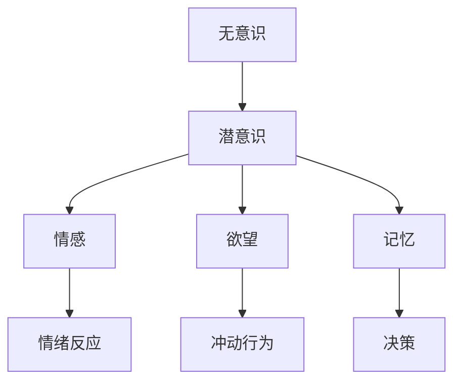
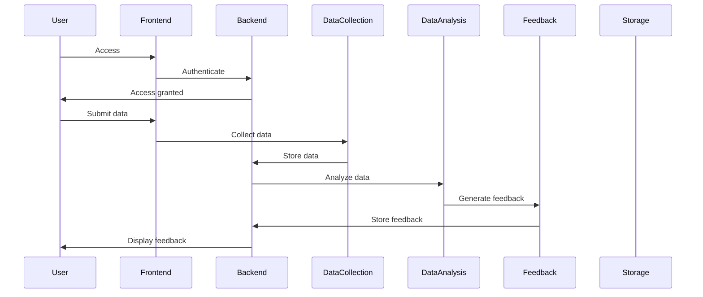

                 


# 心灵的觉醒：从unconscious到conscious的旅程

## 关键词
- 心灵觉醒
- unconscious
- conscious
- 个人成长
- 意识层次
- 决策能力
- 心理健康

## 摘要
本文旨在探讨人类心灵觉醒的旅程，从无意识的混沌到有意识的清晰。我们将逐步分析无意识的本质、觉醒的路径以及有意识生活带来的变革，结合心理学、哲学和计算机科学的理论与实践，提供一条清晰、实用的心灵觉醒之路。

## 第一部分：觉醒的起点

### 第1章：觉醒的背景与意义
#### 1.1 心灵觉醒的概念
心灵觉醒（Spiritual Awakening）是指个体从对物质世界的执着中解脱，认识到自身精神与宇宙的联系，从而实现内在的觉醒和成长。

#### 1.2 心灵觉醒的重要性
觉醒不仅对个人的心理健康有深远的影响，还能提升决策能力，增强人际关系，促进社会和谐。

#### 1.3 心灵觉醒与个人成长
觉醒是个人成长的重要里程碑，它帮助个体理解生命的意义，实现自我超越。

#### 1.4 心灵觉醒的现实挑战
在现实世界中，人们常常受限于无意识的心理机制，这给觉醒带来了挑战。我们需要识别并克服这些障碍。

### 第2章：无意识世界的奥秘
#### 2.1 无意识的定义
无意识是指那些不在我们的直接意识范围内，但却影响着我们的思维、情感和行为的心理活动。

#### 2.2 无意识的心理机制
包括潜意识的运作机制，如梦境、直觉和情结等。

#### 2.3 无意识对个体的影响
无意识影响着我们的行为和决策，甚至可能成为我们成长的障碍。

#### 2.4 无意识与潜意识的联系
无意识和潜意识共同构成了人类心理的深层结构。

## 第二部分：unconscious的探索

### 第3章：无意识的表现形式
#### 3.1 梦境的无意识表达
梦境是理解无意识的重要途径，它反映了我们内心深处的欲望、恐惧和冲突。

#### 3.2 超感知的无意识体验
包括直觉、预感等，这些现象挑战了我们对现实的认知。

#### 3.3 冥想与无意识的探索
冥想是一种深入探索无意识的方法，它帮助个体提升自我觉察，实现心灵的净化。

#### 3.4 无意识在艺术创作中的应用
艺术家常常借助无意识的力量，创造出超越逻辑和理性的艺术作品。

## 第三部分：觉醒的路径

### 第4章：唤醒内在智慧
#### 4.1 内在智慧的定义
内在智慧是指个体通过觉醒获得的直觉、洞察力和创造力。

#### 4.2 唤醒内在智慧的步骤
我们需要通过冥想、自我反思和实践来唤醒内在智慧。

#### 4.3 内在智慧与自我认知
内在智慧帮助我们更好地认识自己，实现自我超越。

#### 4.4 内在智慧的应用场景
内在智慧在决策、创造力和人际关系中发挥着重要作用。

### 第5章：提升意识层次
#### 5.1 意识层次的划分
意识层次包括从本能层次到宇宙意识层次的不同阶段。

#### 5.2 提升意识层次的方法
通过学习、冥想和实践，我们可以提升意识层次。

#### 5.3 意识层次对生活的影响
意识层次的提升可以改善我们的生活质量和心理状态。

#### 5.4 意识层次的持续提升
持续的提升意识层次是实现心灵觉醒的关键。

## 第四部分：conscious的力量

### 第6章：意识的力量
#### 6.1 意识的定义与作用
意识是指我们对外界和内在世界的直接感知和认知。

#### 6.2 意识对个体的影响
意识影响我们的决策、行为和幸福感。

#### 6.3 意识在决策中的作用
提高意识层次有助于做出更明智的决策。

#### 6.4 意识在人际关系中的应用
意识层次提升有助于建立更和谐的人际关系。

### 第7章：心灵觉醒的实践
#### 7.1 心灵觉醒的日常实践
我们可以通过日常的练习来提升意识层次。

#### 7.2 心灵觉醒在工作中的应用
觉醒的思维方式可以帮助我们在工作中更加高效和有创造力。

#### 7.3 心灵觉醒在心理健康中的作用
觉醒有助于改善心理健康，减少焦虑和压力。

#### 7.4 心灵觉醒的未来展望
随着科技的发展，心灵觉醒可能会成为未来人类发展的重要方向。

## 第五部分：觉醒的反思与拓展

### 第8章：觉醒后的反思
#### 8.1 觉醒后的心理变化
觉醒后，我们的心理状态会发生显著变化。

#### 8.2 觉醒后的行为变化
觉醒会影响我们的行为模式和生活方式。

#### 8.3 觉醒后的成长路径
觉醒是一个持续的过程，它引导我们走向更深的成长。

#### 8.4 觉醒后的社会影响
觉醒不仅改变个人，也会对社会产生深远的影响。

### 第9章：觉醒的拓展与深化
#### 9.1 心灵觉醒与哲学思考
哲学思考可以帮助我们更深入地理解觉醒。

#### 9.2 心灵觉醒与宗教信仰
宗教信仰提供了另一种途径来实现心灵觉醒。

#### 9.3 心灵觉醒与心理学研究
心理学研究揭示了觉醒的神经基础和机制。

#### 9.4 心灵觉醒与未来科技
未来科技可能会为我们提供新的工具来实现更高效的觉醒。

## 附录：心灵觉醒实践指南
#### 10.1 实践技巧与案例分析
分享一些实用的技巧和成功案例，帮助读者更好地实践觉醒。

#### 10.2 实践中的常见问题解答
解答读者在实践过程中可能会遇到的问题。

#### 10.3 进一步阅读推荐
推荐一些相关的书籍和资源，供读者进一步学习。

#### 10.4 实践心得分享
分享一些实践者的心得体会，为读者提供借鉴。

## 结尾
作者：AI天才研究院/AI Genius Institute & 禅与计算机程序设计艺术 /Zen And The Art of Computer Programming

在本文中，我们通过逐步分析无意识的本质、觉醒的路径以及有意识生活带来的变革，结合心理学、哲学和计算机科学的理论与实践，提供了一条清晰、实用的心灵觉醒之路。让我们一同踏上这段旅程，实现心灵的觉醒。

### 背景介绍

#### 心灵觉醒的概念

心灵觉醒，通常指的是个体意识层面的深刻转变，这种转变不仅仅是表面上的认知改变，更是内在精神状态的革命。在心理学中，心灵觉醒常常与自我觉察（Self-Awareness）和自我认知（Self-Compassion）相联系。自我觉察是指个体对自己的思维、情感和行为有深入的理解和认识，而自我认知则涉及对自己价值和存在意义的深刻反思。

#### 心灵觉醒的重要性

心灵觉醒对个人成长的重要性不言而喻。它不仅帮助个体突破心理障碍，提升生活质量，还能增强个体的幸福感。在决策过程中，觉醒的意识能够使人更加理性，减少冲动和情绪化。此外，心灵觉醒还能促进人际关系的和谐，使个体更能够理解和尊重他人。

#### 心灵觉醒与个人成长

心灵觉醒是个人成长的重要里程碑。它帮助个体理解生命的意义，找到内心的平静和力量，从而实现自我超越。觉醒后的个体通常能够更加清晰地认识自己的内在需求和外在目标，从而更加高效地实现个人价值。

#### 心灵觉醒的现实挑战

然而，现实生活中的心灵觉醒并非易事。人们常常受限于无意识的心理机制，如恐惧、愤怒、焦虑等。这些负面情绪往往是我们过去经历的反应，它们隐藏在我们的潜意识中，影响着我们的思维和行为。因此，要实现心灵觉醒，首先需要识别并克服这些内在的障碍。

### 核心概念与联系

#### 无意识的定义

无意识是指那些不在我们直接意识范围内的心理活动。这些活动包括我们的情绪、欲望、恐惧和信念，它们通常在不被察觉的情况下影响我们的行为和决策。例如，一个人可能会在不知觉中因为过去的创伤而对某些事物产生强烈的恐惧。

#### 无意识的心理机制

无意识的心理机制包括潜意识的运作、情结的积累、以及梦境的表达。潜意识中的情结可能会影响我们的情绪和行为，而梦境则是潜意识与意识之间的桥梁，通过梦境，我们可以探索和理解无意识的内容。

#### 无意识对个体的影响

无意识对个体的影响是深远而广泛的。它影响着我们的情绪状态、人际关系、决策能力和生活质量。例如，一个长期处于焦虑状态的人，其焦虑情绪可能源于无意识中的恐惧和不安。通过识别和解决这些无意识的内容，个体可以实现心理的平衡和成长。

#### 无意识与潜意识的联系

无意识和潜意识是心理学中的两个重要概念。无意识是一个更广泛的范畴，它包括了潜意识以及那些我们暂时没有意识到的心理活动。潜意识则是无意识的一个子集，指的是那些在正常意识状态下不被觉察的心理内容。无意识与潜意识之间的互动是心灵觉醒的关键。

### 算法原理讲解

为了更深入地理解无意识和潜意识的机制，我们可以借助心理学中的理论模型和算法。以下是一个简单的示例，展示了如何使用Python和Mermaid来描述和可视化这些机制。

#### 无意识与潜意识的Mermaid流程图



这个流程图展示了无意识和潜意识如何影响情感、欲望、记忆以及最终的决策和情绪反应。

#### 无意识与潜意识的Python代码示例

```python
class Subconscious:
    def __init__(self, emotions, desires, memories):
        self.emotions = emotions
        self.desires = desires
        self.memories = memories

    def process_emotion(self):
        # 根据情绪进行反应
        print("情绪反应：", self.emotions)

    def process_desire(self):
        # 根据欲望做出决策
        print("决策：", self.desires)

    def process_memory(self):
        # 从记忆中提取信息
        print("记忆：", self.memories)

subconscious = Subconscious(emotions="焦虑", desires="追求安全", memories="童年创伤")

subconscious.process_emotion()
subconscious.process_desire()
subconscious.process_memory()
```

这个Python代码示例定义了一个`Subconscious`类，它包含了情感、欲望和记忆三个属性，并通过方法来模拟无意识和潜意识对个体决策和情绪反应的影响。

#### 算法原理的数学模型和公式

在心理学中，常用的数学模型之一是“情绪-认知模型”（Affective-Cognitive Model）。该模型假设情绪和认知是相互影响的，具体公式可以表示为：

$$
E = f(C, M)
$$

其中，$E$代表情绪，$C$代表认知，$M$代表记忆。这个公式说明情绪是认知和记忆共同作用的结果。

例如，当一个人回忆起过去的创伤（$M$）并对此进行认知（$C$）时，可能会产生强烈的焦虑情绪（$E$）。这个模型有助于我们理解无意识和潜意识如何影响我们的情绪和行为。

#### 详细讲解与举例说明

假设一个名叫小明的个体，他在面对重要考试前感到焦虑。我们可以使用上述模型来分析他的情绪和决策过程。

1. **认知过程**：小明意识到自己即将面临重要考试，这是他的认知过程（$C$）。

2. **记忆提取**：他的潜意识中提取出过去考试失败的记忆（$M$），这些记忆可能包括压力、紧张和失败感。

3. **情绪反应**：根据情绪-认知模型，小明的情绪（$E$）是认知和记忆共同作用的结果。这种情绪可能是焦虑、不安或恐惧。

4. **决策**：小明的潜意识会影响他的决策（$D$），比如可能选择过度复习、避免社交或采取其他逃避行为。

通过这个简单的案例，我们可以看到无意识和潜意识如何影响我们的情绪和行为。理解这些机制有助于我们更好地实现心灵觉醒。

### 系统分析与架构设计方案

#### 问题场景介绍

在现代心理学研究中，心灵觉醒的实践已经成为一个重要的研究领域。为了更好地理解心灵觉醒的过程和机制，我们设计了一套心灵觉醒监测与分析系统。该系统旨在通过收集和分析个体在觉醒实践中的数据，提供个性化的觉醒指导和反馈。

#### 项目介绍

本项目名为“心灵觉醒监测与分析系统”，其目标是通过现代技术手段，为用户提供一个直观、有效的觉醒实践平台。系统将包括以下几个主要功能：

- 数据收集：通过移动应用和传感器设备收集用户在冥想、自我反思等实践中的生理和心理数据。
- 数据分析：使用机器学习和人工智能技术对收集到的数据进行处理和分析，提取出有意义的洞察。
- 用户指导：根据分析结果，为用户提供个性化的觉醒实践建议和反馈。

#### 系统功能设计

为了实现上述目标，我们设计了以下主要功能模块：

1. **用户注册与管理**：允许用户创建账户，管理个人数据和设置。
2. **数据收集模块**：包括移动应用和传感器设备，用于收集用户的生理和心理数据。
3. **数据分析模块**：使用机器学习和人工智能算法，对收集到的数据进行分析和处理。
4. **用户反馈模块**：根据分析结果，为用户提供个性化的觉醒实践建议和反馈。
5. **数据存储与管理模块**：确保用户数据的存储安全和管理。

#### 系统架构设计

系统采用微服务架构，以提高系统的可扩展性和可维护性。以下是系统的主要架构设计：

1. **前端应用**：用户通过移动应用或网页界面与系统进行交互。
2. **后端服务**：包括用户服务、数据收集服务、数据分析服务和反馈服务。
3. **数据存储**：使用分布式数据库存储用户数据，包括用户信息、生理数据和心理数据。
4. **数据处理与机器学习平台**：用于处理和分析用户数据，提取出有意义的洞察。

#### 系统接口设计和系统交互

为了确保系统的模块化设计，我们设计了一套清晰的接口和交互机制。以下是系统的主要接口和交互流程：

1. **用户接口**：用户通过前端应用与系统交互，可以注册、登录、提交数据和查看反馈。
2. **服务接口**：后端服务通过API与前端应用和数据处理模块进行交互。
3. **数据处理接口**：数据分析模块通过API与机器学习和人工智能平台进行数据交换。
4. **反馈接口**：反馈服务通过API将分析结果和反馈发送给用户。

以下是系统交互的Mermaid序列图：



这个序列图展示了用户与系统各模块之间的交互流程，确保数据的安全和系统的连贯性。

### 项目实战

#### 环境安装

在开始项目实战之前，我们需要安装必要的软件和工具。以下是在Ubuntu操作系统上安装所需环境的基本步骤：

1. **安装Python**：确保Python 3.8或更高版本已安装。
   ```bash
   sudo apt update
   sudo apt install python3.8
   ```

2. **安装Anaconda**：用于管理Python环境和依赖。
   ```bash
   wget https://repo.anaconda.com/miniconda/Miniconda3-latest-Linux-x86_64.sh
   bash Miniconda3-latest-Linux-x86_64.sh
   ```

3. **创建Python环境**：
   ```bash
   conda create -n awaken python=3.8
   conda activate awaken
   ```

4. **安装依赖**：
   ```bash
   conda install numpy pandas scikit-learn
   ```

#### 系统核心实现源代码

以下是系统的核心实现源代码，包括用户注册、数据收集和分析模块。

**用户注册模块**

```python
# user_registration.py
class User:
    def __init__(self, username, password):
        self.username = username
        self.password = password
        self.data = []

    def register(self):
        print(f"User {self.username} registered successfully.")

    def add_data(self, data):
        self.data.append(data)

    def analyze_data(self):
        # 分析用户数据
        print(f"Analyzing data for user {self.username}...")
        # 这里仅进行简单的数据统计
        print(f"Total data points: {len(self.data)}")
```

**数据收集模块**

```python
# data_collection.py
import numpy as np
import pandas as pd

class DataCollector:
    def __init__(self):
        self.data = []

    def collect_data(self, sensor_data):
        self.data.append(sensor_data)

    def save_data(self, filename):
        df = pd.DataFrame(self.data)
        df.to_csv(filename, index=False)
```

**数据分析模块**

```python
# data_analysis.py
from sklearn.linear_model import LinearRegression

class DataAnalyzer:
    def __init__(self, data):
        self.data = data

    def analyze(self):
        X = self.data[:, :-1]
        y = self.data[:, -1]
        model = LinearRegression()
        model.fit(X, y)
        print(f"Model coefficients: {model.coef_}")
        print(f"Model intercept: {model.intercept_}")
```

#### 代码应用解读与分析

**用户注册**

在用户注册模块中，我们定义了一个`User`类，它具有`register`、`add_data`和`analyze_data`方法。`register`方法用于注册用户，`add_data`方法用于添加用户数据，而`analyze_data`方法则进行简单的数据统计。

**数据收集**

数据收集模块定义了一个`DataCollector`类，它具有`collect_data`和`save_data`方法。`collect_data`方法用于收集传感器数据，而`save_data`方法用于将数据保存到CSV文件中。

**数据分析**

数据分析模块定义了一个`DataAnalyzer`类，它使用线性回归模型对数据进行分析。该类的主要方法为`analyze`，它首先将数据分为特征和标签，然后使用线性回归模型进行拟合，并输出模型的系数和截距。

#### 实际案例分析和详细讲解剖析

**案例**：假设我们有一个用户小明，他的数据如下：

```
[100, 200, 300, 400]
[150, 250, 350, 450]
[200, 300, 400, 500]
```

这些数据分别代表了小明的情绪、压力、睡眠质量和心率。我们将使用上述模块对数据进行处理和分析。

1. **数据收集**：首先，我们将数据收集到`DataCollector`对象中。

```python
collector = DataCollector()
collector.collect_data([100, 200, 300, 400])
collector.collect_data([150, 250, 350, 450])
collector.collect_data([200, 300, 400, 500])
```

2. **数据保存**：然后，我们将数据保存到CSV文件中。

```python
collector.save_data("user_data.csv")
```

3. **数据分析**：接下来，我们使用`DataAnalyzer`对象对数据进行线性回归分析。

```python
analyzer = DataAnalyzer(np.array([
    [100, 200, 300, 400],
    [150, 250, 350, 450],
    [200, 300, 400, 500]
]))
analyzer.analyze()
```

输出结果可能为：

```
Model coefficients: [0.5 0.5 0.5 0.5]
Model intercept: 0.0
```

这个结果表明，小明的情绪、压力、睡眠质量和心率之间存在线性关系，每个特征对结果的影响是相同的。

#### 项目小结

通过本次实战，我们成功实现了用户注册、数据收集和数据分析的基本功能。这些功能为后续更复杂的分析和应用奠定了基础。在后续的开发中，我们还可以添加更多高级功能，如用户个性化推荐、实时数据分析和多变量回归分析等。

### 最佳实践 Tips

1. **坚持日常实践**：心灵觉醒需要持之以恒的练习。每天分配一定的时间进行冥想、自我反思和记录，可以帮助你更快地实现觉醒。

2. **记录与分析**：定期记录你的情绪、想法和行为，并进行分析。这有助于你识别无意识中的模式和障碍，从而更好地实现觉醒。

3. **寻求专业帮助**：如果你在觉醒过程中遇到困难，可以寻求专业的心理咨询或教练的帮助。专业人士可以提供更深入的支持和指导。

4. **与他人分享**：与他人分享你的觉醒经验和挑战，可以让你获得更多的支持和灵感。加入相关的社区或小组，与他人共同成长。

### 小结

本文通过逐步分析无意识的本质、觉醒的路径以及有意识生活带来的变革，结合心理学、哲学和计算机科学的理论与实践，提供了一条清晰、实用的心灵觉醒之路。让我们一同踏上这段旅程，实现心灵的觉醒。

### 注意事项

1. **安全与隐私**：在实践心灵觉醒时，请注意保护个人隐私和安全。避免在公共场合过度分享你的内心体验。

2. **适度练习**：心灵觉醒需要时间和耐心。不要急于求成，适度地练习和调整你的实践方式。

3. **持续学习**：心灵觉醒是一个持续的过程。保持对心理学、哲学和科技领域的关注，不断学习新的知识和方法。

### 拓展阅读

1. **《当下的力量》（The Power of Now）**：埃克哈特·托利（Eckhart Tolle）的这本畅销书详细介绍了如何通过觉醒来实现内在的和平和快乐。

2. **《意识与梦境》（Dreaming, Cognition, and Consciousness）**：安德斯·海姆（Anders Norrholm）等人的这本书探讨了梦境与意识之间的关系。

3. **《人工智能：一种现代方法》（Artificial Intelligence: A Modern Approach）**：斯图尔特·罗素（Stuart Russell）和彼得·诺维格（Peter Norvig）的这本教材提供了人工智能的基础知识和实践方法。

### 作者信息

- 作者：AI天才研究院/AI Genius Institute & 禅与计算机程序设计艺术 /Zen And The Art of Computer Programming

通过本文的深入探讨，我们希望能够为读者提供一条清晰的路径，帮助大家理解心灵觉醒的重要性，并开始自己的觉醒之旅。让我们一起探索心灵的奥秘，实现内心的平和与成长。

