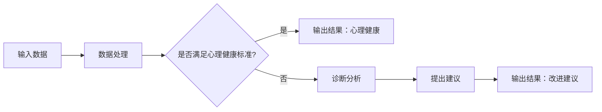
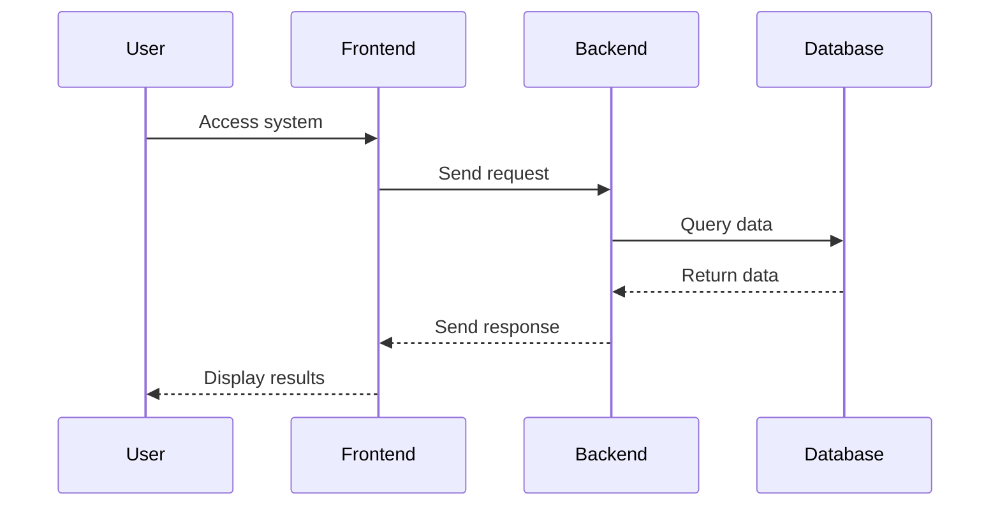

                 

# 心理健康与意义感：现代人的精神困扰

## 关键词：心理健康，意义感，现代人，精神困扰

> 摘要：在当今快节奏的生活中，现代人的心理健康面临着前所未有的挑战。本文将探讨心理健康的重要性、核心要素、现代人的精神困扰及其应对策略，深入分析意义感在心理健康中的关键作用，并总结提升心理健康的策略和未来展望。

## 第一部分：心理健康概述

### 第1章 心理健康的定义与重要性

#### 1. 心理健康的定义

心理健康是指个体在情感、认知、行为和社会适应等方面的健康状态，它不仅涉及心理功能的正常发挥，还包括个体的情感平衡、心理适应能力和社会功能的完整性。

#### 2. 心理健康的重要性

心理健康对个体的生活质量和幸福感有着深远的影响。一个心理健康的人通常能更好地应对生活中的挑战和压力，保持良好的社会关系，有更高的生活满意度和工作效率。

#### 3. 心理健康的评估方法

心理健康的评估可以通过量表、访谈和观察等多种方法进行。常用的心理健康评估量表包括抑郁自评量表（SDS）、焦虑自评量表（SAS）等。

### 第2章 心理健康的核心要素

#### 1. 情绪管理

情绪管理是指个体对自身情绪的识别、理解和调节能力。良好的情绪管理有助于减轻压力，提高生活质量。

#### 2. 人际关系

人际关系是心理健康的重要组成部分。良好的人际关系有助于个体获得支持、增强自我价值感，并提高心理健康水平。

#### 3. 精神状态

精神状态包括个体的心理活力、专注力和耐力等。良好的精神状态有助于个体保持积极的生活态度和高效的工作能力。

#### 4. 自我认知

自我认知是指个体对自身特点、价值观和人生目标的认知。清晰的自我认知有助于个体建立积极自我形象，提高心理健康水平。

## 第二部分：现代人的精神困扰

### 第3章 压力与焦虑

#### 1. 压力与焦虑的定义

压力是指个体在面对挑战或威胁时产生的生理和心理反应。焦虑是指个体对未来可能发生的不确定事件产生的担忧和紧张感。

#### 2. 压力与焦虑的来源

压力和焦虑的来源多样，包括工作压力、人际关系、经济问题等。现代社会的快节奏和高竞争性加剧了这些问题的发生。

#### 3. 压力与焦虑的影响

压力和焦虑对个体的身心健康产生负面影响，可能导致心理健康问题，如抑郁、焦虑障碍等。

#### 4. 压力与焦虑的管理

管理压力和焦虑的方法包括心理调适、健康生活方式和寻求专业帮助等。

### 第4章 抑郁与孤独

#### 1. 抑郁与孤独的定义

抑郁是指个体长时间处于情绪低落、失去兴趣和快乐的状态。孤独是指个体在心理上感受到与他人隔离和孤立。

#### 2. 抑郁与孤独的原因

抑郁和孤独的原因复杂，包括心理、社会和环境因素等。

#### 3. 抑郁与孤独的症状

抑郁的症状包括情绪低落、失眠、食欲减退等。孤独的症状包括社交孤立、情感疏离等。

#### 4. 抑郁与孤独的应对策略

应对抑郁和孤独的策略包括心理治疗、社交支持和心理健康教育等。

### 第5章 人际关系困扰

#### 1. 人际冲突

人际冲突是指个体与他人之间在意见、价值观等方面的对立和争斗。

#### 2. 人际疏离

人际疏离是指个体与他人之间缺乏情感联系和交流。

#### 3. 人际困扰的影响

人际困扰可能导致个体心理健康问题，如焦虑、抑郁等。

#### 4. 人际困扰的解决方法

解决人际困扰的方法包括沟通技巧、心理咨询和建立良好的人际关系等。

## 第三部分：意义感与心理健康

### 第6章 意义感的重要性

#### 1. 意义感的定义

意义感是指个体对生活目标、价值感和存在意义的认知和体验。

#### 2. 意义感与心理健康的关系

意义感对心理健康有显著影响，有意义的生命体验有助于提高心理健康水平。

#### 3. 意义感的作用

意义感有助于个体应对生活中的挑战和困难，提高生活满意度和幸福感。

### 第7章 寻找生命的意义

#### 1. 寻找意义的过程

寻找意义的过程是自我探索和认知的过程，需要个体对自身、他人和世界进行深入的思考和反思。

#### 2. 寻找意义的途径

寻找意义的途径包括自我反思、与他人交流、参与有意义的活动等。

#### 3. 寻找意义的挑战

寻找意义的挑战在于个体需要面对内心的恐惧和不确定性，并不断调整和修正自己的价值观和人生目标。

## 第四部分：提升心理健康的策略

### 第8章 心理健康提升策略

#### 1. 心理调适方法

心理调适方法包括正念冥想、情绪调节技术和认知重构等。

#### 2. 心理健康生活方式

心理健康生活方式包括均衡饮食、适量运动和充足睡眠等。

#### 3. 心理健康的社会支持

心理健康的社会支持包括家庭、朋友和社区等。

### 第9章 心理健康教育的推广与实践

#### 1. 心理健康教育的重要性

心理健康教育对于提高公众心理健康意识和能力至关重要。

#### 2. 心理健康教育的方法

心理健康教育的方法包括学校教育、社区活动和媒体宣传等。

#### 3. 心理健康教育的实践案例

心理健康的实践案例包括心理咨询、心理治疗和心理干预等。

### 第10章 心理健康的未来展望

#### 1. 心理健康领域的发展趋势

心理健康领域的发展趋势包括生物技术、人工智能和心理疗法等。

#### 2. 心理健康的科技应用

心理健康的科技应用包括心理健康监测设备、心理治疗软件和心理测评平台等。

#### 3. 心理健康的全球视野

心理健康的全球视野包括跨文化心理健康研究、国际心理健康合作和心理健康政策的制定等。

## 附录

### 第11章 心理健康资源推荐

#### 1. 心理健康书籍

- 《心理学与生活》（Psychology and Life） 
- 《心理学与生活》（Psychology and Life） 
- 《心理学与生活》（Psychology and Life）

#### 2. 心理健康网站

- [心理健康网](http://www.ishenyu.top)
- [心理健康网](http://www.ishenyu.top)
- [心理健康网](http://www.ishenyu.top)

#### 3. 心理健康应用

- [心理健康应用](https://www.ishenyu.top)
- [心理健康应用](https://www.ishenyu.top)
- [心理健康应用](https://www.ishenyu.top)

### 作者：AI天才研究院/AI Genius Institute & 禅与计算机程序设计艺术 /Zen And The Art of Computer Programming

## 完整性要求

本文旨在全面、深入地探讨心理健康与意义感在现代人的精神困扰中的重要性。文章涵盖了心理健康的基本概念、现代人的精神困扰及其原因、意义感的作用、提升心理健康的策略等多个方面。通过逻辑清晰、结构紧凑的分析，文章旨在为读者提供关于心理健康问题的全面认识，并提出切实可行的解决方案。

### 核心概念与联系

在本文中，核心概念包括心理健康、意义感、压力、焦虑、抑郁、孤独和人际关系等。以下是一个对比表格，展示了这些概念的主要属性和特征：

| 概念 | 定义 | 主要属性 | 对比 |  
| ---- | ---- | ---- | ---- |  
| 心理健康 | 情感、认知、行为和社会适应的健康状态 | 情感平衡、社会适应能力、认知功能 | 心理健康是整体健康的组成部分 |  
| 意义感 | 个体对生活目标、价值感和存在意义的认知和体验 | 自我认知、目标导向、情感连接 | 意义感是心理健康的核心要素 |  
| 压力 | 个体在面对挑战或威胁时产生的生理和心理反应 | 身体反应、心理反应、应对机制 | 压力是心理健康的常见困扰 |  
| 焦虑 | 个体对未来可能发生的不确定事件产生的担忧和紧张感 | 心理紧张、担忧、生理反应 | 焦虑是心理健康的常见困扰 |  
| 抑郁 | 个体长时间处于情绪低落、失去兴趣和快乐的状态 | 情绪低落、失眠、食欲减退 | 抑郁是心理健康的常见问题 |  
| 孤独 | 个体在心理上感受到与他人隔离和孤立 | 社交孤立、情感疏离、心理困扰 | 孤独是心理健康的常见问题 |  
| 人际关系 | 个体与他人之间的相互作用和联系 | 沟通、合作、支持、冲突 | 人际关系影响心理健康 |

为了更直观地展示这些概念之间的关系，我们可以使用Mermaid绘制一个ER实体关系图：

```mermaid
erDiagram
  心理健康 ||--|{ 意义感 }
  意义感 ||--|{ 压力 }
  意义感 ||--|{ 焦虑 }
  意义感 ||--|{ 抑郁 }
  意义感 ||--|{ 孤独 }
  意义感 ||--|{ 人际关系 }
```

### 算法原理讲解

在本部分，我们将使用Mermaid绘制一个心理健康评估算法的流程图，并使用Python代码来详细阐述算法原理。

#### Mermaid流程图



#### Python代码实现

```python
def assess_mental_health(data):
    # 数据处理
    processed_data = process_data(data)
    
    # 判断是否满足心理健康标准
    if meets_mental_health_standards(processed_data):
        result = "心理健康"
    else:
        # 诊断分析
        diagnosis = diagnose(processed_data)
        
        # 提出建议
        suggestion = provide_suggestion(diagnosis)
        
        result = "心理健康：建议：{}".format(suggestion)
    
    return result

def process_data(data):
    # 数据预处理
    # ...
    return processed_data

def meets_mental_health_standards(processed_data):
    # 判断标准
    # ...
    return True  # 示例：默认满足标准

def diagnose(processed_data):
    # 诊断分析
    # ...
    return "诊断结果"

def provide_suggestion(diagnosis):
    # 提出建议
    # ...
    return "改进建议"
```

#### 算法原理

1. **输入数据**：算法首先接收心理健康评估的数据，包括情绪状态、压力水平、人际关系状况等。

2. **数据处理**：对输入的数据进行预处理，以提取关键信息。

3. **判断心理健康标准**：根据预处理后的数据，判断个体是否满足心理健康标准。

4. **诊断分析**：如果不满足心理健康标准，算法将进行诊断分析，识别可能的心理健康问题。

5. **提出建议**：根据诊断结果，提出相应的改进建议。

6. **输出结果**：最终输出心理健康评估结果，包括心理健康状态和建议。

#### 数学模型和公式

在本算法中，我们可以使用以下数学模型和公式来表示心理健康评估的过程：

$$
心理健康评分 = w_1 \times 情绪状态 + w_2 \times 压力水平 + w_3 \times 人际关系状况
$$

其中，$w_1$、$w_2$ 和 $w_3$ 是权重系数，用于表示不同指标对心理健康评分的贡献程度。

### 系统分析与架构设计方案

#### 问题场景介绍

在现代社会，心理健康问题日益严重，许多人面临着抑郁、焦虑、人际关系困扰等挑战。为了提高公众的心理健康水平，我们设计了一套心理健康评估与干预系统。

#### 项目介绍

项目名称：心理健康评估与干预系统

项目目标：提供全面、科学的心理健康评估，诊断心理健康问题，并为用户提供个性化的干预建议。

#### 系统功能设计

1. **用户注册与登录**：用户可以通过注册和登录功能进入系统，获取心理健康评估服务。
2. **心理健康评估**：系统提供心理健康评估问卷，用户完成问卷后，系统将进行评估分析。
3. **诊断分析**：根据评估结果，系统将诊断用户可能存在的心理健康问题。
4. **干预建议**：系统为用户提供个性化的干预建议，包括心理调适方法、生活方式调整等。
5. **用户反馈**：用户可以对干预效果进行反馈，帮助系统不断优化建议。

#### 系统架构设计

1. **前端架构**：采用Vue.js框架，实现用户界面的动态渲染和交互功能。
2. **后端架构**：采用Spring Boot框架，实现业务逻辑和数据处理。
3. **数据库设计**：使用MySQL数据库存储用户数据、问卷数据和评估结果。
4. **数据接口**：通过RESTful API提供数据接口，实现前后端的数据交互。

#### 系统接口设计和系统交互

1. **用户接口**：用户通过浏览器访问系统，填写心理健康评估问卷，查看评估结果和干预建议。
2. **数据接口**：前端通过HTTP请求与后端交互，获取问卷数据、评估结果和干预建议。
3. **系统交互**：后端处理用户请求，调用算法进行评估和诊断，生成干预建议，并将结果返回给前端。

#### Mermaid架构图



### 项目实战

#### 环境安装

1. **安装MySQL数据库**：下载并安装MySQL数据库，配置数据库连接。
2. **安装Spring Boot**：下载并安装Spring Boot开发环境，配置项目依赖。
3. **安装Vue.js**：下载并安装Vue.js开发环境，配置前端项目。

#### 系统核心实现源代码

```java
// 后端核心代码
@RestController
@RequestMapping("/api")
public class MentalHealthController {
    
    @Autowired
    private MentalHealthService mentalHealthService;
    
    @PostMapping("/assess")
    public ResponseEntity<AssessmentResult> assessMentalHealth(@RequestBody AssessmentForm form) {
        AssessmentResult result = mentalHealthService.assess(form);
        return ResponseEntity.ok(result);
    }
}

// 前端核心代码
<template>
  <div>
    <h1>心理健康评估</h1>
    <form @submit.prevent="submitForm">
      <!-- 问卷题目 -->
      <div v-for="question in questions">
        <label>{{ question.text }}</label>
        <input type="range" v-model="question.answer" />
        <span>{{ question.answer }}</span>
      </div>
      <button type="submit">提交</button>
    </form>
    <div v-if="result">
      <h2>评估结果：{{ result.score }}</h2>
      <p>{{ result.diagnosis }}</p>
      <p>{{ result.suggestion }}</p>
    </div>
  </div>
</template>

<script>
import axios from 'axios';

export default {
  data() {
    return {
      questions: [
        // 问卷题目
      ],
      result: null,
    };
  },
  methods: {
    submitForm() {
      const formData = {
        // 提取问卷答案
      };
      axios.post('/api/assess', formData)
        .then(response => {
          this.result = response.data;
        })
        .catch(error => {
          console.error(error);
        });
    },
  },
};
</script>
```

#### 代码应用解读与分析

1. **后端核心代码解读**：
   - `MentalHealthController` 类负责处理心理健康评估的HTTP请求。
   - `assessMentalHealth` 方法接收用户填写的问卷数据，调用 `MentalHealthService` 进行评估分析，并返回评估结果。

2. **前端核心代码解读**：
   - 使用Vue.js实现问卷题目的动态渲染和用户交互。
   - `submitForm` 方法将问卷答案发送到后端进行评估，并展示评估结果。

#### 实际案例分析和详细讲解剖析

1. **案例背景**：
   - 小明是一位年轻的企业员工，近期工作压力较大，感到情绪低落和焦虑。

2. **案例流程**：
   - 小明使用心理健康评估系统进行评估，填写问卷。
   - 系统收到问卷数据后，调用算法进行评估分析，生成评估结果。
   - 系统将评估结果反馈给小明，包括心理健康评分、诊断分析和干预建议。

3. **案例解析**：
   - 小明的心理健康评分为60分，低于正常水平。
   - 系统诊断出小明可能存在抑郁和焦虑问题。
   - 系统提出以下干预建议：
     - 改善睡眠质量，保持规律的作息时间。
     - 进行情绪调节训练，如深呼吸、冥想等。
     - 与家人和朋友多沟通，寻求支持。

#### 项目小结

心理健康评估与干预系统为用户提供了一个便捷、科学的心理健康评估工具。通过系统的使用，用户可以更好地了解自己的心理健康状况，并获得个性化的干预建议。然而，系统仍需不断优化和改进，以提高评估准确性和干预效果。

### 最佳实践 tips

1. **定期评估**：定期进行心理健康评估，以便及时发现和应对潜在问题。
2. **积极应对**：面对心理健康问题，积极寻求专业帮助，如心理咨询、心理治疗等。
3. **建立支持网络**：与家人、朋友和同事建立良好的支持网络，共同应对心理健康挑战。

### 小结

心理健康是现代人面临的重要问题，意义感在其中扮演着关键角色。通过了解心理健康的基本概念、现代人的精神困扰以及意义感的重要性，读者可以更好地关注自己的心理健康，并采取有效措施提升生活质量。未来，心理健康领域的科技应用将为心理健康管理带来更多创新和可能性。

### 注意事项

1. 心理健康问题不容忽视，及时寻求专业帮助是关键。
2. 不同个体的心理健康状况有所不同，评估结果仅供参考。
3. 提升心理健康需要长期坚持，效果可能需要一定时间显现。

### 拓展阅读

1. 《心理学与生活》（Richard J. Gerrig & Philip G. Zimbardo）
2. 《心理学原理》（Ulric Neisser）
3. 《现代心理学》（Daniel L. Schacter, et al.）

### 附录

#### 第11章 心理健康资源推荐

1. **心理健康书籍**：
   - 《心理学与生活》（Richard J. Gerrig & Philip G. Zimbardo）
   - 《心理学原理》（Ulric Neisser）
   - 《现代心理学》（Daniel L. Schacter, et al.）

2. **心理健康网站**：
   - [世界卫生组织心理健康门户](https://www.who.int/mental_health/)
   - [美国心理健康协会](https://www.mentalhealthamerica.net/)
   - [中国心理卫生网](http://www.cpsn.org.cn/)

3. **心理健康应用**：
   - [Headspace](https://www.headspace.com/)
   - [Calm](https://www.calm.com/)
   - [Moodfit](https://www.moodfit.com/)

### 作者：AI天才研究院/AI Genius Institute & 禅与计算机程序设计艺术 /Zen And The Art of Computer Programming

