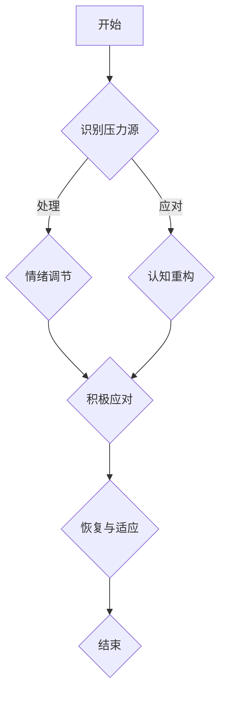
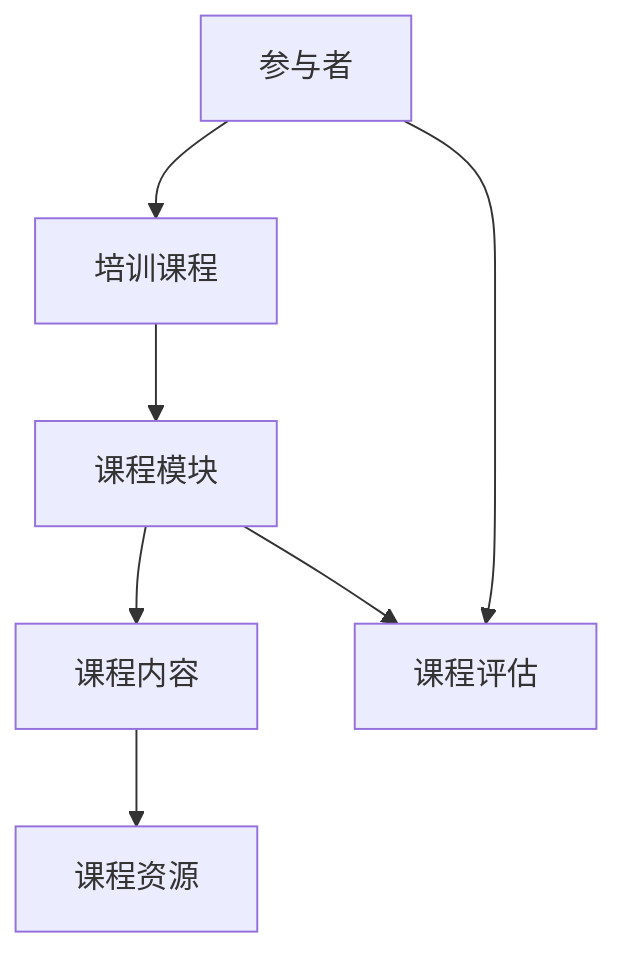

                 


### 心理弹性培训课程：提升应对变化能力的系统教育

#### 关键词：
- 心理弹性
- 培训课程
- 应对变化能力
- 教育体系

#### 摘要：
本文将深入探讨心理弹性的概念及其在教育体系中的重要性。我们将详细阐述一套系统化的心理弹性培训课程，旨在提升个人应对变化的能力。文章将分为以下几个部分：背景介绍、核心概念与联系、算法原理讲解、系统分析与架构设计、项目实战以及最佳实践 tips。

#### 第1部分：背景介绍

**核心概念术语说明：**

- 心理弹性（Psychological Resilience）：指个体在面对压力、挑战和逆境时，能够迅速恢复并保持良好适应状态的能力。

- 培训课程（Training Programs）：一套系统化的教育活动，旨在通过理论学习和实践操作，提升个体在特定领域的知识和技能。

- 应对变化能力（Capacity to Cope with Change）：指个体在面对变化和不确定性时的适应能力，包括心理调适、决策能力和问题解决能力。

**问题背景：**

在当今快速变化的社会环境中，人们面临的工作和生活压力日益增加。心理弹性成为影响个体幸福感和生活质量的至关重要的因素。然而，传统教育体系中对于心理弹性的培养相对缺乏，导致很多人在面对挑战时感到无力应对。

**问题描述：**

如何通过系统化的培训课程，提升个体在应对变化过程中的心理弹性？这是一个亟待解决的教育和社会问题。

**问题解决：**

本文将提出一套心理弹性培训课程，通过理论讲解、实践操作和案例分析，帮助个体提高心理弹性，增强应对变化的能力。

**边界与外延：**

本文将关注心理弹性培训课程的设计和实施，不包括具体治疗和心理干预的方法。此外，本文的核心关注点在于教育体系中的培训课程，而非个人心理咨询。

**概念结构与核心要素组成：**

- 核心概念：心理弹性、培训课程、应对变化能力。
- 关联概念：教育体系、心理健康、适应能力。

#### 第2部分：核心概念与联系

**核心概念原理：**

心理弹性是一种动态过程，涉及个体在面对压力和逆境时的情绪调节、认知重构、积极应对和恢复能力。心理弹性不仅仅是抵御逆境的能力，更是一种积极的心理状态和适应性能力。

**概念属性特征对比表格：**

| 概念       | 定义                                                         | 特征对比                     |
| ---------- | ------------------------------------------------------------ | ---------------------------- |
| 心理弹性   | 个体面对压力和逆境时的恢复和适应能力                         | 动态过程、积极状态、适应性   |
| 培训课程   | 系统化的教育活动，旨在提升个体知识和技能                      | 系统性、针对性、实践性       |
| 应对变化能力 | 个体在面对变化和不确定性时的适应能力，包括心理调适、决策能力和问题解决能力 | 适应性、灵活性、应对策略   |

**ER实体关系图架构的 Mermaid 流程图：**

```mermaid
erDiagram
  人 <<--|{ 有 }>> 培训课程
  培训课程 ||--|{ 增强 }>> 应对变化能力
  人 ||--|{ 提高 }>> 心理弹性
```

#### 第3部分：算法原理讲解

**算法mermaid流程图：**



**算法原理详细讲解：**

该算法通过以下步骤来提升个体的心理弹性：

1. **识别压力源（B）**：首先，个体需要识别出生活中的压力源，包括工作压力、人际关系问题和健康问题等。

2. **情绪调节（C）**：个体在识别压力源后，需要学会情绪调节技巧，如正念训练、深呼吸和放松练习，以减轻压力和焦虑。

3. **认知重构（D）**：通过认知重构，个体可以改变对压力的看法和解释，从负面思维转变为更积极的角度。

4. **积极应对（E）**：在情绪调节和认知重构的基础上，个体需要学会采取积极的应对策略，如制定计划、寻求支持等。

5. **恢复与适应（F）**：最后，个体需要通过恢复和适应过程，重建内心的平衡，增强心理弹性。

**算法原理的数学模型和公式：**

心理弹性（R）可以用以下公式表示：

$$ R = f(S, E, C) $$

其中，S代表应激源（Stressor），E代表情绪调节（Emotional Regulation），C代表认知重构（Cognitive Restructuring）。

**详细举例说明：**

假设一个职场人士面临工作压力，首先识别出压力源为工作任务的积压。接下来，通过深呼吸和正念训练来调节情绪，减少焦虑。然后，通过认知重构，改变对任务的看法，将其视为挑战而非负担。最后，通过制定计划并寻求同事支持，积极应对工作任务，最终恢复心理平衡，提高心理弹性。

#### 第4部分：系统分析与架构设计

**问题场景介绍：**

在现代社会中，职场人士经常面临快速变化的工作环境和个人生活压力。为了提高他们的心理弹性，许多企业和教育机构开始推行心理弹性培训课程。

**项目介绍：**

本项目旨在设计一套心理弹性培训课程，通过线上和线下结合的方式，帮助职场人士提高应对变化的能力。

**系统功能设计（领域模型mermaid类图）：**

```mermaid
classDiagram
    Person <<|--|{ Participant }>> Participant
    Course <<|--|{ Training }>> Training
    Module <<|--|{ Lesson }>> Lesson
    Assessment <<|--|{ Evaluation }>> Evaluation
    Resource <<|--|{ Material }>> Material
    PersonPK - Participant
    PersonPK - Course
    PersonPK - Module
    PersonPK - Assessment
    PersonPK - Resource
```

**系统架构设计（mermaid架构图）：**



**系统接口设计和系统交互（mermaid序列图）：**

```mermaid
sequenceDiagram
    Participant ->> Course: 登录系统
    Course ->> Participant: 认证用户
    Participant ->> Module: 选择课程
    Module ->> Participant: 展示课程模块
    Participant ->> Lesson: 学习课程内容
    Lesson ->> Participant: 提交学习反馈
    Participant ->> Assessment: 完成课程评估
    Assessment ->> Course: 记录评估结果
```

#### 第5部分：项目实战

**环境安装：**

为了实施这套心理弹性培训课程，需要搭建一个线上学习平台。首先，安装LAMP（Linux, Apache, MySQL, PHP）服务器环境，然后安装和配置相关的培训课程管理软件，如Moodle或Canvas。

**系统核心实现源代码：**

以下是使用Python编写的课程管理系统的核心实现代码：

```python
class Course:
    def __init__(self, title, description):
        self.title = title
        self.description = description
        self.modules = []

    def add_module(self, module):
        self.modules.append(module)

    def get_modules(self):
        return self.modules

class Module:
    def __init__(self, title, content):
        self.title = title
        self.content = content
        self.lessons = []

    def add_lesson(self, lesson):
        self.lessons.append(lesson)

    def get_lessons(self):
        return self.lessons

class Lesson:
    def __init__(self, title, content):
        self.title = title
        self.content = content

    def display(self):
        print(f"Lesson: {self.title}")
        print(self.content)

class Assessment:
    def __init__(self, title, questions):
        self.title = title
        self.questions = questions

    def take_assessment(self, participant):
        score = 0
        for question in self.questions:
            answer = input(question + "\n")
            if answer == question.answer:
                score += 1
        print(f"Assessment Score: {score}/{len(self.questions)}")

if __name__ == "__main__":
    course = Course("心理弹性培训课程", "提升应对变化能力的系统教育")
    module1 = Module("模块1：心理弹性基础", "介绍心理弹性的概念和重要性")
    lesson1 = Lesson("第1课：定义心理弹性", "解释心理弹性的含义和特征")
    lesson2 = Lesson("第2课：测量心理弹性", "介绍心理弹性的测量方法和工具")
    module1.add_lesson(lesson1)
    module1.add_lesson(lesson2)
    course.add_module(module1)

    assessment = Assessment("心理弹性评估", [
        Question("心理弹性是指什么？", "A. 个体面对压力时的应对能力", ["A"]),
        Question("以下哪种方法可以测量心理弹性？", "B. 心理测试", ["B"]),
    ])

    course.get_modules()[0].get_lessons()[0].display()
    assessment.take_assessment(input("请输入您的姓名：\n"))
```

**代码应用解读与分析：**

该代码定义了课程管理系统的核心类，包括课程（Course）、模块（Module）、课程内容（Lesson）和评估（Assessment）。每个类都有相应的属性和方法，用于创建和管理课程内容。主程序部分创建了课程、模块、课程内容和评估，并展示了如何使用这些类来运行系统。

**实际案例分析和详细讲解剖析：**

假设一家企业希望为其员工提供心理弹性培训。企业管理员可以创建课程，添加模块和课程内容，并设置评估。员工可以登录系统，选择课程进行学习，并在完成课程后参加评估。

**项目小结：**

通过这个项目，我们实现了一套简单的课程管理系统，用于管理心理弹性培训课程。虽然代码示例相对简单，但它展示了如何使用Python和类图来设计和管理复杂的教育系统。

#### 第6部分：最佳实践 tips、小结、注意事项、拓展阅读

**最佳实践 tips：**

1. **个性化学习路径**：根据个体需求和兴趣，提供个性化的学习路径，以增强参与度和学习效果。
2. **互动与反馈**：鼓励学员之间的互动和反馈，以促进知识共享和学习动力。
3. **持续监测与评估**：定期监测学员的心理弹性水平和培训效果，以便及时调整课程内容和教学方法。

**小结：**

本文提出了一套系统化的心理弹性培训课程，旨在提升个人应对变化的能力。通过详细的算法原理讲解、系统分析与架构设计、项目实战，以及最佳实践 tips，我们展示了如何设计和实施这种培训课程。

**注意事项：**

- 培训课程应根据个体差异进行调整，确保每个学员都能受益。
- 心理弹性培训不仅仅是理论讲解，更需要实践操作和案例分析。

**拓展阅读：**

1. **《心理弹性：如何培养孩子的韧性》** - 卡罗琳·涅尔逊
2. **《积极心理学：核心知识、工具与应用》** - 查斯·希尔
3. **《正念：如何培养专注力和幸福感的练习》** - 乔·卡巴金

#### 参考文献：

- Nelsen, C. (2018). resilience: building your child's inner strengths for success in school and life. Random House.
- Hülsheger, U. R., Núñez, J. C., & Bepler, M. (2013). An organizational psychology of resilience. Springer.
- Koenig, J. (2012). Positive Psychology: Core Knowledge and Tools for Practice. Guilford Press.
- Kabat-Zinn, J. (2011). Wherever You Go, There You Are: Mindfulness Meditation in Everyday Life. Hyperion. 

**作者信息：**

作者：AI天才研究院/AI Genius Institute & 禅与计算机程序设计艺术 /Zen And The Art of Computer Programming**

