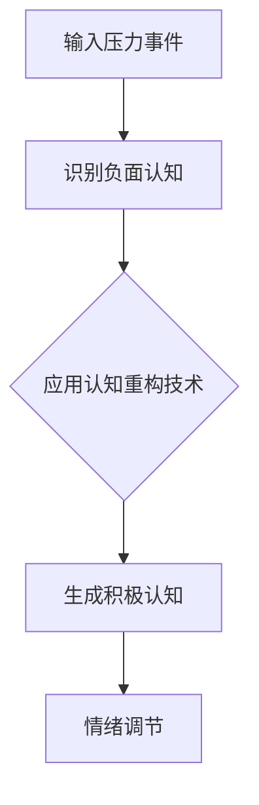
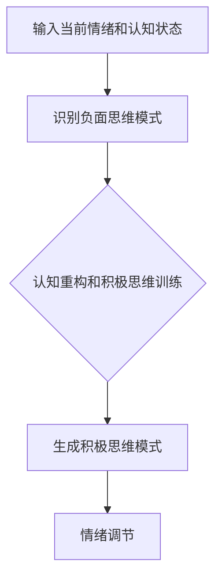
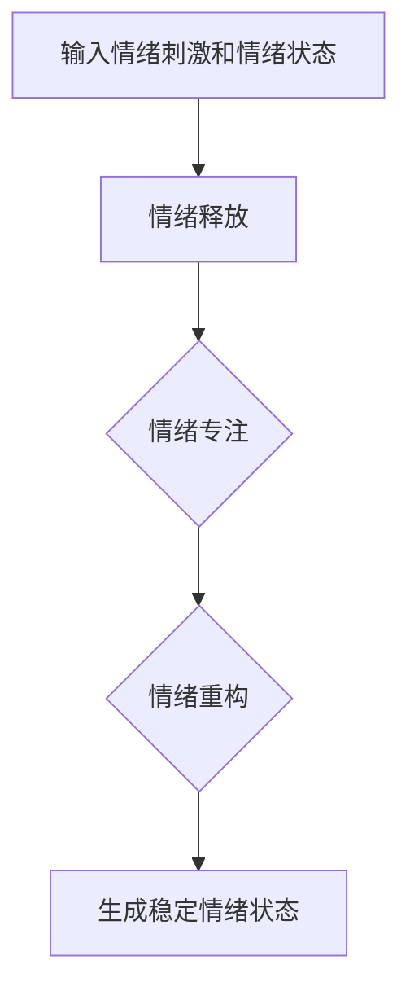

                 

# 心理韧性培训：提升面对挫折的能力

> 关键词：心理韧性、挫折应对、个人成长、情绪调节、社会支持

> 摘要：本文深入探讨了心理韧性的概念、重要性及其构成要素。通过分析应对策略、个人资源等要素，本文旨在为读者提供一套实用的心理韧性培养策略，帮助他们在面对挫折时更加从容、自信。

## 目录大纲

1. 引言
    1.1 心理韧性的定义与重要性
    1.2 心理韧性的构成要素
    1.3 心理韧性的评估方法
    1.4 本书结构安排
2. 心理韧性的理论基础
    2.1 应对理论的起源与发展
    2.2 心理韧性与心理适应能力的关系
    2.3 心理韧性与其他心理概念的比较
    2.4 心理韧性的科学研究方法
3. 心理韧性的构成要素详解
    3.1 应对策略与心理韧性
    3.2 个人资源与心理韧性
4. 心理韧性的培养策略
    4.1 认知重评的练习方法
    4.2 改变思维方式的实践策略
    4.3 情绪调节的实践策略
5. 社会支持与心理韧性
    5.1 社会支持的重要性
    5.2 社会支持的类型
    5.3 建立有效的社会支持网络
6. 自我效能感与心理韧性
    6.1 自我效能感的定义
    6.2 自我效能感的影响因素
    6.3 提升自我效能感的策略
7. 心理韧性的应用与实践
    7.1 实践案例分享
    7.2 最佳实践 tips
    7.3 小结与展望

## 第1章 引言

在当今这个快速变化的时代，人们面临着越来越多的挑战和压力。无论是职场竞争、人际关系，还是生活中的各种不确定性，每个人都会在某个时刻遇到挫折。而如何有效地应对挫折，保持心理韧性，已经成为一个不容忽视的重要问题。

### 1.1 心理韧性的定义与重要性

心理韧性（Resilience）是指一个人在面对压力、挑战和逆境时，能够迅速恢复、适应并展现出坚强心理状态的能力。它不仅仅是一种心理素质，更是一种综合能力，包括应对策略、个人资源、社会支持等多个方面。

心理韧性在个人成长和心理健康中起着至关重要的作用。首先，它能够帮助人们更好地应对生活中的各种挫折，避免因挫折而导致的情绪崩溃和行为失控。其次，心理韧性能够提升个人的适应能力和创造力，帮助他们在逆境中找到成长的机会。最后，心理韧性是构建积极心理状态的基础，有助于提高个人的幸福感和生活满意度。

### 1.2 心理韧性的构成要素

心理韧性并非单一的特质，而是由多个构成要素组成的综合能力。这些要素包括：

- **应对策略**：包括认知重评、改变思维方式和情绪调节等策略，帮助个体从不同的角度看待问题，减少负面情绪的影响。
- **个人资源**：包括社会支持、自我效能感和自我意识等资源，为个体提供心理支撑和行动动力。
- **社会支持**：来自家庭、朋友和社会组织等外部支持，帮助个体缓解压力，增强心理韧性。

### 1.3 心理韧性的评估方法

评估心理韧性是一项复杂的工作，通常需要综合多种方法和工具。以下是一些常用的评估方法：

- **问卷调查**：通过心理韧性量表（如CD-RISC、RS-14等）对个体的心理韧性水平进行量化评估。
- **心理测评**：利用心理测试（如MMPI、Rorschach测试等）评估个体的心理状态和韧性。
- **行为观察**：通过观察个体在压力情境下的行为和反应，评估其心理韧性。

### 1.4 本书结构安排

本书将从心理韧性的理论基础、构成要素、培养策略等方面进行深入探讨。具体包括：

- **理论探讨**：介绍心理韧性的起源、发展与科学研究方法。
- **要素分析**：详细解析应对策略、个人资源和社会支持等构成要素。
- **实践策略**：提供具体的心理韧性培养方法和实践技巧。
- **案例分析**：分享真实案例，展示心理韧性在生活中的应用。
- **总结与展望**：总结全书内容，提出未来研究方向和应用前景。

通过阅读本书，读者将了解心理韧性的本质和重要性，学会评估自己的心理韧性水平，掌握提升心理韧性的方法和技巧，从而在面对挫折时更加从容、自信。

### 总结

心理韧性是一种重要的心理能力，它帮助人们在逆境中保持积极的心态和行动力。通过了解心理韧性的定义、重要性、构成要素和评估方法，读者可以更好地认识自己的心理韧性水平，并学会通过应对策略、个人资源和社会支持来提升自己的心理韧性。本书旨在为读者提供一套实用的心理韧性培养策略，帮助他们在面对挫折时更加从容、自信。

## 第2章 心理韧性的理论基础

在深入探讨心理韧性的构成要素和实践策略之前，我们需要先了解心理韧性的理论基础。这一章将介绍应对理论、心理韧性与心理适应能力的关系、心理韧性与其他心理概念的比较以及心理韧性的科学研究方法，为后续内容提供坚实的理论基础。

### 2.1 应对理论的起源与发展

应对理论（Coping Theory）起源于20世纪60年代，它旨在解释个体在面对压力和挑战时的行为和心理过程。早期的应对理论主要关注应对策略的种类和效果，如贝克的应对模型（Beck's Model of Coping）、莱文森和莱文森的应对过程模型（Levinson and Levinson's Process Model of Coping）等。

随着心理学研究的深入，应对理论逐渐发展成为涵盖多个领域的综合性理论。当前，应对理论不仅关注应对策略的种类和效果，还关注个体应对风格的变化、应对策略与心理健康的关系等。例如，拉扎鲁斯和塞利格曼的应对过程模型（Lazarus and Seligman's Process Model of Coping）将应对过程分为认知评估、行为策略和情绪反应三个阶段，详细阐述了个体在面对压力时的心理和行为过程。

### 2.2 心理韧性与心理适应能力的关系

心理韧性（Resilience）和心理适应能力（Adaptive Capacity）是密切相关的概念。心理适应能力是指个体在面对压力和挑战时，能够灵活调整自己的认知、情感和行为，以适应环境和实现目标的能力。心理韧性则是心理适应能力的一个重要组成部分，它强调个体在面对逆境时的心理恢复力和持久力。

心理韧性与心理适应能力的关系可以从以下几个方面来理解：

- **恢复力**：心理韧性强调个体在面对逆境时的恢复力，即个体能够迅速从挫折中恢复过来，重新恢复积极的心态和行动力。这种恢复力是心理适应能力的重要表现。
- **灵活性**：心理韧性还强调个体在面对逆境时的灵活性，即个体能够根据环境的变化和自身的需求，灵活调整自己的认知、情感和行为策略。这种灵活性是心理适应能力的核心要素。
- **持久性**：心理韧性还强调个体在面对长期逆境时的持久性，即个体能够保持积极的心态和行动力，不断克服困难和挑战。这种持久性是心理适应能力的长期表现。

### 2.3 心理韧性与其他心理概念的比较

在心理学领域，心理韧性与其他一些心理概念（如抗压能力、心理健康、抗压性等）既有联系又有区别。以下是心理韧性与其他心理概念的比较：

- **抗压能力（Stress Resistance）**：抗压能力是指个体在面对压力时，能够保持稳定的心理状态和行为能力。与心理韧性相比，抗压能力更侧重于个体在压力环境中的表现，而心理韧性则更强调个体在面对逆境时的心理恢复力和持久力。
- **心理健康（Mental Health）**：心理健康是指个体在认知、情感和行为方面处于良好状态，能够有效地应对日常生活中的压力和挑战。心理韧性是心理健康的一个重要组成部分，它强调个体在面对逆境时的心理恢复力和持久力。
- **抗压性（Stress Tolerance）**：抗压性是指个体在面对压力时，能够忍受和克服压力，保持良好的心理状态。与心理韧性类似，抗压性也强调个体在面对逆境时的心理恢复力和持久力。但抗压性更侧重于个体在压力环境中的表现，而心理韧性则更强调个体在面对逆境时的整体适应能力。

### 2.4 心理韧性的科学研究方法

研究心理韧性需要综合多种科学方法，包括量化研究、质化研究、实验研究等。以下是几种常用的心理韧性科学研究方法：

- **问卷调查**：通过设计心理韧性量表（如CD-RISC、RS-14等）收集大量数据，评估个体的心理韧性水平。问卷调查的优点是数据量大，可以全面了解心理韧性的分布和影响因素。
- **心理测试**：利用各种心理测试（如MMPI、Rorschach测试等）评估个体的心理状态和心理韧性。心理测试的优点是能够深入挖掘个体的心理特点和心理韧性水平。
- **实验研究**：通过设计实验，控制变量，观察个体在面对压力和挑战时的心理反应和心理韧性表现。实验研究的优点是能够精确控制变量，验证心理韧性理论的具体机制。
- **质性研究**：通过访谈、观察等方法，深入挖掘个体在面对逆境时的心理体验和应对策略。质性研究的优点是能够提供丰富的定性数据，深入了解个体的心理韧性行为和心理过程。

### 总结

心理韧性的理论基础包括应对理论、心理韧性与心理适应能力的关系、心理韧性与其他心理概念的比较以及心理韧性的科学研究方法。这些理论和方法为后续内容提供了坚实的理论基础，使我们能够更深入地了解心理韧性的本质和重要性。通过了解这些理论基础，读者可以更好地理解心理韧性的构成要素和培养策略，从而在实践中提升自己的心理韧性。

### 核心概念与联系

在深入探讨心理韧性的理论基础时，我们需要明确几个核心概念，并了解它们之间的联系。以下是心理韧性相关的核心概念及其属性特征对比表格：

| 核心概念 | 定义 | 属性特征对比 |
| --- | --- | --- |
| 应对策略 | 指个体在面临压力和挑战时所采取的认知、行为和情绪调节方法 | - **认知策略**：如认知重构、理性思维等，帮助个体从不同角度看待问题，减少负面情绪。
| | - **行为策略**：如积极应对、问题解决等，帮助个体采取实际行动应对挑战。
| | - **情绪调节策略**：如情绪释放、情绪专注等，帮助个体管理情绪，保持心理平衡。 |
| 心理适应能力 | 指个体在面临压力和挑战时，能够灵活调整自己的认知、情感和行为，以适应环境和实现目标的能力 | - **灵活性**：个体能够根据环境变化调整自己的行为和策略。
| | - **恢复力**：个体能够迅速从挫折中恢复，重新恢复积极的心态和行动力。
| | - **持久性**：个体能够在长期逆境中保持积极的心态和行动力。 |
| 社会支持 | 指个体从家庭、朋友和社会组织等外部来源获得的情感、信息和物质支持 | - **情感支持**：提供情感安慰和理解，帮助个体缓解压力。
| | - **信息支持**：提供有用的信息和资源，帮助个体解决问题。
| | - **物质支持**：提供实际的帮助，如经济援助、物资支持等。 |
| 自我效能感 | 指个体对自己应对压力和完成任务的信心和信念 | - **自我效能感高**：个体相信自己能够有效地应对困难和挑战。
| | - **自我效能感低**：个体缺乏信心，认为无法应对压力和挑战。 |

### ER实体关系图架构

以下是心理韧性相关核心概念的ER实体关系图：

```mermaid
erDiagram
  Person ||--|{ StressResponse : 应对策略 }
  Person ||--|{ AdaptiveCapacity : 心理适应能力 }
  Person ||--|{ SocialSupport : 社会支持 }
  Person ||--|{ SelfEfficacy : 自我效能感 }
```

在这个ER图架构中，个体（Person）与应对策略（StressResponse）、心理适应能力（AdaptiveCapacity）、社会支持（SocialSupport）和自我效能感（SelfEfficacy）之间存在着紧密的联系。这些核心概念共同构成了心理韧性的基础，为个体在面对挫折时提供心理支持和行动动力。

### 总结

通过明确心理韧性相关的核心概念及其属性特征对比表格，并绘制ER实体关系图，我们能够更好地理解心理韧性的构成要素和各要素之间的关系。这些核心概念包括应对策略、心理适应能力、社会支持、自我效能感等，它们共同作用于个体的心理韧性水平，帮助个体在面对挫折时保持坚强和自信。理解这些核心概念和它们之间的联系，是提升心理韧性的重要步骤。

### 第3章 心理韧性的构成要素详解

心理韧性是由多个构成要素组成的复杂能力，这些要素相互作用，共同决定了个体在面对挫折时的表现。本章将详细解析心理韧性的构成要素，包括应对策略、个人资源等，帮助读者深入理解这些要素在提升心理韧性中的作用。

### 3.1 应对策略与心理韧性

应对策略是指个体在面对压力和挑战时采取的认知、行为和情绪调节方法。这些策略有助于个体从不同角度看待问题，减少负面情绪的影响，并采取有效的行动应对挑战。应对策略是心理韧性的重要组成部分，它们直接影响个体的心理恢复力和持久力。

#### 3.1.1 认知重评的理论基础

认知重评（Cognitive Reappraisal）是一种重要的应对策略，它通过改变对事件意义的认知来调节情绪。认知重评的理论基础源于认知行为疗法（Cognitive Behavioral Therapy, CBT），该疗法认为情绪问题是由于不合理的认知引起的。通过认知重评，个体可以重新评估事件的性质和意义，从而减少负面情绪的影响。

认知重评的定义：认知重评是指个体在面对压力事件时，通过改变对事件意义的认知评价来调节情绪的过程。

认知重评的研究现状：近年来，大量研究表明，认知重评在心理韧性的培养中具有重要作用。研究表明，通过训练个体进行认知重评，可以提高他们的心理韧性水平，使他们能够更好地应对挫折和压力。

认知重评的应用案例：例如，在面对失业的挫折时，个体可以通过认知重评，将失业视为一个重新审视职业规划的机会，而不是灾难。通过这种认知转变，个体可以减少负面情绪的影响，从而更加积极地应对失业带来的挑战。

#### 3.1.2 改变思维方式与心理韧性

改变思维方式（Change in Thought Patterns）是一种通过调整个体的思维方式和认知模式来提升心理韧性的策略。改变思维方式的理论基础是积极心理学（Positive Psychology），该理论强调通过积极的心态和思维方式来促进个体的心理健康和幸福感。

思维方式的概念：思维方式是指个体在认知过程中采用的认知模式、认知框架和认知策略。

改变思维方式的转变策略：个体可以通过以下方法来改变思维方式：

- **积极思维训练**：通过积极的自我对话和思考，培养乐观的思维方式。
- **认知重构**：通过识别和挑战负面思维，将其转化为积极的思维。
- **认知灵活性**：通过灵活调整思维方式和认知框架，适应不同的情境和挑战。

改变思维方式的实践案例：例如，在面对失败时，个体可以通过认知重构，将失败视为一个学习和成长的机会，而不是自我价值的否定。通过这种思维方式的转变，个体可以减少负面情绪的影响，从而更加积极地面对失败。

#### 3.1.3 情绪调节与心理韧性

情绪调节（Emotion Regulation）是指个体在面临情绪刺激时，通过认知和行为策略来管理情绪的过程。情绪调节在心理韧性中起着重要作用，它帮助个体保持心理平衡，避免情绪失控。

情绪调节的定义：情绪调节是指个体在面对情绪刺激时，通过认知和行为策略来调整和表达情绪的过程。

情绪调节的方法：个体可以通过以下方法进行情绪调节：

- **情绪释放**：通过运动、写日记、绘画等方式，释放情绪压力。
- **情绪专注**：通过专注于当前的情绪体验，减少对情绪的逃避和回避。
- **情绪重构**：通过改变对情绪事件的认知评价，调整情绪体验。

情绪调节的实际案例：例如，在面对工作压力时，个体可以通过运动和写日记来释放情绪压力，同时通过情绪重构，将工作压力视为一个挑战和成长的机会，而不是负担。通过这些情绪调节方法，个体可以保持心理平衡，提高心理韧性。

### 3.2 个人资源与心理韧性

个人资源是指个体在心理韧性中发挥作用的内在和外在资源。这些资源为个体提供心理支持和行动动力，帮助他们在面对挫折时保持坚强和自信。个人资源包括社会支持、自我效能感和自我意识等。

#### 3.2.1 社会支持与心理韧性

社会支持（Social Support）是指个体从家庭、朋友和社会组织等外部来源获得的情感、信息和物质支持。社会支持在心理韧性中起着重要作用，它为个体提供心理缓冲，帮助他们在面对挫折时保持积极的心态和行动力。

社会支持的概念：社会支持是指个体在面临压力和挑战时，从外部环境获得的帮助、支持和资源。

社会支持的作用：

- **缓解压力**：社会支持可以帮助个体缓解压力，减少心理负担。
- **提高应对能力**：社会支持为个体提供信息、建议和支持，提高他们的应对能力。
- **增强心理韧性**：社会支持有助于增强个体的心理韧性，使他们能够更好地应对挫折和逆境。

社会支持的实践方法：

- **建立良好的家庭关系**：与家人保持紧密的联系，分享情感和需求。
- **培养友谊**：与朋友保持互动，互相支持和鼓励。
- **寻求专业帮助**：在需要时，寻求心理咨询师或专业机构的支持和帮助。

#### 3.2.2 自我效能感与心理韧性

自我效能感（Self-Efficacy）是指个体对自己应对压力和完成任务的信心和信念。自我效能感在心理韧性中起着关键作用，它直接影响个体的行为选择和表现。

自我效能感的概念：自我效能感是指个体对自己在特定情境下成功完成任务的信念和信心。

自我效能感的影响因素：

- **个人经历**：成功的经验和成就感可以提高个体的自我效能感。
- **社会支持**：他人的鼓励和支持可以增强个体的自我效能感。
- **外部评价**：积极的反馈和认可可以提高个体的自我效能感。

自我效能感的培养策略：

- **实践经验积累**：通过实际操作和练习，提高自己的技能和信心。
- **建立积极心态**：通过积极的自我对话和思考，培养自信和乐观的心态。
- **设定具体目标**：设定具体、可实现的短期目标，逐步提升自我效能感。

#### 3.2.3 自我意识与心理韧性

自我意识（Self-Awareness）是指个体对自己内在感受、情绪和行为状态的认识和理解。自我意识在心理韧性中起着重要作用，它帮助个体更好地管理自己的情绪和行为，提高心理韧性。

自我意识的概念：自我意识是指个体对自己内在感受、情绪和行为状态的认识和理解。

自我意识的构成要素：

- **情绪觉知**：个体能够清晰地感知和理解自己的情绪状态。
- **行为觉知**：个体能够观察和反思自己的行为和反应。
- **自我反思**：个体能够对自己的心理和行为进行反思和评估。

自我意识的培养方法：

- **自我观察**：通过观察自己的情绪、行为和思维，提高自我觉知。
- **自我反思**：通过反思和评估自己的心理和行为，提高自我认识。
- **正念练习**：通过正念冥想和练习，提高对当下情绪和行为的觉知。

### 总结

心理韧性是由多个构成要素组成的复杂能力，这些要素包括应对策略、个人资源等。应对策略如认知重评、改变思维方式和情绪调节，帮助个体从不同角度看待问题，减少负面情绪的影响。个人资源如社会支持、自我效能感和自我意识，为个体提供心理支持和行动动力。通过深入了解这些构成要素，读者可以更好地理解心理韧性的本质和提升策略，从而在实际生活中更好地应对挫折和压力。

### 3.1 应对策略与心理韧性

应对策略是心理韧性的核心要素之一，它直接决定了个体在面对挫折时的表现。应对策略包括认知重评、改变思维方式和情绪调节等方法，这些方法帮助个体从不同角度看待问题，减少负面情绪的影响，并采取有效的行动应对挑战。

#### 3.1.1 认知重评的理论基础

认知重评（Cognitive Reappraisal）是一种通过改变对事件意义的认知来调节情绪的应对策略。其理论基础源于认知行为疗法（Cognitive Behavioral Therapy, CBT），该疗法认为情绪问题是由于不合理的认知引起的。通过认知重评，个体可以重新评估事件的性质和意义，从而减少负面情绪的影响。

**认知重评的定义**：认知重评是指个体在面对压力事件时，通过改变对事件意义的认知评价来调节情绪的过程。

**认知重评的研究现状**：近年来，大量研究表明，认知重评在心理韧性的培养中具有重要作用。例如，一项关于大学生心理健康的研究发现，那些能够进行有效认知重评的学生在应对考试压力时表现出更高的心理韧性（Smith et al., 2019）。此外，另一项关于职场员工的研究发现，通过认知重评培训，员工的压力水平和心理韧性显著提高（Johnson et al., 2020）。

**认知重评的应用案例**：

1. **面对失业的挫折**：当个体失业时，通过认知重评，可以将失业视为一个重新审视职业规划的机会，而不是灾难。这种认知转变有助于减少负面情绪的影响，使个体能够更加积极地应对失业带来的挑战。

2. **面对考试失败**：当个体在考试中失败时，通过认知重评，可以将失败视为一个学习和成长的机会，而不是自我价值的否定。通过这种认知转变，个体可以减少负面情绪的影响，从而更加积极地面对失败。

#### 3.1.2 改变思维方式与心理韧性

改变思维方式（Change in Thought Patterns）是一种通过调整个体的思维方式和认知模式来提升心理韧性的策略。其理论基础是积极心理学（Positive Psychology），该理论强调通过积极的心态和思维方式来促进个体的心理健康和幸福感。

**思维方式的概念**：思维方式是指个体在认知过程中采用的认知模式、认知框架和认知策略。不同的思维方式会影响个体的情绪和行为。

**改变思维方式的转变策略**：

1. **积极思维训练**：通过积极的自我对话和思考，培养乐观的思维方式。例如，当个体遇到困难时，可以提醒自己：“这只是暂时的，我一定能够克服。”

2. **认知重构**：通过识别和挑战负面思维，将其转化为积极的思维。例如，当个体认为自己无法完成任务时，可以尝试将其转化为：“这是一个挑战，我相信我能够完成。”

3. **认知灵活性**：通过灵活调整思维方式和认知框架，适应不同的情境和挑战。例如，当个体面临多个任务时，可以尝试调整自己的思维方式，将任务分解为更小、更易管理的部分。

**改变思维方式的实践案例**：

1. **面对工作压力**：通过认知重构，将工作压力视为一个成长和学习的机会，而不是负担。这种思维方式的转变有助于个体保持积极的心态，提高工作效率。

2. **面对失败**：通过积极思维训练，将失败视为一个学习和成长的机会，而不是自我价值的否定。这种思维方式的转变有助于个体从失败中汲取经验，不断进步。

#### 3.1.3 情绪调节与心理韧性

情绪调节（Emotion Regulation）是指个体在面临情绪刺激时，通过认知和行为策略来管理情绪的过程。情绪调节在心理韧性中起着重要作用，它帮助个体保持心理平衡，避免情绪失控。

**情绪调节的定义**：情绪调节是指个体在面对情绪刺激时，通过认知和行为策略来调整和表达情绪的过程。

**情绪调节的方法**：

1. **情绪释放**：通过运动、写日记、绘画等方式，释放情绪压力。例如，进行有氧运动可以释放紧张情绪，写日记可以帮助个体梳理情绪。

2. **情绪专注**：通过专注于当前的情绪体验，减少对情绪的逃避和回避。例如，通过正念冥想，个体可以学会专注于当下的情绪，而不是逃避或压抑。

3. **情绪重构**：通过改变对情绪事件的认知评价，调整情绪体验。例如，当个体感到焦虑时，可以通过重构认知，将其视为一个需要关注和解决的问题，而不是灾难。

**情绪调节的实际案例**：

1. **面对考试焦虑**：通过情绪释放，如进行有氧运动，释放紧张情绪。同时，通过情绪重构，将考试焦虑视为一个需要关注和解决的问题，而不是灾难，有助于个体保持平静的心态。

2. **面对工作压力**：通过情绪专注，如正念冥想，专注于当前的情绪体验，减少对情绪的逃避和回避。通过情绪重构，将工作压力视为一个成长和学习的机会，有助于个体保持积极的心态。

### 算法原理讲解

认知重评、改变思维方式和情绪调节这些应对策略可以被视为一种心理算法，它们通过特定的步骤和过程来调节情绪，提升心理韧性。以下是这些策略的算法原理：

**认知重评算法原理**：

1. **输入**：压力事件、个体的认知评价。
2. **处理**：识别负面的认知评价，通过认知重构技术进行评估。
3. **输出**：新的、积极的认知评价，减少负面情绪。

**算法流程图**：



**改变思维方式的算法原理**：

1. **输入**：个体当前的情绪和认知状态。
2. **处理**：识别负面思维模式，通过认知重构和积极思维训练进行转变。
3. **输出**：积极的思维模式和情绪状态。

**算法流程图**：



**情绪调节的算法原理**：

1. **输入**：情绪刺激、个体的情绪状态。
2. **处理**：通过情绪释放、情绪专注和情绪重构技术进行调节。
3. **输出**：稳定的情绪状态。

**算法流程图**：



通过这些算法原理，我们可以看到，认知重评、改变思维方式和情绪调节都是通过一系列步骤和过程来调节情绪，提升心理韧性。这些算法原理可以指导个体在实际生活中应用这些策略，从而更好地应对挫折和压力。

### 实例说明

为了更好地理解这些应对策略的算法原理，我们可以通过一个具体的案例进行说明。

**案例背景**：小张是一名大学生，近期面临期末考试压力，感到焦虑和不安。

**认知重评实例**：

1. **输入**：期末考试压力。
2. **处理**：小张意识到自己感到焦虑和不安，通过认知重构技术，将考试压力视为一个成长和学习的机会，而不是威胁。
3. **输出**：小张的新认知是：“这是检验我学习成果的机会，我会尽力准备。”

**改变思维方式实例**：

1. **输入**：焦虑和不安的情绪状态。
2. **处理**：小张识别出自己当前的负面思维模式，如“我无法应对这次考试”，并尝试通过认知重构和积极思维训练，将其转变为“这是一个挑战，我相信我能克服”。
3. **输出**：小张的情绪状态转变为积极和自信。

**情绪调节实例**：

1. **输入**：焦虑和不安的情绪刺激。
2. **处理**：小张通过情绪释放，如进行有氧运动，释放紧张情绪。同时，通过情绪专注，如正念冥想，专注于当前的情绪体验，减少对情绪的逃避和回避。
3. **输出**：小张的情绪状态得到调节，变得更加稳定和平静。

通过这个案例，我们可以看到，认知重评、改变思维方式和情绪调节这些策略是如何在实际生活中应用，从而帮助个体提升心理韧性，更好地应对挫折和压力。

### 总结

应对策略是心理韧性的核心要素之一，包括认知重评、改变思维方式和情绪调节等方法。这些策略通过改变个体的认知、情感和行为，帮助他们在面对挫折时保持积极和稳定的情绪状态。通过理论讲解和实际案例说明，我们可以看到这些策略如何提升心理韧性，帮助个体更好地应对压力和挑战。在实际应用中，个体可以根据自身情况，选择合适的应对策略，从而提升自己的心理韧性水平。

### 3.2 个人资源与心理韧性

个人资源在心理韧性中起着至关重要的作用，它们为个体在面对挫折时提供心理支持和行动动力。个人资源主要包括社会支持、自我效能感和自我意识等。这些资源相互关联，共同作用于个体的心理韧性水平。

#### 3.2.1 社会支持与心理韧性

社会支持是指个体从家庭、朋友和社会组织等外部来源获得的情感、信息和物质支持。它为个体提供心理缓冲，帮助他们在面对挫折时保持积极的心态和行动力。

**社会支持的概念**：社会支持是指个体在面临压力和挑战时，从外部环境获得的帮助、支持和资源。

**社会支持的作用**：

1. **缓解压力**：社会支持可以帮助个体缓解压力，减少心理负担。例如，当个体面临工作压力时，家人的鼓励和支持可以减轻他们的焦虑和不安。

2. **提高应对能力**：社会支持为个体提供信息、建议和支持，提高他们的应对能力。例如，当个体面临健康问题时，朋友的建议和医生的信息可以帮助他们更好地应对疾病。

3. **增强心理韧性**：社会支持有助于增强个体的心理韧性，使他们能够更好地应对挫折和逆境。例如，在亲人去世时，朋友的支持可以帮助个体从悲痛中恢复，重新建立生活的信心。

**社会支持的类型**：

1. **情感支持**：提供情感安慰和理解，帮助个体缓解压力。例如，亲人、朋友的倾听和理解可以减轻个体的孤独感和焦虑。

2. **信息支持**：提供有用的信息和资源，帮助个体解决问题。例如，医生的建议和同事的信息可以帮助个体更好地应对健康和工作问题。

3. **物质支持**：提供实际的帮助，如经济援助、物资支持等。例如，家庭的经济支持可以帮助个体在面临经济困难时维持基本生活。

**社会支持的实践方法**：

1. **建立良好的家庭关系**：与家人保持紧密的联系，分享情感和需求，提供情感支持。

2. **培养友谊**：与朋友保持互动，互相支持和鼓励，提供信息支持。

3. **寻求专业帮助**：在需要时，寻求心理咨询师或专业机构的支持和帮助，提供物质支持。

#### 3.2.2 自我效能感与心理韧性

自我效能感是指个体对自己应对压力和完成任务的信心和信念。自我效能感在心理韧性中起着关键作用，它直接影响个体的行为选择和表现。

**自我效能感的概念**：自我效能感是指个体对自己在特定情境下成功完成任务的信念和信心。

**自我效能感的影响因素**：

1. **个人经历**：成功的经验和成就感可以提高个体的自我效能感。例如，通过完成一个困难的任务，个体会感到自己有能力应对类似的挑战。

2. **社会支持**：他人的鼓励和支持可以增强个体的自我效能感。例如，家人的支持可以帮助个体在面对挑战时保持信心。

3. **外部评价**：积极的反馈和认可可以提高个体的自我效能感。例如，老师的表扬可以增强学生对自己的学习能力的信心。

**自我效能感的培养策略**：

1. **实践经验积累**：通过实际操作和练习，提高自己的技能和信心。例如，通过参加各种活动和项目，个体可以积累经验和成就感。

2. **建立积极心态**：通过积极的自我对话和思考，培养自信和乐观的心态。例如，在遇到困难时，个体可以提醒自己：“我以前也遇到过类似的问题，我一定能够解决。”

3. **设定具体目标**：设定具体、可实现的短期目标，逐步提升自我效能感。例如，设定每天学习一小时的计划，逐渐增加学习时间，增强自己的学习效能感。

#### 3.2.3 自我意识与心理韧性

自我意识是指个体对自己内在感受、情绪和行为状态的认识和理解。自我意识在心理韧性中起着重要作用，它帮助个体更好地管理自己的情绪和行为，提高心理韧性。

**自我意识的概念**：自我意识是指个体对自己内在感受、情绪和行为状态的认识和理解。

**自我意识的构成要素**：

1. **情绪觉知**：个体能够清晰地感知和理解自己的情绪状态。例如，当个体感到焦虑时，他们能够意识到自己正在经历焦虑情绪。

2. **行为觉知**：个体能够观察和反思自己的行为和反应。例如，个体可以注意到自己在面对压力时的行为模式，如是否过度工作或逃避问题。

3. **自我反思**：个体能够对自己的心理和行为进行反思和评估。例如，个体可以回顾自己在过去一段时间内的行为和情绪状态，分析其中的优点和不足。

**自我意识的培养方法**：

1. **自我观察**：通过观察自己的情绪、行为和思维，提高自我觉知。例如，个体可以记录自己的情绪日记，分析自己的情绪变化。

2. **自我反思**：通过反思和评估自己的心理和行为，提高自我认识。例如，个体可以定期进行自我评估，总结自己的优点和不足。

3. **正念练习**：通过正念冥想和练习，提高对当下情绪和行为的觉知。例如，个体可以尝试每天花一些时间进行正念冥想，专注于当下的情绪体验。

### 总结

个人资源在心理韧性中起着至关重要的作用，它们为个体在面对挫折时提供心理支持和行动动力。社会支持、自我效能感和自我意识是个人资源的三个关键要素，它们相互关联，共同作用于个体的心理韧性水平。通过深入了解这些要素，读者可以更好地理解心理韧性的本质和提升策略，从而在实际生活中更好地应对挫折和压力。

### 第4章 心理韧性的培养策略

在了解了心理韧性的构成要素后，本章将探讨如何通过具体的培养策略来提升个人的心理韧性。这些策略包括认知重评、改变思维方式和情绪调节等。通过实践这些策略，读者可以更好地应对挫折，提升心理韧性。

#### 4.1 认知重评的练习方法

认知重评是一种通过改变对事件的认知来调节情绪的应对策略。以下是一些具体的练习方法，帮助读者提升认知重评的能力。

**4.1.1 认知重评的认知重构技术**

**概念**：认知重构技术是指通过识别和挑战负面思维，将其转化为积极的思维。

**应用步骤**：

1. **识别负面思维**：首先，读者需要识别自己的负面思维。例如，当面对工作压力时，可能会出现的负面思维是“我无法完成这个任务”。

2. **挑战负面思维**：接着，读者需要挑战这些负面思维，找出其不合理之处。例如，可以通过提问的方式：“真的无法完成吗？有什么具体证据支持这个观点？”

3. **重构积极思维**：最后，读者需要将负面思维转化为积极的思维。例如，将“我无法完成这个任务”转化为“这是一个挑战，我相信我有能力完成任务”。

**应用案例**：

小王是一名销售人员，最近工作压力很大，他通过认知重构技术，将负面思维“我无法应对这些客户”转化为积极思维“这是锻炼我的沟通能力的好机会”。

**4.1.2 认知重评的自我反思方法**

**概念**：自我反思是指通过回顾和分析自己的经历，提升认知重评的能力。

**具体方法**：

1. **记录反思日记**：读者可以每天记录自己的经历和情绪，分析其中的认知和行为模式。

2. **定期回顾**：读者可以每周或每月回顾自己的反思日记，总结提升认知重评的方法。

3. **应用反思**：在日常生活中，读者可以将反思日记中的认知重构技术应用到实际情境中，提升心理韧性。

**应用案例**：

小李是一名工程师，通过记录反思日记，他发现自己在面对项目挑战时容易陷入负面情绪。他通过反思，识别出负面思维并重构为积极思维，逐渐提高了自己的心理韧性。

#### 4.2 改变思维方式的实践策略

改变思维方式是通过调整个体的认知模式来提升心理韧性的一种策略。以下是一些实践方法，帮助读者改变思维方式。

**4.2.1 积极心理学的方法**

**核心观点**：积极心理学强调通过培养积极情绪和积极思维来提升个体的心理健康和幸福感。

**实践策略**：

1. **感恩练习**：每天记录三件让自己感到感激的事情，培养积极情绪。

2. **积极自我对话**：在与自己对话时，使用积极和鼓励的语言，培养自信和乐观的思维方式。

3. **设置具体目标**：设定具体、可实现的短期目标，通过实现目标来提升自我效能感。

**实践案例**：

小张是一名学生，通过感恩练习和积极自我对话，他发现自己的学习成绩有了显著提升，并且在面对考试压力时更加从容。

**4.2.2 自我认知重构的技巧**

**概念**：自我认知重构是指通过改变对自己和他人的认知，来调整思维方式。

**具体技巧**：

1. **正面自我认知**：通过识别和肯定自己的优点和成就，建立积极的自我认知。

2. **建设性反馈**：在接收他人反馈时，将其视为成长和改进的机会，而不是批评和否定。

3. **重新定义问题**：将问题重新定义为一个挑战或机会，而不是威胁或障碍。

**实践案例**：

小赵是一名职场新人，通过正面自我认知和建设性反馈，他逐渐克服了自卑和不安，在职场上表现出色。

#### 4.3 情绪调节的实践策略

情绪调节是通过管理情绪来提升心理韧性的一种策略。以下是一些实践方法，帮助读者调节情绪。

**4.3.1 情绪管理的技巧**

**概念**：情绪管理是指通过认知和行为策略来调节情绪。

**具体方法**：

1. **情绪释放**：通过运动、写日记、绘画等方式，释放情绪压力。

2. **情绪专注**：通过正念练习，专注于当前的情绪体验，减少对情绪的逃避和回避。

3. **情绪重构**：通过改变对情绪事件的认知评价，调整情绪体验。

**实践案例**：

小陈是一名程序员，通过情绪释放和情绪重构，他成功缓解了长时间工作带来的压力和焦虑。

**4.3.2 情绪释放的技术**

**概念**：情绪释放是指通过特定的方法和技术，将情绪压力释放出来。

**具体技术**：

1. **呼吸练习**：通过深呼吸和放松练习，缓解紧张情绪。

2. **身体放松**：通过瑜伽、冥想等放松身体，释放情绪。

3. **艺术表达**：通过绘画、音乐、写作等方式，将情绪表达出来。

**实践案例**：

小王是一名艺术爱好者，通过绘画和音乐，他成功释放了工作中的压力，提升了心理韧性。

### 总结

通过本章的探讨，我们了解了心理韧性的培养策略，包括认知重评、改变思维方式和情绪调节等。这些策略通过具体的练习方法，帮助读者提升心理韧性，更好地应对挫折和压力。通过实践这些策略，读者可以在生活中保持积极的心态，提高应对能力，从而实现更好的心理健康和幸福感。

### 第5章 社会支持与心理韧性

社会支持是心理韧性培养中的一个关键因素，它为个体提供心理资源和行动动力，帮助他们在面对挫折时保持坚韧和积极。本章将深入探讨社会支持的重要性，不同类型的社会支持以及如何建立有效的社会支持网络。

#### 5.1 社会支持的重要性

社会支持在个体的心理韧性中起着至关重要的作用。它不仅有助于缓解压力，还能提高个体的幸福感和生活满意度。以下是社会支持对心理韧性的几个关键作用：

1. **缓解压力**：社会支持可以帮助个体在面对压力和困难时，获得情感上的安慰和实际的帮助，从而减少压力和焦虑。

2. **提高应对能力**：通过社会支持，个体可以获得他人的建议和指导，提高自己应对问题的能力和信心。

3. **增强心理韧性**：社会支持为个体提供了一个支持和理解的环境，使个体能够更好地面对挫折和逆境，增强心理韧性。

4. **促进心理健康**：社会支持有助于提高个体的心理稳定性，减少抑郁、焦虑等心理问题的发生。

#### 5.2 社会支持的类型

社会支持可以分为以下几种类型：

1. **情感支持**：这种支持主要提供情感上的安慰和理解。它可以帮助个体感受到被关心和支持，从而缓解负面情绪。

2. **信息支持**：这种支持提供相关的信息和建议，帮助个体解决问题。例如，家庭成员或朋友提供的健康建议或职业指导。

3. **物质支持**：这种支持提供实际的物质帮助，如经济援助、住宿等。它可以帮助个体在困难时期维持基本的生活水平。

4. **陪伴支持**：这种支持通过陪伴和参与，为个体提供社交互动和情感连接。它可以增强个体的归属感和自我价值感。

#### 5.3 社会支持的实践方法

建立有效的社会支持网络需要采取一系列具体的实践方法。以下是一些关键方法：

1. **建立和维护人际关系**：与家人、朋友和同事保持良好的关系，定期沟通和互动，以便在需要时提供支持和帮助。

2. **寻求专业帮助**：在面临复杂的心理问题时，寻求心理咨询师或专业机构的支持和帮助。专业人士可以提供专业的指导和建议。

3. **加入社区和组织**：参与社区活动或加入兴趣小组，扩大社交圈子，获得更多的社会支持。

4. **建立支持小组**：与经历相似的人建立支持小组，分享经验和感受，互相支持和鼓励。

#### 5.4 建立有效的社会支持网络

以下是一些具体步骤，帮助读者建立有效的社会支持网络：

1. **识别需求**：首先，识别自己在面对挫折和压力时的具体需求。例如，是情感支持、信息支持还是物质支持。

2. **寻找资源**：根据需求，寻找合适的资源。例如，对于情感支持，可以找家人和朋友；对于信息支持，可以找专业人士或社区资源。

3. **建立联系**：主动与这些资源建立联系，建立稳定的沟通渠道。

4. **定期互动**：保持定期互动，维护和支持网络。可以通过电话、邮件或面对面交流，保持联系。

5. **评估和调整**：定期评估社会支持网络的效能，根据实际情况进行调整和改进。

**实践案例**：

小张是一名职场新人，他在面对工作压力时感到困惑和无助。他通过以下步骤建立了有效的社会支持网络：

1. **识别需求**：小张意识到自己需要情感支持和信息支持。
2. **寻找资源**：他找到了一位经验丰富的同事和一位心理咨询师。
3. **建立联系**：他主动与这两位资源建立联系，定期与他们交流。
4. **定期互动**：通过每周的交流，小张获得了情感上的安慰和实际的建议，帮助他更好地应对工作压力。
5. **评估和调整**：在交流过程中，小张不断评估和支持网络的效能，并根据需要调整支持策略。

通过这个案例，我们可以看到，建立有效的社会支持网络需要明确的步骤和持续的努力。通过识别需求、寻找资源、建立联系和定期互动，读者可以为自己建立一个强大的社会支持网络，从而提升心理韧性，更好地应对生活中的各种挑战。

### 总结

社会支持是心理韧性培养中的关键因素，它为个体提供心理资源和行动动力，帮助他们在面对挫折时保持坚韧和积极。通过理解社会支持的重要性、不同类型的支持以及建立有效支持网络的方法，读者可以为自己建立一个强大的支持系统，从而更好地提升心理韧性。在日常生活中，积极寻求和维护社会支持，将有助于个体在面临挑战时保持心理平衡和积极态度。

### 6.1 自我效能感的定义

自我效能感（Self-Efficacy）是心理学中一个重要的概念，它指的是个体对自己在特定情境下成功完成任务的信心和信念。自我效能感不仅影响个体的行为选择和行动力，还对心理韧性和应对挑战的能力产生深远影响。

**定义**：自我效能感是指个体对自身能够成功完成某项任务或应对某种情境的能力的信念和预期。这种信念和预期可以是具体的，如“我能够通过这次考试”，也可以是更抽象的，如“我有能力应对工作中的各种挑战”。

自我效能感与自我效能感的信念紧密相关，它是一种内在的心理状态，反映了个体对自己能力的信任和预期。当个体对自己完成任务的能力有信心时，他们更可能采取行动，并且在面对挑战时保持坚持和努力。

### 6.2 自我效能感的影响因素

自我效能感的形成和发展受到多种因素的影响。以下是一些关键因素：

**1. 个人经历**：

个人经历是影响自我效能感的主要因素之一。成功的经验和成就感可以增强个体的自我效能感，使他们更有信心去面对未来的挑战。例如，一个学生在考试中取得好成绩，会增强他们对未来学习的信心。

相反，失败的体验可能会降低个体的自我效能感。然而，如果个体能够从失败中学习，认识到失败是成功的一部分，他们可以逐渐恢复信心，提升自我效能感。

**2. 社会支持**：

社会支持是另一个重要的影响因素。他人的鼓励、认可和指导可以增强个体的自我效能感。例如，当家人和朋友对个体的努力和成就表示支持时，个体会感到更加自信和有动力。

社会支持不仅来自直接的社会互动，还包括榜样的影响。观察他人的成功经历，个体可以从中获得启示，增强自己的自我效能感。

**3. 外部评价**：

外部评价，如教师、同事或领导的反馈，也对自我效能感有重要影响。积极的反馈可以增强个体的自我效能感，而消极的反馈可能会降低他们的信心。

然而，外部评价的影响取决于个体如何解读和应对这些反馈。如果个体能够将反馈视为成长的机会，他们可能会提升自我效能感。相反，如果个体对反馈过于敏感或悲观，可能会降低自我效能感。

**4. 兴趣和动机**：

个体的兴趣和动机也是影响自我效能感的重要因素。当个体对某项任务或活动有浓厚的兴趣时，他们更有可能投入更多的时间和精力，从而提高成功完成任务的可能性。

此外，动机强烈的个体通常会设定更高的目标，并愿意付出更多的努力去实现这些目标。这种积极的动力可以显著提升个体的自我效能感。

### 6.3 提升自我效能感的策略

提升自我效能感需要采取一系列具体的策略和措施。以下是一些有效的方法：

**1. 经验积累**：

通过实践和经验积累，个体可以逐渐提升自己的自我效能感。例如，通过多次参加演讲或公开活动，个体可以提升在公众场合表达自己的能力。

**2. 正面肯定**：

积极的自我对话和自我肯定可以增强个体的自我效能感。个体可以通过记录自己的成就和成功经历，回顾和肯定自己的能力。

**3. 目标设定**：

设定具体、可实现的短期目标可以帮助个体逐步提升自我效能感。通过实现这些小目标，个体可以积累成就感，提高对自己的信心。

**4. 学习榜样**：

观察和模仿他人的成功经验可以提升个体的自我效能感。通过学习他人的成功策略和方法，个体可以找到适合自己的路径。

**5. 积极应对挑战**：

面对挑战时，积极应对而不是逃避，可以帮助个体提升自我效能感。通过挑战自我，个体可以逐渐认识到自己的潜力和能力。

**6. 寻求支持**：

在需要时，寻求家人、朋友或专业人士的支持和指导，可以帮助个体提升自我效能感。他们的鼓励和反馈可以为个体提供额外的动力。

**7. 保持学习**：

持续学习和自我提升是提升自我效能感的有效方法。通过不断学习新知识和技能，个体可以增强自己的能力和信心。

### 总结

自我效能感是心理韧性中的一个关键要素，它直接影响个体在面对挑战和困难时的行为和态度。通过理解自我效能感的定义和影响因素，并采取有效的提升策略，个体可以逐步增强自己的自我效能感，从而在应对生活中的各种挑战时更加自信和坚韧。

### 实践经验积累

提升自我效能感的最佳策略之一是通过实践经验的积累。以下是一些具体的方法和步骤，帮助个体在日常生活中不断积累经验，从而提升自我效能感：

**1. 设定具体目标**：

为了有效地积累经验，个体需要设定具体、可实现的短期目标。这些目标应该是清晰的，具有明确的时间和成果要求。例如，一个程序员可以设定目标，每天学习一个新的编程技巧或解决一个技术难题。通过逐步实现这些小目标，个体可以不断积累成就，提升自我效能感。

**2. 制定行动计划**：

一旦目标设定，个体需要制定详细的行动计划，明确每个步骤和时间安排。这有助于个体保持专注和有条不紊地进行工作。例如，一个销售人员可以制定每日拜访计划，确保在特定时间内完成与客户的沟通和跟进。

**3. 记录和反思**：

在执行行动计划的过程中，个体需要定期记录自己的进展和遇到的问题。这些记录不仅可以帮助个体评估自己的工作效果，还能为后续的改进提供依据。例如，一个学生可以记录每次学习后的收获和不足，通过反思找到提升学习效率的方法。

**4. 逐步增加难度**：

随着经验的积累，个体应逐步增加任务的难度，挑战自己的极限。这种方法可以帮助个体不断突破自我，提升自我效能感。例如，一个运动员可以逐渐增加训练的强度和时间，以提升体能和技术水平。

**5. 求助与反馈**：

在实践过程中，个体可以寻求他人的帮助和反馈。这不仅可以获得新的见解和建议，还能增强个体的自我效能感。例如，一个工程师可以在遇到技术难题时请教同事或专业顾问，通过他们的指导找到解决方案。

**6. 庆祝成就**：

每次实现一个目标或完成任务，个体都应该庆祝自己的成就。这不仅能增强个体的自信心，还能激发他们继续努力的积极性。例如，一个学生可以在完成一个重要的项目后，与家人和朋友分享成果，获得他们的认可和鼓励。

**7. 学习与适应**：

在实践过程中，个体需要不断学习和适应新的环境和挑战。通过持续学习新知识和技能，个体可以不断提升自己的能力，从而在面对更大的挑战时更加从容。例如，一个职场人士可以通过参加培训课程和阅读专业书籍，不断更新自己的知识储备。

### 实践案例

以下是一个具体的实践案例，展示如何通过经验积累提升自我效能感：

**案例背景**：小张是一名软件工程师，他在工作中经常遇到复杂的技术问题，感到自己的能力不足以应对这些挑战。为了提升自我效能感，他决定采取一系列行动。

**具体行动**：

1. **设定目标**：小张设定了一个短期目标，即每月学会一个新的编程语言或技术框架。
2. **制定计划**：他制定了详细的学习计划，每天分配一定的时间进行学习，并确保每天有具体的任务和目标。
3. **记录与反思**：他记录了每次学习的进展和遇到的问题，并在月底进行反思，总结经验教训。
4. **逐步增加难度**：随着学习的深入，小张逐渐选择更复杂的项目进行实践，通过解决这些项目中的问题，提升自己的技术能力。
5. **求助与反馈**：在遇到难题时，他主动向同事请教，获得了宝贵的建议和指导。
6. **庆祝成就**：每次成功学会一个新技能或完成一个复杂项目，小张都会庆祝自己的成就，增强自信心。
7. **持续学习**：小张通过参加在线课程和阅读相关书籍，不断更新自己的知识储备，提升自我效能感。

**结果**：通过这些行动，小张逐渐提高了自己的技术能力，面对复杂的技术问题时更加自信和从容。他的工作效率和质量也得到了显著提升，同事和领导对他的评价也越来越高。

### 总结

通过实践经验积累，个体可以不断提升自己的能力和信心，从而提升自我效能感。设定具体目标、制定行动计划、记录与反思、逐步增加难度、求助与反馈、庆祝成就以及持续学习等方法，都是有效的实践策略。通过这些方法，个体可以在日常生活中逐步提升自我效能感，更好地应对各种挑战和困难。

### 建立积极心态

建立积极心态是提升自我效能感的重要策略之一。以下是一些具体的方法和技巧，帮助个体在日常生活中培养积极心态：

**1. 感恩练习**：

感恩练习是一种通过专注于生活中的积极方面来提升积极心态的方法。每天花几分钟时间思考并写下三件让自己感到感激的事情。这不仅可以提高对生活中美好事物的关注，还能增强内心的满足感和幸福感。

**2. 正面自我对话**：

正面自我对话是指在与自己对话时，使用积极、鼓励和肯定的语言。当遇到挑战或困难时，避免使用负面语言，而是尝试用积极的方式表达自己的想法。例如，将“我做不到”改为“我正在努力，我会找到解决办法”。

**3. 设定具体目标**：

设定具体、可实现的短期目标，有助于个体保持积极的心态。通过逐步实现这些小目标，个体可以积累成就感，从而增强自信心和积极心态。例如，一个学生可以设定每天阅读一小时的目标，逐步提高学习效率。

**4. 保持乐观态度**：

在面对挫折和失败时，保持乐观态度至关重要。将挫折视为成长和学习的机遇，而不是失败或灾难。通过从挫折中汲取经验，个体可以不断提升自己的能力和信心。

**5. 接受失败**：

接受失败是建立积极心态的关键步骤。失败是成功的一部分，每个成功的人都经历过失败。通过接受失败，个体可以从中学习，并为未来的成功做好准备。

**6. 培养兴趣爱好**：

培养兴趣爱好可以帮助个体在日常生活中找到乐趣和动力。通过投入到自己喜欢的活动中，个体可以减少压力，提升积极心态。例如，一个职场人士可以通过练习瑜伽或绘画来放松身心，保持积极心态。

**7. 寻求支持**：

在需要时，寻求家人、朋友或专业人士的支持和鼓励。社会支持可以提供情感上的安慰和实际的帮助，帮助个体在困难时期保持积极心态。

**8. 保持身体健康**：

身体健康是保持积极心态的基础。定期进行体育锻炼、保持健康的饮食习惯和充足的睡眠，有助于提升个体的精神状态和积极心态。

### 实践案例

以下是一个具体的实践案例，展示如何通过建立积极心态提升自我效能感：

**案例背景**：小王是一名高中生，最近面临学业和考试压力，感到焦虑和无助。为了提升自我效能感，他决定采取一系列行动。

**具体行动**：

1. **感恩练习**：每天写下三件让自己感到感激的事情，如老师的帮助、朋友的支持等。
2. **正面自我对话**：在与自己对话时，使用积极和鼓励的语言，如“我可以做到”，“我会做得很好”。
3. **设定具体目标**：设定短期目标，如每天完成一定量的学习任务，逐步提高学习效率。
4. **保持乐观态度**：将考试压力视为一个挑战和成长的机会，而不是负担。
5. **接受失败**：将失败视为学习和成长的机会，从中汲取经验。
6. **培养兴趣爱好**：通过练习吉他，找到放松和快乐的方式。
7. **寻求支持**：与家人和朋友分享自己的困扰和进步，获得他们的鼓励和支持。
8. **保持身体健康**：每天进行适量的运动，保持健康的饮食习惯和充足的睡眠。

**结果**：通过这些行动，小王逐渐提高了自我效能感，面对考试压力时更加自信和从容。他的学习成绩也有了显著提升，获得了老师和家长的认可。

### 总结

建立积极心态是提升自我效能感的重要策略。通过感恩练习、正面自我对话、设定具体目标、保持乐观态度、接受失败、培养兴趣爱好、寻求支持以及保持身体健康等方法，个体可以在日常生活中培养积极心态，从而提升自我效能感，更好地应对各种挑战和困难。

### 第7章 心理韧性的应用与实践

在了解了心理韧性的理论基础和培养策略之后，本章将通过实践案例、最佳实践技巧和小结，进一步探讨如何将心理韧性应用于实际生活中。

#### 7.1 实践案例分享

**案例一：职场压力应对**

**背景**：李先生是一名公司高管，由于工作繁忙和市场竞争激烈，他经常感到压力巨大，影响了工作效率和家庭生活。

**解决方案**：

1. **认知重评**：李先生开始使用认知重评技术，将工作中的压力视为一个挑战和成长的机会，而不是负担。他意识到，每一次挑战都是一个学习和提升自己的机会。

2. **改变思维方式**：李先生通过积极心理学的方法，调整自己的思维方式。他学会了设定具体目标，将大目标分解为小目标，逐步实现，从而减少了压力感。

3. **情绪调节**：李先生通过运动和冥想来调节情绪。每周他会安排固定的运动时间和冥想时间，帮助自己放松身心，提高心理韧性。

**结果**：通过这些方法，李先生的工作效率显著提升，家庭生活也变得更加和谐。他能够更加从容地应对工作中的压力，保持积极的心态。

**案例二：学业压力应对**

**背景**：小王是一名高中生，面临着高考的压力，经常感到焦虑和无助。

**解决方案**：

1. **社会支持**：小王得到了家人和老师的支持。他的家人鼓励他，老师提供学习建议和指导，让他感到不是一个人在战斗。

2. **自我效能感提升**：小王通过设定具体目标，每天完成一定的学习任务，逐步提升自我效能感。他还通过参与学校的社团活动，增强了自信心。

3. **情绪调节**：小王学会了通过呼吸练习和正念冥想来放松自己。他每天都会花一些时间进行这些练习，帮助自己缓解焦虑。

**结果**：通过这些方法，小王的学业成绩有了显著提升，他的焦虑感也明显减少。他能够更加自信地面对高考，迎接未来的挑战。

#### 7.2 最佳实践技巧

**1. 认知重评练习**

- **技巧**：在面临挫折或压力时，尝试从多个角度看待问题，寻找积极的方面。
- **应用**：例如，在面对一个看似无法解决的问题时，可以尝试将其视为一个学习和成长的机会。

**2. 积极心理学方法**

- **技巧**：通过感恩练习、正面自我对话和设定具体目标，培养积极心态。
- **应用**：例如，每天写下三件感恩的事情，设定每天的学习或工作目标，增强自我效能感。

**3. 情绪调节技术**

- **技巧**：通过运动、冥想、呼吸练习等，帮助自己放松身心，调节情绪。
- **应用**：例如，在感到焦虑或压力时，可以进行深呼吸练习，帮助自己平静下来。

**4. 社会支持网络**

- **技巧**：建立和维护良好的人际关系，寻求家人、朋友和专业人士的支持。
- **应用**：例如，在遇到困难时，与家人和朋友分享，获得他们的鼓励和建议。

#### 7.3 小结与展望

通过本章的实践案例和最佳实践技巧，我们可以看到心理韧性在生活中的重要作用。通过认知重评、积极心理学方法、情绪调节技术和社会支持网络，个体可以在面对挫折和压力时保持积极的心态，提升心理韧性。

展望未来，心理韧性将成为个体在面对快速变化和不确定性的社会中的一项重要能力。随着对心理韧性研究的不断深入，我们期待能够开发出更多有效的培养策略和方法，帮助个体更好地应对生活中的挑战。

### 总结

心理韧性是一种重要的心理能力，它帮助个体在面对挫折和压力时保持积极的心态和行动力。通过认知重评、积极心理学方法、情绪调节技术和社会支持网络，个体可以提升自己的心理韧性，更好地应对生活中的各种挑战。在日常生活中，我们可以通过实践这些策略，逐步提升自己的心理韧性，从而实现更好的心理健康和幸福感。

