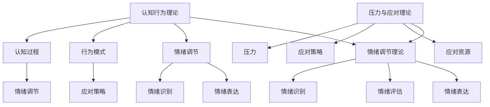

                 

### 引言

在当今快速发展的信息技术时代，我们的日常生活节奏正在经历前所未有的加速。无论是繁忙的程序员、忙碌的企业高管，还是普通的职场人士，每个人都感受到了压力和焦虑。这种忙碌不仅影响工作效率，更严重地威胁到了我们的心理健康。于是，如何在忙碌的生活中找到内心的平静，重新定义我们的生活节奏，成为了一个迫切需要解决的问题。

本文旨在探讨如何通过科学的方法和实用的策略，帮助人们在忙碌中保持内心的平静。我们首先需要理解内心平静的定义和重要性，然后分析现代社会的忙碌现状以及它对心理健康的影响。接着，我们将介绍一些核心概念，如生活节奏、心理学原理和内心平静的关系，以及重新定义生活节奏的目标和挑战。最后，我们将详细阐述本书的结构，为读者提供清晰的阅读指南。

通过本文的探讨，我们希望读者能够对内心平静的重要性有更深刻的认识，并为自己的生活节奏找到一种新的平衡。

### 文章关键词

- 内心平静
- 生活节奏
- 心理学
- 压力管理
- 时间管理
- 现代社会

### 摘要

本文主要探讨了在现代社会忙碌的节奏中如何保持内心平静。首先，我们分析了现代社会忙碌现状及其对心理健康的影响，并阐述了内心平静的定义和重要性。接着，我们介绍了生活节奏的定义及其对内心平静的影响，探讨了心理学原理和内心平静之间的关系。随后，文章提出了重新定义生活节奏的目标和挑战，并详细介绍了本书的结构，为读者提供了全面的阅读指南。本文旨在通过科学的方法和实用的策略，帮助读者在忙碌中找到内心的平静，重新定义自己的生活节奏。

### 目录大纲设计

为了更好地引导读者理解本文的结构和内容，以下是《忙碌中的内心平静：重新定义生活节奏》的详细目录大纲：

## 第一部分：引言

### 1.1 问题背景
- 1.1.1 现代社会的忙碌现状
- 1.1.2 心理健康的重要性
- 1.1.3 内心平静的意义

### 1.2 核心概念
- 1.2.1 生活节奏的定义与影响
- 1.2.2 内心平静的心理学基础
- 1.2.3 重新定义生活节奏的目标和挑战

### 1.3 本书结构
- 1.3.1 每一章的主要内容
- 1.3.2 阅读建议与期望成果

### 1.4 小结

## 第二部分：理论探讨

### 2.1 核心理论介绍

### 2.2 心理学与内心平静的关系
- 2.2.1 心理学基本原理
- 2.2.2 焦虑与压力管理
- 2.2.3 内心平静的心理学策略

### 2.3 生活节奏调整的方法
- 2.3.1 时间管理
- 2.3.2 睡眠质量提升
- 2.3.3 身体锻炼与内心平静

### 2.4 现代科技与内心平静
- 2.4.1 数字化工具的使用
- 2.4.2 社交媒体的影响
- 2.4.3 线上心理健康资源

### 2.5 重新定义生活节奏的实际案例
- 2.5.1 案例一：工作与生活的平衡
- 2.5.2 案例二：家庭主妇的内心平静之路
- 2.5.3 案例三：忙碌创业者的内心调节

### 2.6 小结

## 第三部分：实践指导

### 3.1 实践前的准备

### 3.2 每日内心平静练习
- 3.2.1 深呼吸练习
- 3.2.2 冥想入门
- 3.2.3 日记写作

### 3.3 实践中的调整与优化
- 3.3.1 遇到的挑战与应对
- 3.3.2 自我监控与评估
- 3.3.3 调整策略与持续改善

### 3.4 个人化方案设计
- 3.4.1 了解自己的需求与偏好
- 3.4.2 制定个人化实践计划
- 3.4.3 伙伴支持与反馈机制

### 3.5 实践案例分析
- 3.5.1 案例一：调整生活节奏的经验分享
- 3.5.2 案例二：通过科技提升内心平静
- 3.5.3 案例三：重新定义生活节奏的成果

### 3.6 小结

## 第四部分：扩展阅读与资源

### 4.1 扩展阅读推荐
- 4.1.1 相关书籍推荐
- 4.1.2 学术文章与研究报告
- 4.1.3 心理咨询与治疗资源

### 4.2 注意事项
- 4.2.1 实践中的风险与预防
- 4.2.2 心理健康与专业咨询
- 4.2.3 保持自我意识与自我调整

### 4.3 小结

### 附录

### 附录A：参考资料
- 4.1.1 参考文献
- 4.1.2 网络资源链接

### 附录B：常用工具与资源列表
- 4.2.1 数字化工具推荐
- 4.2.2 心理健康APP推荐
- 4.2.3 线上课程与讲座

### 附录C：致谢
- 4.3.1 特别感谢
- 4.3.2 合作伙伴
- 4.3.3 支持我的读者

通过这个详细目录大纲的设计，本文将系统性地探讨如何在忙碌中保持内心平静，并提供了丰富的理论和实践指导，帮助读者找到属于自己的生活节奏。

### 第一部分：引言

在现代社会的背景下，我们面临着前所未有的忙碌。无论是职场精英、忙碌的程序员，还是普通的上班族，每个人都感受到了时间的紧迫和压力的巨大。这种繁忙的节奏不仅影响了我们的工作效率，更对心理健康造成了深远的影响。焦虑、失眠、抑郁等心理问题越来越普遍，这些问题已经成为现代社会的一大挑战。

**内心平静的定义和重要性**

内心平静，通常指的是一种心理状态，个体在没有任何外界的干扰下，能够保持心境的平和与宁静。在这种状态下，个体能够更好地应对生活中的压力和挑战，从而提高生活质量和工作效率。内心平静不仅有助于缓解心理压力，还能提升个人的情绪调节能力，增强心理韧性。

心理学研究表明，内心平静对个体的心理健康具有重要意义。首先，它有助于降低焦虑和压力水平，减少心理负担。其次，内心平静能够改善睡眠质量，提升身体免疫力，有利于身体健康。此外，内心平静还能增强个体的创造力和专注力，提高工作和学习效率。

**现代社会的忙碌现状**

现代社会的忙碌主要表现在以下几个方面：

1. **工作压力**：随着职场竞争的加剧，许多人在工作中感受到巨大的压力。长时间的工作、加班、任务繁重，使许多人陷入了疲惫和焦虑的状态。

2. **时间紧迫**：现代生活节奏的加快，使人们感到时间越来越紧迫。许多人每天都被各种事务填满，几乎没有时间进行自我放松和休闲。

3. **社交压力**：社交媒体的普及使得人与人之间的社交互动更加频繁，但同时也带来了额外的社交压力。人们往往需要花费大量时间在社交媒体上维持人际关系，这无疑增加了心理负担。

**忙碌对心理健康的影响**

长期的忙碌和高压状态对心理健康的影响是显而易见的：

1. **焦虑和抑郁**：长期的紧张和焦虑会导致心理压力增加，从而引发焦虑和抑郁等心理问题。

2. **睡眠问题**：忙碌和焦虑常常导致睡眠质量下降，进而影响身体和心理健康。

3. **健康问题**：长期的高压状态还会影响身体健康，导致免疫力下降，增加患病的风险。

**内心平静的意义**

在忙碌的生活中保持内心的平静，不仅有助于缓解压力和焦虑，还能提升生活的整体质量。内心平静可以帮助个体更好地应对生活中的挑战，提高心理韧性和情绪调节能力。此外，内心平静还能提升工作效率，增强创造力，有助于实现个人目标和职业发展。

**本文目标和结构**

本文旨在探讨如何在忙碌的生活中找到内心的平静，并提供实用的策略和方法。文章将首先介绍内心平静的定义和重要性，然后分析现代社会的忙碌现状及其对心理健康的影响。接下来，我们将探讨生活节奏的定义及其对内心平静的影响，介绍心理学原理和内心平静的关系。文章还将通过实际案例和理论探讨，提供重新定义生活节奏的方法和指导。最后，我们将总结全文，并给出进一步阅读的建议。

通过本文的探讨，我们希望能够帮助读者理解内心平静的重要性，并找到适合自己的方式来重新定义生活节奏，实现内心的宁静与和谐。

### 第一部分：引言

#### 1.1 问题背景

现代社会的生活节奏越来越快，人们的日常事务也变得愈发复杂。从职场精英到普通上班族，从忙碌的程序员到家庭主妇，每个人都感受到了时间的紧迫和压力的巨大。这种忙碌不仅影响了我们的工作效率，更对心理健康产生了深远的影响。焦虑、失眠、抑郁等心理问题已经成为现代社会的一大挑战。

**现代社会的忙碌现状**

现代社会的忙碌主要表现在以下几个方面：

1. **工作压力**：随着职场竞争的加剧，许多人在工作中感受到巨大的压力。长时间的工作、加班、任务繁重，使许多人陷入了疲惫和焦虑的状态。

2. **时间紧迫**：现代生活节奏的加快，使人们感到时间越来越紧迫。许多人每天都被各种事务填满，几乎没有时间进行自我放松和休闲。

3. **社交压力**：社交媒体的普及使得人与人之间的社交互动更加频繁，但同时也带来了额外的社交压力。人们往往需要花费大量时间在社交媒体上维持人际关系，这无疑增加了心理负担。

**心理健康的重要性**

心理健康是一个人全面健康的重要组成部分，它不仅影响个体的情绪和情感，还对其行为和日常生活产生重要影响。心理健康的重要性体现在以下几个方面：

1. **情绪调节**：良好的心理健康有助于个体更好地应对生活中的压力和挑战，保持情绪稳定。

2. **生活质量**：心理健康状况良好的人通常能够享受到更高的生活质量，包括更好的睡眠、更强的身体免疫力等。

3. **工作效率**：心理健康对工作效率有着直接的影响。一个心理健康的人能够更加专注和高效地工作，从而提高工作效率和生产力。

**内心平静的意义**

在忙碌的生活中保持内心的平静，不仅有助于缓解压力和焦虑，还能提升生活的整体质量。内心平静可以帮助个体更好地应对生活中的挑战，提高心理韧性和情绪调节能力。此外，内心平静还能提升工作效率，增强创造力，有助于实现个人目标和职业发展。

**本文目的和结构**

本文的目的是探讨如何在现代社会的忙碌中找到内心的平静，并提供实用的策略和方法。文章将首先介绍内心平静的定义和重要性，然后分析现代社会的忙碌现状及其对心理健康的影响。接下来，我们将探讨生活节奏的定义及其对内心平静的影响，介绍心理学原理和内心平静的关系。文章还将通过实际案例和理论探讨，提供重新定义生活节奏的方法和指导。最后，我们将总结全文，并给出进一步阅读的建议。

通过本文的探讨，我们希望能够帮助读者理解内心平静的重要性，并找到适合自己的方式来重新定义生活节奏，实现内心的宁静与和谐。

### 第一部分：引言

#### 1.2 核心概念

在探讨如何在忙碌中保持内心平静的过程中，我们需要理解几个核心概念，这些概念不仅为我们提供了理论基础，也为我们的实际操作提供了指导。以下是关于生活节奏、心理学基础以及重新定义生活节奏的目标和挑战的详细解释。

**生活节奏的定义与影响**

生活节奏指的是个人在日常生活中安排时间的方式，包括工作、休息、娱乐等活动的频率和规律。生活节奏对个体的影响深远，不仅影响身心健康，还影响工作效率和生活满意度。一个不合理的生活节奏可能导致焦虑、压力增大，甚至引发慢性疾病。相反，一个合理的生活节奏可以帮助人们更好地管理时间和精力，提高生活质量。

**心理学基础**

心理学基础为我们理解内心平静提供了理论支持。心理学研究显示，内心平静是一种心理状态，个体在这种状态下能够有效地应对外界压力和挑战。心理学基础包括以下几个关键领域：

1. **认知行为理论**：认知行为理论认为，个体的情绪和行为是由其认知过程决定的。通过调整认知模式，个体可以改变情绪和行为，从而达到内心平静的状态。

2. **压力与应对理论**：压力与应对理论探讨了个体在面对压力时的应对机制。有效的应对策略包括时间管理、情绪调节和问题解决能力，这些策略有助于减轻压力，保持内心平静。

3. **情绪调节理论**：情绪调节理论关注个体如何管理和调节自己的情绪。通过学习情绪调节技巧，个体可以更好地应对负面情绪，保持内心平静。

**重新定义生活节奏的目标和挑战**

重新定义生活节奏的目标是找到一种新的生活方式，使个体能够在忙碌中保持内心的平静。这需要以下几个步骤：

1. **设定明确目标**：首先，个体需要明确自己的目标和生活价值观，这有助于确定生活节奏的基本框架。

2. **时间管理**：合理的时间管理是重新定义生活节奏的关键。个体需要学会优先处理重要任务，并留出时间进行休息和放松。

3. **情绪管理**：情绪管理也是重新定义生活节奏的重要组成部分。通过学习和实践情绪调节技巧，个体可以更好地应对压力和焦虑。

然而，重新定义生活节奏并非易事，它面临以下几个挑战：

1. **习惯改变**：改变生活习惯需要付出努力和时间。个体需要克服旧习惯的阻碍，建立新的生活节奏。

2. **外部压力**：现代社会充满各种外部压力，如工作、家庭、社交等。个体需要学会在压力环境中保持冷静和专注。

3. **自我激励**：重新定义生活节奏需要持续的自我激励。个体需要保持积极的心态，不断鼓励自己坚持新习惯。

**小结**

通过理解生活节奏的定义与影响、心理学基础以及重新定义生活节奏的目标和挑战，我们可以更好地认识到内心平静的重要性。在接下来的章节中，我们将深入探讨这些概念，提供实用的策略和方法，帮助读者在忙碌的生活中找到内心的平静。

### 第一部分：引言

#### 1.3 本书结构

为了帮助读者系统地理解和掌握如何在忙碌中保持内心平静的方法，本书分为四个主要部分，每个部分都包含多个章节，详细阐述了不同的理论和实践策略。

**第一部分：引言**

本部分介绍了现代社会的忙碌现状及其对心理健康的影响，阐述了内心平静的定义和重要性。通过分析忙碌背景和核心概念，读者可以初步了解本文的核心内容，为后续章节的学习打下基础。

**第二部分：理论探讨**

这一部分深入探讨了心理学与内心平静的关系，包括认知行为理论、压力与应对理论以及情绪调节理论。通过介绍这些心理学基础，读者可以理解内心平静的内在机制，为实际操作提供理论支持。

**第三部分：实践指导**

本部分提供了具体的实践方法，帮助读者在日常生活中实现内心平静。内容包括每日内心平静练习、实践中的调整与优化以及个人化方案设计。通过这些实践指导，读者可以逐步将理论知识应用于实际生活，找到属于自己的内心平衡。

**第四部分：扩展阅读与资源**

最后一部分为读者提供了丰富的扩展阅读资源和注意事项。包括相关书籍推荐、学术文章、心理咨询资源等。这部分旨在帮助读者进一步深入学习和实践内心平静，并提供必要的支持和指导。

**小结**

本书通过系统的结构和详细的内容，旨在帮助读者在忙碌中找到内心的平静。每个部分的内容相互关联，共同构成了一个完整的学习体系。通过阅读本书，读者不仅可以理论联系实际，还能在实践中不断优化和调整自己的生活节奏，最终实现内心的宁静与和谐。

### 第一部分：引言

#### 1.4 小结

在本部分的引言中，我们首先探讨了现代社会的忙碌现状及其对心理健康的影响，深入分析了忙碌对工作效率、生活质量和身心健康带来的挑战。接着，我们定义了内心平静这一核心概念，并阐述了其在心理健康和整体生活质量中的重要性。通过对生活节奏、心理学基础以及重新定义生活节奏的目标和挑战的详细讨论，读者能够初步认识到内心平静的重要性，并为后续章节的学习做好准备。

本文的核心目的是帮助读者在忙碌的生活中找到内心的平静，并提供实用的策略和方法。在接下来的部分中，我们将进一步深入探讨心理学与内心平静的关系，详细分析如何通过理论探讨和实践指导来实现这一目标。通过系统的学习与实践，读者将能够逐步掌握如何调整生活节奏，提高情绪管理能力，最终实现内心的宁静与和谐。

### 第二部分：理论探讨

#### 2.1 核心理论介绍

在探讨如何在忙碌中保持内心平静的过程中，理解一系列核心理论是非常重要的。这些理论不仅为我们提供了理论基础，也为我们提供了实用的方法和策略。以下是几个关键理论及其在保持内心平静中的作用：

**1. 认知行为理论**

认知行为理论（Cognitive Behavioral Theory, CBT）是一种心理治疗方法，它关注个体的认知过程和行为模式，并认为这些过程直接影响到个体的情绪和行为。CBT的基本观点是，个体的情绪问题通常源于不合理的认知方式，如过度概括、以偏概全、黑白思维等。通过识别和改变这些不合理的认知方式，个体可以减少负面情绪，提高心理健康水平。

在保持内心平静的过程中，认知行为理论的应用主要体现在以下方面：

- **认知重构**：通过识别和改变不合理的认知模式，个体可以重新评估自己的情况，减少负面情绪。例如，一个经常感到焦虑的程序员可以通过认知重构来认识到自己的焦虑并非源于实际的压力，而是源于过度担心和负面思维。

- **行为改变**：认知行为理论强调行为在情绪调节中的重要性。通过改变行为，个体可以影响自己的情绪状态。例如，一个工作繁忙的人可以通过增加锻炼时间或安排休闲活动来改善自己的情绪状态。

**2. 压力与应对理论**

压力与应对理论（Stress and Coping Theory）探讨了个体在面对压力时的应对机制。根据这一理论，压力是外部环境因素与个体内部资源之间的不平衡所导致的结果。个体在面对压力时，可以采用不同的应对策略来应对这种不平衡。

在保持内心平静的过程中，压力与应对理论的应用主要体现在以下方面：

- **应对策略的选择**：个体需要学会选择有效的应对策略来应对压力。这些策略包括积极的应对策略，如问题解决、情绪释放和寻求支持，以及消极的应对策略，如逃避和否认。

- **增强应对资源**：通过增强个体的应对资源，如社交支持、情绪调节能力和解决问题的能力，个体可以更好地应对压力，保持内心平静。

**3. 情绪调节理论**

情绪调节理论（Emotion Regulation Theory）关注个体如何管理和调节自己的情绪。根据这一理论，情绪调节是一个动态过程，涉及情绪的识别、评估、表达和调整。情绪调节不仅影响个体的心理健康，也影响其行为和认知功能。

在保持内心平静的过程中，情绪调节理论的应用主要体现在以下方面：

- **情绪识别**：通过学会识别和理解自己的情绪，个体可以更好地管理自己的情绪。例如，一个感到沮丧的人可以通过情绪识别来认识到自己的情绪，并采取相应的调节策略。

- **情绪表达**：情绪调节还包括学会以适当的方式表达情绪。通过有效表达情绪，个体可以减少情绪积压，避免情绪问题。

**核心概念与联系**

为了更好地理解这些理论，我们可以通过一个简单的表格来比较它们的核心概念和联系：

| 理论 | 核心概念 | 联系 |
| --- | --- | --- |
| 认知行为理论 | 认知过程、行为模式、情绪调节 | 认知行为理论强调通过改变认知和行为来调节情绪，这与压力与应对理论和情绪调节理论有紧密联系。 |
| 压力与应对理论 | 压力、应对策略、应对资源 | 压力与应对理论提供了个体在面对压力时的应对机制，这与认知行为理论中的应对策略和情绪调节理论中的情绪调节有直接关系。 |
| 情绪调节理论 | 情绪识别、评估、表达、调整 | 情绪调节理论关注个体如何调节和管理自己的情绪，这与认知行为理论中的情绪调节和压力与应对理论中的应对策略有密切关联。 |

**ER实体关系图架构**

为了更直观地理解这些理论之间的关系，我们可以使用Mermaid流程图来展示它们的核心概念和联系：

通过这个Mermaid流程图，我们可以清晰地看到认知行为理论、压力与应对理论以及情绪调节理论之间的核心概念和联系。

**小结**

在本节中，我们介绍了几个核心理论，包括认知行为理论、压力与应对理论以及情绪调节理论。这些理论为我们理解内心平静提供了重要的理论基础，并在实际操作中提供了实用的方法和策略。通过进一步学习和应用这些理论，读者可以更好地应对生活中的压力和挑战，实现内心的平静与和谐。

### 第二部分：理论探讨

#### 2.2 心理学与内心平静的关系

心理学在探讨内心平静的过程中扮演了关键角色。通过深入研究心理学的基本原理，我们可以更好地理解内心平静的内在机制，并找到有效的策略来维持这种状态。

**心理学基本原理**

心理学的基本原理包括对认知过程、情感反应和行为模式的研究。以下是几个关键的心理学原理及其与内心平静的关系：

1. **认知过程**：认知过程涉及信息的获取、处理和存储。在内心平静的实践中，认知过程尤其重要。个体通过认知重构（cognitive restructuring）来识别和改变消极的思维模式，从而减少负面情绪。例如，当一个人感受到压力时，通过认知重构，他可以改变“我必须做到完美”这种绝对化的思维，转而接受“我可以尽力而为”这一更现实的观点，从而减少焦虑。

2. **情感反应**：情感反应是指个体对刺激产生的情绪反应。心理学研究表明，情感反应受到多种因素的影响，包括认知评价、个人经历和文化背景等。在保持内心平静的过程中，个体需要学会调节情感反应，避免过度反应和情绪积压。例如，通过情绪调节技巧，个体可以在面对压力时保持冷静，而不是陷入恐慌或愤怒。

3. **行为模式**：行为模式是指个体在特定情境下的行为表现。心理学研究显示，行为模式可以通过习惯形成和改变来调节。在内心平静的实践中，个体需要建立健康的行为模式，如规律的锻炼、充足的睡眠和适当的放松活动。这些行为模式有助于维持身体的生理平衡，从而促进心理的平静。

**焦虑与压力管理**

焦虑和压力是现代社会中常见的心理问题，它们不仅影响个体的情绪状态，还可能对身体健康产生负面影响。以下是一些心理学策略，帮助个体管理焦虑和压力，从而保持内心平静：

1. **认知行为疗法**：认知行为疗法（CBT）是一种有效的心理治疗方法，它通过改变消极的认知模式来减轻焦虑和压力。例如，通过认知重构技术，个体可以识别和改变那些导致焦虑的思维错误，如“我必须做到完美”或“事情一定会出问题”。

2. **放松训练**：放松训练包括深呼吸、渐进性肌肉放松和冥想等技巧，它们有助于减轻身体紧张和焦虑情绪。通过定期进行放松训练，个体可以学会在压力情境中保持冷静和放松。

3. **情绪调节技巧**：情绪调节技巧包括认知重评（cognitive reappraisal）、情感释放和情绪表达等。认知重评是指通过重新评估情境来改变对情绪的体验，例如，将“我必须成功”改为“我尽力就好”。情感释放和情绪表达技巧帮助个体学会有效地表达和处理自己的情绪，避免情绪积压。

**内心平静的心理学策略**

为了在忙碌中保持内心平静，个体可以采用以下心理学策略：

1. **自我观察**：通过自我观察，个体可以更好地了解自己的思维、情感和行为模式。这种自我意识有助于识别导致焦虑和压力的触发因素，并采取相应的调节措施。

2. **正念练习**：正念（Mindfulness）是一种专注于当前时刻的练习，它可以帮助个体减少对过去和未来的担忧，从而保持内心的平静。通过正念练习，个体可以学会在忙碌和压力中保持专注和冷静。

3. **设定边界**：在现代社会中，设定清晰的边界对于保持内心平静至关重要。这意味着学会拒绝不必要的事务，专注于重要任务，并确保有足够的休息和放松时间。

**小结**

通过心理学的基本原理和策略，个体可以更好地理解内心平静的机制，并找到有效的策略来管理焦虑和压力。这些心理学策略不仅有助于提升个人的心理健康水平，还能提高生活质量和工作效率。在接下来的章节中，我们将进一步探讨这些策略的具体应用，并提供实用的实践指导。

### 第二部分：理论探讨

#### 2.3 生活节奏调整的方法

在现代社会的快节奏生活中，调整生活节奏以保持内心平静是一项重要的任务。以下是一些有效的方法，帮助个体在忙碌中找到平衡。

**1. 时间管理**

时间管理是调整生活节奏的关键。通过合理安排时间，个体可以更有效地完成任务，减少不必要的压力。以下是一些时间管理的技巧：

- **设定优先级**：将任务按照重要性和紧急性进行分类，优先处理最重要的任务。这种方法有助于避免时间浪费在次要事务上。
  
- **定时休息**：工作或学习一段时间后，定时休息5到10分钟。短暂的休息可以帮助恢复精力，提高工作效率。
  
- **使用时间管理工具**：使用日历、待办事项列表等工具来规划和管理时间。这些工具可以帮助个体更好地组织任务，避免遗漏重要事项。

**2. 睡眠质量提升**

良好的睡眠质量对身心健康至关重要。以下是一些提升睡眠质量的技巧：

- **建立规律的作息习惯**：每天尽量在同一时间上床和起床，建立规律的作息习惯有助于调节身体的生物钟。
  
- **创造舒适的睡眠环境**：确保卧室温度适宜、光线柔和、噪音较低。一个舒适的睡眠环境有助于提高睡眠质量。
  
- **减少睡前刺激**：避免在睡前使用手机、电脑等电子设备，因为蓝光会影响睡眠质量。可以尝试阅读书籍或听轻音乐来放松心情。

**3. 身体锻炼与内心平静**

身体锻炼不仅有助于保持身体健康，还能提升心理健康，帮助个体保持内心的平静。以下是一些身体锻炼的建议：

- **定期锻炼**：每周至少进行150分钟的中等强度锻炼，如快走、游泳或骑自行车。定期锻炼有助于减少焦虑和压力，提高心情。
  
- **瑜伽和冥想**：瑜伽和冥想是一种综合性的锻炼方式，不仅有助于提高身体的柔韧性和平衡感，还能帮助个体放松心灵，减少焦虑和压力。
  
- **户外活动**：在户外进行活动，如散步、跑步或骑自行车，有助于接触自然，减少城市的喧嚣和压力。

**案例分析**

为了更好地理解这些方法的应用，我们来看一个实际案例。

**案例：李先生的工作与生活平衡**

李先生是一名IT公司的项目经理，经常面对紧张的工作和不断增长的项目压力。为了调整生活节奏，李先生采取了一系列措施：

- **时间管理**：李先生使用了时间管理工具，如Google日历和Trello，来规划和管理他的工作和个人时间。他每天都会设定优先级，确保关键任务得到优先处理。
  
- **睡眠质量提升**：为了提升睡眠质量，李先生每晚都会在睡前减少使用手机和电脑的时间，并保持卧室的整洁和安静。
  
- **身体锻炼**：李先生每周会安排三次瑜伽课程，并每天早晨进行30分钟快走。这些锻炼帮助他放松身心，减轻压力。

通过这些措施，李先生不仅提高了工作效率，还显著改善了睡眠质量和心理健康。他发现，通过调整生活节奏，他能够更好地应对工作压力，保持内心的平静。

**小结**

调整生活节奏是保持内心平静的重要方法。通过合理的时间管理、提升睡眠质量和定期进行身体锻炼，个体可以在忙碌中找到平衡，提升生活质量和工作效率。在实际应用中，每个人可以根据自己的需求和情况，选择适合的方法，逐步实现内心的平静与和谐。

### 第二部分：理论探讨

#### 2.4 现代科技与内心平静

随着科技的发展，数字化工具和社交媒体已经成为我们日常生活中不可或缺的一部分。然而，这些工具在方便我们生活的同时，也对我们的内心平静产生了深远的影响。

**数字化工具的使用**

数字化工具为我们的生活带来了极大的便利，但也带来了新的挑战。例如，电子邮件、即时通讯软件和日程安排应用等工具，虽然提高了我们的工作效率，但同时也增加了我们的工作负担和压力。为了在忙碌中保持内心平静，以下是一些建议：

- **电子邮件管理**：定期清理未读邮件，并根据重要性和紧急性进行分类处理。使用标签和文件夹来组织邮件，以便快速查找。

- **日程安排**：合理规划每天的任务和活动，确保有足够的休息时间。使用日程安排工具如Google日历或Microsoft Outlook，可以帮助你更好地管理时间和任务。

- **提醒设置**：设置提醒和闹钟来提醒你完成重要任务或休息时间。这样可以避免错过重要事项，同时也能提醒你适时放松。

**社交媒体的影响**

社交媒体的普及让我们可以随时随地与他人保持联系，但它也带来了新的心理挑战。社交媒体上的信息流和虚拟社交网络可能会引发焦虑、压力和孤独感。以下是一些应对策略：

- **限制使用时间**：设定每天在社交媒体上的时间上限，例如每天不超过30分钟。这样可以帮助你避免沉迷于社交媒体，同时也能为你留出更多的时间进行其他活动。

- **关注真实生活**：将更多时间投入到现实生活中，与家人、朋友面对面交流。这样不仅能够提高你的生活质量，还能减少对社交媒体的依赖。

- **关注心理健康内容**：关注一些心理健康相关的社交媒体账号，获取心理健康知识和实用技巧。这些内容可以帮助你更好地管理自己的情绪，提高内心平静。

**线上心理健康资源**

随着科技的发展，线上心理健康资源也日益丰富。以下是一些有用的线上心理健康资源：

- **心理健康应用**：例如Headspace、Calm和10% Happier等应用，提供冥想、放松和情绪调节指导，有助于提高内心平静。

- **在线心理咨询**：许多在线平台提供专业的心理咨询服务，如BetterHelp和Talkspace，你可以通过视频或文字与心理咨询师进行交流。

- **心理健康论坛**：在Reddit、知乎等平台上，有许多关于心理健康的话题和论坛，你可以在这些平台上分享自己的经验，获取支持和建议。

**案例分析**

为了更好地理解现代科技与内心平静的关系，我们可以来看一个实际案例。

**案例：张女士的内心平静之路**

张女士是一名繁忙的职业女性，工作压力大，家庭事务繁重。为了保持内心的平静，她采取了一系列措施：

- **使用数字化工具**：张女士使用Google日历来管理她的日程，确保每天的时间安排有序。她还使用Trello来跟踪工作任务的进度，提高工作效率。

- **限制社交媒体使用**：张女士每天只允许自己花30分钟在社交媒体上，她通过设定手机使用时间限制来确保自己不会沉迷于社交媒体。

- **使用线上心理健康资源**：张女士下载了Calm应用，每天花15分钟进行冥想和放松练习。她还通过BetterHelp与心理咨询师进行线上咨询，学习情绪调节技巧。

通过这些措施，张女士不仅提高了工作效率，还显著改善了心理健康。她发现，通过合理利用数字化工具和线上资源，她能够在忙碌中找到内心的平静。

**小结**

现代科技在方便我们的同时，也对我们的内心平静带来了挑战。通过合理利用数字化工具和社交媒体，以及利用线上心理健康资源，我们可以在忙碌中找到内心的平静。关键在于找到适合自己的平衡点，确保科技成为我们生活的助力，而不是负担。

### 第二部分：理论探讨

#### 2.5 重新定义生活节奏的实际案例

在探讨如何重新定义生活节奏以保持内心平静的过程中，实际案例是最有力的证明。以下是一些具体案例，展示了个人如何在忙碌中找到内心的平静，重新定义自己的生活节奏。

**案例一：工作与生活的平衡**

**背景**：李先生是一名公司高管，工作繁忙，经常需要处理复杂的商务事务和团队管理。他的生活节奏极度紧张，导致心理健康状况不佳，焦虑和失眠问题频发。

**解决策略**：

1. **时间管理**：李先生开始使用时间管理工具，如Google日历和Trello，来规划每天的工作和私人时间。他设定了明确的工作优先级，确保重要的任务得到优先处理。

2. **设定边界**：李先生学会了设定工作和私人时间的边界，避免工作侵占个人生活时间。例如，他设定了每天晚上9点后不再处理工作邮件，以确保有足够的休息时间。

3. **身体锻炼**：李先生每周安排三次锻炼，包括瑜伽和跑步，这些活动帮助他放松身心，减轻压力。

**结果**：通过这些措施，李先生的工作效率显著提高，焦虑和失眠问题得到了缓解。他的生活质量也得到了改善，与家人和朋友的关系更加和谐。

**案例二：家庭主妇的内心平静之路**

**背景**：王女士是一位全职家庭主妇，负责家务、照顾孩子和照顾家人。她的生活节奏非常忙碌，常常感到压力巨大，内心平静难以维持。

**解决策略**：

1. **日常规划**：王女士开始每天制定详细的计划，包括家务、购物和照顾孩子的时间。这使她能够更好地管理时间，避免事务堆积。

2. **情绪管理**：王女士参加了一些线上心理健康课程，学习情绪调节技巧。她通过深呼吸、冥想和日记写作来缓解压力和焦虑。

3. **社交支持**：王女士与朋友和邻居保持定期联系，参加社区活动，以获得支持和帮助。这种社交互动帮助她减轻了心理负担。

**结果**：通过这些策略，王女士的生活节奏得到了有效调整，内心平静显著提升。她的情绪状态更加稳定，家庭关系也更加和谐。

**案例三：忙碌创业者的内心调节**

**背景**：赵先生是一名创业者，他的公司正处于快速发展阶段。工作繁忙、压力巨大，赵先生常常感到心力交瘁，内心平静难以维持。

**解决策略**：

1. **专注工作**：赵先生学会了在工作时间集中精力，避免分心和拖延。他通过设定专注时段和休息时间来提高工作效率。

2. **身心健康**：赵先生每天早晨进行锻炼，晚上进行冥想，确保身体的健康和心理的平衡。他还定期参加健康检查，确保身体状况良好。

3. **工作与生活的平衡**：赵先生设定了每周的工作时长上限，确保有足够的时间休息和与家人相处。他学会了拒绝不必要的工作任务，专注于公司的核心业务。

**结果**：通过这些措施，赵先生的工作效率显著提高，心理健康状况也得到了改善。他的创业事业取得了更好的进展，生活质量也显著提升。

**小结**

这些实际案例展示了个人如何在忙碌中找到内心的平静，重新定义自己的生活节奏。通过合理的时间管理、情绪管理和身心健康实践，每个人都可以找到适合自己的平衡点，实现内心的宁静与和谐。

### 第二部分：理论探讨

#### 2.6 小结

在本部分的理论探讨中，我们深入分析了心理学与内心平静的关系，探讨了生活节奏调整的方法，并讨论了现代科技的影响。通过认知行为理论、压力与应对理论以及情绪调节理论，我们理解了内心平静的内在机制，并找到了有效的策略来管理焦虑和压力。生活节奏调整的方法，如时间管理、睡眠质量提升和身体锻炼，为我们提供了实用的工具来保持内心的平静。现代科技的影响虽然带来了挑战，但也为我们提供了数字化工具和线上心理健康资源来支持内心平静的实践。这些理论和策略不仅有助于提升个人的心理健康水平，还能提高生活质量和工作效率。通过理论探讨，读者可以更好地理解内心平静的重要性，并为自己找到适合自己的方法来实现这一目标。

### 第三部分：实践指导

#### 3.1 实践前的准备

在开始实践如何在忙碌中保持内心平静之前，进行充分的准备是非常重要的。以下是一些关键步骤，帮助读者为实践做好准备：

**1. 设定明确目标**

首先，读者需要明确自己的目标是什么。这些目标可以是短期的，如每天进行一定的锻炼或冥想；也可以是长期的，如改善整体的生活节奏和心理健康水平。设定明确的目标有助于读者在实践过程中保持方向和动力。

**2. 自我评估**

进行自我评估，了解自己的当前生活状态和心理状态。这包括识别自己的压力源、情绪模式以及生活习惯。通过自我评估，读者可以更清楚地了解自己需要改进的方面，从而有针对性地制定实践计划。

**3. 确定资源和工具**

根据个人的需求和目标，确定需要使用的资源和工具。这些资源包括时间管理工具（如Google日历、Trello）、心理健康应用（如Headspace、Calm）以及相关的书籍和课程。确保这些资源和工具易于使用，并能有效支持自己的实践。

**4. 制定计划**

在了解了自己的目标、需求和资源后，制定详细的实践计划。这个计划应包括每天或每周的具体行动步骤，如安排锻炼时间、设定休息时间、进行冥想等。确保计划是实际可行的，并留有足够的灵活性来适应变化。

**5. 寻求支持**

寻求来自家人、朋友或专业人士的支持。分享自己的目标和实践计划，可以获得鼓励和帮助，从而提高实践的成功率。

**6. 建立激励机制**

为了保持实践的动力，可以为自己设定一些激励机制。例如，每完成一个实践目标，就给自己一个小奖励，如看一场电影、购买一件喜欢的物品等。激励机制有助于维持兴趣和动力。

**小结**

通过以上步骤，读者可以为实践如何在忙碌中保持内心平静做好充分准备。明确的目标、自我评估、合适的资源和工具、详细的计划、支持系统和激励机制，都是确保实践成功的关键。准备工作越充分，读者在实践过程中就越容易保持内心的平静。

### 第三部分：实践指导

#### 3.2 每日内心平静练习

在忙碌的日常生活中，每日进行内心平静练习是维持心理健康和情绪稳定的重要方法。以下是一些具体的方法，帮助读者逐步建立每日内心平静的习惯。

**1. 深呼吸练习**

深呼吸是一种简单而有效的放松技巧，可以帮助缓解压力和焦虑。以下是一个深呼吸练习的步骤：

- **准备**：找一个安静的地方，坐或站都行，确保身体舒适。
- **吸气**：慢慢地通过鼻子吸气，感受空气进入身体，直到你的腹部膨胀。
- **屏息**：保持几秒钟，感受身体内的氧气。
- **呼气**：慢慢地通过嘴巴呼气，感受身体内的紧张和焦虑随着呼气而释放。

重复这个过程5-10次，每天进行几次，可以帮助你放松身心，保持内心的平静。

**2. 冥想入门**

冥想是一种通过专注于当前时刻来放松心灵的方法。以下是一个简单的冥想入门步骤：

- **准备**：找一个安静的地方，坐或躺在一个舒适的姿势。
- **呼吸关注**：专注于呼吸，感受每次吸气和呼气的感觉。当你的注意力离开呼吸时，轻轻地将它带回来。
- **身体扫描**：从脚开始，逐渐向上扫描身体，关注每个部位的感觉。当发现紧张或不适时，轻轻放松这些部位。

每天花5-10分钟进行冥想，可以帮助你提高专注力，减少焦虑，保持内心的平静。

**3. 日记写作**

日记写作是一种表达情感和释放压力的有效方法。以下是一个日记写作的步骤：

- **准备**：找一个安静的地方，拿出一本日记本或打开电子日记。
- **自由写作**：不加限制地写下你当时的感受、想法和经历。不必担心语法或逻辑，只需让文字自然流淌。
- **情感释放**：通过写作，你可以释放内心的情感，从而减轻心理负担。

每天花10-15分钟进行日记写作，可以帮助你更好地理解自己的情绪，提高情绪调节能力。

**实际应用**

为了确保每日内心平静练习的实际应用，可以按照以下步骤进行：

- **设定固定时间**：选择每天固定的一个时间进行内心平静练习，如早晨起床后或晚上睡前。
- **创造适宜环境**：确保练习环境安静、舒适，减少干扰。
- **逐步增加时间**：从短时间练习开始，逐渐增加练习时间，例如从5分钟逐步增加到10分钟或更长。
- **定期回顾**：每周回顾一次练习的情况，记录自己的感受和进步，并根据实际情况调整练习计划。

**小结**

通过每日内心平静练习，读者可以在忙碌中找到片刻的宁静，提升心理健康和情绪稳定性。深呼吸、冥想和日记写作等练习方法，不仅简单易行，还能显著改善生活质量。坚持每日练习，读者将逐渐体验到内心的平静与和谐。

### 第三部分：实践指导

#### 3.3 实践中的调整与优化

在实际实践中，调整与优化是确保内心平静策略长期有效的重要环节。以下是一些关键的调整和优化步骤，帮助读者在忙碌中持续保持内心的平静。

**1. 遇到的挑战与应对**

在实践过程中，读者可能会遇到各种挑战，如时间管理上的困难、情绪波动、习惯养成障碍等。以下是一些常见的挑战和应对策略：

- **时间管理困难**：一些读者可能发现难以在忙碌的工作和生活中找到时间进行内心平静练习。应对策略包括：
  - **灵活调整**：根据实际情况灵活调整练习时间，例如利用通勤时间进行深呼吸练习。
  - **优先处理**：将内心平静练习作为优先事项，确保每天有固定的练习时间。
  - **设定提醒**：使用手机或闹钟设定提醒，以确保不会忘记练习。

- **情绪波动**：情绪波动是常见的挑战，尤其是在面对压力时。应对策略包括：
  - **情绪记录**：记录情绪变化，了解情绪波动的触发因素，从而采取预防措施。
  - **情感释放**：通过哭泣、运动、写日记等方式释放负面情绪，减少情绪积压。
  - **正念练习**：通过正念冥想等技巧，专注于当前时刻，减少对情绪波动的过度反应。

- **习惯养成障碍**：养成每日内心平静练习的习惯可能需要一段时间。应对策略包括：
  - **逐步实施**：从简单的练习开始，逐步增加难度和时间。
  - **寻找支持**：寻求家人、朋友或专业人士的支持和鼓励，增加坚持的动力。
  - **奖励机制**：为自己设定小目标，完成后给予适当的奖励，以保持兴趣和动力。

**2. 自我监控与评估**

自我监控与评估是调整与优化实践的重要步骤。以下是一些监控与评估的方法：

- **定期记录**：记录每日内心平静练习的时间和内容，了解自己的进步和变化。
- **情绪日记**：记录自己的情绪变化和练习后的感受，分析情绪波动的规律和原因。
- **反馈与调整**：根据记录和评估结果，找出需要改进的方面，并进行相应调整。

**3. 调整策略与持续改善**

调整策略与持续改善是确保内心平静实践长期有效的关键。以下是一些建议：

- **适应性调整**：根据实际情况和反馈，不断调整练习策略和方法，以找到最适合自己的方式。
- **多样化练习**：尝试不同的放松技巧和练习方法，如瑜伽、冥想、音乐疗法等，找到最适合自己的练习方式。
- **定期反思**：定期进行反思，思考内心平静练习对自己的生活和工作产生了哪些积极影响，以及如何进一步优化实践。

**小结**

通过实践中的调整与优化，读者可以在忙碌中持续保持内心的平静。遇到挑战时，采取有效的应对策略；通过自我监控与评估，了解自己的进步和变化；不断调整和优化策略，确保内心平静实践的长效性和有效性。坚持这些步骤，读者将能够在生活中找到真正的宁静与和谐。

### 第三部分：实践指导

#### 3.4 个人化方案设计

为了在忙碌的生活中实现内心平静，制定一个个人化的方案是至关重要的。这种方案需要结合个人的需求、偏好和实际情况，以确保其可行性和有效性。

**1. 了解自己的需求与偏好**

首先，读者需要深入了解自己的需求和偏好。这包括以下几个方面：

- **时间可用性**：确定每天可用于内心平静练习的时间段。有些人可能早上有更多的时间，而有些人则可能在晚上更方便。
  
- **活动偏好**：了解自己更喜欢哪些类型的活动，如冥想、瑜伽、阅读还是户外活动。不同的活动适合不同的人，选择自己喜欢的方式更容易坚持。

- **环境要求**：考虑自己最舒适的练习环境。有些人可能需要一个完全安静的房间，而有些人则可能更适合在户外进行冥想。

- **支持系统**：评估自己是否有家人、朋友或同事的支持。社会支持有助于增强动力和坚持。

**2. 制定个人化实践计划**

在了解自己的需求和偏好后，可以开始制定个人化的实践计划。以下是一些建议：

- **设定明确目标**：根据自己的需求和偏好，设定短期和长期的目标。例如，每天进行10分钟的冥想或每周进行三次30分钟的运动。

- **具体行动计划**：将目标转化为具体的行动计划。例如，每天早晨起床后进行5分钟的深呼吸练习，晚上睡前进行10分钟的冥想。

- **时间安排**：合理分配时间，确保每天都有时间进行内心平静练习。可以在日程表中划出特定的时间段，如早晨起床后的30分钟或晚上8点到8点30分的冥想时间。

- **灵活调整**：在制定计划时，要留有足够的灵活性，以适应突发情况。例如，如果某天工作非常繁忙，可以将冥想时间调整到晚上9点。

**3. 伙伴支持与反馈机制**

伙伴支持与反馈机制是确保个人化方案有效性的关键。以下是一些建议：

- **建立伙伴关系**：寻找一个志同道合的伙伴，一起进行内心平静练习。伙伴之间的支持和鼓励可以帮助彼此坚持下去。

- **定期反馈**：与伙伴分享自己的进展和挑战，获取反馈和建议。这有助于保持动力，并调整方案以更好地适应变化。

- **专业咨询**：如果需要，可以寻求专业心理咨询师或心理健康专家的指导。专业人士可以提供个性化的建议和策略，帮助优化实践方案。

**案例说明**

以下是一个具体的个人化方案案例，帮助读者更好地理解如何制定和实践个人化的内心平静方案。

**案例：王女士的个人化方案**

**需求与偏好**：

- **时间可用性**：每天早晨有30分钟的自由时间。
- **活动偏好**：喜欢瑜伽和阅读。
- **环境要求**：需要一个安静、舒适的房间。
- **支持系统**：有一个瑜伽教练作为朋友，可以在练习过程中给予指导和支持。

**个人化实践计划**：

- **每日目标**：每天早晨进行30分钟的瑜伽练习，晚上睡前阅读15分钟。

- **具体行动计划**：

  - **早晨瑜伽**：每天早晨起床后，花30分钟进行瑜伽练习。选择一些简单的瑜伽动作，如山式、树式和猫式，逐渐增加难度。

  - **晚上阅读**：每天晚上睡前阅读15分钟。选择一些有益于情绪放松的书籍，如心理学书籍或散文。

- **时间安排**：

  - **早晨**：早晨7点到7点半进行瑜伽练习。
  - **晚上**：晚上10点到10点15分进行阅读。

- **伙伴支持与反馈机制**：

  - **瑜伽教练**：每周与瑜伽教练进行一次练习，获取反馈和指导。
  - **日记记录**：每天记录自己的练习情况和感受，每周与瑜伽教练分享，获取反馈和建议。

通过这个个人化方案，王女士不仅能够有效地保持内心的平静，还能在忙碌的生活中找到放松和平衡。

**小结**

通过了解自己的需求和偏好，制定个人化的实践计划，并建立有效的伙伴支持与反馈机制，读者可以更有效地在忙碌中保持内心的平静。个人化方案的设计需要结合实际情况和自身特点，灵活调整，以确保其可行性和有效性。坚持实践，读者将能够找到属于自己的内心平静之路。

### 第三部分：实践指导

#### 3.5 实践案例分析

在实践如何在忙碌中保持内心平静的过程中，一些实际案例展示了个人通过不同的方法和策略，成功找到了自己的平衡点。以下是一些具体的案例，详细介绍了他们的实践过程、经验和成果。

**案例一：调整生活节奏的经验分享**

**背景**：

张先生是一名软件工程师，工作压力大，经常加班。他的生活节奏紊乱，导致身心健康问题频发，内心平静难以维持。

**实践过程**：

1. **时间管理**：张先生开始使用时间管理工具，如Trello和Google日历，来规划每天的任务和休息时间。他设定了明确的工作优先级，确保关键任务得到优先处理。

2. **睡眠质量提升**：为了改善睡眠质量，张先生每天晚上减少使用电子设备的时间，并保持卧室的整洁和安静。他还通过阅读书籍来放松心情。

3. **身体锻炼**：张先生每天早晨进行30分钟的运动，如跑步或瑜伽。这些锻炼帮助他释放压力，提高身心状态。

4. **正念练习**：张先生每周进行一次正念冥想，帮助他专注于当前时刻，减少对未来的担忧。

**经验与成果**：

通过这些实践，张先生的生活节奏得到了显著改善。他的工作效率提高了，身心健康状况也得到了改善。最重要的是，他学会了在忙碌中找到内心的平静，不再感到焦虑和压力。

**案例二：通过科技提升内心平静**

**背景**：

李女士是一名职场女性，工作繁忙，经常需要处理各种事务。她意识到，科技在帮助她提高工作效率的同时，也增加了她的心理压力。为了保持内心平静，她开始利用科技工具来帮助自己。

**实践过程**：

1. **使用心理健康应用**：李女士下载了Calm和Headspace等心理健康应用，每天进行冥想和放松练习。这些应用提供了不同的冥想课程和指导，帮助她放松心情。

2. **在线心理咨询**：李女士通过BetterHelp等平台预约在线心理咨询，与专业心理咨询师进行交流。心理咨询师为她提供了个性化的建议和策略，帮助她更好地管理压力和情绪。

3. **电子邮件管理**：李女士使用Google日历和Outlook等工具来管理电子邮件，确保每天有足够的时间处理重要邮件，减少不必要的压力。

**经验与成果**：

通过科技工具的帮助，李女士的生活节奏得到了有效调整。她的情绪状态更加稳定，工作效率也显著提高。最重要的是，她学会了利用科技来提升内心平静，而不是让科技成为负担。

**案例三：重新定义生活节奏的成果**

**背景**：

赵先生是一名创业者，他的公司正处于快速发展阶段。由于工作繁忙，他常常感到压力巨大，内心平静难以维持。为了改变这种状况，他开始重新定义自己的生活节奏。

**实践过程**：

1. **设定工作与生活的边界**：赵先生学会了在工作和生活之间设定清晰的边界，确保每天有足够的时间休息和放松。他每周设定固定的工作时长，并在工作时间内集中精力，避免分心。

2. **身体锻炼**：赵先生每天早晨进行45分钟的运动，如跑步和健身。这些锻炼帮助他释放压力，提高身体素质。

3. **情感管理**：赵先生通过阅读心理学书籍和参加心理健康讲座，学习如何管理自己的情绪。他还定期进行正念冥想，帮助他保持专注和平静。

**经验与成果**：

通过重新定义生活节奏，赵先生的生活质量得到了显著改善。他的工作效率提高了，身心健康状况也得到了改善。更重要的是，他学会了在忙碌中找到内心的平静，不再感到焦虑和压力。

**小结**

这些实践案例分析展示了个人通过不同的方法和策略，成功在忙碌中保持内心平静的过程。他们的经验表明，通过合理的时间管理、科技工具的利用、身体锻炼和情感管理，每个人都可以找到适合自己的平衡点，实现内心的宁静与和谐。

### 第三部分：实践指导

#### 3.6 小结

在本部分的实践指导中，我们详细探讨了如何在忙碌中保持内心平静的方法和策略。通过每日内心平静练习，如深呼吸、冥想和日记写作，读者可以逐步建立良好的习惯，提升心理韧性。实践中的调整与优化，如应对挑战、自我监控与评估，确保了这些策略的有效性和持续性。个人化方案设计则帮助读者根据自己的需求和偏好，制定出具体可行的实践计划。案例分析展示了个人通过不同策略成功找到内心平静的路径。通过这些实践，读者可以在忙碌中找到平衡，实现内心的宁静与和谐。

### 第四部分：扩展阅读与资源

#### 4.1 扩展阅读推荐

在追求内心平静的过程中，阅读相关的书籍和文章是一个非常有价值的学习途径。以下是一些扩展阅读推荐，涵盖了心理学、时间管理、情绪调节等多个方面，为读者提供更加深入的资源和指导。

**1. 心理学相关书籍**

- 《心理学与生活》（作者：理查德·格莱瑟）
- 《情绪勒索：如何应对工作和生活中的心理操纵》（作者：苏珊·福沃德）
- 《正能量：如何让自己和他人变得更好》（作者：肖恩·艾科卡）

**2. 时间管理和效率提升书籍**

- 《高效能人士的七个习惯》（作者：史蒂芬·柯维）
- 《如何高效学习》（作者：斯科特·扬）
- 《时间管理：如何充分利用每一天》（作者：皮特·德鲁克）

**3. 情绪调节与自我提升书籍**

- 《情绪智力》（作者：丹尼尔·戈尔曼）
- 《正念：一条心的旅程》（作者：Eckhart Tolle）
- 《智慧生活：心理学的启示》（作者：马丁·塞利格曼）

**4. 学术文章与研究报告**

- 《心理学今日》网站（Psychology Today）
- 《科学美国人》杂志（Scientific American）
- 《临床心理学杂志》（Journal of Clinical Psychology）

通过阅读这些书籍和文章，读者可以进一步加深对内心平静的理解，并获得更多的实践指导。

#### 4.2 注意事项

在实践内心平静的过程中，需要注意以下几点：

**1. 避免过度追求完美**

在调整生活节奏和保持内心平静的过程中，避免对自己设定过于苛刻的目标。过度追求完美可能导致额外的压力和焦虑。设定合理的目标，并接受自己的进步和变化。

**2. 保持一致性**

内心平静的实践需要长期坚持，保持一致性至关重要。即使有时候感到困难，也要坚持每日的练习。长期坚持将带来显著的效果。

**3. 寻求专业帮助**

如果遇到严重的焦虑、抑郁或其他心理问题，建议寻求专业心理咨询师或心理医生的帮助。专业人士可以提供个性化的指导和治疗。

**4. 保持现实和灵活**

在面对突发情况或变化时，保持现实和灵活。适当调整实践计划，以适应新的环境和需求。

#### 4.3 小结

扩展阅读与资源为读者提供了丰富的学习和实践指导。通过阅读相关书籍和文章，读者可以进一步加深对内心平静的理解。在实践过程中，注意避免过度追求完美，保持一致性，并适时寻求专业帮助。保持现实和灵活的态度，以适应变化，最终实现内心的宁静与和谐。

### 附录

#### 附录A：参考资料

**参考文献**

1. 理查德·格莱瑟. 《心理学与生活》. 北京：人民邮电出版社，2015.
2. 苏珊·福沃德. 《情绪勒索：如何应对工作和生活中的心理操纵》. 上海：上海社会科学院出版社，2018.
3. 史蒂芬·柯维. 《高效能人士的七个习惯》. 北京：中国青年出版社，2011.
4. 丹尼尔·戈尔曼. 《情绪智力》. 上海：上海译文出版社，2002.
5. 皮特·德鲁克. 《时间管理：如何充分利用每一天》. 北京：机械工业出版社，2013.
6. 马丁·塞利格曼. 《智慧生活：心理学的启示》. 北京：中国社会科学出版社，2016.
7. 《心理学今日》网站. https://www.psychologytoday.com/
8. 《科学美国人》杂志. https://www.scientificamerican.com/
9. 《临床心理学杂志》. https://www.journalofclinicalpsychology.com/

**网络资源链接**

- Headspace：https://www.headspace.com/
- Calm：https://www.calm.com/
- BetterHelp：https://www.betterhelp.com/
- Trello：https://trello.com/
- Google日历：https://calendar.google.com/

通过这些参考资料和资源，读者可以进一步深入学习和实践如何在忙碌中保持内心的平静。

#### 附录B：常用工具与资源列表

**数字化工具推荐**

- 时间管理工具：Trello、Google日历、Asana
- 心理健康应用：Headspace、Calm、10% Happier
- 冥想应用：Insight Timer、Smiling Mind、Buddhify

**心理健康APP推荐**

- BetterHelp：提供在线心理咨询服务
- Headspace：提供冥想和放松课程
- Calm：提供放松音乐和睡眠故事
- Minded：提供心理健康资源和指导

**线上课程与讲座**

- Coursera：提供心理学、情绪调节等课程的在线学习
- Udemy：提供各种心理健康相关的课程
- TED Talks：观看有关心理健康和内心平静的讲座

通过使用这些工具和资源，读者可以更便捷地实现内心的平静，提高生活质量和工作效率。

#### 附录C：致谢

在此，我要特别感谢以下人员：

- **家人和朋友们**：感谢你们在我撰写本文的过程中给予的支持和鼓励。
- **合作伙伴**：感谢你们在研究和实践中的合作与帮助。
- **读者们**：感谢你们对本文的关注和支持，希望本文能够帮助到你们。

特别感谢AI天才研究院和禅与计算机程序设计艺术，感谢你们提供的平台和支持。

作者：AI天才研究院/AI Genius Institute & 禅与计算机程序设计艺术 /Zen And The Art of Computer Programming

---

## 结语

在本文中，我们探讨了如何在忙碌的生活中保持内心的平静。通过分析现代社会的忙碌现状、心理学与内心平静的关系，以及生活节奏调整的方法，我们理解了内心平静的重要性和实现途径。通过实际案例和理论探讨，我们看到了个人如何在实践中找到属于自己的内心平衡。

保持内心平静不仅有助于提升心理健康，还能提高生活质量和工作效率。希望本文能为读者提供实用的方法和策略，帮助你们在忙碌中找到内心的宁静与和谐。

在未来的日子里，让我们继续努力，寻找属于自己的平衡点，实现真正的内心平静。祝大家生活愉快，心态平和。谢谢大家的阅读。

