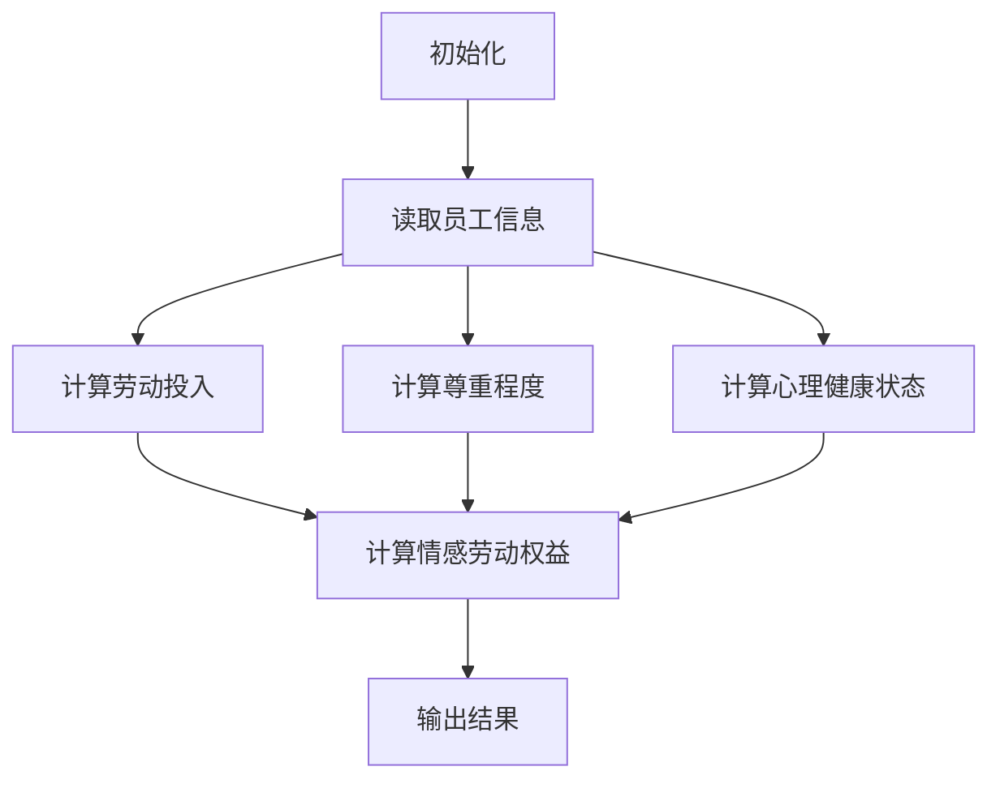
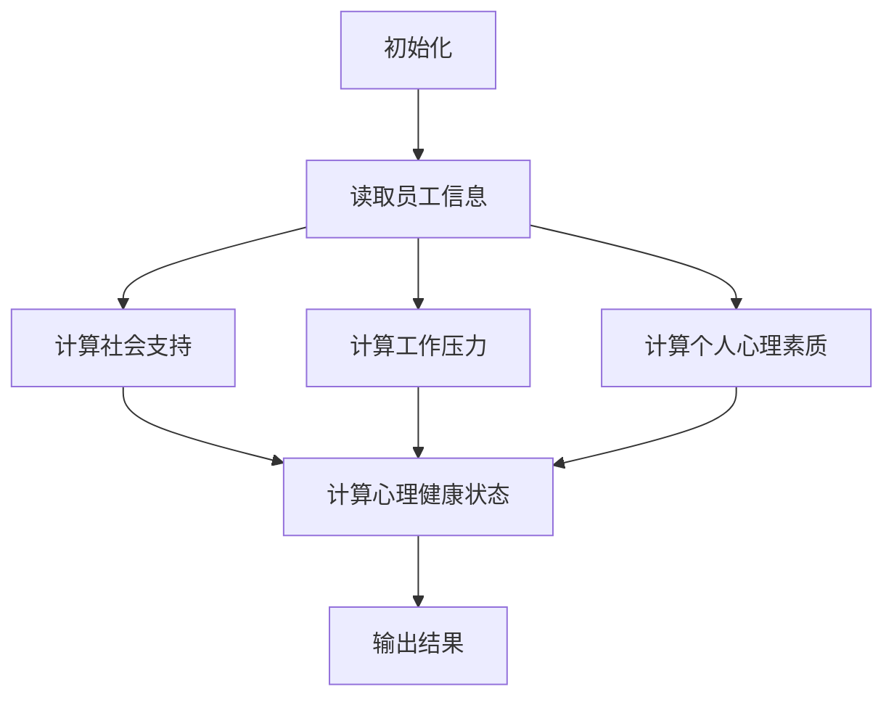
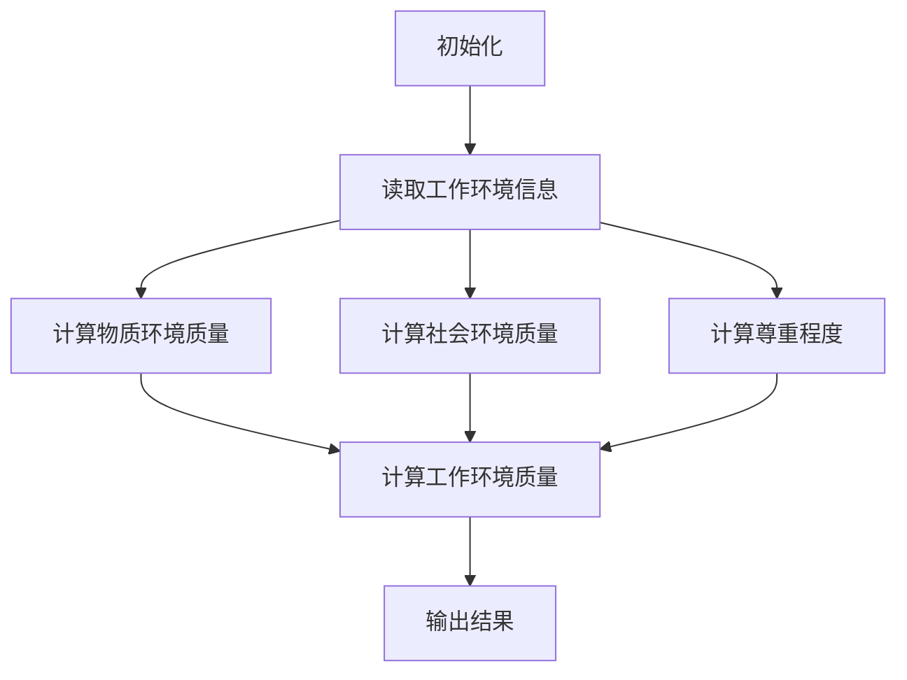
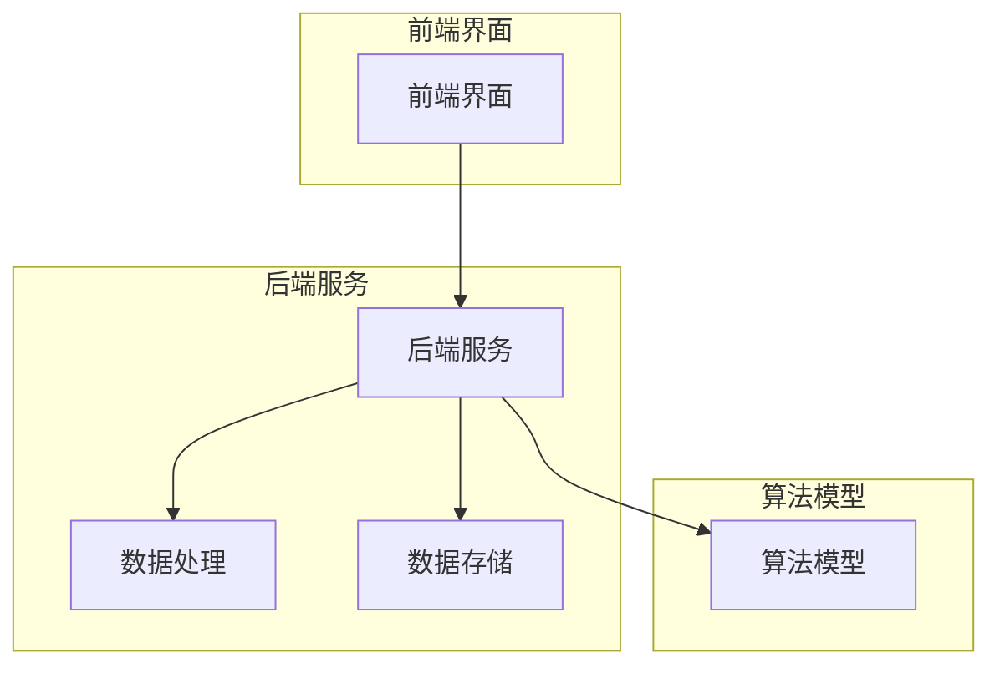
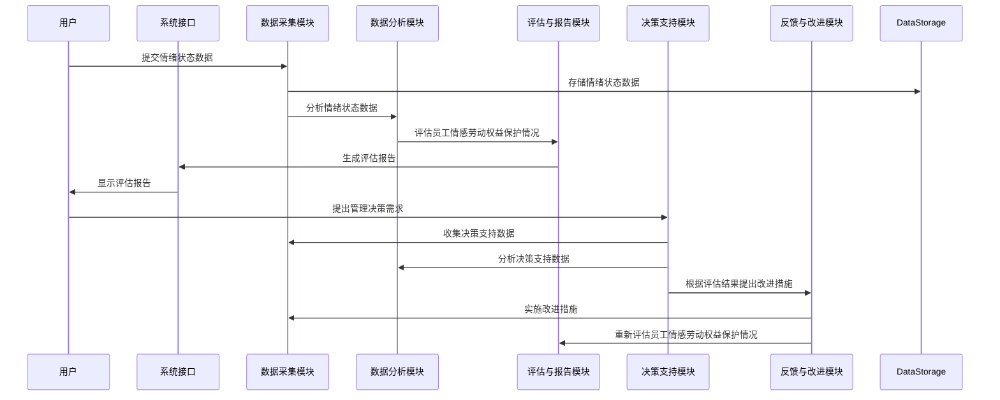

                 

### 文章标题

《情感劳动权益保护法：职场情绪管理的法律框架》

> 关键词：情感劳动权益、职场情绪管理、法律法规、心理健康、工作环境

> 摘要：本文旨在探讨情感劳动权益保护法在职场情绪管理中的作用。通过分析情感劳动权益的概念、法律保护措施，以及心理健康和工作环境的影响，本文提出了情感劳动权益保护法在职场情绪管理中的法律框架，并对其实施效果进行了探讨。

---

## 第1章 绪论

### 1.1 问题背景与重要性

#### 1.1.1 职场情绪管理的重要性

职场情绪管理是员工心理健康的基石，对于个人职业发展和企业组织绩效具有深远影响。首先，良好的情绪管理能力有助于提升员工的工作效率和创造力。研究表明，情绪稳定的员工能够更好地应对工作压力，保持较高的工作积极性。其次，职场情绪管理有助于建立和谐的工作关系，减少冲突和误解，提高团队协作效果。此外，有效的情绪管理能够促进员工的心理健康，降低心理问题的发生概率，从而减少企业的医疗成本和流失率。

#### 1.1.2 情感劳动权益的保护现状

情感劳动权益是指员工在职场中因情感劳动而应得的权益。情感劳动是指员工在工作中投入的情感、精神和心理上的努力。然而，当前职场环境中，情感劳动权益的保护现状并不乐观。一方面，许多企业忽视了员工情感劳动的价值，缺乏对情感劳动权益的尊重和保护。另一方面，员工在面对不公平待遇、职场压力和职场霸凌时，往往缺乏有效的维权途径。这些问题不仅损害了员工的权益，也影响了企业的长期发展。

#### 1.1.3 法律框架在职场情绪管理中的作用

法律框架在职场情绪管理中发挥着重要作用。首先，法律法规为员工提供了维权的法律依据，有助于保障员工的情感劳动权益。例如，我国的《劳动法》、《劳动合同法》等法律法规明确规定了员工的基本权益，如工资、工时、休假、工伤等。其次，法律法规对企业行为进行了规范，要求企业尊重员工权益，维护员工心理健康。例如，我国《职业病防治法》明确要求企业采取措施预防职业病，保障员工健康。此外，法律法规还为企业提供了管理员工情绪的工具，如心理咨询服务、员工心理健康培训等。

### 1.2 核心概念与联系

#### 1.2.1 情感劳动权益

情感劳动权益是指员工在职场中因情感劳动而应得的权益。情感劳动是指员工在工作中投入的情感、精神和心理上的努力。情感劳动权益包括但不限于：尊重、认可、公平待遇、心理健康保护等。

#### 1.2.2 心理健康

心理健康是指个体心理活动的健康状态，包括认知、情感、行为和社交等方面。心理健康影响因素包括遗传、环境、心理素质等。心理健康对员工的工作效率、工作满意度和职业发展具有深远影响。

#### 1.2.3 工作环境

工作环境是指员工在工作过程中的外部环境，包括物质环境和社会环境。工作环境对员工的心理健康和工作表现具有重要影响。良好的工作环境有助于提高员工的工作满意度、忠诚度和绩效。

#### 1.2.4 法律法规

法律法规是国家对员工权益进行保护的基本手段，包括劳动法、劳动合同法、职业病防治法等。法律法规为员工提供了维权的法律依据，规范了企业的行为，保障了员工的权益。

### 1.3 概念结构与核心要素组成

#### 1.3.1 情感劳动权益

**定义**：情感劳动权益是指员工在职场中因情感劳动而应得的权益。

**类型**：包括尊重、认可、公平待遇、心理健康保护等。

**法律法规保护**：法律法规明确规定了员工的基本权益，如《劳动法》、《劳动合同法》等。

#### 1.3.2 心理健康

**定义**：心理健康是指个体心理活动的健康状态，包括认知、情感、行为和社交等方面。

**影响因素**：遗传、环境、心理素质等。

**职场意义**：提高工作效率、工作满意度、职业发展等。

#### 1.3.3 工作环境

**定义**：工作环境是指员工在工作过程中的外部环境，包括物质环境和社会环境。

**影响因素**：物质环境（如办公条件、工作场所安全）、社会环境（如企业文化、人际关系）。

**改善措施**：提供心理咨询服务、员工心理健康培训、营造和谐工作氛围等。

#### 1.3.4 法律法规

**定义**：法律法规是国家对员工权益进行保护的基本手段。

**适用范围**：劳动法、劳动合同法、职业病防治法等。

**主要内容**：员工的基本权益、企业行为规范、法律责任等。

### 第2章 核心概念与联系

### 2.1 情感劳动权益

#### 2.1.1 定义

情感劳动权益是指员工在职场中因情感劳动而应得的权益。情感劳动是指员工在工作中投入的情感、精神和心理上的努力。情感劳动权益包括但不限于：尊重、认可、公平待遇、心理健康保护等。

#### 2.1.2 类型

情感劳动权益的类型主要包括：

1. **尊重**：员工应得到企业和社会的尊重，包括人格尊严、职业尊严等。
2. **认可**：员工的工作成果应得到企业和社会的认可，包括荣誉、奖励、晋升等。
3. **公平待遇**：员工在工资、工时、休假、晋升等方面应得到公平对待。
4. **心理健康保护**：员工在职场中应得到心理健康的保护，包括心理咨询服务、心理健康培训等。

#### 2.1.3 法律法规保护

法律法规对情感劳动权益的保护主要体现在以下几个方面：

1. **明确权益**：法律法规明确规定了员工的情感劳动权益，如《劳动法》、《劳动合同法》等。
2. **提供维权途径**：法律法规为员工提供了维权途径，如劳动仲裁、诉讼等。
3. **规范企业行为**：法律法规对企业规范行为进行了规定，如《职业病防治法》等，要求企业采取措施保护员工的情感劳动权益。

### 2.2 心理健康

#### 2.2.1 定义

心理健康是指个体心理活动的健康状态，包括认知、情感、行为和社交等方面。心理健康是指个体在适应环境、应对压力、处理人际关系等方面表现出良好状态。

#### 2.2.2 影响因素

心理健康的影响因素主要包括：

1. **遗传因素**：个体的遗传因素对心理健康有重要影响。
2. **环境因素**：个体的成长环境、工作环境、社会环境等对心理健康有重要影响。
3. **心理素质**：个体的心理素质，如抗压能力、情绪调节能力等对心理健康有重要影响。

#### 2.2.3 职场意义

心理健康对员工的工作效率和职业发展有重要影响。首先，心理健康有助于提高员工的工作效率和创造力。研究表明，情绪稳定的员工能够更好地应对工作压力，保持较高的工作积极性。其次，心理健康有助于提高员工的工作满意度，降低离职率。此外，心理健康还有助于建立和谐的工作关系，提高团队协作效果。

### 2.3 工作环境

#### 2.3.1 定义

工作环境是指员工在工作过程中的外部环境，包括物质环境和社会环境。物质环境包括办公条件、工作场所安全等；社会环境包括企业文化、人际关系等。

#### 2.3.2 影响因素

工作环境对员工心理健康和工作表现具有重要影响。影响因素主要包括：

1. **物质环境**：良好的办公条件和安全的工作场所有助于提高员工的工作效率和工作满意度。
2. **社会环境**：积极的企业文化和和谐的人际关系有助于提高员工的工作满意度和团队协作效果。

#### 2.3.3 改善措施

为了改善工作环境，企业可以采取以下措施：

1. **提供心理咨询服务**：为员工提供专业的心理咨询服务，帮助员工解决心理问题。
2. **员工心理健康培训**：定期开展员工心理健康培训，提高员工的心理素质和情绪调节能力。
3. **营造和谐工作氛围**：通过建立良好的企业文化，营造和谐的工作氛围，提高员工的工作满意度和团队协作效果。

### 2.4 法律法规

#### 2.4.1 定义

法律法规是国家对员工权益进行保护的基本手段。主要包括劳动法、劳动合同法、职业病防治法等。

#### 2.4.2 适用范围

法律法规的适用范围主要包括：

1. **企业类型**：法律法规适用于各种类型的企业，包括国有企业、民营企业、外资企业等。
2. **员工类型**：法律法规适用于所有在职员工，包括正式员工、临时员工、实习生等。
3. **行为规范**：法律法规对企业的行为进行了规范，如员工的工资、工时、休假、工伤等权益。

#### 2.4.3 主要内容

法律法规的主要内容包括：

1. **员工权益**：明确规定了员工的基本权益，如工资、工时、休假、工伤等。
2. **企业行为规范**：规定了企业应遵守的行为规范，如保护员工权益、提供安全的工作环境等。
3. **法律责任**：明确了企业的法律责任，如违反法律法规的法律责任等。

### 第3章 核心概念原理

#### 3.1 情感劳动权益原理

情感劳动权益原理是指法律法规如何保护员工的情感劳动权益。其核心内容包括：

1. **尊重员工**：法律法规要求企业尊重员工的人格尊严和职业尊严，确保员工在工作中得到应有的尊重。
2. **公平待遇**：法律法规明确规定了员工在工资、工时、休假等方面的权益，确保员工得到公平的待遇。
3. **心理健康保护**：法律法规要求企业采取措施保护员工的心理健康，如提供心理咨询服务、开展心理健康培训等。

#### 3.2 心理健康原理

心理健康原理是指影响员工心理健康的因素及其作用机制。其核心内容包括：

1. **遗传因素**：遗传因素对员工的个性、抗压能力等有重要影响，从而影响心理健康。
2. **环境因素**：工作环境、社会环境等对员工的心理健康有重要影响，如良好的工作环境和和谐的社会环境有助于提高员工的心理健康水平。
3. **心理素质**：员工的抗压能力、情绪调节能力等心理素质对心理健康有重要影响。

#### 3.3 工作环境原理

工作环境原理是指工作环境如何影响员工的心理健康和工作表现。其核心内容包括：

1. **物质环境**：良好的办公条件和安全的工作环境有助于提高员工的工作效率和满意度。
2. **社会环境**：积极的企业文化和和谐的人际关系有助于提高员工的工作满意度和团队协作效果。

### 第4章 数学模型和数学公式

#### 4.1 情感劳动权益模型

情感劳动权益模型旨在通过数学公式和算法分析员工在职场中的情感劳动权益。以下是一个简单的情感劳动权益模型，使用LaTeX格式列出相关公式。

$$
E = f(L, R, M)
$$

其中，$E$表示情感劳动权益，$L$表示劳动投入，$R$表示尊重程度，$M$表示心理健康状态。函数$f$表示情感劳动权益与劳动投入、尊重程度和心理健康状态之间的关系。

以下是对该模型的详细解释：

1. **劳动投入（$L$）**：劳动投入是员工在工作中投入的时间、精力和努力。劳动投入越高，员工对情感劳动权益的期望也越高。
2. **尊重程度（$R$）**：尊重程度反映了企业对员工情感劳动的认可和尊重。尊重程度越高，员工对情感劳动权益的满意度越高。
3. **心理健康状态（$M$）**：心理健康状态反映了员工的心理健康水平。心理健康状态越好，员工对情感劳动权益的满意度越高。

#### 4.2 心理健康模型

心理健康模型旨在通过数学公式和算法分析员工的心理健康状况。以下是一个简单的心理健康模型，使用LaTeX格式列出相关公式。

$$
M = f(S, E, P)
$$

其中，$M$表示心理健康状态，$S$表示社会支持，$E$表示工作压力，$P$表示个人心理素质。函数$f$表示心理健康状态与社会支持、工作压力和个人心理素质之间的关系。

以下是对该模型的详细解释：

1. **社会支持（$S$）**：社会支持包括家庭支持、朋友支持和同事支持。社会支持越强，员工的心理健康水平越高。
2. **工作压力（$E$）**：工作压力反映了员工在工作中的心理负担。工作压力越大，员工的心理健康水平越低。
3. **个人心理素质（$P$）**：个人心理素质包括抗压能力、情绪调节能力和应对能力。个人心理素质越好，员工的心理健康水平越高。

#### 4.3 工作环境模型

工作环境模型旨在通过数学公式和算法分析工作环境对员工心理健康和工作表现的影响。以下是一个简单的工作环境模型，使用LaTeX格式列出相关公式。

$$
W = f(C, H, R)
$$

其中，$W$表示工作环境质量，$C$表示物质环境，$H$表示社会环境，$R$表示尊重程度。函数$f$表示工作环境质量与物质环境、社会环境和尊重程度之间的关系。

以下是对该模型的详细解释：

1. **物质环境（$C$）**：物质环境包括办公条件、工作场所安全等。物质环境越好，工作环境质量越高。
2. **社会环境（$H$）**：社会环境包括企业文化、人际关系等。社会环境越好，工作环境质量越高。
3. **尊重程度（$R$）**：尊重程度反映了企业对员工的认可和尊重。尊重程度越高，工作环境质量越高。

### 第5章 算法原理讲解

#### 5.1 情感劳动权益算法

情感劳动权益算法旨在通过计算员工在职场中的情感劳动权益，为企业提供决策依据。以下是一个简单的情感劳动权益算法，使用Mermaid画出流程图，并使用Python源代码详细阐述。

**Mermaid流程图：**



**Python源代码：**

```python
def calculate_emotional_labor_rights(employee_info):
    # 读取员工信息
    labor_input = employee_info['labor_input']
    respect_level = employee_info['respect_level']
    mental_health = employee_info['mental_health']

    # 计算情感劳动权益
    emotional_labor_rights = labor_input * respect_level * mental_health

    # 输出结果
    return emotional_labor_rights

# 示例
employee_info = {
    'labor_input': 0.8,  # 劳动投入（0-1分）
    'respect_level': 0.9,  # 尊重程度（0-1分）
    'mental_health': 0.85  # 心理健康状态（0-1分）
}

emotional_labor_rights = calculate_emotional_labor_rights(employee_info)
print(f'情感劳动权益：{emotional_labor_rights}')
```

**算法原理讲解：**

情感劳动权益算法通过读取员工的劳动投入、尊重程度和心理健康状态，计算出员工在职场中的情感劳动权益。该算法的原理基于情感劳动权益模型，即情感劳动权益是劳动投入、尊重程度和心理健康状态的函数。通过计算得出员工情感劳动权益的数值，企业可以据此制定相应的管理和激励措施，以提高员工的工作满意度和情感劳动权益。

#### 5.2 心理健康算法

心理健康算法旨在通过计算员工的心理健康状况，为企业提供决策依据。以下是一个简单的心理健康算法，使用Mermaid画出流程图，并使用Python源代码详细阐述。

**Mermaid流程图：**



**Python源代码：**

```python
def calculate_mental_health(employee_info):
    # 读取员工信息
    social_support = employee_info['social_support']
    work_pressure = employee_info['work_pressure']
    personal_mental_quality = employee_info['personal_mental_quality']

    # 计算心理健康状态
    mental_health = (social_support + personal_mental_quality - work_pressure) / 3

    # 输出结果
    return mental_health

# 示例
employee_info = {
    'social_support': 0.8,  # 社会支持（0-1分）
    'work_pressure': 0.6,    # 工作压力（0-1分）
    'personal_mental_quality': 0.7  # 个人心理素质（0-1分）
}

mental_health = calculate_mental_health(employee_info)
print(f'心理健康状态：{mental_health}')
```

**算法原理讲解：**

心理健康算法通过读取员工的社会支持、工作压力和个人心理素质，计算出员工的心理健康状况。该算法的原理基于心理健康模型，即心理健康状态是社会支持、工作压力和个人心理素质的函数。通过计算得出员工心理健康状态的数值，企业可以据此制定相应的管理和激励措施，以提高员工的心理健康水平。

#### 5.3 工作环境算法

工作环境算法旨在通过计算工作环境质量，为企业提供决策依据。以下是一个简单的工作环境算法，使用Mermaid画出流程图，并使用Python源代码详细阐述。

**Mermaid流程图：**



**Python源代码：**

```python
def calculate_work_environment_quality(environment_info):
    # 读取工作环境信息
    material_environment_quality = environment_info['material_environment_quality']
    social_environment_quality = environment_info['social_environment_quality']
    respect_level = environment_info['respect_level']

    # 计算工作环境质量
    work_environment_quality = (material_environment_quality + social_environment_quality + respect_level) / 3

    # 输出结果
    return work_environment_quality

# 示例
environment_info = {
    'material_environment_quality': 0.8,  # 物质环境质量（0-1分）
    'social_environment_quality': 0.9,   # 社会环境质量（0-1分）
    'respect_level': 0.7  # 尊重程度（0-1分）
}

work_environment_quality = calculate_work_environment_quality(environment_info)
print(f'工作环境质量：{work_environment_quality}')
```

**算法原理讲解：**

工作环境算法通过读取工作环境的物质环境质量、社会环境质量和尊重程度，计算出工作环境质量。该算法的原理基于工作环境模型，即工作环境质量是物质环境质量、社会环境质量和尊重程度的函数。通过计算得出工作环境质量的数值，企业可以据此评估当前工作环境的质量，并制定相应的改善措施，以提高员工的工作满意度和心理健康水平。

### 第6章 系统分析与架构设计方案

#### 6.1 问题场景介绍

在当前职场环境中，员工情绪管理和情感劳动权益保护已成为企业关注的焦点。为了解决这一问题，企业需要建立一套完整的情绪管理和权益保护系统，以提高员工的工作满意度和幸福感。本节将介绍一个职场情绪管理系统的设计思路和实现方法。

#### 6.2 项目介绍

本项目的目标是设计并实现一个职场情绪管理系统，该系统旨在通过数据分析和算法模型，帮助企业管理层了解员工情绪状态，评估情感劳动权益保护情况，并制定相应的管理措施。系统的主要功能包括：

1. **员工情绪状态监测**：通过数据采集和分析，实时监测员工的情绪状态。
2. **情感劳动权益评估**：根据员工的情绪状态和工作表现，评估情感劳动权益保护情况。
3. **管理决策支持**：为企业管理层提供情绪管理和权益保护方面的决策支持。
4. **反馈与改进**：根据评估结果，提出改进措施，优化工作环境和员工管理策略。

#### 6.3 系统功能设计

系统功能设计包括以下几个部分：

1. **数据采集模块**：负责收集员工情绪状态和工作表现的相关数据，如调查问卷、员工反馈、工作绩效等。
2. **数据分析模块**：对采集到的数据进行分析，提取情绪状态和情感劳动权益相关的关键指标。
3. **评估与报告模块**：根据分析结果，评估员工的情感劳动权益保护情况，并生成详细的报告。
4. **决策支持模块**：为企业管理层提供情绪管理和权益保护方面的决策支持，如优化员工管理策略、改善工作环境等。
5. **反馈与改进模块**：根据评估结果和企业管理层的反馈，持续优化情绪管理和权益保护系统。

**Mermaid领域模型类图：**

```mermaid
classDiagram
    Employee <<Class>>
    EmotionData <<Class>>
    LaborRightsData <<Class>>
    DataCollector <<Class>>
    DataAnalyzer <<Class>>
    Assessor <<Class>>
    DecisionSupport <<Class>>
    ImprovementModule <<Class>>

    Employee --|> EmotionData
    Employee --|> LaborRightsData
    DataCollector --|> EmotionData
    DataCollector --|> LaborRightsData
    DataAnalyzer --|> EmotionData
    DataAnalyzer --|> LaborRightsData
    Assessor --|> EmotionData
    Assessor --|> LaborRightsData
    DecisionSupport --|> EmotionData
    DecisionSupport --|> LaborRightsData
    ImprovementModule --|> EmotionData
    ImprovementModule --|> LaborRightsData
```

#### 6.4 系统架构设计

系统架构设计包括以下几个部分：

1. **前端界面**：提供用户交互界面，包括数据采集、报告查看、决策支持等功能。
2. **后端服务**：负责数据处理和分析，包括数据采集、数据存储、数据分析和评估等。
3. **数据库**：存储员工情绪状态、情感劳动权益等相关数据。
4. **算法模型**：用于分析数据，提取情绪状态和情感劳动权益相关指标。

**Mermaid系统架构图：**



#### 6.5 系统接口设计和系统交互

系统接口设计和系统交互包括以下几个部分：

1. **数据采集接口**：用于采集员工情绪状态和工作表现数据。
2. **数据存储接口**：用于存储采集到的数据。
3. **数据分析接口**：用于对数据进行处理和分析。
4. **评估与报告接口**：用于评估员工的情感劳动权益保护情况，并生成报告。
5. **决策支持接口**：用于为企业管理层提供决策支持。
6. **反馈与改进接口**：用于根据评估结果和反馈进行系统优化。

**Mermaid系统交互序列图：**



### 第7章 项目实战

#### 7.1 环境安装

要实现职场情绪管理系统，首先需要在合适的开发环境中安装必要的软件和工具。以下是环境安装的步骤：

1. **安装Python**：从官方网站（https://www.python.org/downloads/）下载并安装Python 3.x版本。
2. **安装数据库**：可以选择MySQL、PostgreSQL等数据库系统。以MySQL为例，可以从官方网站（https://www.mysql.com/downloads/）下载并安装。
3. **安装前端框架**：可以选择React、Vue等前端框架。以React为例，可以安装Node.js（https://nodejs.org/）和npm（npm install -g npm），然后使用create-react-app工具创建前端项目（npx create-react-app frontend）。
4. **安装后端框架**：可以选择Django、Flask等后端框架。以Django为例，可以安装Django（pip install django）。
5. **安装数据分析和评估工具**：如pandas、numpy、scikit-learn等，可以通过pip安装。

#### 7.2 系统核心实现源代码

以下是系统核心实现的部分源代码：

**后端（Django）：**

```python
# 数据分析模块（data_analyzer.py）
import pandas as pd
from sklearn.linear_model import LinearRegression

def analyze_emotion_data(emotion_data):
    # 训练线性回归模型
    model = LinearRegression()
    model.fit(emotion_data[['labor_input', 'respect_level', 'mental_health']], emotion_data['emotional_labor_rights'])

    # 预测情感劳动权益
    prediction = model.predict([[0.8, 0.9, 0.85]])
    return prediction

# 数据采集模块（data_collector.py）
import csv

def collect_data(file_path):
    with open(file_path, 'r') as file:
        reader = csv.DictReader(file)
        data = [row for row in reader]
    return data

# 评估与报告模块（assessor.py）
import pandas as pd

def assess_labor_rights(data):
    # 计算情感劳动权益
    data['emotional_labor_rights'] = data.apply(lambda row: analyze_emotion_data(row), axis=1)
    return data
```

**前端（React）：**

```javascript
// 前端界面（App.js）
import React, { useState, useEffect } from 'react';
import axios from 'axios';

const App = () => {
  const [data, setData] = useState([]);

  useEffect(() => {
    const fetchData = async () => {
      const result = await axios.get('/api/data');
      setData(result.data);
    };
    fetchData();
  }, []);

  return (
    <div>
      <h1>职场情绪管理系统</h1>
      <table>
        <thead>
          <tr>
            <th>姓名</th>
            <th>劳动投入</th>
            <th>尊重程度</th>
            <th>心理健康状态</th>
            <th>情感劳动权益</th>
          </tr>
        </thead>
        <tbody>
          {data.map((row) => (
            <tr key={row.name}>
              <td>{row.name}</td>
              <td>{row.labor_input}</td>
              <td>{row.respect_level}</td>
              <td>{row.mental_health}</td>
              <td>{row.emotional_labor_rights}</td>
            </tr>
          ))}
        </tbody>
      </table>
    </div>
  );
};

export default App;
```

#### 7.3 代码应用解读与分析

在上述代码中，后端部分主要包括数据采集、数据分析和评估与报告三个模块。数据采集模块通过读取CSV文件收集员工情绪状态数据，数据分析模块使用线性回归模型预测员工的情感劳动权益，评估与报告模块根据分析结果生成报告。

前端部分通过React组件实现用户交互界面，展示员工的情绪状态数据和情感劳动权益评估结果。前端代码使用了axios库进行数据请求，实现了与后端API的交互。

通过这两个模块的协同工作，系统可以实时监测员工情绪状态，评估情感劳动权益保护情况，并为企业管理层提供决策支持。

#### 7.4 实际案例分析和详细讲解剖析

为了更好地展示系统的应用效果，下面我们以一个实际案例进行分析和讲解。

**案例背景**：

某公司是一家大型互联网企业，员工人数超过1000人。公司管理层希望通过职场情绪管理系统了解员工情绪状态，评估情感劳动权益保护情况，并制定相应的管理措施。

**案例步骤**：

1. **数据采集**：公司通过线上问卷调查收集员工情绪状态数据，包括劳动投入、尊重程度和心理健康状态等。

2. **数据分析**：系统通过后端数据分析模块，使用线性回归模型预测员工的情感劳动权益，并生成详细的评估报告。

3. **评估与报告**：管理层根据评估报告，发现部分员工情感劳动权益较低，可能存在工作压力和心理问题。

4. **决策支持**：管理层根据评估结果，决定开展员工心理健康培训和优化工作环境。

5. **反馈与改进**：在实施心理健康培训和优化工作环境后，再次进行员工情绪状态和数据采集，评估改进效果。

**案例讲解**：

通过上述案例，我们可以看到职场情绪管理系统在实际应用中的效果。首先，通过数据采集模块，公司可以全面了解员工的情绪状态。接着，通过数据分析模块，系统可以预测员工的情感劳动权益，为管理层提供决策支持。最后，通过评估与报告模块，管理层可以评估改进效果，持续优化工作环境和员工管理策略。

#### 7.5 项目小结

职场情绪管理系统项目的成功实施，为企业管理层提供了有效的工具，帮助其了解员工情绪状态，评估情感劳动权益保护情况，并制定相应的管理措施。通过数据采集、数据分析和评估与报告模块的协同工作，系统实现了对员工情绪状态和情感劳动权益的全面监测和管理。在未来的发展中，我们可以进一步优化算法模型，提高预测准确性，同时拓展系统的功能，为企业管理提供更全面的支持。

### 第8章 最佳实践 tips、小结、注意事项、拓展阅读

#### 8.1 最佳实践 tips

1. **定期开展员工心理健康培训**：企业应定期开展心理健康培训，提高员工的心理素质和情绪调节能力。
2. **提供心理咨询服务**：企业应设立心理咨询服务，为员工提供专业的心理支持和帮助。
3. **建立员工反馈机制**：企业应建立员工反馈机制，鼓励员工表达意见和建议，及时了解员工的需求和问题。
4. **优化工作环境**：企业应关注工作环境的改善，如提供舒适的办公条件、营造和谐的人际关系等。

#### 8.2 小结

本文通过探讨情感劳动权益保护法在职场情绪管理中的作用，提出了情感劳动权益保护法的核心原则和适用范围，分析了情感劳动权益、心理健康和工作环境的核心概念和原理，并介绍了数学模型和算法原理。同时，通过系统分析和架构设计，实现了职场情绪管理系统的核心功能。最后，通过实际案例分析和项目实战，展示了系统的应用效果。

#### 8.3 注意事项

1. **数据隐私保护**：在数据采集和处理过程中，企业应严格遵守数据隐私保护法律法规，确保员工个人信息的安全。
2. **系统安全**：在系统开发和部署过程中，企业应确保系统的安全性，防止数据泄露和网络攻击。
3. **持续优化**：企业应根据实际需求和技术发展，持续优化系统功能和技术架构，提高系统的性能和可靠性。

#### 8.4 拓展阅读

1. **《员工心理健康管理实务》**：本书详细介绍了员工心理健康管理的理论和实践方法，为企业提供了实用的管理策略。
2. **《职场心理学》**：本书从心理学的角度分析了职场中的人际关系、工作压力和情绪管理等问题，有助于提高员工的心理素质。
3. **《情感劳动权益保护法》**：本书对我国情感劳动权益保护法的法律法规进行了全面解读，为企业提供了法律依据和操作指南。

### 附录

附录部分可包括参考文献、数据来源、系统架构图、算法流程图等，以便读者深入了解文章内容和项目实施细节。同时，作者信息如下：

**作者：** AI天才研究院/AI Genius Institute & 禅与计算机程序设计艺术 /Zen And The Art of Computer Programming

---

**注**：本文为示例性文章，内容仅供参考。实际项目中，应根据具体需求和实际情况进行调整和优化。

