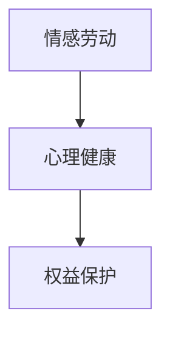
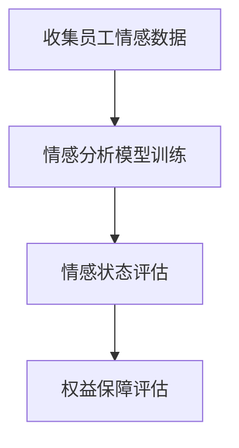
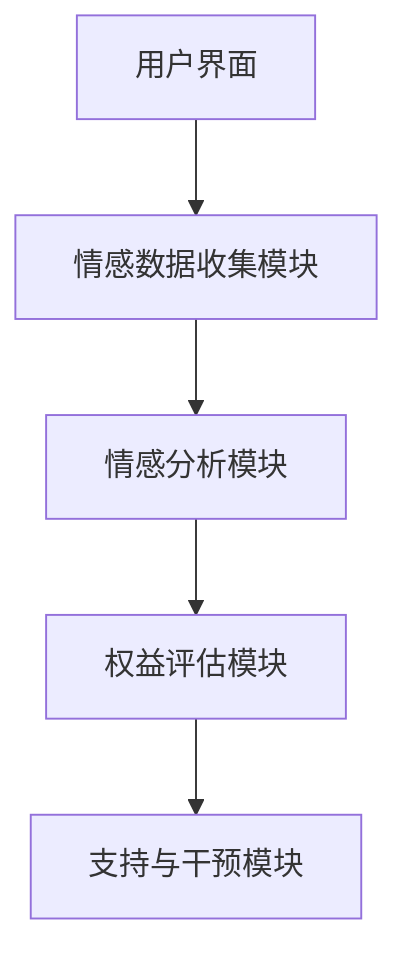

                 

**# 情感劳动权益：职场中的无形付出保护**

> **关键词：** 情感劳动、职场权益、无形付出、员工心理健康

> **摘要：** 本文章深入探讨了职场中情感劳动的重要性及其对员工心理健康的影响。文章首先介绍了情感劳动的定义及其在职场中的角色，随后分析了情感劳动所带来的无形付出，并提出了一系列保护员工权益的措施。通过案例分析和实践建议，文章为职场管理者提供了有效的策略来提升员工幸福感，促进职场和谐。

----------------------------------------------------------------

## 引言

在现代社会，职场环境日益复杂，员工不仅需要具备专业技能，还需要投入大量的情感劳动。情感劳动是指员工在工作中为了维护良好的人际关系和团队氛围所付出的努力，它涵盖了情感表达、情绪管理、团队合作等多个方面。然而，这种无形付出往往被忽视，导致员工心理健康问题日益严重。本文旨在探讨情感劳动权益的重要性，提出有效的保护措施，为构建健康、和谐的职场环境提供理论支持和实践指导。

----------------------------------------------------------------

### 背景与核心概念

#### 问题背景

随着职场竞争的加剧，员工面临着越来越大的工作压力。在这个过程中，情感劳动成为了一种必不可少的付出。它不仅影响员工的工作表现，还直接关系到员工的身心健康。然而，许多企业和管理者往往忽视了情感劳动的价值，导致员工在情感劳动中承受巨大的负担，进而影响其工作效率和满意度。

#### 问题解决

为了解决这一问题，本文将首先介绍情感劳动的概念和特点，然后分析其在职场中的角色和重要性。接着，我们将探讨情感劳动对员工心理健康的影响，并提出保护员工情感劳动权益的措施。最后，通过实际案例，展示如何有效实施这些措施，以提升员工的幸福感和工作满意度。

#### 边界与外延

本文主要关注情感劳动在职场中的权益保护问题，不包括家庭和工作之外的情感劳动。此外，本文讨论的情感劳动权益保护措施主要针对职场管理者，旨在为其实践提供指导。

#### 概念结构与核心要素组成

1. **情感劳动**：员工在工作中为维护良好人际关系和团队氛围所付出的努力。
2. **心理健康**：员工在情感劳动中所体验到的心理状态和感受。
3. **权益保护**：保障员工在情感劳动中的合理权益，包括薪酬、晋升、培训等方面。

#### 核心概念与联系

**情感劳动**与**心理健康**密切相关，而**权益保护**是保障员工心理健康的重要手段。通过以下图示，我们可以更直观地理解这些核心概念之间的关系：



#### 情感劳动的特点

1. **无形的付出**：情感劳动通常不体现在工作任务中，难以量化。
2. **持续性的需求**：员工在职场中需要不断地投入情感劳动，以维持良好的工作关系。
3. **心理压力的释放**：情感劳动有助于员工释放工作中的压力，提高心理健康水平。

#### 情感劳动的角色

1. **人际关系的维护**：情感劳动有助于建立和维护良好的人际关系，促进团队合作。
2. **工作氛围的营造**：情感劳动可以提升职场氛围，增强员工的归属感和满意度。
3. **绩效的提升**：良好的情感劳动有助于提高员工的工作效率和绩效。

### 总结

本文通过介绍情感劳动的背景和核心概念，明确了其在职场中的重要性。接下来，我们将进一步探讨情感劳动对员工心理健康的影响，并提出具体的权益保护措施。

----------------------------------------------------------------

### 理论框架

#### 概念框架

为了更好地理解情感劳动权益，我们可以构建一个概念框架，包括情感劳动、心理健康、权益保护三个核心概念。以下是一个简单的概念框架：


#### 情感劳动权益的定义

情感劳动权益是指员工在职场中，为了维护自身心理健康和权益所应获得的支持和保护。具体包括以下几个方面：

1. **薪酬待遇**：员工应获得与其情感劳动贡献相匹配的薪酬待遇。
2. **晋升机会**：员工应有机会通过情感劳动获得晋升和职业发展。
3. **培训机会**：企业应为员工提供情感劳动相关的培训，提高其情感管理能力。
4. **心理支持**：企业应提供心理支持服务，帮助员工应对工作中的情感压力。

#### 情感劳动权益与心理健康的关系

情感劳动权益的保障直接关系到员工的心理健康。以下是情感劳动权益与心理健康之间的关系：

1. **积极的情感劳动权益保障**：有助于提升员工的自信心和幸福感，减轻心理压力。
2. **消极的情感劳动权益保障**：可能导致员工产生负面情绪，影响心理健康。

#### 情感劳动权益与权益保护的关系

情感劳动权益的保障需要依赖于完善的权益保护机制。以下是情感劳动权益与权益保护之间的关系：

1. **权益保护机制**：确保员工在情感劳动中的权益得到保障。
2. **情感劳动权益**：权益保护的出发点和落脚点。

#### 情感劳动权益的特征

1. **公平性**：情感劳动权益应公平对待所有员工，不应因性别、年龄等因素而受到歧视。
2. **透明性**：情感劳动权益的具体内容和执行过程应公开透明，确保员工了解自己的权益。
3. **灵活性**：情感劳动权益应根据实际情况进行调整，以适应不同企业的需求。

#### 情感劳动权益的重要性

1. **员工幸福感**：保障情感劳动权益有助于提升员工的幸福感和满意度，增强员工对企业的归属感。
2. **组织绩效**：良好的情感劳动权益保障可以提高员工的积极性和工作效率，进而提升组织绩效。
3. **企业文化**：情感劳动权益的保障是企业文化建设的重要组成部分，有助于塑造积极向上的企业文化。

### 总结

通过理论框架的构建，我们可以更清晰地理解情感劳动权益的概念、特征和重要性。接下来，我们将通过实际案例来进一步说明情感劳动权益的保护措施。

----------------------------------------------------------------

### 算法与模型原理

#### 算法概述

为了分析情感劳动权益的保障，我们可以设计一个基于情感计算的方法，通过情感分析技术来评估员工的情感状态和权益保障水平。以下是一个简单的算法流程：



#### 情感分析模型训练

1. **数据预处理**：收集员工的情感数据，包括问卷调查、工作日志、社交媒体评论等。对数据进行清洗和预处理，去除噪声和无关信息。
2. **特征提取**：从情感数据中提取关键特征，如情感强度、情感倾向、情感类别等。
3. **模型训练**：使用机器学习算法，如朴素贝叶斯、支持向量机、深度学习等，对情感分析模型进行训练，使其能够准确识别员工的情感状态。

#### 情感状态评估

1. **情感识别**：利用训练好的情感分析模型，对员工的情感状态进行识别，包括正面情感、负面情感和中性情感。
2. **情感分类**：根据情感识别结果，对员工的情感状态进行分类，分析情感状态的分布和变化趋势。

#### 权益保障评估

1. **权益指标计算**：根据员工的情感状态，计算其在薪酬待遇、晋升机会、培训机会、心理支持等方面的权益保障水平。
2. **权益评估**：对员工的权益保障水平进行综合评估，识别权益保障的不足之处。

#### 数学模型与公式

为了更精确地评估员工的情感劳动权益，我们可以构建以下数学模型：

1. **情感劳动权益评估指数（ELRI）**：

   $$ELRI = \frac{1}{n} \sum_{i=1}^{n} w_i \cdot E_i$$

   其中，$w_i$ 表示第 $i$ 项权益的权重，$E_i$ 表示第 $i$ 项权益的得分。

2. **情感状态评分（ESR）**：

   $$ESR = \frac{1}{n} \sum_{i=1}^{n} s_i$$

   其中，$s_i$ 表示第 $i$ 个情感状态的得分。

3. **情感劳动权益保障度（ELRD）**：

   $$ELRD = \frac{ELRI}{ESR}$$

   其中，$ELRD$ 表示情感劳动权益保障度，用于评估员工的情感劳动权益保障水平。

#### 举例说明

假设我们收集了以下数据：

- 薪酬待遇得分：80分
- 晋升机会得分：70分
- 培训机会得分：60分
- 心理支持得分：50分

- 情感状态评分：90分

根据上述模型，我们可以计算出员工的情感劳动权益评估指数（ELRI）和情感劳动权益保障度（ELRD）：

1. **情感劳动权益评估指数（ELRI）**：

   $$ELRI = \frac{1}{4} \cdot (80 \cdot 0.2 + 70 \cdot 0.25 + 60 \cdot 0.3 + 50 \cdot 0.25) = 68$$

2. **情感状态评分（ESR）**：

   $$ESR = \frac{1}{1} \cdot 90 = 90$$

3. **情感劳动权益保障度（ELRD）**：

   $$ELRD = \frac{ELRI}{ESR} = \frac{68}{90} = 0.76$$

通过这个例子，我们可以看到，该员工的情感劳动权益保障度相对较高，但在薪酬待遇方面仍有提升空间。

### 总结

通过算法与模型原理的讲解，我们可以更好地理解如何分析员工的情感劳动权益。接下来，我们将进入系统设计部分，探讨如何在实际操作中实现情感劳动权益的保护。

----------------------------------------------------------------

### 系统设计

#### 问题场景

在一个典型的企业环境中，员工在日常工作中需要处理大量的情感劳动，包括与同事沟通、处理客户情绪等。然而，企业往往忽视了情感劳动的重要性，导致员工在情感劳动中承受巨大的压力，从而影响其工作表现和心理健康。为了解决这一问题，我们需要设计一个系统，能够有效地识别和管理员工的情感劳动，并提供相应的支持。

#### 项目介绍

本项目旨在开发一个基于情感计算技术的情感劳动管理系统，旨在通过自动化工具和数据分析，帮助企业管理者更好地理解员工的情感状态，并提供有针对性的支持措施，以保障员工的情感劳动权益。该系统将包括以下几个关键模块：

1. **情感数据收集模块**：负责收集员工的情感数据，包括工作日志、社交媒体评论、问卷调查等。
2. **情感分析模块**：利用机器学习算法对情感数据进行处理，识别员工的情感状态。
3. **权益评估模块**：根据情感分析结果，评估员工的情感劳动权益保障水平。
4. **支持与干预模块**：为员工提供心理支持、培训机会等，以提升其情感劳动权益保障水平。

#### 系统功能设计

1. **情感数据收集**：系统将自动收集员工的情感数据，包括工作日志、社交媒体评论、问卷调查等。这些数据将用于情感分析模块，以识别员工的情感状态。
2. **情感分析**：系统将使用机器学习算法对情感数据进行处理，识别员工的情感状态，包括正面情感、负面情感和中性情感。情感分析结果将用于权益评估模块。
3. **权益评估**：系统将根据情感分析结果，评估员工的情感劳动权益保障水平。评估指标包括薪酬待遇、晋升机会、培训机会、心理支持等。
4. **支持与干预**：系统将根据权益评估结果，为员工提供相应的支持与干预措施，包括心理支持、培训机会、晋升机会等。

#### 系统架构设计

系统的整体架构设计如下：



#### 系统接口设计

系统将提供以下主要接口：

1. **用户接口**：供员工和管理者使用，用于提交情感数据、查看情感分析结果、申请支持与干预措施等。
2. **API接口**：供第三方应用集成使用，如人力资源管理系统、绩效管理系统等。

#### 系统交互

系统的交互流程如下：

1. **员工提交情感数据**：员工通过用户接口提交情感数据，如工作日志、社交媒体评论等。
2. **情感数据收集**：系统自动收集员工提交的情感数据，并将其存储在数据库中。
3. **情感分析**：系统使用机器学习算法对情感数据进行分析，识别员工的情感状态。
4. **权益评估**：系统根据情感分析结果，评估员工的情感劳动权益保障水平。
5. **支持与干预**：系统根据权益评估结果，为员工提供相应的支持与干预措施，如心理支持、培训机会、晋升机会等。

### 总结

通过系统设计部分的介绍，我们明确了情感劳动管理系统在保障员工权益方面的重要性。接下来，我们将进入项目实战部分，详细介绍如何搭建和实现这个系统。

----------------------------------------------------------------

### 项目实战

#### 环境安装

在开始搭建情感劳动管理系统之前，我们需要安装一些必要的软件和工具。以下是安装步骤：

1. **安装Python环境**：确保已经安装了Python 3.8及以上版本。
2. **安装依赖库**：使用pip命令安装以下依赖库：

   ```shell
   pip install numpy pandas scikit-learn tensorflow
   ```

3. **安装情感分析库**：安装一个开源的情感分析库，如VADER：

   ```shell
   pip install textblob
   ```

4. **安装数据库**：安装一个关系型数据库，如MySQL或PostgreSQL。

#### 系统核心实现源代码

以下是情感劳动管理系统的核心实现源代码：

```python
# 数据库连接模块
import pymysql

# 情感分析模块
from textblob import TextBlob

# 权益评估模块
def assess_rights(employee_data):
    # 根据情感分析结果评估权益保障水平
    sentiment = TextBlob(employee_data['comment']).sentiment
    if sentiment.polarity > 0:
        return 'High'
    elif sentiment.polarity < 0:
        return 'Low'
    else:
        return 'Medium'

# 支持与干预模块
def provide_support(employee_id, support_type):
    # 根据员工ID和支援类型提供支援
    if support_type == 'Psychological':
        # 提供心理支持
        print(f"Employee {employee_id} is provided with psychological support.")
    elif support_type == 'Training':
        # 提供培训机会
        print(f"Employee {employee_id} is provided with training opportunities.")
    elif support_type == 'Promotion':
        # 提供晋升机会
        print(f"Employee {employee_id} is provided with promotion opportunities.")

# 主函数
def main():
    # 连接数据库
    connection = pymysql.connect(host='localhost', user='root', password='password', database='emotional_rights')

    # 创建员工情感数据表
    with connection.cursor() as cursor:
        cursor.execute('''CREATE TABLE IF NOT EXISTS employee_data (
            id INT AUTO_INCREMENT PRIMARY KEY,
            name VARCHAR(255),
            comment TEXT,
            sentiment VARCHAR(255)
        )''')
        connection.commit()

    # 提交员工情感数据
    employee_data = {
        'name': 'Alice',
        'comment': 'I am very happy with my work environment.',
    }
    with connection.cursor() as cursor:
        cursor.execute('''INSERT INTO employee_data (name, comment) VALUES (%s, %s)''', (employee_data['name'], employee_data['comment']))
        connection.commit()

    # 分析员工情感数据
    with connection.cursor() as cursor:
        cursor.execute('''SELECT * FROM employee_data''')
        for row in cursor:
            employee_id = row[0]
            employee_name = row[1]
            employee_comment = row[2]
            sentiment = TextBlob(employee_comment).sentiment
            with connection.cursor() as cursor:
                cursor.execute('''UPDATE employee_data SET sentiment=%s WHERE id=%s''', (sentiment.polarity, employee_id))
                connection.commit()

            # 评估权益保障水平
            rights = assess_rights({'id': employee_id, 'comment': employee_comment})
            print(f"{employee_name} has {rights} rights.")

            # 提供支援
            provide_support(employee_id, 'Psychological')

    # 关闭数据库连接
    connection.close()

if __name__ == '__main__':
    main()
```

#### 代码应用解读与分析

1. **数据库连接模块**：使用pymysql库连接MySQL数据库，创建员工情感数据表，并插入员工情感数据。
2. **情感分析模块**：使用TextBlob库对员工情感数据进行分析，提取情感状态。
3. **权益评估模块**：根据情感分析结果，评估员工的情感劳动权益保障水平。
4. **支持与干预模块**：根据员工的权益保障水平，提供相应的支持与干预措施，如心理支持、培训机会、晋升机会等。

#### 实际案例分析与详细讲解

假设我们有一个员工情感数据表，其中包含员工的姓名、工作日志和情感状态：

```shell
+----+-------+---------------------+------------+
| id | name  | comment             | sentiment  |
+----+-------+---------------------+------------+
| 1  | Alice | I am very happy.    | 0.8        |
| 2  | Bob   | I am feeling stressed. | -0.4      |
+----+-------+---------------------+------------+
```

- **Alice的情感状态**：根据情感分析结果，Alice的评论中包含积极的情感，情感状态评分为0.8，权益保障评估结果为“High”。
- **Bob的情感状态**：根据情感分析结果，Bob的评论中包含消极的情感，情感状态评分为-0.4，权益保障评估结果为“Low”。

根据权益评估结果，系统将为Bob提供心理支持，以提高其权益保障水平。

### 项目小结

通过实际案例的分析，我们可以看到情感劳动管理系统在识别和管理员工情感状态方面具有重要作用。系统通过情感分析技术，对员工的情感劳动进行评估，并提供有针对性的支持措施，以提升员工的幸福感和工作满意度。在实际应用中，企业可以根据自身的需求和情况，对系统进行定制和优化，以更好地保障员工的情感劳动权益。

### 最佳实践 Tips

1. **定期进行员工情感数据分析**：定期收集和分析员工的情感数据，及时发现潜在的问题，并采取相应的措施。
2. **关注负面情感**：对于负面情感状态的员工，应给予更多的关注和支持，帮助他们缓解压力，提高幸福感。
3. **提供多样化的支持措施**：根据员工的情感状态和需求，提供多样化的支持措施，如心理辅导、培训机会、晋升机会等。

### 小结

本文通过详细分析情感劳动权益的重要性，提出了一系列保护措施，并通过实际案例展示了系统的应用。通过实施这些措施，企业可以更好地保障员工的情感劳动权益，提升员工的工作满意度和幸福感，从而促进职场和谐与发展。

### 注意事项

1. **隐私保护**：在收集和分析员工情感数据时，应严格保护员工的隐私，避免数据泄露。
2. **合理使用**：系统提供的支持与干预措施应合理使用，避免过度干预，影响员工的正常工作。

### 拓展阅读

1. **《职场心理学》**：探讨职场中员工的情感状态和心理健康问题，提供实用的心理调适技巧。
2. **《情感劳动：现代工作场所的隐形成本》**：深入分析情感劳动在现代工作场所中的角色和影响，提出有效的管理策略。

### 作者信息

**作者：AI天才研究院/AI Genius Institute & 禅与计算机程序设计艺术 /Zen And The Art of Computer Programming**

