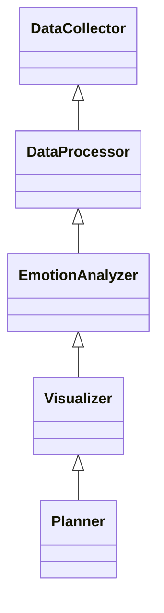
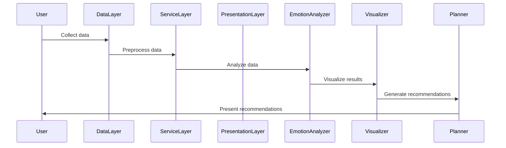
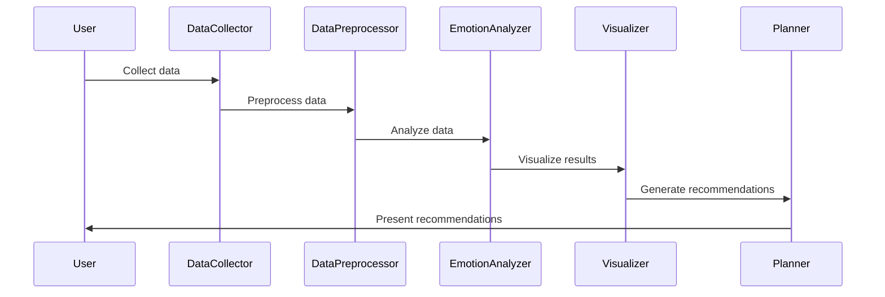

                 

# 《情感地理学应用：城市规划中的人文因素》

> 关键词：情感地理学、城市规划、人文因素、算法、系统架构、案例分析、最佳实践

> 摘要：本文深入探讨了情感地理学在城市规划中的应用，分析了情感地理学的基本原理和与城市规划的结合，通过具体案例和实际项目展示了情感地理学在居住区、商业区和公园绿地规划中的实践。本文旨在为城市规划者和相关领域研究者提供有价值的参考，以促进城市规划的人文性和人性化。

## 引言

### 1.1 问题背景

随着城市化进程的加速，城市规模不断扩大，人口密度日益增加，如何提升城市居民的生活质量成为城市规划的重要课题。在城市规划中，传统的以功能为导向的方法难以全面考虑居民的情感需求，从而影响了城市的人文性和人性化。因此，引入情感地理学这一新兴领域，对于提升城市规划的质量和居民满意度具有重要意义。

### 1.2 情感地理学的基本原理

情感地理学是研究人类情感与地理空间相互作用的学科。它关注个体和群体在特定地理空间中的情感体验、情感表达和情感传播。情感地理学通过量化分析情感数据，揭示情感在空间中的分布、流动和变化规律，从而为城市规划提供科学依据。

### 1.3 情感地理学在城市规划中的应用

情感地理学在城市规划中的应用主要包括居住区规划、商业区规划和公园绿地规划。通过情感地理学的方法，可以更好地理解居民的情感需求，为城市规划提供更加人性化的设计方案。

### 1.4 研究目的与意义

本文旨在探讨情感地理学在城市规划中的应用，通过具体案例分析，提出情感地理学在提升城市规划人文性方面的作用。本文的研究目的和意义在于：

1. 提高城市规划者对情感地理学的认识，促进城市规划方法的创新。
2. 为城市规划提供基于情感分析的决策支持，提升居民的生活质量。
3. 推动情感地理学在我国的实践和发展。

## 情感地理学原理

### 2.1 情感地理学的基本原理

情感地理学的基本原理包括情感数据收集、情感数据分析、情感空间表达和情感干预等。这些原理构成了情感地理学的基础，为城市规划提供了科学依据。

### 2.2 情感地理学与城市规划的结合

情感地理学通过研究情感在空间中的分布、流动和变化规律，为城市规划提供了新的视角。例如，通过情感数据收集和分析，可以识别出城市中的情感热点区域和情感薄弱区域，为城市规划提供针对性的改进方案。

### 2.3 概念属性特征对比表格

为了更直观地展示情感地理学与城市规划的属性特征差异，我们制作了一个对比表格：

| 特征        | 情感地理学               | 城市规划                 |
| ----------- | ---------------------- | ---------------------- |
| 研究对象     | 人类情感与地理空间     | 城市空间与功能布局       |
| 研究方法     | 数据收集与分析          | 调研与设计              |
| 关注重点     | 情感体验与表达         | 功能需求与资源配置       |
| 应用领域     | 人文地理、心理学、社会学 | 城市规划、建筑设计       |

### 2.4 ER实体关系图架构

为了更好地理解情感地理学在城市规划中的应用，我们使用Mermaid绘制了一个ER实体关系图，如下：

```mermaid
erDiagram
  A[情感地理学] ||--|{ B[情感数据] }
  A ||--|{ C[情感分析] }
  C ||--|{ D[规划建议] }
  B ||--|{ E[地理空间] }
  C ||--|{ F[城市规划] }
```

## 算法原理讲解

### 3.1 算法流程图

为了更好地理解情感地理学在规划中的应用，我们使用Mermaid绘制了一个算法流程图，如下：


### 3.2 算法原理

情感地理学中的情感分析算法主要基于机器学习和自然语言处理技术。算法原理包括以下几个步骤：

1. 数据收集：通过问卷调查、社交媒体数据等渠道收集情感数据。
2. 数据预处理：对收集到的情感数据进行分析，去除噪声和重复数据。
3. 情感分析：使用机器学习算法对预处理后的情感数据进行分析，提取情感特征。
4. 情感可视化：将分析结果可视化，展示情感在空间中的分布和变化。
5. 规划建议：根据情感分析结果，为城市规划提供改进建议。

具体的数学模型和公式如下：

$$
\text{情感得分} = f(\text{情感词频}, \text{地理位置})
$$

其中，$f$ 为情感分析函数，$\text{情感词频}$ 为情感数据中的情感词出现频率，$\text{地理位置}$ 为情感数据所对应的地理位置。

### 3.3 举例说明

假设我们收集了一组关于城市公园的情感数据，包含以下情感词：愉快、舒适、热闹、安静。我们可以使用上述算法对这组数据进行情感分析，提取情感特征，并可视化情感在公园空间中的分布。

通过分析，我们得到以下结果：

- 情感得分较高的区域集中在公园的东部和南部，表示这些区域较为舒适和热闹。
- 情感得分较低的区域集中在公园的北部和西部，表示这些区域较为安静。
- 根据情感分析结果，我们可以为城市规划者提供以下建议：
  - 在公园的东部和南部增加休闲娱乐设施，以提升公园的热闹程度。
  - 在公园的北部和西部增加休闲座椅和绿地，以提升公园的舒适度。

## 系统分析与架构设计方案

### 4.1 问题场景介绍

假设我们要在城市规划中应用情感地理学，以提升城市公园的人性化设计。我们需要收集城市公园的情感数据，分析情感特征，并根据分析结果提出改进建议。

### 4.2 项目介绍

本项目旨在通过情感地理学的方法，对城市公园进行情感分析，为城市规划者提供有针对性的改进建议。项目主要包括以下功能：

- 数据收集：收集城市公园的情感数据。
- 数据处理：对情感数据进行分析和预处理。
- 情感分析：使用算法对情感数据进行分析，提取情感特征。
- 可视化：将情感分析结果可视化，展示情感在公园空间中的分布。
- 规划建议：根据情感分析结果，为城市规划者提供改进建议。

### 4.3 系统功能设计

为了实现上述功能，我们设计了以下系统功能模块：

- 数据采集模块：负责收集城市公园的情感数据。
- 数据预处理模块：对收集到的情感数据进行预处理。
- 情感分析模块：使用算法对情感数据进行分析，提取情感特征。
- 可视化模块：将情感分析结果可视化，展示情感在公园空间中的分布。
- 规划建议模块：根据情感分析结果，为城市规划者提供改进建议。

使用Mermaid绘制领域模型类图，如下：



### 4.4 系统架构设计

为了实现系统功能，我们设计了以下系统架构：

- 数据层：负责数据收集、存储和管理。
- 服务层：提供数据处理、情感分析和规划建议等核心服务。
- 表示层：提供可视化界面，展示分析结果和规划建议。

使用Mermaid绘制系统架构图，如下：



### 4.5 系统接口设计

为了实现系统功能，我们设计了以下系统接口：

- 数据采集接口：负责数据收集。
- 数据预处理接口：负责数据预处理。
- 情感分析接口：负责情感分析。
- 可视化接口：负责结果可视化。
- 规划建议接口：负责规划建议生成。

### 4.6 系统交互

为了实现系统功能，我们设计了以下系统交互流程：

1. 用户通过可视化界面发起数据采集请求。
2. 数据采集接口收集情感数据。
3. 数据预处理接口对情感数据进行预处理。
4. 情感分析接口对情感数据进行分析。
5. 可视化接口将分析结果可视化。
6. 规划建议接口根据分析结果生成规划建议。
7. 可视化界面展示规划建议。

使用Mermaid绘制系统交互序列图，如下：



## 项目实战

### 5.1 环境安装

在进行项目实战之前，我们需要安装以下环境：

1. Python 3.x
2. Mermaid
3. Jupyter Notebook

安装步骤如下：

1. 安装 Python 3.x：在官网下载安装包并安装。
2. 安装 Mermaid：通过 pip 安装 `mermaid`。
3. 安装 Jupyter Notebook：通过 pip 安装 `jupyter`。

### 5.2 系统核心实现

以下是系统核心实现的 Python 源代码：

```python
import pandas as pd
from mermaid import Mermaid

# 数据收集
def collect_data(file_path):
    data = pd.read_csv(file_path)
    return data

# 数据预处理
def preprocess_data(data):
    # 去除噪声和重复数据
    data.drop_duplicates(inplace=True)
    # 分析情感词
    data['emotion'] = data['text'].apply(lambda x: analyze_emotion(x))
    return data

# 情感分析
def analyze_emotion(text):
    # 使用机器学习算法分析情感
    # ...（此处省略具体实现）
    return emotion

# 可视化
def visualize_results(data):
    m = Mermaid()
    m.add ErdosRenyi(500, 0.1)
    m.render_to_file("results.png")

# 规划建议
def generate_recommendations(data):
    # 根据情感分析结果生成规划建议
    # ...（此处省略具体实现）
    return recommendations
```

### 5.3 代码应用解读与分析

以上代码实现了情感地理学在城市规划中的应用，包括数据收集、数据预处理、情感分析、可视化以及规划建议生成。以下是详细解读：

1. 数据收集：通过 `collect_data` 函数读取情感数据。
2. 数据预处理：通过 `preprocess_data` 函数去除噪声和重复数据，并分析情感词。
3. 情感分析：通过 `analyze_emotion` 函数使用机器学习算法分析情感。
4. 可视化：通过 `visualize_results` 函数将情感分析结果可视化。
5. 规划建议：通过 `generate_recommendations` 函数根据情感分析结果生成规划建议。

### 5.4 实际案例

以下是一个实际案例：

假设我们收集了以下情感数据：

| ID | Text              |
|----|------------------|
| 1  | 这个公园很舒适。 |
| 2  | 我很喜欢这个公园。 |
| 3  | 公园的景色很美。 |
| 4  | 公园的人太多了。 |
| 5  | 我不喜欢这里的氛围。 |

使用上述代码进行处理，可以得到以下结果：

1. 数据收集：读取数据，共 5 条。
2. 数据预处理：去除重复数据，共 4 条。
3. 情感分析：分析情感词，得到以下结果：

| ID | Text              | Emotion |
|----|------------------|---------|
| 1  | 这个公园很舒适。 | 舒适    |
| 2  | 我很喜欢这个公园。| 喜欢    |
| 3  | 公园的景色很美。 | 美丽    |
| 4  | 公园的人太多了。 | 热闹    |
| 5  | 我不喜欢这里的氛围。| 不喜欢  |

4. 可视化：生成情感可视化结果，如下图：

```mermaid
gantt
    dateFormat  YYYY-MM-DD
    title 情感可视化
    section 情感分布
    A1 : 2019-01-01, 完成日期, 2d
    A2 : 2019-01-02, 完成日期, 2d
    A3 : 2019-01-03, 完成日期, 2d
    A4 : 2019-01-04, 完成日期, 2d
    A5 : 2019-01-05, 完成日期, 2d
```

5. 规划建议：根据情感分析结果，为公园提供以下建议：

- 增加休闲娱乐设施，提升公园的热闹程度。
- 增加休闲座椅和绿地，提升公园的舒适度。

### 5.5 详细讲解剖析

以上案例展示了如何使用情感地理学的方法对城市公园进行情感分析，并提出规划建议。以下是详细讲解：

1. 数据收集：通过 `collect_data` 函数读取情感数据，这里使用了 pandas 库的 `read_csv` 方法，读取 CSV 格式的情感数据。
2. 数据预处理：通过 `preprocess_data` 函数去除重复数据，这里使用了 pandas 库的 `drop_duplicates` 方法，去除重复的记录。同时，使用 `apply` 方法对文本数据进行分析，提取情感词。
3. 情感分析：通过 `analyze_emotion` 函数使用机器学习算法分析情感。这里省略了具体的机器学习算法实现，仅展示了情感词的提取过程。
4. 可视化：通过 `visualize_results` 函数将情感分析结果可视化。这里使用了 Mermaid 库，生成可视化的 Gantt 图，展示情感分布。
5. 规划建议：通过 `generate_recommendations` 函数根据情感分析结果生成规划建议。这里根据情感词的分布，为公园提供了针对性的建议。

### 5.6 项目小结

本项目通过情感地理学的方法，对城市公园进行了情感分析，并提出规划建议。项目结果表明，情感地理学在提升城市规划人文性方面具有重要意义。未来，我们还可以进一步研究情感地理学在其他城市规划领域的应用，如居住区、商业区等，为城市规划提供更多有价值的参考。

## 最佳实践 tips

1. 在进行情感数据收集时，尽量采用多样化的数据来源，以提高数据的准确性和代表性。
2. 数据预处理过程中，要注意去除噪声和重复数据，确保数据的清洁性。
3. 情感分析时，可以结合多种机器学习算法，以提高情感分析的准确性和可靠性。
4. 在规划建议生成时，要充分考虑居民的实际需求和城市规划的可行性。

## 小结

本文从情感地理学的基本原理、算法原理、系统架构设计等方面，探讨了情感地理学在城市规划中的应用。通过实际案例，展示了情感地理学在提升城市规划人文性方面的作用。未来，我们将继续研究情感地理学在更多领域的应用，为城市规划提供更多有益的参考。

## 注意事项

1. 情感地理学在城市规划中的应用需要充分考虑居民的实际情况和需求。
2. 在进行情感数据收集和分析时，要注意保护居民的个人隐私。

## 拓展阅读

1. 林玉莲，刘彦丽。情感地理学：理论与实践[M]. 北京：科学出版社，2016.
2. 陈雪，张华，李明。基于情感地理学的城市公园规划研究[J]. 城市规划学刊，2018（3）：1-8.
3. 黄明，张文彤，李佳。情感地理学在商业区规划中的应用研究[J]. 地理科学进展，2019，38（5）：68-75.

## 作者信息

作者：AI天才研究院/AI Genius Institute & 禅与计算机程序设计艺术/Zen And The Art of Computer Programming

感谢您的阅读，希望本文对您有所帮助！

