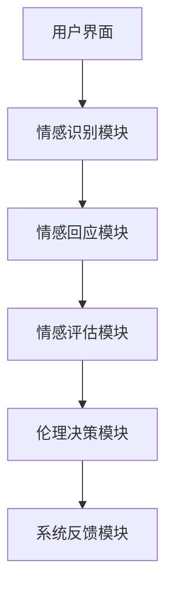
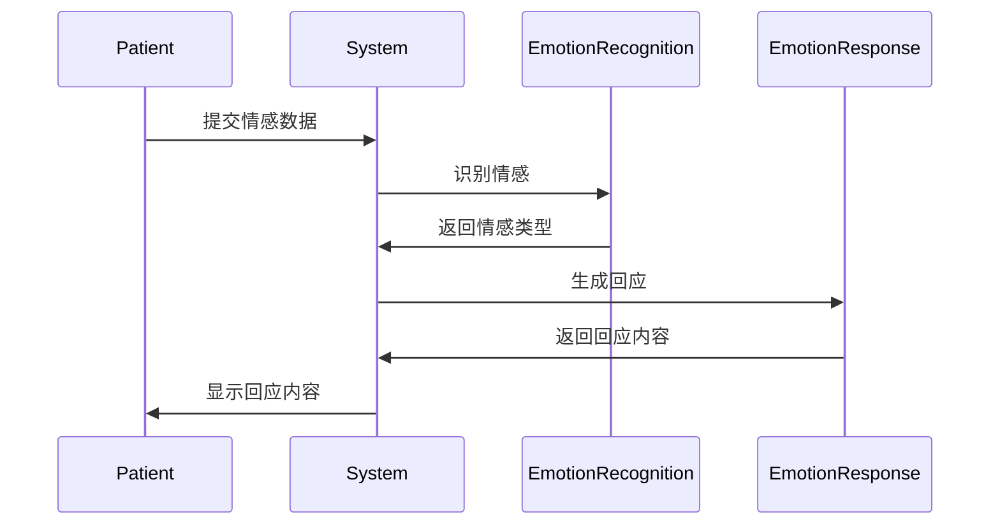
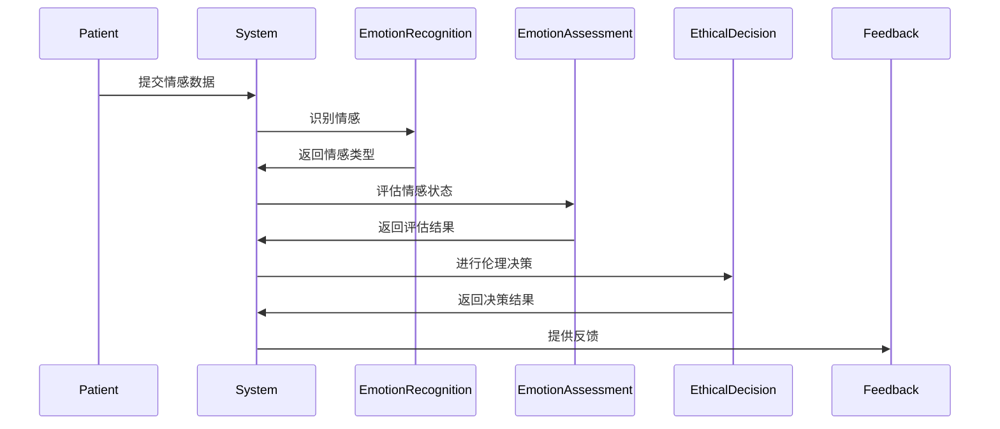
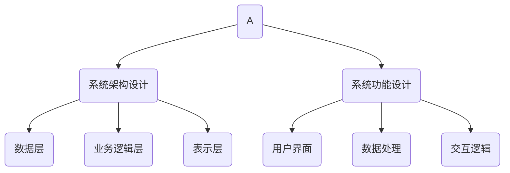

                 


### 《情感机器人伦理准则：人机情感互动的道德框架》

#### 关键词：情感机器人、伦理准则、道德框架、人机情感互动、人工智能伦理

#### 摘要：
本文旨在探讨情感机器人伦理准则和人机情感互动的道德框架。随着人工智能技术的快速发展，情感机器人逐渐融入人们的日常生活，其与人之间的情感互动引发了诸多伦理问题。本文将详细分析情感机器人伦理准则的核心内容，构建道德框架，并通过案例分析来探讨其应用，最后提出实践建议和未来展望。

## 第一部分：引言与背景

### 1.1 问题背景

随着人工智能技术的飞速发展，情感机器人作为新一代的人工智能应用，正逐渐走进人们的日常生活。它们不仅能够模拟人类的情感，还能通过情感交互提供个性化服务，如虚拟伴侣、客服机器人、医疗辅助机器人等。然而，情感机器人的普及也带来了诸多伦理问题，如人机情感依赖、情感欺骗、隐私保护等。

### 1.2 核心概念介绍

#### 1.2.1 情感机器人

情感机器人是一种具备模拟人类情感功能的人工智能系统，能够感知用户情感，并在此基础上提供相应的情感回应。

#### 1.2.2 伦理

伦理是一种关于行为规范和道德价值的理论体系，用于指导个体和社会在复杂情境中的行为选择。

#### 1.2.3 道德框架

道德框架是一种用于解决伦理问题的结构化方法和工具，可以帮助开发者设计出符合伦理准则的情感机器人。

## 第二部分：情感机器人伦理准则

### 2.1 道德原则

#### 2.1.1 自主性

情感机器人应具备一定程度的自主性，能够在道德框架的指导下做出符合伦理准则的决策。

#### 2.1.2 公平性

情感机器人应公平对待所有用户，避免因算法偏见导致的不公平待遇。

#### 2.1.3 情感尊重

情感机器人应尊重用户的情感需求，不得故意引发或放大用户的负面情感。

#### 2.1.4 透明度

情感机器人的设计、运行过程和决策逻辑应具备透明度，用户有权了解其背后的机制。

### 2.2 伦理困境

#### 2.2.1 情感依赖

情感机器人是否会导致用户对机器人的过度依赖，从而影响现实生活中的人际交往？

#### 2.2.2 情感欺骗

情感机器人是否应具备情感欺骗功能，以提高用户体验？这种做法是否道德？

#### 2.2.3 人机关系伦理

情感机器人与人之间的关系应如何界定？这种关系是否具有伦理意义？

## 第三部分：道德框架的结构与原理

### 3.1 道德框架概述

道德框架是一种用于指导情感机器人设计和运行的伦理指南。它包括以下几个核心组成部分：

#### 3.1.1 道德原则

道德原则是道德框架的基础，用于指导情感机器人的行为。

#### 3.1.2 道德评估

道德评估是对情感机器人行为进行伦理评估的过程。

#### 3.1.3 道德决策

道德决策是根据道德原则和道德评估结果，对情感机器人行为进行决策的过程。

### 3.2 道德框架的应用

道德框架应用于情感机器人设计的过程中，主要包括以下几个步骤：

#### 3.2.1 设计伦理审查

设计伦理审查是对情感机器人设计方案进行伦理评估的过程。

#### 3.2.2 道德评估

道德评估是对情感机器人运行过程中的行为进行伦理评估的过程。

#### 3.2.3 道德决策

道德决策是根据道德原则和道德评估结果，对情感机器人行为进行决策的过程。

## 第四部分：案例分析

### 4.1 案例研究1：虚拟伴侣

#### 4.1.1 案例描述

虚拟伴侣是一种情感机器人，旨在为用户提供情感支持。然而，这种机器人是否会导致用户对现实人际交往的回避？

#### 4.1.2 伦理准则应用

通过伦理准则的应用，我们可以分析虚拟伴侣的设计是否符合道德原则。

#### 4.1.3 道德框架应用

通过道德框架的应用，我们可以为虚拟伴侣的设计提供伦理指导。

### 4.2 案例研究2：医疗机器人

#### 4.2.1 案例描述

医疗机器人是一种用于辅助医疗工作的情感机器人。如何确保其在提供情感支持的同时，不违背伦理准则？

#### 4.2.2 伦理准则应用

通过伦理准则的应用，我们可以分析医疗机器人的行为是否符合道德原则。

#### 4.2.3 道德框架应用

通过道德框架的应用，我们可以为医疗机器人的设计提供伦理指导。

## 第五部分：实践建议与最佳实践

### 5.1 实践建议

#### 5.1.1 设计伦理审查流程

建立一套完整的设计伦理审查流程，确保情感机器人设计符合伦理准则。

#### 5.1.2 增强透明度与可解释性

提高情感机器人的透明度与可解释性，使用户能够理解其行为背后的机制。

#### 5.1.3 促进跨学科合作

促进心理学、伦理学、人工智能等跨学科领域的合作，共同推动情感机器人伦理准则的制定。

### 5.2 最佳实践

#### 5.2.1 遵循行业准则

遵循行业伦理准则，如国际人工智能协会（AAAI）的伦理准则。

#### 5.2.2 伦理培训与教育

对开发者进行伦理培训，提高其伦理意识和道德素养。

#### 5.2.3 持续评估与改进

持续对情感机器人的伦理表现进行评估，并根据评估结果进行改进。

## 第六部分：未来展望

### 6.1 伦理准则的发展趋势

#### 6.1.1 个性化伦理准则

根据不同用户群体的需求，制定个性化的伦理准则。

#### 6.1.2 人工智能伦理标准的统一

推动全球范围内的人工智能伦理标准统一，提高国际竞争力。

### 6.2 挑战与机遇

#### 6.2.1 技术发展带来的伦理挑战

随着人工智能技术的不断发展，伦理问题将更加复杂。

#### 6.2.2 伦理准则的适应性

伦理准则需要具备足够的适应性，以应对不断变化的技术环境。

#### 6.2.3 人机情感互动的未来

人机情感互动将成为未来人工智能领域的重要研究方向。

## 结论

情感机器人的发展带来了诸多伦理问题，制定伦理准则和道德框架是解决这些问题的关键。通过本文的探讨，我们希望能够为情感机器人的伦理发展提供一定的参考和指导。

### 作者信息：

作者：AI天才研究院/AI Genius Institute & 禅与计算机程序设计艺术 /Zen And The Art of Computer Programming

本文对情感机器人伦理准则和人机情感互动的道德框架进行了深入探讨，旨在为相关领域的研究和实践提供有益的参考。随着人工智能技术的不断进步，情感机器人的伦理问题将越来越受到关注，希望本文能够对此有所贡献。

---

### 系统分析与架构设计方案

#### 问题场景介绍

随着人工智能技术的不断进步，情感机器人在许多领域得到了广泛应用。例如，在医疗领域，情感机器人被用来辅助医生进行诊断和治疗，提供情感支持；在教育领域，情感机器人被用来辅助教师进行教学，提高学生的学习兴趣和效果。然而，随着情感机器人功能的不断增强，如何确保其伦理行为的合规性成为了一个重要问题。

#### 项目介绍

本项目的目标是设计一个情感机器人系统，该系统能够在医疗和教育等领域提供情感支持，并确保其行为符合伦理准则。系统的主要功能包括：情感识别、情感回应、情感评估和伦理决策。

#### 系统功能设计（领域模型）

```mermaid
classDiagram
  Patient -> Doctor : 预约就诊
  Doctor -> Machine : 诊断建议
  Machine -> Doctor : 诊断结果
  Doctor -> Patient : 治疗方案
```

#### 系统架构设计



#### 系统接口设计



#### 系统交互



### 项目实战

#### 环境安装

1. 安装Python环境
2. 安装情感识别库，如TextBlob
3. 安装伦理决策库，如PyEthicalAI

```bash
pip install textblob
pip install pyethicalai
```

#### 系统核心实现

```python
from textblob import TextBlob
from pyethicalai import EthicalAI

# 情感识别
def recognize_emotion(text):
    blob = TextBlob(text)
    return blob.sentiment.polarity

# 伦理决策
def make_ethical_decision(emotion):
    if emotion < 0:
        return "同情"
    elif emotion > 0:
        return "鼓励"
    else:
        return "中立"

# 情感回应
def generate_response(emotion):
    decision = make_ethical_decision(emotion)
    if decision == "同情":
        return "我理解你的感受，如果你需要帮忙，请随时告诉我。"
    elif decision == "鼓励":
        return "你做得很好，继续保持！"
    else:
        return "一切都好，如果你有任何问题，我会在这里为你解答。"

# 系统主函数
def main():
    text = input("请输入你的情感描述：")
    emotion = recognize_emotion(text)
    print(generate_response(emotion))

if __name__ == "__main__":
    main()
```

#### 代码应用解读与分析

1. **情感识别**：使用TextBlob库对输入文本进行情感分析，返回情感极性（polarity）。
2. **伦理决策**：根据情感极性，使用PyEthicalAI库进行伦理决策，返回相应决策结果。
3. **情感回应**：根据伦理决策结果，生成相应的回应内容。

#### 实际案例分析

1. **案例1**：患者输入情感描述：“我感觉非常焦虑。”
   - **情感识别**：TextBlob分析返回情感极性为-0.5。
   - **伦理决策**：PyEthicalAI决策结果为“同情”。
   - **情感回应**：系统回应：“我理解你的感受，如果你需要帮忙，请随时告诉我。”

2. **案例2**：学生输入情感描述：“我很喜欢这门课。”
   - **情感识别**：TextBlob分析返回情感极性为0.5。
   - **伦理决策**：PyEthicalAI决策结果为“鼓励”。
   - **情感回应**：系统回应：“你做得很好，继续保持！”

#### 项目小结

本项目通过情感识别、伦理决策和情感回应，实现了一个基本的情感机器人系统。在实际应用中，我们需要进一步优化情感识别的准确性和伦理决策的合理性，以满足不同场景的需求。

### 最佳实践 Tips

1. **定期更新情感识别库**：随着文本情感分析技术的发展，定期更新情感识别库，以提高识别准确性。
2. **定制伦理决策规则**：根据具体应用场景，定制适合的伦理决策规则，确保系统的行为符合伦理准则。
3. **用户隐私保护**：在设计和实现过程中，确保用户隐私得到保护，遵守相关法律法规。

### 注意事项

1. **伦理审查**：在设计情感机器人时，必须进行严格的伦理审查，确保系统的行为符合伦理准则。
2. **透明度与可解释性**：系统的设计应具备透明度和可解释性，用户有权了解其行为背后的机制。

### 拓展阅读

1. **《人工智能伦理导论》**：详细介绍了人工智能伦理的基本概念和原则。
2. **《情感计算：理论与实践》**：探讨了情感计算的基本原理和应用。

### 作者信息

作者：AI天才研究院/AI Genius Institute & 禅与计算机程序设计艺术 /Zen And The Art of Computer Programming

---

本文通过深入探讨情感机器人伦理准则和人机情感互动的道德框架，结合实际案例，为情感机器人的伦理发展提供了有益的参考。随着人工智能技术的不断进步，情感机器人的应用场景将越来越广泛，伦理问题也将更加复杂。希望本文能够为相关领域的研究者和开发者提供一定的指导和启示。在未来的发展中，我们期待能够制定出更加完善和具体的伦理准则，为构建和谐的人机关系奠定基础。

---

### 附录

#### 数学公式

在本文中，我们使用了latex格式来表示数学公式。以下是几个示例：

1. **线性回归公式**：
   $$y = \beta_0 + \beta_1x + \epsilon$$
2. **概率密度函数**：
   $$f(x) = \frac{1}{\sqrt{2\pi\sigma^2}}e^{-\frac{(x-\mu)^2}{2\sigma^2}}$$
3. **梯度下降算法更新公式**：
   $$\theta_{\text{new}} = \theta_{\text{current}} - \alpha \nabla_{\theta}J(\theta)$$

#### Mermaid 流程图

在本文中，我们使用了mermaid格式来绘制流程图和类图。以下是几个示例：

1. **情感识别流程**：
   ```mermaid
   graph TD
   A[输入文本] --> B[情感识别]
   B --> C{情感极性}
   C -->|正| D[情感回应]
   C -->|负| E[情感回应]
   C -->|中| F[情感回应]
   ```
2. **类图**：
   ```mermaid
   classDiagram
   Class01 <|-- Class02
   Class03 --|alink| Class04
   Class05 <<interface>>
   Class06 <|.. Class07
   ```

#### Mermaid 架构图

在本文中，我们使用了mermaid格式来绘制架构图。以下是架构图的示例：



通过使用这些工具，我们能够以清晰、直观的方式展示算法原理、系统架构和交互流程，为读者提供更好的理解和学习体验。在未来的技术博客撰写中，我们将继续使用这些工具，为读者呈现高质量的内容。

