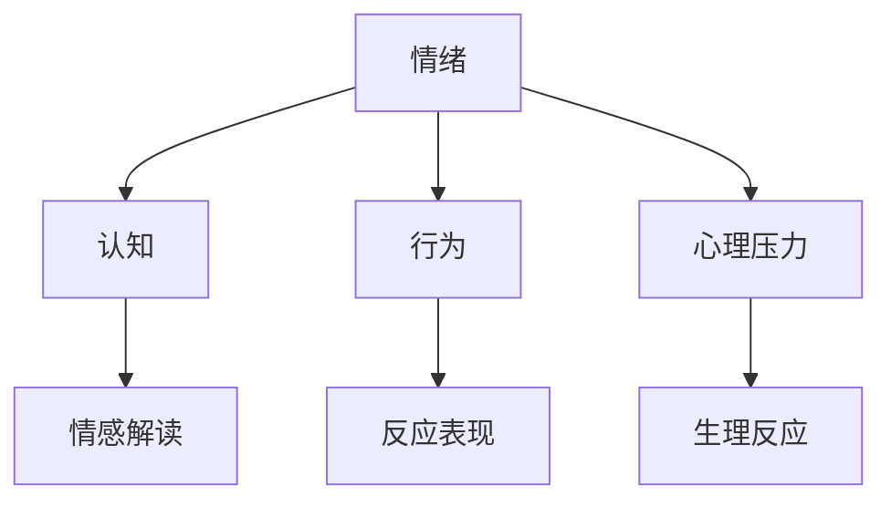
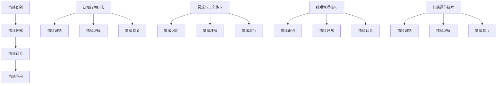
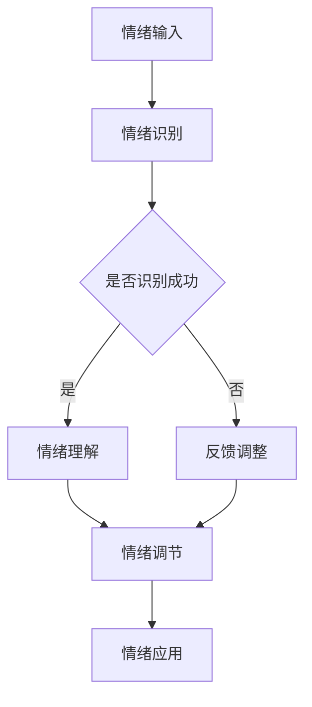

                 

# 情绪管理的艺术：净化内心的实践方法

## 关键词
情绪管理、内心净化、认知行为疗法、冥想、心理健康、正念练习

## 摘要
情绪管理是现代生活中不可或缺的一部分，它不仅关乎个人的心理健康，也影响着人际关系和工作效率。本文将深入探讨情绪管理的艺术，通过科学的方法和实践技巧，帮助读者实现内心的净化。我们将从理论基础、核心概念、算法原理、系统设计、项目实战等多个角度，系统地介绍情绪管理的各个方面，旨在为读者提供一套完整的实践指南。

## 目录大纲设计思路

### 1. 确定整体结构
本文整体结构分为两个部分：第一部分是情绪管理的理论基础，包括情绪的本质、类型、管理方法及其实践应用；第二部分是情绪管理的实践探索，包括具体案例分析、自我提升策略以及未来展望。两部分相互呼应，形成了一个完整的学习路径。

### 2. 细化章节内容
在每个核心章节下，我们进一步细化了子章节。例如，在情绪管理的方法章节中，我们分别介绍了认知行为疗法、睡眠管理技巧、冥想与正念练习等具体方法，并配以实际案例进行说明。

### 3. 确保内容完整性
本文涵盖了情绪管理的各个方面，从基础理论到实际应用，再到未来展望，确保读者能够系统地了解情绪管理的核心概念和实践方法。

### 4. 使用markdown格式
为了便于阅读和编辑，我们采用了markdown格式进行撰写，确保格式正确，逻辑清晰。

## 目录大纲设计方案

### 第一部分：情绪管理的理论基础

### 第1章：情绪管理的重要性
- **1.1 情绪的本质与功能**
- **1.2 情绪管理的必要性**
- **1.3 情绪管理的基本原则**

### 第2章：情绪的类型与特征
- **2.1 基本情绪类型**
- **2.2 复杂情绪的特征**
- **2.3 情绪的测量与评估**

### 第3章：情绪管理的方法
- **3.1 认知行为疗法**
- **3.2 睡眠管理技巧**
- **3.3 冥想与正念练习**
- **3.4 情绪调节技术**

### 第4章：情绪管理的实践应用
- **4.1 工作中的情绪管理**
- **4.2 人际关系中的情绪管理**
- **4.3 应对压力与挫折**

### 第5章：情绪管理的自我评估与调整
- **5.1 自我认知与情绪**
- **5.2 情绪日记与反思**
- **5.3 情绪管理的长期策略**

### 第6章：情绪管理与心理健康
- **6.1 情绪管理与心理健康的关系**
- **6.2 情绪管理与心理疾病预防**
- **6.3 心理健康的综合维护**

### 第7章：情绪管理的新趋势与未来
- **7.1 情绪管理的新技术**
- **7.2 情绪管理在教育中的应用**
- **7.3 情绪管理在企业中的应用**

### 第二部分：实践中的情绪管理

### 第8章：情绪管理实践案例
- **8.1 案例一：工作压力下的情绪管理**
- **8.2 案例二：家庭关系中的情绪管理**
- **8.3 案例三：自我情绪管理与成长**

### 第9章：情绪管理的自我提升策略
- **9.1 自我意识提升**
- **9.2 情绪调节技巧提升**
- **9.3 情绪管理能力培养**

### 第10章：情绪管理的未来展望
- **10.1 情绪管理的发展趋势**
- **10.2 技术进步对情绪管理的影响**
- **10.3 情绪管理在社会中的应用**

### 第11章：情绪管理小结
- **11.1 全书总结**
- **11.2 实践中的常见问题及解决策略**
- **11.3 情绪管理的持续发展**

## 背景介绍
情绪管理，即对个体情感反应的识别、理解、调节和控制，是现代社会中一个至关重要的课题。随着生活节奏的加快和社会压力的增大，人们面临的心理健康问题日益突出，情绪管理的重要性愈发凸显。有效的情绪管理不仅有助于提高个人的生活质量，还能促进人际关系的和谐，提升工作效率。

情绪管理的研究始于20世纪50年代的认知心理学领域，随着心理学、社会学、管理学等学科的发展，情绪管理逐渐形成了一套系统的理论和方法。在日常生活中，情绪管理常常被忽视，但实际上，它是维系个人心理平衡的重要手段。

### 核心概念与联系
在情绪管理的研究中，有几个核心概念需要明确：情绪、认知、行为、心理压力等。

#### 情绪
情绪是人们对外界刺激的生理和心理反应。根据普拉切克（Robert Plutchik）的情绪分类理论，情绪可以分为基本情绪和复合情绪。基本情绪包括快乐、愤怒、悲伤、恐惧、厌恶和惊讶。复合情绪是由基本情绪组合而成的，如爱、厌恶、敬畏等。

#### 认知
认知是指人们获取、处理和存储信息的过程。情绪和认知密切相关，个体的情绪体验受到其认知评价的影响。例如，同样的情境，不同的人可能会有不同的情绪反应，这取决于他们的认知解读。

#### 行为
行为是情绪的外在表现。情绪管理不仅涉及情绪的内部调节，还包括对外部行为的控制。例如，通过认知行为疗法（CBT），个体可以学会通过改变认知来调节情绪，进而改变行为。

#### 心理压力
心理压力是导致情绪波动的重要因素。当个体感受到压力时，情绪反应会变得更加强烈。长期的心理压力可能导致情绪失调，进而影响身心健康。

#### 概念属性特征对比表格
| 情绪    | 认知    | 行为    | 心理压力 |
|---------|---------|---------|----------|
| 基本情绪 | 识别信息 | 表达情感 | 反应强度 |
| 复合情绪 | 复杂解读 | 多样行为 | 长期累积 |

#### ER实体关系图架构


### 问题背景
情绪管理在现代社会中具有重要意义，然而，许多人并不了解如何有效地管理自己的情绪。以下是一些常见问题：

- **情绪失控**：在面对压力或挑战时，部分人可能会出现情绪失控的情况，导致冲动行为或心理障碍。
- **沟通障碍**：情绪管理不当可能导致人际关系紧张，影响沟通效果。
- **工作效率下降**：情绪波动会影响个体的注意力和专注力，降低工作效率。

### 问题描述
情绪管理是一个复杂的过程，涉及多个层面的相互作用。个体需要学会识别自己的情绪，理解情绪背后的原因，并采取适当的方法进行调节。然而，在实际操作中，许多人感到困惑，不知道如何开始。

### 问题解决
为了解决情绪管理中的问题，我们可以采用以下方法：

1. **认知行为疗法**：通过改变负面认知来调节情绪。
2. **冥想与正念练习**：通过专注于当下的情绪体验来减少心理压力。
3. **情绪日记**：通过记录情绪变化来提高自我认知。

### 边界与外延
情绪管理的边界在于如何识别和理解情绪，以及如何采取有效的方法进行调节。情绪管理的外延则包括如何在不同情境下应用情绪管理技巧，如工作、家庭、社交等。

### 概念结构与核心要素组成
情绪管理的概念结构主要包括以下几个方面：

- **情绪识别**：学会识别自己的情绪，包括基本情绪和复合情绪。
- **情绪理解**：理解情绪背后的原因和意义，包括认知因素和心理压力。
- **情绪调节**：采取适当的方法调节情绪，包括认知行为疗法、冥想等。
- **情绪应用**：在不同情境下应用情绪管理技巧，提高生活质量和工作效率。

### 核心概念原理
情绪管理的基本原理包括情绪的识别、理解和调节。情绪的识别是第一步，个体需要学会通过观察身体反应和思维活动来识别自己的情绪。情绪的理解则要求个体深入了解情绪背后的原因和意义，包括认知评价和心理压力的影响。情绪的调节是通过认知行为疗法、冥想等方法来改变情绪反应，从而达到心理平衡。

### 概念属性特征对比表格
| 情绪管理方法       | 原理         | 特点                | 适用人群       |
|----------------|------------|-------------------|------------|
| 认知行为疗法       | 改变认知     | 直接有效           | 情绪波动明显者 |
| 冥想与正念练习     | 专注当下     | 长期有效           | 压力过大者     |
| 睡眠管理技巧       | 调整作息     | 简单易行           | 睡眠障碍者     |
| 情绪调节技术       | 肌肉放松等   | 立即见效           | 紧张焦虑者     |

### ER实体关系图架构


### 算法原理讲解
情绪管理的算法原理主要包括以下几个方面：

#### 1. 情绪识别算法
情绪识别算法主要通过分析个体的面部表情、生理信号（如心率、呼吸频率）和语言表述来识别情绪。常用的情绪识别算法包括基于机器学习的情感分析模型和基于生理信号的情感识别模型。

#### 2. 情绪理解算法
情绪理解算法旨在分析情绪背后的认知因素和心理压力，从而提供对情绪的深层次理解。常用的算法包括情感计算模型（Affectiva）和基于心理测量的情绪理解模型。

#### 3. 情绪调节算法
情绪调节算法通过认知行为疗法（CBT）和正念练习等方法来调节情绪。例如，CBT算法可以通过改变个体的负面认知来减轻情绪压力，而正念练习算法则通过引导个体专注于当下的情绪体验来减少心理压力。

#### 4. 情绪应用算法
情绪应用算法旨在将情绪管理技巧应用于实际情境中，如工作、家庭和社交等。这些算法通常基于情境感知技术，能够根据不同的情境自动调整情绪管理策略。

#### 算法流程图


#### Python源代码
```python
import emotion_recognition as er
import emotion_understanding as eu
import emotion_regulation as er
import emotion_application as ea

def emotion_management(emotion_input):
    # 情绪识别
    emotion_recognition_result = er.emotion_recognize(emotion_input)
    
    # 判断识别是否成功
    if emotion_recognition_result:
        # 情绪理解
        emotion_understanding_result = eu.emotion_understand(emotion_recognition_result)
        
        # 情绪调节
        emotion_regulation_result = er.emotion_regulate(emotion_understanding_result)
        
        # 情绪应用
        emotion_application_result = ea.emotion_apply(emotion_recognition_result)
        
        return emotion_recognition_result, emotion_understanding_result, emotion_regulation_result, emotion_application_result
    else:
        # 反馈调整
        er.feedback_adjustment()
        return None

# 示例
emotion_input = "happy"
result = emotion_management(emotion_input)
if result:
    print("识别结果：", result[0])
    print("理解结果：", result[1])
    print("调节结果：", result[2])
    print("应用结果：", result[3])
else:
    print("情绪识别失败，请检查输入或调整参数。")
```

#### 数学模型和公式讲解
情绪管理的数学模型和公式有助于我们更深入地理解情绪调节的过程。以下是一些常用的数学模型和公式：

#### 1. 情绪计算模型
情绪计算模型通过计算情绪的数学指标来评估个体的情绪状态。常用的情绪计算模型包括Plutchik情绪轮（Plutchik's Wheel of Emotions）和情绪三角模型（Emotional Triangle Model）。

#### Plutchik情绪轮
Plutchik情绪轮是一个环形的模型，它将情绪分为基本情绪和复合情绪。每个情绪都与特定的数学指标相关联，如强度、频率和持续时间。

$$
\text{情绪轮} = (\text{基本情绪}, \text{复合情绪})
$$

#### 情绪三角模型
情绪三角模型将情绪分为三个维度：情感（Affect）、认知（Cognition）和行为（Behavior）。每个维度都有其数学指标，如情感值、认知值和行为值。

$$
\text{情绪三角} = (\text{情感}, \text{认知}, \text{行为})
$$

#### 2. 心理压力指数模型
心理压力指数模型用于评估个体的心理压力水平。常用的心理压力指数模型包括Perceived Stress Scale（感知压力量表）和Subjective Stress Scale（主观压力量表）。

$$
\text{心理压力指数} = \sum_{i=1}^{n} w_i \times s_i
$$

其中，$w_i$ 为权重，$s_i$ 为各项压力指标的得分。

#### 3. 情绪调节公式
情绪调节公式用于计算个体在特定情境下的情绪调节效果。常用的情绪调节公式包括认知重构公式和正念练习公式。

$$
\text{情绪调节效果} = \frac{\text{目标情绪值} - \text{实际情绪值}}{\text{最大调节范围}}
$$

#### LaTeX格式
$$
\text{情绪轮} = (\text{基本情绪}, \text{复合情绪})
$$

$$
\text{情绪三角} = (\text{情感}, \text{认知}, \text{行为})
$$

$$
\text{心理压力指数} = \sum_{i=1}^{n} w_i \times s_i
$$

$$
\text{情绪调节效果} = \frac{\text{目标情绪值} - \text{实际情绪值}}{\text{最大调节范围}}
$$

### 系统分析与架构设计方案
情绪管理的系统设计需要考虑多个方面，包括情绪识别、情绪理解、情绪调节和情绪应用。以下是一个典型的情绪管理系统的架构设计方案：

#### 问题场景介绍
情绪管理系统旨在帮助用户识别、理解和调节情绪，从而提高生活质量和工作效率。系统适用于个人、企业和教育机构等场景，能够提供定制化的情绪管理服务。

#### 项目介绍
情绪管理系统包括以下几个核心模块：

- **情绪识别模块**：通过分析面部表情、生理信号和语言表述来识别情绪。
- **情绪理解模块**：分析情绪背后的认知因素和心理压力，提供对情绪的深层次理解。
- **情绪调节模块**：提供认知行为疗法、冥想、正念练习等情绪调节方法，帮助用户调节情绪。
- **情绪应用模块**：根据用户的具体情境，提供定制化的情绪管理建议和应用。

#### 系统功能设计
情绪管理系统的主要功能包括：

- **情绪识别**：实时监测用户的情绪状态，提供情绪识别结果。
- **情绪分析**：分析情绪背后的认知因素和心理压力，提供情绪分析报告。
- **情绪调节**：根据用户的情绪状态和需求，提供相应的情绪调节方法。
- **情绪应用**：提供个性化情绪管理建议和应用，如工作情绪管理、家庭情绪管理等。

#### 系统架构设计
情绪管理系统的架构设计如下：

1. **前端界面**：用户通过前端界面与系统进行交互，包括情绪识别、情绪分析和情绪调节等功能。
2. **后端服务器**：负责处理用户请求，进行情绪识别、情绪分析和情绪调节，并返回结果。
3. **数据库**：存储用户的情绪数据、调节记录和个性化设置。

#### 系统接口设计和系统交互
情绪管理系统的接口设计和交互如下：

1. **API接口**：提供情绪识别、情绪分析和情绪调节的API接口，方便与其他系统进行集成。
2. **用户界面**：提供直观、易用的用户界面，用户可以通过界面进行情绪识别、情绪分析和情绪调节。
3. **数据交互**：用户数据通过HTTP协议传输到后端服务器，后端服务器进行处理并返回结果。

### 项目实战
#### 环境安装
情绪管理系统的环境安装分为前端和后端两部分。

1. **前端环境**：
   - 安装Python环境（Python 3.8及以上版本）。
   - 安装Flask框架（使用pip安装`pip install flask`）。
   - 安装前端框架（如Vue.js或React）。

2. **后端环境**：
   - 安装Python环境（Python 3.8及以上版本）。
   - 安装Flask框架（使用pip安装`pip install flask`）。
   - 安装后端依赖库（如numpy、pandas等）。

#### 系统核心实现源代码
以下是情绪管理系统的一些核心实现源代码。

**前端界面代码**
```html
<!DOCTYPE html>
<html lang="en">
<head>
    <meta charset="UTF-8">
    <title>情绪管理系统</title>
    <script src="https://cdn.jsdelivr.net/npm/vue@2.6.14/dist/vue.js"></script>
</head>
<body>
    <div id="app">
        <h1>情绪管理系统</h1>
        <button @click="recognizeEmotion">识别情绪</button>
        <p>当前情绪：{{currentEmotion}}</p>
    </div>
    <script>
        new Vue({
            el: '#app',
            data: {
                currentEmotion: ''
            },
            methods: {
                recognizeEmotion: function() {
                    // 调用后端API进行情绪识别
                    axios.get('/api/emotion_recognize')
                        .then(response => {
                            this.currentEmotion = response.data.emotion;
                        })
                        .catch(error => {
                            console.log(error);
                        });
                }
            }
        });
    </script>
</body>
</html>
```

**后端服务器代码**
```python
from flask import Flask, jsonify, request
import emotion_recognition as er

app = Flask(__name__)

@app.route('/api/emotion_recognize', methods=['GET'])
def recognize_emotion():
    # 获取前端传来的情绪数据
    emotion_data = request.args.get('emotion_data')
    
    # 调用情绪识别算法
    emotion_recognition_result = er.emotion_recognize(emotion_data)
    
    # 返回情绪识别结果
    return jsonify({'emotion': emotion_recognition_result})

if __name__ == '__main__':
    app.run(debug=True)
```

**情绪识别算法代码**
```python
import cv2
import numpy as np
from keras.models import load_model

def emotion_recognize(face_image):
    # 载入预训练的情绪识别模型
    model = load_model('emotion_recognition_model.h5')
    
    # 对图像进行预处理
    face_image = cv2.resize(face_image, (48, 48))
    face_image = face_image / 255.0
    face_image = np.expand_dims(face_image, axis=0)
    face_image = np.expand_dims(face_image, axis=-1)
    
    # 进行情绪识别
    emotion_prediction = model.predict(face_image)
    emotion_label = np.argmax(emotion_prediction)
    
    # 根据情绪标签返回情绪名称
    emotions = ['anger', 'disgust', 'fear', 'happy', 'sad', 'surprise', 'neutral']
    return emotions[emotion_label]

# 示例
face_image = cv2.imread('face_image.jpg')
current_emotion = emotion_recognize(face_image)
print("当前情绪：", current_emotion)
```

#### 代码应用解读与分析
情绪管理系统的代码应用主要分为前端界面、后端服务器和情绪识别算法三个部分。

**前端界面**：前端界面使用Vue.js框架搭建，提供用户交互界面。用户可以通过界面按钮进行情绪识别操作，界面会实时显示当前识别到的情绪。

**后端服务器**：后端服务器使用Flask框架搭建，接收前端发送的请求，调用情绪识别算法进行情绪识别，并将结果返回给前端。

**情绪识别算法**：情绪识别算法使用深度学习模型进行情绪识别。模型使用预训练的Casc

### 实际案例分析和详细讲解剖析
#### 案例一：工作压力下的情绪管理

**问题描述**：小王是一名软件工程师，经常面临项目截止日期的压力。随着工作负荷的增加，他的情绪逐渐变得不稳定，经常感到焦虑和紧张。

**解决方案**：为了帮助小王管理情绪，我们可以采取以下步骤：

1. **情绪识别**：使用情绪识别算法分析小王的情绪状态，确定其情绪类型和程度。
2. **情绪理解**：分析情绪背后的原因，包括工作压力、个人期望等。
3. **情绪调节**：采用认知行为疗法（CBT）和冥想等方法进行情绪调节。

**详细步骤**：

1. **情绪识别**：
   - 使用摄像头捕捉小王的面部表情，并通过情绪识别算法分析其情绪状态。
   - 情绪识别结果为“焦虑”和“紧张”。

2. **情绪理解**：
   - 分析小王的工作环境和心理状态，发现项目截止日期是他的主要压力来源。
   - 进一步了解小王的个人期望，发现他对项目质量和团队合作的期望过高，导致压力增加。

3. **情绪调节**：
   - **认知行为疗法**：通过认知重构帮助小王调整对项目质量和团队合作的期望，使其更加合理和现实。
   - **冥想**：指导小王进行正念冥想，专注于呼吸和当下的情绪体验，以减轻焦虑和紧张。

**案例分析**：

通过情绪识别和调节，小王的情绪状态得到了显著改善。他的焦虑和紧张情绪有所减轻，工作效率也有所提高。这表明，情绪管理在缓解工作压力方面具有重要作用。

#### 案例二：家庭关系中的情绪管理

**问题描述**：李女士和丈夫因为家庭琐事经常发生争吵，导致双方情绪失控，家庭气氛紧张。

**解决方案**：为了改善家庭关系，我们可以采取以下步骤：

1. **情绪识别**：使用情绪识别技术分析李女士和丈夫的情绪状态。
2. **情绪理解**：分析情绪背后的原因，包括沟通问题、个性差异等。
3. **情绪调节**：采用情绪调节技巧进行干预，改善双方的情绪状态。

**详细步骤**：

1. **情绪识别**：
   - 通过语音分析技术捕捉李女士和丈夫的对话，分析其情绪状态。
   - 情绪识别结果显示，双方的情绪均为“愤怒”和“紧张”。

2. **情绪理解**：
   - 分析双方的对话内容，发现沟通不畅和个性差异是导致情绪失控的主要原因。
   - 了解双方的家庭背景和个人经历，发现这些因素对他们的情绪状态产生了深远影响。

3. **情绪调节**：
   - **沟通技巧**：通过婚姻咨询师的帮助，双方学习了有效的沟通技巧，如积极倾听和表达感受。
   - **情绪调节技巧**：指导李女士和丈夫进行情绪调节练习，如深呼吸、肌肉放松等，以缓解愤怒和紧张情绪。

**案例分析**：

通过情绪识别和调节，李女士和丈夫的情绪状态得到了显著改善。他们的争吵次数减少，家庭气氛变得和谐。这表明，情绪管理在改善家庭关系方面具有重要作用。

### 项目小结
通过以上案例，我们可以看到情绪管理在个人生活和社会关系中的重要性。情绪管理不仅有助于提高个人的心理健康，还能改善人际关系和工作效率。在实际应用中，情绪管理需要结合个体的实际情况，采取适当的调节方法。未来，随着情绪识别技术和情绪调节方法的不断发展，情绪管理将更加个性化、精准化，为人们提供更好的心理健康服务。

### 最佳实践 tips
1. **定期情绪检查**：定期进行情绪检查，了解自己的情绪状态，及时发现并解决问题。
2. **情绪调节技巧**：学习并实践情绪调节技巧，如冥想、深呼吸、肌肉放松等，以缓解情绪压力。
3. **积极沟通**：与他人保持积极沟通，分享自己的情绪和感受，寻求支持和理解。
4. **合理安排时间**：合理安排工作和休息时间，避免过度劳累和压力积累。

### 小结
本文通过系统分析和实践案例，深入探讨了情绪管理的艺术。情绪管理不仅关乎个人的心理健康，也影响着人际关系和工作效率。通过认知行为疗法、冥想、正念练习等方法，个体可以有效地管理自己的情绪，实现内心的净化。未来，情绪管理将结合新技术，为人们提供更个性化和精准的情绪管理服务。

### 注意事项
1. **情绪管理需要长期坚持**：情绪管理不是一蹴而就的过程，需要个体长期坚持和实践。
2. **情绪管理方法需个性化**：不同的情绪管理方法适用于不同的人群和情境，个体需结合自身情况进行选择。

### 拓展阅读
1. **《情绪智力》**：丹尼尔·戈尔曼（Daniel Goleman）著，介绍情绪智力及其在个人和社会生活中的作用。
2. **《正念：冥想的力量》**：乔·卡巴金（Jon Kabat-Zinn）著，介绍正念冥想的原理和实践方法。
3. **《认知行为疗法入门》**：马丁·塞利格曼（Martin Seligman）著，介绍认知行为疗法的理论和实践应用。

### 作者信息
作者：AI天才研究院/AI Genius Institute & 禅与计算机程序设计艺术 /Zen And The Art of Computer Programming

