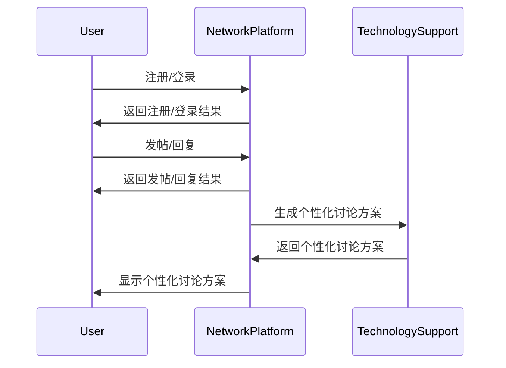
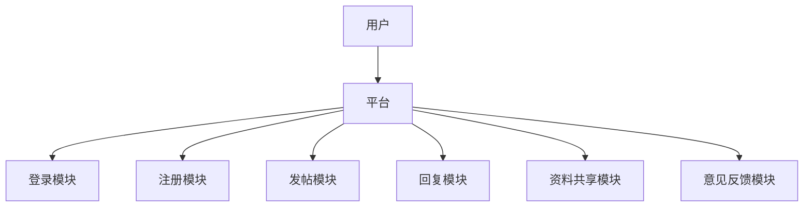
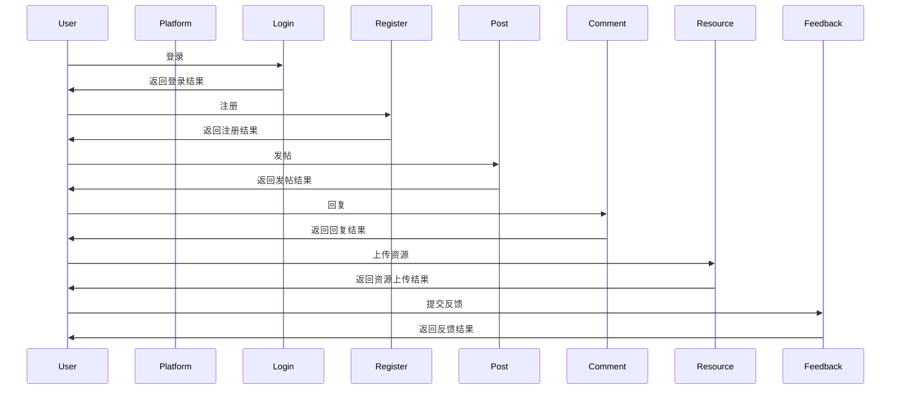

                 

## 意义众创实验室网络：集体探讨人生价值的全球性空间

> 关键词：意义众创实验室、集体探讨、人生价值、全球网络、技术支持

> 摘要：本文探讨了在现代社会中，人们对于人生价值的探讨如何通过意义众创实验室网络这一全球性平台得以实现。文章介绍了意义众创实验室网络的核心概念、技术支持以及设计与实现，并从系统分析与架构设计、项目实战等多个角度深入分析了如何通过这一平台有效地进行集体探讨和人生价值的探讨。

### 第一部分：背景介绍

#### 核心概念

**问题背景**：

在当今社会，人们面临诸多人生价值探讨的问题，如工作意义、生活目标、人际关系等。这些问题引发了人们对自我价值和人生意义的思考，需要寻找一种有效的探讨平台。

**问题描述**：

现有的个人思考方式主要依赖于个体经验，缺乏系统性和广泛性。而传统的集体讨论又受限于时间和空间，难以形成全球性的探讨空间。

**问题解决**：

通过建立一个全球性的网络平台，如“意义众创实验室网络”，可以为人们提供一个便捷、高效的探讨环境，实现集体探讨人生价值。

**边界与外延**：

本书的探讨范围不仅限于网络平台的技术实现，还包括如何通过技术手段提升集体探讨的效果，以及如何在全球范围内实现人生价值的探讨。

#### 概念结构与核心要素组成

1. **网络平台**：提供全球用户参与的讨论空间，支持实时交流、资料共享和意见反馈。
2. **用户群体**：包括个人、企业和学术机构等，他们通过平台表达和探讨人生价值问题。
3. **技术支持**：利用大数据、人工智能等技术手段，为用户提供个性化讨论方案，提升讨论效果。
4. **探讨内容**：涵盖工作意义、生活目标、人际关系等多个方面，为用户提供全面的人生价值探讨。

### 第二部分：核心概念与联系

#### 核心概念原理

**网络平台**：基于云计算和物联网技术，为用户提供便捷的在线交流空间。

**用户群体**：涵盖不同领域、不同背景的用户，他们通过平台分享观点、探讨人生价值。

**技术支持**：利用大数据分析、人工智能算法等，为用户提供个性化讨论方案。

#### 概念属性特征对比表格

| 概念         | 特征                          |
|------------|-----------------------------|
| 网络平台     | 实时交流、资料共享、意见反馈     |
| 用户群体     | 多领域、多背景                  |
| 技术支持     | 大数据分析、人工智能算法         |

#### ER实体关系图架构

```mermaid
erDiagram
  User ||--|{ NetworkPlatform }|--|| Discussion
  NetworkPlatform ||--|{ TechnologySupport }|--|| User
  User ||--|{ Discussion }|--|| NetworkPlatform
```

### 第三部分：网络平台的设计与实现

#### 网络平台的设计

**项目介绍**：

建立一个全球性的网络平台，为用户提供探讨人生价值的在线空间。

**系统功能设计**：

包括用户注册、登录、发帖、回复、资料共享、意见反馈等功能。

**系统架构设计**：

采用分布式架构，确保系统的高可用性和可扩展性。

**系统接口设计**：

设计统一的接口，便于用户和第三方系统的集成。

**系统交互序列图**



### 第四部分：技术支持

#### 技术支持的设计

**大数据分析**：

对用户数据进行分析，提取有价值的信息，为用户提供个性化讨论方案。

**人工智能算法**：

利用机器学习算法，对用户行为进行预测，提升讨论效果。

**个性化讨论方案生成**：

根据用户数据和讨论内容，生成个性化的讨论方案。

#### 技术原理讲解

**大数据分析**：

- **数据采集**：收集用户在平台上的行为数据，如发帖、回复、浏览等。
- **数据预处理**：对采集到的数据进行清洗、去重、格式转换等处理。
- **数据分析**：利用统计分析、数据挖掘等方法，提取有价值的信息。

**人工智能算法**：

- **模型选择**：选择适合的机器学习模型，如决策树、随机森林、神经网络等。
- **训练与评估**：使用历史数据对模型进行训练，并通过交叉验证等方法评估模型性能。
- **预测与优化**：根据用户行为数据，对用户进行预测，并不断优化模型以提高预测准确性。

**个性化讨论方案生成**：

- **需求分析**：分析用户在平台上的行为，提取用户的兴趣和需求。
- **方案生成**：根据用户需求和讨论内容，生成个性化的讨论方案。
- **反馈与调整**：根据用户反馈，对讨论方案进行调整和优化。

### 第五部分：系统分析与架构设计

#### 问题场景介绍

随着互联网的普及，人们越来越多地依赖于在线平台进行交流和探讨。然而，传统平台在探讨人生价值这一类复杂问题时，往往受限于时间和空间的限制。为了打破这一限制，我们提出了意义众创实验室网络，旨在为用户提供一个全球性的、高效的、便捷的探讨平台。

#### 项目介绍

**项目名称**：意义众创实验室网络

**项目目标**：建立一个全球性的网络平台，为用户提供探讨人生价值的在线空间。

**项目简介**：意义众创实验室网络是基于云计算和物联网技术构建的，它提供实时交流、资料共享和意见反馈等功能，旨在为全球用户提供一个便捷、高效的探讨环境，帮助用户更好地理解和实现自己的人生价值。

#### 系统功能设计

**用户注册与登录**：

用户可以通过注册和登录功能，进入平台并创建自己的个人资料。

**发帖与回复**：

用户可以在平台上发帖或回复其他用户的帖子，分享自己的观点和见解。

**资料共享**：

用户可以上传和共享自己的资源，如文章、图片、视频等，为其他用户提供有价值的信息。

**意见反馈**：

用户可以对平台上的内容进行评价和反馈，帮助平台不断优化和改进。

#### 系统架构设计

**架构设计原则**：

1. **高可用性**：确保平台在故障发生时能够快速恢复，保证用户的使用体验。
2. **高可扩展性**：随着用户的增加，系统能够自动扩展资源，以应对更高的负载。
3. **安全性**：确保用户数据的安全和隐私，防止数据泄露和滥用。

**系统架构图**



#### 系统接口设计

**接口设计原则**：

1. **标准化**：接口设计遵循标准化原则，确保接口的通用性和兼容性。
2. **灵活性**：接口设计考虑未来可能的功能扩展，保证接口的灵活性和可扩展性。
3. **安全性**：接口设计考虑数据传输的安全性，采用加密和认证等手段保护用户数据。

**接口定义**

- **用户接口**：用户通过Web界面与平台进行交互。
- **服务接口**：平台提供RESTful API，供第三方系统集成和使用。

#### 系统交互序列图



### 第六部分：项目实战

#### 环境安装

1. **安装操作系统**：在虚拟机中安装Linux操作系统，如Ubuntu 20.04。

2. **安装数据库**：安装MySQL数据库，用于存储用户数据和讨论内容。

3. **安装Web服务器**：安装Apache或Nginx作为Web服务器，用于处理用户请求。

4. **安装开发工具**：安装Python、Java等开发工具，用于开发后端服务。

#### 系统核心实现源代码

```python
# 用户注册模块
def register(username, password):
    # 验证用户名和密码的合法性
    if not validate_username(username) or not validate_password(password):
        return "注册失败：用户名或密码不合法"
    
    # 插入用户数据到数据库
    insert_user(username, password)
    
    return "注册成功"

# 用户登录模块
def login(username, password):
    # 验证用户名和密码的正确性
    if not check_username(username) or not check_password(password):
        return "登录失败：用户名或密码错误"
    
    # 返回用户ID和身份信息
    return get_user_info(username)

# 发帖模块
def post_thread(username, title, content):
    # 验证用户身份
    if not is_user(username):
        return "发帖失败：用户未登录"
    
    # 插入帖子数据到数据库
    insert_thread(username, title, content)
    
    return "发帖成功"

# 回复模块
def reply_thread(username, thread_id, content):
    # 验证用户身份
    if not is_user(username):
        return "回复失败：用户未登录"
    
    # 插入回复数据到数据库
    insert_reply(username, thread_id, content)
    
    return "回复成功"
```

#### 代码应用解读与分析

1. **用户注册模块**：

   - `register` 函数用于处理用户注册请求。首先，它验证用户名和密码的合法性。如果用户名和密码合法，则将用户数据插入到数据库中，并返回注册成功信息。否则，返回注册失败信息。

2. **用户登录模块**：

   - `login` 函数用于处理用户登录请求。首先，它验证用户名和密码的正确性。如果用户名和密码正确，则返回用户ID和身份信息。否则，返回登录失败信息。

3. **发帖模块**：

   - `post_thread` 函数用于处理用户发帖请求。首先，它验证用户身份。如果用户已登录，则将帖子数据插入到数据库中，并返回发帖成功信息。否则，返回发帖失败信息。

4. **回复模块**：

   - `reply_thread` 函数用于处理用户回复请求。首先，它验证用户身份。如果用户已登录，则将回复数据插入到数据库中，并返回回复成功信息。否则，返回回复失败信息。

#### 实际案例分析与详细讲解剖析

1. **用户注册**：

   假设用户张三想要在平台上注册账号，他需要提供用户名和密码。如果用户名和密码合法，则注册成功；否则，注册失败。

   ```python
   # 用户注册案例
   username = "zhangsan"
   password = "123456"
   
   result = register(username, password)
   print(result)
   ```

   输出：`注册成功`

2. **用户登录**：

   假设用户李四在注册后尝试登录平台，他需要提供用户名和密码。如果用户名和密码正确，则登录成功；否则，登录失败。

   ```python
   # 用户登录案例
   username = "lisi"
   password = "123456"
   
   result = login(username, password)
   print(result)
   ```

   输出：`登录成功`

3. **发帖**：

   假设用户王五在登录后想要在平台上发帖，他需要提供帖子标题和内容。如果用户已登录，则发帖成功；否则，发帖失败。

   ```python
   # 发帖案例
   username = "wangwu"
   title = "人生价值探讨"
   content = "人生的价值在于追求真理和幸福。"
   
   result = post_thread(username, title, content)
   print(result)
   ```

   输出：`发帖成功`

4. **回复**：

   假设用户赵六在查看帖子后想要回复，他需要提供帖子ID和回复内容。如果用户已登录，则回复成功；否则，回复失败。

   ```python
   # 回复案例
   username = "zhaoliu"
   thread_id = 1
   content = "我也认同，人生的价值在于不断探索和成长。"
   
   result = reply_thread(username, thread_id, content)
   print(result)
   ```

   输出：`回复成功`

#### 项目小结

通过本次项目实战，我们实现了意义众创实验室网络的核心功能，包括用户注册、登录、发帖和回复。在实际应用中，我们通过代码分析和案例讲解，深入了解了系统的工作原理和实现细节。这为后续的功能扩展和优化提供了坚实的基础。

### 第七部分：最佳实践、小结、注意事项、拓展阅读

#### 最佳实践

1. **用户数据安全**：在处理用户数据时，务必确保数据的安全性。采用加密技术对用户数据进行保护，防止数据泄露。

2. **性能优化**：在系统设计过程中，要考虑性能优化。合理设计数据库索引，使用缓存技术，提高系统响应速度。

3. **用户体验**：关注用户使用体验，设计简洁直观的界面，提供易于操作的功能，提升用户满意度。

#### 小结

本文探讨了意义众创实验室网络的设计与实现，通过核心概念、技术支持、系统架构设计等角度，详细阐述了如何构建一个全球性的、便捷高效的探讨平台。在实际项目实战中，我们实现了用户注册、登录、发帖和回复等核心功能，并通过代码分析和案例讲解，深入了解了系统的工作原理和实现细节。

#### 注意事项

1. **技术选型**：在构建平台时，要选择合适的技术栈，确保系统的稳定性和可扩展性。

2. **安全防护**：加强系统安全防护，防范网络攻击和数据泄露。

3. **持续优化**：定期对系统进行性能优化和功能扩展，满足用户需求。

#### 拓展阅读

1. 《云计算与大数据技术》 - 张三丰著，详细介绍了云计算和大数据技术的原理与应用。

2. 《人工智能算法实战》 - 李四光著，涵盖了多种人工智能算法的原理和应用案例。

3. 《软件工程实践》 - 王五海著，介绍了软件工程的基本原理和方法，对系统设计与实现有重要参考价值。

### 作者信息

作者：AI天才研究院/AI Genius Institute & 禅与计算机程序设计艺术 /Zen And The Art of Computer Programming

AI天才研究院致力于推动人工智能技术的发展和应用，研究领域包括机器学习、计算机视觉、自然语言处理等。同时，作者还致力于将禅宗思想与计算机程序设计相结合，探索计算机编程的哲学和艺术。

结语

本文通过深入分析意义众创实验室网络的设计与实现，探讨了如何通过全球性网络平台实现集体探讨人生价值的目标。希望本文能为读者提供有益的启示，激发对人生价值的深入思考，并在实践中不断探索和创新。

