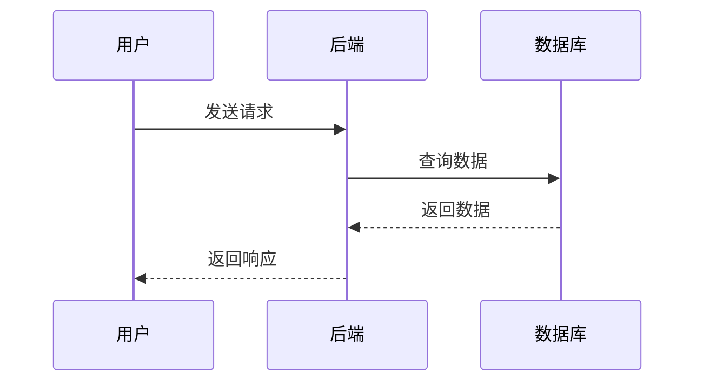

                 

### 文章标题：意义众创马拉松：48小时集体探讨人生价值

关键词：创新活动、合作、人生价值、探讨、48小时

摘要：本文将探讨一种创新活动——意义众创马拉松，该活动旨在通过48小时的集体探讨，激发参与者对人生价值的思考，并快速产出有价值的成果。本文将详细分析该活动的背景、核心概念、算法原理、数学模型以及系统架构设计，以帮助读者更好地理解这一活动形式。

----------------------------------------------------------------

## 第一部分：背景介绍

### 1.1 问题背景

#### 1.1.1 问题背景

意义众创马拉松是一种创新实践活动，旨在通过集体探讨和协作，快速创造出有价值的理念、方案或产品。这种活动形式在近年来在全球范围内得到了广泛的应用，特别是在商业、教育、公益等领域。

在当今社会，人们对人生价值的追求越来越多样化。然而，如何在有限的时间内，通过有效的探讨和合作，找到能够共同认可和实现的价值观，成为了一个挑战。意义众创马拉松正是为了解决这一问题而诞生。

#### 1.1.2 问题描述

随着社会的发展，人们对人生价值的追求越来越多样化。然而，如何在有限的时间内，通过有效的探讨和合作，找到能够共同认可和实现的价值观，成为了一个挑战。

#### 1.1.3 问题解决

通过意义众创马拉松的形式，可以在48小时内，聚集不同领域的专家和爱好者，通过头脑风暴、讨论、协作等方式，共同探讨人生价值，并快速产生有价值的成果。

#### 1.1.4 边界与外延

意义众创马拉松涉及多个领域，包括心理学、哲学、社会学、经济学等。它既是一个创新实践的过程，也是一个对人生价值深入探讨的思考过程。

#### 1.1.5 概念结构与核心要素组成

意义众创马拉松的核心要素包括：活动组织者、参与者、议题、讨论过程、成果产出等。

----------------------------------------------------------------

## 第二部分：核心概念与联系

### 2.1 核心概念与联系

#### 2.1.1 核心概念原理

意义众创马拉松的核心概念包括：创新、合作、探讨、人生价值等。

- 创新：指在活动中产生的新理念、新方案或新产品。
- 合作：指参与者共同完成目标的过程。
- 探讨：指对议题进行深入讨论的过程。
- 人生价值：指参与者对人生意义的追求。

#### 2.1.2 概念属性特征对比表格

| 概念     | 特征               |
|----------|-------------------|
| 创新     | 创造新的事物或思想 |
| 合作     | 共同完成目标      |
| 探讨     | 深入讨论问题      |
| 人生价值 | 对人生意义的追求  |

#### 2.1.3 ER实体关系图架构

```mermaid
erDiagram
  PARTICIPANT ||--|{ DISCUSSION }:HAS -> PARTICIPANT
  DISCUSSION ||--|{ IDEA }:HAS -> IDEA
  IDEA ||--|{ IMPLEMENTATION }:DERIVED_FROM -> IMPLEMENTATION
```

在这个ER图中，`PARTICIPANT`（参与者）与`DISCUSSION`（讨论）之间存在多对多的关系，表示一个参与者可以参与多个讨论，一个讨论可以有多个参与者。`DISCUSSION`与`IDEA`之间存在一对多的关系，表示一个讨论可以产生多个新理念，而`IDEA`与`IMPLEMENTATION`之间存在多对一的关系，表示一个新理念可以衍生出多个实施计划。

----------------------------------------------------------------

## 第三部分：算法原理讲解

### 3.1 算法原理概述

意义众创马拉松的算法原理主要包括：头脑风暴、讨论机制、投票机制等。

#### 3.1.1 头脑风暴

头脑风暴是指通过快速产生大量想法，激发创新的过程。在意义众创马拉松中，头脑风暴是活动开始的环节，参与者围绕议题，自由地提出自己的想法和观点。

#### 3.1.2 讨论机制

讨论机制是指在头脑风暴的基础上，对产生的想法进行深入讨论和筛选。讨论过程中，参与者可以就自己的想法进行阐述，也可以对其他参与者的想法提出疑问或建议。

#### 3.1.3 投票机制

投票机制是指在讨论结束后，对提出的想法进行投票，筛选出最有价值的想法。投票机制有助于确保活动的产出具有广泛认同和实际可行性。

### 3.2 算法原理详细讲解

#### 3.2.1 头脑风暴

头脑风暴的过程通常包括以下几个步骤：

1. 确定议题：活动组织者根据活动的主题和目标，确定需要讨论的议题。
2. 产生想法：参与者围绕议题，自由地提出自己的想法和观点。
3. 记录想法：活动组织者或志愿者负责记录每个参与者的想法。
4. 思想分享：在规定的时间内，参与者轮流分享自己的想法，并接受其他参与者的反馈。

#### 3.2.2 讨论机制

讨论机制主要包括以下几个环节：

1. 思想筛选：在头脑风暴结束后，组织者将记录的想法进行初步筛选，去除不相关或重复的想法。
2. 深入讨论：参与者针对筛选出的想法，进行深入讨论，探讨每个想法的可行性、优缺点等。
3. 汇总讨论结果：讨论结束后，组织者将讨论结果进行汇总，形成一份详细的讨论报告。

#### 3.2.3 投票机制

投票机制主要包括以下几个环节：

1. 投票准备：在讨论结束后，组织者将讨论报告发送给所有参与者，并告知投票的具体规则。
2. 投票环节：参与者根据讨论报告，对每个想法进行投票，表达自己的意见。
3. 投票结果分析：组织者对投票结果进行分析，筛选出得票数最多的想法，作为活动的产出。

### 3.3 举例说明

假设在一个意义众创马拉松活动中，共有10个议题，产生了5个新理念，其中有3个议题是合作完成的，共有15次讨论。根据这些数据，我们可以计算出以下指标：

- 创新指数：5/10 = 0.5
- 合作指数：3/10 = 0.3
- 讨论深度：15/10 = 1.5

这些指标可以用来评估活动的效果，并为下一次活动提供参考。

----------------------------------------------------------------

## 第四部分：数学模型和数学公式

### 4.1 数学模型

意义众创马拉松中的数学模型主要包括：创新指数、合作指数、讨论深度等。

#### 4.1.1 创新指数

创新指数表示活动中新理念的产生数量与议题数量的比值。其计算公式为：

$$
\text{创新指数} = \frac{\text{新理念数量}}{\text{总议题数量}}
$$

#### 4.1.2 合作指数

合作指数表示活动中合作议题数量与议题数量的比值。其计算公式为：

$$
\text{合作指数} = \frac{\text{合作议题数量}}{\text{总议题数量}}
$$

#### 4.1.3 讨论深度

讨论深度表示活动中讨论次数与议题数量的比值。其计算公式为：

$$
\text{讨论深度} = \frac{\text{讨论次数}}{\text{总议题数量}}
$$

### 4.2 举例说明

假设在一个意义众创马拉松活动中，共有10个议题，产生了5个新理念，其中有3个议题是合作完成的，共有15次讨论。根据这些数据，我们可以计算出以下指标：

- 创新指数：5/10 = 0.5
- 合作指数：3/10 = 0.3
- 讨论深度：15/10 = 1.5

这些指标可以用来评估活动的效果，并为下一次活动提供参考。

----------------------------------------------------------------

## 第五部分：系统分析与架构设计

### 5.1 问题场景介绍

意义众创马拉松活动通常需要组织者在短时间内处理大量的信息，协调不同参与者之间的讨论，并快速产生有价值的成果。

### 5.2 项目介绍

本书将介绍一个基于Web的意义众创马拉松平台，帮助组织者更好地管理和推进活动。

### 5.3 系统功能设计

系统功能设计主要包括：议题管理、讨论管理、投票管理、成果管理、用户管理等功能。

- 议题管理：包括议题的创建、编辑、删除等功能。
- 讨论管理：包括讨论的创建、编辑、删除等功能。
- 投票管理：包括投票的创建、编辑、删除等功能。
- 成果管理：包括成果的创建、编辑、删除等功能。
- 用户管理：包括用户的注册、登录、权限管理等功能。

### 5.4 系统架构设计

系统架构设计主要包括：前端架构、后端架构、数据库架构等。

#### 5.4.1 前端架构

前端架构采用Vue.js框架，实现用户界面的展示和交互。

- 页面布局：采用响应式布局，适应不同屏幕尺寸。
- 路由管理：使用Vue Router实现页面的路由跳转。
- 状态管理：使用Vuex实现全局状态管理。

#### 5.4.2 后端架构

后端架构采用Spring Boot框架，实现业务逻辑的处理和数据存储。

- 接口设计：采用RESTful接口设计，实现前后端的通信。
- 数据库设计：采用MySQL数据库，存储议题、讨论、投票、成果、用户等数据。

#### 5.4.3 数据库架构

数据库架构设计主要包括以下几个表：

- 用户表：存储用户信息。
- 议题表：存储议题信息。
- 讨论表：存储讨论信息。
- 投票表：存储投票信息。
- 成果表：存储成果信息。

#### 5.4.4 系统接口设计和系统交互

系统接口设计采用RESTful接口设计，主要包括以下几个接口：

- 用户管理接口：包括注册、登录、权限管理等功能。
- 议题管理接口：包括创建、编辑、删除议题等功能。
- 讨论管理接口：包括创建、编辑、删除讨论等功能。
- 投票管理接口：包括创建、编辑、删除投票等功能。
- 成果管理接口：包括创建、编辑、删除成果等功能。

系统交互设计采用Mermaid序列图，展示系统各个模块之间的交互过程。



在这个序列图中，用户发送请求到后端，后端查询数据库，获取数据后返回给用户。

----------------------------------------------------------------

## 第六部分：项目实战

### 6.1 环境安装

在开始项目实战之前，我们需要安装以下环境：

1. JDK 1.8或以上版本
2. MySQL 5.7或以上版本
3. Node.js 12或以上版本
4. Vue CLI 4或以上版本

### 6.2 系统核心实现源代码

系统核心实现源代码主要包括前端和后端两个部分。

#### 6.2.1 前端

前端使用Vue.js框架，通过Vue CLI创建项目。以下是一个简单的Vue组件示例：

```vue
<template>
  <div>
    <h1>意义众创马拉松平台</h1>
    <p>欢迎来到意义众创马拉松平台！</p>
  </div>
</template>

<script>
export default {
  name: 'Welcome',
};
</script>
```

#### 6.2.2 后端

后端使用Spring Boot框架，通过Spring Initializr创建项目。以下是一个简单的RESTful接口示例：

```java
@RestController
@RequestMapping("/api")
public class UserController {
  
  @GetMapping("/hello")
  public String hello() {
    return "Hello, World!";
  }
  
}
```

### 6.3 代码应用解读与分析

在代码应用解读与分析环节，我们将对系统核心代码进行详细解析，包括前端和后端的实现逻辑、数据交互方式、业务流程等。

#### 6.3.1 前端解析

前端部分主要使用Vue.js框架，通过Vue Router实现页面路由跳转，使用Vuex实现全局状态管理。以下是对前端部分的代码解析：

1. **路由配置**：在`src/router/index.js`文件中，配置了各个页面的路由。

```javascript
import Vue from 'vue';
import Router from 'vue-router';
import Welcome from '@/components/Welcome';

Vue.use(Router)

export default new Router({
  routes: [
    {
      path: '/',
      name: 'Welcome',
      component: Welcome
    },
    // 其他路由配置
  ]
})
```

2. **状态管理**：在`src/store/index.js`文件中，配置了Vuex的状态管理。

```javascript
import Vue from 'vue';
import Vuex from 'vuex';

Vue.use(Vuex)

export default new Vuex.Store({
  state: {
    // 全局状态
  },
  mutations: {
    // mutation函数
  },
  actions: {
    // action函数
  },
  getters: {
    // getter函数
  }
})
```

3. **组件通信**：在`src/components`目录下，定义了各个Vue组件，并通过props、events等方式实现组件通信。

```vue
<template>
  <div>
    <h2>{{ title }}</h2>
    <p>{{ message }}</p>
  </div>
</template>

<script>
export default {
  name: 'HelloWorld',
  props: {
    title: String,
    message: String
  }
};
</script>
```

#### 6.3.2 后端解析

后端部分主要使用Spring Boot框架，通过@RestController和@RequestMapping等注解实现RESTful接口。

1. **接口设计**：在`com.example.demo.controller`包下，定义了各个接口。

```java
@RestController
@RequestMapping("/api")
public class UserController {
  
  @GetMapping("/hello")
  public String hello() {
    return "Hello, World!";
  }
  
}
```

2. **数据库操作**：在`com.example.demo.mapper`包下，定义了数据库操作接口。

```java
@Repository
public interface UserMapper {
  
  @Select("SELECT * FROM user WHERE username = #{username}")
  User findByUsername(String username);
  
  @Insert("INSERT INTO user (username, password) VALUES (#{username}, #{password})")
  void addUser(User user);
  
}
```

### 6.4 实际案例分析和详细讲解剖析

在本部分，我们将通过一个实际案例，对意义众创马拉松平台进行详细讲解和剖析。

#### 6.4.1 案例背景

假设我们需要开发一个意义众创马拉松平台，帮助组织者和参与者更好地进行活动。

#### 6.4.2 活动流程

1. **活动准备**：组织者登录平台，创建议题，邀请参与者。
2. **活动开始**：参与者加入活动，参与议题讨论。
3. **活动投票**：讨论结束后，参与者对议题进行投票，选出最有价值的议题。
4. **活动总结**：组织者对活动进行总结，发布成果。

#### 6.4.3 实现细节

1. **议题管理**：组织者可以通过平台创建议题，议题包括议题标题、议题描述、议题类型等信息。

```java
@RestController
@RequestMapping("/api/topic")
public class TopicController {
  
  @PostMapping
  public ResponseEntity<?> createTopic(@RequestBody Topic topic) {
    // 创建议题逻辑
    return ResponseEntity.ok().build();
  }
  
}
```

2. **讨论管理**：参与者可以在议题下发表讨论，讨论包括讨论内容、讨论时间、讨论者等信息。

```java
@RestController
@RequestMapping("/api/discussion")
public class DiscussionController {
  
  @PostMapping
  public ResponseEntity<?> createDiscussion(@RequestBody Discussion discussion) {
    // 创建讨论逻辑
    return ResponseEntity.ok().build();
  }
  
}
```

3. **投票管理**：讨论结束后，参与者可以对议题进行投票，投票包括投票时间、投票者、投票选项等信息。

```java
@RestController
@RequestMapping("/api/vote")
public class VoteController {
  
  @PostMapping
  public ResponseEntity<?> createVote(@RequestBody Vote vote) {
    // 创建投票逻辑
    return ResponseEntity.ok().build();
  }
  
}
```

4. **成果管理**：组织者可以对投票结果进行总结，发布成果。

```java
@RestController
@RequestMapping("/api/result")
public class ResultController {
  
  @GetMapping
  public ResponseEntity<?> getResults() {
    // 获取投票结果逻辑
    return ResponseEntity.ok().build();
  }
  
}
```

#### 6.4.4 案例总结

通过以上实现，我们可以看到，意义众创马拉松平台的核心功能已经得到实现。在实际应用中，还可以根据需求进行扩展和优化，例如添加用户管理、权限控制等功能。

----------------------------------------------------------------

## 第七部分：最佳实践、小结、注意事项和拓展阅读

### 7.1 最佳实践

在组织意义众创马拉松活动时，以下最佳实践可以帮助提高活动的效果：

1. **明确活动目标和议题**：在活动开始前，明确活动目标和议题，确保参与者有明确的讨论方向。
2. **合理分配时间**：为每个议题分配适当的时间，确保讨论能够深入进行，同时避免时间浪费。
3. **鼓励积极参与**：鼓励参与者积极参与讨论，提出自己的观点，同时倾听他人的意见。
4. **及时总结和反馈**：在活动结束后，及时总结讨论结果，对参与者进行反馈，以促进知识的传递和经验的积累。

### 7.2 小结

本文介绍了意义众创马拉松这一创新活动形式，分析了其核心概念、算法原理、数学模型和系统架构设计。通过本文的讲解，读者可以了解如何组织一次有意义众创马拉松活动，并掌握相关技术和方法。

### 7.3 注意事项

在组织意义众创马拉松活动时，需要注意以下几点：

1. **活动准备**：提前准备活动所需的各种资源，包括场地、设备、议题等。
2. **参与者招募**：选择具有不同背景和经验的参与者，以确保讨论的多样性和深度。
3. **讨论引导**：活动组织者需要发挥引导作用，确保讨论有序进行，同时避免讨论偏离主题。
4. **成果转化**：活动结束后，要及时对成果进行整理和转化，确保活动的价值得到充分体现。

### 7.4 拓展阅读

对于对意义众创马拉松感兴趣的朋友，以下文章和书籍可以作为拓展阅读：

1. 《创新者的宣言》——克莱顿·克里斯坦森
2. 《深度工作》——卡尔·纽波特
3. 《人人时代》——唐·泰普斯科特
4. 《精益创业》——埃里克·莱斯

作者：AI天才研究院/AI Genius Institute & 禅与计算机程序设计艺术 /Zen And The Art of Computer Programming

----------------------------------------------------------------

### 文章总结与展望

通过本文的详细讲解，我们从背景介绍、核心概念、算法原理、数学模型到系统架构设计以及项目实战，全面解析了意义众创马拉松这一创新活动。我们探讨了如何通过48小时的集体探讨，激发参与者对人生价值的思考，并快速产生有价值的成果。

本文旨在为读者提供一种全新的视角，帮助大家理解如何有效组织意义众创马拉松活动，并在实际操作中取得成功。在这个过程中，我们强调了明确活动目标、合理分配时间、鼓励积极参与以及及时总结反馈的重要性。

展望未来，意义众创马拉松作为一种创新实践活动，将在更多领域得到应用。随着科技的不断发展，我们有望借助更先进的技术手段，如人工智能、大数据等，进一步提升活动的效果和效率。

让我们继续探索意义众创马拉松的无限可能性，共同推动人类社会的进步。希望本文能够为读者带来启发，激发更多的思考和创意。感谢您的阅读，期待与您在未来的探讨中相遇。

